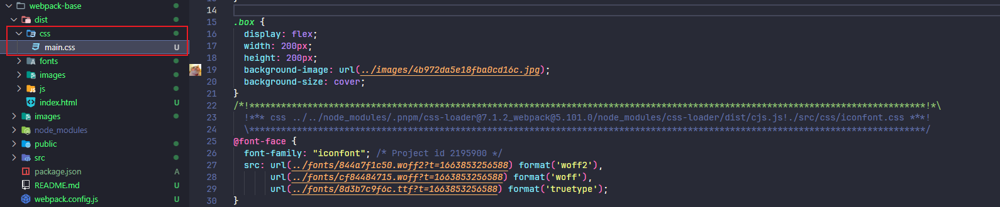
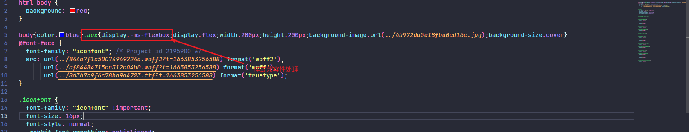
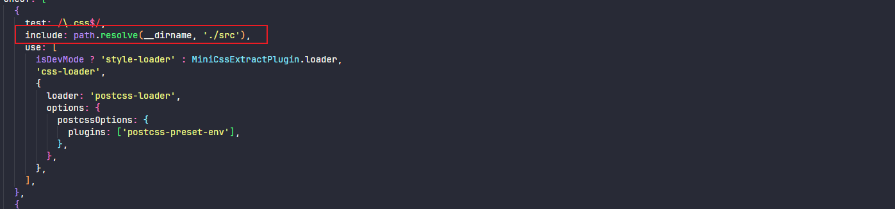

# Webpack基础入门

## 一、Webpack介绍

### 1.1、Webpack概述

webpack 是一个静态资源打包工具，它会以一个或多个文件作为打包的入口，将我们整个项目所有文件编译组合成一个或多个文件输出出去，输出的文件就是编译好的文件，就可以在浏览器运行了。

### 1.2、Webpack初次体验

项目初始化

```bash
npm init -y
```

下载相关依赖

```bash
npm i webpack webpack-cli -D
```

配置 scripts 脚本启动 webpack

```json
"scripts": {
  "dist": "npx webpack ./src/main.js --mode=development",
},
```

开发模式：仅能编译JS中的 ES Module 语法

```bash
npx webpack ./src/main.js --mode=development
```

生产模式：能编译JS中的 ES Module语法，还能压缩JS代码

```bash
npx webpack ./src/main.js --mode=production
```

## 二、Webpack核心概念

### 2.1、基本配置

| 配置项           | 作用                                                         |
| ---------------- | ------------------------------------------------------------ |
| entry（入口）    | 指示Webpack从那个文件开始打包                                |
| output（输出）   | 指示Webpack打包完的文件输出到哪里去，如何命名等              |
| loader（加载器） | Webpack本身只能处理js、json等资源，其他资源需要借助loader，Webpack才能解析 |
| plugins（插件）  | 扩展Webpack的功能                                            |
| mode（模式）     | 主要由两种模式：development（开发模式）、production（生产模式） |

### 2.2、webpack配置文件

在项目根目录新建文件 webpack.config.js

```javascript
const path = require('path');

module.exports = {
  // 入口
  entry: './src/main.js',

  // 输出
  output: {
    // 文件输出路径，规定是绝对路径
    path: path.resolve(__dirname, 'dist'),
    // 文件输出文件名
    filename: 'bundle.js',
  },

  // 加载器
  module: {},

  // 插件
  plugins: [],

  // 设置开发模式
  mode: 'development',
};
```

## 三、设置开发和生产模式

### 3.1、配置环境变量区分开发和生产

借助 cross-env 设置 Node 环境变量

```bash
npm i cross-env -D
```

配置 scripts 脚本

```json
"scripts": {
  "build": "cross-env NODE_ENV=production webpack",
  "dev": "cross-env NODE_ENV=development webpack serve"
},
```

修改 webpack.config.js 配置

```javascript
const isDevMode = process.env.NODE_ENV === 'development';

module.exports = {
  // 设置开发模式
  mode: isDevMode ? 'development' : 'production', // [!code ++]
};
```

### 3.2、配置SourceMap

SourceMap 的详情配置参考：https://webpack.docschina.org/configuration/devtool/#qualities

以下是开发环境和生产环境的推荐:

+ 开发环境:  eval-cheap-source-map
+ 生产环境:  hidden-source-map 

修改 webpack.config.js 配置

```javascript
const path = require('path');

const isDevMode = process.env.NODE_ENV === 'development';

module.exports = {
  devtool: isDevMode ? 'eval-cheap-source-map' : 'hidden-source-map ', // [!code ++]
};
```

## 四、Webpack搭建本地开发环境

### 4.1、配置开发环境热更新

安装相关依赖

```bash
npm i webpack-dev-server -D
```

在 webpack 中配置 devServer

```javascript
const path = require('path');

const isDevMode = process.env.NODE_ENV === 'development';

module.exports = {
  // 开发服务器
  devServer: {
    host: 'localhost',
    port: 8090,
    open: true,
    hot: true, // 热更新
  },
};
```

### 4.2、处理html资源

处理 html 资源需要用到 ` html-webpack-plugin ` 插件

作用：

+ 自动引入打包后的 js 文件
+ 不同 js 可以配置不同的 html 文件

下载插件

```bash
npm i html-webpack-plugin -D
```

修改 webpack.config.js 配置

```javascript
const HtmlWebpackPlugin = require('html-webpack-plugin'); // 引入

// 插件
plugins: [
  new HtmlWebpackPlugin({
      // 指定html文件
    template: path.resolve(__dirname,'public/index.html'),
  })
],
```

html-webpack-plugin 还有很多相关其他配置，可以参考官网地址：https://github.com/jantimon/html-webpack-plugin

### 4.3、处理样式资源

#### 4.3.1、处理css样式

下载相关依赖

```javascript
npm i style-loader css-loader -D
```

创建 css 文件，并且在 main.js 进行引入

```javascript
import { mul } from './math';
import './css/demo.css';

console.log(mul(50, 3));
```

调整 webpack.config.js 的配置 

```javascript
const HtmlWebpackPlugin = require('html-webpack-plugin');
const path = require('path');

const isDevMode = process.env.NODE_ENV === 'development';

module.exports = {
  // 加载器
  module: {
    rules: [
      {
        test: /\.css$/, // 自检测.css文件
        // use的执行顺序：从右到左（从下到上）
        use: [
          'style-loader', // 将js中的css通过创建style标签添加html文件生效
          'css-loader', // 将css资源编译成common.js模块到js中
        ],
      },
    ],
  },
};
```

引入的 css 此时不会单独生成 css 文件，而是被 js 动态创建 style 标签引入


注意：use的执行顺序：从右到左（从下到上）

#### 4.3.2、处理sass资源

下载相关依赖

```javascript
npm i sass-loader sass -D
```

调整 webpack.config.js 配置

```javascript
const HtmlWebpackPlugin = require('html-webpack-plugin');
const path = require('path');

const isDevMode = process.env.NODE_ENV === 'development';

module.exports = {
  // 加载器
  module: {
    rules: [
      {
        test: /\.css$/, // 自检测.css文件
        // use的执行顺序：从右到左（从下到上）
        use: [
          'style-loader', // 将js中的css通过创建style标签添加html文件生效
          'css-loader', // 将css资源编译成common.js模块到js中
        ],
      },
      {
        test: /\.s[ac]ss/,
        use: [
          'style-loader', // 将js中的css通过创建style标签添加html文件生效
          'css-loader', // 将css资源编译成common.js模块到js中
          'sass-loader', // 将sass编译成css文件
        ],
      },
    ],
  },
};

```

注意：同时在入口文件引入 scss 文件

```javascript
import { mul } from './math';
import './css/demo.css';
import './css/base.scss';

console.log(mul(50, 3));
```

### 4.4、处理图片资源

在 public/index.html中引入

```html
<!DOCTYPE html>
<html lang="en">
  <head>
    <meta charset="UTF-8" />
    <meta
      name="viewport"
      content="width=device-width, initial-scale=1.0" />
    <title>Document</title>
  </head>
  <body>
    哈哈哈哈
    <div class="box"></div> // [!code ++]
  </body>
</html>
```

在 scss 的样式文件添加背景图片

```scss
.box {
  display: flex;
  width: 200px;
  height: 200px;
  background-image: url("../images/cat.jpg");
  background-size: cover;
}
```

调整 webpack.config.js 配置

```javascript
const HtmlWebpackPlugin = require('html-webpack-plugin');
const path = require('path');

const isDevMode = process.env.NODE_ENV === 'development';

module.exports = {

  // 加载器
  module: {
    rules: [
      {
        test: /\.(png|jpe?g|gif|webp|svg)$/,
        type: 'asset',
      },
    ],
  },
};

```

### 4.5、处理字体图标资源

在 public/index.html 中引入

```html
<body>
  哈哈哈哈
  <div class="box"></div>
  <span class="iconfont iconfacebook"></span> // [!code ++]
  <span class="iconfont iconbofangqi-bofang"></span> // [!code ++]
</body>
```

注意：字体图标使用 iconfont.css 对应字体文件目录

```css
@font-face {
  font-family: "iconfont"; /* Project id 2195900 */
  src: url('../fonts/iconfont.woff2?t=1663853256588') format('woff2'),
       url('../fonts/iconfont.woff?t=1663853256588') format('woff'),
       url('../fonts/iconfont.ttf?t=1663853256588') format('truetype');
}

.iconfont {
  font-family: "iconfont" !important;
  font-size: 16px;
  font-style: normal;
  -webkit-font-smoothing: antialiased;
  -moz-osx-font-smoothing: grayscale;
}

.iconbofangqi-bofang:before {
  content: "\e6a4";
}

.iconguanbi1:before {
  content: "\e659";
}

.iconguanbi:before {
  content: "\eb6a";
}

.iconxiangshang:before {
  content: "\e66b";
}

.iconusherplus:before {
  content: "\e600";
}

.icontwitter:before {
  content: "\e655";
}

.iconfacebook:before {
  content: "\e953";
}

.iconpinterest:before {
  content: "\e601";
}

.icondirection-right:before {
  content: "\e66c";
}

.icondirection-left:before {
  content: "\e66d";
}

.iconshubiao:before {
  content: "\e628";
}

.iconresume-line:before {
  content: "\e64a";
}

.iconzhedie:before {
  content: "\e643";
}

.iconruanjianzhongxin:before {
  content: "\e60f";
}
```

并且需要在 main.js 入口文件引入字体 css 文件

```javascript
import { mul } from './math';
import './css/demo.css';
import './css/base.scss';
import './css/iconfont.css'; // [!code ++]

console.log(mul(50, 3));
```

调整 webpack.config.js 文件

```javascript
const HtmlWebpackPlugin = require('html-webpack-plugin');
const path = require('path');

const isDevMode = process.env.NODE_ENV === 'development';

module.exports = {
  // 加载器
  module: {
    rules: [
      {
        test: /\.(png|jpe?g|gif|webp|svg)$/,
        type: 'asset',
      },
      {
        test: /\.(ttf|woff2?)$/,
        type: 'asset/resource',
      },
    ],
  },
};
```

### 4.6、处理其他资源

```javascript
const HtmlWebpackPlugin = require('html-webpack-plugin');
const path = require('path');

const isDevMode = process.env.NODE_ENV === 'development';

module.exports = {
  // 加载器
  module: {
    rules: [
      {
        test: /\.(png|jpe?g|gif|webp|svg)$/,
        type: 'asset',
      },
      {
        // test: /\.(ttf|woff2?)$/, // [!code --]
        test: /\.(ttf|woff2?|mp3|mp4|avi)$/, // [!code ++]
        type: 'asset/resource',
      },
    ],
  },
};
```

### 4.7、处理js资源

在处理 js 涉及 js 的语法兼容性处理和压缩处理，详细的可以参考 babel 的使用和 babel 在webpack中的使用，这里不做详细的解析

## 五、Webpack搭建生产环境

生产模式要求我们的对 html 文件、css 样式文件、js 文件等进行兼容和压缩处理，基于这个需要针对兼容和压缩这两个操作而作一些处理。

### 5.1、提取 css 成单独文件

安装相关依赖

```bash
npm i mini-css-extract-plugin -D
```

在匹配 css 或者 scss、less 中添加  MiniCssExtractPlugin.loader，且不再需要 style-loader

```javascript
module.exports = {
  // 加载器
  module: {
    rules: [
      {
        test: /\.css$/, // 自检测.css文件
        // use的执行顺序：从右到左（从下到上）
        use: [
          MiniCssExtractPlugin.loader, // [!code ++]
          // 'style-loader', // 将js中的css通过创建style标签添加html文件生效 // [!code --]
          'css-loader', // 将css资源编译成common.js模块到js中
        ],
      },
      {
        test: /\.s[ac]ss/,
        use: [	
          MiniCssExtractPlugin.loader, // [!code ++]
          // 'style-loader', // 将js中的css通过创建style标签添加html文件生效 // [!code --]
          'css-loader', // 将css资源编译成common.js模块到js中
          'sass-loader', // 将sass编译成css文件
        ],
      },
    ],
  },
}
```

还需要再 plugins 配置中添加 MiniCssExtractPlugin 使用

```javascript
const HtmlWebpackPlugin = require('html-webpack-plugin');
const MiniCssExtractPlugin = require('mini-css-extract-plugin');
const path = require('path');

module.exports = {
  // 插件
  plugins: [
    new HtmlWebpackPlugin({
      // 指定html文件
      template: path.resolve(__dirname, 'public/index.html'),
    }),
    new MiniCssExtractPlugin({
      filename: 'css/main.css', // 打包到 dist/css 目录中
    }),
  ],
};
```



### 5.2、样式兼容性处理

安装相关依赖包

```bash
npm i postcss-loader postcss postcss-preset-env -D
```

在 webpack.config.js 配置的使用

```javascript
const HtmlWebpackPlugin = require('html-webpack-plugin');
const MiniCssExtractPlugin = require('mini-css-extract-plugin');
const path = require('path');

module.exports = {
  // 加载器
  module: {
    rules: [
      {
        test: /\.css$/,
        use: [
          MiniCssExtractPlugin.loader,
          'css-loader',
          {
            loader: 'postcss-loader',
            options: {
              postcssOptions: {
                plugins: [
                  'postcss-preset-env', // 处理样式兼容性问题
                ],
              },
            },
          },
        ],
      },
      {
        test: /\.s[ac]ss/,
        use: [
          MiniCssExtractPlugin.loader,
          'css-loader',
          {
            loader: 'postcss-loader',
            options: {
              postcssOptions: {
                plugins: [
                  'postcss-preset-env', // 处理样式兼容性问题
                ],
              },
            },
          },
          'sass-loader',
        ],
      },
      {
        test: /\.(png|jpe?g|gif|webp|svg)$/,
        type: 'asset',
      },
      {
        test: /\.(ttf|woff2?|mp3|mp4|avi)$/,
        type: 'asset/resource',
      },
    ],
  },

  // 插件
  plugins: [
    new HtmlWebpackPlugin({
      // 指定html文件
      template: path.resolve(__dirname, 'public/index.html'),
    }),
    new MiniCssExtractPlugin({
      filename: 'css/main.css', // 打包到 dist/css 目录中
    }),
  ],
};
```

注意：要放在 css-loader 之后，sass-loader 和 less-loader 之前

在 package.json 设置兼容版本(设置兼容版本形式多样，这里不做详细讲解)

```json
"browserslist": [
  "ie >= 8"
]
```

实现效果



### 5.3、css压缩处理

安装相关依赖

```bash
npm i css-minimizer-webpack-plugin -D
```

在 webpack.config.js 配置引入

```javascript
const CssMinimizerWebpackPlugin = require('css-minimizer-webpack-plugin');

module.exports = {
  // 插件
  plugins: [
    new HtmlWebpackPlugin({
      // 指定html文件
      template: path.resolve(__dirname, 'public/index.html'),
    }),
    new MiniCssExtractPlugin({
      filename: 'css/main.css', // 打包到 dist/css 目录中
    }),
    new CssMinimizerWebpackPlugin(), // [!code ++]
  ],
};
```

### 5.4、html和js的压缩

webpack 开启生产模式时，默认开启 js 和 html 的压缩。如果需要对 js 压缩配置选项，可以在 optimization 中 minimizer 配置插件

```javascript
const TerserWebpackPlugin = require('terser-webpack-plugin');
const os = require('os');
const threads = os.cpus().length;

module.exports = {
  // 代码分割
  optimization: {
    minimizer: [
      new CssMinimizerWebpackPlugin(), // [!code ++]
      new TerserWebpackPlugin({
        parallel: threads, // 开启多进程压缩, 可以设置true，和进程数量
      }),
    ],
  },
};
```

并且 CssMinimizerWebpackPlugin 插件可以从 plugins 移除，并且可以挪到 minimizer 中使用

### 5.5、文件打包后的目录优化以及命名优化

js目录以及命名优化

```javascript
// 输出
output: {
  // 文件输出路径，规定是绝对路径
  path: path.resolve(__dirname, 'dist'),
  // 文件输出文件名
  // filename: 'bundle.js', // [!code --]
  filename: 'js/[name].js', // [!code ++]
  // 自动清空上次打包的内容
  // 原理： 在打包前，将path整个目录内容清空，再进行打包
  clean: true,
},
```

资源文件命令优化

```javascript
{
  test: /\.(png|jpe?g|gif|webp|svg)$/,
  type: 'asset',
  generator: { // [!code ++]
    // 输出图片的路径
    // [hash:10] hash取前10位
    filename: 'images/[hash:10][ext][query]',
  },
},
{
  test: /\.(ttf|woff2?|mp3|mp4|avi)$/,
  type: 'asset/resource',
  generator: { // [!code ++]
    // 输出字体图标的路径
    // [hash:10] hash取前10位
    filename: 'fonts/[hash:10][ext][query]',
  },
},
```

css 目录和命名优化

```javascript
// 插件
plugins: [
  new MiniCssExtractPlugin({
    // filename: 'css/main.css', // 打包到 dist/css 目录中 // [!code --]
    filename: 'css/[name].[contenthash:5].css', // [!code ++]
    chunkFilename: 'css/[id].[contenthash:5].css', // [!code ++]
  }),
],
```

## 六、Webpack构建优化

### 6.1、图片资源优化

```javascript
module.exports = {
  // 入口
  entry: './src/main.js',

  // 输出
  output: {
    path: path.resolve(__dirname, 'dist'),
    filename: 'js/[name].js',
    clean: true,
  },

  // 加载器
  module: {
    rules: [
      {
        test: /\.(png|jpe?g|gif|webp|svg)$/,
        type: 'asset',
        parser: {
          // 图片资源优化配置
          dataUrlCondition: {
            // 小于10kb的图片转base64
            // 优点：减少请求数量， 缺点：体积会更大，并且打包后不会输出对应图片
            // 推荐：对应几kb的可以转base64
            maxSize: 10 * 1024, // 10kb
          },
        },
        generator: {
          filename: 'images/[hash][ext][query]',
        },
      },
    ],
  },

};
```

### 6.2、OneOf 配置优化

作用：让文件只被其中一个配置进行处理

```javascript
module.exports = {
  // 加载器
  module: {
    rules: [
      {
        oneOf: [
          {
            test: /\.js/,
            include: path.resolve(__dirname, './src'),
            use: [
              {
                loader: 'thread-loader', // 多进程打包
                options: {
                  workers: threads,
                },
              },
            ],
          },
          {
            test: /\.css$/,
            include: path.resolve(__dirname, './src'),
            use: [
              isDevMode ? 'style-loader' : MiniCssExtractPlugin.loader,
              'css-loader',
              {
                loader: 'postcss-loader',
                options: {
                  postcssOptions: {
                    plugins: ['postcss-preset-env'],
                  },
                },
              },
            ],
          },
          {
            test: /\.s[ac]ss/,
            include: path.resolve(__dirname, './src'),
            use: [
              isDevMode ? 'style-loader' : MiniCssExtractPlugin.loader,
              'css-loader',
              {
                loader: 'postcss-loader',
                options: {
                  postcssOptions: {
                    plugins: ['postcss-preset-env'],
                  },
                },
              },
              'sass-loader',
            ],
          },
          {
            test: /\.(png|jpe?g|gif|webp|svg)$/,
            include: path.resolve(__dirname, './src'),
            type: 'asset',
            parser: {
              dataUrlCondition: {
                // 小于10kb的图片转base64
                // 优点：减少请求数量， 缺点：体积会更大，并且打包后不会输出对应图片
                // 推荐：对应几kb的可以转base64
                maxSize: 10 * 1024, // 10kb
              },
            },
            generator: {
              filename: 'images/[hash][ext][query]',
            },
          },
          {
            test: /\.(ttf|woff2?|mp3|mp4|avi)$/,
            include: path.resolve(__dirname, './src'),
            type: 'asset/resource',
            generator: {
              filename: 'fonts/[hash:10][ext][query]',
            },
          },
        ],
      },
    ],
  },
};
```

### 6.3、include | exclude

include：包含只处理xxx文件，exclude：排除除了xxx文件其他文件都处理，两个只能写一个。



### 6.4、多进程打包

当项目越来越大时，打包速度越来越慢，多进程打包开启电脑的多个进程同时干一件事。

安装依赖包

```bash
npm i thread-loader -D
```

同时需要 node 的 os 模块获取电脑的 cpu 核数

```javascript
const os = require('os')
const threads = os.cpus().length
```

```javascript
{
  test: /\.js/,
  include: path.resolve(__dirname, './src'),
  use: [
    {
      loader: 'thread-loader', // 多进程打包
      options: {
        workers: threads,
      },
    },
  ],
},
```

注意： 请仅在特别耗时的操作中使用，因为每个进程启动就有大约600ms左右的开销

### 6.5、TreeShaking

TreeShaking 主要对于没有引用的 `dead code` 在生产环境中不参与构建打包。webpack 在做 tree-sharking 的时候，发现模块没有被引用就会被删除，在mode："production" 下 webpack 默认开启。

需要注意的是配置 package.json 的 sideEffects

sideEffects 设置 true，指定所有引用未使用的文件都是有作用的，不可以删除代码

sideEffects 设置 false，指定所有引用未使用文件都是无作用的，可以删除代码

在入口文件中引入 css，scss 样式等文件时

```javascript
import { mul, add } from './math';
import './css/demo.css';
import './css/base.scss';
import './css/iconfont.css';

console.log(mul(50, 3));
```

当设置 sideEffects：false 时, 因为 css 不是 js 代码，引入时被 webpack 当作引入未使用，会剔除 css 代码。

所以，设置 sideEffects：true 时，虽然可以让 css 样式文件生效，但是 js 就无法做 TreeShaking。

但是 sideEffects 的不仅仅只有 true 和 false ，还可以通过设置数组配置

```javascript
"sideEffects": [
  "*.css",
  "*.scss"
],
```

### 6.6、CodeSplit

打包代码时会将所有的 js 文件打包到一个文件中，体积太大了，我们如果只有渲染首页,就应该只加载首页的 js 文件，其他文件不应该加载。

CodeSplit 主要做了两件事：

1. 分割文件：将打包生成的文件进行分割，生成多个 js 文件
2. 按需加载：需要那个文件就加载那个文件

#### 6.6.1、单入口

一般设置以下即可

```javascript
// 代码分割
optimization: {
  usedExports: true,
  // 压缩操作
  minimizer: [
    new CssMinimizerWebpackPlugin(),
    new TerserWebpackPlugin({
      parallel: threads // 开启多进程压缩, 可以设置true，和进程数量
    })
  ],
  splitChunks: {
    chunks: "all",
  }
},
```

#### 6.6.2、多入口

```javascript

// 代码分割
optimization: {
  usedExports: true,
  // 压缩操作
  minimizer: [
    new CssMinimizerWebpackPlugin(),
    new TerserWebpackPlugin({
      parallel: threads // 开启多进程压缩, 可以设置true，和进程数量
    })
  ],
  splitChunks: {
    chunks: "all", // 对所有模块都进行分割
    /* 以下是默认值 */
    minSize: 20000, // 分割代码最小的大小
    minRemainingSize: 0, // 类似于minSize，最后确保提取的文件大小不能为0
    minChunks: 1, // 至少被引用的次数，满足条件才会代码分割
    maxAsyncRequests: 30, // 按需加载时并行加载的文件最大数量
    maxInitialRequests: 30, // 入口js文件最大并行请求数量
    enforceSizeThreshold: 50000, // 超过50kb一定会单独打包（此时会忽略minRemainingSize、maxAsyncRequests、maxInitialRequests）
    cacheGroups: {
      defaultVendors: { // 组名
        test: /[\\/]node_modules[\\/]/, // 需要打包到一起的模块
        priority: -10, // 权重（越大越高）
        reuseExistingChunk: true, // 如果当前 chunk 包含已从主bundle中拆分的模块，则它将被重用，而不是生成新的模块
      },
      default: {
        minChunks: 2,
        priority: -20,
        reuseExistingChunk: true
      }
    }
  }
},
```


