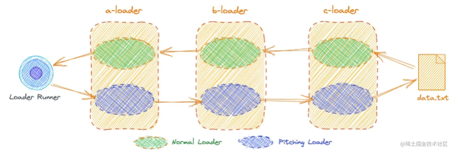
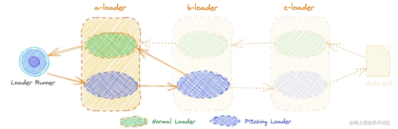
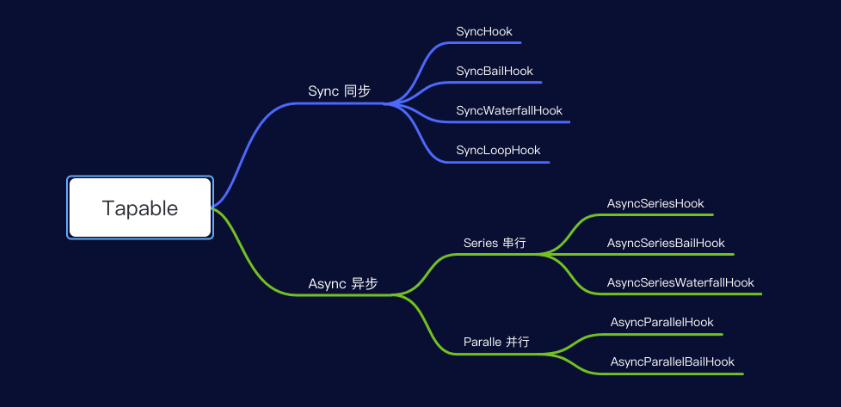

# Webpack高级

## 一、loader开发

### 2.1、loader介绍

loader 是导出为一个函数的 node 模块。该函数在 loader 转换资源的时候调用。给定的函数将调用 [Loader API](https://www.webpackjs.com/api/loaders/)，并通过 `this` 上下文访问

### 2.2、单个loader简单使用

webpack.config.js 配置

```javascript
module: {
  rules: [
    {
      test: /\.js$/,
      include: path.resolve(__dirname, './src'),
      use: [
        {
          loader: path.resolve('./lib/loader/simple.js'),
          options: {
            data: 10,
          },
        },
      ],
    },
  ],
},
```

loader/simple.js 代码

```javascript
const { validate } = require('schema-utils');

const schema = {
  type: 'object',
  properties: {
    data: {
      type: 'number',
    },
  },
};

/**
 * @param {string|Buffer} source 源文件的内容
 * @param {object} map  [map] 可以被 https://github.com/mozilla/source-map 使用的 SourceMap 数据
 * @param {any} meta [meta] meta 数据，可以是任何内容
 * @returns
 */
function loader(source, map, meta) {
  /**
   * 获取 options
   */
  const options = this.getOptions();

  validate(schema, options, {
    name: 'Example Loader',
    baseDataPath: 'options',
  });

  return source;
}

module.exports = loader;
```

像 `this.getOptions()` 可以获取 options 的参数，`this` 代表了 Loader API，详细可访问内容见 [Loader API](https://www.webpackjs.com/api/loaders/)。

其中 `schema-utils` 库可以用来检验传递的 options 的类型是否正确。如果需要开发一个 loader，可以使用 webpack-defaults 库来生成 loader 的样本代码。

```bash
$ npm install @webpack-contrib/defaults --save-dev
```

```bash
npm run defaults
```

### 2.3、loader分类

在 Webpack 中，loader 可以被分为 4 类：pre 前置、post 后置、normal 普通和 inline 行内。其中 pre 和 post loader，可以通过 `rule` 对象的 `enforce` 属性来指定。

```javascript
module: {
  rules: [
    {
      test: /\.js$/,
      include: path.resolve(__dirname, './src'),
      use: [path.resolve('./lib/loader/pre.js')], // pre loader
      enforce: 'pre',
    },
    {
      test: /\.js$/,
      include: path.resolve(__dirname, './src'),
      use: [path.resolve('./lib/loader/post.js')], // post loader
      enforce: 'post',
    },
    {
      test: /\.js$/,
      include: path.resolve(__dirname, './src'),
      use: [path.resolve('./lib/loader/normal.js')], // normal loader
    },
  ],
},
```

```bash
// 打印结果
pre loader
normal loader
post loader
```

loader 内联方式（inline）使用

```javascript
import Styles from 'style-loader!css-loader?modules!./styles.css';
```

使用 `!` 将资源中的 loader 分开，每个部分都会相对于当前目录解析。

通过为内联 `import` 语句添加前缀，可以覆盖配置中的所有 loader, preLoader 和 postLoader

使用 `!` 前缀，将禁用所有已配置的 normal loader(普通 loader)

```javascript
import Styles from '!style-loader!css-loader?modules!./styles.css';
```

使用 `!!` 前缀，将禁用所有已配置的 loader（preLoader, loader, postLoader）

```javascript
import Styles from '!!style-loader!css-loader?modules!./styles.css';
```

使用 `-!` 前缀，将禁用所有已配置的 preLoader 和 loader，但是不禁用 postLoaders

```javascript
import Styles from '-!style-loader!css-loader?modules!./styles.css';
```

### 2.4、Normal loader 和 Pitch Loader

webpack.config.js 配置

```javascript
module: {
  rules: [
    /** Normal loader 和 Pitch Loader */
    {
      test: /\.js$/,
      include: path.resolve(__dirname, './src'),
      use: [
        {
          loader: path.resolve('./lib/loader/a.js'),
        },
        {
          loader: path.resolve('./lib/loader/b.js'),
        },
        {
          loader: path.resolve('./lib/loader/c.js'),
        },
      ],
    },
  ],
},
```

normal loader 的执行顺序是 `从下往上、从右往左`，同时导出的 loader 函数可以设置一个 pitch 属性，该属性接收一个函数。

```javascript
function loader(source, map, meta) {
  console.log('c loader');

  return source;
}

/**
 * @param {*} remainingRequest 剩余请求
 * @param {*} precedingRequest 前置请求
 * @param {*} data 数据对象
 */
loader.pitch = function (remainingRequest, precedingRequest, data) {
  console.log('c pitch loader');
};

module.exports = loader;
```

当为每一个 loader 添加 pitch 属性，并执行构建，查看 loader 执行打印顺序

```bash
a pitch loader
b pitch loader
c pitch loader
c loader
b loader
a loader
```

Pitching Loader 的执行顺序是 `从上往下，从左到右`，总的执行顺序如下



### 2.5、Pitching Loader 的熔断机制

当 pitching Loader 函数返回一个 `非undefined` 的值时，会触发熔断机制，跳过了剩下的 loader。

当修改 b-loader 时，返回一个值，再次执行构建

```javascript
function loader(source, map, meta) {
  console.log('b loader');

  return source;
}

loader.pitch = function (remainingRequest, precedingRequest, data) {
  console.log('b pitch loader');

  return 'Hello';
};

module.exports = loader;
```

```bash
// 打印的顺序，在 b-loader 的 pitch 中返回数据传递给了 a-loader
a pitch loader
b pitch loader
Hello
a loader
```



### 2.6、同步和异步loader

对于 loader 无论是同步还是异步，pitch loader 发生熔断时，后续 loader 如果是异步 loader 也是不会执行的。

当将 b-loader 和 c-loader 改成异步loader 时

```javascript
// b-loader
async function loader(source, map, meta) {
  console.log('b loader');

  return source;
}

loader.pitch = function (remainingRequest, precedingRequest, data) {
  console.log('b pitch loader');

  return 'Hello';
};

module.exports = loader;
```

```javascript
// c-loader
async function loader(source, map, meta) {
  console.log('c loader');

  return source;
}

loader.pitch = function (remainingRequest, precedingRequest, data) {
  console.log('c pitch loader');
};

module.exports = loader;
```

```bash
// 执行构建编译查看顺序
a pitch loader
b pitch loader
Hello
a loader
```

在没有 pitch 函数的情况下，异步 loader 如何将处理后的源代码传递到下一个同步 loader 

第一种：通过 return 的方式

```javascript
async function loader(source, map, meta) {
  console.log('b loader');
  // const callback = this.async();

  // callback(null, source);
  return source;
}

module.exports = loader;
```

第二种：通过 callback 的形式，callback 可以通过 this.async() 获取，并且 callback 必须调用并返回值

```javascript
async function loader(source, map, meta) {
  console.log('b loader');
  const callback = this.async();
  callback(null, source);
}

module.exports = loader;
```

## 二、plugin插件开发

### 2.1、插件创建

webpack 插件由以下组成：

- 一个 JavaScript 命名函数或 JavaScript 类。
- 在插件函数的 prototype 上定义一个 `apply` 方法。
- 指定一个绑定到 webpack 自身的 [事件钩子](https://www.webpackjs.com/api/compiler-hooks/)。
- 处理 webpack 内部实例的特定数据。
- 功能完成后调用 webpack 提供的回调。

```javascript
const { validate } = require('schema-utils');

// 选项对象的 schema
const schema = {
  type: 'object',
  properties: {
    test: {
      type: 'string',
    },
  },
};

// 一个 JavaScript 类
class HelloWorldPlugin {
  // 传递过来的 options
  constructor(options = {}) {
    validate(schema, options, {
      name: 'Hello World Plugin',
      baseDataPath: 'options',
    });
  }

  // 在插件函数的 prototype 上定义一个 `apply` 方法，以 compiler 为参数。
  apply(compiler) {
    // 指定一个挂载到 webpack 自身的事件钩子。
    compiler.hooks.emit.tapAsync('HelloWorldPlugin', (compilation, callback) => {
      console.log('这是一个示例插件！');

      callback();
    });
  }
}

module.exports = HelloWorldPlugin;
```

### 2.2、compiler 和 compilation 理解

在 webpack 的构建过程中，compiler 和 compilation 是两个最核心的概念，它们分别代表了编译器实例和单次编译过程。

compiler 是 webpack 的主环境对象，包含所有配置信息，包括 options 和 loaders、plugins 等，在 webpack 启动时会实例化一个 compiler 对象，该对象在整个生命周期中都存在，只会被创建一次。

```javascript
const webpack = require('webpack');

const compiler = webpack({
  // ...
});

compiler.run((err, stats) => {
  // ...

  compiler.close((closeErr) => {
    // ...
  });
});
```

compilation 代表一次单独的编译过程，包含了当前模块的资源，编译生成的资源，变化的文件等信息。每次文件变化都会创建一个新的 compilation 实例

### 2.3、webpack钩子函数

在 webpack 配置文件中，插件是按照它们在 plugins 数组中的顺序依次执行的。也就是说，先声明的插件会先执行，后声明的插件会后执行。

```javascript
plugins: [
  new HtmlWebpackPlugin({
    template: path.resolve(__dirname, 'public/index.html'),
  }), // 第一个执行
  new HelloWorldPlugin(), // 第二个执行
  new ExamplePlugin(), // 第三个执行
],
```

在不同插件中都定义了  compiler.hooks.initialize.tap 相同钩子函数时，会按照 plugins 数组的顺序依次执行的。

在 webpack 中，钩子（Hooks）是执行各种任务的关键点，它们允许你在构建过程中的不同阶段插入自定义的代码。理解 webpack 的钩子执行顺序对于优化构建过程、解决构建问题至关重要。

以下是 compiler 部分钩子执行顺序

```javascript
class ExamplePlugin {
  apply(compiler) {
    // 在编译器准备环境时调用，时机就在配置文件中初始化插件之后
    // 无回调参数
    compiler.hooks.environment.tap('ExamplePlugin', () => {
      console.log('environment hook');
    });

    // 当编译器环境设置完成后，在 environment hook 后直接调用
    // 无回调参数
    compiler.hooks.afterEnvironment.tap('ExamplePlugin', () => {
      console.log('afterEnvironment hook');
    });

    // 在 webpack 选项中的 entry 被处理过之后调用
    // 回调参数：context, entry
    compiler.hooks.entryOption.tap('ExamplePlugin', (context, entry) => {
      console.log('entryOption hook');
    });

    // 在初始化内部插件集合完成设置之后调用
    // 回调参数：compiler
    compiler.hooks.afterPlugins.tap('ExamplePlugin', (compiler) => {
      console.log('afterPlugins hook');
    });

    // resolver 设置完成之后触发
    // 回调参数：compiler
    compiler.hooks.afterResolvers.tap('ExamplePlugin', (compiler) => {
      console.log('afterResolvers hook');
    });

    // 当编译器对象被初始化时调用
    // 无回调参数
    compiler.hooks.initialize.tap('ExamplePlugin', () => {
      console.log('initialize hook');
    });

    // 在开始执行一次构建之前调用，compiler.run 方法开始执行后立刻进行调用
    // 回调参数：compiler
    compiler.hooks.beforeRun.tapAsync('ExamplePlugin', (compiler, callback) => {
      console.log('beforeRun hook');
      callback();
    });

    // 在开始读取 records 之前调用
    // 回调参数：compiler
    compiler.hooks.run.tapAsync('ExamplePlugin', (compiler, callback) => {
      console.log('run hook');
      callback();
    });

    // NormalModuleFactory 创建之后调用
    // 回调参数：normalModuleFactory
    compiler.hooks.normalModuleFactory.tap('ExamplePlugin', (normalModuleFactory) => {
      console.log('normalModuleFactory hook');
    });

    // ContextModuleFactory 创建之后调用
    // 回调参数：contextModuleFactory
    compiler.hooks.contextModuleFactory.tap('ExamplePlugin', (contextModuleFactory) => {
      console.log('contextModuleFactory hook');
    });

    // 在创建 compilation parameter 之后执行
    // 回调参数：compilationParams
    compiler.hooks.beforeCompile.tapAsync('ExamplePlugin', (compilationParams, callback) => {
      console.log('beforeCompile hook');
      callback();
    });

    // beforeCompile 之后立即调用，但在一个新的 compilation 创建之前。这个钩子不会被复制到子编译器
    // 回调参数：compilationParams
    compiler.hooks.compile.tap('ExamplePlugin', (compilationParams) => {
      console.log('compile hook');
    });

    // compilation 创建之后执行
    // 回调参数：compilation compilationParams
    compiler.hooks.compilation.tap('ExamplePlugin', (compilation, compilationParams) => {
      console.log('compilation hook');
    });

    // compilation 结束和封印之后执行
    // 回调参数：compilation
    compiler.hooks.afterCompile.tapAsync('ExamplePlugin', (compilation, callback) => {
      console.log('afterCompile hook');
      callback();
    });

    // 在输出 asset 之前调用。返回一个布尔值，告知是否输出
    // 回调参数：compilation
    compiler.hooks.shouldEmit.tap('ExamplePlugin', (compilation) => {
      console.log('shouldEmit hook');
      // 返回 true 以输出 output 结果，否则返回 false
      return true;
    });

    // 输出 asset 到 output 目录之前执行。这个钩子不会被复制到子编译器
    // 回调参数：compilation
    compiler.hooks.emit.tapAsync('ExamplePlugin', (compilation, callback) => {
      console.log('emit hook');
      callback();
    });

    // 输出 asset 到 output 目录之后执行。这个钩子不会被复制到子编译器
    // 回调参数：compilation
    compiler.hooks.afterEmit.tapAsync('ExamplePlugin', (compilation, callback) => {
      console.log('afterEmit hook');
      callback();
    });

    /**
     * 完成阶段
     */
    // 在 compilation 完成时执行。这个钩子 不会 被复制到子编译器
    // 回调参数：stats
    compiler.hooks.done.tapAsync('ExamplePlugin', (stats, callback) => {
      console.log('done hook');
      callback();
    });

    /**
     * 编译失败
     */

    // 在 compilation 失败时调用
    // 回调参数：error
    compiler.hooks.failed.tap('ExamplePlugin', (error) => {
      console.log('failed hook');
    });

    // 在一个观察中的 compilation 无效时执行。这个钩子不会被复制到子编译器
    // 回调参数：fileName, changeTime
    compiler.hooks.invalid.tap('ExamplePlugin', (fileName, changeTime) => {
      console.log('invalid hook');
    });
  }
}

module.exports = ExamplePlugin;
```

其中 compilation 作为参数时，compilation 也有自己的钩子函数叫 compilation 钩子函数

```javascript
// compilation 创建之后执行
// 回调参数：compilation compilationParams
compiler.hooks.compilation.tap('ExamplePlugin', (compilation, compilationParams) => {
  console.log('compilation hook');

  compilation.hooks.optimize.tap('ExamplePlugin', () => {
    console.log('optimize hook');
  });
});
```

更多关于 compilation 钩子函数参考 https://www.webpackjs.com/api/compilation-hooks/

normalModuleFactory 参数也有钩子函数

```javascript
compiler.hooks.normalModuleFactory.tap('ExamplePlugin', (normalModuleFactory) => {
  console.log('normalModuleFactory hook');

  // HookMap<SyncHook> 需要指定 for
  normalModuleFactory.hooks.parser.for('javascript/auto').tap('ExamplePlugin', (parser, 	parserOptions) => {
    console.log(parser, parserOptions);
  });
});
```

parser 位于 normalModuleFactory 中的，parser 也存在钩子函数

```javascript
compiler.hooks.normalModuleFactory.tap('ExamplePlugin', (normalModuleFactory) => {
  console.log('normalModuleFactory hook');

  // HookMap<SyncHook> 需要指定 for
  normalModuleFactory.hooks.parser.for('javascript/auto').tap('ExamplePlugin', (parser, parserOptions) => {
    console.log(parser, parserOptions);

    parser.hooks.statement.tap('ExamplePlugin', (statement) => {
      console.log(statement);
    });
  });
});
```

contextModuleFactory 钩子

```javascript
// ContextModuleFactory 创建之后调用
// 回调参数：contextModuleFactory
compiler.hooks.contextModuleFactory.tap('ExamplePlugin', (contextModuleFactory) => {
  console.log('contextModuleFactory hook');

  contextModuleFactory.hooks.contextModuleFiles.tap('ExamplePlugin', (fileNames) => {
    console.log(fileNames);
  });
});
```

### 2.4、webpack钩子函数实现原理

webpack 钩子是通过 tapable 库实现的，该库提供了九种钩子

```javascript
const {
  SyncHook,
  SyncBailHook,
  SyncWaterfallHook,
  SyncLoopHook,
  AsyncParallelHook,
  AsyncParallelBailHook,
  AsyncSeriesHook,
  AsyncSeriesBailHook,
  AsyncSeriesWaterfallHook,
} = require('tapable');
```

#### 2.4.1、按照同步/异步分类

在 Tapable 中所有注册的事件可以分为 `同步`、`异步` 两种执行方式

+ 同步表示注册的事件函数会同步进行执行
+ 异步表示注册的事件函数会异步进行执行



执行同步事件

```javascript
const { SyncHook } = require('tapable');

// 初始化同步钩子
const hook = new SyncHook(['arg1', 'arg2', 'arg3']);

// 注册事件
hook.tap('flag1', (arg1, arg2, arg3) => {
  console.log('flag1:', arg1, arg2, arg3);
});

hook.tap('flag2', (arg1, arg2, arg3) => {
  console.log('flag2:', arg1, arg2, arg3);
});

// 调用事件并传递执行参数
hook.call('1', '2', '3');

// 输出
// flag1: 1 2 3
// flag2: 1 2 3
```

执行异步事件

```javascript
const { AsyncSeriesHook } = require('tapable');

// 初始化异步钩子
const asyncHook = new AsyncSeriesHook(['arg1', 'arg2']);

// 注册事件
asyncHook.tapAsync('flag1', (arg1, arg2, callback) => {
  console.log('接收到的参数', arg1, arg2, callback);
  callback({ data: '成功', code: '0000' });
});

// 调用异步事件
asyncHook.callAsync('1', '2', (params) => {
  console.log(params); // 打印 { data: '成功', code: '0000' }
});

// 输出
// 接收到的参数 1 2 [Function (anonymous)]
// { data: '成功', code: '0000' }	
```

```javascript
const { AsyncSeriesHook } = require('tapable');

const asyncHook = new AsyncSeriesHook(['arg1', 'arg2']);

asyncHook.tapPromise('flag1', (data) => {
  return new Promise((resolve) => {
    setTimeout(() => {
      console.log('flag1', `data: ${data}`);
      resolve();
    }, 1000);
  });
});

asyncHook.promise(500).then(() => {
  console.log('Done');
});
```

#### 2.4.1、按照执行机制分类

| 执行机制       | 描述                                                         |
| -------------- | ------------------------------------------------------------ |
| Basic Hook     | 基本类型的钩子，它仅仅执行钩子注册的事件，并不关心每个被调用的事件函数返回值如何 |
| Waterfall Hook | 瀑布类型的钩子，瀑布类型的钩子和基本类型的钩子基本类似，唯一不同的是瀑布类型的钩子会在注册的事件执行时将事件函数执行非 undefined 的返回值传递给接下来的事件函数作为参数 |
| Bail Hook      | 保险类型钩子，保险类型钩子在基础类型钩子上增加了一种保险机制，如果任意一个注册函数执行返回非 undefined 的值，那么整个钩子执行过程会立即中断，之后注册事件函数就不会被调用了 |
| Loop           | 循环类型钩子，循环类型钩子稍微比较复杂一点。循环类型钩子通过 call 调用时，如果任意一个注册的事件函数返回值非 undefeind ,那么会立即重头开始重新执行所有的注册事件函数，直到所有被注册的事件函数都返回 undefined |

Bail Hook 使用

```javascript
const { SyncBailHook } = require('tapable');

/**
 * 保险类型钩子，如果任意一个注册函数执行返回非 undefined 的值，那么整个钩子执行过程会立即中断
 */
const hook = new SyncBailHook(['arg1', 'arg2']);

// 注册事件
hook.tap('flag1', (arg1, arg2) => {
  console.log('flag1:', arg1, arg2);
  // 存在返回值 阻断flag2事件的调用
  return true;
});

hook.tap('flag2', (arg1, arg2) => {
  console.log('flag2:', arg1, arg2);
});

hook.call('1', '2');
```

SyncWaterfallHook 使用

```javascript
const { SyncWaterfallHook } = require('tapable');

const hook = new SyncWaterfallHook(['arg1', 'arg2']);

// 注册事件
hook.tap('flag1', (arg1, arg2) => {
  console.log('flag1:', arg1, arg2);
  // 存在返回值 修改flag2函数的实参
  return '3';
});

hook.tap('flag2', (arg1, arg2) => {
  console.log('flag2:', arg1, arg2);
});

hook.tap('flag3', (arg1, arg2) => {
  console.log('flag3:', arg1, arg2);
});

// 调用事件并传递执行参数
hook.call('1', '2');

// 输出
// flag1: 1 2
// flag2: 3 2
// flag3: 3 2
```

Loop Hook 使用

```javascript
const { SyncLoopHook } = require('tapable');

let flag1 = 2;
let flag2 = 1;

const hook = new SyncLoopHook(['arg1', 'arg2']);

// 注册事件
hook.tap('flag1', (arg1, arg2, arg3) => {
  console.log('flag1');
  if (flag1 !== 3) {
    return flag1++;
  }
});

hook.tap('flag2', (arg1, arg2, arg3) => {
  console.log('flag2');
  if (flag2 !== 3) {
    return flag2++;
  }
});

// 调用事件并传递执行参数
hook.call('1', '2');

// 输出
// flag1
// flag1
// flag2
// flag1
// flag2
// flag1
// flag2
```

更多详细使用参考 https://www.npmjs.com/package/tapable
