# Webpack热更新原理

## 一、整体流程

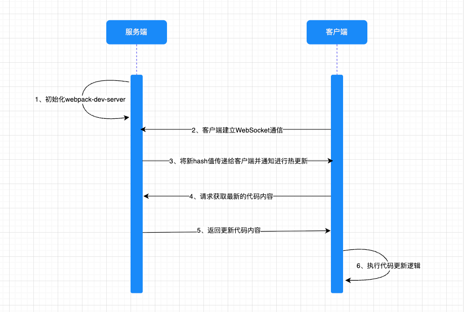

整体流程可以分为三个阶段即服务端初始化、客户端初始化、代码热更新。

服务端负责监听代码变化，并将新 hash 值返回给客户端、通知客户端进行热更新。

客户端创建 WebSocket 对象，建立服务端通信，接收服务端消息。

客户端比对 hash 值不一致时，会请求获取更新代码内容，执行代码更新逻辑。

### 1.1、webpack-dev-server 对象初始化

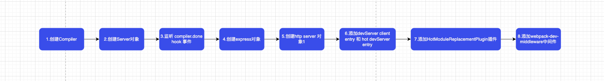

1. 创建 Compiler 对象
2. 创建 Server 对象
3. 监听 compiler done hook
4. 创建 express 对象
5. 创建 http server 对象
6. 添加 devServer client entry 和 hot devServer entry
7. 添加 HotModuleReplacementPlugin
8. 添加 webpack-dev-middleware 中间件

### 1.2、客户端执行逻辑

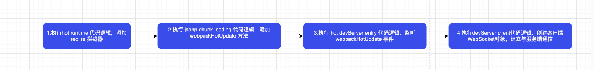

1. 执行 hot runtime 代码逻辑，添加 require 拦截器
2. 执行 json chunk loadng 逻辑，添加 webpackHotUpdate 方法
3. 执行 webpack/hot/dev-server.js 代码逻辑，监听 webpackHotUpdate 事件
4. 执行 client/index.js 代码逻辑，创建客户端 WebSocket 对象，建立服务端通信

### 1.3、代码热更新

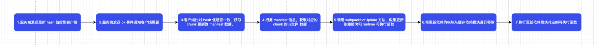

1. 服务端派发 `hash` 类型消息，将新 `hash` 值传递给客户端
2. 服务端派发 `ok` 类型消息，通知客户端进行热更新
3. 客户端比对 `hash` 值不一致，获取 `chunk` 更新 `manifest`
4. 根据 `manifest` 信息，获取 `chunk` 更新内容
5. 调用 `webpackHotUpdate` 方法，收集更新依赖模块和 `runtime` 的可执行函数
6. 将更新依赖模块从依赖模块缓存数据中移除
7. 执行更新依赖对象对应的可执行函数

## 二、项目初始化

创建初始化项目，并配置 webpack.config.js，配置如下

```javascript
const HtmlWebpackPlugin = require('html-webpack-plugin');
const path = require('path');

const isDevMode = process.env.NODE_ENV === 'development';

module.exports = {
  target: 'web',
  entry: './src/index.js',
  output: {
    path: path.resolve(__dirname, 'dist'),
    filename: 'bundle.js',
  },
  // 插件
  plugins: [
    new HtmlWebpackPlugin({
      template: path.resolve(__dirname, 'public/index.html'),
    }),
  ],
  devtool: 'source-map',

  // 设置开发模式
  mode: isDevMode ? 'development' : 'production',

  // 开发服务器
  devServer: {
    hot: true, // 热更新
  },
};
```

在执行 webpack serve 命令时，根据 webpack 脚手架源码执行流程分析出还是执行的 webpack-dev-server 包中的 `lib\Server.js` 的 Server类，并且执行类中的 start 函数。

在项目中创建 bin 目录并创建 index.js，通过 scripts 执行 index.js 模拟实现执行 webpack serve 命令。

```javascript
"scripts": {
  "start": "cross-env NODE_ENV=development node ./bin/index.js"
},
```

bin/index.js 内容如下

```javascript
// bin/index.js
const Webpack = require('webpack');

// webpack.config.js 配置
const webpackConfig = require('../webpack.config.js');

// Server 类
const Server = require('./Server.js');

// 创建 compiler
const compiler = Webpack(webpackConfig);

// devServer 配置
const options = webpackConfig.devServer;

// 创建 server 实例
const server = new Server(options, compiler);

// 执行 server 的start 方法
server.start();
```

配置的 src/index.js 代码如下

```javascript
import { a } from './demo';

let render = () => {
  console.log(a);
};

render();

/**
 * 热模块更新
 */
if (module.hot) {
  module.hot.accept('./demo.js', () => {
    render();
  });
}
```

src/demo.js 如下

```javascript
const a = 23;

export { a };
```

## 三、服务端初始化

### 3.1、服务端对象创建

定义的 Server 类如下

```javascript
const WebsocketServer = require('./servers/WebsocketServer');

/**
 * 创建缓存函数
 */
const memoize = (fn) => {
  let cache = false;
  let result;

  return () => {
    if (cache) {
      return result;
    }

    result = fn();
    cache = true;
    fn = undefined;

    return result;
  };
};

const getExpress = memoize(() => require('express'));

class Server {
   constructor(options = {}, compiler) {
    this.compiler = compiler;

    // 日志方法，用于打印日志
    this.logger = this.compiler.getInfrastructureLogger('webpack-dev-server');

    // devServer options
    this.options = options;

    // 存储进程的信号监听事件
    this.listeners = []; // { name：信号，listener }

    // 记录客户端连接的 http 的 socket 连接，这里不是指 websocket，而是提供类似 Tcp socket
    this.sockets = [];

    // 当前 hash 值
    this.currentHash = undefined;
  }
  
  /**
   * 初始化 options 并设置默认值
   */
  normalizeOptions() {
    // 
  }
  
  // 发生消息给客户端
  sendMessage() {
    //
  }
  
  setupHooks() {
    //
  }
  
  /**
   * 创建 http 服务器，源码会区分 http2 和 http，这里只处理 http
   */
  createServer() {
    //
  }
  
  getClientEntry() {
    //
  }
  
  getClientHotEntry() {
    //
  }
  
  addAdditionalEntries() {
    //
  }
  
  setupMiddlewares() {
    //
  }
  
  async initialize() {
    //
  }
  
  async start() {
    //
  }
  
  createWebSocketServer() {
    //
  }
  
  sendStats() {
    //
  }
  
  async stop() {
    //
  }
  
  stopCallback(callback = () => {}) {
    this.stop()
      .then(() => callback(), callback)
      .catch(callback);
  }
}

module.exports = Server;
```

其中的  Server类中的 start 为入口执行函数。

### 3.2、执行start方法

```javascript
async start() {
  	// 序列化 webpack.config.js 配置，主要没有设置的选项设置默认值
    this.normalizeOptions();
  
  	// 初始化，主要创建服务器以及设置 webpack-dev-middleware 中间件
    await this.initialize();
		
  	// 获取和设置 host 和 port，这里我使用直接赋值处理
    this.options.host = '0.0.0.0';
    this.options.port = '8090';
		
  	// 设置 listenOptions 
    const listenOptions = {
      host: this.options.host,
      port: this.options.port,
    };
		
 		// 正式启动 serve
    await new Promise((resolve) => {
      this.server.listen(listenOptions, () => {
        resolve();
      });
    });
		
  	// 创建服务端 WebSocket 
    this.createWebSocketServer();
  }
```

### 3.3、normalizeOptions方法

在 Server 类 constructor 中接收的 options 为 webpack.config.js 的 devServer 选项配置，更多详细的配置参考：https://webpack.js.org/configuration/dev-server/

目前只会简化源码中一部分设置，主要是为了剔除一些无关紧要的配置和易于理解。具体如下

```javascript
/**
 * 初始化 options 并设置默认值
 */
normalizeOptions() {
  const { options } = this; // 获取到 devServer 配置
  const compilerOptions = this.compiler.options; // webpack.config.js 整个配置选项

  // allowedHosts 配置，如果未设置时，就默认设置 auto
  if (typeof options.allowedHosts === 'undefined') {
    options.allowedHosts = 'auto';
  }

  // bonjour 配置，如果未配置时，就默认设置 false
  if (typeof options.bonjour === 'undefined') {
    options.bonjour = false;
  }

  // client 配置
  if (typeof options.client === 'undefined' || (typeof options.client === 'object' && options.client !== null)) {
    if (!options.client) {
      options.client = {};
    }

    if (typeof options.client.webSocketURL === 'undefined') {
      options.client.webSocketURL = {};
    }

    if (typeof options.client.overlay === 'undefined') {
      options.client.overlay = true;
    }

    if (typeof options.client.reconnect === 'undefined') {
      options.client.reconnect = 10;
    }

    if (typeof options.client.logging === 'undefined') {
      options.client.logging = compilerOptions.infrastructureLogging
        ? compilerOptions.infrastructureLogging.level
        : 'info';
    }
  }

  // compress 配置，在未设置时，默认设置为 true
  if (typeof options.compress === 'undefined') {
    options.compress = true;
  }

  // devMiddleware 配置，在未设置时，默认设置 {}
  if (typeof options.devMiddleware === 'undefined') {
    options.devMiddleware = {};
  }

  // hot 未设置时默认设置 true
  options.hot = typeof options.hot === 'boolean' || options.hot === 'only' ? options.hot : true;

  // server配置，主要设置启动服务器是 http 还是 https 等。
  options.server = {
    type: 'http',
    options: {},
  };

  // liveReload 配置
  options.liveReload = typeof options.liveReload !== 'undefined' ? options.liveReload : true;

  // setupExitSignals 配置
  if (typeof options.setupExitSignals === 'undefined') {
    options.setupExitSignals = true;
  }

  // 服务端 webSocket 配置
  options.webSocketServer = {
    type: 'ws',
    options: { path: '/ws' },
  };
}
```

整体返回的 options 数据结构为

```javascript
{
	allowedHosts: 'auto',
  bonjour: false,
  client: { webSocketURL:{}, overlay: true, reconnect: 10 },
  compress: true,
  devMiddleware: {},
  hot: true,
  server: { type: 'http', options: {} },
  liveReload: true,
  setupExitSignals: true,
 	webSocketServer: { type: 'ws', options: { path: '/ws' } }
}
```

### 3.4、initialize方法

```javascript
async initialize() {
  // 添加compiler done hook监听事件回调
  this.setupHooks();

  // 使用 express 构建一个 app 服务器
  this.app = getExpress()();

  // 创建服务器
  this.createServer();

  // 主要为客户端注入 websocket 的连接和热更新文件
  if (this.options.webSocketServer) {
    const compiler = this.compiler;

    this.addAdditionalEntries(compiler);

    const webpack = compiler.webpack || require('webpack');

    // 如果开启了 热更新 就添加 HotModuleReplacementPlugin
    if (this.options.hot) {
      const plugin = new webpack.HotModuleReplacementPlugin();
      plugin.apply(compiler);
    }
  }

  // 添加app webpack-dev-middleware中间件
  this.setupMiddlewares();

  // 根据 setupExitSignals 配置，通过 process.on 监听进程信号 SIGINT、SIGTERM 事件
  // SIGINT：通常由 ctrl + c 触发
  // SIGTERM：通常使用 kill 命令终止程序
  if (this.options.setupExitSignals) {
    const signals = ['SIGINT', 'SIGTERM'];

    let needForceShutdown = false;

    signals.forEach((signal) => {
      const listener = () => {
        if (needForceShutdown) {
          process.exit();
        }

        this.logger.info('Gracefully shutting down. To force exit, press ^C again. Please wait...');

        needForceShutdown = true;

        // 在 ctrl + c 或 kill 命令终止程序时，会调用类中的 stopCallback
        this.stopCallback(() => {
          if (typeof this.compiler.close === 'function') {
            this.compiler.close(() => {
              process.exit();
            });
          } else {
            process.exit();
          }
        });
      };

      // 这使用 listeners 进行存储，也是为了后续方便移除
      this.listeners.push({ name: signal, listener });

      process.on(signal, listener);
    });
  }
}
```

#### 3.4.1、setupHooks

```javascript
// 添加compiler done hook监听事件回调
setupHooks() {
  this.compiler.hooks.invalid.tap('webpack-dev-server', () => {
    if (this.webSocketServer) {
      this.sendMessage(this.webSocketServer.clients, 'invalid');
    }
  });

  this.compiler.hooks.done.tap('webpack-dev-server', (stats) => {
    console.log(stats.hash, '当前文件修改后的生成hash');
    if (this.webSocketServer) {
      this.sendStats(this.webSocketServer.clients, this.getStats(stats));
    }
    this.stats = stats;
  });
}
```

其中 sendStats 方法主要将生成 hash 发送给到客户端

```javascript
sendStats(clients, stats, force) {
  const shouldEmit =
    !force &&
    stats &&
    (!stats.errors || stats.errors.length === 0) &&
    (!stats.warnings || stats.warnings.length === 0) &&
    this.currentHash === stats.hash;

  if (shouldEmit) {
    this.sendMessage(clients, 'still-ok');

    return;
  }

  // 将当前 hash 进行存储
  this.currentHash = stats.hash;
  // 发送 hash 给到客户端
  this.sendMessage(clients, 'hash', stats.hash);

  if (stats.errors.length > 0 || stats.warnings.length > 0) {
    const hasErrors = stats.errors.length > 0;

    if (stats.warnings.length > 0) {
      let params;

      if (hasErrors) {
        params = { preventReloading: true };
      }

      this.sendMessage(clients, 'warnings', stats.warnings, params);
    }

    if (stats.errors.length > 0) {
      this.sendMessage(clients, 'errors', stats.errors);
    }
  } else {
    this.sendMessage(clients, 'ok');
  }
}
```

#### 3.4.2、createServer创建服务器

```javascript
/**
 * 创建 http 服务器，源码会区分 http2 和 http，这里只处理 http
 */
createServer() {
  const { type, options } = this.options.server; // { type: 'http', options: {} }

  const serverType = require(type);
  this.server = serverType.createServer(options, this.app); // this.app 为 express()

  /**
   * 并且监听 connection 事件
   */
  this.server.on('connection', (socket) => {
    this.sockets.push(socket);

    socket.once('close', () => {
      this.sockets.splice(this.sockets.indexOf(socket), 1);
    });
  });

  /**
   * 监听 error 事件
   */
  this.server.on('error', (error) => {
    throw error;
  });
}
```

服务器创建完成之后会 Server 类会多出 server 和 app 属性。

#### 3.4.3、修改entry配置添加注入文件

```javascript
// 主要为客户端注入 websocket 的连接和热更新文件
if (this.options.webSocketServer) {
  const compiler = this.compiler;

  this.addAdditionalEntries(compiler);

  const webpack = compiler.webpack || require('webpack');

  // 如果开启了 热更新 就添加 HotModuleReplacementPlugin
  if (this.options.hot) {
    const plugin = new webpack.HotModuleReplacementPlugin();
    plugin.apply(compiler);
  }
}
```

其中 addAdditionalEntries 配置如下

```javascript
addAdditionalEntries(compiler) {
  const additionalEntries = [];

  // client { webSocketURL:{}, overlay: true, reconnect: 10 }
  if (this.options.client) {
    let webSocketURLStr = '';

    // { type: 'ws', options: { path: '/ws' } }
    if (this.options.webSocketServer) {
      const webSocketServer = this.options.webSocketServer;
      const searchParams = new URLSearchParams();
      searchParams.set('protocol', 'ws:');
      searchParams.set('hostname', '0.0.0.0');
      searchParams.set('port', '8090');
      searchParams.set('pathname', webSocketServer.options.path); // /ws

      const client = this.options.client;

      if (typeof client.logging !== 'undefined') {
        searchParams.set('logging', client.logging);
      }

      if (typeof client.overlay !== 'undefined') {
        const overlayString = typeof client.overlay === 'boolean' || String(client.overlay);
        searchParams.set('overlay', overlayString);
      }

      if (typeof client.reconnect !== 'undefined') {
        searchParams.set('reconnect', typeof client.reconnect === 'number' ? String(client.reconnect) : '10');
      }

      if (typeof this.options.hot !== 'undefined') {
        searchParams.set('hot', String(this.options.hot));
      }

      if (typeof this.options.liveReload !== 'undefined') {
        searchParams.set('live-reload', String(this.options.liveReload));
      }

      webSocketURLStr = searchParams.toString(); // 最终会拼接成 protocol=ws%3A&hostname=0.0.0.0&port=8090&pathname=%2Fws&logging=info&overlay=true&reconnect=10&hot=true&live-reload=true
    }

    additionalEntries.push(`${this.getClientEntry()}?${webSocketURLStr}`); // 添加需要注入的 js 文件
  }

  const clientHotEntry = this.getClientHotEntry(); // 注入的 热更新文件
  if (clientHotEntry) {
    additionalEntries.push(clientHotEntry);
  }

  const webpack = compiler.webpack || require('webpack');

  // 调用 webpack 的 EntryPlugin 插件修改入口文件，想其中注入
  for (const additionalEntry of additionalEntries) {
    new webpack.EntryPlugin(compiler.context, additionalEntry, {
      name: undefined,
    }).apply(compiler);
  }
}
```

其中注入的两个文件为 `./client/index.js` 和 `./hot/dev-server.js`，文件作用后续会进行说明。


#### 3.4.4、设置express服务器中间件

设置的中间件其实就是为 express 创建服务器设置中间件，详细可以件 express 的中间件设置

```javascript
setupMiddlewares() {
  let middlewares = [];

  // 根据 options 的 compress 选项是否开启 compression 压缩
  if (this.options.compress) {
    const compression = require('compression');
    middlewares.push({ name: 'compression', middleware: compression() });
  }

  // 添加 webpack-dev-middleware 中间件
  middlewares.push({
    name: 'webpack-dev-middleware',
    middleware: this.middleware,
  });

  if (typeof this.options.setupMiddlewares === 'function') {
    middlewares = this.options.setupMiddlewares(middlewares, this);
  }

  const lazyInitDevMiddleware = () => {
    if (!this.middleware) {
      const webpackDevMiddleware = require('webpack-dev-middleware');
      this.middleware = webpackDevMiddleware(this.compiler, this.options.devMiddleware);
    }

    return this.middleware;
  };

  for (const i of middlewares) {
    if (i.name === 'webpack-dev-middleware') {
      const item = i;

      if (typeof item.middleware === 'undefined') {
        item.middleware = lazyInitDevMiddleware();
      }
    }
  }

  /**
   * 给 this.app 创建的 express 服务器创建中间件
   */
  for (const middleware of middlewares) {
    if (typeof middleware === 'function') {
      this.app.use(middleware);
    } else if (typeof middleware.path !== 'undefined') {
      this.app.use(middleware.path, middleware.middleware);
    } else {
      this.app.use(middleware.middleware);
    }
  }
}
```

### 3.5、启动http服务器

在启动 http 服务器之前，this.server 属性都是在 createServer ，只需要调用 listen 方法。

```javascript
// 这里对 webpack 的 devServer 配置进行写死，默认不取配置。
this.options.host = '0.0.0.0';
this.options.port = '8090';

const listenOptions = {
  host: this.options.host,
  port: this.options.port,
};

await new Promise((resolve) => {
  this.server.listen(listenOptions, () => {
    resolve();
  });
});
```

### 3.6、创建监听服务器的ws连接

```javascript
createWebSocketServer() {
  this.webSocketServer = new WebsocketServer(this);
	
  // 当客户端的 ws 服务器初次连接时，会发送首次发送消息给客户端
  this.webSocketServer.implementation.on('connection', (client, request) => {
    const headers =
      typeof request !== 'undefined'
        ? request.headers
        : typeof client.headers !== 'undefined'
        ? client.headers
        : undefined;

    if (!headers) {
      this.logger.warn('webSocketServer implementation must pass headers for the "connection" event');
    }
		
    // 发送 hot 消息
    if (this.options.hot === true || this.options.hot === 'only') {
      this.sendMessage([client], 'hot');
    }
		
    // 发送 liveReload 消息
    if (this.options.liveReload) {
      this.sendMessage([client], 'liveReload');
    }
		
    // 重新连接
    if (this.options.client && this.options.client.reconnect) {
      this.sendMessage([client], 'reconnect', this.options.client.reconnect);
    }

    if (this.options.client && this.options.client.overlay) {
      const overlayConfig = this.options.client.overlay;
      this.sendMessage(
        [client],
        'overlay',
        typeof overlayConfig === 'object'
          ? {
              ...overlayConfig,
              errors: overlayConfig.errors && encodeOverlaySettings(overlayConfig.errors),
              warnings: overlayConfig.warnings && encodeOverlaySettings(overlayConfig.warnings),
              runtimeErrors: overlayConfig.runtimeErrors && encodeOverlaySettings(overlayConfig.runtimeErrors),
            }
          : overlayConfig
      );
    }

    if (!this.stats) {
      return;
    }
		
    // 发送当前 stats 消息
    this.sendStats([client], this.getStats(this.stats), true);
  });
}
```

其中 WebsocketServer 类如下

```javascript
const WebSocket = require('ws');

module.exports = class WebsocketServer {
  // 定义心跳时长
  static heartbeatInterval = 1000;

  constructor(server) {
    this.server = server;

    // 客户端连接存储
    this.clients = [];

    const options = {
      ...this.server.options.webSocketServer.options, // { path: '/ws' }
      clientTracking: false,
    };

    const isNoServerMode = typeof options.port === 'undefined' && typeof options.server === 'undefined';

    if (isNoServerMode) {
      options.noServer = true;
    }

    // 创建 ws 服务器
    this.implementation = new WebSocket.Server(options);

    // Server类设置 http server 服务器
    this.server.server.on('upgrade', (req, sock, head) => {
      if (!this.implementation.shouldHandle(req)) {
        return;
      }

      this.implementation.handleUpgrade(req, sock, head, (connection) => {
        this.implementation.emit('connection', connection, req);
      });
    });

    // 监听 ws 的 error 事件
    this.implementation.on('error', (err) => {
      this.server.logger.error(err.message);
    });

    // 监听 ws 的 connection 事件
    this.implementation.on('connection', (client) => {
      this.clients.push(client);

      client.isAlive = true;

      client.on('pong', () => {
        client.isAlive = true;
      });

      client.on('close', () => {
        this.clients.splice(this.clients.indexOf(client), 1);
      });

      client.on('error', (err) => {
        this.server.logger.error(err.message);
      });
    });

    // 创建定时器，向客户端定时发送心跳
    const interval = setInterval(() => {
      this.clients.forEach((client) => {
        // 如果客户端不在活跃，执行 terminate 方法
        if (client.isAlive === false) {
          client.terminate();
          return;
        }

        client.isAlive = false;
        client.ping(() => {});
      });
    }, WebsocketServer.heartbeatInterval);

    // 监听 close 事件，关闭时取消心跳机制
    this.implementation.on('close', () => {
      clearInterval(interval);
    });
  }
};
```

### 3.7、如何发送消息给到客户端

发送消息给客户端主要全部封装到 sendMessage 

```javascript
// 遍历客户端，发送消息给客户端
sendMessage(clients, type, data, params) {
  for (const client of clients) {
    if (client.readyState === 1) {
      client.send(JSON.stringify({ type, data, params }));
    }
  }
}
```

### 3.8、如何优雅停止服务器

在 initialize 初始化时就已经监听了进程信号事件（SIGINT、SIGTERM），当触发该事件时会执行 stopCallback 方法，该方法内会执行 stop 方法，该方法是一个异步方法，等待异步方法执行完成之后会执行 stopCallback 的回调函数。

```javascript
// stopCallback
// 需要等待 stop 的异步函数执行完，才会调用回调函数
stopCallback(callback = () => {}) {
  this.stop()
    .then(() => callback(), callback)
    .catch(callback);
}
```

```javascript
async stop() {
  if (this.webSocketServer) {
    await new Promise((resolve) => {
      // 关闭 服务器端 ws 服务
      this.webSocketServer.implementation.close(() => {
        this.webSocketServer = null;

        resolve();
      });

      // 对于已经连接的客户端 ws 进行终止连接
      for (const client of this.webSocketServer.clients) {
        client.terminate();
      }

      this.webSocketServer.clients = [];
    });
  }

  if (this.server) {
    await new Promise((resolve) => {
      // 对于 http 服务进行关闭
      this.server.close(() => {
        this.server = undefined;
        resolve();
      });

      // 对于客户端连接 http sockets 进行销毁
      for (const socket of this.sockets) {
        socket.destroy();
      }

      this.sockets = [];
    });

    if (this.middleware) {
      await new Promise((resolve, reject) => {
        // 关闭中间件使用
        this.middleware.close((error) => {
          if (error) {
            reject(error);
            return;
          }

          resolve();
        });
      });

      this.middleware = undefined;
    }
  }

  // 移除 process.on 对 'SIGINT', 'SIGTERM' 对进程信号监听
  for (const item of this.listeners) {
    process.removeListener(item.name, item.listener);
  }
}
```

## 四、客户端初始化

在服务端初始化过程中会注入  devServer client entry 和 hot devServer entry，也就是 /client/index.js 和 /hot/dev-server.js 两个文件。在客户端最终的展示和执行如下

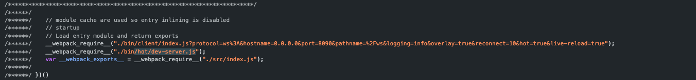

### 4.1、注入的client/index.js文件说明

```javascript
/* global __resourceQuery, __webpack_hash__  */

// 发布订阅
import hotEmitter from '../hot/emitter.js';
// 热更新日志
import webpackHotLog from 'webpack/hot/log.js';
// 日志
import { log, setLogLevel } from './utils/log.js';

/**
 * 客户端用于连接服务端 ws
 */
import socket from './socket.js';
import sendMessage from './utils/sendMessage.js';

console.log(__resourceQuery, ',____resourceQuery');
console.log(__webpack_hash__, '__webpack_hash__');

/**
 * Status
 */
const status = {
  isUnloading: false,
  currentHash: __webpack_hash__,
};

/**
 * 解析 resourceQuery 传过来的 url
 */
const parseURL = (resourceQuery) => {
  let result = {};

  if (typeof resourceQuery === 'string' && resourceQuery !== '') {
    const searchParams = resourceQuery.slice(1).split('&');
    for (let i = 0; i < searchParams.length; i++) {
      const pair = searchParams[i].split('=');

      result[pair[0]] = decodeURIComponent(pair[1]);
    }
  }

  return result;
};

/**
 * url 解析出来数据赋值给 parsedResourceQuery
 */
const parsedResourceQuery = parseURL(__resourceQuery);

/**
 * 初始化定义的特性
 */
const enabledFeatures = {
  'Hot Module Replacement': false,
  'Live Reloading': false,
  Progress: false,
  Overlay: false,
};

/**
 * 初始化定义的 options
 */
const options = {
  hot: false,
  liveReload: false,
  progress: false,
  overlay: false,
};

/**
 * 如果解析 url 的 hot 为 true时，设置 options 和 enabledFeatures 为 true
 */
if (parsedResourceQuery.hot === 'true') {
  options.hot = true;
  enabledFeatures['Hot Module Replacement'] = true;
}

/**
 * 设置 live-reload 为 true
 */
if (parsedResourceQuery['live-reload'] === 'true') {
  options.liveReload = true;
  enabledFeatures['Live Reloading'] = true;
}

/**
 * 设置 overlay
 */
if (parsedResourceQuery.overlay) {
  try {
    options.overlay = JSON.parse(parsedResourceQuery.overlay); // "true"
  } catch (err) {
    log.error('Error parsing overlay options from resource query:', err);
  }

  enabledFeatures.Overlay = options.overlay !== false;
}

if (parsedResourceQuery.logging) {
  options.logging = parsedResourceQuery.logging;
}

/**
 * 设置 options 的 reconnect
 */
if (typeof parsedResourceQuery.reconnect !== 'undefined') {
  options.reconnect = Number(parsedResourceQuery.reconnect); // 取出的是字符串
}

const setAllLogLevel = (level) => {
  webpackHotLog.setLogLevel(level === 'verbose' || level === 'log' ? 'info' : level);
  setLogLevel(level);
};

/**
 * 根据 options 的 logging，设置日志
 */
if (options.logging) {
  setAllLogLevel(options.logging);
}

const logEnabledFeatures = (features) => {
  const listEnabledFeatures = Object.keys(features);
  if (!features || listEnabledFeatures.length === 0) {
    return;
  }

  let logString = 'Server started:';

  for (let i = 0; i < listEnabledFeatures.length; i++) {
    const key = listEnabledFeatures[i];
    logString += ` ${key} ${features[key] ? 'enabled' : 'disabled'},`;
  }
  logString = logString.slice(0, -1).concat('.');

  log.info(logString); //  Server started: Hot Module Replacement enabled, Live Reloading enabled, Progress disabled, Overlay enabled.
};

/**
 * 打印 listEnabledFeatures 的日志
 */
logEnabledFeatures(enabledFeatures);

/**
 * 监听是否离开页面事件
 */
self.addEventListener('beforeunload', () => {
  status.isUnloading = true;
});

const overlay = { send: () => {} };

/**
 * 更新App应用
 */
const reloadApp = ({ hot, liveReload }, currentStatus) => {
  if (currentStatus.isUnloading) {
    return;
  }

  const { currentHash, previousHash } = currentStatus;

  const isInitial = currentHash.indexOf(previousHash) >= 0;
  if (isInitial) {
    return;
  }

  function applyReload(rootWindow, intervalId) {
    clearInterval(intervalId);
    log.info('App updated. Reloading...');
    rootWindow.location.reload();
  }

  const search = self.location.search.toLowerCase();

  const allowToHot = search.indexOf('webpack-dev-server-hot=false') === -1;
  const allowToLiveReload = search.indexOf('webpack-dev-server-live-reload=false') === -1;

  console.log(hot && allowToHot, liveReload && allowToLiveReload);

  /**
   * 如果是热更新就触发热更新，不是热更新触发 window.location.reload();
   */
  if (hot && allowToHot) {
    log.info('App hot update...');

    hotEmitter.emit('webpackHotUpdate', currentStatus.currentHash);

    if (typeof self !== 'undefined' && self.window) {
      // broadcast update to window
      self.postMessage(`webpackHotUpdate${currentStatus.currentHash}`, '*');
    }
  } else if (liveReload && allowToLiveReload) {
    let rootWindow = self;

    const intervalId = self.setInterval(() => {
      if (rootWindow.location.protocol !== 'about:') {
        applyReload(rootWindow, intervalId);
      } else {
        rootWindow = rootWindow.parent;
        if (rootWindow.parent === rootWindow) {
          applyReload(rootWindow, intervalId);
        }
      }
    });
  }
};

/**
 * 处理服务端发送过来的消息
 */
const onSocketMessage = {
  // 处理服务端发送 hot 事件时 {"type":"hot"}
  hot() {
    if (parsedResourceQuery.hot === 'false') {
      return;
    }
    options.hot = true;
  },

  // 处理服务端发送 hot 事件时 {"type":"liveReload"}
  liveReload() {
    if (parsedResourceQuery['live-reload'] === 'false') {
      return;
    }
    options.liveReload = true;
  },
  invalid() {
    log.info('App updated. Recompiling...');
    if (options.overlay) {
      overlay.send({ type: 'DISMISS' });
    }
    sendMessage('Invalid');
  },
  hash(hash) {
    status.previousHash = status.currentHash;
    status.currentHash = hash;
  },
  logging: setAllLogLevel,
  overlay(value) {
    if (typeof document === 'undefined') {
      return;
    }
    options.overlay = value;
  },
  reconnect(value) {
    if (parsedResourceQuery.reconnect === 'false') {
      return;
    }
    options.reconnect = value;
  },
  'still-ok': function stillOk() {
    log.info('Nothing changed.');

    if (options.overlay) {
      overlay.send({ type: 'DISMISS' });
    }

    sendMessage('StillOk');
  },
  ok() {
    sendMessage('Ok');

    if (options.overlay) {
      overlay.send({ type: 'DISMISS' });
    }

    reloadApp(options, status);
  },
  warnings(warnings, params) {
    log.warn('Warnings while compiling.');
    sendMessage('Warnings', warnings);
  },
  errors(errors) {
    log.error('Errors while compiling. Reload prevented.');

    sendMessage('Errors', errors);
  },
  error(error) {
    log.error(error);
  },
  close() {
    log.info('Disconnected!');

    if (options.overlay) {
      overlay.send({ type: 'DISMISS' });
    }

    sendMessage('Close');
  },
};

/**
 * 根据 url组成的对象，组装成一个字符串url
 */
const formatURL = (objURL) => {
  let protocol = objURL.protocol || '';

  if (protocol && protocol.slice(-1) !== ':') {
    protocol += ':';
  }

  let auth = objURL.auth || '';

  if (auth) {
    auth = encodeURIComponent(auth);
    auth = auth.replace(/%3A/i, ':');
    auth += '@';
  }

  let host = '';

  if (objURL.hostname) {
    host = auth + (objURL.hostname.indexOf(':') === -1 ? objURL.hostname : `[${objURL.hostname}]`);

    if (objURL.port) {
      host += `:${objURL.port}`;
    }
  }

  let pathname = objURL.pathname || '';

  if (objURL.slashes) {
    host = `//${host || ''}`;

    if (pathname && pathname.charAt(0) !== '/') {
      pathname = `/${pathname}`;
    }
  } else if (!host) {
    host = '';
  }

  let search = objURL.search || '';

  if (search && search.charAt(0) !== '?') {
    search = `?${search}`;
  }

  let hash = objURL.hash || '';

  if (hash && hash.charAt(0) !== '#') {
    hash = `#${hash}`;
  }

  pathname = pathname.replace(/[?#]/g, (match) => encodeURIComponent(match));
  search = search.replace('#', '%23');

  return `${protocol}${host}${pathname}${search}${hash}`;
};

/**
 * 创建 webSocket 连接的url
 */
const createSocketURL = (parsedURL) => {
  let { hostname } = parsedURL;

  const isInAddrAny = hostname === '0.0.0.0' || hostname === '::' || hostname === '[::]';

  if (isInAddrAny && self.location.hostname && self.location.protocol.indexOf('http') === 0) {
    hostname = self.location.hostname;
  }

  let socketURLProtocol = parsedURL.protocol || self.location.protocol;

  if (socketURLProtocol === 'auto:' || (hostname && isInAddrAny && self.location.protocol === 'https:')) {
    socketURLProtocol = self.location.protocol;
  }

  socketURLProtocol = socketURLProtocol.replace(/^(?:http|.+-extension|file)/i, 'ws');

  let socketURLAuth = '';

  if (parsedURL.username) {
    socketURLAuth = parsedURL.username;

    if (parsedURL.password) {
      socketURLAuth = socketURLAuth.concat(':', parsedURL.password);
    }
  }

  const socketURLHostname = (hostname || self.location.hostname || 'localhost').replace(/^\[(.*)\]$/, '$1');

  let socketURLPort = parsedURL.port;

  if (!socketURLPort || socketURLPort === '0') {
    socketURLPort = self.location.port;
  }

  let socketURLPathname = '/ws';

  if (parsedURL.pathname && !parsedURL.fromCurrentScript) {
    socketURLPathname = parsedURL.pathname;
  }

  return formatURL({
    protocol: socketURLProtocol,
    auth: socketURLAuth,
    hostname: socketURLHostname,
    port: socketURLPort,
    pathname: socketURLPathname,
    slashes: true,
  });
};

/**
 * ws 的 url
 */
const socketURL = createSocketURL(parsedResourceQuery);

socket(socketURL, onSocketMessage, options.reconnect);

```

其中的 socket.js 文件内容如下

```javascript
import WebSocketClient from './WebSocketClient';

let retries = 0;
let maxRetries = 10;
let client = null;
let timeout;

function socket(url, handlers, reconnect) {
  /**
   * 创建客户端 WebSocket
   */
  client = new WebSocketClient(url);

  client.onOpen(() => {
    retries = 0;

    if (timeout) {
      clearTimeout(timeout);
    }

    if (typeof reconnect !== 'undefined') {
      maxRetries = reconnect;
    }
  });

  client.onClose(() => {
    if (retries === 0) {
      handlers.close();
    }

    // Try to reconnect.
    client = null;

    if (retries < maxRetries) {
      const retryInMs = 1000 * Math.pow(2, retries) + Math.random() * 100;

      retries += 1;

      console.log('Trying to reconnect...');

      timeout = setTimeout(() => {
        socket(url, handlers, reconnect);
      }, retryInMs);
    }
  });

  /**
   * 客户端监听客户端消息，并且处理对应事件。例如：{"type":"hash","data":"3f3609e6ca874b8c4015"}，type 为 handlers，data为参数
   */
  client.onMessage((data) => {
    const message = JSON.parse(data);
    if (handlers[message.type]) {
      handlers[message.type](message.data, message.params);
    }
  });
}

export default socket;

```

WebSocketClient.js 内容如下

```javascript
export default class WebSocketClient {
  constructor(url) {
    this.client = new WebSocket(url);
    this.client.onerror = (error) => {
      console.error(error);
    };
  }

  onOpen(fn) {
    this.client.onopen = fn;
  }

  onClose(fn) {
    this.client.onclose = fn;
  }

  onMessage(fn) {
    this.client.onmessage = (err) => {
      fn(err.data);
    };
  }
}

```

### 4.2、\_\_resourceQuery、\_\_webpack_hash__全局变量

webpack 在构建之后的会向全局注入 \_\_resourceQuery、\_\_webpack_hash__ 变量，变量含义如下：

+ resourceQuery：注入文件时携带的url参数

+ webpack_hash：为当前的文件hash

```javascript
protocol=ws%3A&hostname=0.0.0.0&port=8090&pathname=%2Fws&logging=info&overlay=true&reconnect=10&hot=true&live-reload=true ,____resourceQuery // 传递 ip 地址和端口等参数信息

7946a3b2449f259febab __webpack_hash__  // 传递过来的hash存储
```

### 4.2、客户端接收服务端hash和ok事件

#### 4.2.1、hash事件处理

主要是在 onSocketMessage 的 hash 方法

```javascript
hash(hash) {
  // 将当前存储的 hash 设置为 历史前hash
  status.previousHash = status.currentHash;
  // 并重新赋值重新 hash 给 currentHash
  status.currentHash = hash;
},
```

#### 4.2.2、ok事件

在触发热更新时，ok 的事件在 hash 事件之后发送执行

```javascript
ok() {
  sendMessage('Ok');

  if (options.overlay) {
    overlay.send({ type: 'DISMISS' });
  }

  reloadApp(options, status);
},
```

其中最为核心的是 reloadApp 方法，其内容如下

```javascript
/**
 * 触发热更新，并更新应用
 */
const reloadApp = ({ hot, liveReload }, currentStatus) => {
  /**
   * 当离开当前页面时，isUnloading 就是设置为 true，不做后续操作
   */
  if (currentStatus.isUnloading) {
    return;
  }

  // 取出当前和上一次 hash
  const { currentHash, previousHash } = currentStatus;

  // 判断 当前hash 是否和上一次 hash 是否一致，一致就 return 处理
  const isInitial = currentHash.indexOf(previousHash) >= 0;
  if (isInitial) {
    return;
  }

  function applyReload(rootWindow, intervalId) {
    clearInterval(intervalId);
    log.info('App updated. Reloading...');
    rootWindow.location.reload();
  }

  const search = self.location.search.toLowerCase();

  const allowToHot = search.indexOf('webpack-dev-server-hot=false') === -1;
  const allowToLiveReload = search.indexOf('webpack-dev-server-live-reload=false') === -1;

  console.log(allowToHot, allowToLiveReload, liveReload);

  /**
   * 如果是热更新就触发热更新，不是热更新触发 window.location.reload();
   */
  if (hot && allowToHot) {
    log.info('App hot update...');

    // 发送 hotEmitter 的 webpackHotUpdate 事件
    hotEmitter.emit('webpackHotUpdate', currentStatus.currentHash);

    if (typeof self !== 'undefined' && self.window) {
      // broadcast update to window
      self.postMessage(`webpackHotUpdate${currentStatus.currentHash}`, '*');
    }
  } else if (liveReload && allowToLiveReload) {
    // 如果 hot 为 false 时，就触发浏览器刷新事件，主要是调用 window.location.reload()
    let rootWindow = self;
    const intervalId = self.setInterval(() => {
      if (rootWindow.location.protocol !== 'about:') {
        applyReload(rootWindow, intervalId);
      } else {
        rootWindow = rootWindow.parent;
        if (rootWindow.parent === rootWindow) {
          applyReload(rootWindow, intervalId);
        }
      }
    });
  }
};
```

### 4.3、注入的hot/dev-server.js文件

hot/dev-server.js 的内容如下

```javascript
/* globals __webpack_hash__ */
if (module.hot) {
var lastHash;

// 判断当前获取 lastHash 是否与 __webpack_hash__ 如果一致就返回 true，不一致就返回 false
var upToDate = function upToDate() {
  return lastHash.indexOf(__webpack_hash__) >= 0;
};

var check = function check() {
  module.hot
    .check(true)
    .then(function (updatedModules) {
      if (!updatedModules) {
        console.log(
          'warning',
          '[HMR] Cannot find update. ' +
            (typeof window !== 'undefined' ? 'Need to do a full reload!' : 'Please reload manually!')
        );
        console.log('warning', '[HMR] (Probably because of restarting the webpack-dev-server)');

        if (typeof window !== 'undefined') {
          window.location.reload();
        }

        return;
      }

      if (!upToDate()) {
        check();
      }

      if (upToDate()) {
        console.log('[HMR] App is up to date.');
      }
    })
    .catch(function (err) {
      var status = module.hot.status();
      if (['abort', 'fail'].indexOf(status) >= 0) {
        console.log(
          'warning',
          '[HMR] Cannot apply update. ' +
            (typeof window !== 'undefined' ? 'Need to do a full reload!' : 'Please reload manually!')
        );
        console.log('warning', '[HMR] ' + err);
        if (typeof window !== 'undefined') {
          window.location.reload();
        }
      } else {
        console.log('warning', '[HMR] Update failed: ' + err);
      }
    });
};

var hotEmitter = require('./emitter');

/**
 * 监听 webpackHotUpdate 事件，主要是由 client/index.js 中触发
 */
hotEmitter.on('webpackHotUpdate', function (currentHash) {
  lastHash = currentHash; // 获取到当前接收的 hash
  if (!upToDate() && module.hot.status() === 'idle') {
    console.log('[HMR] Checking for updates on the server...');
    // 调用 check() 方法
    check();
  }
});
console.log('[HMR] Checking for updates on the server...', '🚀');
} else {
throw new Error('[HMR] Hot Module Replacement is disabled.');
}
```

### 4.4、module.hot是如何被注入的

首先需要的就是了解 [import 的模块是被编译了什么]()，编译后的模块是如何被加载的。

核心就是在 webpack 编译后的 \_\_webpack_require__ 函数在加载模块之前添加了   \_\_webpack_require\_\_.i  拦截器。在加载模块之前需要先执行拦截器中的方法，目的在与获取当前模块的父级模块和子级模块之间的关系。这是通过 HotModuleReplacementPlugin 插件进行对 \_\_webpack_require__ 进行拦截器拓展。

webpack 的 `__webpack_require__` 函数如下

```javascript
function __webpack_require__(moduleId) {
  // 检查是否能够在缓存中找到
  var cachedModule = __webpack_module_cache__[moduleId];
  if (cachedModule !== undefined) {
    return cachedModule.exports;
  }
  
  // 缓存未命中时，创建新的缓存
  var module = (__webpack_module_cache__[moduleId] = {
    // no module.id needed
    // no module.loaded needed
    exports: {},
  });

  // 用于执行拦截器的传递的 options
  var execOptions = {
    id: moduleId, // 模块id
    module: module, // 初始化模块
    factory: __webpack_modules__[moduleId], // 取出来的模块函数
    require: __webpack_require__,
  };

  // 执行拦截器
  __webpack_require__.i.forEach(function (handler) {
    handler(execOptions);
  });

  module = execOptions.module;

  // 改变 factory 函数指向，并调用函数
  execOptions.factory.call(module.exports, module, module.exports, execOptions.require);

  // Return the exports of the module
  return module.exports;
}
```

其中 \_\_webpack_require__.i 是通过 HotModuleReplacementPlugin 插件注入实现。

```javascript
/* webpack/runtime/hot module replacement */
(() => {
  var currentModuleData = {};

  // 缓存的模块 __webpack_module_cache__
  var installedModules = __webpack_require__.c;

  // module and require creation
  var currentChildModule;
  var currentParents = [];

  // 当前热更新状态
  var registeredStatusHandlers = [];
  var currentStatus = 'idle';

  // while downloading
  var blockingPromises = 0;
  var blockingPromisesWaiting = [];

  // 更新依赖模块的处理方法
  var currentUpdateApplyHandlers;
  var queuedInvalidatedModules;

  __webpack_require__.hmrD = currentModuleData;

  // 为加载模块之前添加拦截器，
  __webpack_require__.i.push(function (options) {
    var module = options.module;
    // 包装require方法，注入建立依赖模块父子关联关系代码逻辑
    var require = createRequire(options.require, options.id);

    // 创建 module.hot 注入
    module.hot = createModuleHotObject(options.id, module);
    module.parents = currentParents;
    module.children = [];
    currentParents = [];
    options.require = require;
  });

  __webpack_require__.hmrC = {};
  __webpack_require__.hmrI = {};

  function createRequire(require, moduleId) {
    var me = installedModules[moduleId]; // 在执行该方法前 installedModules 都会存在 { exports: {} }
    if (!me) return require;

    var fn = function (request) {
      // 这里取到的 me 其实就是父模块，采用的是一个闭包形式实现
      if (me.hot.active) {
        // 建立依赖模块父子关联关系
        if (installedModules[request]) {
          var parents = installedModules[request].parents;
          if (parents.indexOf(moduleId) === -1) {
            parents.push(moduleId);
          }
        } else {
          currentParents = [moduleId];
          currentChildModule = request;
        }
        if (me.children.indexOf(request) === -1) {
          me.children.push(request);
        }
      } else {
        console.warn('[HMR] unexpected require(' + request + ') from disposed module ' + moduleId);
        currentParents = [];
      }
      // 返回 require(request) 结果，require 其实就是 __webpack_require__
      return require(request);
    };

    var createPropertyDescriptor = function (name) {
      return {
        configurable: true, // 属性是否可以被删除
        enumerable: true, // 属性是否可枚举
        get: function () {
          return require[name];
        },
        set: function (value) {
          require[name] = value;
        },
      };
    };

    // 将 require 的属性相关赋值给 fn （排除 e 属性）并设置 set 和 get
    for (var name in require) {
      if (Object.prototype.hasOwnProperty.call(require, name) && name !== 'e') {
        Object.defineProperty(fn, name, createPropertyDescriptor(name));
      }
    }

    // fn 赋值 e 属性
    fn.e = function (chunkId, fetchPriority) {
      return trackBlockingPromise(require.e(chunkId, fetchPriority));
    };

    // 返回 fn
    return fn;
  }

  function createModuleHotObject(moduleId, me) {
    var _main = currentChildModule !== moduleId;
    var hot = {
      // 记录可以热更新的子依赖模块
      _acceptedDependencies: {},
      _acceptedErrorHandlers: {},
      _declinedDependencies: {},
      _selfAccepted: false,
      _selfDeclined: false,
      _selfInvalidated: false,
      _disposeHandlers: [],
      _main: _main,
      _requireSelf: function () {
        currentParents = me.parents.slice();
        currentChildModule = _main ? undefined : moduleId;
        __webpack_require__(moduleId);
      },

      // Module API
      active: true,
      // 添加监听依赖模块热更新回调
      accept: function (dep, callback, errorHandler) {
        if (dep === undefined) hot._selfAccepted = true;
        else if (typeof dep === 'function') hot._selfAccepted = dep;
        else if (typeof dep === 'object' && dep !== null) {
          for (var i = 0; i < dep.length; i++) {
            hot._acceptedDependencies[dep[i]] = callback || function () {};
            hot._acceptedErrorHandlers[dep[i]] = errorHandler;
          }
        } else {
          hot._acceptedDependencies[dep] = callback || function () {};
          hot._acceptedErrorHandlers[dep] = errorHandler;
        }
      },
      decline: function (dep) {
        if (dep === undefined) hot._selfDeclined = true;
        else if (typeof dep === 'object' && dep !== null)
          for (var i = 0; i < dep.length; i++) hot._declinedDependencies[dep[i]] = true;
        else hot._declinedDependencies[dep] = true;
      },
      dispose: function (callback) {
        hot._disposeHandlers.push(callback);
      },
      addDisposeHandler: function (callback) {
        hot._disposeHandlers.push(callback);
      },
      removeDisposeHandler: function (callback) {
        var idx = hot._disposeHandlers.indexOf(callback);
        if (idx >= 0) hot._disposeHandlers.splice(idx, 1);
      },
      invalidate: function () {
        this._selfInvalidated = true;
        switch (currentStatus) {
          case 'idle':
            currentUpdateApplyHandlers = [];
            Object.keys(__webpack_require__.hmrI).forEach(function (key) {
              __webpack_require__.hmrI[key](moduleId, currentUpdateApplyHandlers);
            });
            setStatus('ready');
            break;
          case 'ready':
            Object.keys(__webpack_require__.hmrI).forEach(function (key) {
              __webpack_require__.hmrI[key](moduleId, currentUpdateApplyHandlers);
            });
            break;
          case 'prepare':
          case 'check':
          case 'dispose':
          case 'apply':
            (queuedInvalidatedModules = queuedInvalidatedModules || []).push(moduleId);
            break;
          default: // ignore requests in error states
            break;
        }
      },

      // Management API
      check: hotCheck,
      apply: hotApply,
      status: function (l) {
        if (!l) return currentStatus;
        registeredStatusHandlers.push(l);
      },
      addStatusHandler: function (l) {
        registeredStatusHandlers.push(l);
      },
      removeStatusHandler: function (l) {
        var idx = registeredStatusHandlers.indexOf(l);
        if (idx >= 0) registeredStatusHandlers.splice(idx, 1);
      },

      // inherit from previous dispose call
      data: currentModuleData[moduleId],
    };
    currentChildModule = undefined;
    return hot;
  }

  function setStatus(newStatus) {
    currentStatus = newStatus;
    var results = [];

    for (var i = 0; i < registeredStatusHandlers.length; i++)
      results[i] = registeredStatusHandlers[i].call(null, newStatus);

    return Promise.all(results).then(function () {});
  }

  function unblock() {
    if (--blockingPromises === 0) {
      setStatus('ready').then(function () {
        if (blockingPromises === 0) {
          var list = blockingPromisesWaiting;
          blockingPromisesWaiting = [];
          for (var i = 0; i < list.length; i++) {
            list[i]();
          }
        }
      });
    }
  }

  function trackBlockingPromise(promise) {
    switch (currentStatus) {
      case 'ready':
        setStatus('prepare');
      /* fallthrough */
      case 'prepare':
        blockingPromises++;
        promise.then(unblock, unblock);
        return promise;
      default:
        return promise;
    }
  }

  function waitForBlockingPromises(fn) {
    if (blockingPromises === 0) return fn();
    return new Promise(function (resolve) {
      blockingPromisesWaiting.push(function () {
        resolve(fn());
      });
    });
  }

  function hotCheck(applyOnUpdate) {
    if (currentStatus !== 'idle') {
      throw new Error('check() is only allowed in idle status');
    }
    return setStatus('check')
      .then(__webpack_require__.hmrM)
      .then(function (update) {
        if (!update) {
          return setStatus(applyInvalidatedModules() ? 'ready' : 'idle').then(function () {
            return null;
          });
        }

        return setStatus('prepare').then(function () {
          var updatedModules = [];
          currentUpdateApplyHandlers = [];

          return Promise.all(
            Object.keys(__webpack_require__.hmrC).reduce(function (promises, key) {
              __webpack_require__.hmrC[key](
                update.c,
                update.r,
                update.m,
                promises,
                currentUpdateApplyHandlers,
                updatedModules
              );
              return promises;
            }, [])
          ).then(function () {
            return waitForBlockingPromises(function () {
              if (applyOnUpdate) {
                return internalApply(applyOnUpdate);
              }
              return setStatus('ready').then(function () {
                return updatedModules;
              });
            });
          });
        });
      });
  }

  function hotApply(options) {
    if (currentStatus !== 'ready') {
      return Promise.resolve().then(function () {
        throw new Error('apply() is only allowed in ready status (state: ' + currentStatus + ')');
      });
    }
    return internalApply(options);
  }

  function internalApply(options) {
    options = options || {};

    applyInvalidatedModules();

    var results = currentUpdateApplyHandlers.map(function (handler) {
      return handler(options);
    });
    currentUpdateApplyHandlers = undefined;

    var errors = results
      .map(function (r) {
        return r.error;
      })
      .filter(Boolean);

    if (errors.length > 0) {
      return setStatus('abort').then(function () {
        throw errors[0];
      });
    }

    // Now in "dispose" phase
    var disposePromise = setStatus('dispose');

    results.forEach(function (result) {
      if (result.dispose) result.dispose();
    });

    // Now in "apply" phase
    var applyPromise = setStatus('apply');

    var error;
    var reportError = function (err) {
      if (!error) error = err;
    };

    var outdatedModules = [];

    var onAccepted = function () {
      return Promise.all([disposePromise, applyPromise]).then(function () {
        // handle errors in accept handlers and self accepted module load
        if (error) {
          return setStatus('fail').then(function () {
            throw error;
          });
        }

        if (queuedInvalidatedModules) {
          return internalApply(options).then(function (list) {
            outdatedModules.forEach(function (moduleId) {
              if (list.indexOf(moduleId) < 0) list.push(moduleId);
            });
            return list;
          });
        }

        return setStatus('idle').then(function () {
          return outdatedModules;
        });
      });
    };

    return Promise.all(
      results
        .filter(function (result) {
          return result.apply;
        })
        .map(function (result) {
          return result.apply(reportError);
        })
    )
      .then(function (applyResults) {
        applyResults.forEach(function (modules) {
          if (modules) {
            for (var i = 0; i < modules.length; i++) {
              outdatedModules.push(modules[i]);
            }
          }
        });
      })
      .then(onAccepted);
  }

  function applyInvalidatedModules() {
    if (queuedInvalidatedModules) {
      if (!currentUpdateApplyHandlers) currentUpdateApplyHandlers = [];
      Object.keys(__webpack_require__.hmrI).forEach(function (key) {
        queuedInvalidatedModules.forEach(function (moduleId) {
          __webpack_require__.hmrI[key](moduleId, currentUpdateApplyHandlers);
        });
      });
      queuedInvalidatedModules = undefined;
      return true;
    }
  }
})();
```

在 webpack 编译之后通过 require 加载其他模块之前，会先执行 `__webpack_require__.i` 定义的函数。其中这里最重要的是 createRequire 和 createModuleHotObject，一个对 `__webpack_require__` 进行了修改，一个对 module 对象添加 hot 属性，其中就最重要的就是 check 函数。因为前面调用的就是 module.hot.check 实际就是 hotCheck 函数。

### 4.5、如何确定父子模块之间关系

以注入的 client/index.js 为例

```javascript
__webpack_require__(
  './bin/client/index.js?protocol=ws%3A&hostname=0.0.0.0&port=8090&pathname=%2Fws&logging=info&overlay=true&reconnect=10&hot=true&live-reload=true'
);
__webpack_require__('./bin/hot/dev-server.js');
var __webpack_exports__ = __webpack_require__('./src/index.js');
```

在执行完 `__webpack_require__` 时，会执行到 `__webpack_require__.i`

```javascript
// Execute the module function
var execOptions = {
  id: moduleId, // 模块id
  module: module, // 初始化模块
  factory: __webpack_modules__[moduleId], // 取出来的模块函数
  require: __webpack_require__,
};

// 执行拦截器
__webpack_require__.i.forEach(function (handler) {
  handler(execOptions);
});
```

其中 `__webpack_require__.i` 添加的函数如下

```javascript
 // 为加载模块之前添加拦截器，
__webpack_require__.i.push(function (options) {
  var module = options.module;
  var require = createRequire(options.require, options.id);

  // 创建 module.hot 注入
  module.hot = createModuleHotObject(options.id, module);
  // 将存储父模块赋值当前模块，如果当前模块为根模块就默认为 []
  module.parents = currentParents;
  module.children = [];
  // 重新将 currentParents 重置为 []
  currentParents = [];
  options.require = require;
});
```

其中 createRequire 分析如下

```javascript
function createRequire(require, moduleId) {
    // 这里 require 实际就是 __webpack_require__ ，moduleId 实际就是 父模块的id
    var me = installedModules[moduleId];
    if (!me) return require;

    var fn = function (request) {
      // 这里取到的 me 其实就是父模块，采用的是一个闭包形式实现
      if (me.hot.active) {
        // 判断当前模块是否加载过
        if (installedModules[request]) {
          var parents = installedModules[request].parents;
          if (parents.indexOf(moduleId) === -1) {
            parents.push(moduleId);
          }
        } else {
          currentParents = [moduleId]; // 存储当前父模块信息
          currentChildModule = request; // 设置当前子模块 id
        } // 给 me 模块（实际就是父模块）加载子模块，也就是添加 request
        if (me.children.indexOf(request) === -1) {
          me.children.push(request);
        }
      } else {
        console.warn('[HMR] unexpected require(' + request + ') from disposed module ' + moduleId);
        currentParents = [];
      }
      // 返回 require(request) 结果，require 其实就是 __webpack_require__
      return require(request);
    };
```

在执行完拦截器函数之后，初始化当前模块 parents 和 children 为 ` [] ` 。

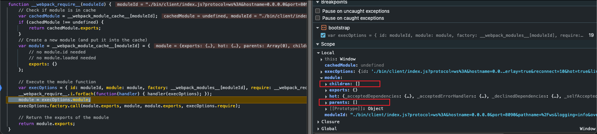

同时 require 函数形成了闭包 

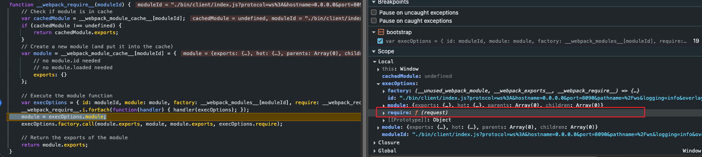

然后就是执行模块的 factory.call 进行加载模块

```javascript
// 改变 factory 函数指向，并调用函数
execOptions.factory.call(module.exports, module, module.exports, execOptions.require);
```

在执行到 client/index.js 内部时，可以查看到以下代码如下


会执行 `__webpack_require__.r` 函数，但是实际执行到的是 f(request){} 函数的 r 函数，目的就是将 module.exports 设置 `__esModule` 属性为 true。

然后在执行 `__webpack_require__` 对 `./bin/hot/emitter.js` 进行加载也就是调用 createRequire 返回的函数。

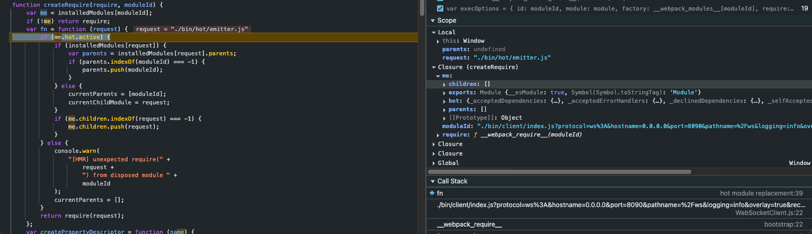

当执行完之后 me 模块也就是父模块的 children 属性多出当前模块id

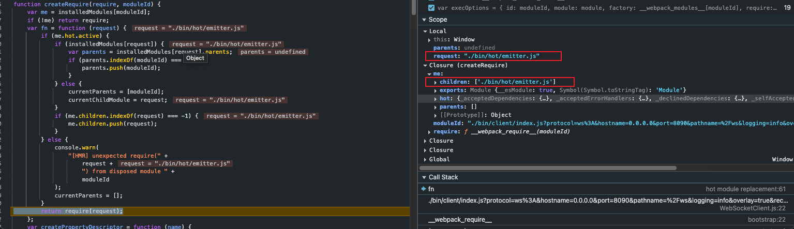

执行上述过程还并未对 hot/emitter.js 进行实际模块加载，实际模块的加载是返回的 require(request) 也就是重新执行 `__webpack_require__`

```javascript
// 返回 require(request) 结果，require 其实就是 __webpack_require__
return require(request);
```

并且 currentParents 会作为一个全局进行存储起来，在后续执行 require(request) 时也就会再次执行拦截器函数时给模块赋值父模块并且重置为 0

```javascript
 // 为加载模块之前添加拦截器，
__webpack_require__.i.push(function (options) {
  var module = options.module;
  var require = createRequire(options.require, options.id);

  // 创建 module.hot 注入
  module.hot = createModuleHotObject(options.id, module);
  // 将存储父模块赋值当前模块，如果当前模块为根模块就默认为 []
  module.parents = currentParents;
  module.children = [];
  // 重新将 currentParents 重置为 []
  currentParents = [];
  options.require = require;
});
```

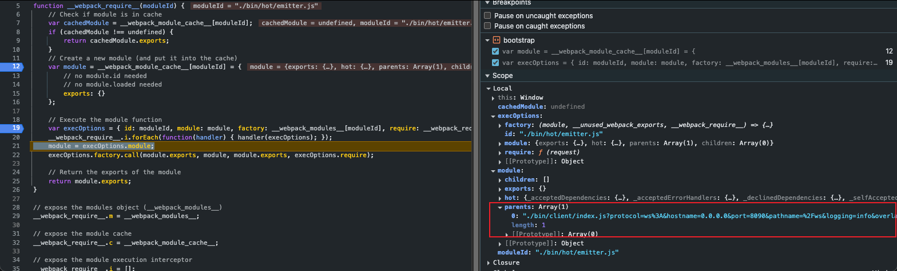

webpack 就是由此反复闭包处理加载模块，从而确定了模块之间的关系。

##  八、代码热更新

### 8.1、module.hot.check调用

在 module.hot.check() 的调用实际就是调用 hotCheck()

```javascript
function hotCheck(applyOnUpdate) {
    if (currentStatus !== 'idle') {
      throw new Error('check() is only allowed in idle status');
    }
    return setStatus('check')
  		// 获取chunk更新manifest
      .then(__webpack_require__.hmrM) // __webpack_require__.hmrM 获取那些模块变更了信息
      .then(function (update) {
        // update 的数据结构为 {"c":["main"],"r":[],"m":[]}
        if (!update) {
          return setStatus(applyInvalidatedModules() ? 'ready' : 'idle').then(function () {
            return null;
          });
        }

        return setStatus('prepare').then(function () {
          var updatedModules = [];
          currentUpdateApplyHandlers = [];

          return Promise.all(
            Object.keys(__webpack_require__.hmrC).reduce(function (promises, key) {
              // 这里实际调用的是 __webpack_require__.hmrC.jsonp
              __webpack_require__.hmrC[key](
                update.c,
                update.r,
                update.m,
                promises,
                currentUpdateApplyHandlers,
                updatedModules
              );
              return promises; // promises 实际就是对 js 的 chunk 文件进行拉取
            }, [])
          ).then(function () {
            // 等待 js 的 chunk 执行完成之后执行
            return waitForBlockingPromises(function () {
              if (applyOnUpdate) {
                // 执行依赖模块更新逻辑
                return internalApply(applyOnUpdate);
              }
              return setStatus('ready').then(function () {
                return updatedModules;
              });
            });
          });
        });
      });
  }
```

### 8.2、获取文件变化的json数据

在执行完 setStatus('check') 会执行 `__webpack_require__.hmrM ` 函数，实际就是通过 fetch 函数拉取对应 json 数据

```javascript
__webpack_require__.hmrM = () => {
    if (typeof fetch === 'undefined') throw new Error('No browser support: need fetch API');
    return fetch(__webpack_require__.p + __webpack_require__.hmrF()).then((response) => {
      if (response.status === 404) return; // no update available
      if (!response.ok) throw new Error('Failed to fetch update manifest ' + response.statusText);
      return response.json();
    });
  };
```

其中的 `__webpack_require__.hmrF()` 就是获取对应文件信息进行拉取

```javascript
(() => {
  __webpack_require__.hmrF = () => 'main.' + __webpack_require__.h() + '.hot-update.json';
})();
```

其中 `__webpack_require__.h()` 就是获取 hash 。

然后获取到 json 数据进行 response.json()，返回的数据格式如下

```javascript
{"c":["main"],"r":[],"m":[]}
```

### 8.3、通过jsonp获取变化的模块js

在获取的 json 数据时，然后陆续执行后续返回的 setStatus("prepare") 函数，执行完之后就执行后续的 then 方法

```javascript
return setStatus("prepare").then(function () {
				var updatedModules = [];
				currentUpdateApplyHandlers = [];

				return Promise.all(
					Object.keys(__webpack_require__.hmrC).reduce(function (
						promises,
						key
					) {
						__webpack_require__.hmrC[key](
							update.c,
							update.r,
							update.m,
							promises,
							currentUpdateApplyHandlers,
							updatedModules
						);
						return promises;
					}, [])
				).then(function () {
					return waitForBlockingPromises(function () {
						if (applyOnUpdate) {
							return internalApply(applyOnUpdate);
						}
						return setStatus("ready").then(function () {
							return updatedModules;
						});
					});
				});
			});
```

然后在执行 Promise.all 函数，最终对  `Object.keys(__webpack_require__.hmrC)` 的操作实际就是对 `__webpack_require__.hmrC.jsonp` 的 jsonp 属性处理，在执行完执行实际就是 `Promise.all([Promise])` ，内部的 Promise 就是对更改的模块js进行的一个获取。

```javascript
Promise.all(
    Object.keys(__webpack_require__.hmrC).reduce(function (
      promises,
      key
    ) {
      __webpack_require__.hmrC[key](
        update.c,
        update.r,
        update.m,
        promises,
        currentUpdateApplyHandlers,
        updatedModules
      );
      return promises;
    }, [])
  )
```

实际的是执行 `__webpack_require__.hmrC.jsonp ` 函数，其中最重要的就是 `promises.push(loadUpdateChunk(chunkId, updatedModulesList))`

```javascript
__webpack_require__.hmrC.jsonp = function (
      chunkIds, // 传递过来的需要更新 chunkIds ['main']
      removedChunks, // 需要移除的 chunksId
      removedModules,  // 需要移除的模块
      promises,
      applyHandlers,
      updatedModulesList
    ) {
  		// 
      applyHandlers.push(applyHandler);
      currentUpdateChunks = {};
  		// 当前需要移除的模块
      currentUpdateRemovedChunks = removedChunks;
      currentUpdate = removedModules.reduce(function (obj, key) {
        obj[key] = false;
        return obj;
      }, {});
      currentUpdateRuntime = [];
      chunkIds.forEach(function (chunkId) {
         /**
         * 判断 installedChunks 是否已经加载过，加载过则需要进行替换
         * loadUpdateChunk 这个方法和获取动态 js 的模块一致
         */
        if (__webpack_require__.o(installedChunks, chunkId) && installedChunks[chunkId] !== undefined) {
          // 对 promises 进行拉取 js 文件异步处理
          promises.push(loadUpdateChunk(chunkId, updatedModulesList));
          currentUpdateChunks[chunkId] = true;
        } else {
          currentUpdateChunks[chunkId] = false;
        }
      });
      if (__webpack_require__.f) {
        __webpack_require__.f.jsonpHmr = function (chunkId, promises) {
          if (
            currentUpdateChunks &&
            __webpack_require__.o(currentUpdateChunks, chunkId) &&
            !currentUpdateChunks[chunkId]
          ) {
            promises.push(loadUpdateChunk(chunkId));
            currentUpdateChunks[chunkId] = true;
          }
        };
      }
    };
```


在等待 loadUpdateChunk 函数执行完成之后就获取到了更新后的模块信息，获取到的模块如下所示

```javascript
'use strict';
self['webpackHotUpdatedev_server'](
  'main',
  {
    './src/demo.js': (__unused_webpack_module, __webpack_exports__, __webpack_require__) => {
      __webpack_require__.r(__webpack_exports__);
      __webpack_require__.d(__webpack_exports__, {
        a: () => /* binding */ a,
      });
      const a = 32122;
    },
  },
  function (__webpack_require__) {
    /* webpack/runtime/getFullHash */
    (() => {
      __webpack_require__.h = () => '58ac681147d66d9a9cf6';
    })();
  }
);
```

然后就是对 `self['webpackHotUpdatedev_server']`  的函数注入进行执行，具体实现过程如下

```javascript
self['webpackHotUpdatedev_server'] = (chunkId, moreModules, runtime) => {
    for (var moduleId in moreModules) {
      if (__webpack_require__.o(moreModules, moduleId)) {
        // 将获取到的最新模块赋值给 currentUpdate
        currentUpdate[moduleId] = moreModules[moduleId];
        // 判断 currentUpdatedModulesList 是否存在，存在就进行 push
        if (currentUpdatedModulesList) currentUpdatedModulesList.push(moduleId);
      }
    }
  	
  	// 传递过来时的函数，主要用于替换hash
    if (runtime) currentUpdateRuntime.push(runtime);
  
    if (waitingUpdateResolves[chunkId]) {
      waitingUpdateResolves[chunkId]();
      waitingUpdateResolves[chunkId] = undefined;
    }
  };
```

### 8.4、模块删除替换

#### 8.4.1、执行internalApp函数

在获取变化后 js 模块之后就会执行 internalApp 函数，只有是做依赖模块替换。

```javascript
function internalApply(options) {
  options = options || {};

  applyInvalidatedModules();

  var results = currentUpdateApplyHandlers.map(function (handler) {
    return handler(options); // 执行的是 applyHandler 函数
  });
  // 执行完成之后设置 undefined
  currentUpdateApplyHandlers = undefined;

  var errors = results
    .map(function (r) {
      return r.error;
    })
    .filter(Boolean);

  if (errors.length > 0) {
    return setStatus('abort').then(function () {
      throw errors[0];
    });
  }

  // Now in "dispose" phase
  var disposePromise = setStatus('dispose');

  results.forEach(function (result) {
    if (result.dispose) result.dispose();
  });

  // Now in "apply" phase
  var applyPromise = setStatus('apply');

  var error;
  var reportError = function (err) {
    if (!error) error = err;
  };

  var outdatedModules = [];

  var onAccepted = function () {
    return Promise.all([disposePromise, applyPromise]).then(function () {
      // handle errors in accept handlers and self accepted module load
      if (error) {
        return setStatus('fail').then(function () {
          throw error;
        });
      }

      if (queuedInvalidatedModules) {
        return internalApply(options).then(function (list) {
          outdatedModules.forEach(function (moduleId) {
            if (list.indexOf(moduleId) < 0) list.push(moduleId);
          });
          return list;
        });
      }

      return setStatus('idle').then(function () {
        return outdatedModules;
      });
    });
  };

  return Promise.all(
    results
      .filter(function (result) {
        return result.apply;
      })
      .map(function (result) {
        return result.apply(reportError);
      })
  )
    .then(function (applyResults) {
      applyResults.forEach(function (modules) {
        if (modules) {
          for (var i = 0; i < modules.length; i++) {
            outdatedModules.push(modules[i]);
          }
        }
      });
    })
    .then(onAccepted);
}
```

#### 8.4.2、执行applyHandler函数

在执行到 currentUpdateApplyHandlers 的处理时实际执行的是 applyHandler 函数

```javascript
var results = currentUpdateApplyHandlers.map(function (handler) {
  return handler(options); // 执行的是 applyHandler 函数
});
```

applyHandler 函数详解如下

```javascript
function applyHandler(options) {
    if (__webpack_require__.f) delete __webpack_require__.f.jsonpHmr;
    currentUpdateChunks = undefined;
    function getAffectedModuleEffects(updateModuleId) {
      // 获取到的 id
      var outdatedModules = [updateModuleId];
      var outdatedDependencies = {};

      var queue = outdatedModules.map(function (id) {
        // [{ chain: [], id: id }]
        return {
          chain: [id],
          id: id,
        };
      });
      while (queue.length > 0) {
        var queueItem = queue.pop(); // 取出 queue
        var moduleId = queueItem.id; // 获取 moduleId
        var chain = queueItem.chain;
        var module = __webpack_require__.c[moduleId]; // 从缓存模块中取出模块，取出的是历史模块
        if (!module || (module.hot._selfAccepted && !module.hot._selfInvalidated)) continue;
        // 取出来为 false
        if (module.hot._selfDeclined) {
          return {
            type: 'self-declined',
            chain: chain,
            moduleId: moduleId,
          };
        }
        // 取出来为 false
        if (module.hot._main) {
          return {
            type: 'unaccepted',
            chain: chain,
            moduleId: moduleId,
          };
        }
        // 遍历 module 的 父模块 parents
        for (var i = 0; i < module.parents.length; i++) {
          var parentId = module.parents[i]; // 取出 父模块 id
          var parent = __webpack_require__.c[parentId]; // 从缓存中获取父模块，判断是否存在
          if (!parent) continue;
          // 未执行
          if (parent.hot._declinedDependencies[moduleId]) {
            return {
              type: 'declined',
              chain: chain.concat([parentId]),
              moduleId: moduleId,
              parentId: parentId,
            };
          }
          if (outdatedModules.indexOf(parentId) !== -1) continue;
          // 执行
          if (parent.hot._acceptedDependencies[moduleId]) {
            if (!outdatedDependencies[parentId]) outdatedDependencies[parentId] = []; // 设置 { parentId: [] }
            addAllToSet(outdatedDependencies[parentId], [moduleId]); // outdatedDependencies： { ./src/index.js : ['./src/demo.js'] }
            // 跳出此次 for 循环
            continue;
          }
          // 后面不执行
          delete outdatedDependencies[parentId];
          outdatedModules.push(parentId);
          queue.push({
            chain: chain.concat([parentId]),
            id: parentId,
          });
        }
      }

      return {
        type: 'accepted',
        moduleId: updateModuleId,
        outdatedModules: outdatedModules,
        outdatedDependencies: outdatedDependencies,
      };
    }

    function addAllToSet(a, b) {
      for (var i = 0; i < b.length; i++) {
        var item = b[i];
        if (a.indexOf(item) === -1) a.push(item);
      }
    }

    // at begin all updates modules are outdated
    // the "outdated" status can propagate to parents if they don't accept the children
    var outdatedDependencies = {};
    var outdatedModules = [];
    var appliedUpdate = {};

    var warnUnexpectedRequire = function warnUnexpectedRequire(module) {
      console.warn('[HMR] unexpected require(' + module.id + ') to disposed module');
    };

    for (var moduleId in currentUpdate) {
      // 判断当前。moduleId 是否在 currentUpdate，currentUpdate 实际就是 { './src/demo.js': () => {} }
      if (__webpack_require__.o(currentUpdate, moduleId)) {
        var newModuleFactory = currentUpdate[moduleId]; // 取出模块函数
        var result = newModuleFactory
          ? getAffectedModuleEffects(moduleId) // 当存在时就调用 getAffectedModuleEffects，核心就是获取 result
          : {
              type: 'disposed',
              moduleId: moduleId,
            };
        /** @type {Error|false} */
        var abortError = false;
        var doApply = false;
        var doDispose = false;
        var chainInfo = '';
        if (result.chain) {
          chainInfo = '\nUpdate propagation: ' + result.chain.join(' -> ');
        }
        switch (result.type) {
          case 'self-declined':
            if (options.onDeclined) options.onDeclined(result);
            if (!options.ignoreDeclined)
              abortError = new Error('Aborted because of self decline: ' + result.moduleId + chainInfo);
            break;
          case 'declined':
            if (options.onDeclined) options.onDeclined(result);
            if (!options.ignoreDeclined)
              abortError = new Error(
                'Aborted because of declined dependency: ' + result.moduleId + ' in ' + result.parentId + chainInfo
              );
            break;
          case 'unaccepted':
            if (options.onUnaccepted) options.onUnaccepted(result);
            if (!options.ignoreUnaccepted)
              abortError = new Error('Aborted because ' + moduleId + ' is not accepted' + chainInfo);
            break;
          case 'accepted':
            if (options.onAccepted) options.onAccepted(result);
            doApply = true;
            break;
          case 'disposed':
            if (options.onDisposed) options.onDisposed(result);
            doDispose = true;
            break;
          default:
            throw new Error('Unexception type ' + result.type);
        }
        if (abortError) {
          return {
            error: abortError,
          };
        }
        if (doApply) {
          appliedUpdate[moduleId] = newModuleFactory;
          addAllToSet(outdatedModules, result.outdatedModules);
          for (moduleId in result.outdatedDependencies) {
            if (__webpack_require__.o(result.outdatedDependencies, moduleId)) {
              if (!outdatedDependencies[moduleId]) outdatedDependencies[moduleId] = [];
              addAllToSet(outdatedDependencies[moduleId], result.outdatedDependencies[moduleId]);
            }
          }
        }
        if (doDispose) {
          addAllToSet(outdatedModules, [result.moduleId]);
          appliedUpdate[moduleId] = warnUnexpectedRequire;
        }
      }
    }
    currentUpdate = undefined;

    // Store self accepted outdated modules to require them later by the module system
    var outdatedSelfAcceptedModules = [];
    for (var j = 0; j < outdatedModules.length; j++) {
      var outdatedModuleId = outdatedModules[j];
      var module = __webpack_require__.c[outdatedModuleId];
      if (
        module &&
        (module.hot._selfAccepted || module.hot._main) &&
        // removed self-accepted modules should not be required
        appliedUpdate[outdatedModuleId] !== warnUnexpectedRequire &&
        // when called invalidate self-accepting is not possible
        !module.hot._selfInvalidated
      ) {
        outdatedSelfAcceptedModules.push({
          module: outdatedModuleId,
          require: module.hot._requireSelf,
          errorHandler: module.hot._selfAccepted,
        });
      }
    }

    var moduleOutdatedDependencies;

    return {
      dispose: function () {
        currentUpdateRemovedChunks.forEach(function (chunkId) {
          delete installedChunks[chunkId];
        });
        currentUpdateRemovedChunks = undefined;

        var idx;
        var queue = outdatedModules.slice();
        while (queue.length > 0) {
          var moduleId = queue.pop();
          var module = __webpack_require__.c[moduleId];
          if (!module) continue;

          var data = {};

          // Call dispose handlers
          var disposeHandlers = module.hot._disposeHandlers;
          for (j = 0; j < disposeHandlers.length; j++) {
            disposeHandlers[j].call(null, data);
          }
          __webpack_require__.hmrD[moduleId] = data;

          // disable module (this disables requires from this module)
          module.hot.active = false;

          // remove module from cache
          delete __webpack_require__.c[moduleId];

          // when disposing there is no need to call dispose handler
          delete outdatedDependencies[moduleId];

          // remove "parents" references from all children
          for (j = 0; j < module.children.length; j++) {
            var child = __webpack_require__.c[module.children[j]];
            if (!child) continue;
            idx = child.parents.indexOf(moduleId);
            if (idx >= 0) {
              child.parents.splice(idx, 1);
            }
          }
        }

        // remove outdated dependency from module children
        var dependency;
        for (var outdatedModuleId in outdatedDependencies) {
          if (__webpack_require__.o(outdatedDependencies, outdatedModuleId)) {
            module = __webpack_require__.c[outdatedModuleId];
            if (module) {
              moduleOutdatedDependencies = outdatedDependencies[outdatedModuleId];
              for (j = 0; j < moduleOutdatedDependencies.length; j++) {
                dependency = moduleOutdatedDependencies[j];
                idx = module.children.indexOf(dependency);
                if (idx >= 0) module.children.splice(idx, 1);
              }
            }
          }
        }
      },
      apply: function (reportError) {
        var acceptPromises = [];
        // insert new code
        for (var updateModuleId in appliedUpdate) {
          if (__webpack_require__.o(appliedUpdate, updateModuleId)) {
            __webpack_require__.m[updateModuleId] = appliedUpdate[updateModuleId];
          }
        }

        // run new runtime modules
        for (var i = 0; i < currentUpdateRuntime.length; i++) {
          currentUpdateRuntime[i](__webpack_require__);
        }

        // call accept handlers
        for (var outdatedModuleId in outdatedDependencies) {
          if (__webpack_require__.o(outdatedDependencies, outdatedModuleId)) {
            var module = __webpack_require__.c[outdatedModuleId];
            if (module) {
              moduleOutdatedDependencies = outdatedDependencies[outdatedModuleId];
              var callbacks = [];
              var errorHandlers = [];
              var dependenciesForCallbacks = [];
              for (var j = 0; j < moduleOutdatedDependencies.length; j++) {
                var dependency = moduleOutdatedDependencies[j];
                var acceptCallback = module.hot._acceptedDependencies[dependency];
                var errorHandler = module.hot._acceptedErrorHandlers[dependency];
                if (acceptCallback) {
                  if (callbacks.indexOf(acceptCallback) !== -1) continue;
                  callbacks.push(acceptCallback);
                  errorHandlers.push(errorHandler);
                  dependenciesForCallbacks.push(dependency);
                }
              }
              for (var k = 0; k < callbacks.length; k++) {
                var result;
                try {
                  result = callbacks[k].call(null, moduleOutdatedDependencies);
                } catch (err) {
                  if (typeof errorHandlers[k] === 'function') {
                    try {
                      errorHandlers[k](err, {
                        moduleId: outdatedModuleId,
                        dependencyId: dependenciesForCallbacks[k],
                      });
                    } catch (err2) {
                      if (options.onErrored) {
                        options.onErrored({
                          type: 'accept-error-handler-errored',
                          moduleId: outdatedModuleId,
                          dependencyId: dependenciesForCallbacks[k],
                          error: err2,
                          originalError: err,
                        });
                      }
                      if (!options.ignoreErrored) {
                        reportError(err2);
                        reportError(err);
                      }
                    }
                  } else {
                    if (options.onErrored) {
                      options.onErrored({
                        type: 'accept-errored',
                        moduleId: outdatedModuleId,
                        dependencyId: dependenciesForCallbacks[k],
                        error: err,
                      });
                    }
                    if (!options.ignoreErrored) {
                      reportError(err);
                    }
                  }
                }
                if (result && typeof result.then === 'function') {
                  acceptPromises.push(result);
                }
              }
            }
          }
        }

        var onAccepted = function () {
          // Load self accepted modules
          for (var o = 0; o < outdatedSelfAcceptedModules.length; o++) {
            var item = outdatedSelfAcceptedModules[o];
            var moduleId = item.module;
            try {
              item.require(moduleId);
            } catch (err) {
              if (typeof item.errorHandler === 'function') {
                try {
                  item.errorHandler(err, {
                    moduleId: moduleId,
                    module: __webpack_require__.c[moduleId],
                  });
                } catch (err1) {
                  if (options.onErrored) {
                    options.onErrored({
                      type: 'self-accept-error-handler-errored',
                      moduleId: moduleId,
                      error: err1,
                      originalError: err,
                    });
                  }
                  if (!options.ignoreErrored) {
                    reportError(err1);
                    reportError(err);
                  }
                }
              } else {
                if (options.onErrored) {
                  options.onErrored({
                    type: 'self-accept-errored',
                    moduleId: moduleId,
                    error: err,
                  });
                }
                if (!options.ignoreErrored) {
                  reportError(err);
                }
              }
            }
          }
        };

        return Promise.all(acceptPromises)
          .then(onAccepted)
          .then(function () {
            return outdatedModules;
          });
      },
    };
  }
```

返回的 results 的数据结构为

```javascript
{
    "type": "accepted",
    "moduleId": "./src/demo.js", // 更新的模块
    "outdatedModules": [ // 过时旧模块
        "./src/demo.js"
    ],
    "outdatedDependencies": { // 过时依赖
        "./src/index.js": [
            "./src/demo.js"
        ]
    }
}
```

在后续实际执行的是根据 result.type 的执行 switch 语句，实际则是执行对应的 accepted 分支

```javascript
case "accepted":
      if (options.onAccepted) options.onAccepted(result);
      doApply = true;
      break;
```

这里设置 doApply 为 true 实际就会执行

```javascript
if (doApply) {
  	// 将获取到 newModuleFactory 赋值给 appliedUpdate 对象
    appliedUpdate[moduleId] = newModuleFactory;
  	// 将 outdatedModules 赋值给 outdatedModules
    addAllToSet(outdatedModules, result.outdatedModules);
    for (moduleId in result.outdatedDependencies) {
      if (__webpack_require__.o(result.outdatedDependencies, moduleId)) {
        if (!outdatedDependencies[moduleId])
          outdatedDependencies[moduleId] = [];
        addAllToSet(
          outdatedDependencies[moduleId],
          result.outdatedDependencies[moduleId]
        );
      }
    }
  }
```

详细见下面 debugger 图解

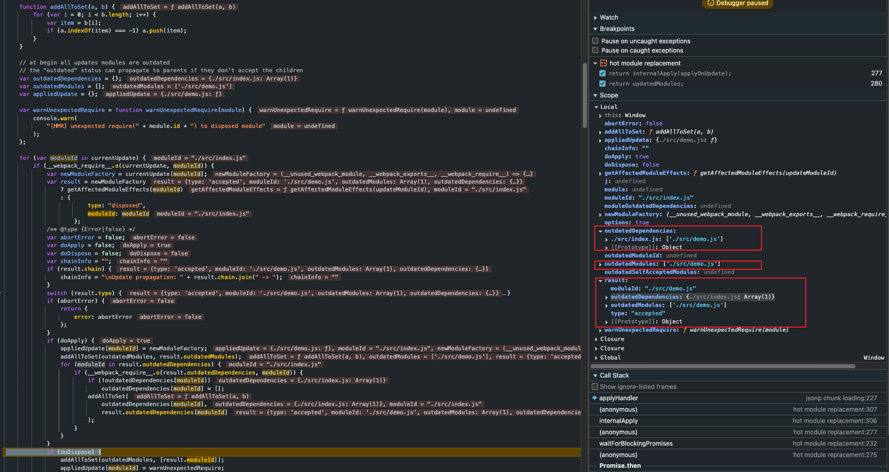

#### 8.4.3、执行dispose函数

```javascript
// 这里返回 results 为 [{ dispose: f(), apply: f()  }]
results.forEach(function (result) {
	if (result.dispose) result.dispose();
});
```

执行返回的 results 的 dispose 函数，主要是移除旧模块的引用。

```javascript
dispose: function () {
          // 从installedChunk中删除要移除的chunk
          currentUpdateRemovedChunks.forEach(function (chunkId) {
            delete installedChunks[chunkId];
          });
          currentUpdateRemovedChunks = undefined;

          var idx;
          var queue = outdatedModules.slice(); //获取一个新数组 []
          while (queue.length > 0) {
            var moduleId = queue.pop(); // 取出 moduleId
            var module = __webpack_require__.c[moduleId]; // 取出缓存模块，旧模块
            if (!module) continue;

            var data = {};

            // Call dispose handlers
            var disposeHandlers = module.hot._disposeHandlers;
            for (j = 0; j < disposeHandlers.length; j++) {
              disposeHandlers[j].call(null, data);
            }
            __webpack_require__.hmrD[moduleId] = data;

            // 将 active 设置 false，表示禁用模块
            module.hot.active = false;

            // 从缓存中删除模块
            delete __webpack_require__.c[moduleId];

            // when disposing there is no need to call dispose handler
            delete outdatedDependencies[moduleId];

            // remove "parents" references from all children
            for (j = 0; j < module.children.length; j++) {
              // 获取当前模块的子模块，
              var child = __webpack_require__.c[module.children[j]];
              if (!child) continue;
              // 再从子模块的 parents 属性中查找当前 moduleId，如果能找到，则需要删除
              idx = child.parents.indexOf(moduleId);
              if (idx >= 0) {
                child.parents.splice(idx, 1);
              }
            }
          }

          // remove outdated dependency from module children
          var dependency;
          for (var outdatedModuleId in outdatedDependencies) {
            // { "./src/index.js": [ "./src/demo.js" ] }
            if (__webpack_require__.o(outdatedDependencies, outdatedModuleId)) {
              module = __webpack_require__.c[outdatedModuleId]; // 获取到的是 ./src/index.js 模块
              if (module) {
                // 获取到的旧依赖
                moduleOutdatedDependencies = outdatedDependencies[outdatedModuleId]; // [ "./src/demo.js" ]
                for (j = 0; j < moduleOutdatedDependencies.length; j++) {
                  dependency = moduleOutdatedDependencies[j]; // 取出来的 "./src/demo.js" moduleId
                  idx = module.children.indexOf(dependency); // 在 ./src/index.js 查找子模块中是否有 "./src/demo.js"，
                  if (idx >= 0) module.children.splice(idx, 1); // 如果存在就删除
                }
              }
            }
          }
        },
```

有四种情况下的模块移除：

1. 第一种是 currentUpdateRemovedChunks  直接移除的 chunk ，没有更新操作而是直接删除的模块。
2. 第二种是从 `__webpack_require__.c`  缓存的模块移除本模块。
3. 第三种是移除的模块的中存在子模块对该模块的引用时，需要将子模块的对该模块引用删除。
4. 第四种是移除的模块的父模块对该模块的引用，需要从父模块中将该模块的引用删除。

#### 8.4.4、执行apply函数

```javascript
apply: function (reportError) {
      var acceptPromises = [];
      // 注入新的的模块
      for (var updateModuleId in appliedUpdate) {
        if (__webpack_require__.o(appliedUpdate, updateModuleId)) {
          __webpack_require__.m[updateModuleId] = appliedUpdate[updateModuleId];
        }
      }

      // 执行新的 runtime 函数，实际就是在更新本地 hash
      for (var i = 0; i < currentUpdateRuntime.length; i++) {
        currentUpdateRuntime[i](__webpack_require__);
      }

      // call accept handlers
      for (var outdatedModuleId in outdatedDependencies) {
        //  { "./src/index.js": [ "./src/demo.js" ] }
        if (__webpack_require__.o(outdatedDependencies, outdatedModuleId)) {
          var module = __webpack_require__.c[outdatedModuleId]; // 获取到 ./src/index.js 模块
          if (module) {
            moduleOutdatedDependencies = outdatedDependencies[outdatedModuleId]; // [ "./src/demo.js" ]
            var callbacks = [];
            var errorHandlers = [];
            var dependenciesForCallbacks = [];
            for (var j = 0; j < moduleOutdatedDependencies.length; j++) {
              var dependency = moduleOutdatedDependencies[j]; // "./src/demo.js"
              var acceptCallback = module.hot._acceptedDependencies[dependency]; // accept回调函数
              var errorHandler = module.hot._acceptedErrorHandlers[dependency];
              if (acceptCallback) {
                if (callbacks.indexOf(acceptCallback) !== -1) continue;
                callbacks.push(acceptCallback); // 回调函数
                errorHandlers.push(errorHandler);
                dependenciesForCallbacks.push(dependency);
              }
            }
            for (var k = 0; k < callbacks.length; k++) {
              var result;
              try {
                // 执行 accept 回调函数
                result = callbacks[k].call(null, moduleOutdatedDependencies);
              } catch (err) {
                if (typeof errorHandlers[k] === 'function') {
                  try {
                    errorHandlers[k](err, {
                      moduleId: outdatedModuleId,
                      dependencyId: dependenciesForCallbacks[k],
                    });
                  } catch (err2) {
                    if (options.onErrored) {
                      options.onErrored({
                        type: 'accept-error-handler-errored',
                        moduleId: outdatedModuleId,
                        dependencyId: dependenciesForCallbacks[k],
                        error: err2,
                        originalError: err,
                      });
                    }
                    if (!options.ignoreErrored) {
                      reportError(err2);
                      reportError(err);
                    }
                  }
                } else {
                  if (options.onErrored) {
                    options.onErrored({
                      type: 'accept-errored',
                      moduleId: outdatedModuleId,
                      dependencyId: dependenciesForCallbacks[k],
                      error: err,
                    });
                  }
                  if (!options.ignoreErrored) {
                    reportError(err);
                  }
                }
              }
              if (result && typeof result.then === 'function') {
                acceptPromises.push(result);
              }
            }
          }
        }
      }
  
      return Promise.all(acceptPromises)
        .then(onAccepted)
        .then(function () {
          return outdatedModules;
        });
    },
```

其中的 accept 的回调函数如下

```javascript
__WEBPACK_OUTDATED_DEPENDENCIES__ => { /* harmony import */ _demo__WEBPACK_IMPORTED_MODULE_0__ = __webpack_require__(/*! ./demo.js */ "./src/demo.js");
return (() => {
  render();
})(__WEBPACK_OUTDATED_DEPENDENCIES__); }
```

