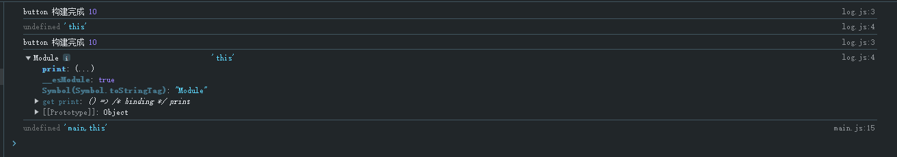

# 工程化中import被编译了什么

## 一、项目初始化搭建

在 `/src` 目录下创建 `main.js`、`log.js`、 `num.js` ，并且用 main.js 作为打包入口。

JavsScript 内容如下

```javascript
// main.js
import { print } from './log.js';

const button = document.createElement('button');
const text = document.createTextNode('click me');
button.appendChild(text);

button.onclick = (e) => {
  console.log('button click');
};

print();

console.log(this, 'main,this');

document.body.appendChild(button);

// log.js
import { num } from './num';

export function print() {
  console.log('button 构建完成', num);
  console.log(this, 'this');
}

// num.js
export const num = 10;
```

webpack.config.js 配置如下

```javascript
const HtmlWebpackPlugin = require('html-webpack-plugin');
const path = require('path');

module.exports = {
  entry: './src/main.js',

  output: {
    path: path.resolve(__dirname, './dist'),
    filename: 'js/[name].[hash:8].js',
    chunkFilename: 'js/[name].[hash:8].js', // 动态 import 文件名（后续会用到）
    clean: true,
  },

  // 插件
  plugins: [
    new HtmlWebpackPlugin({
      template: path.resolve(__dirname, 'public/index.html'),
    }),
  ],

  mode: 'development',
  devtool: 'inline-source-map',

  // 开发服务器
  devServer: {
    port: 8090,
    hot: true,
  },
};
```

配置 scripts 命令，并执行构建命令

```json
"scripts": {
  "build": "cross-env NODE_ENV=production webpack",
  "dev": "cross-env NODE_ENV=development webpack serve"
},
```

## 二、静态import导入分析

这里会通过对构建之后生成的 js 文件源代码分析，原因是开发环境生成代码和构建之后文件执行起来一样，同时开发环境生成代码包含热更新相关代码，代码量居多不易阅读分析。

### 2.1、整体结构分析如下

打包之后的代码为一个自执行函数，整体结构分析如下

```javascript
// 自执行函数
(() => {
  // 开启严格模式
  'use strict';
  
  // 模块对象
  var __webpack_modules__ = {}
  
  // 模块缓存，主要为加载过一次的模块进行缓存
  var __webpack_module_cache__ = {}
  
  // 模块加载函数
  function __webpack_require__(moduleId) {
    
  }
  
  // 自执行函数，为__webpack_require__添加 d 属性
  (()=>{
    // __webpack_require__.d
  })();
  
  // 自执行函数，为__webpack_require__添加 o 属性
  (()=>{
    // __webpack_require__.o
  })();
  
  // 自执行函数，为__webpack_require__添加 r 属性
  (()=>{
    // __webpack_require__.r
  })();
  
  var __webpack_exports__ = {};
  // ./src/main.js 执行
  (()=>{
    __webpack_require__.r(__webpack_exports__);
    var _log_js__WEBPACK_IMPORTED_MODULE_0__ = __webpack_require__(/*! ./log.js */ './src/log.js');

    const button = document.createElement('button');
    const text = document.createTextNode('click me');
    button.appendChild(text);

    button.onclick = (e) => {
      console.log('button click');
    };

    (0, _log_js__WEBPACK_IMPORTED_MODULE_0__.print)();

    console.log(undefined, 'main,this');

    document.body.appendChild(button);
  })();
})();
```

### 2.2、\_\_webpack_modules__

`__webpack_modules__` 模块中包含了项目所有的模块，该 `__webpack_modules__` 的结构如下

```javascript
var __webpack_modules__ = {
  './src/log.js': (__unused_webpack_module, __webpack_exports__, __webpack_require__) => {},
  './src/num.js': (__unused_webpack_module, __webpack_exports__, __webpack_require__) => {}
}
```

当前定义模块只有两个 `./src/log.js` 和 `./src/num.js`

```javascript
var __webpack_modules__ = {
    './src/log.js': (__unused_webpack_module, __webpack_exports__, __webpack_require__) => {
      __webpack_require__.r(__webpack_exports__);
      __webpack_require__.d(__webpack_exports__, {
        print: () => /* binding */ print,
      });
      var _num__WEBPACK_IMPORTED_MODULE_0__ = __webpack_require__(/*! ./num */ './src/num.js');

      function print() {
        console.log('button 构建完成', _num__WEBPACK_IMPORTED_MODULE_0__.num);
        console.log(this, 'this');
      }
    },

    './src/num.js': (__unused_webpack_module, __webpack_exports__, __webpack_require__) => {
      __webpack_require__.r(__webpack_exports__);
      __webpack_require__.d(__webpack_exports__, {
        num: () => /* binding */ num,
      });
      const num = 10;
    },
  };
```

### 2.3、\_\_webpack_require__

`__webpack_require__` 函数加载过程分析如下

```javascript
 function __webpack_require__(moduleId) {
    // 检查模块是否加载过，加载过就从缓存中获取
    var cachedModule = __webpack_module_cache__[moduleId];
    if (cachedModule !== undefined) {
      return cachedModule.exports;
    }
    // 创建新的模块并存入 __webpack_module_cache__
    var module = (__webpack_module_cache__[moduleId] = {
      // no module.id needed
      // no module.loaded needed
      exports: {},
    });
   
   	// 此时 module = { exports: {} }

    // 执行 __webpack_modules__[moduleId] 取出来的函数
    __webpack_modules__[moduleId](module, module.exports, __webpack_require__);

    // 返回 module.exports
    return module.exports;
  }
```

### 2.4、main.js执行过程分析

执行 main.js 过程分析

```javascript
var __webpack_exports__ = {};

(() => {
  // 第一步： 为 __webpack_exports__ 添加 __esModule 属性
  __webpack_require__.r(__webpack_exports__);
  	
  // 第二步：加载 ./src/log.js 模块
  var _log_js__WEBPACK_IMPORTED_MODULE_0__ = __webpack_require__(/*! ./log.js */ './src/log.js');
  
  // 执行的 main.js
  const button = document.createElement('button');
  const text = document.createTextNode('click me');
  button.appendChild(text);

  button.onclick = (e) => {
    console.log('button click');
  };
  
  // 第三步：执行模块的方法
  (0, _log_js__WEBPACK_IMPORTED_MODULE_0__.print)();

  console.log(undefined, 'main,this');

  document.body.appendChild(button);

})();
```

第一步：`__webpack_require__.r` 如下

```javascript
 (() => {
    // __webpack_require__.r
    __webpack_require__.r = (exports) => {
      if (typeof Symbol !== 'undefined' && Symbol.toStringTag) {
        Object.defineProperty(exports, Symbol.toStringTag, { value: 'Module' });
      }
      Object.defineProperty(exports, '__esModule', { value: true });
    };
  })();
```

第二步：加载 `./src/log.js` 模块

在执行 `__webpack_require__('./src/log.js')` 会最终执行到  `__webpack_modules__[moduleId]`

```javascript
// __webpack_modules__['./src/log.js']
(__unused_webpack_module, __webpack_exports__, __webpack_require__) => {
  	//  为 __webpack_exports__ 添加 __esModule 属性
   	__webpack_require__.r(__webpack_exports__);
  	// 为 __webpack_exports__ 赋值
    __webpack_require__.d(__webpack_exports__, {
      print: () => /* binding */ print,
    });
  
  	// 加载 ./src/num.js 模块
    var _num__WEBPACK_IMPORTED_MODULE_0__ = __webpack_require__(/*! ./num */ './src/num.js');

    function print() {
      console.log('button 构建完成', _num__WEBPACK_IMPORTED_MODULE_0__.num);
      console.log(this, 'this');
    }
}
```

其中 `__webpack_require__.d` 函数如下

```javascript
// __webpack_require__.d
(() => {
  // define getter functions for harmony exports
  __webpack_require__.d = (exports, definition) => {
    // exports 为 {}， definition 为模块内容
    // 遍历 definition 对象
    for (var key in definition) {
      // 判断 key 是否属于 definition，并且不再 exports 对象之中
      if (__webpack_require__.o(definition, key) && !__webpack_require__.o(exports, key)) {
        // 为 exports 赋值 key 内容
        Object.defineProperty(exports, key, { enumerable: true, get: definition[key] });
      }
    }
  };
})();

// __webpack_require__.o
(() => {
  __webpack_require__.o = (obj, prop) => Object.prototype.hasOwnProperty.call(obj, prop);
})();
```

模块加载完成之后就会返回 module.exports

第三步：执行模块的方法

这里执行模块方法如下

```javascript
// 执行 ./src/log.js 的 print 方法
(0, _log_js__WEBPACK_IMPORTED_MODULE_0__.print)(); // 打印的 this 为 
```

这里用到了 [逗号运算符](https://developer.mozilla.org/zh-CN/docs/Web/JavaScript/Reference/Operators/Comma_operator)，主要避免模块导出对象的 this 绑定问题。

假设 `_log_js__WEBPACK_IMPORTED_MODULE_0__` 模块导出一个对象

```javascript
// 模拟 Webpack 打包后的模块
const _log_js__WEBPACK_IMPORTED_MODULE_0__ = {
  print: function() {
    console.log(this); // this 指向模块导出对象
  }
};
```

如果直接调用会有问题

```javascript
_log_js__WEBPACK_IMPORTED_MODULE_0__.print();
```

此时函数内的 `this` 指向 `_log_js__WEBPACK_IMPORTED_MODULE_0__` 对象，如果函数依赖正确的 `this` 上下文，可能会出错



所以推荐使用  [逗号运算符](https://developer.mozilla.org/zh-CN/docs/Web/JavaScript/Reference/Operators/Comma_operator) 进行调用

```javascript
 (0, _log_js__WEBPACK_IMPORTED_MODULE_0__.print)();

// 等价于
const printFunc = _log_js__WEBPACK_IMPORTED_MODULE_0__.print;
printFunc();
```

所以，`0` 只是一个 `占位符`，确保函数被正确解构和调用，是 Webpack 优化和规范化的结果。

函数被独立调用，`this` 指向全局对象（严格模式下为 `undefined` ）

### 2.5、编译后的完整代码

```javascript
(() => {
  'use strict';
  var __webpack_modules__ = {
    './src/log.js': (__unused_webpack_module, __webpack_exports__, __webpack_require__) => {
      __webpack_require__.r(__webpack_exports__);
      __webpack_require__.d(__webpack_exports__, {
        print: () => /* binding */ print,
      });
      var _num__WEBPACK_IMPORTED_MODULE_0__ = __webpack_require__(/*! ./num */ './src/num.js');

      function print() {
        console.log('button 构建完成', _num__WEBPACK_IMPORTED_MODULE_0__.num);
        console.log(this, 'this');
      }
    },

    './src/num.js': (__unused_webpack_module, __webpack_exports__, __webpack_require__) => {
      __webpack_require__.r(__webpack_exports__);
      __webpack_require__.d(__webpack_exports__, {
        num: () => /* binding */ num,
      });
      const num = 10;
    },
  };
  /************************************************************************/
  // The module cache
  var __webpack_module_cache__ = {};

  // The require function
  function __webpack_require__(moduleId) {
    // Check if module is in cache
    var cachedModule = __webpack_module_cache__[moduleId];
    if (cachedModule !== undefined) {
      return cachedModule.exports;
    }
    // Create a new module (and put it into the cache)
    var module = (__webpack_module_cache__[moduleId] = {
      // no module.id needed
      // no module.loaded needed
      exports: {},
    });

    // Execute the module function
    __webpack_modules__[moduleId](module, module.exports, __webpack_require__);

    // Return the exports of the module
    return module.exports;
  }

  /************************************************************************/
  /* webpack/runtime/define property getters */
  (() => {
    // define getter functions for harmony exports
    __webpack_require__.d = (exports, definition) => {
      for (var key in definition) {
        if (__webpack_require__.o(definition, key) && !__webpack_require__.o(exports, key)) {
          Object.defineProperty(exports, key, { enumerable: true, get: definition[key] });
        }
      }
    };
  })();

  /* webpack/runtime/hasOwnProperty shorthand */
  (() => {
    __webpack_require__.o = (obj, prop) => Object.prototype.hasOwnProperty.call(obj, prop);
  })();

  /* webpack/runtime/make namespace object */
  (() => {
    // define __esModule on exports
    __webpack_require__.r = (exports) => {
      if (typeof Symbol !== 'undefined' && Symbol.toStringTag) {
        Object.defineProperty(exports, Symbol.toStringTag, { value: 'Module' });
      }
      Object.defineProperty(exports, '__esModule', { value: true });
    };
  })();

  /************************************************************************/
  var __webpack_exports__ = {};
  // This entry needs to be wrapped in an IIFE because it needs to be isolated against other modules in the chunk.

  (() => {
    // ./src/main.js
    __webpack_require__.r(__webpack_exports__);
    var _log_js__WEBPACK_IMPORTED_MODULE_0__ = __webpack_require__(/*! ./log.js */ './src/log.js');

    const button = document.createElement('button');
    const text = document.createTextNode('click me');
    button.appendChild(text);

    button.onclick = (e) => {
      console.log('button click');
    };

    (0, _log_js__WEBPACK_IMPORTED_MODULE_0__.print)();

    console.log(undefined, 'main,this');

    document.body.appendChild(button);
  })();
})();
```

### 2.6、工程化import的本质

工程化 import 导入实际是通过 Object.defineProperty 来模拟 ES Module，

```javascript
Object.defineProperty(exports, key, { enumerable: true, get: definition[key] });
```

其本质还是 “地址赋值引用”，而非浏览器加载 ES Module 的真正引用传递

## 三、动态import导入分析

调整 main.js 入口文件，调整如下

```javascript
const button = document.createElement('button');
const text = document.createTextNode('click me');
button.appendChild(text);

button.onclick = (e) => {
  console.log('button click');
  import('./dynamic-import').then((res) => {
    console.log(res, 'res');
    console.log(res.log);
  });
};

document.body.appendChild(button);
```

### 3.1、main.js编译后的代码分析

```javascript
const button = document.createElement('button');
const text = document.createTextNode('click me');
button.appendChild(text);

button.onclick = (e) => {
  console.log('button click');
  __webpack_require__
    .e(/*! import() */ 'src_dynamic-import_js')
    .then(__webpack_require__.bind(__webpack_require__, /*! ./dynamic-import */ './src/dynamic-import.js'))
    .then((res) => {
      console.log(res, 'res');
      console.log(res.log);
    });
};

document.body.appendChild(button);
```

发现 `import('xxx').then()` 被解析成 `__webpack_require__.e` 方法进行加载，以下是 `__webpack_require__.e` 方法内容

```javascript
 (() => {
    __webpack_require__.f = {};
    // This file contains only the entry chunk.
    // The chunk loading function for additional chunks
    __webpack_require__.e = (chunkId) => {
      return Promise.all(
        Object.keys(__webpack_require__.f).reduce((promises, key) => {
          __webpack_require__.f[key](chunkId, promises);
          return promises;
        }, [])
      );
    };
  })();
```

在讨论 `__webpack_require__.e` 需要先了解 `__webpack_require__.f` 的处理过程。在 `__webpack_require__.f = {}` 之后会进行后续 `__webpack_require__.f.j` 赋值处理。

```javascript
var installedChunks = {
    main: 0,
};

__webpack_require__.f.j = (chunkId, promises) => {
	// 
};
```

所以在 `__webpack_require__.e` 中 ` Object.keys(__webpack_require__.f)` 遍历的是 key 是 `j` 函数

```javascript
Object.keys(__webpack_require__.f).reduce((promises, key) => {
  // key 为 j ，并实际调用的是 __webpack_require__.f.j 函数，传递 chunkId 和 promises
  __webpack_require__.f[key](chunkId, promises);
  return promises;
}, [])
```

### 3.2、\_\_webpack_require__.f.j详解

```javascript
// object to store loaded and loading chunks
// [resolve, reject, Promise] = chunk loading, 0 = chunk loaded
var installedChunks = {
  main: 0,
};

__webpack_require__.f.j = (chunkId, promises) => {
  // 判断 chunkId 是否在 installedChunks 中，如果在取 installedChunks[chunkId] 否则取 undefined
  var installedChunkData = __webpack_require__.o(installedChunks, chunkId) ? installedChunks[chunkId] : undefined;
  // 如果 installedChunkData 不等于 0，为 0 时说明已经加载
  if (installedChunkData !== 0) {
    
    // a Promise means "currently loading".
    if (installedChunkData) {
      promises.push(installedChunkData[2]);
    } else {
      if (true) {
        // all chunks have JS
        // setup Promise in chunk cache
        var promise = new Promise(
          (resolve, reject) => (installedChunkData = installedChunks[chunkId] = [resolve, reject])
        );
        
        // promises 为 [Promise]，installedChunkData 为 [resolve, reject, Promise]
        promises.push((installedChunkData[2] = promise));


        // 获取到的url信息
        var url = __webpack_require__.p + __webpack_require__.u(chunkId);
        
        var error = new Error();
        
        // 加载结束时处理回调
        var loadingEnded = (event) => {
          // 判断 chunkId 是否在 installedChunks 中
          if (__webpack_require__.o(installedChunks, chunkId)) {
            // 获取 installedChunkData 数据，一般 script 加载成功 installedChunkData 被设置为 0
            installedChunkData = installedChunks[chunkId];
            
            // 当 installedChunkData 不为 0 相关处理
            if (installedChunkData !== 0) installedChunks[chunkId] = undefined;
            if (installedChunkData) {
              var errorType = event && (event.type === 'load' ? 'missing' : event.type);
              var realSrc = event && event.target && event.target.src;
              error.message = 'Loading chunk ' + chunkId + ' failed.\n(' + errorType + ': ' + realSrc + ')';
              error.name = 'ChunkLoadError';
              error.type = errorType;
              error.request = realSrc;
              // 调用 reject 函数抛出错误
              installedChunkData[1](error);
            }
          }
        };
        // 获取动态 js 文件
        __webpack_require__.l(url, loadingEnded, 'chunk-' + chunkId, chunkId);
      }
    }
  }
};
```

### 3.3、\_\_webpack_require__.l 详解

```javascript
(() => {
  var inProgress = {};
  var dataWebpackPrefix = 'import:';
  // loadScript function to load a script via script tag
  
  __webpack_require__.l = (url, done, key, chunkId) => {
    if (inProgress[url]) {
      inProgress[url].push(done);
      return;
    }
    var script, needAttach;

    // key 存在时，在获取 html 中的 script 标签，判断 script 是否已经存在
    if (key !== undefined) {
      var scripts = document.getElementsByTagName('script');
      for (var i = 0; i < scripts.length; i++) {
        var s = scripts[i];
        if (s.getAttribute('src') == url || s.getAttribute('data-webpack') == dataWebpackPrefix + key) {
          script = s;
          break;
        }
      }
    }

    // 如果 script 不存在需要创建 script 脚本
    if (!script) {
      needAttach = true;
      script = document.createElement('script');

      script.charset = 'utf-8';
      script.timeout = 120;

      if (__webpack_require__.nc) {
        script.setAttribute('nonce', __webpack_require__.nc);
      }
      script.setAttribute('data-webpack', dataWebpackPrefix + key);

      script.src = url;
    }

    inProgress[url] = [done];
	
    // script 加载完成之后
    var onScriptComplete = (prev, event) => {
      // 取出 done 函数
      var doneFns = inProgress[url];
      delete inProgress[url];

      // script 加载完成之后还会对其进行移除
      script.parentNode && script.parentNode.removeChild(script);
      doneFns && doneFns.forEach((fn) => fn(event));
      
      if (prev) return prev(event);
    };

    // 脚本加载失败事件
    script.onerror = onScriptComplete.bind(null, script.onerror);
    // 脚本加载成功并执行完成之后触发
    script.onload = onScriptComplete.bind(null, script.onload);

    // 添加到 head 标签中
    needAttach && document.head.appendChild(script);
  };
})();
```

### 3.4、加载script并执行

当脚本被 script 成功请求获取到时会被解析执行，执行内容如下

```javascript
'use strict';
(self['webpackChunkimport'] = self['webpackChunkimport'] || []).push([
  ['src_dynamic-import_js'],
  {
    './src/dynamic-import.js': (__unused_webpack_module, __webpack_exports__, __webpack_require__) => {
      __webpack_require__.r(__webpack_exports__);
      __webpack_require__.d(__webpack_exports__, {
        log: () => /* binding */ log,
      });
      const log = 'dynamic import';
    },
  },
]);

```

其中主要的是 `self['webpackChunkimport']` 是一个数组 push `./src/dynamic-import.js` 的模块，执行完成之后会调用 onScriptComplete 函数。

### 3.5、webpackChunkimport

```javascript
var webpackJsonpCallback = (parentChunkLoadingFunction, data) => {
 // 
};

var chunkLoadingGlobal = (self['webpackChunkimport'] = self['webpackChunkimport'] || []);
chunkLoadingGlobal.forEach(webpackJsonpCallback.bind(null, 0));

// 更改 self['webpackChunkimport'] 的 push 方法，
chunkLoadingGlobal.push = webpackJsonpCallback.bind(null, chunkLoadingGlobal.push.bind(chunkLoadingGlobal));
```

chunkLoadingGlobal.push 方法被更改过，不再是原数组的 push 函数。最终执行还是 webpackJsonpCallback 方法，其中的 data 就是传递过来的参数

```javascript
(self['webpackChunkimport'] = self['webpackChunkimport'] || []).push([
  ['src_dynamic-import_js'],
  {
    './src/dynamic-import.js': (__unused_webpack_module, __webpack_exports__, __webpack_require__) => {
      __webpack_require__.r(__webpack_exports__);
      __webpack_require__.d(__webpack_exports__, {
        log: () => /* binding */ log,
      });
      const log = 'dynamic import';
    },
  },
]);

// ===> 最终会执行 webpackJsonpCallback ，push的参数就是 webpackJsonpCallback 的  data 参数
```

webpackJsonpCallback 函数执行详解

```javascript
var webpackJsonpCallback = (parentChunkLoadingFunction, data) => {
var [chunkIds, moreModules, runtime] = data;
// add "moreModules" to the modules object,
// then flag all "chunkIds" as loaded and fire callback
var moduleId,
  chunkId,
  i = 0;

// 判断 chunkIds 在 installedChunks 的数据是否为 0
if (chunkIds.some((id) => installedChunks[id] !== 0)) {
  for (moduleId in moreModules) {
    // 将获取到的模块放入 __webpack_require__.m 也就是 __webpack_modules__ 中
    if (__webpack_require__.o(moreModules, moduleId)) {
      __webpack_require__.m[moduleId] = moreModules[moduleId];
    }
  }
  if (runtime) var result = runtime(__webpack_require__);
}

// self['webpackChunkimport'] 数组时进行 push 到数组中
if (parentChunkLoadingFunction) parentChunkLoadingFunction(data);
for (; i < chunkIds.length; i++) {
  chunkId = chunkIds[i];
  if (__webpack_require__.o(installedChunks, chunkId) && installedChunks[chunkId]) {
    // 执行 installedChunks[chunkId] 中的 resolve
    installedChunks[chunkId][0]();
  }
  // 并执行 installedChunks[chunkId] 为 0 说明已经加载成功
  installedChunks[chunkId] = 0;
}
};
```

### 3.6、resolve之后加载模块

当执行 Promise 的 resolve 之后说明动态模块已经加载到了 `__webpack_modules__` 中，使用 `__webpack_require__` 加载模块即可

```javascript
__webpack_require__
  .e(/*! import() */ 'src_dynamic-import_js')
  .then(__webpack_require__.bind(__webpack_require__, /*! ./dynamic-import */ './src/dynamic-import.js')) // [!code highlight]
  .then((res) => {
    console.log(res, 'res');
    console.log(res.log);
  });
```


