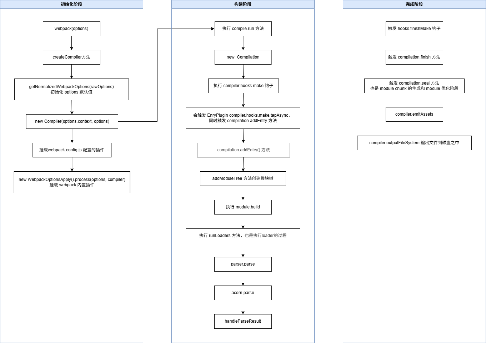

# Webpack源码执行过程分析

## 一、源码准备

需要先从 github 上下载 [webpack源码](https://github.com/webpack/webpack)，下载完成进行解压。可以对解压之后的目录文件进行一些删除，只保留核心代码，如下

```tex
|-- 根目录（源代码）
	|-- bin
	|-- hot
	|-- lib
	|-- schemas
	|-- _SETUP.md（主要说明推荐 yarn 进行 webpack 依赖安装）
	|-- package.json
```

除以上目录和文件均可进行删除，只保留 webpack 核心代码

之后可以对 webpack 源码迁移到你的项目当中，在终端打开源码代码目录，使用 yarn 进行安装 webpack 的项目依赖。

## 二、编写脚本执行webpack

```javascript
// 1. 引用 webpack 源码代码
const webpack = require('./source-code/lib/webpack.js');
const config = require('./webpack.config.js');

// 2. 创建 compiler
const compiler = webpack(config);

// 3. 执行 compiler 的 run 方法
compiler.run((err, stats) => {
  console.log('Done');
});
```

配置 package.sjon 的 scripts 命令

```json
"scripts": {
  "dist": "node ./run.js",
},
```

## 三、webpack 创建编译过程

### 3.1、webpack方法

webpack 构建时是会通过 webpack 方法返回一个 compiler ，该方法传递两个参数 options、callback，options 为 webpack.config.js 配置。

```javascript
const webpack = (options, callback) => {
  const create = () => {
    ...
  }
  const { compiler, watch } = create();
  return compiler;
}
```

compiler 的生成是通过 create 方法内部创建出来的

```javascript
const create = () => {
  // 检查 options 配置是否正确
  if (!asArray(options).every(webpackOptionsSchemaCheck)) {}
  // 判断 options 是否是数组
  if (Array.isArray(options)) {
    // 创建 multiCompiler
    ...
  } else {
    // 通过 createCompiler方法 创建 compiler
    const webpackOptions = (options);
    compiler = createCompiler(webpackOptions);
    watch = webpackOptions.watch;
    watchOptions = webpackOptions.watchOptions || {};
  }
}
```

### 3.2、createCompiler方法

```javascript
const createCompiler = (rawOptions, compilerIndex) => {
	// 初始化 options 配置，主要是对于 webpack.config.js 未配置的项设置初始值和默认值
	const options = getNormalizedWebpackOptions(rawOptions);

	// 设置当前目录 options.context = process.cmd
	applyWebpackOptionsBaseDefaults(options);
	
	// 创建 compiler
	const compiler = new Compiler( // [!code highlight]
		 (options.context),
		options
	);

	// 先挂载 NodeEnvironmentPlugin 插件
	new NodeEnvironmentPlugin({
		infrastructureLogging: options.infrastructureLogging
	}).apply(compiler);

	// 然后再挂载 webpack.config.js 配置的 plugin 
	if (Array.isArray(options.plugins)) {
		for (const plugin of options.plugins) {
			if (typeof plugin === "function") {
				(plugin).call(compiler, compiler);
			} else if (plugin) {
				plugin.apply(compiler);
			}
		}
	}

	// 初始化 compiler 的 platform 
	const resolvedDefaultOptions = applyWebpackOptionsDefaults(
		options,
		compilerIndex
	);
	if (resolvedDefaultOptions.platform) {
		compiler.platform = resolvedDefaultOptions.platform;
	}

	// 环境设置完成之后调用 hooks
	compiler.hooks.environment.call();
	compiler.hooks.afterEnvironment.call();

	// 重要点：通过 process 方法传递 options 为参数，挂载 webpack 内置的plugin
	// 像 EvalDevToolModulePlugin、EntryOptionPlugin 等
	new WebpackOptionsApply().process(options, compiler); // [!code highlight]

	// 调用 compiler 初始化完成 hook
	compiler.hooks.initialize.call();
	return compiler;
};
```

createCompiler 方法内部核心主要是通过 new Compiler 创建 compiler，还有就是挂载 plugin。

### 3.3、new  Compiler 创建compiler 

```javascript
class Compiler {
  constructor(context, options = ({})) {
    // compiler 的 hook 钩子
    this.hooks = Object.freeze({
			initialize: new SyncHook([]),
			shouldEmit: new SyncBailHook(["compilation"]),
			done: new AsyncSeriesHook(["stats"]),
			afterDone: new SyncHook(["stats"]),
			additionalPass: new AsyncSeriesHook([]),
			beforeRun: new AsyncSeriesHook(["compiler"]),
			run: new AsyncSeriesHook(["compiler"]),
			emit: new AsyncSeriesHook(["compilation"]),
			assetEmitted: new AsyncSeriesHook(["file", "info"]),
			afterEmit: new AsyncSeriesHook(["compilation"]),
			thisCompilation: new SyncHook(["compilation", "params"]),
			compilation: new SyncHook(["compilation", "params"]),
			normalModuleFactory: new SyncHook(["normalModuleFactory"]),
			contextModuleFactory: new SyncHook(["contextModuleFactory"]),
			beforeCompile: new AsyncSeriesHook(["params"]),
			compile: new SyncHook(["params"]),
			make: new AsyncParallelHook(["compilation"]),
			finishMake: new AsyncSeriesHook(["compilation"]),
			afterCompile: new AsyncSeriesHook(["compilation"]),
			readRecords: new AsyncSeriesHook([]),
			emitRecords: new AsyncSeriesHook([]),
			watchRun: new AsyncSeriesHook(["compiler"]),
			failed: new SyncHook(["error"]),
			invalid: new SyncHook(["filename", "changeTime"]),
			watchClose: new SyncHook([]),
			shutdown: new AsyncSeriesHook([]),
			infrastructureLog: new SyncBailHook(["origin", "type", "args"]),
			environment: new SyncHook([]),
			afterEnvironment: new SyncHook([]),
			afterPlugins: new SyncHook(["compiler"]),
			afterResolvers: new SyncHook(["compiler"]),
			entryOption: new SyncBailHook(["context", "entry"])
		});

		this.webpack = webpack;

		this.name = undefined;
		
		this.parentCompilation = undefined;
		
		this.root = this;
		
		this.outputPath = "";
		
		this.watching = undefined;

		this.outputFileSystem = null;
		
		this.intermediateFileSystem = null;
		
		this.inputFileSystem = null;
		
		this.watchFileSystem = null;

		this.recordsInputPath = null;
		
		this.recordsOutputPath = null;
		
		this.records = {};
		
		this.managedPaths = new Set();
		
		this.unmanagedPaths = new Set();
		
		this.immutablePaths = new Set();

		this.modifiedFiles = undefined;
		
		this.removedFiles = undefined;
		
		this.fileTimestamps = undefined;
		
		this.contextTimestamps = undefined;
		
		this.fsStartTime = undefined;

		this.resolverFactory = new ResolverFactory();

		this.infrastructureLogger = undefined;

		this.platform = {
			web: null,
			browser: null,
			webworker: null,
			node: null,
			nwjs: null,
			electron: null
		};

		this.options = options;

		this.context = context;

		this.requestShortener = new RequestShortener(context, this.root);

		this.cache = new Cache();

		this.moduleMemCaches = undefined;

		this.compilerPath = "";

		this.running = false;
		
		this.idle = false;
		
		this.watchMode = false;

		this._backCompat = this.options.experiments.backCompat !== false;

		this._lastCompilation = undefined;
		
		this._lastNormalModuleFactory = undefined;

		this._assetEmittingSourceCache = new WeakMap();
		this._assetEmittingWrittenFiles = new Map();
		this._assetEmittingPreviousFiles = new Set();
  }
  
  // run 方法
  const run = () => {
    // 执行 beforeRun 钩子
    this.hooks.beforeRun.callAsync(this, (err) => {
      if (err) return finalCallback(err);
			// 执行 run 钩子
      this.hooks.run.callAsync(this, (err) => {
        if (err) return finalCallback(err);
        this.readRecords((err) => {
          if (err) return finalCallback(err);
          // 执行 compile 方法
          this.compile(onCompiled);
        });
      });
    });
  };
	
	// compile 方法
	compile(callback) {
    ...
  }
}
```

```javascript
createNormalModuleFactory() {
  this._cleanupLastNormalModuleFactory();
  const normalModuleFactory = new NormalModuleFactory({
    context: this.options.context,
    fs: (this.inputFileSystem),
    resolverFactory: this.resolverFactory,
    options: this.options.module,
    associatedObjectForCache: this.root,
    layers: this.options.experiments.layers
  });
  this._lastNormalModuleFactory = normalModuleFactory;
  this.hooks.normalModuleFactory.call(normalModuleFactory);
  return normalModuleFactory;
}

createContextModuleFactory() {
  const contextModuleFactory = new ContextModuleFactory(this.resolverFactory);
  this.hooks.contextModuleFactory.call(contextModuleFactory);
  return contextModuleFactory;
}

newCompilationParams() {
  const params = {
    normalModuleFactory: this.createNormalModuleFactory(),
    contextModuleFactory: this.createContextModuleFactory()
  };
  return params;
}

compile(callback) {
  // 执行 new NormalModuleFactory，new ContextModuleFactory 并赋值
  const params = this.newCompilationParams();
  this.hooks.beforeCompile.callAsync(params, (err) => {
    if (err) return callback(err);

    this.hooks.compile.call(params);

    // 创建 compilation
    const compilation = this.newCompilation(params); // [!code highlight]

    const logger = compilation.getLogger("webpack.Compiler");

    logger.time("make hook");

    // 执行 make 钩子
    this.hooks.make.callAsync(compilation, (err) => {
      logger.timeEnd("make hook");
      if (err) return callback(err);

      logger.time("finish make hook");
      // 执行 make 完成时的钩子
      this.hooks.finishMake.callAsync(compilation, (err) => {
        logger.timeEnd("finish make hook");
        if (err) return callback(err);

        process.nextTick(() => {
          logger.time("finish compilation");
          compilation.finish((err) => {
            logger.timeEnd("finish compilation");
            if (err) return callback(err);

            logger.time("seal compilation");
            compilation.seal((err) => {
              logger.timeEnd("seal compilation");
              if (err) return callback(err);

              logger.time("afterCompile hook");
                // 执行 compile 编译之后的钩子
              this.hooks.afterCompile.callAsync(compilation, (err) => {
                logger.timeEnd("afterCompile hook");
                if (err) return callback(err);

                return callback(null, compilation);
              });
            });
          });
        });
      });
    });
  });
}
```

### 3.4、new Compilation 创建compilation 

```javascript
newCompilation(params) {
  const compilation = this.createCompilation(params);
  compilation.name = this.name;
  compilation.records = this.records;
  // 执行 thisCompilation 钩子
  this.hooks.thisCompilation.call(compilation, params);
  // 执行 compilation 钩子
  this.hooks.compilation.call(compilation, params);
  return compilation;
}

createCompilation(params) {
  // 清除上一次的 compilation
  this._cleanupLastCompilation();
  return (this._lastCompilation = new Compilation(this, params)); // [!code highlight]
}
```

Compilation 类

```javascript
class Compilation {
  constructor(compiler, params) {
    // comilation 钩子
    this.hooks = Object.freeze({
      buildModule: new SyncHook(["module"]),
      addEntry: new SyncHook(["entry", "options"]),
      succeedEntry: new SyncHook(["entry", "options", "module"]),
      ... 
    })
    this.entries = new Map();
    this.entrypoints = new Map();
    ...
  }
  
  addEntry(context, entry, optionsOrName, callback) { 
    const options =
    typeof optionsOrName === "object"
      ? optionsOrName
      : { name: optionsOrName };

		this._addEntryItem(context, entry, "dependencies", options, callback);
	}
    
  _addEntryItem() {
    this.hooks.addEntry.call(entry, options); 
    // 根据入口创建模块树
    this.addModuleTree( // [!code highlight]
			{
				context,
				dependency: entry,
				contextInfo: entryData.options.layer
					? { issuerLayer: entryData.options.layer }
					: undefined
			},
			(err, module) => {
				if (err) {
					this.hooks.failedEntry.call(entry, options, err);
					return callback(err);
				}
				this.hooks.succeedEntry.call(
					entry,
					options,
					(module)
				);
				return callback(null, module);
			}
		);
  }
}
```

## 四、webpack 是如何触发编译的

webpack 的插件主要通过 tapable 依赖库实现，webpack 在创建 compiler 和 compilation 过程中会陆续调用 call、callAsync 等钩子函数，其核心在于触发插件，通过插件实现编译过程。在创建 compiler 的 createCompiler 方法中会依据 options 挂载 webpack 的内置大量的插件

```javascript
// 重要点：通过 process 方法传递 options 为参数，挂载 webpack 内置的plugin
// 像 EvalDevToolModulePlugin、EntryOptionPlugin 等
new WebpackOptionsApply().process(options, compiler); // [!code highlight]
```

像 EntryOptionPlugin 插件的挂载

```javascript
new EntryOptionPlugin().apply(compiler); // [!code highlight]
compiler.hooks.entryOption.call( // [!code highlight]
  (options.context),
  options.entry
);
```

在 EntryOptionPlugin 插件中会根据 entry 入口再挂载 EntryPlugin 以及其他插件

```javascript
class EntryOptionPlugin {
	apply(compiler) {
		compiler.hooks.entryOption.tap(PLUGIN_NAME, (context, entry) => {
			EntryOptionPlugin.applyEntryOption(compiler, context, entry);
			return true;
		});
	}

	static applyEntryOption(compiler, context, entry) {
		if (typeof entry === "function") {
			const DynamicEntryPlugin = require("./DynamicEntryPlugin");

			new DynamicEntryPlugin(context, entry).apply(compiler);
		} else {
			const EntryPlugin = require("./EntryPlugin");

			for (const name of Object.keys(entry)) {
				const desc = entry[name];
				const options = EntryOptionPlugin.entryDescriptionToOptions(
					compiler,
					name,
					desc
				);
				const descImport =
					(desc.import);
				for (const entry of descImport) {
          // EntryPlugin 插件
					new EntryPlugin(context, entry, options).apply(compiler); // [!code highlight]
				}
			}
		}
	}
  
	static entryDescriptionToOptions(compiler, name, desc) {
		const options = {
			name,
			filename: desc.filename,
			runtime: desc.runtime,
			layer: desc.layer,
			dependOn: desc.dependOn,
			baseUri: desc.baseUri,
			publicPath: desc.publicPath,
			chunkLoading: desc.chunkLoading,
			asyncChunks: desc.asyncChunks,
			wasmLoading: desc.wasmLoading,
			library: desc.library
		};
		if (desc.layer !== undefined && !compiler.options.experiments.layers) {
			throw new Error(
				"'entryOptions.layer' is only allowed when 'experiments.layers' is enabled"
			);
		}
		if (desc.chunkLoading) {
			const EnableChunkLoadingPlugin = require("./javascript/EnableChunkLoadingPlugin");

			EnableChunkLoadingPlugin.checkEnabled(compiler, desc.chunkLoading);
		}
		if (desc.wasmLoading) {
			const EnableWasmLoadingPlugin = require("./wasm/EnableWasmLoadingPlugin");

			EnableWasmLoadingPlugin.checkEnabled(compiler, desc.wasmLoading);
		}
		if (desc.library) {
			const EnableLibraryPlugin = require("./library/EnableLibraryPlugin");

			EnableLibraryPlugin.checkEnabled(compiler, desc.library.type);
		}
		return options;
	}
}
```

而在 EntryPlugin 插件会订阅 compiler.hooks.make.tapAsync 等待 compiler.hooks.make.callAsync调用

```javascript
class EntryPlugin {
	constructor(context, entry, options) {
		this.context = context;
		this.entry = entry;
		this.options = options || "";
	}

	apply(compiler) {
		compiler.hooks.compilation.tap(
			PLUGIN_NAME,
			(compilation, { normalModuleFactory }) => {
				compilation.dependencyFactories.set(
					EntryDependency,
					normalModuleFactory
				);
			}
		);

		const { entry, options, context } = this;
		const dep = EntryPlugin.createDependency(entry, options);
		
    // 订阅 compiler hooks.make 钩子
		compiler.hooks.make.tapAsync(PLUGIN_NAME, (compilation, callback) => { // [!code highlight]
      // 然后调用 compilation 的 addEntry 方法
			compilation.addEntry(context, dep, options, (err) => { // [!code highlight]
				callback(err);
			});
		});
	}

	static createDependency(entry, options) {
		const dep = new EntryDependency(entry);
		// TODO webpack 6 remove string option
		dep.loc = {
			name:
				typeof options === "object"
					? (options.name)
					: options
		};
		return dep;
	}
}
```

在  compilation 的 addEntry 方法中会调用 compilation 类中 compilation 的 addEntry 钩子

```javascript
// 订阅 compiler hooks.make 钩子
compiler.hooks.make.tapAsync(PLUGIN_NAME, (compilation, callback) => { // [!code highlight]
  // 然后调用 compilation 的 addEntry 方法
  compilation.addEntry(context, dep, options, (err) => { // [!code highlight]
    callback(err);
  });
});
```

```javascript
class Compilation {
  constructor(compiler, params) {
    // comilation 钩子
    this.hooks = Object.freeze({
      addEntry: new SyncHook(["entry", "options"]),
      ... 
    })
    ...
  }
  
  addEntry(context, entry, optionsOrName, callback) { 
    const options =
    typeof optionsOrName === "object"
      ? optionsOrName
      : { name: optionsOrName };

		this._addEntryItem(context, entry, "dependencies", options, callback);
	}
    
  _addEntryItem() {
    this.hooks.addEntry.call(entry, options); 
    // 根据入口创建模块树
    this.addModuleTree(
			{
				context,
				dependency: entry,
				contextInfo: entryData.options.layer
					? { issuerLayer: entryData.options.layer }
					: undefined
			},
			(err, module) => {
				if (err) {
					this.hooks.failedEntry.call(entry, options, err);
					return callback(err);
				}
				this.hooks.succeedEntry.call(
					entry,
					options,
					(module)
				);
				return callback(null, module);
			}
		);
  }
}
```

addModuleTree 方法会执行 handleModuleCreation 方法

```javascript
handleModuleCreation(
  {
    factory,
    dependencies,
    originModule,
    contextInfo,
    context,
    recursive = true,
    connectOrigin = recursive,
    checkCycle = !recursive
  },
  callback
) {
  const moduleGraph = this.moduleGraph;

  const currentProfile = this.profile ? new ModuleProfile() : undefined;

  // 模块工厂函数
  this.factorizeModule(
    {
      currentProfile,
      factory,
      dependencies,
      factoryResult: true,
      originModule,
      contextInfo,
      context
    },
    (err, factoryResult) => {

      // 将模块添加到队列当中
      this.addModule(newModule, (err, _module) => {
        ...
        
        // 处理 buildModule
        this._handleModuleBuildAndDependencies(
						originModule,
						module,
						recursive,
						checkCycle,
						callback
				);
      }
    }
  );
}
    
addModule(module, callback) {
  this.addModuleQueue.add(module, callback);
}
```

```javascript
_handleModuleBuildAndDependencies(
		originModule,
		module,
		recursive,
		checkCycle,
		callback
	) {
  ...
  this.buildModule(module, (err) => {})
}

buildModule(module, callback) {
  this.buildQueue.add(module, callback);
}
```

最终指向 _buildModule 方法

```javascript
this.buildQueue = new AsyncQueue({
    name: "build",
    parent: this.factorizeQueue,
    processor: this._buildModule.bind(this) // [!code highlight]
});
```

```javascript
_buildModule(module, callback) {
  ...
  // 执行 module.build 方法
  module.build(
    this.options,
    this,
    this.resolverFactory.get("normal", module.resolveOptions),
    (this.inputFileSystem),
  )
}
```

查看 module.build 方法，指向 Module 类

```javascript
class Module extends DependenciesBlock {
  build(options, compilation, resolver, fs, callback) {
		const AbstractMethodError = require("./AbstractMethodError");
		throw new AbstractMethodError();
	}
}
```

这里 module.build 执行的是 NormalModule 类的 build 的方法， NormalModule 类继承自 Module 类

```javascript
class NormalModule extends Module {
  // 执行 doBuild
  return this._doBuild(options, compilation, resolver, fs, hooks, (err)=> {}) {
    
  }
}
```

doBuild 方法

```javascript
_doBuild(options, compilation, resolver, fs, hooks, callback) {
		const loaderContext = this._createLoaderContext(
			resolver,
			options,
			compilation,
			fs,
			hooks
		);
		
  	// 处理的编译结果
		const processResult = (err, result_) => {
			if (err) {
				if (!(err instanceof Error)) {
					err = new NonErrorEmittedError(err);
				}
				const currentLoader = this.getCurrentLoader(loaderContext);
				const error = new ModuleBuildError(err, {
					from:
						currentLoader &&
						compilation.runtimeTemplate.requestShortener.shorten(
							currentLoader.loader
						)
				});
				return callback(error);
			}
			const result = hooks.processResult.call(
				(result_),
				this
			);
			const source = result[0];
			const sourceMap = result.length >= 1 ? result[1] : null;
			const extraInfo = result.length >= 2 ? result[2] : null;

			if (!Buffer.isBuffer(source) && typeof source !== "string") {
				const currentLoader = this.getCurrentLoader(loaderContext, 0);
				const err = new Error(
					`Final loader (${
						currentLoader
							? compilation.runtimeTemplate.requestShortener.shorten(
									currentLoader.loader
								)
							: "unknown"
					}) didn't return a Buffer or String`
				);
				const error = new ModuleBuildError(err);
				return callback(error);
			}

			const isBinaryModule =
				this.generatorOptions && this.generatorOptions.binary !== undefined
					? this.generatorOptions.binary
					: this.binary;

			this._source = this.createSource(
				 (options.context),
				isBinaryModule ? asBuffer(source) : asString(source),
				sourceMap,
				compilation.compiler.root
			);
			if (this._sourceSizes !== undefined) this._sourceSizes.clear();
			this._ast =
				typeof extraInfo === "object" &&
				extraInfo !== null &&
				extraInfo.webpackAST !== undefined
					? extraInfo.webpackAST
					: null;
			return callback();
		};

		const buildInfo = (this.buildInfo);

		buildInfo.fileDependencies = new LazySet();
		buildInfo.contextDependencies = new LazySet();
		buildInfo.missingDependencies = new LazySet();
		buildInfo.cacheable = true;

		try {
			hooks.beforeLoaders.call(
				this.loaders,
				this,
				(loaderContext)
			);
		} catch (err) {
			processResult((err));
			return;
		}

		if (this.loaders.length > 0) {
			(this.buildInfo).buildDependencies = new LazySet();
		}
		
  	// 执行 loader
		runLoaders( // [!code highlight]
			{
				resource: this.resource,
				loaders: this.loaders,
				context: loaderContext,
				processResource: (loaderContext, resourcePath, callback) => {
					const resource = loaderContext.resource;
					const scheme = getScheme(resource);
					hooks.readResource
						.for(scheme)
						.callAsync(loaderContext, (err, result) => {
							if (err) return callback(err);
							if (typeof result !== "string" && !result) {
								return callback(
									new UnhandledSchemeError(
										(scheme),
										resource
									)
								);
							}
							return callback(null, result);
						});
				}
			},
			(err, result) => {
			}
		);
	}
```

最终回到 Compiler 类的 compile 方法会调用  compilation.seal 方法将处理好的内容写入磁盘文件

```javascript
// 在 Compiler 类的 compile 方法
compile(callback) {
		// 执行 new NormalModuleFactory，new ContextModuleFactory 并赋值
		const params = this.newCompilationParams();
		this.hooks.beforeCompile.callAsync(params, (err) => {
			if (err) return callback(err);

			this.hooks.compile.call(params);

			// 创建 compilation
			const compilation = this.newCompilation(params);

			const logger = compilation.getLogger("webpack.Compiler");

			logger.time("make hook");
			// 执行 make 钩子
			this.hooks.make.callAsync(compilation, (err) => {
				logger.timeEnd("make hook");
				if (err) return callback(err);

				logger.time("finish make hook");
				// 执行 make 完成时的钩子
				this.hooks.finishMake.callAsync(compilation, (err) => {
					logger.timeEnd("finish make hook");
					if (err) return callback(err);

					process.nextTick(() => {
						logger.time("finish compilation");
						compilation.finish((err) => {
							logger.timeEnd("finish compilation");
							if (err) return callback(err);

							logger.time("seal compilation");
							// 将处理好的内容写入磁盘文件
							compilation.seal((err) => {
								logger.timeEnd("seal compilation");
								if (err) return callback(err);

								logger.time("afterCompile hook");
								// 执行 compile 编译之后的钩子
								this.hooks.afterCompile.callAsync(compilation, (err) => {
									logger.timeEnd("afterCompile hook");
									if (err) return callback(err);

									return callback(null, compilation);
								});
							});
						});
					});
				});
			});
		});
	}
```

## 五、wbepack构建流程图解

Webpack 打包流程包含三个阶段：

- 初始化阶段：包含了初始化参数，创建 Compiler，开始执行 compiler.run
- 构建阶段：从 entry 开始创建 Module，调用 loader 转为 JS，解析 JS 为 AST，收集依赖，并递归创建 Module
- 生成阶段：根据入口和模块的依赖关系，生成 Chunk，输出到文件

Webpack打包流程中有很重要的两个概念：compiler 和 compilation

compiler：一次打包流程只会创建一个，贯穿整个编译过程

compilation：在 watch 为 true 的时候，每次文件变更触发更新都会生成新的 compilation




