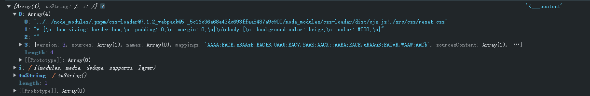

# style-loader和css-loader核心原理

## 一、style-loader源码结构分析

### 1.1、style-loader使用

webpack 对 style-loader 和 css-loader 的使用

```javascript
module: {
  rules: [
    {
      test: /\.css$/i,
      use: ['style-loader', 'css-loader'],
    },
  ],
},
```

### 1.2、style-loader源码结构分析

style-loader 源码中包含 loader 和 pitch 函数

```javascript
const loader = function loader(content) {
  ...
}

loader.pitch = function pitch(request) {
  ... 
  return `返回的是 js 代码`
}
```

然而 pitch 返回了 `非undefined值`，按照 `Webpack高级` 所说，loader 的 pitch 函数返回非 undefined 值会触发熔断机制，后续的 loader 不会执行。那再这里的 css-loader 不会执行？那么 style-loader 又是如何将 css 转换成 js 代码又是如何处理热更新？

pitch 返回内容如下

```javascript
`
      ${getImportStyleAPICode(esModule, this)}
      ${getImportStyleDomAPICode(esModule, this, isSingleton, isAuto)}
      ${getImportInsertBySelectorCode(esModule, this, insertType, options)}
      ${getSetAttributesCode(esModule, this, options)}
      ${getImportInsertStyleElementCode(esModule, this)}
      ${getStyleTagTransformFnCode(esModule, this, options, isSingleton)}
      ${getImportStyleContentCode(esModule, this, request)}
      ${isAuto ? getImportIsOldIECode(esModule, this) : ""}
      ${
        esModule
          ? ""
          : `content = content.__esModule ? content.default : content;`
      }

var options = ${JSON.stringify(runtimeOptions)};

${getStyleTagTransformFn(options, isSingleton)};
options.setAttributes = setAttributes;
${getInsertOptionCode(insertType, options)}
options.domAPI = ${getdomAPI(isAuto)};
options.insertStyleElement = insertStyleElement;

var update = API(content, options);

${hmrCode}

${getExportStyleCode(esModule, this, request)}
`
```

查看 getImportStyleAPICode 中的一个方法

```javascript
function getImportStyleAPICode(esModule, loaderContext) {
  // stringifyRequest 方法将 绝对路径转换成相对路径
  const modulePath = stringifyRequest(
    loaderContext,
    `!${path.join(__dirname, "runtime/injectStylesIntoStyleTag.js")}`,
  );
	
  // 返回导出
  return esModule
    ? `import API from ${modulePath};`
    : `var API = require(${modulePath});`;
}
```

整体转换后的内容如下

```javascript
import API from '!../../../node_modules/.pnpm/style-loader@4.0.0_webpack@_61006295f4f9b4fbce33658e03fc371a/node_modules/style-loader/dist/runtime/injectStylesIntoStyleTag.js';
import domAPI from '!../../../node_modules/.pnpm/style-loader@4.0.0_webpack@_61006295f4f9b4fbce33658e03fc371a/node_modules/style-loader/dist/runtime/styleDomAPI.js';
import insertFn from '!../../../node_modules/.pnpm/style-loader@4.0.0_webpack@_61006295f4f9b4fbce33658e03fc371a/node_modules/style-loader/dist/runtime/insertBySelector.js';
import setAttributes from '!../../../node_modules/.pnpm/style-loader@4.0.0_webpack@_61006295f4f9b4fbce33658e03fc371a/node_modules/style-loader/dist/runtime/setAttributesWithoutAttributes.js';
import insertStyleElement from '!../../../node_modules/.pnpm/style-loader@4.0.0_webpack@_61006295f4f9b4fbce33658e03fc371a/node_modules/style-loader/dist/runtime/insertStyleElement.js';
import styleTagTransformFn from '!../../../node_modules/.pnpm/style-loader@4.0.0_webpack@_61006295f4f9b4fbce33658e03fc371a/node_modules/style-loader/dist/runtime/styleTagTransform.js';
import content, * as namedExport from '!!../../../node_modules/.pnpm/css-loader@7.1.2_webpack@5._5c16c36e68e43dc693ffaa5487a9c900/node_modules/css-loader/dist/cjs.js!./index.module.css';

var options = {};

options.styleTagTransform = styleTagTransformFn;
options.setAttributes = setAttributes;
options.insert = insertFn.bind(null, 'head');
options.domAPI = domAPI;
options.insertStyleElement = insertStyleElement;

var update = API(content, options);

// 热更新代码
if (module.hot) {
  if (!content.locals || module.hot.invalidate) {
    var isEqualLocals = function isEqualLocals(a, b, isNamedExport) {
      if ((!a && b) || (a && !b)) {
        return false;
      }
      var p;
      for (p in a) {
        if (isNamedExport && p === 'default') {
          // eslint-disable-next-line no-continue
          continue;
        }
        if (a[p] !== b[p]) {
          return false;
        }
      }
      for (p in b) {
        if (isNamedExport && p === 'default') {
          // eslint-disable-next-line no-continue
          continue;
        }
        if (!a[p]) {
          return false;
        }
      }
      return true;
    };
    var isNamedExport = !content.locals;
    var oldLocals = isNamedExport ? namedExport : content.locals;

    module.hot.accept(
      '!!../../../node_modules/.pnpm/css-loader@7.1.2_webpack@5._5c16c36e68e43dc693ffaa5487a9c900/node_modules/css-loader/dist/cjs.js!./index.module.css',
      function () {
        if (!isEqualLocals(oldLocals, isNamedExport ? namedExport : content.locals, isNamedExport)) {
          module.hot.invalidate();

          return;
        }

        oldLocals = isNamedExport ? namedExport : content.locals;

        update(content);
      }
    );
  }

  module.hot.dispose(function () {
    update();
  });
}

export * from '!!../../../node_modules/.pnpm/css-loader@7.1.2_webpack@5._5c16c36e68e43dc693ffaa5487a9c900/node_modules/css-loader/dist/cjs.js!./index.module.css';
export default content && content.locals ? content.locals : undefined;

```

style-loader 只有 ptich 函数，但是会通过 `内联式loader` 调用 css-loader

```javascript
import content, * as namedExport from '!!../../../node_modules/.pnpm/css-loader@7.1.2_webpack@5._5c16c36e68e43dc693ffaa5487a9c900/node_modules/css-loader/dist/cjs.js!./index.module.css';
```

导入的 content 数据结构暂不考虑，后续内容会说明

## 二、style-loader如何实现style标签插入

### 2.1、如何创建 style 表标签

创建 style 标签的方法在 runtime/insertStyleElement.js

```javascript
// runtime/insertStyleElement.js
function insertStyleElement(options) {
  var element = document.createElement("style");
  options.setAttributes(element, options.attributes);
  options.insert(element, options.options);
  return element;
}
module.exports = insertStyleElement;
```

```javascript
function getImportInsertStyleElementCode(esModule, loaderContext) {
  const modulePath = stringifyRequest(
    loaderContext,
    `!${path.join(__dirname, "runtime/insertStyleElement.js")}`,
  );

  return esModule
    ? `import insertStyleElement from ${modulePath};`
    : `var insertStyleElement = require(${modulePath});`;
}
```

返回的代码通过 getImportInsertStyleElementCode 返回

```javascript
//主要从 runtime/insertStyleElement.js 导出 insertStyleElement 方法
${getImportInsertStyleElementCode(esModule, this)} 

// 然后再赋值给 options.insertStyleElement
options.insertStyleElement = insertStyleElement;
```

### 2.2、如何将css内容插入到style标签中

首先会通过 getImportStyleAPICode 方法导入 API 方法

```javascript
function getImportStyleAPICode(esModule, loaderContext) {
  const modulePath = stringifyRequest(
    loaderContext,
    `!${path.join(__dirname, "runtime/injectStylesIntoStyleTag.js")}`,
  );

  return esModule
    ? `import API from ${modulePath};`
    : `var API = require(${modulePath});`;
}
```

还需要通过 getImportStyleDomAPICode 方法插入 domAPI

```javascript
function getImportStyleDomAPICode(
  esModule,
  loaderContext,
  isSingleton,
  isAuto,
) {
  const styleAPI = stringifyRequest(
    loaderContext,
    `!${path.join(__dirname, "runtime/styleDomAPI.js")}`,
  );
  const singletonAPI = stringifyRequest(
    loaderContext,
    `!${path.join(__dirname, "runtime/singletonStyleDomAPI.js")}`,
  );

  if (isAuto) {
    return esModule
      ? `import domAPI from ${styleAPI};
        import domAPISingleton from ${singletonAPI};`
      : `var domAPI = require(${styleAPI});
        var domAPISingleton = require(${singletonAPI});`;
  }
	
  // isSingleton 这里为 false
  return esModule
    ? `import domAPI from ${isSingleton ? singletonAPI : styleAPI};`
    : `var domAPI = require(${isSingleton ? singletonAPI : styleAPI});`;
}
```

并将 domAPI 赋值给 options

```javascript
// 并将 domAPI 赋值给 options
options.domAPI = ${getdomAPI(isAuto)};
```

domAPI 方法详解如下

```javascript
function domAPI(options) {
  if (typeof document === "undefined") {
    return {
      update: () => {},
      remove: () => {},
    };
  }
	
  // 创建 style 标签
  const styleElement = options.insertStyleElement(options);

  return {
    update: (obj) => {
      // apply用于插入标签
      apply(styleElement, options, obj);
    },
    // 主要用于删除 style 标签
    remove: () => {
      removeStyleElement(styleElement);
    },
  };
}

function removeStyleElement(styleElement) {
  // istanbul ignore if
  if (styleElement.parentNode === null) {
    return false;
  }

  styleElement.parentNode.removeChild(styleElement);
}
```

options.insertStyleElement 用于创建 style 标签，remove 方法主要用于删除 style 标签，update 方法用与插入 style 标签和更新 style 内的 css。

然后再调用 API 方法

```javascript
// content 为导入 css-loader 处理后的结果
var update = API(content, options);
```

```javascript
// API 方法
module.exports = (list, options) => {
  options = options || {};

  list = list || [];

  let lastIdentifiers = modulesToDom(list, options);
  return function update(newList) {
    ...
  }
}
```

其中 modulesToDom 方法将 css-loader 的处理数据转换成 style 标签插入，其中 css-loader 返回的数据结构如下图



实际数据结构为

```javascript
const list = [];

list.toString = function toString() {}

list.i = function i(modules, media, dedupe, supports, layer) {}

list.push([module.id, code, sourceMap, ...])
```

modulesToDom 方法核心详解

```javascript
var stylesInDOM = [];
function getIndexByIdentifier(identifier) {
  var result = -1;
  for (var i = 0; i < stylesInDOM.length; i++) {
    if (stylesInDOM[i].identifier === identifier) {
      result = i;
      break;
    }
  }
  return result;
}
function modulesToDom(list, options) {
  var idCountMap = {};
  var identifiers = [];

  // [["","","",""], function i(){}, function toString(){}]
  for (var i = 0; i < list.length; i++) {
    var item = list[i];
    console.log(item); // 获取到 ['','','','']
    
    // item[0] 为 (...)node_modules/css-loader/dist/cjs.js!./src/css/reset.css
    var id = options.base ? item[0] + options.base : item[0];
    var count = idCountMap[id] || 0; // idCountMap[id] 未获取时赋值为 0
    var identifier = "".concat(id, " ").concat(count); // 生成标识：如 (...)node_modules/css-loader/dist/cjs.js!./src/css/reset.css 0
    idCountMap[id] = count + 1; // idCountMap[id] 赋值，数据结构为 { '(...)node_modules/css-loader/dist/cjs.js!./src/css/reset.css': 1 }

    // 在 stylesInDOM 中进行查找，如果查不到返回 -1
    var indexByIdentifier = getIndexByIdentifier(identifier); 

    var obj = {
      css: item[1], // item[1] 为 css 内容
      media: item[2], // item[2] 为 media，未配置时为 '' (空字符串)
      sourceMap: item[3], // ittem[3] 为 sourceMap 内容
      supports: item[4], // item[4] 为 supports，'' (空字符串)
      layer: item[5] // item[5] 为 layer，未配置时为 '' (空字符串)
    };

    // 如果 indexByIdentifier 为 -1 时，说明没有找到，需要生成，如果能找到需要更新
    if (indexByIdentifier !== -1) {
      stylesInDOM[indexByIdentifier].references++;
      stylesInDOM[indexByIdentifier].updater(obj);
    } else {
      // 如果没有需要添加
      var updater = addElementStyle(obj, options);
      options.byIndex = i;

      // 包装成对象存入 stylesInDOM
      stylesInDOM.splice(i, 0, {
        identifier: identifier,
        updater: updater,
        references: 1
      });
    }

    // 将 identifier 存入 identifiers
    identifiers.push(identifier);
  }
  return identifiers;
}

function addElementStyle(obj, options) {
  var api = options.domAPI(options);
  api.update(obj);
  ...
}
```

在 addElementStyle 方法中会将 obj 作为参数传入，并且通过  options.domAPI() 获取 dom 操作的 api，然后再调用 api.update 方法

```javascript
var api = options.domAPI(options);
api.update(obj);
```

调用 api.update 方法实际调用 runtime/styleDomAPI.js 的返回的对象 update 方法

```javascript
//  runtime/styleDomAPI.js
function domAPI(options) {
  if (typeof document === "undefined") {
    return {
      update: function update() {},
      remove: function remove() {}
    };
  }
  var styleElement = options.insertStyleElement(options);
  return {
    update: function update(obj) {
      apply(styleElement, options, obj);
    },
    remove: function remove() {
      removeStyleElement(styleElement);
    }
  };
}
module.exports = domAPI;
```

其中 apply 方法内容如下

```javascript
function apply(styleElement, options, obj) {
  var css = "";
  if (obj.supports) {
    css += "@supports (".concat(obj.supports, ") {");
  }
  if (obj.media) {
    css += "@media ".concat(obj.media, " {");
  }
  var needLayer = typeof obj.layer !== "undefined";
  if (needLayer) {
    css += "@layer".concat(obj.layer.length > 0 ? " ".concat(obj.layer) : "", " {");
  }
  css += obj.css;
  if (needLayer) {
    css += "}";
  }
  if (obj.media) {
    css += "}";
  }
  if (obj.supports) {
    css += "}";
  }
  var sourceMap = obj.sourceMap;
  if (sourceMap && typeof btoa !== "undefined") {
    css += "\n/*# sourceMappingURL=data:application/json;base64,".concat(btoa(unescape(encodeURIComponent(JSON.stringify(sourceMap)))), " */");
  }

  // For old IE
  /* istanbul ignore if  */
  options.styleTagTransform(css, styleElement, options.options);
}
```

apply 方法中还会调用 /runtime/styleTagTransform.js 的导出的 styleTagTransform 方法，该方法用于将 css 插入到 style 标签中

```javascript
function styleTagTransform(css, styleElement) {
  if (styleElement.styleSheet) {
    styleElement.styleSheet.cssText = css;
  } else {
    while (styleElement.firstChild) {
      styleElement.removeChild(styleElement.firstChild);
    }
    styleElement.appendChild(document.createTextNode(css));
  }
}
```

以上就是 style-loader 将 css 代码插入 style 标签中过程

## 三、style-loader如何实现css的热更新

style-loader 会通过根据是否支持热更新插入热更新代码，主要通过 getStyleHmrCode 方法获取插入

```javascript
// 判断是否支持热更新
const hmrCode = this.hot
      ? getStyleHmrCode(esModule, this, request, false)
      : "";
```

getStyleHmrCode  方法主要作用注入热更新代码，详解如下

```javascript
function getStyleHmrCode(esModule, loaderContext, request, lazy) {
  const modulePath = stringifyRequest(loaderContext, `!!${request}`);

  return `
if (module.hot) {
  if (!content.locals || module.hot.invalidate) {
    var isEqualLocals = ${isEqualLocals.toString()};
    var isNamedExport = ${esModule ? "!content.locals" : false};
    var oldLocals = isNamedExport ? namedExport : content.locals;

    module.hot.accept(
      ${modulePath},
      function () {
        ${
          esModule
            ? `if (!isEqualLocals(oldLocals, isNamedExport ? namedExport : content.locals, isNamedExport)) {
                module.hot.invalidate();

                return;
              }

              oldLocals = isNamedExport ? namedExport : content.locals;

              ${
                lazy
                  ? `if (update && refs > 0) {
                      update(content);
                    }`
                  : `update(content);`
              }`
            : `content = require(${modulePath});

              content = content.__esModule ? content.default : content;

              ${
                lazy
                  ? ""
                  : `if (typeof content === 'string') {
                      content = [[module.id, content, '']];
                    }`
              }

              if (!isEqualLocals(oldLocals, content.locals)) {
                module.hot.invalidate();

                return;
              }

              oldLocals = content.locals;

              ${
                lazy
                  ? `if (update && refs > 0) {
                        update(content);
                      }`
                  : `update(content);`
              }`
        }
      }
    )
  }

  module.hot.dispose(function() {
    ${
      lazy
        ? `if (update) {
            update();
          }`
        : `update();`
    }
  });
}
`;
}
```

在每次触发热更新时，都会触发其中最核心的 update 方法，该方法是由 API 方法导出的

```javascript
// 先执行的 API 方法，返回一个 update 方法
var update = API(content, options);

// 然后再插入 热更新 代码
${hmrCode}
```

update 方法执行过程详解如下

```javascript
// 导出 API 方法
module.exports = (list, options) => {
  options = options || {};

  list = list || [];

  let lastIdentifiers = modulesToDom(list, options);

  return function update(newList) {
    // newList 为传入 content
    newList = newList || [];

    // 第一步
    // 遍历 lastIdentifiers，从 stylesInDOM 取出对应数据
    for (let i = 0; i < lastIdentifiers.length; i++) {
      const identifier = lastIdentifiers[i];
      const index = getIndexByIdentifier(identifier);
      // 先将 stylesInDOM （[{ identifier, updater, references }] ）的 references 进行自减处理，全部置于 0
      stylesInDOM[index].references--;
    }

    // 第二步
    // 处理新的 content，并返回新的 lastIdentifiers
    const newLastIdentifiers = modulesToDom(newList, options);

    // 第三步
    // 再次遍历 lastIdentifiers，从 stylesInDOM 取出对应的数据
    for (let i = 0; i < lastIdentifiers.length; i++) {
      const identifier = lastIdentifiers[i];
      const index = getIndexByIdentifier(identifier);
      // 若 references 为 0 时
      if (stylesInDOM[index].references === 0) {
        // 从 head 标签中移除 style 标签
        stylesInDOM[index].updater();
        // 并且从 stylesInDOM 中移除
        stylesInDOM.splice(index, 1);
      }
    }

    // 第四步
    // 将新的 lastIdentifiers 覆盖 旧的 lastIdentifiers
    lastIdentifiers = newLastIdentifiers;
  };
};
```

其中 modulesToDom 方法上述章节说明过的，这里提取最重要的部分

```javascript
 // 在更新阶段，indexByIdentifier 不为 -1
if (indexByIdentifier !== -1) {
  // 先将 references 进行自加处理
  stylesInDOM[indexByIdentifier].references++;
  // 然后调用 stylesInDOM 取出对象的 updater 方法
  stylesInDOM[indexByIdentifier].updater(obj);
} else {
  // 新增时
  const updater = addElementStyle(obj, options);
  options.byIndex = i;
  stylesInDOM.splice(i, 0, {
    identifier,
    updater,
    references: 1,
  });
}
```

其中的对象的 updater 方法是 stylesInDOM 在新增时调用 addElementStyle 方法返回的，addElementStyle 详解如下

```javascript
function addElementStyle(obj, options) {
  const api = options.domAPI(options);

  api.update(obj);

  const updater = (newObj) => {
    // 如果存在 newObj 做更新处理
    if (newObj) {
      // 比较新旧 obj 是否一致，一致不做任何处理
      if (
        newObj.css === obj.css &&
        newObj.media === obj.media &&
        newObj.sourceMap === obj.sourceMap &&
        newObj.supports === obj.supports &&
        newObj.layer === obj.layer
      ) {
        return;
      }
			// 将 newObj 赋值给 obj 并更新处理
      api.update((obj = newObj));
    } else {
      // 未传入 newObj 表示移除 style标签，调用的 domAPI 返回的 remove 方法
      api.remove();
    }
  };

  return updater;
}
```

以上就是 style-loader 实现热更新原理

## 四、css-loader作用和源码解析

### 4.1、css-loader作用和配置

css-loader的作用是对 @import 和 url 进行处理，就像 js 解析 import/require 一样。

css-loader 配置项

| 名称          | 类型                                     | 默认值                  | 描述                                |
| ------------- | ---------------------------------------- | ----------------------- | ----------------------------------- |
| url           | Boolean \| Function                      | true                    | 是否启用 url() / image-set 函数处理 |
| import        | Boolean \| Function                      | Function                | 是否启用 @import 函数处理           |
| modules       | Boolean \| String \| Object              | undefined               | 是否启用 css 模块及其配置           |
| sourceMap     | Boolean                                  | 取决于 compiler.devtool | 是否生成 SourceMap                  |
| importLoaders | Number                                   | 0                       | 在 css-loader 前应用的 loader 数量  |
| esModule      | Boolean                                  | true                    | 使用 ES 模块语法                    |
| exportType    | 'array' \| 'string' \| "css-style-sheet" | array                   |                                     |

其中 modules 相关配置：

+ undefined：为所有匹配 `/\.module\.\w+$/i.test(filename)` 与 `/\.icss\.\w+$/i.test(filename)` 正则表达式的文件启用 CSS 模块
+ true：对所有文件启用 CSS 模块
+ false：对所有文件禁用 CSS 模块
+ string： 对所有文件禁用 CSS 模块并设置 `mode` 配置项，可以设置 "local" | "global" | "pure" | "icss"
+ object： 如果没有配置 `modules.auto` 则对所有文件启用 CSS 模块，否则 `modules.auto` 配置项则会决定其是否为 CSS 模块

更多详细说明见：https://webpack.docschina.org/loaders/css-loader/#modules

### 4.2、css-loader源码分析

css-loader 是返回的一个异步 loader 函数，核心代码解析如下

```javascript
export default async function loader(content, map, meta) {
  // 获取 options 配置
  const rawOptions = this.getOptions(schema);
  // 获取 callback 函数
  const callback = this.async();
  
  let options;

  try {
    // 初始化 options，主要将未设置的属性设置默认值
    options = normalizeOptions(rawOptions, this);
  } catch (error) {
    callback(error);
    return;
  }
  
  // 定义需要加载的 postcss 插件
  const plugins = [];
  const replacements = [];
  const exports = [];
  
  // 根据 options 判断是否需要加入 css modules 相关插件
  if (shouldUseModulesPlugins(options)) {
    plugins.push(...getModulesPlugins(options, this));
  }
  
  const importPluginImports = [];
  const importPluginApi = [];
  
  let isSupportAbsoluteURL = false;
  
   if (shouldUseImportPlugin(options)) {
    // 加载 postcss-import-parser 插件
     plugins.push(
        importParser({
          isSupportAbsoluteURL: false,
          isSupportDataURL: false,
          isCSSStyleSheet: options.exportType === "css-style-sheet",
          loaderContext: this,
          imports: importPluginImports,
          api: importPluginApi,
          filter: options.import.filter,
          urlHandler: (url) =>
            stringifyRequest(
              this,
              combineRequests(getPreRequester(this)(options.importLoaders), url),
            ),
        }),
      );
  }
  
  const urlPluginImports = [];
  
  if (shouldUseURLPlugin(options)) {
    const needToResolveURL = !options.esModule;
		// 加载 postcss-url-parser 插件
    plugins.push(
      urlParser({
        isSupportAbsoluteURL,
        isSupportDataURL: options.esModule,
        imports: urlPluginImports,
        replacements,
        context: this.context,
        rootContext: this.rootContext,
        filter: getFilter(options.url.filter, this.resourcePath),
        resolver: needToResolveURL
          ? this.getResolve({ mainFiles: [], extensions: [] })
          : // eslint-disable-next-line no-undefined
            undefined,
        urlHandler: (url) => stringifyRequest(this, url),
        // Support data urls as input in new URL added in webpack@5.38.0
      }),
    );
  }
  
  const icssPluginImports = [];
  const icssPluginApi = [];
  
  const needToUseIcssPlugin = shouldUseIcssPlugin(options);
  
   if (needToUseIcssPlugin) {
    // 加载 postcss-icss-parser 插件
    plugins.push(
      icssParser({
        loaderContext: this,
        imports: icssPluginImports,
        api: icssPluginApi,
        replacements,
        exports,
        urlHandler: (url) =>
          stringifyRequest(
            this,
            combineRequests(getPreRequester(this)(options.importLoaders), url),
          ),
      }),
    );
  }
  
  // 获取需要解析的 css 路径
  const { resourcePath } = this;

  let result;
  
  
  try {
    // 解析css，并返回结果
    result = await postcss(plugins).process(content, {
      hideNothingWarning: true,
      from: resourcePath,
      to: resourcePath,
      map: options.sourceMap
        ? {
            prev: map ? normalizeSourceMap(map, resourcePath) : null,
            inline: false,
            annotation: false,
          }
        : false,
    });
  } catch (error) {
    callback(
      error.name === "CssSyntaxError" ? syntaxErrorFactory(error) : error,
    );

    return;
  }
  
  // 整合 import 需要导入模块
  const imports = []
    .concat(icssPluginImports.sort(sort))
    .concat(importPluginImports.sort(sort))
    .concat(urlPluginImports.sort(sort));
  const api = []
    .concat(importPluginApi.sort(sort))
    .concat(icssPluginApi.sort(sort));
  
  // 如果 options.modules.exportOnlyLocals 不等于 true
  if (options.modules.exportOnlyLocals !== true) {
    imports.unshift({
      type: "api_import",
      importName: "___CSS_LOADER_API_IMPORT___",
      url: stringifyRequest(this, require.resolve("./runtime/api")),
    });

    if (options.sourceMap) {
      imports.unshift({
        importName: "___CSS_LOADER_API_SOURCEMAP_IMPORT___",
        url: stringifyRequest(this, require.resolve("./runtime/sourceMaps")),
      });
    } else {
      imports.unshift({
        importName: "___CSS_LOADER_API_NO_SOURCEMAP_IMPORT___",
        url: stringifyRequest(this, require.resolve("./runtime/noSourceMaps")),
      });
    }
  }
  
    const isTemplateLiteralSupported = supportTemplateLiteral(this);
  // 返回 Imports 部分的代码
  const importCode = getImportCode(imports, options);

  let moduleCode;

  try {
    // 处理 css module 中的代码
    moduleCode = getModuleCode(
      result,
      api,
      replacements,
      options,
      isTemplateLiteralSupported,
      this,
    );
  } catch (error) {
    callback(error);

    return;
  }
  
  // 处理返回 export 的代码
  const exportCode = getExportCode(
    exports,
    replacements,
    needToUseIcssPlugin,
    options,
    isTemplateLiteralSupported,
  );
  
  // 返回 `${importCode}${moduleCode}${exportCode}` 综合调整代码
  callback(null, `${importCode}${moduleCode}${exportCode}`);
}
```

解析之后的 `${importCode}${moduleCode}${exportCode}` 示例代码如下

```javascript
// Imports
import ___CSS_LOADER_API_SOURCEMAP_IMPORT___ from '../../../node_modules/.pnpm/css-loader@7.1.2_webpack@5._5c16c36e68e43dc693ffaa5487a9c900/node_modules/css-loader/dist/runtime/sourceMaps.js';
import ___CSS_LOADER_API_IMPORT___ from '../../../node_modules/.pnpm/css-loader@7.1.2_webpack@5._5c16c36e68e43dc693ffaa5487a9c900/node_modules/css-loader/dist/runtime/api.js';
var ___CSS_LOADER_EXPORT___ = ___CSS_LOADER_API_IMPORT___(___CSS_LOADER_API_SOURCEMAP_IMPORT___);
// Module
___CSS_LOADER_EXPORT___.push([
  module.id,
  `.index-module__a--hKBdnH {
  font-size: 20px;
  color: red;
}

.index-module__b--z049k0 {
  font-size: 40px;
  color: blueviolet;
}

.index-module__g--oQ4gCp {
  color: #998;
  font-size: 32px;
}`,
  '',
  {
    version: 3,
    sources: ['webpack://./src/index.module.css'],
    names: [],
    mappings: 'AAAA;EACE,eAAe;EACf,UAAU;AACZ;;AAEA;EACE,eAAe;EACf,iBAAiB;AACnB;;AAEA;EACE,WAAW;EACX,eAAe;AACjB',
    sourcesContent: [
      '.a {\n  font-size: 20px;\n  color: red;\n}\n\n.b {\n  font-size: 40px;\n  color: blueviolet;\n}\n\n:local(.g) {\n  color: #998;\n  font-size: 32px;\n}',
    ],
    sourceRoot: '',
  },
]);
// Exports
export var a = `index-module__a--hKBdnH`;
export var b = `index-module__b--z049k0`;
export var g = `index-module__g--oQ4gCp`;
export default ___CSS_LOADER_EXPORT___;
```

### 4.3、CSS Modules核心原理

CSS Modules 实现的核心主要通过 getModulesPlugins 方法进行加载相关 postcss 插件，详细如下

```javascript
function getModulesPlugins(options, loaderContext) {
  const {
    mode,
    getLocalIdent,
    localIdentName,
    localIdentContext,
    localIdentHashSalt,
    localIdentHashFunction,
    localIdentHashDigest,
    localIdentHashDigestLength,
    localIdentRegExp,
    hashStrategy,
  } = options.modules;

  let plugins = [];

  try {
    plugins = [
      modulesValues, // [!code highlight]
      localByDefault({ mode }), // [!code highlight]
      extractImports(), // [!code highlight]
      modulesScope({ // [!code highlight]
        generateScopedName(exportName, resourceFile, rawCss, node) {
          let localIdent;

          if (typeof getLocalIdent !== "undefined") {
            localIdent = getLocalIdent(
              loaderContext,
              localIdentName,
              unescape(exportName),
              {
                context: localIdentContext,
                hashSalt: localIdentHashSalt,
                hashFunction: localIdentHashFunction,
                hashDigest: localIdentHashDigest,
                hashDigestLength: localIdentHashDigestLength,
                hashStrategy,
                regExp: localIdentRegExp,
                node,
              },
            );
          }

          // A null/undefined value signals that we should invoke the default
          // getLocalIdent method.
          if (typeof localIdent === "undefined" || localIdent === null) {
            localIdent = defaultGetLocalIdent(
              loaderContext,
              localIdentName,
              unescape(exportName),
              {
                context: localIdentContext,
                hashSalt: localIdentHashSalt,
                hashFunction: localIdentHashFunction,
                hashDigest: localIdentHashDigest,
                hashDigestLength: localIdentHashDigestLength,
                hashStrategy,
                regExp: localIdentRegExp,
                node,
              },
            );

            return escapeLocalIdent(localIdent).replace(
              /\\\[local\\]/gi,
              exportName,
            );
          }

          return escapeLocalIdent(localIdent);
        },
        exportGlobals: options.modules.exportGlobals,
      }),
    ];
  } catch (error) {
    loaderContext.emitError(error);
  }

  return plugins;
}
```

其中需要的插件有以下几种

| 插件名称                         | 作用                                                         |
| -------------------------------- | ------------------------------------------------------------ |
| postcss-modules-values           | 处理变量和常量，例如：@value mainRed: #f00; 主要变量被替换   |
| postcss-modules-local-by-default | 扫描文件中的所有 `@value ... from ‘...’` 语句，并将它们移动到 CSS 文件的最开始处 |
| postcss-modules-extract-imports  | 默认所有样式都是局部的，除非你显式声明一个选择器是全局的（使用 `:global`），否则它都会被当作局部样式处理 |
| postcss-modules-scope            | 将局部命名的选择器重命名为唯一的、短哈希的名称，并生成导出的 JSON 映射 |

postcss-modules-extract-imports 的详细解释的三种情况

```css
// 情况一： 不使用任何标识符的类名
.btn { color: red; } 
// 会 postcss-modules-extract-imports 被编译成 
:local(.btn) { color: red; }

// 情况二：使用 :local 标识符的类名
:local(.btn) { color: red; } // 保持不变输出

// 情况三： 使用 :global 标识符的类名
:global(.text) { color: blue; } // 输出：:global(.text) { color: blue; }
```

postcss-modules-extract-imports 插件的 mode 设置差异和区别

| 模式                    | 作用                                                         |
| ----------------------- | ------------------------------------------------------------ |
| mode: "local"           | 所有普通选择器默认被当作 "局部"，会自动添加 `:local()`，只有用 `:global()` 包裹的选择器才会被当作全局 |
| mode: "global"          | 所有普通选择器默认被当作全局，只有用 `:local()` 包裹的选择器才会被当作局部 |
| mode: "pure"            | 所有选择器必须是局部的，不允许使用 `:global()`，如果检测到任何全局选择器，会抛出错误 |
| mode: undefined或不设置 | 完全等同于 mode："local"                                     |

而其中最重要的是 postcss-modules-scope，CSS Modules 样式隔离就是通过 postcss-modules-scope 将类名进行转换处理的

```javascript
import modulesScope from "postcss-modules-scope";

generateScopedName(exportName, resourceFile, rawCss, node) {
  let localIdent;
 // 如果 css-loader 自定义配置了 getLocalIdent 会自动取 getLocalIdent 的配置
  if (typeof getLocalIdent !== "undefined") {
    localIdent = getLocalIdent(
      loaderContext,
      localIdentName,
      unescape(exportName),
      {
        context: localIdentContext,
        hashSalt: localIdentHashSalt,
        hashFunction: localIdentHashFunction,
        hashDigest: localIdentHashDigest,
        hashDigestLength: localIdentHashDigestLength,
        hashStrategy,
        regExp: localIdentRegExp,
        node,
      },
    );
  }

 // 如果未配置 getLocalIdent 会取默认的 defaultGetLocalIdent 方法
  if (typeof localIdent === "undefined" || localIdent === null) {
    localIdent = defaultGetLocalIdent(
      loaderContext,
      localIdentName,
      unescape(exportName),
      {
        context: localIdentContext,
        hashSalt: localIdentHashSalt,
        hashFunction: localIdentHashFunction,
        hashDigest: localIdentHashDigest,
        hashDigestLength: localIdentHashDigestLength,
        hashStrategy,
        regExp: localIdentRegExp,
        node,
      },
    );

    return escapeLocalIdent(localIdent).replace(
      /\\\[local\\]/gi,
      exportName,
    );
  }

  return escapeLocalIdent(localIdent);
},
```


