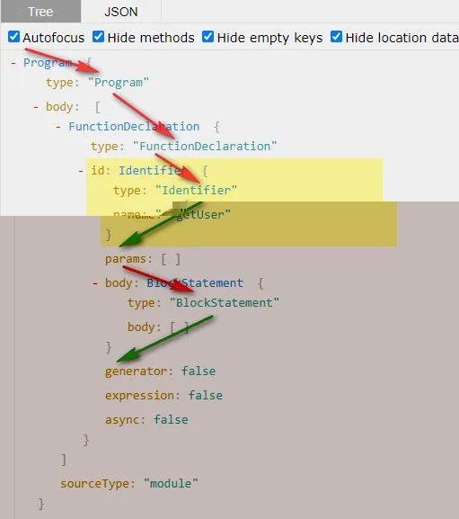
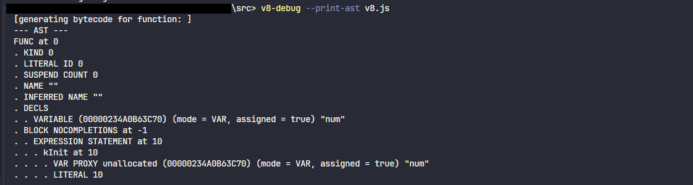

# AST抽象语法树

## 一、AST理论概念

在计算机科学中，抽象语法树（Abstract Syntax Tree，AST），或简称语法树（Syntax tree），是 `源代码语法结构` 的一种抽象表示。它以树状的形式表现编程语言的语法结构，树上的每个节点都表示源代码中的一种结构。

`源代码语法结构的一种抽象表示` 注意这句话，它是我们理解 AST 的关键。这句话大概的意思就是，按照某种约定的规范，以树形的数据结构，把我们的代码描述出来。

## 二、acorn实现源代码转换AST

推荐一个常用的 AST 在线转换网站：https://astexplorer.net/

```javascript
const acorn = require('acorn');
const fs = require('fs');
const code = `var num = 10;`; // 源代码

// 形成 ast 对象写入 json
fs.writeFileSync('./ast.json', JSON.stringify(acorn.parse(code, { ecmaVersion: 2020 }), null, '\t'));
```

生成的AST

```json
{
  "type": "Program",
  "start": 0,
  "end": 13,
  "body": [
    {
      "type": "VariableDeclaration",
      "start": 0,
      "end": 13,
      "declarations": [
        {
          "type": "VariableDeclarator",
          "start": 4,
          "end": 12,
          "id": {
            "type": "Identifier",
            "start": 4,
            "end": 7,
            "name": "num"
          },
          "init": {
            "type": "Literal",
            "start": 10,
            "end": 12,
            "value": 10,
            "raw": "10"
          }
        }
      ],
      "kind": "var"
    }
  ],
  "sourceType": "script"
}
```

AST 是一种源代码的抽象语法结构的树形表示，树中的每个节点都表示源代码中出现的一个构造。并且 AST 遍历的流程是深度优先，遍历过程如下



## 三、V8的AST与acorn的AST的区别

v8 具体生成的 AST 抽象语法树如下



V8和acorn的两者差异：

1. @babel/parser、acorn 等形成 AST 语法树对象结构不相同，生成目的和 AST 生成的时机不同。

2. V8 内由 C++ 实现，@babel/parser、acorn则是通过 JavaScript 编程语言实现解析 `x.js` 文件。

## 四、AST用途

1. ESLint（espree）、Prettier 的代码高亮、格式化、错误提示、自动补全等。
2. uglifyJS 的代码压缩等
3. 编译的 webpack（acorn）、babel（@babel/parser）、typescript 等
