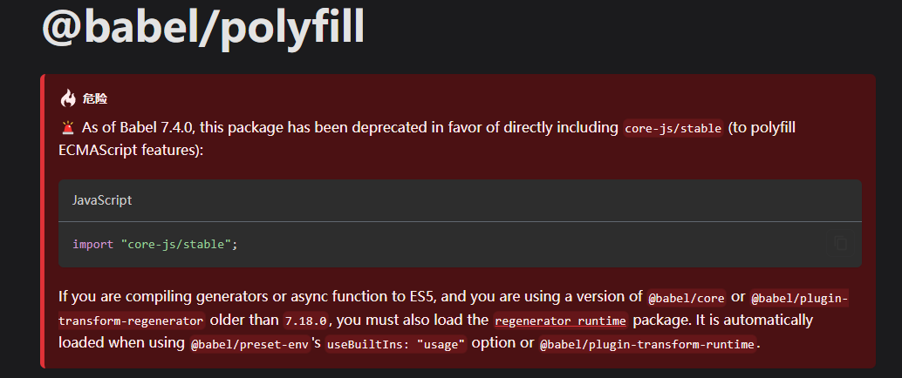

# babel7的快速入门

## 一、babel介绍

Babel 是一个工具链，主要用于将采用 ECMAScript2015+ 语法编写的代码转换为向后兼容的 JavaScript 语法，以便能够运行在当前和旧版本的浏览器或其他环境中。

+ 语法转换（es-high -> es-lower）
+ 通过 Polyfill 处理在目标环境无法转换的特性（通过 core-js 实现）
+ 源码转换

## 二、babel基础使用

在单独使用命令行时，先不配置 babel 的配置文件

先安装 @babel/cli 包，该包提供了 babel 命令，可以通过 `babel --help` 查看相关命令

```bash
npm install --save-dev @babel/cli
```

### 2.1、通过babel转换箭头函数

安装 @babel/plugin-transform-arrow-functions 

```bash
npm install --save-dev @babel/plugin-transform-arrow-functions
```

基础代码如下

```javascript
// 箭头函数转换
const fn = () => 1;
```

配置 script 脚本

```json
"scripts": {
	"arrow": "babel 01-demo/arrow.js -o dist/01-demo/arrow.js --plugins=@babel/plugin-transform-arrow-functions --no-babelrc",
},
```

执行配置的脚本命令，编译结果如下

```javascript
// 箭头函数转换
const fn = function () {
  return 1;
};
```

### 2.2、babel配置文件使用

创建 .babelrc.js 文件

```javascript
module.exports = {
  presets: [],
  plugins: ['@babel/plugin-transform-arrow-functions'],
};
```

配置脚本命令并执行命令

```json
"scripts": {
  "demo02": "babel 02-demo --out-dir dist/02-demo --config-file ./02-babelrc.js"
},
```

## 三、理解babel的作用和使用

babel 可以将 ES6+ 的代码转换 ES5 以及之前的语法，处理不同浏览器之间的兼容性。

@babel/core 包包含了 @babel/parser 和 @babel/generator 的编译成 ast 和通过 ast 生成代码的相关方法，而上述的安装的 @babel/cli 包默认依赖安装 @babel/core 包，所以也是上个通过 babel 命令进行编译时不会报错的原因。如需要对@babel/core 使用需要详细了解查看 [官方说明文档](https://www.babeljs.cn/docs/babel-core) 。以下是 ES6+ 转换 ES5 代码过程

配置初始基础代码

```js
const fn = () => 1;

let { x, y, ...z } = { x: 1, y: 2, a: 3, b: 4 };
console.log(x); // 1
console.log(y); // 2
console.log(z); // { a: 3, b: 4 }
```

配置脚本命令并执行

```json
"scripts": {
  "demo03": "babel 03-demo --out-dir dist/03-demo --config-file ./03-babelrc.js"
},
```


发现此时并不会编译执行成功，并且在IE浏览器上课可能会存在兼容性问题。原因是扩展运算符并没有配置相关插件去进行相关转换，进到 [Babel插件](https://www.babeljs.cn/docs/plugins-list) 页面 ，看需要什么插件能处理扩展运算符——可以看到这是一个 ES2018 的特性，通过 @babel/plugin-proposal-object-rest-spread 插件就可以用啦。

安装  @babel/plugin-proposal-object-rest-spread 依赖包

```bash
npm i @babel/plugin-proposal-object-rest-spread -D
```

修改配置.babelrc.js，添加 @babel/plugin-proposal-object-rest-spread 插件

```js
module.exports = {
  presets: [],
  plugins: ['@babel/plugin-proposal-object-rest-spread'],
};
```

编译后的结果

```javascript
import _objectWithoutProperties from "@babel/runtime/helpers/objectWithoutProperties";
const fn = () => 1;
let _x$y$a$b = {
    x: 1,
    y: 2,
    a: 3,
    b: 4
  },
  {
    x,
    y
  } = _x$y$a$b,
  z = _objectWithoutProperties(_x$y$a$b, ["x", "y"]);
console.log(x); // 1
console.log(y); // 2
console.log(z); // { a: 3, b: 4 }
```

同时此时还是会存在兼容性问题，IE浏览器不兼容解构赋值，需要安装 @babel/plugin-transform-destructuring


安装 @babel/plugin-transform-destructuring

```bash
npm i @babel/plugin-transform-destructuring -D
```

修改配置 .babelrc.js，添加 @babel/plugin-transform-destructuring 插件

```javascript
module.exports = {
  presets: [],
  plugins: ['@babel/plugin-proposal-object-rest-spread', '@babel/plugin-transform-destructuring'],
};
```

编译后结果如下

```javascript
import _objectWithoutProperties from "@babel/runtime/helpers/objectWithoutProperties";
const fn = () => 1;
let _x$y$a$b = {
    x: 1,
    y: 2,
    a: 3,
    b: 4
  },
  x = _x$y$a$b.x,
  y = _x$y$a$b.y,
  z = _objectWithoutProperties(_x$y$a$b, ["x", "y"]);
console.log(x); // 1
console.log(y); // 2
console.log(z); // { a: 3, b: 4 }
```

再次看 IE 浏览器的执行情况，发现就会执行不会出错了


## 四、优化babel的配置

### 4.1、 @babel/preset-env

@babel/preset-env 是一个智能预设，同时也是插件集合，配置了它就可以让你用 ES6+ 去书写你的代码，而且它会按需去加载所需要的插件

使用 @babel/preset-env 替换 @babel/plugin-transform-destructuring、@babel/plugin-proposal-object-rest-spread

安装 @babel/preset-env 

```bash
npm i @babel/preset-env --save-dev
```

添加 babel 配置 

```js
module.exports = {
  presets: [['@babel/preset-env']],
  plugins: [],
};
```

编译结果基本和之前保持一样，差异不大。

```javascript
"use strict";

function _objectWithoutProperties(e, t) { if (null == e) return {}; var o, r, i = _objectWithoutPropertiesLoose(e, t); if (Object.getOwnPropertySymbols) { var n = Object.getOwnPropertySymbols(e); for (r = 0; r < n.length; r++) o = n[r], -1 === t.indexOf(o) && {}.propertyIsEnumerable.call(e, o) && (i[o] = e[o]); } return i; }
function _objectWithoutPropertiesLoose(r, e) { if (null == r) return {}; var t = {}; for (var n in r) if ({}.hasOwnProperty.call(r, n)) { if (-1 !== e.indexOf(n)) continue; t[n] = r[n]; } return t; }
var fn = function fn() {
  return 1;
};
var _x$y$a$b = {
    x: 1,
    y: 2,
    a: 3,
    b: 4
  },
  x = _x$y$a$b.x,
  y = _x$y$a$b.y,
  z = _objectWithoutProperties(_x$y$a$b, ["x", "y"]);
console.log(x); // 1
console.log(y); // 2
console.log(z); // { a: 3, b: 4 }
```

### 4.2、@babel/plugin-transform-runtime优化代码量

当初始 01-index.js 和 02-index.js 相同基础代码

```javascript
const fn = () => 1;

let { x, y, ...z } = { x: 1, y: 2, a: 3, b: 4 };
console.log(x); // 1
console.log(y); // 2
console.log(z); // { a: 3, b: 4 }
```

然后延用之前的 babel 配置

```javascript
module.exports = {
  presets: [['@babel/preset-env']],
  plugins: [],
};
```

进行编译之后，编译后的文件都有创建 _objectWithoutProperties 和 _objectWithoutPropertiesLoose 函数


 _objectWithoutProperties 和 _objectWithoutPropertiesLoose 居然都会重复声明两次。这对于需要转换的特性，我使用很多次，转换后输出的文件不是爆炸了么？此时需要一个插件来控制代码量——@babel/plugin-transform-runtime 。对于这种转换函数，在外部模块化，用到的地方直接引入即可。

提及 @babel/plugin-transform-runtime 插件的使用需要说到@babel/runtime，@babel/runtime 是一个包含 Babel 模块化运行时帮助程序的库。@babel/plugin-transform-runtime 插件作用就是将 _objectWithoutProperties 和 _objectWithoutPropertiesLoose 这样的函数从 @babel/runtime 中导入获取。

安装 @babel/plugin-transform-runtime 和 @babel/runtime

```bash
npm install --save @babel/runtime

npm i --save-dev @babel/plugin-transform-runtime
```

babel 的配置

```javascript
module.exports = {
  presets: [['@babel/preset-env']],
  plugins: ['@babel/plugin-transform-runtime'],
};
```

编译后的结果


@babel/runtime 必须通过 --save 安装而不是 --save-dev，编译后的代码在运行时需要 @babel/runtime

## 五、@babel/polyfill和core-js

@babel/polyfill 模块包含 core-js 和一个自定义的 regenerator runtime 来模拟完整的 ES2015+ 环境。

这意味着你可以使用诸如 Promise 和 WeakMap 之类的新的内置组件、 Array.from 或 Object.assign 之类的静态方法、 Array.prototype.includes 之类的实例方法以及生成器函数（generator functions）（前提是你使用了 regenerator 插件）。为了添加这些功能，polyfill 将添加到全局范围（global scope）和类似 String 这样的原生原型（native prototypes）中。

在不添加 @babel/polyfill 下，像以下代码通过 babel 编译之后并不会发生变化

```javascript
const a = [1, 2, 3, 4, 6];
console.log(a.includes(7));
```

上述代码如果低版本的浏览器不兼容就会出现报错。

### 5.1、@babel/polyfill的使用

```bash
npm install --save @babel/polyfill
```

使用 --save 参数而不是 --save-dev，因为这是一个需要在你的源码之前运行的 polyfill。如下

```js
import '@babel/polyfill';

const a = [1, 2, 3, 4, 6];
console.log(a.includes(7));
```

编译后的结果

```javascript
"use strict";

require("@babel/polyfill");
var a = [1, 2, 3, 4, 6];
console.log(a.includes(7));
```

先运行 @babel/polyfill ，这样在不兼容的低版本运行时

但是如果希望不在运行前导入，应当对代码使用那些方法进行按需导入则需要修改 babel 的配置。将 useBuiltIns 改为 usage，同时在代码中移除 `import '@babel/polyfill';`

```javascript
module.exports = {
  presets: [['@babel/preset-env', { useBuiltIns: 'usage' }]],
  plugins: [],
};
```

当进行再次编译之后结果如下


当 useBuiltIns 设置为 usage 时，如果不移除  `import '@babel/polyfill';` 在终端就会出现一个提示。

```bash
When setting `useBuiltIns: 'usage'`, polyfills are automatically imported when needed.
Please remove the direct import of `@babel/polyfill` or use `useBuiltIns: 'entry'` instead.
```

当如果 useBuiltIns 改为 entry 时，则需要将  `import '@babel/polyfill';` 加上，以下是编译之后的结果


目前 @babel/polyfill 库已经不再维护了，在官方文档中也有说明。



官方也是给出了解决方案

```javascript
import "core-js/stable"; 
// 替换
import '@babel/polyfill';
```

### 5.2、安装 core-js

在 5.1 章节中的编译过程中，终端会报出一个警告


这需要显示声明 corejs 的版本并且需要安装 core-js 包

```bash
npm i --save core-js@3 
```

修改 babel 的配置如下

```javascript
module.exports = {
  presets: [['@babel/preset-env', { useBuiltIns: 'entry', corejs: '3' }]],
  plugins: [],
};
```

当再次编译以下代码

```javascript
import '@babel/polyfill';

const a = [1, 2, 3, 4, 6];
console.log(a.includes(7));
```

编译就是提示以下信息


当将 @babel/polyfill 使用 core-js/stable进行替换时，重新编译后的结果如下


当 useBuiltIns 设置为 usage，同时也是需要移除 `import 'core-js/stable';`，编译后的结果如下

```bash
"use strict";

require("core-js/modules/es.array.includes.js");
// import '@babel/polyfill';

// import 'core-js/stable';

var a = [1, 2, 3, 4, 6];
console.log(a.includes(7));
```

## 六、babel对模块化的处理

修改 babelrc.js 配置，添加 modules 设置，modules 可以设置的值为 amd、umd、systemjs、commonjs、cjs、auto、false，具体的设置的差异查看 [官方说明](https://www.babeljs.cn/docs/babel-preset-env#modules)

```javascript
module.exports = {
  presets: [
    [
      '@babel/preset-env',
      {
        useBuiltIns: 'usage',
        corejs: '3',
        modules: false,
      },
    ],
  ],
  plugins: ['@babel/plugin-transform-runtime'],
};
```

编译前代码

```javascript
const a = [1, 2, 3, 4, 6];
console.log(a.includes(7));
```

编译后代码

```javascript
import "core-js/modules/es.array.includes.js";
var a = [1, 2, 3, 4, 6];
console.log(a.includes(7));
```


