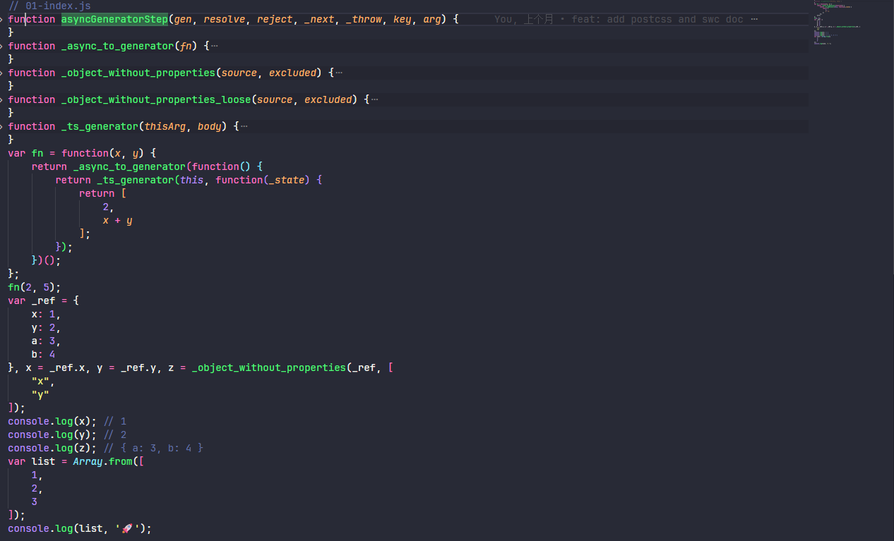
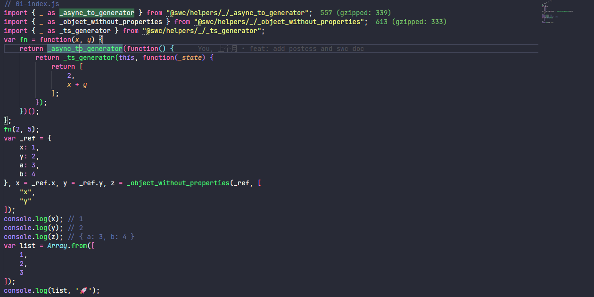
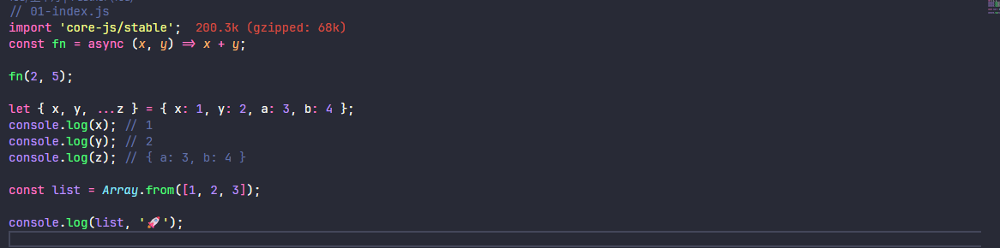
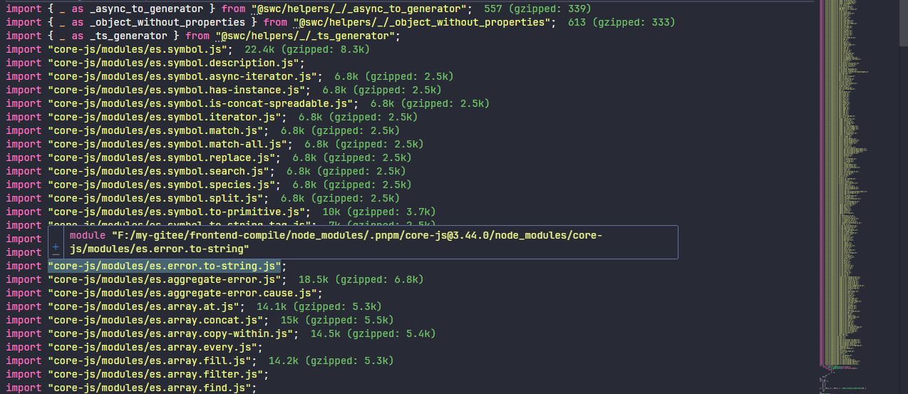
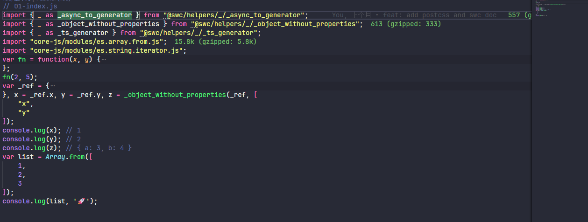

# SWC编译器快速入门

## 一、swc介绍

swc 是一个 JavaScript 编译器，它是 Rust 语言实现的。与它对比的是 Babel，两者区别是 Babel 是 JavaScript 语言实现的 JavaScript 编译器，局限于 JavaScript 的单线程，使得 Babel 编译大型项目会很慢，而 swc 是基于 Rust 高性能语言实现的 JavaScript 编译器，编译大型项目速度更快。

## 二、swc基础使用

### 2.1、@swc/core编译原理

@swc/core 的 transform、parse 的原理过程，parse 方法将 源代码 编译成 AST，transform 方法则是将 AST 转移成功 js 代码。

安装@swc/core

```bash
npm i @swc/core -D
```

编译前的源代码

```javascript
/**
 * 编译前的源代码
 */
const a = 12;

const sub = (a, b) => {
  return a - b;
}

console.log(sub(a, 5));
```

编写相关代码将源代码编译输出

```javascript
const { parseFile, transformSync } = require('@swc/core');
const fs = require('fs');
const path = require('path');

function run() {
  parseFile(path.resolve(__dirname, './source-code.js'), { syntax: 'ecmascript', target: 'es5' }).then((result) => {
    // result 为 源代码编译成 ast 的结果
    const output = transformSync(result, {}); // 第二个参数为编译的 options 配置
    console.log(output, '🚀'); // output 为 ast 编译成目标代码的结果
    fs.writeFile(path.resolve(__dirname, './output.js'), output.code, (err) => {
      // 将目标代码写入文件
      if (err) throw err;
      console.log('The file has been saved!');
    });
  });
}

run();
```

编译之后的代码

```javascript
var a = 12;
var sub = function(a, b) {
    return a - b;
};
console.log(sub(a, 5));
```

### 2.2、@swc/cli编译

安装@swc/cli

```bash
npm i -D @swc/cli
```

配置 package.json 的 scripts

```json
"scripts": {
  "demo01": "npx swc src/01-demo/index.js -o dist/01-demo/index.js --no-swcrc"
},
```

编译前的源基础代码

```js
const num = 10;

const log = (num) => {
  console.log(num, '🚀');
};

log(num);
```

编译后的代码，swc 会默认编译成 es5

```js
var num = 10;
var log = function (num) {
  console.log(num, '🚀');
};
log(num);
```

## 三、.swcrc编译相关配置

### 3.1、配置文件创建

@swc/cli 执行 npx swc 命令时，swc 有一套默认值进行编译，默认会将 js 编译成 es5 的代码。如果要指定配置有两种方式：

1. 通过 swc --xx 配置，具体有那些命令可以通过 npx swc --help 查看，例如：swc --out-file (-o)
2. 创建 .swcrc 配置文件，当执行 swc 命令时会读取 .swcrc 的相关配置
3. 如果不知道默认的 .swcrc 配置文件，可以通过 swc --config-file 指定配置文件

swcrc 配置文件默认值如下

```js
{
  "$schema": "https://swc.rs/schema.json",
  "jsc": {
    "parser": {
      "syntax": "ecmascript",
      "jsx": false,
      "dynamicImport": false,
      "privateMethod": false,
      "functionBind": false,
      "exportDefaultFrom": false,
      "exportNamespaceFrom": false,
      "decorators": false,
      "decoratorsBeforeExport": false,
      "topLevelAwait": false,
      "importMeta": false
    },
    "transform": null,
    "target": "es5",
    "loose": false,
    "externalHelpers": false,
    // Requires v1.2.50 or upper and requires target to be es2016 or upper.
    "keepClassNames": false
  },
  "minify": false
}
```

### 3.2、.swcrc的相关字段配置说明

```json
{
  "test": [], // 匹配对应目标文件编译
  "exclude": [], // 排除编译的文件
  "env": { // 设置 env 之后，支持 browserslist 兼容性处理
    "targets": "ie >= 8", // 当env.targets 设置之后 jsc.target 会失效，并且编译会报错
    "mode": 'usage', // 主要 entry 和 usage 对标 babel的 useBuiltIns 配置
    "coreJs": "3", // 设置 coreJs 兼容版本 对标 babel 的 corejs 设置
    "shippedProposals": true // 对标 @babel/plugin-proposal-class-properties
  },
  "jsc": {
    "parser": {
      "syntax": "ecmascript", // 主要有 ecmascript/typescript、js 选 ecmascript、ts 选 typescript
      "jsx": false, // 是否 jsx 语法
      "dynamicImport": false, // 是否支持动态import导入 对标 @babel/plugin-syntax-dynamic-import
      "privateMethod": false,
      "functionBind": false,
      "exportDefaultFrom": false,
      "exportNamespaceFrom": false,
      "decorators": false,
      "decoratorsBeforeExport": false,
      "topLevelAwait": false,
      "importMeta": false,
      "experimental": {
      	"plugins": [] // swc配置插件
    	},
    },
    "minify": {
      "compress": {
        "unused": true
      },
      "mangle": true
    }
    "target": "es5", // 编译后的目标版本
    "loose": false,
    "externalHelpers": true, // 启用 @swc/helper 导入
    "transform": {}
  },
  "minify": false // 是否开启压缩，只有开启时，jsc.minify 配置才会生效
  "module": {
  	"type": "es6", // 编译后的模块化设置，支持 "es6、commonjs、amd、umd"
    // These are defaults.
    "strict": false,
    "strictMode": true, // 是否开启严格模式
    "lazy": false,
    "noInterop": false
	},
  "sourceMaps": false, // 是否开启 sourceMap
  "inlineSourcesContent": false,
  "isModule": false
}
```

### 3.3、Multiple Entries

.swcrc 为一个 json 文件，可以配置多个编译 swc 配置（Multiple Entries） 和 单个编译 swc 配置

```json
// 多个编译配置文件，针对不同文件配置不同编译，以数组形式进行配置
[
  {
    "test": ".*\\.js$", // test 为正则匹配，针对js的编译配置
    "module": {
      "type": "commonjs"
    }
  },
  {
    "test": ".*\\.ts$", // 针对ts的编译配置
    "module": {
      "type": "amd"
    }
  }
]
```

## 四、.swcrc部分重要设置讲解

### 4.1、准备工作

新建 01-index.js、02-index.js 文件

```js
// 01-index.js
const fn = async (x, y) => x + y;

fn(2, 5);

let { x, y, ...z } = { x: 1, y: 2, a: 3, b: 4 };
console.log(x); // 1
console.log(y); // 2
console.log(z); // { a: 3, b: 4 }

const list = Array.from([1, 2, 3]);

console.log(list, '🚀');
```

```javascript
// 02-index.js
async function add(a, b) {
  return a + b;
}

async function subtract(a, b) {
  return a - b;
}

async function multiply(a, b) {
  return a * b;
}

async function divide(a, b) {
  if (b === 0) {
    throw new Error('Cannot divide by zero');
  }
  return a / b;
}

let { a, b, ...c } = { x: 1, y: 2, a: 3, b: 4 };
console.log(a); // 1
console.log(b); // 2
console.log(c); // { a: 3, b: 4 }

const list = Array.from([1, 2, 3]);

console.log(list, '🚀');
```

创建 .swcrc 配置文件，配置内容如下

```json
{
  "env": {},
  "jsc": {
    "parser": {
      "syntax": "ecmascript",
      "jsx": false,
      "dynamicImport": true
    },
    "loose": false
  },
  "module": {
    "type": "es6",
    "strictMode": true
  },
  "sourceMaps": false,
  "isModule": true
}
```

配置 scripts 编译脚本

```json
"scripts": {
  "demo02": "npx swc 02-demo --out-dir dist --config-file ./02-swcrc.json"
},
```

配置 .browserslistrc 文件

```txt
ie >= 8
Chrome >= 79
```

编译后的代码



JavaScript的 ES6 以上的版本编译成 Javascript 低版本 或者 浏览器兼容版本的js 会生成一些辅助函数，但是每个都会生成相同的辅助函数，于是我们希望这些辅助函数抽取在一起，通过导入的形式进行按需导入。

### 4.2、jsc.externalHelpers 设置为 true

由上一个章节中，swc 在编译时会成一些辅助函数，但是每个文件都会生成，于是我们希望这些辅助函数抽取在一起，通过导入的形式进行按需导入。

安装 @swc/helper 包

```bash
npm i @swc/helper -D
```

同时需要在 .swcrc 配置文件添加 "externalHelpers": true，修改后的 .swcrc 配置文件如下

```json
{
  "env": {},
  "jsc": {
    "parser": {
      "syntax": "ecmascript",
      "jsx": false,
      "dynamicImport": true
    },
    "loose": false,
    "externalHelpers": true // [!code ++]
  },
  "module": {
    "type": "es6",
    "strictMode": true
  },
  "sourceMaps": false,
  "isModule": true
}
```

再次查看编译后的文件，发现辅助函数已经通过 @swc/helpers 导入



### 4.3、env.mode和env.coreJs设置

先简单说明一下 core-js 包的作用，core-js 是一个模块化的 JavaScript 标准库，它包含了大量的 polyfills，支持 ECMAScript 从 2015 到 2024 的所有特性，以及一些跨平台的 WHATWG/W3C 标准和提案。无论是 Promise、Symbols、Collections 还是 Typed Arrays，core-js 都能提供全面的支持。此外，它还支持按需加载和无全局命名空间污染的使用方式，极大地提升了开发的灵活性和效率。
例如：上面的 Array.from 的 api 未被降级编译


具体解决方案通过设置 env.mode 和 env.coreJs 以及安装 core-js 进行处理，示例如下：

先安装 core-js 包

```bash
npm i core-js
```

安装成功，在 js 文件中进行导入



配置 .swcrc 设置，修改后的配置如下

```json
{
  "env": {
    "mode": "entry",
    "coreJs": "3.38.1"
  },
  "jsc": {
    "parser": {
      "syntax": "ecmascript",
      "jsx": false,
      "dynamicImport": true
    },
    "loose": false,
    "externalHelpers": true
  },
  "module": {
    "type": "es6",
    "strictMode": true
  },
  "sourceMaps": false,
  "isModule": true
}
```

查看编译后的文件，发现会导入很多没有用到的 core-js 兼容性文件，主要是因为 env.mode 设置为了 "entry"，会根据 .browserslistrc 浏览器兼容性导入全部所需的 core-js 兼容性文件。



如果需要按需导入就需要将 env.mode 设置为了 "usage" ，同时也需要移除 `import 'core-js/stable';` 再次编译结果如下




