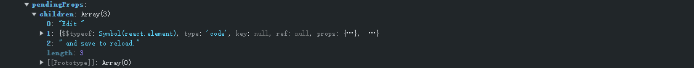

# React17源码分析

代码分析过程中会删除一些无关紧要的函数参数，同时不考虑服务端渲染的水合。

## 一、根元素FiberRootNode生成

### 1.1、render函数执行

render 函数可以传递三个参数：element、container、callback

```javascript
function render(element, container) {
  // 检查 container 是否为 真实dom
  if (!isValidContainer(container)) {
    {
      throw Error( "Target container is not a DOM element." );
    }
  }
  return legacyRenderSubtreeIntoContainer(null, element, container);
}
```

其中 element 的数据结构，是通过 _jsx 编译转换之后实现的。

```javascript
{
  "$$typeof": Symbol(react.element)
  "key": null,
  "ref": null,
  "props": {
    "children": {
        "key": null,
        "ref": null,
        "props": {},
        "_owner": null,
        "_store": {}
    }
  },
  "type": "Symbol(react.strict_mode)"
  "_owner": null,
  "_store": {}
}
```

### 1.2、FiberRootNode节点创建过程

```javascript
function legacyRenderSubtreeIntoContainer(parentComponent, children, container) {
  // container 为 div#root
  var root = container._reactRootContainer; // 为 undefined
  var fiberRoot;
  if (!root) { // 执行
    // 创建出来 ReactDOMBlockingRoot 实例
    root = container._reactRootContainer = legacyCreateRootFromDOMContainer(container)
    
    fiberRoot = root._internalRoot; // 获取 FiberRootNode
		
    // 更新挂载
    unbatchedUpdates(function () {
      updateContainer(children, fiberRoot, parentComponent, callback);
    });
  } 
}
```

legacyCreateRootFromDOMContainer 函数作为创建 FiberRootNode 节点函数，内部其实返回的是 createLegacyRoot 函数

```javascript
function legacyCreateRootFromDOMContainer(container) {
   return createLegacyRoot(container);
}
```

#### 1.2.1、createLegacyRoot分析

```javascript
function createLegacyRoot(container) {
  return new ReactDOMBlockingRoot(container, LegacyRoot); // LegacyRoot 为 全局变量 0
}
```

其中 ReactDOMBlockingRoot 为一个构造函数，分析如下

```javascript
function ReactDOMBlockingRoot(container, tag) {
  this._internalRoot = createRootImpl(container, tag); // tag 为 0
}
```

#### 1.2.2、createRootImpl创建FiberRootNode分析

```javascript
function createRootImpl(container, tag) {
  // 通过 createContainer 创建 FiberRootNode
  var root = createContainer(container, tag);
  
  // 将 div#root 的 __reactContainer$ + randomKey 设置给 FiberNode
  markContainerAsRoot(root.current, container);

  {
    // COMMENT_NODE 为 8 ，直接取 container
    var rootContainerElement = container.nodeType === COMMENT_NODE ? container.parentNode : container; 
    // react 合成事件监听，这里不讲解
    listenToAllSupportedEvents(rootContainerElement);
  }
  
  // 返回的 root 给到 _internalRoot
  return root;
}

// 创建 FiberRootNode
function createContainer(containerInfo, tag, false) {
  return createFiberRoot(containerInfo, tag, hydrate);
}

function createFiberRoot(containerInfo, tag, false) {
  var root = new FiberRootNode(containerInfo, tag, false);

  var uninitializedFiber = createHostRootFiber(tag);
  root.current = uninitializedFiber;
  uninitializedFiber.stateNode = root;
  initializeUpdateQueue(uninitializedFiber);
  return root;
}

// 将 container[__reactContainer$] = root.current
function markContainerAsRoot(hostRoot, node) {
  node[internalContainerInstanceKey] = hostRoot;
}
```

createContainer 函数分析如下

```javascript
function createContainer(containerInfo, tag) {
  return createFiberRoot(containerInfo, tag);
}
```

createFiberRoot 函数分析如下

```javascript
function createFiberRoot(containerInfo, tag) {
  var root = new FiberRootNode(containerInfo, tag, hydrate = false); // hydrate = false 的是我当前默认给出的

  var uninitializedFiber = createHostRootFiber(tag);
  root.current = uninitializedFiber;
  uninitializedFiber.stateNode = root;
  initializeUpdateQueue(uninitializedFiber);
  return root;
}
```

所以创建 FiberRootNode 是通过 ` new FiberRootNode ` 进行创建的，FiberRootNode 的函数分析如下

```javascript
function FiberRootNode(containerInfo, tag, hydrate) {
  this.tag = tag;
  this.containerInfo = containerInfo; // div#root
  this.pendingChildren = null;
  this.current = null;
  this.pingCache = null;
  this.finishedWork = null;
  this.timeoutHandle = noTimeout; // -1
  this.context = null;
  this.pendingContext = null;
  this.hydrate = hydrate;
  this.callbackNode = null;
  this.callbackPriority = NoLanePriority;
  this.eventTimes = createLaneMap(NoLanes);
  this.expirationTimes = createLaneMap(NoTimestamp);
  this.pendingLanes = NoLanes;
  this.suspendedLanes = NoLanes;
  this.pingedLanes = NoLanes;
  this.expiredLanes = NoLanes;
  this.mutableReadLanes = NoLanes;
  this.finishedLanes = NoLanes; // NoLanes 为 0
  this.entangledLanes = NoLanes;
  this.entanglements = createLaneMap(NoLanes);

  {
    this.mutableSourceEagerHydrationData = null;
  }

  {
    this.interactionThreadID = tracing.unstable_getThreadID();
    this.memoizedInteractions = new Set();
    this.pendingInteractionMap = new Map();
  }

  {
    switch (tag) {
      case BlockingRoot:
        this._debugRootType = 'createBlockingRoot()';
        break;

      case ConcurrentRoot:
        this._debugRootType = 'createRoot()';
        break;

      case LegacyRoot:
        this._debugRootType = 'createLegacyRoot()';
        break;
    }
  }
}
```

生成 FiberRootNode 结构如下


#### 1.2.3、createHostRootFiber创建FiberNode分析

在 createFiberRoot 函数中执行完 `new FiberRootNode` 之后还会执行后续操作，如下

```javascript
function createFiberRoot(containerInfo, tag, false) {
  var root = new FiberRootNode(containerInfo, tag, false);
	
  // 实际就是创建 div#root 的 FiberNode
  var uninitializedFiber = createHostRootFiber(tag);
  // 将 FiberRootNode 的 current 属性指向 FiberNode
  root.current = uninitializedFiber;
  // 将 FiberNode 的 stateNode 属性指向 FiberRootNode
  uninitializedFiber.stateNode = root;
	
  // 创建 queue 对象并指向 FiberNode 的 updateQueue 属性
  initializeUpdateQueue(uninitializedFiber);
  return root;
}

// 创建 queue 对象并指向 FiberNode 的 updateQueue 属性
function initializeUpdateQueue(fiber) {
  var queue = {
    baseState: fiber.memoizedState,
    firstBaseUpdate: null,
    lastBaseUpdate: null,
    shared: {
      pending: null
    },
    effects: null
  };
  fiber.updateQueue = queue;
}
```

createHostRootFiber 分析如下

```javascript
function createHostRootFiber(tag) {
  var mode;  
  
  mode |= ProfileMode; // undefined | 8 = 8
  // 创建 FiberNode 节点
  return createFiber(HostRoot, null, null, mode); // HostRoot 为 3， mode 为 8
}
```

createFiber 分析如下

```javascript
var createFiber = function (tag, pendingProps, key, mode) {
  return new FiberNode(tag, pendingProps, key, mode);
};
```

FiberNode 的函数就是创建 fiber 节点，分析如下

```javascript
function FiberNode(tag, pendingProps, key, mode) {
  // Instance
  this.tag = tag;
  this.key = key;
  this.elementType = null;
  this.type = null;
  this.stateNode = null; // Fiber

  this.return = null;
  this.child = null;
  this.sibling = null;
  this.index = 0;
  this.ref = null;
  this.pendingProps = pendingProps;
  this.memoizedProps = null;
  this.updateQueue = null;
  this.memoizedState = null;
  this.dependencies = null;
  this.mode = mode; // Effects

  this.flags = NoFlags;
  this.nextEffect = null;
  this.firstEffect = null;
  this.lastEffect = null;
  this.lanes = NoLanes;
  this.childLanes = NoLanes;
  this.alternate = null;

  {
    this.actualDuration = Number.NaN;
    this.actualStartTime = Number.NaN;
    this.selfBaseDuration = Number.NaN;
    this.treeBaseDuration = Number.NaN;
    this.actualDuration = 0;
    this.actualStartTime = -1;
    this.selfBaseDuration = 0;
    this.treeBaseDuration = 0;
  }

  {
    this._debugID = debugCounter++;
    this._debugSource = null;
    this._debugOwner = null;
    this._debugNeedsRemount = false;
    this._debugHookTypes = null;
    if (!hasBadMapPolyfill && typeof Object.preventExtensions === 'function') {
      Object.preventExtensions(this);
    }
  }
}
```

创建之后 FiberNode 数据结构如下


### 1.3、形成的数据内存指向图


## 二、执行updateContainer挂载阶段

### 2.1、updateContainer执行基本过程

在 FiberRootNode 创建完成之后，后续就是开始执行 updateContainer 进行 UI 更新挂载阶段

```javascript
/**
 * 参数：
 * element 为传递子元素 
 * container 为 FiberRootNode
 * parentComponent 刚开始挂载是 null
 * callback 为 undefined
 */
updateContainer(children, container, parentComponent, callback); {
  var current$1 = container.current; // 取出 FiberNode
  var eventTime = requestEventTime(); // 实际执行 now() 返回
  
  var lane = requestUpdateLane(current$1); // 先不分析，这里返回的是 1
  var context = getContextForSubtree(parentComponent); // context 为 {}
  
  // 赋值 container 的属性
  if (container.context === null) {
    container.context = context;
  } else {
    container.pendingContext = context;
  }
  var update = createUpdate(eventTime, lane); 
	
  // 设置  update.payload 属性，将 element 赋值进入
  update.payload = {
    element: element
  };
   
   // enqueueUpdate 函数
   enqueueUpdate(current$1, update);
   // 重点的核心，在 2.2 节 说明
   scheduleUpdateOnFiber(current$1, lane, eventTime);
} 

// createUpdate 函数创建 update 返回
function createUpdate(eventTime, lane) {
  var update = {
    eventTime: eventTime,
    lane: lane,
    tag: UpdateState, // UpdateState 为 0
    payload: null,
    callback: null,
    next: null
  };
  return update;
}

// enqueueUpdate 函数
function enqueueUpdate(fiber, update) {
   /**
   *  var queue = {
    baseState: fiber.memoizedState,
    firstBaseUpdate: null,
    lastBaseUpdate: null,
    shared: {
      pending: null
    },
    effects: null
  };
   */
  var updateQueue = fiber.updateQueue;

  if (updateQueue === null) {
    return;
  }
	
  // 取出 updateQueue 的 shared，然后再取出 pending 属性
  var sharedQueue = updateQueue.shared;
  var pending = sharedQueue.pending;

  if (pending === null) {
    update.next = update; // 将  update.next = update;
  } else {
    update.next = pending.next;
    pending.next = update;
  }

  sharedQueue.pending = update; // 将 update 赋值给 updateQueue.shared.pending
}
```


### 2.2、scheduleUpdateOnFiber函数执行分析

```javascript
// fiber 为 div#root 的 FiberNode
function scheduleUpdateOnFiber(fiber, lane, eventTime) { // lane 为 1，eventTime 为之前创建 now()
  var root = markUpdateLaneFromFiberToRoot(fiber, lane);
 	
  markRootUpdated(root, lane, eventTime);
  
  if (lane === SyncLane) { // SyncLane 为 1
    schedulePendingInteractions(root, lane);
    
    // 重点
    performSyncWorkOnRoot(root);
  }
}

function markUpdateLaneFromFiberToRoot(sourceFiber, lane) {
  sourceFiber.lanes = mergeLanes(sourceFiber.lanes, lane); // 执行完 mergeLanes 时 sourceFiber.lanes 还是为 1
  var alternate = sourceFiber.alternate; // 为 null
  if (alternate !== null) {
    // 不执行
  }
  var node = sourceFiber;
  var parent = sourceFiber.return; // null
  while (parent !== null) {
    // 不执行
  }
  
  if (node.tag === HostRoot) { // 符合
    var root = node.stateNode; // 获得的为 FiberRootNode
    return root;
  } else {
    return null;
  }
}
```

### 2.3、updateContainer的“递”流程

performSyncWorkOnRoot函数执行分析如下

```javascript
function performSyncWorkOnRoot(root) { // root 参数为 FiberRootNode
   lanes = getNextLanes(root, NoLanes); // 执行完的依旧是为 1
   exitStatus = renderRootSync(root, lanes); // FiberRootNode 和 1
}
```

#### 2.3.1、renderRootSync函数执行分析

```javascript
function renderRootSync(root, lanes) { // FiberRootNode 和 1
	var prevExecutionContext = executionContext;
  executionContext |= RenderContext;
  var prevDispatcher = pushDispatcher();
  
  // workInProgressRoot 和 workInProgressRootRenderLanes 为全局变量，这里是会执行
  if (workInProgressRoot !== root || workInProgressRootRenderLanes !== lanes) {
    prepareFreshStack(root, lanes);
    startWorkOnPendingInteractions(root, lanes);
  }
}
```

这其中最重要的是 prepareFreshStack 函数，该函数的分析如下

```javascript
function prepareFreshStack(root, lanes) { // FiberRootNode 和 1
  root.finishedWork = null;
  root.finishedLanes = NoLanes;
  var timeoutHandle = root.timeoutHandle; // -1 
  
  // false 不执行
  if (timeoutHandle !== noTimeout) { // noTimeout 为 -1
    root.timeoutHandle = noTimeout; 
    cancelTimeout(timeoutHandle);
  }
  
  // workInProgress 为全局的地址引用，主要是指向 fiberNode 的指针
  if (workInProgress !== null) {
   	// 不执行
  }
  
  // 将 root 指向 workInProgressRoot
  workInProgressRoot = root;
  workInProgress = createWorkInProgress(root.current, null);
  workInProgressRootRenderLanes = subtreeRenderLanes = workInProgressRootIncludedLanes = lanes;
  workInProgressRootExitStatus = RootIncomplete;
  workInProgressRootFatalError = null;
  workInProgressRootSkippedLanes = NoLanes;
  workInProgressRootUpdatedLanes = NoLanes;
  workInProgressRootPingedLanes = NoLanes;
	
  {
    spawnedWorkDuringRender = null;
  }

  {
    ReactStrictModeWarnings.discardPendingWarnings();
  }
}

// prepareFreshStack 函数的内部核心函数 createWorkInProgress 
function createWorkInProgress(current, pendingProps) { // pendingProps 为 null，current 为 FibeNode
  var workInProgress = current.alternate; // 取出来为 null
	
  // 所以这里指向 if 语句
  if (workInProgress === null) {
    // 这里的 createFiber 又会根据当前 FibeNode 创建一个新的 FibeNode
    workInProgress = createFiber(current.tag, pendingProps, current.key, current.mode);
    // 并根据当前 FibeNode 的一些属性赋值给 
    workInProgress.elementType = current.elementType;
    workInProgress.type = current.type;
    workInProgress.stateNode = current.stateNode;

    {
      workInProgress._debugID = current._debugID;
      workInProgress._debugSource = current._debugSource;
      workInProgress._debugOwner = current._debugOwner;
      workInProgress._debugHookTypes = current._debugHookTypes;
    }
		
    // 这里有个重点，
    // workInProgress.alternate 指向 current
    // current.alternate 指向 workInProgress
    workInProgress.alternate = current;
    current.alternate = workInProgress;
  } else {
    workInProgress.pendingProps = pendingProps; // 为 null
    workInProgress.type = current.type;
    workInProgress.flags = NoFlags;
    workInProgress.nextEffect = null;
    workInProgress.firstEffect = null;
    workInProgress.lastEffect = null;
    {
      workInProgress.actualDuration = 0;
      workInProgress.actualStartTime = -1;
    }
  }

  workInProgress.childLanes = current.childLanes;
  workInProgress.lanes = current.lanes;
  workInProgress.child = current.child;
  workInProgress.memoizedProps = current.memoizedProps;
  workInProgress.memoizedState = current.memoizedState;
  workInProgress.updateQueue = current.updateQueue; // Clone the dependencies object.
  var currentDependencies = current.dependencies;
  workInProgress.dependencies = currentDependencies === null ? null : {
    lanes: currentDependencies.lanes,
    firstContext: currentDependencies.firstContext
  }; // These will be overridden during the parent's reconciliation

  workInProgress.sibling = current.sibling;
  workInProgress.index = current.index;
  workInProgress.ref = current.ref;

  {
    workInProgress.selfBaseDuration = current.selfBaseDuration;
    workInProgress.treeBaseDuration = current.treeBaseDuration;
  }

  {
    workInProgress._debugNeedsRemount = current._debugNeedsRemount;

    switch (workInProgress.tag) {
      case IndeterminateComponent:
      case FunctionComponent:
      case SimpleMemoComponent:
        workInProgress.type = resolveFunctionForHotReloading(current.type);
        break;

      case ClassComponent:
        workInProgress.type = resolveClassForHotReloading(current.type);
        break;

      case ForwardRef:
        workInProgress.type = resolveForwardRefForHotReloading(current.type);
        break;
    }
  }

  return workInProgress;
}
```

performSyncWorkOnRoot 的函数作用其实可以简单概况就是确定 workInProgress 和 workInProgressRoot 引用指向，执行完成之后内存指向图如下


#### 2.3.2、workLoopSync函数执行分析

workLoopSync 函数是存在 renderRootSync 函数内部的，在 prepareFreshStack 函数之后执行。

```javascript
function renderRootSync(root, lanes) {
  do {
    try {
      // do while 无论都会执行一次
      workLoopSync(); // 只有等到 workLoopSync 执行完成之后才会 break;
      break;
    } catch (thrownValue) {
      handleError(root, thrownValue);
    }
  } while (true);
}

// workLoopSync 内部还是一个 while 循环，并 workInProgress 在 prepareFreshStack 函数执行确认
function workLoopSync() {
  while (workInProgress !== null) {
    performUnitOfWork(workInProgress);
  }
}
```

所以会执行 performUnitOfWork 函数，并且传递 workInProgress 作为参数，函数分析如下

```javascript
function performUnitOfWork(unitOfWork) { // 传递过来 workInProgress
  var current = unitOfWork.alternate; // 获取到的是 div#root 的 FiberNode
  setCurrentFiber(unitOfWork);
  var next;

  if ( (unitOfWork.mode & ProfileMode) !== NoMode) {
    startProfilerTimer(unitOfWork);
    // 核心是执行 beginWork 函数
    next = beginWork$1(current, unitOfWork, subtreeRenderLanes);
    stopProfilerTimerIfRunningAndRecordDelta(unitOfWork, true);
  } else {
    next = beginWork$1(current, unitOfWork, subtreeRenderLanes);
  }

  resetCurrentFiber();
  unitOfWork.memoizedProps = unitOfWork.pendingProps;

  if (next === null) {
    // If this doesn't spawn new work, complete the current work.
    completeUnitOfWork(unitOfWork);
  } else {
    workInProgress = next;
  }

  ReactCurrentOwner$2.current = null;
}


// setCurrentFiber 的函数设置如下
var ReactDebugCurrentFrame = ReactSharedInternals.ReactDebugCurrentFrame;
var current = null;
var isRendering = false;
// 
function setCurrentFiber(fiber) {
  {
    ReactDebugCurrentFrame.getCurrentStack = getCurrentFiberStackInDev;
    current = fiber;
    isRendering = false;
  }
}
```

#### 2.3.3、beginWork函数执行分析

```javascript
function beginWork(current, workInProgress, renderLanes) {
  var updateLanes = workInProgress.lanes; // 1
  if (current !== null) {
    var oldProps = current.memoizedProps;
    var newProps = workInProgress.pendingProps;
    
    // 全局变量 didReceiveUpdate 设置 false
    didReceiveUpdate = false;
  }
  
  workInProgress.lanes = NoLanes; // NoLanes 为 0
  
  // 根据 workInProgress.tag 执行对于的函数
  switch (workInProgress.tag) {
     case IndeterminateComponent: {}
     case LazyComponent:{}
     case FunctionComponent:{}
     case ClassComponent:{}
     case HostRoot:  return updateHostRoot(current, workInProgress, renderLanes);
     case HostComponent:
     return updateHostComponent(current, workInProgress, renderLanes); // renderLanes 为 1
		 case HostText:
     return updateHostText(current, workInProgress);
		 case SuspenseComponent:
     return updateSuspenseComponent(current, workInProgress, renderLanes);
     case HostPortal:
     return updatePortalComponent(current, workInProgress, renderLanes);
     // ....
   }
}
```

由于 workInProgress 的 tag 为 3 也就是 div#root，执行 updateHostRoot 函数，函数执行分析如下

```javascript
function updateHostRoot(current, workInProgress, renderLanes) { // renderLanes 1
  pushHostRootContext(workInProgress);
  var updateQueue = workInProgress.updateQueue;
  
  var nextProps = workInProgress.pendingProps;
  var prevState = workInProgress.memoizedState;
  var prevChildren = prevState !== null ? prevState.element : null;
  var nextState = workInProgress.memoizedState; // 重要：{ element }
  
  var nextChildren = nextState.element;
  
  var root = workInProgress.stateNode; // 获取到了 FiberRootNode
  
  reconcileChildren(current, workInProgress, nextChildren, renderLanes);
  
  return workInProgress.child;
}

// pushHostRootContext
function pushHostRootContext(workInProgress) {
  var root = workInProgress.stateNode; // 取得到的是 FiberRootNode

  if (root.pendingContext) { // 为 null 不执行
    pushTopLevelContextObject(workInProgress, root.pendingContext, root.pendingContext !== root.context);
  } else if (root.context) {
    pushTopLevelContextObject(workInProgress, root.context, false); // root.context 为 {}
  }

  pushHostContainer(workInProgress, root.containerInfo);
}

// pushTopLevelContextObject
function pushTopLevelContextObject(fiber, context, didChange) {
   push(contextStackCursor, context, fiber); // contextStackCursor 为 全局变量 为 { current: {} }
   push(didPerformWorkStackCursor, didChange, fiber); // didPerformWorkStackCursor 为 { current: false }
}


// push 函数设置
var valueStack = [];
var fiberStack;

{
  fiberStack = [];
}

var index = -1;

// push
function push(cursor, value, fiber) {
  index++;
  valueStack[index] = cursor.current;

  {
    fiberStack[index] = fiber;
  }

  cursor.current = value;
}
```

#### 2.3.4、reconcileChildren函数执行分析

```javascript
function reconcileChildren(current, workInProgress, nextChildren, renderLanes) { // renderLanes 1
   // 如果 current 为 null，则为挂载
   if (current === null) {
    workInProgress.child = mountChildFibers(workInProgress, null, nextChildren, renderLanes);
  } else {
    // 如果 current 存在，则为解析
    workInProgress.child = reconcileChildFibers(workInProgress, current.child, nextChildren, renderLanes);
  }
}

var reconcileChildFibers = ChildReconciler(true);
var mountChildFibers = ChildReconciler(false);
```

reconcileChildFibers 执行其实都是来源 ChildReconciler 函数，只是传递的参数不同，并且执行返回的结果给到 workInProgress.child，ChildReconciler 分析如下

```javascript
// ChildReconciler 执行完其实就是一个闭包，
function ChildReconciler(shouldTrackSideEffects) {
  	// ...
  
   function placeSingleChild(newFiber) {
     // 设置新生成 FiberNode 的 flags 属性
    if (shouldTrackSideEffects && newFiber.alternate === null) {
      newFiber.flags = Placement;
    }

    return newFiber;
  }
  
  // 根据 jsx 生成对象创建 FiberNode
  function reconcileSingleElement(returnFiber, currentFirstChild, element, lanes) {
    var key = element.key;
    var child = currentFirstChild; // 为 null
    
    while (child !== null) {
      // 不执行
    }
    
    if (element.type === REACT_FRAGMENT_TYPE) {
      var created = createFiberFromFragment(element.props.children, returnFiber.mode, lanes, element.key);
      created.return = returnFiber;
      return created;
    } else {
      // createFiberFromElement 函数就是根据 element 创建一个 FiberNode
      var _created4 = createFiberFromElement(element, returnFiber.mode, lanes);
      _created4.ref = coerceRef(returnFiber, currentFirstChild, element);
      // 然后将 return 属性指向 父 FiberNode（也就是当前的 workInProgress）
      _created4.return = returnFiber;
      
      // 然后返回
      return _created4;
    }
  }
  
  
  // currentFirstChild 为 null
  function reconcileChildFibers(returnFiber, currentFirstChild, newChild, lanes) {
    var isObject = typeof newChild === 'object' && newChild !== null; 
    // 这里 newChild 是一个对象
    if(isObject) {
      switch (newChild.$$typeof) {
        case REACT_ELEMENT_TYPE:
          return placeSingleChild(reconcileSingleElement(returnFiber, currentFirstChild, newChild, lanes));

        case REACT_PORTAL_TYPE:
          return placeSingleChild(reconcileSinglePortal(returnFiber, currentFirstChild, newChild, lanes));

        case REACT_LAZY_TYPE:
          {
            var payload = newChild._payload;
            var init = newChild._init; // TODO: This function is supposed to be non-recursive.
            return reconcileChildFibers(returnFiber, currentFirstChild, init(payload), lanes);
          }

      }
    }
  }
  
   return reconcileChildFibers;
}
```

其中 createFiberFromElement 函数是如何创建 FiberNode 的分析如下

```javascript
function createFiberFromElement(element, mode, lanes) {
  var owner = null;

  {
    owner = element._owner;
  }

  var type = element.type;
  var key = element.key;
  // 重点：将 element.props 取出并赋值给 pendingProps
  var pendingProps = element.props;
  // 然后执行 createFiberFromTypeAndProps 函数
  var fiber = createFiberFromTypeAndProps(type, key, pendingProps, owner, mode, lanes);
  {
    fiber._debugSource = element._source;
    fiber._debugOwner = element._owner;
  }
	
  // 返回 FiberNode
  return fiber;
}
```

createFiberFromTypeAndProps 函数中最重要的是判断传递过来的 type ，判断类型是一个 React 组件还是 Dom 元素等。从而确定新创建的 FiberNode 的 type 和 tag 属性

```javascript
function createFiberFromTypeAndProps(type, // React$ElementType
key, pendingProps, owner, mode, lanes) {
  var fiberTag = IndeterminateComponent; // The resolved type is set if we know what the final type will be. I.e. it's not lazy.

  var resolvedType = type;

  // 判断是类组件还是函数式组件
  if (typeof type === 'function') {
    if (shouldConstruct$1(type)) {
      fiberTag = ClassComponent;
      {
        resolvedType = resolveClassForHotReloading(resolvedType);
      }
    } else {
      {
        resolvedType = resolveFunctionForHotReloading(resolvedType);
      }
    }
  } else if (typeof type === 'string') {
    fiberTag = HostComponent;
  } else {
    // 处理 react 提供 type 类型
    getTag: switch (type) {
      case REACT_FRAGMENT_TYPE:
        return createFiberFromFragment(pendingProps.children, mode, lanes, key);

      case REACT_DEBUG_TRACING_MODE_TYPE:
        fiberTag = Mode;
        mode |= DebugTracingMode;
        break;

      case REACT_STRICT_MODE_TYPE:
        fiberTag = Mode;
        mode |= StrictMode;
        break;

      case REACT_PROFILER_TYPE:
        return createFiberFromProfiler(pendingProps, mode, lanes, key);

      case REACT_SUSPENSE_TYPE:
        return createFiberFromSuspense(pendingProps, mode, lanes, key);

      case REACT_SUSPENSE_LIST_TYPE:
        return createFiberFromSuspenseList(pendingProps, mode, lanes, key);

      case REACT_OFFSCREEN_TYPE:
        return createFiberFromOffscreen(pendingProps, mode, lanes, key);

      case REACT_LEGACY_HIDDEN_TYPE:
        return createFiberFromLegacyHidden(pendingProps, mode, lanes, key);

      case REACT_SCOPE_TYPE:
      default:
        {
          if (typeof type === 'object' && type !== null) {
            switch (type.$$typeof) {
              case REACT_PROVIDER_TYPE:
                fiberTag = ContextProvider;
                break getTag;

              case REACT_CONTEXT_TYPE:
                // This is a consumer
                fiberTag = ContextConsumer;
                break getTag;

              case REACT_FORWARD_REF_TYPE:
                fiberTag = ForwardRef;

                {
                  resolvedType = resolveForwardRefForHotReloading(resolvedType);
                }

                break getTag;

              case REACT_MEMO_TYPE:
                fiberTag = MemoComponent;
                break getTag;

              case REACT_LAZY_TYPE:
                fiberTag = LazyComponent;
                resolvedType = null;
                break getTag;

              case REACT_BLOCK_TYPE:
                fiberTag = Block;
                break getTag;
            }
          }

          var info = '';

          {
            if (type === undefined || typeof type === 'object' && type !== null && Object.keys(type).length === 0) {
              info += ' You likely forgot to export your component from the file ' + "it's defined in, or you might have mixed up default and " + 'named imports.';
            }

            var ownerName = owner ? getComponentName(owner.type) : null;

            if (ownerName) {
              info += '\n\nCheck the render method of `' + ownerName + '`.';
            }
          }

          {
            {
              throw Error( "Element type is invalid: expected a string (for built-in components) or a class/function (for composite components) but got: " + (type == null ? type : typeof type) + "." + info );
            }
          }
        }
    }
  }
	
  // 创建 FiberNode，这里 pendingProps 也是这里传入的
  var fiber = createFiber(fiberTag, pendingProps, key, mode);
  fiber.elementType = type;
  fiber.type = resolvedType;
  fiber.lanes = lanes;

  {
    fiber._debugOwner = owner;
  }

  return fiber;
}
```

#### 2.3.5、beginWork的循环执行

在 `next = beginWork$1(current, unitOfWork, subtreeRenderLanes)` 执行完成之后都会返回一个 next，这个 next 其实就是新创建 FiberNode 节点，会重新赋值给 workInProgress = next。然后 workLoopSync 的 while 语句的终止条件是 workInProgress 不为 null，所以会执行下去，执行的终止条件后续会说明。

```javascript
function workLoopSync() {
  while (workInProgress !== null) {
    performUnitOfWork(workInProgress);
  }
}

function performUnitOfWork(unitOfWork) { // 传递过来 workInProgress
  var current = unitOfWork.alternate; // 获取到的是 div#root 的 FiberNode
  setCurrentFiber(unitOfWork);
  var next;

  if ( (unitOfWork.mode & ProfileMode) !== NoMode) {
    startProfilerTimer(unitOfWork);
    // 核心是执行 beginWork 函数
    next = beginWork$1(current, unitOfWork, subtreeRenderLanes);
    stopProfilerTimerIfRunningAndRecordDelta(unitOfWork, true);
  } else {
    next = beginWork$1(current, unitOfWork, subtreeRenderLanes);
  }

  resetCurrentFiber();
  unitOfWork.memoizedProps = unitOfWork.pendingProps;

  if (next === null) {
    completeUnitOfWork(unitOfWork);
  } else {
    // 将 next 赋值给 workInProgress
    workInProgress = next;
  }

  ReactCurrentOwner$2.current = null;
}
```

执行完的内存指向图如下


#### 2.3.6、对于函数式组件拓展

对于像 App 这样的函数组件是如何被执行转换的，其中 FiberNode 的 tag 为 2，对于 beginWork 中的 IndeterminateComponent 执行 mountIndeterminateComponent 函数


在 mountIndeterminateComponent 中主要会执行 renderWithHooks 函数，返回的 value 就是 children 的 jsx 生成对象结构

```javascript
function mountIndeterminateComponent(_current, workInProgress, Component, renderLanes) {
  value = renderWithHooks(null, workInProgress, Component, props, context, renderLanes);
}
```


然后在通过 reconcileChildren 函数将生成 FiberNode 赋值给 workInProgress.child 中

#### 2.3.7、对于children数组的结构解析顺序

简单示例如下

```jsx
<header className="App-header">
  
  <p>
    Edit <code>src/App.js</code> and save to reload.
  </p>
  <a
    className="App-link"
    href="https://reactjs.org"
    target="_blank"
    rel="noopener noreferrer"
  >
    Learn React
  </a>
</header>
```

当 workInProgress 指向 header 标签的 FiberNode 时，其子节点就会有三个，如下图


其内部实现的内存指向图结构如下


当指向到 p 标签时，child是有值的，因为 p 标签内部存在子元素

```html
<p>
  Edit <code>src/App.js</code> and save to reload.
</p>
```

会被解析成以下图



### 2.4、updateContainer的“归”流程

在 updateContainer 的 “归” 流程是在 next 指向 null 时，执行的 completeUnitOfWork 函数

```javascript
  if (next === null) {
    // “归” 流程
    completeUnitOfWork(unitOfWork);
  } else {
    // “递” 流程
    workInProgress = next;
  }
```

completeUnitOfWork 函数解析执行如下

```javascript
function completeUnitOfWork(unitOfWork) {
   var completedWork = unitOfWork; // 当前的 workInProgress 指向
  do {
    var current = completedWork.alternate;
    var returnFiber = completedWork.return;
    
    // 会执行
    next = completeWork(current, completedWork, subtreeRenderLanes);
    
    if (next !== null) {
      workInProgress = next;
      return;
    }
    
    // 取兄弟节点
    var siblingFiber = completedWork.sibling;
    
    // 当兄弟节点为 null 时，执行后续
   if (siblingFiber !== null) {
      // If there is more work to do in this returnFiber, do that next.
      workInProgress = siblingFiber;
      return;
    }
    
    // 将 父节点 赋值给 completedWork
   completedWork = returnFiber; // Update the next thing we're working on in case something throws.
	// 将 workInProgress 指向 父节点
   workInProgress = completedWork;
  } while (completedWork !== null); 
}
```

completeWork 的函数执行分析如下

```javascript
function completeWork(current, workInProgress, renderLanes) {
  var newProps = workInProgress.pendingProps;
  
  switch (workInProgress.tag) {
  case IndeterminateComponent:
  case LazyComponent:
  case SimpleMemoComponent:
  case FunctionComponent:
  case ForwardRef:
  case Fragment:
  case Mode:
  case Profiler:
  case ContextConsumer:
  case MemoComponent:
    return null;
      
  case HostComponent: {
    	// 创建 dom 实例
      var instance = createInstance(type, newProps, rootContainerInstance, currentHostContext, workInProgress);
    	// 若 workInProgress 的 child 属性存在，则将 child 的stateNode 给到 instance
      appendAllChildren(instance, workInProgress, false, false);
    	// 将实例添加到 stateNode 中
      workInProgress.stateNode = instance;
  }
}
```

appendAllChildren 函数分析如下

```javascript
function appendAllChildren(parent, workInProgress, needsVisibilityToggle, isHidden) {
		// 取出 workInProgress.child
    var node = workInProgress.child;


    while (node !== null) {
      if (node.tag === HostComponent || node.tag === HostText) {
        // 执行的是 parentInstance.appendChild(child);
        appendInitialChild(parent, node.stateNode);
      } else if (node.tag === HostPortal) ; else if (node.child !== null) {
        node.child.return = node;
        node = node.child;
        continue;
      }

      if (node === workInProgress) {
        return;
      }
      
      while (node.sibling === null) {
        if (node.return === null || node.return === workInProgress) {
          return;
        }

        node = node.return;
      }
		 
      node.sibling.return = node.return;
      // 将当前 FiberNode 的 sibling 给到 node，继续执行 while 循环
      node = node.sibling;
    }
  };
```

### 2.5、“递” 和 “归” 的流程是相互存在执行的过程

在 “递” 和 “归” 的过程当中，并不是单纯的 “递” 执行完然后再执行 “归” 过程，而是在 “递” 的过程是会发生 “归流程” 的，两者是相辅相成的。以下面一组 dom 树结构分析其过程


