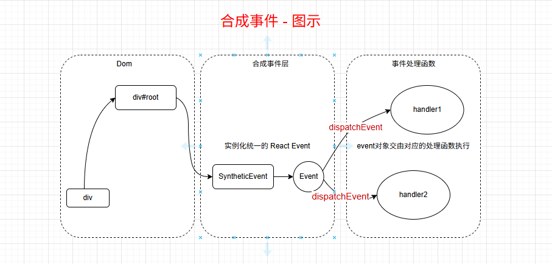

# React@17合成事件原理

## 一、React合成事件过程图解



## 二、事件监听

在 [React渲染原理]() 中创建 FiberRootNode 过程中会执行以下中的代码

```javascript
/**
 * 参数
 * container 为 div#root 根节点
 * tag 
 * options 
 */
function createRootImpl(container, tag) {
  // 如果根节点 nodeType 的类型为 COMMENT_NODE(8) 取其父节点，否则取 container 本身
  var rootContainerElement = container.nodeType === COMMENT_NODE ? container.parentNode : container;
	// 对 div#root 进行监听
	listenToAllSupportedEvents(rootContainerElement);
}
```

listenToAllSupportedEvents 函数会针对 allNativeEvents 穷举的事件进行一个一个监听，分析如下

```javascript
function listenToAllSupportedEvents(rootContainerElement) {
   // 判断是否已经监听过程，给一个标志，若为 true 则表示对 root 已经监听过了
   if (rootContainerElement[listeningMarker]) {
      return;
   }
  
	 // 设置为 true
   rootContainerElement[listeningMarker] = true;
  	
   // 遍历 allNativeEvents 对 div#root 进行监听
   allNativeEvents.forEach(function (domEventName) {
     // 浏览中并非所有的事件都具有捕获和冒泡过程
     if (!nonDelegatedEvents.has(domEventName)) {
       listenToNativeEvent(domEventName, false, rootContainerElement, null);
     }

     listenToNativeEvent(domEventName, true, rootContainerElement, null);
   });
}
```

### 2.1、allNativeEvents穷举事件

其中的 allNativeEvents 就是 react合成事件中穷举浏览器事件的名称，分析如下

```javascript
var allNativeEvents = new Set();

// 然后会执行相关函数给 allNativeEvents 进行赋值
registerSimpleEvents();
registerEvents$2();
registerEvents$1();
registerEvents$3();
registerEvents();
```

registerSimpleEvents 的函数内部执行过程如下

```javascript
function registerSimpleEvents() {
  registerSimplePluginEventsAndSetTheirPriorities(discreteEventPairsForSimpleEventPlugin, DiscreteEvent); // DiscreteEvent 为 0
  registerSimplePluginEventsAndSetTheirPriorities(userBlockingPairsForSimpleEventPlugin, UserBlockingEvent); // UserBlockingEvent 为 1
  registerSimplePluginEventsAndSetTheirPriorities(continuousPairsForSimpleEventPlugin, ContinuousEvent); // ContinuousEvent 为 2
  
  setEventPriorities(otherDiscreteEvents, DiscreteEvent); // DiscreteEvent 为 0
}
```

其中的 discreteEventPairsForSimpleEventPlugin、userBlockingPairsForSimpleEventPlugin、continuousPairsForSimpleEventPlugin、otherDiscreteEvents 的定义如下

```javascript
// 其中 discreteEventPairsForSimpleEventPlugin
var discreteEventPairsForSimpleEventPlugin = ['cancel', 'cancel', 'click', 'click', 'close', 'close', 'contextmenu', 'contextMenu', 'copy', 'copy', 'cut', 'cut', 'auxclick', 'auxClick', 'dblclick', 'doubleClick', // Careful!
'dragend', 'dragEnd', 'dragstart', 'dragStart', 'drop', 'drop', 'focusin', 'focus', // Careful!
'focusout', 'blur', // Careful!
'input', 'input', 'invalid', 'invalid', 'keydown', 'keyDown', 'keypress', 'keyPress', 'keyup', 'keyUp', 'mousedown', 'mouseDown', 'mouseup', 'mouseUp', 'paste', 'paste', 'pause', 'pause', 'play', 'play', 'pointercancel', 'pointerCancel', 'pointerdown', 'pointerDown', 'pointerup', 'pointerUp', 'ratechange', 'rateChange', 'reset', 'reset', 'seeked', 'seeked', 'submit', 'submit', 'touchcancel', 'touchCancel', 'touchend', 'touchEnd', 'touchstart', 'touchStart', 'volumechange', 'volumeChange'];


// userBlockingPairsForSimpleEventPlugin
var userBlockingPairsForSimpleEventPlugin = ['drag', 'drag', 'dragenter', 'dragEnter', 'dragexit', 'dragExit', 'dragleave', 'dragLeave', 'dragover', 'dragOver', 'mousemove', 'mouseMove', 'mouseout', 'mouseOut', 'mouseover', 'mouseOver', 'pointermove', 'pointerMove', 'pointerout', 'pointerOut', 'pointerover', 'pointerOver', 'scroll', 'scroll', 'toggle', 'toggle', 'touchmove', 'touchMove', 'wheel', 'wheel']; 

// continuousPairsForSimpleEventPlugin
var continuousPairsForSimpleEventPlugin = ['abort', 'abort', ANIMATION_END, 'animationEnd', ANIMATION_ITERATION, 'animationIteration', ANIMATION_START, 'animationStart', 'canplay', 'canPlay', 'canplaythrough', 'canPlayThrough', 'durationchange', 'durationChange', 'emptied', 'emptied', 'encrypted', 'encrypted', 'ended', 'ended', 'error', 'error', 'gotpointercapture', 'gotPointerCapture', 'load', 'load', 'loadeddata', 'loadedData', 'loadedmetadata', 'loadedMetadata', 'loadstart', 'loadStart', 'lostpointercapture', 'lostPointerCapture', 'playing', 'playing', 'progress', 'progress', 'seeking', 'seeking', 'stalled', 'stalled', 'suspend', 'suspend', 'timeupdate', 'timeUpdate', TRANSITION_END, 'transitionEnd', 'waiting', 'waiting'];
```

其中的 ANIMATION_END、ANIMATION_ITERATION、ANIMATION_START、TRANSITION_END 会单独处理，处理浏览器之间的兼容使用，统一用法

```javascript
var ANIMATION_END = getVendorPrefixedEventName('animationend');
var ANIMATION_ITERATION = getVendorPrefixedEventName('animationiteration');
var ANIMATION_START = getVendorPrefixedEventName('animationstart');
var TRANSITION_END = getVendorPrefixedEventName('transitionend');

var prefixedEventNames = {};

function getVendorPrefixedEventName(eventName) {
  // 如果 prefixedEventNames 中存在就返回
  if (prefixedEventNames[eventName]) {
    return prefixedEventNames[eventName];
  } else if (!vendorPrefixes[eventName]) {
    return eventName;
  }
	
  // 取出对应事件，例如： { animation: "animationend", WebkitAnimation: "webkitAnimationEnd", MozAnimation: "mozAnimationEnd" }
  var prefixMap = vendorPrefixes[eventName];

  for (var styleProp in prefixMap) {
    // 其中的 style 是获取到的全局 style 相关属性
    if (prefixMap.hasOwnProperty(styleProp) && styleProp in style) {
      return prefixedEventNames[eventName] = prefixMap[styleProp];
    }
  }
  return eventName;
}

var vendorPrefixes = {
  animationend: makePrefixMap('Animation', 'AnimationEnd'),
  animationiteration: makePrefixMap('Animation', 'AnimationIteration'),
  animationstart: makePrefixMap('Animation', 'AnimationStart'),
  transitionend: makePrefixMap('Transition', 'TransitionEnd')
};

// 核心处理兼容浏览器用法如下
function makePrefixMap(styleProp, eventName) {
  var prefixes = {}; // { animation: "animationend", WebkitAnimation: "webkitAnimationEnd", MozAnimation: "mozAnimationEnd" }
  prefixes[styleProp.toLowerCase()] = eventName.toLowerCase();
  prefixes['Webkit' + styleProp] = 'webkit' + eventName;
  prefixes['Moz' + styleProp] = 'moz' + eventName;
  // 返回的数据结构  { animation: "animationend", WebkitAnimation: "webkitAnimationEnd", MozAnimation: "mozAnimationEnd" }
  return prefixes;
}
```

在穷举完浏览器的相关事件之后，如何作为参数执行 registerSimplePluginEventsAndSetTheirPriorities 参数，函数执行过程分析如下

```javascript
// 示例结构 new Map([['cancel', '0']]); 
var eventPriorities = new Map();

// 示例结构 new Map([['abort', 'onAbort']]); 结构
var topLevelEventsToReactNames = new Map();

/**
 * eventTypes 为事件列表
 * priority 为事件等级
 */
function registerSimplePluginEventsAndSetTheirPriorities(eventTypes, priority) {
  for (var i = 0; i < eventTypes.length; i += 2) {
    // 取出的事件 topEvent 和 event 是作为一对出现的，例如：'keypress', 'keyPress', 'keyup', 'keyUp',
    var topEvent = eventTypes[i]; // 例如：keypress
    var event = eventTypes[i + 1]; // 例如：keyPress
    // 将 event 的首字母大写
    var capitalizedEvent = event[0].toUpperCase() + event.slice(1);
    // 组装合成 react 的事件名称，例如：onKeyPress
    var reactName = 'on' + capitalizedEvent; 
    // 为 topEvent 做事件映射，并设置 priority 等级
    eventPriorities.set(topEvent, priority);
    
    // 将原生的 dom 事件和 react合成事件做出映射
    topLevelEventsToReactNames.set(topEvent, reactName);
    
    // 执行
    registerTwoPhaseEvent(reactName, [topEvent]);
  }
}

/**
 * 参数：
 * registrationName 为 react 的事件，例如：onClick，onKeyPress
 * dependencies 为原生事件，例如：['click', 'cancel']
 */
function registerTwoPhaseEvent(registrationName 为 react 的事件，例如：On, dependencies) {
  registerDirectEvent(registrationName, dependencies);
  registerDirectEvent(registrationName + 'Capture', dependencies);
}
```

registerDirectEvent 函数执行过程分析如下

```javascript
// 示例结构： {  onCancel:  ['cancel'], onCancelCapture: ['cancel'] }
var registrationNameDependencies = {};
// 示例结构：{ oncancel: "onCancel" }
var possibleRegistrationNames =  {}; 

/**
 * 参数：
 * registrationName 为 react 的事件，例如：onClick，onKeyPress
 * dependencies 为原生事件，例如：['click', 'cancel']
 */
function registerDirectEvent(registrationName, dependencies) {
  // 判断是否重复
  {
    if (registrationNameDependencies[registrationName]) {
      error('EventRegistry: More than one plugin attempted to publish the same ' + 'registration name, `%s`.', registrationName);
    }
  }
	
  // 存储到 registrationNameDependencies
  registrationNameDependencies[registrationName] = dependencies;

  {
    // 将 react的事件转换成小写
    var lowerCasedName = registrationName.toLowerCase();
    // 存储到 possibleRegistrationNames
    possibleRegistrationNames[lowerCasedName] = registrationName;
		
    // 特殊处理 onDoubleClick 事件
    if (registrationName === 'onDoubleClick') {
      possibleRegistrationNames.ondblclick = registrationName;
    }
  }
	
  // allNativeEvents 进行添加
  for (var i = 0; i < dependencies.length; i++) {
    allNativeEvents.add(dependencies[i]);
  }
}
```

在陆续执行完 registerSimplePluginEventsAndSetTheirPriorities 函数之后，后面还会执行 setEventPriorities 函数，该函数执行过程分析如下

```javascript
// otherDiscreteEvents
var otherDiscreteEvents = ['change', 'selectionchange', 'textInput', 'compositionstart', 'compositionend', 'compositionupdate'];

setEventPriorities(otherDiscreteEvents, DiscreteEvent); // DiscreteEvent = 0

// priority 为 0
function setEventPriorities(eventTypes, priority) {
  for (var i = 0; i < eventTypes.length; i++) {
    eventPriorities.set(eventTypes[i], priority);
  }
}
```

在 registerSimpleEvents 函数执行完，也就是执行完 registerSimplePluginEventsAndSetTheirPriorities 函数和 setEventPriorities 函数，如何执行以下函数

```javascript
registerEvents$2();
registerEvents$1();
registerEvents$3();
registerEvents();

// 对 鼠标事件 的合并
function registerEvents$2() {
  registerDirectEvent('onMouseEnter', ['mouseout', 'mouseover']);
  registerDirectEvent('onMouseLeave', ['mouseout', 'mouseover']);
  registerDirectEvent('onPointerEnter', ['pointerout', 'pointerover']);
  registerDirectEvent('onPointerLeave', ['pointerout', 'pointerover']);
}

// 对 change 事件相关合并
function registerEvents$1() {
  registerTwoPhaseEvent('onChange', ['change', 'click', 'focusin', 'focusout', 'input', 'keydown', 'keyup', 'selectionchange']);
}

// 对 选择相关 事件合并
function registerEvents$3() {
  registerTwoPhaseEvent('onSelect', ['focusout', 'contextmenu', 'dragend', 'focusin', 'keydown', 'keyup', 'mousedown', 'mouseup', 'selectionchange']);
}

// 对 输入事件 进行合并
function registerEvents() {
  registerTwoPhaseEvent('onBeforeInput', ['compositionend', 'keypress', 'textInput', 'paste']);
  registerTwoPhaseEvent('onCompositionEnd', ['compositionend', 'focusout', 'keydown', 'keypress', 'keyup', 'mousedown']);
  registerTwoPhaseEvent('onCompositionStart', ['compositionstart', 'focusout', 'keydown', 'keypress', 'keyup', 'mousedown']);
  registerTwoPhaseEvent('onCompositionUpdate', ['compositionupdate', 'focusout', 'keydown', 'keypress', 'keyup', 'mousedown']);
} // Track whether we've ever handled a keypress on the space key.
```

### 2.2、对div#root进行监听

```javascript
var mediaEventTypes = ['abort', 'canplay', 'canplaythrough', 'durationchange', 'emptied', 'encrypted', 'ended', 'error', 'loadeddata', 'loadedmetadata', 'loadstart', 'pause', 'play', 'playing', 'progress', 'ratechange', 'seeked', 'seeking', 'stalled', 'suspend', 'timeupdate', 'volumechange', 'waiting'];

var nonDelegatedEvents = new Set(['cancel', 'close', 'invalid', 'load', 'scroll', 'toggle'].concat(mediaEventTypes));

// 对所有原生的事件监听都监听在 roo 元素中，浏览中并非所有的事件都具有捕获和冒泡过程
allNativeEvents.forEach(function (domEventName) {
	// 对不再 nonDelegatedEvents 的事件进行冒泡监听
  if (!nonDelegatedEvents.has(domEventName)) {
    listenToNativeEvent(domEventName, false, rootContainerElement, null);
  }
	// 在 nonDelegatedEvents 中的事件进行捕获监听
  listenToNativeEvent(domEventName, true, rootContainerElement, null);
});
```

listenToNativeEvent 函数执行如下

```javascript
function listenToNativeEvent(domEventName, isCapturePhaseListener, rootContainerElement) {
  var eventSystemFlags = 0; 
  var target = rootContainerElement;
  
  // 如果事件为 selectionchange 且 rootContainerElement.nodeType 不为 9，设置 target 为 document 对象
  // 也就是 selectionchange 事件挂载在 document 上
  if (domEventName === 'selectionchange' && rootContainerElement.nodeType !== DOCUMENT_NODE) {
    target = rootContainerElement.ownerDocument; // document 对象
  }
  
  // 对当前 target 的 node[internalEventHandlersKey] 设置 new Set() 数据
  var listenerSet = getEventListenerSet(target);
  
  // 生成监听事件的 key ，内部实现 domEventName + "__" + (capture ? 'capture' : 'bubble');
  var listenerSetKey = getListenerSetKey(domEventName, isCapturePhaseListener);
	
  // 如果 listenerSet 不包含 listenerSetKey 时执行
  if (!listenerSet.has(listenerSetKey)) {
    // 是否为捕获过程
    if (isCapturePhaseListener) {
      // IS_CAPTURE_PHASE 为 1 << 2
      eventSystemFlags |= IS_CAPTURE_PHASE; // eventSystemFlags 的表示， 冒泡用 0 表示，捕获用 4 表示
    }

    addTrappedEventListener(target, domEventName, eventSystemFlags, isCapturePhaseListener);
    
    // 添加 listenerSetKey
    listenerSet.add(listenerSetKey);
  }
}
```

addTrappedEventListener 函数执行分析如下

```javascript
function addTrappedEventListener(targetContainer, domEventName, eventSystemFlags, isCapturePhaseListener) {
  var listener = createEventListenerWrapperWithPriority(targetContainer, domEventName, eventSystemFlags); 
  	
  // 对应的浏览器的 passive 参数
  var isPassiveListener = undefined;
	
  // 全局变量，针对浏览器是否支持 passive 参数设置
  if (passiveBrowserEventsSupported) {
    if (domEventName === 'touchstart' || domEventName === 'touchmove' || domEventName === 'wheel') {
      // 对于以上的事件符合设置 isPassiveListener 为 true
      isPassiveListener = true;
    }
  }

  targetContainer =  targetContainer;
  var unsubscribeListener;

  // 是否为监听捕获阶段
  if (isCapturePhaseListener) {
    if (isPassiveListener !== undefined) {
      unsubscribeListener = addEventCaptureListenerWithPassiveFlag(targetContainer, domEventName, listener, isPassiveListener);
    } else {
      unsubscribeListener = addEventCaptureListener(targetContainer, domEventName, listener);
    }
  } else { // 冒泡阶段
    if (isPassiveListener !== undefined) {
      unsubscribeListener = addEventBubbleListenerWithPassiveFlag(targetContainer, domEventName, listener, isPassiveListener);
    } else {
      unsubscribeListener = addEventBubbleListener(targetContainer, domEventName, listener);
    }
  }
}

// 添加冒泡阶段监听
function addEventBubbleListener(target, eventType, listener) {
  target.addEventListener(eventType, listener, false);
  return listener;
}

// 添加捕获阶段监听
function addEventCaptureListener(target, eventType, listener) {
  target.addEventListener(eventType, listener, true);
  return listener;
}

// 同上，只是添加 passive 参数
function addEventCaptureListenerWithPassiveFlag(target, eventType, listener, passive) {
  target.addEventListener(eventType, listener, {
    capture: true,
    passive: passive
  });
  return listener;
}

// 同上，只是添加 passive 参数
function addEventBubbleListenerWithPassiveFlag(target, eventType, listener, passive) {
  target.addEventListener(eventType, listener, {
    passive: passive
  });
  return listener;
}
```

createEventListenerWrapperWithPriority 函数获取事件等级，设置不同 listener 函数

```javascript
/**
 * 参数：
 * targetContainer 为 div#root
 * domEventName 为 原生事件名称
 * eventSystemFlags 为冒泡和捕获标识， 冒泡用 0 表示，捕获用 4 表示
 */
function createEventListenerWrapperWithPriority(targetContainer, domEventName, eventSystemFlags) {
  var eventPriority = getEventPriorityForPluginSystem(domEventName);
  var listenerWrapper;
	
  // 根据不同的事件等级 eventPriority 设置不同处理函数
  switch (eventPriority) {
    case DiscreteEvent:
      listenerWrapper = dispatchDiscreteEvent;
      break;

    case UserBlockingEvent:
      listenerWrapper = dispatchUserBlockingUpdate;
      break;

    case ContinuousEvent:
    default:
      listenerWrapper = dispatchEvent;
      break;
  }

  return listenerWrapper.bind(null, domEventName, eventSystemFlags, targetContainer);
}

// 获取事件的等级
function getEventPriorityForPluginSystem(domEventName) {
  var priority = eventPriorities.get(domEventName);
  return priority === undefined ? ContinuousEvent : priority;
}
```


以上就是对 div#root 进行监听的完成。以点击事件为例，点击 DOM 文档中的任意一个 dom 时，利用冒泡原理一直到 div#root 元素中。然后就会执行对应处理函数，对事件对象进行 React 合成事件进行后续执行。

## 三、事件派发

以其中 ContinuousEvent 级别的 dispatchEvent 为例，研究事件执行过程。

```javascript
/**
 * domEventName 为原生事件名称
 * eventSystemFlags 冒泡和捕获标识
 * targetContainer 为 div#root
 * nativeEvent 为获取到的原生事件对象
 */
function dispatchEvent(domEventName, eventSystemFlags, targetContainer, nativeEvent) {
  // 依据得到的原生对象获取 Dom 元素
  const nativeEventTarget = getEventTarget(nativeEvent);
  
  // 根据获得的 Dom 元素获取对应创建 FiberNode
  const targetInst = getClosesInstanceFromNode(nativeEventTarget);
  
  // 派发事件
  dispatchEventForPluginEventSystem(domEventName, eventSystemFlags, nativeEvent, targetInst, targetContainer);
}

// 依据得到的原生对象获取 原生Dom
function getEventTarget(nativeEvent) {
  var target = nativeEvent.target || nativeEvent.srcElement || window; 
  return target.nodeType === TEXT_NODE ? target.parentNode : target;
}

// 根据获得的 Dom 元素获取对应创建 FiberNode
function getClosestInstanceFromNode(targetNode) {
  var targetInst = targetNode[internalInstanceKey];
 return targetInst;
}
```

getClosestInstanceFromNode 函数通过 Dom 元素获取对应创建 FiberNode，这主要是在创建 Dom 就会将当前的 FiberNode 节点作为一个 Dom 属性进行存储，具体如下

```javascript
function createInstance(type, props, rootContainerInstance, hostContext, internalInstanceHandle) {
  var parentNamespace;

  var domElement = createElement(type, props, rootContainerInstance, parentNamespace);
  precacheFiberNode(internalInstanceHandle, domElement);
  updateFiberProps(domElement, props);
  return domElement;
}

function precacheFiberNode(hostInst, node) {
  node[internalInstanceKey] = hostInst;
}

function updateFiberProps(node, props) {
  node[internalPropsKey] = props;
}
```

示例如下图所示


然后再执行 dispatchEventForPluginEventSystem  函数，内部会转发到执行 dispatchEventsForPlugins 函数

```javascript
/**
 * domEventName 为原生事件名称
 * eventSystemFlags 冒泡和捕获标识
 * targetContainer 为 div#root
 * nativeEvent 为获取到的原生事件对象
 * targetInst 为 获取到的 target 元素对应的 FiberNode
 */
function dispatchEventForPluginEventSystem(domEventName, eventSystemFlags, nativeEvent, targetInst, targetContainer) {
  dispatchEventsForPlugins(domEventName, eventSystemFlags, nativeEvent, targetInst, targetContainer);
}

function dispatchEventsForPlugins(domEventName, eventSystemFlags, nativeEvent, targetInst, targetContainer) {
  // 获取原生 Dom 对象
  var nativeEventTarget = getEventTarget(nativeEvent);
  // 需要派发的事件队列
  var dispatchQueue = [];
  extractEvents$5(dispatchQueue, domEventName, targetInst, nativeEvent, nativeEventTarget, eventSystemFlags);
  processDispatchQueue(dispatchQueue, eventSystemFlags);
}
```

### 3.1、extractEvents收集派发事件队列

其中 extractEvents$5 相关函数的执行为收集 dispatchQueue 需要派发的事件队列，执行分析如下

```javascript
function extractEvents$5(dispatchQueue, domEventName, targetInst, nativeEvent, nativeEventTarget, eventSystemFlags) {
  extractEvents$4(dispatchQueue, domEventName, targetInst, nativeEvent, nativeEventTarget, eventSystemFlags);
}

/**
 * dispatchQueue 派发事件队列
 * domEventName 为 原生事件名称  
 * targetInst 为 FiberNode
 * nativeEvent 为 原生事件对象
 * nativeEventTarget 为 原生 DOM 对象
 * eventSystemFlags 冒泡和捕获标识
 */
function extractEvents$4(dispatchQueue, domEventName, targetInst, nativeEvent, nativeEventTarget, eventSystemFlags) {
  // topLevelEventsToReactNames 为 new Map([['abort', 'onAbort']]); 结构，获取对应的 react合成事件名称
  var reactName = topLevelEventsToReactNames.get(domEventName);
  
  if (reactName === undefined) {
    return;
  }
	
  // SyntheticEvent 为构建 React 合成事件对象构造函数
  var SyntheticEventCtor = SyntheticEvent;
  var reactEventType = domEventName;
  
  // 依据 domEventName 事件类型，将 SyntheticEventCtor 赋值不同的 合成事件对象构造函数
  switch (domEventName) {
    case 'keypress':
      if (getEventCharCode(nativeEvent) === 0) {
        return;
      }

    case 'keydown':
    case 'keyup':
      SyntheticEventCtor = SyntheticKeyboardEvent;
      break;

    case 'focusin':
      reactEventType = 'focus';
      SyntheticEventCtor = SyntheticFocusEvent;
      break;

    case 'focusout':
      reactEventType = 'blur';
      SyntheticEventCtor = SyntheticFocusEvent;
      break;

    case 'beforeblur':
    case 'afterblur':
      SyntheticEventCtor = SyntheticFocusEvent;
      break;

    case 'click':
      if (nativeEvent.button === 2) {
        return;
      }

    case 'auxclick':
    case 'dblclick':
    case 'mousedown':
    case 'mousemove':
    case 'mouseup': 
    case 'mouseout':
    case 'mouseover':
    case 'contextmenu':
      SyntheticEventCtor = SyntheticMouseEvent;
      break;

    case 'drag':
    case 'dragend':
    case 'dragenter':
    case 'dragexit':
    case 'dragleave':
    case 'dragover':
    case 'dragstart':
    case 'drop':
      SyntheticEventCtor = SyntheticDragEvent;
      break;

    case 'touchcancel':
    case 'touchend':
    case 'touchmove':
    case 'touchstart':
      SyntheticEventCtor = SyntheticTouchEvent;
      break;

    case ANIMATION_END:
    case ANIMATION_ITERATION:
    case ANIMATION_START:
      SyntheticEventCtor = SyntheticAnimationEvent;
      break;

    case TRANSITION_END:
      SyntheticEventCtor = SyntheticTransitionEvent;
      break;

    case 'scroll':
      SyntheticEventCtor = SyntheticUIEvent;
      break;

    case 'wheel':
      SyntheticEventCtor = SyntheticWheelEvent;
      break;

    case 'copy':
    case 'cut':
    case 'paste':
      SyntheticEventCtor = SyntheticClipboardEvent;
      break;

    case 'gotpointercapture':
    case 'lostpointercapture':
    case 'pointercancel':
    case 'pointerdown':
    case 'pointermove':
    case 'pointerout':
    case 'pointerover':
    case 'pointerup':
      SyntheticEventCtor = SyntheticPointerEvent;
      break;
  }
  
  // 判断是否为捕获阶段，值为 布尔类型
  var inCapturePhase = (eventSystemFlags & IS_CAPTURE_PHASE) !== 0;
  
  // 如果为 非捕获 和 domEventName === 'scroll' 时，accumulateTargetOnly 为 true
  var accumulateTargetOnly = !inCapturePhase && domEventName === 'scroll';
  
  var _listeners = accumulateSinglePhaseListeners(targetInst, reactName, nativeEvent.type, inCapturePhase, accumulateTargetOnly);
  
  if (_listeners.length > 0) {
    	// 创建的合成事件
      var _event = new SyntheticEventCtor(reactName, reactEventType, null, nativeEvent, nativeEventTarget);
			// 对事件进行队列存储
      dispatchQueue.push({
        event: _event,
        listeners: _listeners
      });
    }
}

```

这其中的 SyntheticEvent 构造函数作用就是构建 React 的合成事件对象，其中最重要的核心就是调用的原生 stopPropagation 和 preventDefault 事件，函数执行过程如下

```javascript
var EventInterface = {
  eventPhase: 0,
  bubbles: 0,
  cancelable: 0,
  timeStamp: function (event) {
    return event.timeStamp || Date.now();
  },
  defaultPrevented: 0,
  isTrusted: 0
};

var SyntheticEvent = createSyntheticEvent(EventInterface);

function createSyntheticEvent(Interface) {
  // SyntheticBaseEvent 构造函数
  function SyntheticBaseEvent(reactName, reactEventType, targetInst, nativeEvent, nativeEventTarget) {
    this._reactName = reactName;
    this._targetInst = targetInst;
    this.type = reactEventType;
    // 原生事件对象
    this.nativeEvent = nativeEvent;
    // 原生dom
    this.target = nativeEventTarget;
    this.currentTarget = null;

    for (var _propName in Interface) {
      if (!Interface.hasOwnProperty(_propName)) {
        continue;
      }

      var normalize = Interface[_propName];

      if (normalize) {
        this[_propName] = normalize(nativeEvent);
      } else {
        this[_propName] = nativeEvent[_propName];
      }
    }

    var defaultPrevented = nativeEvent.defaultPrevented != null ? nativeEvent.defaultPrevented : nativeEvent.returnValue === false;

    if (defaultPrevented) {
      this.isDefaultPrevented = functionThatReturnsTrue;
    } else {
      this.isDefaultPrevented = functionThatReturnsFalse;
    }

    this.isPropagationStopped = functionThatReturnsFalse;
    return this;
  }

  _assign(SyntheticBaseEvent.prototype, {
    // 给 React 的合成事件的对象添加 preventDefault 方法
    preventDefault: function () {
      this.defaultPrevented = true;
      var event = this.nativeEvent;

      if (!event) {
        return;
      }

      if (event.preventDefault) {
        // 内部还是调用的 原生事件对象的 preventDefault 方法
        event.preventDefault();
      } else if (typeof event.returnValue !== 'unknown') {
        // 或调用 return false
        event.returnValue = false;
      }

      this.isDefaultPrevented = functionThatReturnsTrue;
    },
    
    // 给 React 的合成事件的对象添加 stopPropagation 方法
    stopPropagation: function () {
      var event = this.nativeEvent;

      if (!event) {
        return;
      }

      if (event.stopPropagation) {
        // 内部还是调用的 原生事件对象的 stopPropagation 方法
        event.stopPropagation();
      } else if (typeof event.cancelBubble !== 'unknown') {
        event.cancelBubble = true;
      }

      this.isPropagationStopped = functionThatReturnsTrue;
    },

    persist: function () {
    },

    isPersistent: functionThatReturnsTrue
  });
	
  // 返回构造函数
  return SyntheticBaseEvent;
}
```

accumulateSinglePhaseListeners 函数作用其实就是根据当前的 FiberNode 通过 return 属性不断获取父节点的 FiberNode 对应的 reactName 事件放入 listeners 数组中，然后一个一个进行执行，从而实现的是 React 自身的冒泡机制

```javascript
function accumulateSinglePhaseListeners(targetFiber, reactName, nativeEventType, inCapturePhase, accumulateTargetOnly) {
  var captureName = reactName !== null ? reactName + 'Capture' : null;
   // 判断是 reactName 事件是否为捕获还是冒泡
  var reactEventName = inCapturePhase ? captureName : reactName;
  var listeners = [];
  var instance = targetFiber; // FiberNode

  var lastHostComponent = null;
  while (instance !== null) {
    // 将当 instance 给 _instance2
    var _instance2 = instance,
      // 获取当前 stateNode 和 tag
        stateNode = _instance2.stateNode, // stateNode 为真实节点
        tag = _instance2.tag;

    // HostComponent 为 5 代表是 原生 DOM 元素
    if (tag === HostComponent && stateNode !== null) {
      lastHostComponent = stateNode;
      
      if (reactEventName !== null) {
        // 根据 reactEventName 事件从 instance 中获取
        var listener = getListener(instance, reactEventName);

        if (listener != null) {
          // instance 为 FiberNode
          // 返回的是 { instance: instance, listener: listener, currentTarget: currentTarget }
          listeners.push(createDispatchListener(instance, listener, lastHostComponent));
        }
      }
    } 

    // 对于 scroll 事件且 为非捕获节点
    if (accumulateTargetOnly) {
      break;
    }
		// 获取上一个 FiberNode
    instance = instance.return;
  }

  return listeners;
} 

// 根据 reactEventName 事件从 instance 中获取
function getListener(inst, registrationName) {
  var stateNode = inst.stateNode; // 获取当前 fiber 的实际节点

  if (stateNode === null) {
    return null;
  }

  // 获取当前实际节点的属性
  var props = getFiberCurrentPropsFromNode(stateNode);

  if (props === null) {
    return null;
  }

  // 获取当前对应的事件 listener
  var listener = props[registrationName];

  // 对于部分属性中 disabled 属性禁用时，不触发事件
  if (shouldPreventMouseEvent(registrationName, inst.type, props)) {
    return null;
  }

  if (!(!listener || typeof listener === 'function')) {
    {
      throw Error( "Expected `" + registrationName + "` listener to be a function, instead got a value of `" + typeof listener + "` type." );
    }
  }

  // 返回 listener
  return listener;
}
```

在执行完 accumulateSinglePhaseListeners  和 new SyntheticEvent  之后也就是 React 合成事件对象创建完成以及对应执行的冒泡事件执行队列收集完成之后。然后再在执行 processDispatchQueue

### 3.2、processDispatchQueue执行派发函数

```javascript
function processDispatchQueue(dispatchQueue, eventSystemFlags) {
  // 是否为捕获阶段
  var inCapturePhase = (eventSystemFlags & IS_CAPTURE_PHASE) !== 0;
	
  // 循环 dispatchQueue 函数
  for (var i = 0; i < dispatchQueue.length; i++) {
    var _dispatchQueue$i = dispatchQueue[i],
        // 获取 React 的合成事件
        event = _dispatchQueue$i.event,
        // 获取 listener 列表
        listeners = _dispatchQueue$i.listeners;
    processDispatchQueueItemsInOrder(event, listeners, inCapturePhase); 
  }
}
```

processDispatchQueueItemsInOrder 函数执行分析如下

```javascript
/**
 * event：React 的合成事件对象
 * dispatchListeners 派发的事件
 * inCapturePhase 是否为 捕获阶段
 */
function processDispatchQueueItemsInOrder(event, dispatchListeners, inCapturePhase) {
  var previousInstance;
	
  // 如果为捕获阶段时
  if (inCapturePhase) {
    // 反向取出 dispatchListeners 的派发事件
    for (var i = dispatchListeners.length - 1; i >= 0; i--) {
      var _dispatchListeners$i = dispatchListeners[i],
          instance = _dispatchListeners$i.instance, // FiberNode
          currentTarget = _dispatchListeners$i.currentTarget, // 实际 Dom 元素
          listener = _dispatchListeners$i.listener; // 函数事件

      if (instance !== previousInstance && event.isPropagationStopped()) {
        return;
      }
	    // 执行派发事件
      executeDispatch(event, listener, currentTarget);
      previousInstance = instance;
    }
  } else {
    // 冒泡阶段，按数组顺序获取，
    for (var _i = 0; _i < dispatchListeners.length; _i++) {
      var _dispatchListeners$_i = dispatchListeners[_i],
          _instance = _dispatchListeners$_i.instance,
          _currentTarget = _dispatchListeners$_i.currentTarget,
          _listener = _dispatchListeners$_i.listener;

      if (_instance !== previousInstance && event.isPropagationStopped()) {
        return;
      }
      
			// 执行派发事件
      executeDispatch(event, _listener, _currentTarget);
      previousInstance = _instance;
    }
  }
}
```

executeDispatch 函数就是执行对应绑定的函数也就是 _listener
