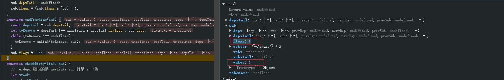

# Signal源码分析

## 一、文件执行过程分析

alien-signals 总共包含两个文件：signals.mjs 和 system.mjs

```javascript
// 在引用  signals.mjs 时会优先加载 system.mjs
export * from './system.mjs';
import { createReactiveSystem } from './system.mjs';
const pauseStack = [];
const queuedEffects = [];
```

在 system.mjs 主要做了两件事

```javascript
export var ReactiveFlags;

/**
 * 自执行函数
 * 生成 ReactiveFlags = { 0: 'None', 'None': 0 } 的形式数据，并导出
 */
(function (ReactiveFlags) {
  ReactiveFlags[(ReactiveFlags['None'] = 0)] = 'None';
  ReactiveFlags[(ReactiveFlags['Mutable'] = 1)] = 'Mutable';
  ReactiveFlags[(ReactiveFlags['Watching'] = 2)] = 'Watching';
  ReactiveFlags[(ReactiveFlags['RecursedCheck'] = 4)] = 'RecursedCheck';
  ReactiveFlags[(ReactiveFlags['Recursed'] = 8)] = 'Recursed';
  ReactiveFlags[(ReactiveFlags['Dirty'] = 16)] = 'Dirty';
  ReactiveFlags[(ReactiveFlags['Pending'] = 32)] = 'Pending';
})(ReactiveFlags || (ReactiveFlags = {}));

/**
 * 导出 createReactiveSystem 函数
 */
export function createReactiveSystem({ update, notify, unwatched }) {
   return {
    link,
    unlink,
    propagate,
    checkDirty,
    endTracking,
    startTracking,
    shallowPropagate,
  };
  
  function link(dep, sub) {
    
  }
  ...
}
```

同时在 signals.mjs 中会定义几个全局的变量

```javascript
export let batchDepth = 0;
let notifyIndex = 0;
let queuedEffectsLength = 0;
let activeSub;
let activeScope;
```

## 二、Signal

### 2.1、signal函数创建阶段

在 signals.mjs 中有 signalOper 函数，内容如下

```javascript
function signalOper(...value) {
  // 当传递新值时，...value 会成为 []，例如：count(2)
  if (value.length) {
    const newValue = value[0]; // 取出新设置的值
    if (this.value !== (this.value = newValue)) {
      this.flags = 17;
      const subs = this.subs;
      if (subs !== undefined) {
        propagate(subs);
        if (!batchDepth) {
          flush();
        }
      }
    }
  } else {
    // 如果没有参数，表示获取当前 value 值，例如：count()
    const value = this.value;
    if (this.flags & 16) {
      if (updateSignal(this, value)) {
        const subs = this.subs;
        if (subs !== undefined) {
          shallowPropagate(subs);
        }
      }
    }
    if (activeSub !== undefined) {
      link(this, activeSub);
    }
    return value;
  }
}
```

在调用 signal 函数时，实际就是基于 signalOper 重新生成一个函数并且指定 this 指向，如下

```javascript
const count = signal(1); // count 其实返回的 signalOper 生成的函数，this 指向一个对象

// signals.mjs 
// 改变的 this 指向 { previousValue, value, subs, subsTail, flags }
export function signal(initialValue) {
  return signalOper.bind({
    previousValue: initialValue,
    value: initialValue,
    subs: undefined,
    subsTail: undefined,
    flags: 1,
  });
}
```


### 2.2、获取Signal的value值

获到的 value 值过程中会执行 signalOper 函数的 else 语句中，也就是 count() 的调用获取

```javascript
// 如果没有参数，表示获取当前 value 值，例如：count()
const value = this.value;
if (this.flags & 16) { // this.flags 为 1，1 & 16 为 0 所以为 false 不执行
  if (updateSignal(this, value)) {
    const subs = this.subs;
    if (subs !== undefined) {
      shallowPropagate(subs);
    }
  }
}

// 此时的 activeSub 为 undefined 不执行
if (activeSub !== undefined) {
  link(this, activeSub);
}
return value;
```

### 2.3、更新Signal的value值

在更新时执行的是 signalOper 的 if 语句中的模块

```javascript
// 当传递新值时，...value 会成为 []，例如：count(2)
if (value.length) {
  const newValue = value[0]; // 取出新设置的值
  // 将新值赋值给 this.value 并比较旧value
  if (this.value !== (this.value = newValue)) {
    this.flags = 17; // 将 flags 设置为 17
    const subs = this.subs; // 取出 subs 依赖，当前没有
    if (subs !== undefined) {
      propagate(subs);
      if (!batchDepth) {
        flush();
      }
    }
  }
}
```

如何再次获取 Signal 的 value 值时和第一次获取值时不一样，第二次获取值时 flags 变成了 17


在 `this.flags & 16` 变成 `17 & 16` 为 16 会执行后续操作也就是 updateSignal(this, value)

```javascript
if (updateSignal(this, value)) { 
  // 此后不会操作，this.subs 为 undefined
  const subs = this.subs;
  if (subs !== undefined) {
    shallowPropagate(subs);
  }
}
```

```javascript
function updateSignal(s, value) {
  s.flags = 1; // 重新将 flags 设置为 1
  // 同时将 value 设置给 previousValue 
  return s.previousValue !== (s.previousValue = value);
}
```


## 三、effect执行过程和依赖收集

### 3.1、effect函数创建和执行过程分析

在 signals.mjs 会定义一个 effectOper 函数，如下

```javascript
function effectOper() {
  let dep = this.deps; // 展示不论 this 的指向是那个
  while (dep !== undefined) {
    dep = unlink(dep, this);
  }
  const sub = this.subs;
  if (sub !== undefined) {
    unlink(sub);
  }
  this.flags = 0;
}
```

当调用 effect 时实际就是  signals.mjs 的 effect 函数，如下

```javascript
export function setCurrentSub(sub) {
  const prevSub = activeSub;
  activeSub = sub;
  return prevSub;
}

export function effect(fn) {
  const e = {
    fn, // 将 fn 赋值给 e
    subs: undefined,
    subsTail: undefined,
    deps: undefined,
    depsTail: undefined,
    flags: 2,
  };
  // 当 activeSub 和 activeScope 存在时，执行 link 相关函数
  if (activeSub !== undefined) {
    link(e, activeSub);
  } else if (activeScope !== undefined) {
    link(e, activeScope);
  }
  const prev = setCurrentSub(e);
  try {
    e.fn(); // 执行一次 fn 函数
  } finally {
    // 执行完 fn 函数之后再将重新将 prev 设置 activeSub，就是重新设置为 undefined 的
    setCurrentSub(prev);
  }
  
  // 生成新函数并绑定 e 对象，但是返回函数是不经常使用的
  return effectOper.bind(e);
}
```

在执行到 `const prev = setCurrentSub(e)` 时，会将当前 e 对象设置给 activeSub，并且将第一次的获得的 activeSub 设置给 prevSub 并返回，第一次的 activeSub 就是 undefined。


然而再执行 `e.fn()` 时，其实也就是再执行以下代码

```javascript
() => {
  console.log(`Count is: ${count()}`);
}
```

这其中 `count() ` 再执行过程中，activeSub 是存在值的也就是 e 对象，会执行到以下其中的代码

```javascript
if (activeSub !== undefined) {
  link(this, activeSub); // 这里会执行
}
```

这其中的 link 函数就是 system.mjs 的通过 createReactiveSystem 函数执行后返回的，细节内容如下

```javascript
function link(dep, sub) {
    /**
     * dep 参数就是 { previousValue: initialValue, value: initialValue, subs: undefined, subsTail: undefined, flags: 1 }
     * sub 参数就是 e 对象：const e = { fn, subs: undefined, subsTail: undefined, deps: undefined, depsTail: undefined, flags: 2, };
     */
    const prevDep = sub.depsTail;
  	// 不执行
    if (prevDep !== undefined && prevDep.dep === dep) {
      return;
    }
    let nextDep = undefined;
    const recursedCheck = sub.flags & 4; // 2 & 4 为 0
  	// 为 0 不执行
    if (recursedCheck) {
      nextDep = prevDep !== undefined ? prevDep.nextDep : sub.deps;
      if (nextDep !== undefined && nextDep.dep === dep) {
        sub.depsTail = nextDep;
        return;
      }
    }
    const prevSub = dep.subsTail; // undefined
  	// prevSub 为 undefined 不执行，后续的 && 也是不执行
    if (prevSub !== undefined && prevSub.sub === sub && (!recursedCheck || isValidLink(prevSub, sub))) {
      return;
    }
  	
  	// newLink = sub.depsTail = dep.subsTail = { dep,sub,prevDep,nextDep,prevSub,nextSub: undefined  }
    const newLink =
      (sub.depsTail =
      dep.subsTail =
        {
          dep,
          sub,
          prevDep,
          nextDep,
          prevSub,
          nextSub: undefined,
        });
    if (nextDep !== undefined) {
      nextDep.prevDep = newLink;
    }
    if (prevDep !== undefined) {
      prevDep.nextDep = newLink; 
    } else {
      sub.deps = newLink; // 执行
    }
    if (prevSub !== undefined) {
      prevSub.nextSub = newLink;
    } else {
      dep.subs = newLink; // 执行
    }
  }
```

实际生成的 dep、sub、和 newlink 的之间的引用关系如下


所以 signal 创建数据就会收集到一个依赖，如下图


### 3.2、多个effect的依赖收集

当有多个 effect 中收集过程中的分析，例如

```javascript
import { signal, computed, effect } from './signals.mjs';

const count = signal(1); // count 其实就是一个函数，this 的指向是一个对象

effect(() => {
  console.log(`Count is: ${count()} 1111111`);
});

effect(() => {
  console.log(`Count is: ${count()} 2222222`);
});
```

当再第一次依赖收集完成之后，例如 3.1 节过程中的收集，然后再第二次收集过程中，会创建的是一个新的 e 对象，并且对应的 Signal 数据对象会发生变化。


也依然是通过全局 activeSub 指针进行传递，在后续执行 link 函数时分析如下

```javascript
  function link(dep, sub) {
    const prevDep = sub.depsTail; // prevDep 为 undefined
    // 不执行
    if (prevDep !== undefined && prevDep.dep === dep) {
      return;
    }
    let nextDep = undefined;
    const recursedCheck = sub.flags & 4;
    // recursedCheck 为 0 不执行
    if (recursedCheck) {
      nextDep = prevDep !== undefined ? prevDep.nextDep : sub.deps;
      if (nextDep !== undefined && nextDep.dep === dep) {
        sub.depsTail = nextDep;
        return;
      }
    }
    // prevSub 为上一次创建的 newLink
    const prevSub = dep.subsTail;
    if (prevSub !== undefined && prevSub.sub === sub && (!recursedCheck || isValidLink(prevSub, sub))) {
      return;
    }

    // 新创建的 newLink 覆盖掉 sub.depsTail、dep.subsTail，并且将 prevSub 上一次的 newLink 给到新 newLink.prevSub 属性
    const newLink =
      (sub.depsTail =
      dep.subsTail =
        {
          dep,
          sub, // 当前的 sub
          prevDep,
          nextDep,
          prevSub, // 将上次的 newLink 给的到 prevSub
          nextSub: undefined,
        });

    // 不执行
    if (nextDep !== undefined) {
      nextDep.prevDep = newLink;
    }

    if (prevDep !== undefined) {
      prevDep.nextDep = newLink;
    } else {
      sub.deps = newLink; // 执行
    }
    if (prevSub !== undefined) {
      prevSub.nextSub = newLink; // 将上一次 nextSub 指向当前生成的 newLink
    } else {
      dep.subs = newLink; // 不执行
    }
  }
```

此时内部相互关联的内存引用如下


### 3.3、当重新赋值Signal值时收集的依赖如何执行

当 effect 的相关依赖收集完成之后，Signal 更新值时执行分析，示例代码如下

```javascript
const count = signal(1); // count 其实就是一个函数，this 的指向是一个对象

effect(() => {
  console.log(`Count is: ${count()} 1111111`);
});

effect(() => {
  console.log(`Count is: ${count()} 2222222`);
});

console.log(count());

debugger;
count(2); // 更新值
```

会执行到 signalOper  的 if 语句中

```javascript
if (value.length) {
  const newValue = value[0]; // 取出新值
  // 将新值赋值给 this.value 并比较旧value
  if (this.value !== (this.value = newValue)) {
    this.flags = 17; // 将 flags 设置为 17
    const subs = this.subs; // 取出 subs 依赖
    if (subs !== undefined) {
      propagate(subs); // 执行 propagate(subs);
      if (!batchDepth) {
        flush();
      }
    }
  }
}
```

该过程会取出 subs 依赖，其实 subs 依赖按照上述的内存引用图分析就是 newLink ，并且将当前 newLink 传递给 propagate 函数，propagate 函数分析如下

```javascript
function propagate(link) {
  // 取出 下一次 effect 的 nextSub
  let next = link.nextSub;
  let stack;
  top: do {
    const sub = link.sub; // 取出 sub 依赖也就是 e 对象
    let flags = sub.flags; // e 对象的 flag 为 2
    // 2 & 3 为 2，为 true 执行
    if (flags & 3) {
      // 2 & 60 为 0，true 执行
      if (!(flags & 60)) {
        sub.flags = flags | 32; // flags 被设置 2 | 32 = 34
      } else if (!(flags & 12)) {
        flags = 0;
      } else if (!(flags & 4)) {
        sub.flags = (flags & ~8) | 32;
      } else if (!(flags & 48) && isValidLink(link, sub)) {
        sub.flags = flags | 40;
        flags &= 1;
      } else {
        flags = 0;
      }
      // flags = 2 & 2 为 2，true 执行
      if (flags & 2) {
        notify(sub);
      }

      // flags = 2 & 1 为 0，false 不执行
      if (flags & 1) {
        const subSubs = sub.subs;
        if (subSubs !== undefined) {
          link = subSubs;
          if (subSubs.nextSub !== undefined) {
            stack = { value: next, prev: stack };
            next = link.nextSub;
          }
          continue;
        }
      }
    }
    // 将 next 赋值给 link 并且 不为 undefined 的
    if ((link = next) !== undefined) {
      next = link.nextSub;
      continue; // 重新执行 do 语句循环，回到头部
    }
    // stack 始终都是 undefined 不执行
    while (stack !== undefined) {
      link = stack.value;
      stack = stack.prev;
      if (link !== undefined) {
        next = link.nextSub;
        continue top;
      }
    }
    // link 为 undefined 时跳出循环
    break;
  } while (true);
}
```

这其中会执行到 notify 函数，notify 函数如下

```javascript
function notify(e) {
  const flags = e.flags;
  // flags = 34 & 64 = 0 取反为 true 执行
  if (!(flags & 64)) {
    e.flags = flags | 64; // flags 被设置为 34 | 64 = 98
    const subs = e.subs; // 为 undefined 不执行
    if (subs !== undefined) {
      notify(subs.sub);
    } else {
      queuedEffects[queuedEffectsLength++] = e; // 对 queuedEffects 数组进行添加 e 对象
    }
  }
}
```

然后再回到 signalOper 函数，执行完 propagate 就会执行 flush 函数

```javascript
if (subs !== undefined) {
  propagate(subs); // 执行完
  // 此时 batchDepth 为 0，执行
  if (!batchDepth) {
    flush();
  }
}
```

flush 函数内容解析如下

```java
function flush() {
  while (notifyIndex < queuedEffectsLength) { // 遍历收集的 queuedEffectsLength 
    const effect = queuedEffects[notifyIndex]; // 取出 e 对象
    queuedEffects[notifyIndex++] = undefined; // 先进行 queuedEffects[notifyIndex] 设置 undefined，然后再进行 notifyIndex++
    // 传递 e 对象，以及执行 effect.flags = 98 & ~64 = 34
    run(effect, (effect.flags &= ~64)); // 执行 run 方法
  }
  // 重置 notifyIndex、queuedEffectsLength
  notifyIndex = 0;
  queuedEffectsLength = 0;
}
```

run 函数内部执行时会有 checkDirty 函数先执行

```javascript
function run(e, flags) {
  // flags 为 34
  // 34 & 16 为 0，然后执行 34 & 32 为 32 后续执行 checkDirty 函数
  if (flags & 16 || (flags & 32 && checkDirty(e.deps, e))) {
    ...
  }
}
```

checkDirty 函数解析内容如下

```javascript
function checkDirty(link, sub) { //  e.deps 指向的是 newLink，sub 就是 e 对象
    let stack;
    let checkDepth = 0;
    top: do {
      const dep = link.dep; // dep 为 Signal 绑定的 this 对象
      const depFlags = dep.flags;
      let dirty = false;
      // 34 & 16 = 0
      if (sub.flags & 16) {
        dirty = true;
       // 17 & 17 = 17，为 true
      } else if ((depFlags & 17) === 17) {
        if (update(dep)) {
          const subs = dep.subs;
          if (subs.nextSub !== undefined) {
            shallowPropagate(subs);
          }
          dirty = true;
        }
      } else if ((depFlags & 33) === 33) {
        if (link.nextSub !== undefined || link.prevSub !== undefined) {
          stack = { value: link, prev: stack };
        }
        link = dep.deps;
        sub = dep;
        ++checkDepth;
        continue;
      }
      // 省略了一部分
      // 返回 dirty
      return dirty;
    } while (true);
  }
```

中间会执行 update 函数，update 函数解析如下

```javascript
update(signal) {
  if ('getter' in signal) {
    return updateComputed(signal);
  } else {
    // 执行当前语句
    return updateSignal(signal, signal.value);
  }
},
  
  
function updateSignal(s, value) {
  s.flags = 1;
  return s.previousValue !== (s.previousValue = value);
}
```

当执行 update 函数，获取到的 subs.nextSub 不为空，因此会执行 shallowPropagate 函数，shallowPropagate 函数内容解析如下

```javascript
function shallowPropagate(link) {
  do {
    const sub = link.sub; // 取出当前的 e 对象
    const nextSub = link.nextSub; // 取出下一个的 newLink
    const subFlags = sub.flags; // 34
    // 34 & 48 = 32，执行
    if ((subFlags & 48) === 32) {
      // 将 flags 设置 subFlags | 16 = 50
      sub.flags = subFlags | 16;
      // 34 & 2 = 2 执行
      if (subFlags & 2) {
        // 然后执行 notify 函数
        notify(sub);
      }
    }
    // 然后将下一个 newLink 赋值给 link
    link = nextSub;
    // 结束条件 link 为 undefined
  } while (link !== undefined);
}
```

notify 的执行过程如下

```javascript
function notify(e) {
  const flags = e.flags;
  // flags = 50 & 64 = 0 取反为 true 执行
  if (!(flags & 64)) {
    e.flags = flags | 64; // flags 被设置为 50 | 64 = 114
    const subs = e.subs; // 为 undefined 不执行
    if (subs !== undefined) {
      notify(subs.sub);
    } else {
      // 会再次添加 e 对象，只不过 flags 发生变化
      queuedEffects[queuedEffectsLength++] = e; // 对 queuedEffects 数组进行添加 e 对象
    }
  }
}
```

queuedEffects 生成的内容如下


然后再执行后续的 run 函数，只不过 run 函数中 e 经过 checkDirty 函数执行之后 flags 变为 114


当执行到 startTracking 函数时，startTracking 函数解析如下

```javascript
function startTracking(sub) {
  sub.depsTail = undefined; // 实际就是取消 depsTail 对 newLink 引用
  sub.flags = (sub.flags & ~56) | 4; // 114 & ~56 | 4 = 70
}
```


当执行 e.fn 函数时，内部执行顺序又发生变化

```javascript
 // 如果没有参数，表示获取当前 value 值，例如：count()
const value = this.value;
if (this.flags & 16) { // 1 & 16 为 false
  if (updateSignal(this, value)) {
    const subs = this.subs;
    if (subs !== undefined) {
      shallowPropagate(subs);
    }
  }
}
if (activeSub !== undefined) {
  link(this, activeSub); // 会执行
}
return value;
```


```javascript
function link(dep, sub) {
  const prevDep = sub.depsTail; // prevDep 为 undefined
  // 不执行
  if (prevDep !== undefined && prevDep.dep === dep) {
    return;
  }
  let nextDep = undefined;
  const recursedCheck = sub.flags & 4;
  // 70 & 4 = 4 执行
  if (recursedCheck) {
    // nextDep 取自 sub.deps
    nextDep = prevDep !== undefined ? prevDep.nextDep : sub.deps;
    if (nextDep !== undefined && nextDep.dep === dep) {
      sub.depsTail = nextDep; // 重新将 nextDep 赋值给 sub.depsTail
      return;
    }
  }
}
```

当 e.fn 执行完成之后就会执行的 endTracking 函数，endTracking 函数解析如下

```javascript
function endTracking(sub) {
  const depsTail = sub.depsTail;
  let toRemove = depsTail !== undefined ? depsTail.nextDep : sub.deps; // 取 depsTail.nextDep 为 undefined 
  // 不执行
  while (toRemove !== undefined) {
    toRemove = unlink(toRemove, sub);
  }
  sub.flags &= ~4; // sub.flags 变为 66
}
```

部分 run 函数执行过程如下

```javascript
function run(e, flags) {
  // flags 为 34
  // 34 & 16 为 0，然后执行 34 & 32 为 32 后续执行 checkDirty 函数
  if (flags & 16 || (flags & 32 && checkDirty(e.deps, e))) {
    // 经过 checkDirty 函数 e.flags = 114
    // 设置当 activeSub
    debugger;
    const prev = setCurrentSub(e);
    startTracking(e);
    try {
      e.fn(); // 执行 e 的 fn 函数
    } finally {
      // 重置 activeSub 为 undefined
      setCurrentSub(prev);
      endTracking(e);
    }
    // 进行 return 后续不再执行
    return;
  }
}
```

在 run 函数完成之后也就是回到 flush 函数

```javascript
function flush() {
  while (notifyIndex < queuedEffectsLength) {
    const effect = queuedEffects[notifyIndex];
    queuedEffects[notifyIndex++] = undefined;
    run(effect, (effect.flags &= ~64));
  }
  // 重置 notifyIndex 和 queuedEffectsLength 值
  notifyIndex = 0;
  queuedEffectsLength = 0;
}
```

## 四、computed执行过程和依赖收集分析

更改后的示例代码如下

```javascript
import { signal, computed, effect } from './signals.mjs';

const count = signal(1); // count 其实就是一个函数，this 的指向是一个对象

// 添加 computed 函数
const doubleCount = computed(() => count() * 2);

console.log(count());
console.log(doubleCount());

count(2);

console.log(count()); // 第二次获取
console.log(doubleCount());
```

### 4.1、computed函数创建

在 signals.mjs 文件中 computed 函数内容如下

```javascript
export function computed(getter) {
  return computedOper.bind({
    value: undefined,
    subs: undefined,
    subsTail: undefined,
    deps: undefined,
    depsTail: undefined,
    flags: 17,
    getter: getter,
  });
}
```

computed 的 getter 其实就是传递过来的一个函数，其中的 computedOper 函数如下

```javascript
function computedOper() {
  const flags = this.flags;
  if (flags & 16 || (flags & 32 && checkDirty(this.deps, this))) {
    if (updateComputed(this)) {
      const subs = this.subs;
      if (subs !== undefined) {
        shallowPropagate(subs);
      }
    }
  } else if (flags & 32) {
    this.flags = flags & ~32;
  }
  if (activeSub !== undefined) {
    link(this, activeSub);
  } else if (activeScope !== undefined) {
    link(this, activeScope);
  }
  return this.value;
}
```

其中在只有在调用获取的时候才会执行 computedOper 函数，如下

```javascript
doubleCount()
```

### 4.2、computed执行过程分析

当 computedOper 函数被执行时，会执行到 updateComputed 函数，updateComputed 函数解析执行如下

```javascript
function updateComputed(c) {
  const prevSub = setCurrentSub(c); // 设置当前 activeSub
  startTracking(c); // 执行过后 flags 变为 5
  try {
    const oldValue = c.value; // 取出 value 为 undefined
    // 重点执行 getter 函数
    return oldValue !== (c.value = c.getter(oldValue)); // 调用 c.getter 函数并传递 value 为参数
  } finally {
    setCurrentSub(prevSub);
    endTracking(c); // 执行完之后 flags 变为 1
  }
}
```

当执行 getter 函数时会执行到 count() 的获取，并且当前的 activeSub 是存在值的，所以会执行 signalOper 函数的 else 语句

```javascript
 // 如果没有参数，表示获取当前 value 值，例如：count()
const value = this.value;
// 不执行
if (this.flags & 16) {
  if (updateSignal(this, value)) {
    const subs = this.subs;
    if (subs !== undefined) {
      shallowPropagate(subs);
    }
  }
}
// 执行
if (activeSub !== undefined) {
  link(this, activeSub);
}
return value;
```

此时 link 函数的执行和 effect 的 link 函数执行过程不一样，原因是传递 activeSub 参数是不一样的，activeSub 为 computedOper 绑定的 this 的 c 对象

```javascript
 function link(dep, sub) {
    /**
     * dep：{ flags，previousValue，subs，subsTail，value }
     * sub：{ deps，depsTail，flags，getter，subs，subsTail，value }
     */
    debugger;
    // 不执行
    const prevDep = sub.depsTail;
    if (prevDep !== undefined && prevDep.dep === dep) {
      return;
    }
    let nextDep = undefined;
    const recursedCheck = sub.flags & 4; // 5 & 4 = 4 执行
    if (recursedCheck) {
      nextDep = prevDep !== undefined ? prevDep.nextDep : sub.deps;
      // 取出的 nextDep 为 undefined 不执行
      if (nextDep !== undefined && nextDep.dep === dep) {
        sub.depsTail = nextDep;
        return;
      }
    }

    // 取出来的 prevSub 为 undefined 不执行
    const prevSub = dep.subsTail;
    if (prevSub !== undefined && prevSub.sub === sub && (!recursedCheck || isValidLink(prevSub, sub))) {
      return;
    }

    const newLink =
      (sub.depsTail =
      dep.subsTail =
        {
          dep,
          sub, // 当前的 sub
          prevDep,
          nextDep,
          prevSub, // 将上次的 newLink 给的到 prevSub
          nextSub: undefined,
        });

    if (nextDep !== undefined) {
      nextDep.prevDep = newLink;
    }

    if (prevDep !== undefined) {
      prevDep.nextDep = newLink;
    } else {
      sub.deps = newLink; // 执行
    }
    if (prevSub !== undefined) {
      prevSub.nextSub = newLink;
    } else {
      dep.subs = newLink; // 执行
    }
  }
```

执行完成之后内部内存的引用图如下


在 updateComputed 函数执行完成之后，对应 c 对象改变如下


然后继续执行 computedOper 函数的后面的部分

```javascript
function computedOper() {
  const flags = this.flags; // flags 为 17
  // flags 17 & 32 = 0 后续 checkDirty 不执行
  if (flags & 16 || (flags & 32 && checkDirty(this.deps, this))) {
    // 执行 updateComputed 函数
    if (updateComputed(this)) {
      debugger;
      const subs = this.subs; // 取出来为 undefined 不执行
      if (subs !== undefined) { // 不执行
        shallowPropagate(subs);
      }
    }
  } else if (flags & 32) {
    this.flags = flags & ~32;
  }
  // 不执行
  if (activeSub !== undefined) {
    link(this, activeSub);
  } else if (activeScope !== undefined) {
    link(this, activeScope);
  }
  // 直接返回 this.value
  return this.value;
}
```

### 4.3、在Signal值未变化时多次获取

在第一次 doubleCount() 执行完成之后，然后再一次执行效果，是直接返回 this.value，分析如下

```javascript
import { signal, computed, effect } from './signals.mjs';

const count = signal(1); // count 其实就是一个函数，this 的指向是一个对象

const doubleCount = computed(() => count() * 2);

console.log(count());
console.log(doubleCount());
// 第二次获取
console.log(doubleCount());
```

对应的 computedOper 函数执行如下

```javascript
function computedOper() {
  // 第二次调用，flags 为 1
  const flags = this.flags; // 1
  // 1 & 16 为 0，不执行
  if (flags & 16 || (flags & 32 && checkDirty(this.deps, this))) {
    if (updateComputed(this)) {
      const subs = this.subs;
      if (subs !== undefined) {
        shallowPropagate(subs);
      }
    }
    // 1 & 32 为 0 不执行
  } else if (flags & 32) {
    this.flags = flags & ~32;
  }
  // 不执行
  if (activeSub !== undefined) {
    link(this, activeSub);
  } else if (activeScope !== undefined) {
    link(this, activeScope);
  }
  // 直接返回 this.value
  return this.value;
}
```

### 4.4、Signal值变化后computed执行分析

示例代码如下

```javascript
import { signal, computed, effect } from './signals.mjs';

const count = signal(1); // count 其实就是一个函数，this 的指向是一个对象

const doubleCount = computed(() => count() * 2);

console.log(count());
console.log(doubleCount());
// 第二次获取
console.log(doubleCount());

count(2);

// 当 count 变化后再获取 computed 数据
console.log(doubleCount());
```

当 count 变化后再获取 computed 数据，会再 signalOper 中 if 语句中执行 propagate(subs) 依赖。

```javascript
if (value.length) {
  const newValue = value[0]; // 取出新值
  // 将新值赋值给 this.value 并比较旧value
  if (this.value !== (this.value = newValue)) {
    this.flags = 17; // 将 flags 设置为 17
    const subs = this.subs; // 取出 subs 依赖，当前没有
    if (subs !== undefined) {
      propagate(subs);
      // 此时 batchDepth 为 0，执行
      if (!batchDepth) {
        flush();
      }
    }
  }
}
```

propagate 执行过程分析如下

```javascript
function propagate(link) {
  let next = link.nextSub;
  let stack;
  top: do {
    const sub = link.sub; // 取出来的是 c 对象
    let flags = sub.flags; // flags 为 1
    // 1 & 3 = 1
    if (flags & 3) {
      // 1 & 60 = 0
      if (!(flags & 60)) {
        sub.flags = flags | 32; // sub.flags = 1 | 32 = 33
      } else if (!(flags & 12)) {
        flags = 0;
      } else if (!(flags & 4)) {
        sub.flags = (flags & ~8) | 32;
      } else if (!(flags & 48) && isValidLink(link, sub)) {
        sub.flags = flags | 40;
        flags &= 1;
      } else {
        flags = 0;
      }

      // 1 & 2 = 0 不执行
      if (flags & 2) {
        notify(sub);
      }
      // 1 & 1 = 1 执行
      if (flags & 1) {
        const subSubs = sub.subs; // 为 undefined 不执行
        if (subSubs !== undefined) {
          link = subSubs;
          if (subSubs.nextSub !== undefined) {
            stack = { value: next, prev: stack };
            next = link.nextSub;
          }
          continue;
        }
      }
    }
    // link 为 undefined 不执行
    if ((link = next) !== undefined) {
      next = link.nextSub;
      continue;
    }
    // 不执行
    while (stack !== undefined) {
      link = stack.value;
      stack = stack.prev;
      if (link !== undefined) {
        next = link.nextSub;
        continue top;
      }
    }
    // 跳出循环
    break;
  } while (true);
}
```

后面会执行 flush 函数，但是 flush 执行时 queuedEffectsLength 为 0 ，相当于执行无效。总上在执行 count(2) 时也就是将 c 对象 flags 改为 33


在执行 computedOper 函数时然后会执行 updateComputed 函数，执行过程同 4.2 节的执行过程基本一致，value 就是执行 getter 函数变成 4


同时执行完 flags 又变为了 1，这样第二次获取时就直接返回的 this.value 的缓存值




