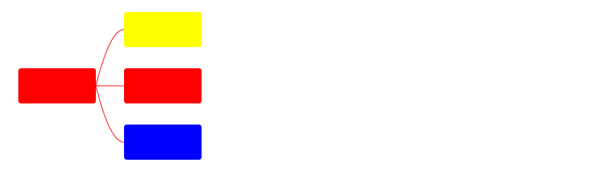

# SVG.js入门指南

## 一、SVG.js介绍

SVG.js 主要是用于操作 SVG 和动画的轻量级库

### 1.1、包管理器安装

```bash
npm install @svgdotjs/svg.js
// or
yarn add @svgdotjs/svg.js
```

### 1.2、通过script引用

```javascript
<script src="https://cdnjs.cloudflare.com/ajax/libs/svg.js/3.2.4/svg.min.js"></script>
```

### 1.3、初次使用体验

```html
<!doctype html>
<html lang="en">
  <head>
    <meta charset="UTF-8" />
    <meta
      name="viewport"
      content="width=device-width, initial-scale=1.0" />
    <title>svg.js标签使用</title>
  </head>
  <body>
    <svg
      width="100%"
      height="500"
      version="1.1"
      xmlns="http://www.w3.org/2000/svg">
      <rect
        id="myRectId"
        x="0"
        y="0"
        width="50"
        height="50"
        fill="red"></rect>

      <rect
        x="50"
        y="50"
        width="50"
        height="50"
        fill="blue"></rect>
    </svg>
    <script
      type="module"
      src="src/01-index.js"></script>
  </body>
</html>
```

```javascript
// 导入 SVG
import { SVG } from '@svgdotjs/svg.js';

// 创建 SVG 画布，并通过 size 方法指定大小
var draw = SVG().size(300, 300);
console.log(draw);

// 创建 circle 标签
var circle = SVG('<circle>');
console.log(circle);

// 创建 rect 标签
var rect = SVG('<rect>');
console.log(rect);

// 创建 g 标签
var g = SVG('<g>');
console.log(g);

// SVG不仅可以创建标签，同时还可以获取已经存在的元素
var myRectId = SVG('#myRectId');
console.log(myRectId);

var rect = SVG('rect'); // 只能获取到 document 文档中的第一个 rect 元素
console.log(rect);
```

## 二、创建SVG容器元素

```javascript
import { SVG } from '@svgdotjs/svg.js';

/**
 * 创建 <svg> 标签节点
 */
var svg = SVG();
console.log(svg);

// 通过 nested 方法创建 <svg> 标签节点，因为 <svg> 标签可以嵌套 <svg>
var nested = SVG().nested();
console.log(nested);

/**
 * 创建 <g> 标签节点
 */
var group = SVG().group();
console.log(group);

/**
 * 创建 <symbol> 标签节点
 */
var symbol = SVG().symbol();
console.log(symbol);

// g 标签和 symbol 标签的区别：<g> 侧重于组合操作（如动画、旋转），<symbol>侧重于‌图形复用‌（如图标库）并需要通过 <use> 引用激活

/**
 * 创建 <defs> 标签
 */
var defs = SVG().defs();
console.log(defs);

/**
 * 创建 link 标签，实际会生成 a 标签
 */
var link = SVG().link('http://svgdotjs.github.io/');

// 更新链接地址
link.to('http://apple.com');

// 也可以通过 target() 方法更改属性
link.target('_blank');

console.log(link);

// 也可以通过标签包裹一层 a 标签链接
// 创建 svg 画布，通过 addTo 添加到 body 标签中
var draw = SVG().addTo('body').size(500, 500);
draw.rect(100, 100).fill('red').linkTo('https://www.baidu.com');

// 通过 linker 方法获取 link
console.log(rect.linker());

// 也可以通过取消 link
rect.unlink();
```

## 三、创建SVG其他元素

```javascript
import { SVG, Rect } from '@svgdotjs/svg.js';

// 创建 <svg> 画布
var draw = SVG().size(500, 500).addTo('body');

// 第一种方式：创建 rect 矩阵标签节点
var rect = new Rect().size(100, 100).fill('blue');
console.log(rect);

// 第二种方式：通过生成的画布调用方法自动画出
draw.rect().size(200, 200).fill('red');

// 注意：第一种方式创建的 rect 标签节点创建成功后不会添加到画布中
// 第二种方式通过 draw.rect() 会自动在已经存在 <svg> 画布当中

/**
 * element方法创建 Dom 元素
 */
var div = draw.element('div', { id: 'mydiv' }).words('This is Div');
console.log(div);

/**
 * 创建 Line 元素
 */
var line = draw.line(0, 0, 300, 300).stroke({ width: 1, color: 'blue' });
console.log(line);
```

本章节只体现部分使用，更新详细使用查看 [官网文档](https://svgjs.dev/docs/3.2/shape-elements/)

## 四、选择器以及元素创建

```html
<!-- 选择器 -->
<svg
  id="mySvg"
  width="100%"
  height="500"
  version="1.1"
  xmlns="http://www.w3.org/2000/svg">
  <rect
    class="my-class"
    x="0"
    y="0"
    width="50"
    height="50"></rect>
  <rect
    class="my-class"
    x="50"
    y="50"
    width="50"
    height="50"
    fill="blue"></rect>
</svg>
```

```javascript
import { SVG } from '@svgdotjs/svg.js';

// 通过 css 选择
var rect = SVG('rect.my-class').fill('red');
console.log(rect);

// 先选择创建好的 <svg> 标签然后找到 类名为 .my-class
var list = SVG('#mySvg').find('.my-class');
console.log(list);

var myClass = SVG('#mySvg').findOne('.my-class');
console.log(myClass);

// 创建画布
var draw = SVG('#mySvg');

// 获取 children
var children = draw.children();
console.log(children);

// 对 children 做操作
draw.each(function (i, children) {
  this.fill({ color: '#f06' });
});

// 获取首个和最后一个，这里返回的是 SVG.Element 可能会导致获取到的是文本节点
var first = draw.first();
var last = draw.last();
console.log(first, last);
```

本章节只体现部分使用，更新详细使用查看 [官网文档](https://svgjs.dev/docs/3.0/referencing-creating-elements/#using-css-selectors)

## 五、属性方法设置

```javascript
import { SVG } from '@svgdotjs/svg.js';

/**
 * 属性方法设置
 */
var draw = SVG().size(500, 500).addTo('body');
var rect = draw.rect();

// 属性设置
rect.attr({ fill: 'red', stroke: '#000', 'stroke-width': 10 }).width(100).height(100);
rect.radius(10);

// 移动元素的左上角到给定的x和y位置
rect.move(60, 60);

// 相对当前位置再移动20，20。也可以记住带前缀 d 开头的方法都是相对的，像 dx()、dy()
rect.dmove(20, 20);

rect.css({ cursor: 'pointer' });

/**
 * 显示和隐藏
 */
// 还可以隐藏，hide 方法实际设置的 display: none; Dom元素依旧存在。
// 如果需要展示 可以调用 show 方法
rect.hide();
rect.show();

/**
 * 类设置
 */
// 添加类名
rect.addClass('a b c');

// 获取设置的类目
var classes = rect.classes();
console.log(classes);

// 判断是否存在类名
rect.hasClass('a');

// 移除类名
rect.removeClass('c');

/**
 * data- 属性设置
 */
// 设置 data- 属性
rect.data('key', { value: { data: 0.3 } });

// 获取 data- 设置的value
var key = rect.data('key');
console.log(key);

/**
 * SVG元素设置
 */
var rect = draw.rect(100, 100);
var group = draw.group();
// add 添加子元素
group.add(rect);

// addTo 添加到父元素
group.addTo(draw);
```

本章节只体现部分使用，更新详细使用查看 [官网文档](https://svgjs.dev/docs/3.0/manipulating/)

## 六、动画

```javascript
import { SVG } from '@svgdotjs/svg.js';

var draw = SVG().size(500, 500).addTo('body');

var rect = draw.rect().size(100, 100).fill('blue');

// 添加动画，并且可以添加多个动画队列
rect.animate(3000, 200).dmove(100, 100).animate(2000).attr({ fill: '#ccc' });
```

animate() 方法不会返回目标元素，而是返回 SVG.Runner 的一个实例，该实例具有与任何元素相同的方法以及控制运行器的附加方法

```javascript
let runner = rect.animate(2000).move(300, 300);

// 获取设置的 duration
console.log(runner.duration());
```

相关的 SVG.Runner 用法如下

```javascript
let rect = draw.rect(100, 100)
let runner = rect.animate()

runner.element() // returns or sets the element the runner is bound to
runner.timeline() // returns or sets the timeline the runner will be / is scheduled on
runner.animate() // for animation chaining. See element.animate()
runner.schedule(timeline, delay, when) // schedules the runner on the timeline. Timeline can be skipped if already set
runner.unschedule() // removes the runner from the timeline
runner.loop(times, swing, wait) // loops the animation by `times` times with `wait` milliseconds time between each loop
runner.queue(runOnceFn, runOnEveryStepFn) // Lets you chain functions which are not neccecarily animations
runner.during(fn) // Lets you bind a function to every animation step
runner.after(fn) // Lets you bind a function which is executed after the animation is finished
runner.time() // returns or sets the runner time
runner.duration() // returns the duration the runner will run
runner.loops() // Lets you jump to a specific iteration of the runner e.g. 3.5 for 4th loop half way through
runner.persist() // Make this runner persist on the timeline forever (true) or for a specific time. Usually a runner is deleted after execution to clean up memory.
runner.position() // returns or sets the current position of the runner ignoring the wait times (between 0 and 1)
runner.progress() // returns or sets the current position of the runner including the wait times (between 0 and 1)
runner.step(dt) // step the runner by a certain time (for manually stepping trough animations)
runner.reset() // set the runner back to zero time and all animations with it
runner.finish() // steps the runner to its finished state
runner.reverse() // execute the runner backwards
runner.ease() // change the easing of the animation
runner.active() // returns or sets the active state of the runner. Inactive runners are not executed
```

也可以通过 new SVG.Runner 在绑定元素

```javascript
var runner = new SVG.Runner(1000)
runner.move(100, 100)

runner.element(someElement)

// Step animation by 20ms
runner.step(20)

// To animate, we need a timeline on which the runner is run
var timeline = new SVG.Timeline()
timeline.schedule(runner)
```

## 七、事件

```javascript
import { SVG } from '@svgdotjs/svg.js';

/**
 * 添加事件
 */
var draw = SVG().size(500, 500).addTo('body');

var rect = draw.rect().size(100, 100).fill('red');
console.log(rect);

rect.click(function () {
  console.log(this);
});

rect.dblclick(function () {
  console.log(this);
});

// 移除事件
rect.click(null);

// 也可以通过 on 和 off 监听事件
rect.on(['click', 'mouseover'], function () {
  console.log(this, '<--click, mouseover');
});

// rect.off(['click', 'mouseover']);

// 以上相关事件支持 click、dblclick、mousedown、mouseup、mouseover、mouseout、mousemove、touchstart、touchmove、touchleave、touchend、touchcancel
```

SVG.js 还支持自定义事件

```javascript
import { SVG } from '@svgdotjs/svg.js';

/**
 * 添加事件
 */
var draw = SVG().size(500, 500).addTo('body');

var rect = draw.rect().size(100, 100).fill('red');
console.log(rect);

rect.click(function () {
  console.log(this);
});

rect.dblclick(function () {
  console.log(this);
});

// 移除事件
rect.click(null);

// 也可以通过 on 和 off 监听事件
rect.on(['click', 'mouseover'], function () {
  console.log(this, '<--click, mouseover');
});

// rect.off(['click', 'mouseover']);

// 以上相关事件支持 click、dblclick、mousedown、mouseup、mouseover、mouseout、mousemove、touchstart、touchmove、touchleave、touchend、touchcancel

/**
 * 自定义事件
 */
// rect.fire('customEvent');

rect.on('customEvent', function (e) {
  console.log(444444, e.detail);
});

rect.dispatch('customEvent', { data: 'data' });

rect.fire('customEvent', { data: 'data' });

// dispatch 和 fire 都可以触发事件，两者会有所不同，详细见：https://svgjs.dev/docs/3.0/events/
```

本章节只体现部分使用，更新详细使用查看 [官网文档](https://svgjs.dev/docs/3.0/events/)

## 八、实践

```javascript
import { SVG, Fragment } from '@svgdotjs/svg.js';

// 创建画布
var draw = SVG().size('100%', 1100).addTo('body');

// 创建 g 元素并移动到比较靠中心的位置
var group = draw.group().attr({ transform: 'translate(50,400)' });

// 创建父元素模块矩形
let parentRect = group.rect().size(110, 50).fill('red').radius(4);

let frag = new Fragment();

// 添加子元素矩形（黄色）
frag.rect().size(110, 50).fill('yellow').radius(4).id('rect');

// 添加子元素矩形（红色）
frag.rect().size(110, 50).fill('red').radius(4).id('rect');

// 添加子元素矩形（蓝色）
frag.rect().size(110, 50).fill('blue').radius(4).id('rect');

// 创建线条
frag.path().plot('M 110 25 Q 0 25 0 25').fill('transparent').stroke({ color: 'red', width: 1 }).id('line');
frag.path().plot('M 110 25 Q 0 25 0 25').fill('transparent').stroke({ color: 'red', width: 1 }).id('line');
frag.path().plot('M 110 25 Q 0 25 0 25').fill('transparent').stroke({ color: 'red', width: 1 }).id('line');

// 添加到 g 元素中
group.add(frag, 0);

let children = group.find('#rect');

let lineList = group.find('#line');

let count = parseInt(children.length / 2) * -1;

parentRect.data('open', 0); // 父元素展开和收起状态

parentRect.click(function () {
  let open = this.data('open');
  if (open) {
    this.data('open', 0);
    children.each(function (_item, i) {
      this.animate(1000).dmove(-150, -(count + i) * 80);
    });

    lineList.each(function () {
      this.animate(1000).plot('M 110 25 Q 0 25 0 25');
    });
  } else {
    this.data('open', 1);
    children.each(function (_item, i) {
      this.animate(1000).dmove(150, (count + i) * 80);
    });

    lineList.each(function (_item, i) {
      this.animate(1000).plot(`M 110 25 Q ${150 - 20} ${(count + i) * 80 + 25} 150 ${(count + i) * 80 + 25}`);
    });
  }
});
```

实现效果如下


