# PicGo使用

## 一、前期准备工作

1. Typora 的 markdown 编辑器
2. PicGo 上传图床工具
3. gitee 用于搭建外网图床仓库

## 二、gitee创建公共仓库作为图床

### 2.1、创建公共仓库

gitee 和 GitHub 都可以作为图床的一个仓库，这里选择 gitee 的原因是：github 属于外网，访问较慢，gitee 访问就比较快。

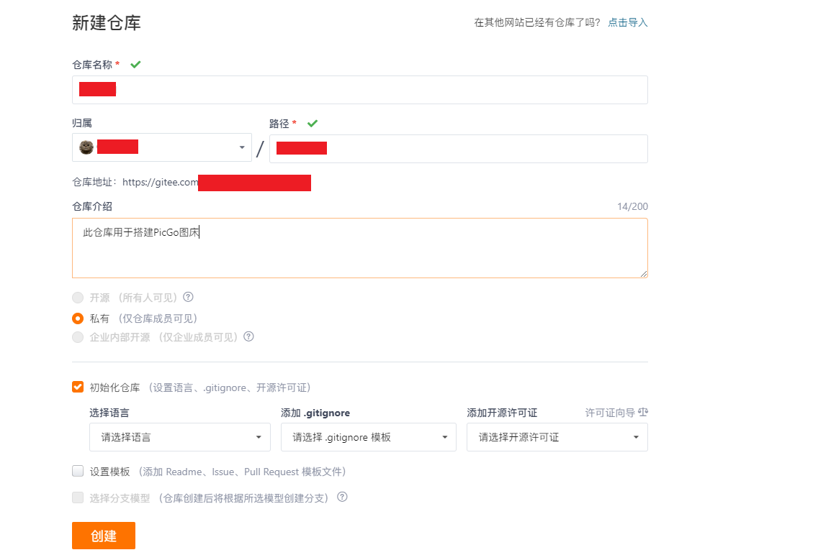

设置仓库为开源仓库

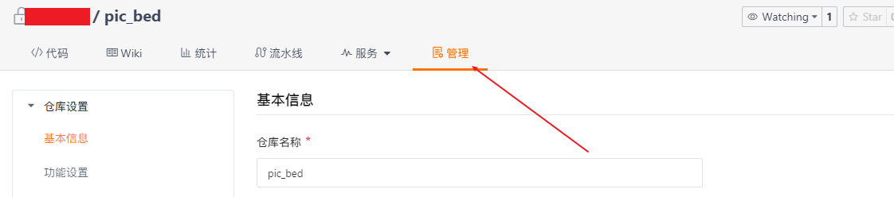

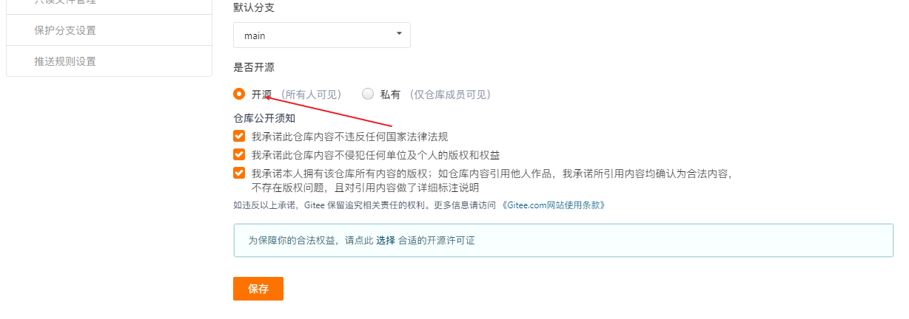

🔔注意：gitee 目前只能选择私有仓库，创建成功后需要手动设置为公共仓库。同时 gitee 仓库存储免费个人用户只有 5GB

### 2.2、创建存储私人令牌

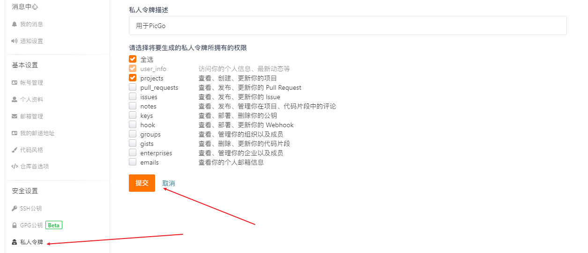

🔔注意: 私人令牌记得保存好

## 三、配置PicGo

### 3.1、下载PicGo

下载地址：[PciGo下载地址](https://github.com/Molunerfinn/PicGo)

### 3.2、PicGo安装gitee-uploader插件

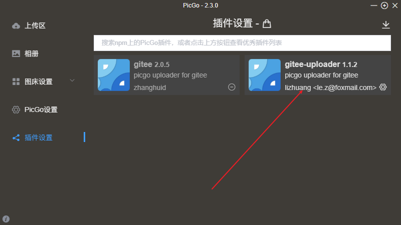

### 3.3、设置gitee图床地址

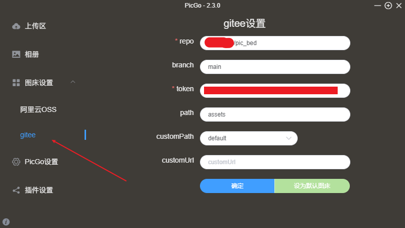

参数分析：

repo：设置为 `owner/仓库地址` 形式，`owner对应仓库空间地址`

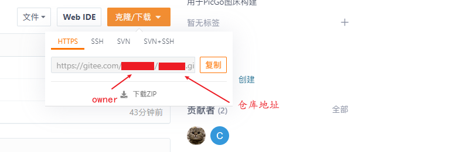

branch：对应仓库的分支

token：对应gitee的私人令牌

paths：对应仓库的文件路径

🔔注意：customPath 和 customUrl 默认不设置

### 3.4、测试上传

在 PicGo 的上传区 `点击上传` 进行上传测试

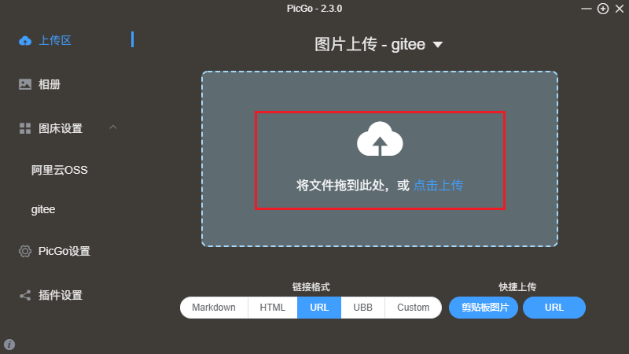

当上传成功后在 PicGo 的相册区域可以查看上传后的文件

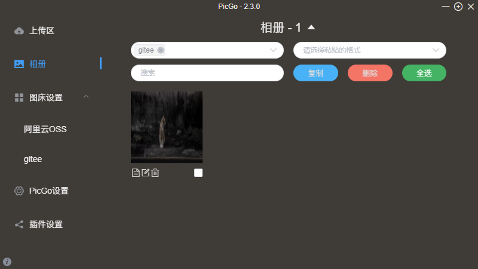

测试外网图片地址

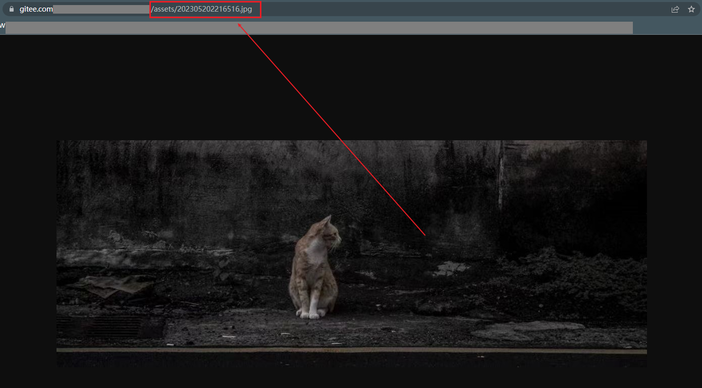

## 四、配置Typora

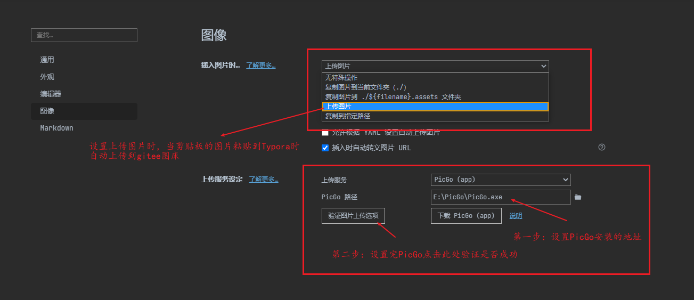
