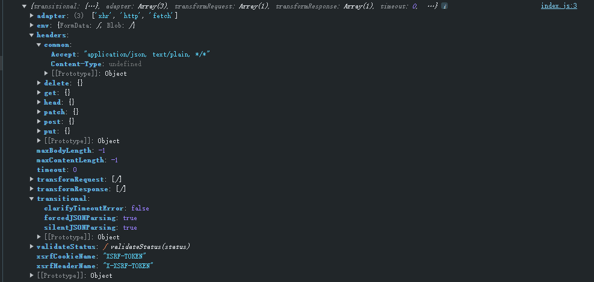
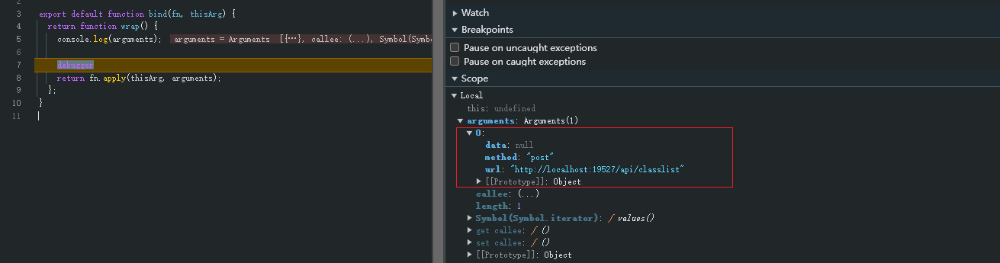
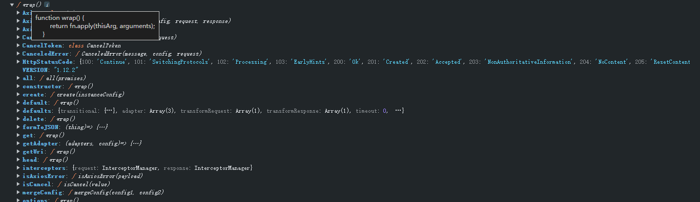
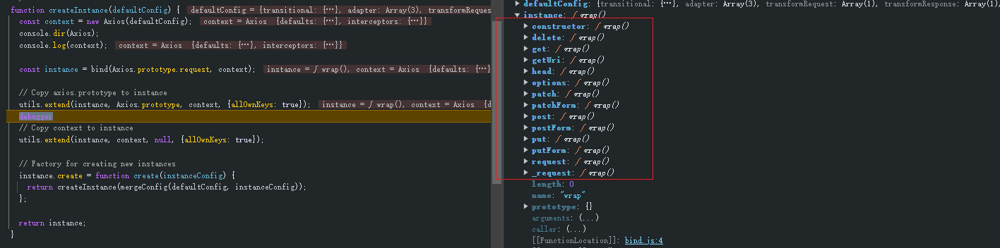
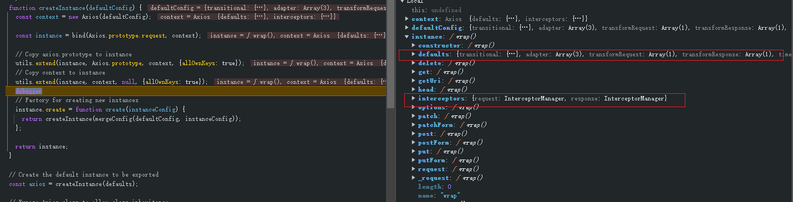

# axios源码解析

## 一、axios用法介绍

对 axios 的简单使用如下

```javascript
import axios from 'axios';

/**
 * 1. 直接调用 axios
 */
axios({
  method: 'post',
  url: 'http://localhost:19527/api/classlist',
  data: null,
}).then((res) => {
  console.log(res);
});

/**
 * 2. 直接调用 axios 的具体请求方法
 */
axios.post('http://localhost:19527/api/classlist').then((res) => {
  console.log(res);
});

/**
 * 3. 创建实例
 */
const instance = axios.create({ baseURL: 'http://localhost:19527/api' });
instance({
  url: '/classlist',
  method: 'post',
}).then((res) => {
  console.log(res);
});
```

对于 axios 相关的 api 使用可以参考 [axios官方](https://axios-http.com/docs/api_intro)

## 二、axios导出数据

可以通过源码进行查看 axios 的导出数据

```javascript
function createInstance(defaultConfig) {
  const context = new Axios(defaultConfig);
  const instance = bind(Axios.prototype.request, context);

  // Copy axios.prototype to instance
  utils.extend(instance, Axios.prototype, context, {allOwnKeys: true});

  // Copy context to instance
  utils.extend(instance, context, null, {allOwnKeys: true});

  // Factory for creating new instances
  instance.create = function create(instanceConfig) {
    return createInstance(mergeConfig(defaultConfig, instanceConfig));
  };

  return instance;
}

// Create the default instance to be exported
const axios = createInstance(defaults);

// Expose Axios class to allow class inheritance
axios.Axios = Axios;

// Expose Cancel & CancelToken
axios.CanceledError = CanceledError;
axios.CancelToken = CancelToken;
axios.isCancel = isCancel;
axios.VERSION = VERSION;
axios.toFormData = toFormData;

// Expose AxiosError class
axios.AxiosError = AxiosError;

// alias for CanceledError for backward compatibility
axios.Cancel = axios.CanceledError;

// Expose all/spread
axios.all = function all(promises) {
  return Promise.all(promises);
};

axios.spread = spread;

// Expose isAxiosError
axios.isAxiosError = isAxiosError;

// Expose mergeConfig
axios.mergeConfig = mergeConfig;

axios.AxiosHeaders = AxiosHeaders;

axios.formToJSON = thing => formDataToJSON(utils.isHTMLForm(thing) ? new FormData(thing) : thing);

axios.getAdapter = adapters.getAdapter;

axios.HttpStatusCode = HttpStatusCode;

axios.default = axios;

// this module should only have a default export
export default axios
```

从上述中发现导出的 axios 是通过 createInstance 方法进行创建返回，并且传入 defaults 默认参数，默认参数如下图



## 三、createInstance函数分析

Axios 类文件分析如下

```javascript
/**
 * Axios 类
 */
class Axios {
  constructor(instanceConfig) {
    // 默认配置
    this.defaults = instanceConfig || {};
    // 添加的拦截器
    this.interceptors = {
      request: new InterceptorManager(),
      response: new InterceptorManager()
    };
  }


  /**
   * Axios 添加的 request 方法
   */
  async request(configOrUrl, config) {
    try {
      // 内部调用 this._request
      return await this._request(configOrUrl, config);
    } catch (err) {
    	...
      throw err;
    }
  }

  _request(configOrUrl, config) {
    if (typeof configOrUrl === 'string') {
      config = config || {};
      config.url = configOrUrl;
    } else {
      config = configOrUrl || {};
    }
	
    // 当前传递的配置和默认配置进行一个合并得出一个公共配置
    config = mergeConfig(this.defaults, config);
		// ... 后续操作 以及 拦截器的执行
    return promise;
  }
	
  // 获取完整路径
  getUri(config) {
    config = mergeConfig(this.defaults, config);
    const fullPath = buildFullPath(config.baseURL, config.url, config.allowAbsoluteUrls);
    return buildURL(fullPath, config.params, config.paramsSerializer);
  }
}

// 为  Axios.prototype 添加 'delete', 'get', 'head', 'options' 请求
utils.forEach(['delete', 'get', 'head', 'options'], function forEachMethodNoData(method) {
  Axios.prototype[method] = function(url, config) {
    // 这里也会进行配置一个合并，然后再通过 request 函数内部还会合并一次
    return this.request(mergeConfig(config || {}, {
      method,
      url,
      data: (config || {}).data
    }));
  };
});

// 为  Axios.prototype 添加 'post', 'put', 'patch' 请求
utils.forEach(['post', 'put', 'patch'], function forEachMethodWithData(method) {
  function generateHTTPMethod(isForm) {
    return function httpMethod(url, data, config) {
      // 这里也会进行配置一个合并，然后再通过 request 函数内部还会合并一次
      return this.request(mergeConfig(config || {}, {
        method,
        headers: isForm ? {
          'Content-Type': 'multipart/form-data'
        } : {},
        url,
        data
      }));
    };
  }

  Axios.prototype[method] = generateHTTPMethod();

  Axios.prototype[method + 'Form'] = generateHTTPMethod(true);
});
```

createInstance 函数分析如下

```javascript
function createInstance(defaultConfig) {
  // 通过 Axios 创建 context
  const context = new Axios(defaultConfig);
  // instance 通过 bind 函数返回一个 wrap 函数形成闭包
  const instance = bind(Axios.prototype.request, context);

  utils.extend(instance, Axios.prototype, context, {allOwnKeys: true});

  utils.extend(instance, context, null, {allOwnKeys: true});
	
  // 为该函数添加 create 方法，为其可以自动添加实例
  instance.create = function create(instanceConfig) {
    // 在创建实例时，会和默认配置进行合并
    return createInstance(mergeConfig(defaultConfig, instanceConfig));
  };
	
  // 返回的其实就是一个函数
  return instance;
}
```

通过 Axios 函数创建 context 之后，然后会通过 bind 函数返回一个 wrap 函数形成闭包，bind 函数解析如下

```javascript
export default function bind(fn, thisArg) {
  return function wrap() {
   /**
   	* arguments 就是传递过来的配置，例如 axios({ method: 'post', url: 'http://localhost:19527/api/classlist', data: null, })
   	* 同时满足 axios(url[, config]) 的使用
   	*/
    console.log(arguments);
    // 将 this 指向 context，fn 为 Axios.prototype.request 函数
    return fn.apply(thisArg, arguments);
  };
}
```



由上述的描述，那么 createInstance 函数返回给 axios 其实就是返回一个函数，返会的函数其实就是 wrap 函数，所以这也是我们单独打印 axios 时返回的是一个函数，如下



所以本质是当使用 `axios(url[, config])` 的形式调用时，其实就是在调用 Axios.prototype.request 的函数，this 指向了 context。

然后需要再解释说明以下 utils.extend 方法的作用，createInstance 函数内部调用了这个函数

```javascript
// 将 Axios.prototype 上的方法都设置 instance，并通过 bind 形成闭包
utils.extend(instance, Axios.prototype, context, {allOwnKeys: true});
```

utils.extend 函数分析如下

```javascript
const extend = (a, b, thisArg, { allOwnKeys }= {}) => {
  // 对 b （Axios.prototype）进行遍历
  forEach(b, (val, key) => {
    console.log(val, key);
    // thisArg 就是 context
    if (thisArg && isFunction(val)) {
      // 将 Axios.prototype 上的方法都设置 instance，并通过 bind 形成闭包
      a[key] = bind(val, thisArg);
    } else {
      a[key] = val;
    }
  }, { allOwnKeys });

  // 返回的是 a, 也就是 instance
  return a;
}
```

实现的效果如下图



这要就满足了 axios 以下相关的用法

```tex
axios.request(config)
axios.get(url[, config])
axios.delete(url[, config])
axios.head(url[, config])
axios.options(url[, config])
axios.post(url[, data[, config]])
axios.put(url[, data[, config]])
axios.patch(url[, data[, config]])
axios.postForm(url[, data[, config]])
axios.putForm(url[, data[, config]])
axios.patchForm(url[, data[, config]])
```

然后还会再执行一次 utils.extend 函数，主要目的是将 interceptors 和 defaults 设置到 instance 函数上（也就是 axios），如下

```javascript
// 将 context 的属性设置再 instance
utils.extend(instance, context, null, {allOwnKeys: true});
```

实现的效果如下图



这样就满足了对 axios 设置拦截器的用法

```javascript
axios.interceptors.request.use(function (config) {
    return config;
  }, function (error) {
    return Promise.reject(error);
  },
  { synchronous: true, runWhen: () => /* This function returns true */}
);

// Add a response interceptor
axios.interceptors.response.use(function onFulfilled(response) {
    return response;
  }, function onRejected(error) {
    return Promise.reject(error);
  });
```

## 四、create方法创建实例

首先创建实例会和默认的配置进行一次合并

```javascript
  instance.create = function create(instanceConfig) {
    // 实例化的配置和默认的配置会合并配置
    return createInstance(mergeConfig(defaultConfig, instanceConfig));
  };
```

还有就是 axios 的 ` 默认实例`和 `创建处理的实例` 是相互独立的，唯一就是配置会进行合并配置
