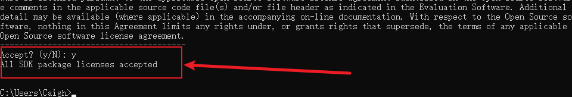

# Window10搭建Flutter项目开发环境

## 一、下载 Flutter SDK

进入[Flutter官网](https://docs.flutter.cn/get-started/install/windows/desktop?tab=download)，下载 windows 版本的 flutter-sdk


下载完成之后，加压到指定文件目录下即可


设置 Flutter 环境变量


使用以下命令检测是否安装成功

```bash
flutter --version
```

执行结果如下，说明 Flutter SDK 安装配置成功


如果为中国网络环境需要额外配置，需要配置国内的 Flutter 镜像，配置如下：

PUB_HOSTED_URL="https://pub.flutter-io.cn"


FLUTTER_STORAGE_BASE_URL="https://storage.flutter-io.cn"


## 二、flutter doctor 命令

`flutter doctor` 指令将检查 Windows 完整的 Flutter 开发环境的所有组件。


上述图片共有 3 个错误，这里优先解决 Visual Studio - develop Windows apps (Visual Studio 生成工具 2022 17.10.1) 问题，后续错误通过安装 Android studio 来解决。

Visual Studio - develop Windows apps 主要是支持 Flutter 构建 window 桌面级应用所需要的组件，安装过程如下：


选择使用C++的桌面级开发，默认选择勾选的组件，点击安装即可


安装完成之后，在执行一次 flutter doctor


## 三、安装 Android Studio

进入 [Android Studio 官网](https://developer.android.google.cn/studio?hl=ru) ，点击下载即可


下载完成之后，执行文件进行安装


后续一直下一步安装即可，Android Studio 安装成功运行，会提示 No Android SDK found


点击Next，对Android SDK进行安装


安装过程中需要同意 Android SDK License，同意之后点击 Finish 即可


由此 Android Studio 和 Android SDK 就安装完成了，在执行一次 flutter doctor 命令查看


解决 flutter doctor 报出的 Android toolchain 问题

配置 Android的环境变量，如下：


设置环境变量中的Path变量


再次运行 flutter doctor 检查组件


这里会报出 Android license status unknown 错误 和 cmdline-tools component is missing 错误。

首先解决 cmdline-tools component is missing 问题

打开 Android studio 找到setting ，选择 Android SDK ，勾选 Android SDK Command-line Tools 进行安装


解决 Android license status unknown 问题

打开终端，只需要 flutter doctor --android-licenses 指令一直输入 Y 即可



再次执行flutter doctor 查看


这就解决了 flutter doctor 所需要相关组件

## 四、Android Studio 相关配置

### 4.1、下载 Flutter、Dart 插件


### 4.2、配置 Virtual Device Manager

在 Android Studio 页面，打开 More Actions 下拉菜单，选择Virtual Device Manager


点击 + 添加虚拟设备


这里选择Pixel 8 Pro


选择系统镜像时，要选择和 Android SDK 版本一致，


后续点击 Next 安装即可

## 五、创建 Flutter 项目

在 Android Studio 欢迎页面，点击 New Flutter Project 创建 flutter 项目


选择 Flutter SDK 目录路径


选择创建项目配置


点击 create 等待项目创建完成即可