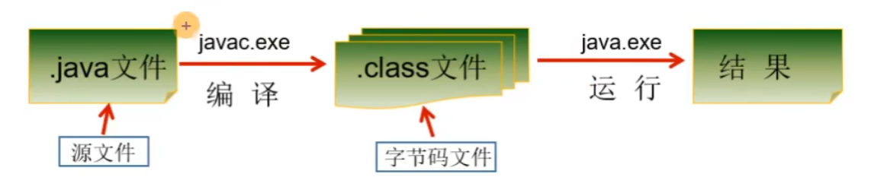
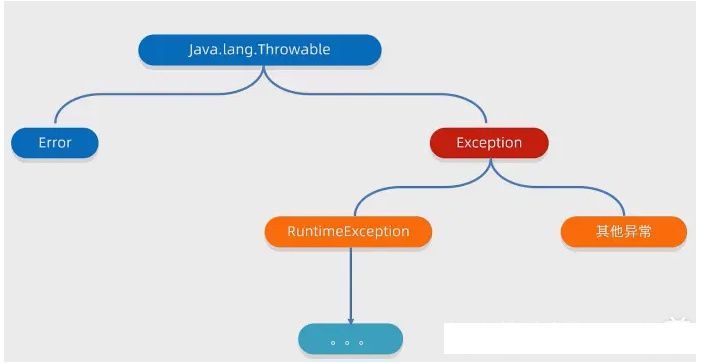

# Java 快速入门

## 一、简单程序开发步骤

Java 程序开发三步骤：编写、编译、运行

+ 将 java 代码编写到扩展名为 .java 的源文件中
+ 通过 javac.exe 命令对该 java 文件进行编译，生成一个或多个字节码文件
+ 通过 java.exe 命令对生成的 class 文件进行运行



### 1.1、HelloWorld程序

```tex
代码结构：
类：每个 Java 程序都由类定义，类名应与文件名相同
方法：执行代码的函数，main 方法是程序的入口
语句：每行语句必须以分号 ";" 结尾
```

编写 HelloWorld.java 程序，在终端执行 javac HelloWorld.java 命令进行编译

```java
public class HelloWorld {
  public static void main(String[] args) {
    System.out.println("Hello, World!");
  }
}
```

然后通过 java HelloWorld （不需要加 .class 后缀）执行文件。

### 1.2、java程序注释

#### 1.2.1、单行注释和多行注释

```java
public class Comment {
  public static void main(String[] args) {
    // 单行注释
    System.out.println("单行注释");

    /*
      多行注释
      多行注释
     */
    System.out.println("多行注释");
  }
}
```

#### 1.2.2、文档注释

```java
/**
 * 文档注释
 * 
 * @author Kyler
 * @version 0.0.1
 */
public class Comment {
  public static void main(String[] args) {
    // 单行注释
    System.out.println("单行注释");

    /*
     * 多行注释
     * 多行注释
     */
    System.out.println("多行注释");
  }
}

```

终端执行以下命令生成文档注释的 mydoc 文件夹

```bash
javadoc -d mydoc -author -version Comment.java 
```

然后就会在当前目录生成 mydoc 文件夹

## 二、变量和数据类型

### 2.1、标识符和变量

 标识符命名规则：

+ 由数字、字母、下划线(_)、美元符号($)

+ 不能是关键字、不能以数字开头

+ 区分大小写

常规命名规则：

+ 小驼峰命名法：方法、变量

+ 大驼峰命名法：类名

变量定义格式：

```java
public class Main {
  public static void main(String[] args) {
    // 变量格式：数据类型 变量名 = 数据值
    int num = 10;
    System.out.println(num);
  }
}
```

### 2.2、数据类型

#### 2.2.1、基础数据类型

+ 整型：byte、short、int、long
+ 浮点型：float、double
+ 字符型：char
+ 布尔型：boolean

| 类型   | 占用存储空间 | 表数范围                                         |
| ------ | ------------ | ------------------------------------------------ |
| byte   | 1字节        | -2^7^ ~ 2^7^ -1 (-128到127)                      |
| short  | 2字节        | -2^15^ ~ 2^15^ -1(-32,768到32,767)               |
| int    | 4字节        | -2^31^ ~ 2^31^ -1(-2,147,483,648到2,147,483,647) |
| long   | 8个字节      | -2^63^ ~ 2^63^ -1                                |
| float  | 4字节        | ±3.40282347E+38F（有效位数为6-7位）              |
| double | 8字节        | ±1.7976931348623157E+308（有效位数为15位）       |

```java
public class Main {
  public static void main(String[] args) {
    /**
     * 数据类型
     * 整数：byte、short、int、long
     * 浮点数：float、double
     * 字符：char
     * 布尔：boolean
     */

    // 整数
    byte b = 10;
    short s = 20;
    int i = 30;
    System.out.println(b);
    System.out.println(i);
    System.out.println(s);

    // long 类型需要在值后面加一个 L，建议大写
    long l = 1265454555L;
    System.out.println(l);

    // 浮点型 long 类型需要在值后面加一个 F，建议大写
    Float f = 10.0F;
    System.out.println(f);
    double d = 10.20;
    System.out.println(d);

    // 字符型：单引号
    char c = '中';
    System.out.println(c);

    // 布尔型
    boolean bool = false;
    System.out.println(bool);

    // 空
    // System.out.println(null); // 报错： null 不能直接打印

    // 制表符
    System.out.println("abcd" + "\t"); // 在打印的时候，把前面字符串的长度补齐到8，或者8的整数倍。最少补1个空格，最多补8个空格

    System.out.println("name" + '\t' + "age");

    System.out.println("Kyler" + '\t' + "26");
  }
}
```

#### 2.2.2、引用数据类型

+ 类：Class，String 是引用数据类型，继承于 Object 类。Object 类是 Java 中除了它本身之外所有类的父类；换句话说 Java 中所有其它类都是 Object 类的子类。
+ 接口：Interface，接口定义了一组抽象方法，任何类实现接口时都必须实现这些方法。接口用于定义类的行为规范，并且允许类实现多个接口，从而支持多重继承。
+ 数组：Array，数组是存储同类型元素的固定大小的顺序集合。
+ 枚举：Enum，枚举是一种特殊的类，用于定义一组常量。每个枚举类型都有一组固定的实例，这些实例通常用于表示一组有意义的常量。

```java
// 定义一个名为 Person 的类
class Person {
  // 成员变量
  private String name;
  private int age;

  // 构造方法
  public Person(String name, int age) {
    this.name = name;
    this.age = age;
  }

  // 方法
  public void introduce() {
    System.out.println("My name is " + name + " and I am " + age + " years old.");
  }
}

/**
 * 接口
 */
interface Drawable {
  // 抽象方法
  void draw();
}

class Circle implements Drawable {
  @Override
  public void draw() {
    System.out.println("Drawing a circle");
  }
}

/**
 * 枚举
 */
enum Day {
  MONDAY, TUESDAY, WEDNESDAY, THURSDAY, FRIDAY, SATURDAY, SUNDAY
}

public class Main {
  public static void main(String[] args) {
    // 创建 Person 对象
    Person person = new Person("Alice", 30);

    // 调用方法
    person.introduce();

    // 创建 Circle 对象
    Circle circle = new Circle();
    // 调用接口方法
    circle.draw();

    Day day = Day.MONDAY;
    switch (day) {
      case MONDAY:
        System.out.println("It's Monday!");
        break;
      case FRIDAY:
        System.out.println("It's Friday!");
        break;
      default:
        System.out.println("It's another day.");
        break;
    }

    // 声明并初始化一个整数数组
    int[] numbers = { 1, 2, 3, 4, 5 };

    // 遍历数组并打印每个元素
    for (int num : numbers) {
      System.out.println(num);
    }
  }
}
```

### 2.3、数据类型转换

Java基本数据类型的自动类型提升

```java
public class Main {
  public static void main(String[] args) {
    /**
     * 自动类型提升
     * 规则：当容量小的变量与容量大的变量做运算时，结果自动转换为容量大的数据类型
     * byte ---> short ---> int ---> long ---> float ---> double
     * 特别的：
     * byte、short、char类型的变量之间做运行，结果为 int 类型
     */
    int i1 = 10;
    int i2 = i1;

    long l1 = i1;

    float f1 = l1;

    byte b1 = 12;

    int i3 = b1 + i1;

    // 编译不通过
    // byte b2 = b1 + i1; // 报错

    // **************************************

    // 特殊情况1：byte、short 之间做运算
    byte b3 = 12;
    short s1 = 10;
    // 编译不通过
    // short s2 = b3 + s1; // 报错
    i3 = s1 + b3;

    byte b4 = 10;
    // 编译不通过
    // byte b5 = b3 + b4;

    // 特殊的情况2：char
    char c1 = 'a';
    // 编译不通过
    // char c2 = c1 + b3;
    int i4 = c1 + b3;
  }
}
```

强制类型转换

```java
public class VarTrans {
    public static void main(String[] args) {
        /*
          强制类型转换
          规则：
          1. 如果需要将容量大的变量的类型转换为容量小的变量的类型，需要使用类型转换
          2. 强制类型转换需要使用强转符：() , 在()内指明要转换为的数据类型
          3. 强制类型转换过程中，可能导致精度损失
         */
        double d1 = 12.123;

        int i5 = (int) d1;
        System.out.println(i5);
    };
}

```

## 三、操作符

### 3.1、算术操作符

| 算数运算符 | 说明     |
| ---------- | -------- |
| +          | 加法运算 |
| -          | 减法运算 |
| /          | 除法运算 |
| %          | 取余运算 |

### 3.2、关系操作符

| 关系操作符 | 说明       |
| ---------- | ---------- |
| ==         | 是否相等   |
| !=         | 是否不相等 |
| >          | 大于       |
| <          | 小于       |
| >=         | 大于等于   |
| <=         | 小于等于   |

### 3.3、逻辑操作符

| 逻辑操作符 | 说明   |
| ---------- | ------ |
| &&         | 逻辑与 |
| \|\|       | 逻辑或 |
| !          | 逻辑非 |

### 3.4、赋值操作符

| 赋值操作符 | 示例      | 说明             |
| ---------- | --------- | ---------------- |
| =          | int a = 1 | 给整型变量a赋值1 |
| +=         | a += 1    | 等同于 a = a + 1 |
| -=         | a -= 1    | 等同于 a = a - 1 |
| *=         | a *= 1    | 等同于 a = a * 1 |
| /=         | a /= 1    | 等同于 a = a / 1 |
| %=         | a %= 1    | 等同于 a = a % 1 |

```java
public class Main {
    public static void main(String[] args) throws Exception {
        // 运算操作符简单示例
        int a = 10;
        int b = 11;
        int c = a * b;
        System.out.println(c);

        a += 3; // 等同于 a = a + 3
        int d = a - b;
        System.out.println(d);

        // &&、 || 是与和或，&、|是位运算符
        // int f = a && 0; // Error：&& 运算符不能用在变量赋值上
        // int e = b || 14; // Error：&& 运算符不能用在变量赋值上

        if (a > 12 && b < 50) {
            System.out.println("&& 运算符");
        }
    }
}
```

### 3.5、位操作符

位操作符通常用于二进制操作，这些操作符允许你对整数类型的数据执行位操作。这些位操作符对于执行底层位操作（例如处理网络协议、加密算法等）非常有用，但在普通的应用程序开发中相对较少使用。

- `&`: 按位与，如果两个操作数的对应位都为 1，则结果位为 1，否则为 0。

```java
int a = 5; // 二进制表示为 0000 0101
int b = 3; // 二进制表示为 0000 0011
int result = a & b; // 结果为 0000 0001，即 1
```

- `|`: 按位或，如果两个操作数的对应位中至少有一个为 1，则结果位为 1，否则为 0。

```java
int a = 5; // 二进制表示为 0000 0101
int b = 3; // 二进制表示为 0000 0011
int result = a | b; // 结果为 0000 0111，即 7
```

- `^`: 按位异或，如果两个操作数的对应位不相同，则结果位为 1，否则为 0。

```java
int a = 5; // 二进制表示为 0000 0101
int b = 3; // 二进制表示为 0000 0011
int result = a ^ b; // 结果为 0000 0110，即 6
```

- `~`: 按位取反，即将操作数的每个位都取反，即 0 变为 1，1 变为 0。

```java
int a = 5; // 二进制表示为 0000 0101
int result = ~a; // 结果为 1111 1010（补码表示），即 -6
```

- `<<`: 左移，用于将操作数的所有位向左移动指定的位数。例如，`a << n` 将 `a` 的所有位向左移动 `n` 位，右侧空出的位用 0 填充。

```java
int a = 5; // 二进制表示为 0000 0101
int result = a << 2; // 结果为 0001 0100，即 20
```

- `>>`: 带符号右移，用于将操作数的所有位向右移动指定的位数。对于正数，向右移动时左侧用 0 填充；对于负数，向右移动时左侧用原来的符号位填充。

```java
int a = -16; // 二进制表示为 1111 0000（补码表示）
int result = a >> 2; // 结果为 1111 1100，即 -4
```

- `>>>`: 无符号右移，用于将操作数的所有位向右移动指定的位数，但不考虑符号位，无论操作数是正数还是负数，都在左侧用 0 填充。

```java
int a = -16; // 二进制表示为 1111 0000（补码表示）
int result = a >>> 2; // 结果为 0011 1100，即 60
```

## 四、控制语句

```java
import java.util.Random;

public class Main {
    public static void main(String[] args) {
        /*
          if - else
         */
        Random rand = new Random();
        int randomNumber = rand.nextInt(10);
        if (randomNumber > 5) {
            System.out.println("randomNumber大于5");
        } else {
            System.out.println("randomNumber小于等于5");
        }

        /*
          switch
         */
        int day = rand.nextInt(8); // [0, 8)
        String dayName;

        switch (day) {
            case 1:
                dayName = "星期一";
                break;
            case 2:
                dayName = "星期二";
                break;
            case 3:
                dayName = "星期三";
                break;
            case 4:
                dayName = "星期四";
                break;
            case 5:
                dayName = "星期五";
                break;
            case 6:
                dayName = "星期六";
                break;
            case 7:
                dayName = "星期七";
                break;
            default:
                dayName = "";
                break;
        }
        System.out.println(dayName);

        /*
          while
         */
        int n0 = 0;
        while (n0 < 5) {
            System.out.println(n0);
            n0++;
        }

        /*
          do while
         */
        int n1 = 0;
        do {
            System.out.println(n1);
            n1++;
        } while (n1 < 5);

        /*
          for break continue
         */
        for (int i = 0; i < 5; i++) {
            if (i == 3) {
                break; // 当 i 等于 3 时，跳出循环
            }
            System.out.println(i);
        }
        // 输出 0, 1, 2

        for (int i = 0; i < 5; i++) {
            if (i == 3) {
                continue; // 当 i 等于 3 时，跳过本次循环，继续下一次迭代
            }
            System.out.println(i);
        }
        // 输出 0, 1, 2, 4

        /*
          foreach
         */
        int[] numbers = { 1, 2, 3, 4, 5 };

        for (int i : numbers) {
            System.out.println(i);
        }
    }
}
```

## 五、函数

```java
public class Main {
    public static void main(String[] args) throws Exception {
        System.out.println("Hello, World!");
        playGame();
    }

    public static void playGame() {
        System.out.println("会打游戏");
    }
}
```

函数重载是指在同一个类中可以拥有多个同名方法,但这些方法的参数列表必须不同(参数的类型、个数或顺序不同)

```java
public class Main {
    public static void main(String[] args) throws Exception {
        System.out.println("Hello, World!");
        playGame();
        playGame("PUBG");
    }

    public static void playGame() {
        System.out.println("会打游戏");
    }

    /**
     * 函数重载
     * 
     * @param gameName
     */
    public static void playGame(String gameName) {
        System.out.println("会打" + gameName + "游戏");
    }
}
```

## 六、面向对象编程

### 6.1、创建对象和实例

```java
class Person {
  public String name; // name 字段；没有初始化，有默认值
  public int age = 12; // age 字段；直接初始化为 12
}

public class Main {
  public static void main(String[] args) {
    Person p = new Person();
    p.name = "张三";
    p.age = 45;
    System.out.println(p.name);
    System.out.println(p.age);
  }
}
```

🔔注意：一个 Java 源文件可以包含多个类的定义，但只能定义一个 public 类，且 public 类名必须与文件名一致。如果要定义多个 public 类，必须拆到多个 Java 源文件中

### 6.2、类的方法

```java
class Person {
  private String name; // 设置为 private，外部代码就不能直接访问了，可以通过下方的 public 方法访问
  private int age;

  // 方法
  public String getName() {
    return this.name; // 如果没有命名冲突，可以省略 this，变成 return name
  }

  public void setName(String name) {
    this.name = name; // 这里有命名冲突，不可以省略 this
  }

  public int getAge() {
    return this.age;
  }

  public void setAge(int age) { // 调用该方法时，必须传递一个 int 类型参数
    if (age < 0 || age > 100) {
      throw new IllegalArgumentException("invalid age value");
    }
    this.age = age;
  }
}

public class Main {
  public static void main(String[] args) {
    Person p = new Person();
    p.setName("李四");
    System.out.println(p.getName());
  }
}
```

### 6.3、构造函数

#### 6.3.1、默认构造函数

定义：

- 构造方法名和类名相同
- 构造方法没有返回值（也没有 void 关键字）
- 调用构造方法，必须用 `new` 操作符

默认构造方法

+ 任何 `class` 都有构造方法
+ 如果没有自定义构造方法，那么就是默认构造方法
+ 如果我们自定义了一个构造方法，那么，编译器就不再自动创建默认构造方法

```java
class Person {
  public String name;
  public int age;

  public Person(String name) {
    this.name = name;
  }
}

public class Main {
  public static void main(String[] args) {
    Person p = new Person("王五");
    System.out.println(p.name); // 王五
  }
}


```

#### 6.3.2、多个构造函数

```java
class Person {
  public String name;
  public int age;

  public Person(String name) {
    this.name = name;
  }

  public Person(String name, int age) {
    this.name = name;
    this.age = age;
  }
}

public class Main {
  public static void main(String[] args) {
    Person p1 = new Person("王五");
    Person p2 = new Person("王二麻子", 48);
    System.out.println(p1.name); // 王五
    System.out.println(p2.name); // 王二麻子
    System.out.println(p2.age); // 48
  }
}
```

+ 如果调用 `new Person("王五")` 会自动匹配到构造方法 `Person(String name)`
+ 如果调用 `new Person("王二麻子", 48)` 会自动匹配到构造方法 `Person(String name,int age)`

### 6.4、方法重载

这种方法名相同，但各自的参数不同，称为 `方法重载`

```java
class Hello {
  public void hello() {
    System.out.println("hello world");
  }

  public void hello(String name) {
    System.out.println("hello " + name);
  }

  public void hello(String name, int age) {
    if (age < 18) {
      System.out.println("hi, " + name);
    } else {
      System.out.println("hello, " + name);
    }
  }
}

public class Main {
  public static void main(String[] args) {
    Hello h = new Hello();
    h.hello();
    h.hello("Java");
    h.hello("Java", 12);
  }
}
```

🔔注意：方法重载的返回值类型通常都是相同的

### 6.5、继承

#### 6.5.1、继承

- 继承是面向对象编程中非常强大的一种机制，它可以复用代码
- Java 使用 `extends` 关键字来实现继承
- Java 只允许一个 class 继承自一个类（一个类有且仅有一个父类）
- 只有 `Object` 特殊，它没有父类

```java
class Person {
  private String name;
  private int age;

  public void setName(String name) {
    this.name = name;
  }

  public String getName() {
    return this.name;
  }

  public void setAge(int age) {
    this.age = age;
  }

  public int getAge() {
    return this.age;
  }
}

class Student extends Person {
  // 不要重复 name 和 age 字段/方法，只需要定义新增 score 字段/方法
  private int score;

  public void setScore(int score) {
    this.score = score;
  }

  public int getScore() {
    return this.score;
  }
}

public class Main {
  public static void main(String[] args) {
    Student s = new Student();
    s.setName("嘻唰唰");
    s.setScore(99);
    System.out.println(s.getName());
    System.out.println(s.getScore());
  }
}
```

🔔注意：子类自动获得了父类的所有字段，严禁定义与父类重名的字段

#### 6.5.2、private，protected，public 关键字

+ private 修饰符是最严格的访问修饰符，它表示只有定义它的类可以访问该成员。也就是说，如果一个成员变量或方法被声明为private，那么它只能在定义它的类内部被访问。其他类无法直接访问它，即使它们位于同一个包中也不行。private 修饰符常用于隐藏类的内部实现细节，防止外部代码直接访问和修改。

+ protected 修饰符的访问权限介于 private 和 public 之间。它表示该成员可以被定义它的类以及同一个包中的其他类访问，还可以被子类访问（无论子类是否在同一个包中）。protected 修饰符常用于设计子类可以访问但外部类不能访问的成员。
+ public 修饰符是最宽松的访问修饰符，它表示该成员可以被任何类访问，无论它们是否在同一个包中。因此，如果一个成员被声明为public，那么任何代码都可以访问它。public 修饰符常用于提供公开的 API，供其他类使用。

```java
class Person {
  private String name;
  private int age; // 只能内部类中调用
  protected double weight; // protected 子类继承可以访问
  protected double height; // protected 子类继承可以访问
}

class Teacher extends Person {
  private String department;

  public void setHeight(double height) {
    this.height = height;
  }

  public double getHeight() {
    return this.height;
  }

}

public class Main {
  public static void main(String[] args) {
    Teacher t = new Teacher();
    t.setHeight(1.78);
    System.out.println(t.getHeight());
  }
}
```

#### 6.5.3、super 关键字

```java
class Person {
  private String name;
  private int age;

  public Person(String name) { // 父类的构造函数
    this.name = name;
  }

  public String getName() {
    return this.name;
  }
}

class Student extends Person {
  private int score;

  public Student() {
    super("defaultName");
  }

  public Student(int score) {
    super("defaultName"); // 父类的构造函数必须传递一个参数，需要通过super()传递
    this.score = score;
  }

  public Student(String name, int score) {
    super(name); // 父类的构造函数必须传递一个参数
  }

  public int getScore() {
    return this.score;
  }

  public void setScore(int score) {
    this.score = score;
  }

  public void logName() {
    System.out.println(super.getName()); // 调用父类的 getName 方法
  }
}

public class Main {
  public static void main(String[] args) {
    Student s = new Student();
    Student s1 = new Student("大帅哥", 98);
    System.out.println(s.getName());
    System.out.println(s1.getName());
  }
}
```

### 6.6、多态

#### 6.6.1、Override

在继承关系中，子类如果定义了一个与父类方法签名完全相同的方法，被称为覆写

```java
// 父类
class Animal {
  public void run() {
    System.out.println("Animal.run");
  }
}

// 子类
class Monkey extends Animal {
  @Override
  public void run() {
    System.out.println("Monkey.run");
  }
}

public class Main {
  public static void main(String[] args) {
    Monkey m = new Monkey();
    m.run();
  }
}
```

🔔注意：方法名相同，方法参数相同，但方法返回值不同，也是不同的方法。在 Java 程序中，出现这种情况，编译器会报错

#### 6.6.2、多态定义

定义：Java 的实例方法调用是基于运行时的实际类型的动态调用，而非变量的声明类型。这个非常重要的特性在面向对象编程中称之为多态

```java
class Person {
  public void run() {
    System.out.println("Person.run");
  }
}

class Student extends Person {
  @Override
  public void run() {
    System.out.println("Student.run");
  }
}

public class Main {
  public static void main(String[] args) {
    Person s = new Student(); // 引用变量的声明类型与其实际类型不符
    s.run(); // 应该打印 Student.run
  }
}
```

用处：多态具有一个非常强大的功能，就是允许添加更多类型的子类实现功能扩展，却不需要修改基于父类的代码

#### 6.6.3、final

+ 如果一个父类不允许子类对它的某个方法进行覆写，可以把该方法标记为 `final`
+ 用 `final` 修饰的类不能被继承
+ 用 `final` 修饰的字段在初始化后不能被修改

如果一个父类不允许子类对它的某个方法进行覆写，可以把该方法标记为 `final`

```java
class Day {
  public String dayName;

  public final void modifyDayName(String name) {
    this.dayName = name;
  }
}

class Week extends Day {
  @Override
  public void modifyDayName(String name) { // error: Cannot override the final method from Day
    this.dayName = name;
  }
}
```

用 `final` 修饰的类不能被继承

```java
// final 修饰的类无法继承
final class Day {
  public String dayName;
}

class Week extends Day {} // 无法继承
```
用 `final` 修饰的字段在初始化后不能被修改

```java
class Day {
  public final String dayName = "周一"; // final 定义的字段必须初始化, 并且后续无法修改

  public void modifyDayName(String name) {
    this.dayName = name; // error: The final field Day.dayName cannot be assigned
  }
}
```

### 6.7、抽象类

因为抽象类本身被设计成只能用于被继承，因此，抽象类可以强迫子类实现（覆写）其定义的抽象方法，否则编译会报错！

```java
// 抽象类
abstract class Dog {
  private String name;
  private String catatory;

  // abstract 方法：本身没有实现任何方法语句
  public abstract void run();

  public abstract String getName();

  public abstract String getCatatory();
}

// 继承抽象类
class Labrador extends Dog {
  private String name;
  private String catatory;

  Labrador() {
  }

  Labrador(String name, String catatory) {
    this.name = name;
    this.catatory = catatory;
  }

  @Override
  public void run() {
    System.out.println("拉布拉多再跑");
  }

  @Override
  public String getName() {
    return this.name;
  }// 抽象类
abstract class Dog {
  private String name;
  private String catatory;

  // abstract 方法：本身没有实现任何方法语句
  public abstract void run();

  public abstract String getName();

  public abstract String getCatatory();
}

// 继承抽象类
class Labrador extends Dog {
  private String name;
  private String catatory;

  Labrador() {
  }

  Labrador(String name, String catatory) {
    this.name = name;
    this.catatory = catatory;
  }

  @Override
  public void run() {
    System.out.println("拉布拉多再跑");
  }

  @Override
  public String getName() {
    return this.name;
  }

  @Override
  public String getCatatory() {
    return this.catatory;
  }
}

public class Main {
  public static void main(String[] args) {
    Labrador l = new Labrador("嘟嘟", "拉布拉多");
    System.out.println(l.getName());
    System.out.println(l.getCatatory());
  }
}


  @Override
  public String getCatatory() {
    return this.catatory;
  }

}

public class ClassFive {
  public static void main(String[] args) {
    Labrador l = new Labrador("嘟嘟", "拉布拉多");
    System.out.println(l.getName());
    System.out.println(l.getCatatory());
  }
}
```

在抽象类中，抽象方法本质上是定义接口规范：即规定高层类的接口，从而保证所有子类都有相同的接口实现，这样，多态就能发挥出威力

### 6.8、接口

如果一个抽象类没有字段，所有方法全部都是抽象方法，就可以把该抽象类改写为接口 `interface`，所谓 `interface`，就是比抽象类还要抽象的纯抽象接口，因为它连实例字段都不能有！

```java
interface Person {
  // 因为接口定义的所有方法默认都是 public abstract 的，所以这两个修饰符不需要写出来
  void run();

  String getName();

  // 编译器会自动加上 public statc final
  int MALE = 1; // public statc final int MALE = 1;
}

class Student implements Person {
  private String name;

  public Student(String name) {
    this.name = name;
  }

  @Override
  public void run() {
    System.out.println(this.name + " run");
  }

  @Override
  public String getName() {
    return this.name;
  }
}

public class Main {
  public static void main(String[] args) {
    Student s = new Student("张三");
    s.run();
  }
}
```

在 Java 中，一个类虽然只能继承自另一个类。但一个类可以实现多个 `interface`，一个 `interface` 也可以继承自另一个 `interface`

### 6.9、static

```java
class Car {
  private static int num; // 静态字段

  public void setNum(int n) {
    Car.num = n; // 静态变量必须通过 Car 调用
  }

  public void logNum() {
    System.out.println(Car.num);
  }

  public static int plus(int x) { // 静态方法
    return Car.num + x;
  }
}

public class Main {
  public static void main(String[] args) {
    Car c1 = new Car();
    Car c2 = new Car();
    c1.setNum(5);
    c1.logNum(); // 打印 5
    c2.setNum(50);
    c2.logNum(); // 打印 50

    // System.out.println(Car.num); // 私有的，无法访问

    System.out.println(Car.plus(40)); // 打印 90
  }
}
```

🔔注意：实例字段在每个实例中都有自己的一个独立“空间”，但是静态字段只有一个共享 "空间"，所有实例都会共享该静态字段。对于静态字段，无论修改哪个实例的静态字段，效果都是一样的：所有实例的静态字段都被修改了，原因是静态字段并不属于实例。

静态方法特点：

+ 静态方法可以直接通过类名调用
+ 静态方法属于 `class` 而不属于实例，因此静态方法内部，无法访问 `this` 变量，也无法访问实例字段，它只能访问静态字段

接口可以有静态字段

```java
public interface Person {
    // 编译器会自动加上 public statc final
    int MALE = 1; // public statc final int MALE = 1;
}
```

## 七、异常

在 Java 中，异常是指程序在运行过程中发生的不正常情况，它打断了程序的正常流程。异常可能是由于外部因素（如用户输入错误、文件不存在等）或内部错误（如数组越界、算术溢出等）引起的。

### 7.1、异常分类和体系

所有异常都继承自Java的 `java.lang.Throwable` 类，该类有两个主要的子类：`Exception` 和 `Error`。

+ `Exception`：代表程序可能出现的问题。我们通常用Exception以及它的其他子类来封装程序出现的问题。
+ `Error`：代表的系统级别错误，如`OutOfMemoryError`、`StackOverflowError`等，会把这些错误封装成Error对象。

异常在 Java 中主要分为两大类：

1. 编译时异常（Checked Exceptions）：这些异常是可被检查的，它们继承自 `Exception` 类。编译器会强制要求开发者处理这些异常，要么通过 `try-catch` 语句捕获它们，要么通过方法签名使用 `throws` 关键字声明它们。
2. 运行时异常（Unchecked Exceptions）：这些异常是不可被检查的，它们继承自 `RuntimeException` 类。运行时异常通常是由编程错误导致的，编译器不会强制要求开发者捕获这些异常。



### 7.2、抛出异常

如果想在程序中明确地抛出异常，需要用到 `throw` 和 `throws` 。

throws：写在方法定义处，表明一个异常告诉调用者，使用本方法可能会有那些异常

throw：写在方法内，结束方法手动抛出异常对象，交给调用者方法中中下面的代码不再执行了

使用示例如下

```java
//设置一个求数组中最大值的方法
private static int getMax(int[] arr) throws NullPointerException,ArithmeticException { //throws提醒调用者，本方法可能有哪些异常
    if (arr == null) { //可能出现空指针异常
        throw new NullPointerException(); //手动抛出这个异常
    }
    if(arr.length == 0) {
        throw new ArithmeticException(); //手动抛出可能出现的算数异常
    }
    int max = arr[0];
    for (int i = 1; i< arr.length; i++) {
        if (arr[i] > max) {
            max = arr[i];
        }
    }
    return max;
}
```

### 7.3、捕获异常

使用 try 和 catch 关键字可以捕获异常。try catch 代码块放在异常可能发生的地方，语法如下

```java
try {
    // 可能会发生异常的代码块
} catch (Exception e1) {
    // 捕获并处理try抛出的异常类型Exception
} catch (Exception2 e2) {
    // 捕获并处理try抛出的异常类型Exception2
} finally {
    // 无论是否发生异常，都将执行的代码块
}
```

此外，JDK7 以后，catch 多种异常时，也可以像下面这样简化代码

```java
try {
    // 可能会发生异常的代码块
} catch (Exception | Exception2 e) {
    // 捕获并处理try抛出的异常类型
} finally {
    // 无论是否发生异常，都将执行的代码块
}
```

### 7.4、自定义异常

在某些情况下，Java 提供的内置异常类可能不足以表达特定业务场景下的错误情况。自定义异常允许开发者创建特定于应用程序的异常类，这样可以更精确地控制异常处理流程，并为调用者提供更多关于错误的信息。

自定义异常类通常是 `Exception` 类或其子类的子类。可以选择创建检查型异常（checked exception）或非检查型异常（unchecked exception）。

示例：

```java
// 创建一个检查型自定义异常类
public class MyCheckedException extends Exception {
    public MyCheckedException(String message) {
        super(message);
    }
}

// 创建一个非检查型自定义异常类
public class MyUncheckedException extends RuntimeException {
    public MyUncheckedException(String message) {
        super(message);
    }
}
```

使用自定义异常

```java
public class CustomExceptionExample {
    public static void main(String[] args) {
        try {
            throwMyCheckedException();
            // throwMyUncheckedException(); // 非检查型异常不需要声明
        } catch (MyCheckedException e) {
            System.out.println("捕获到检查型异常: " + e.getMessage());
        } catch (MyUncheckedException e) {
            System.out.println("捕获到非检查型异常: " + e.getMessage());
        }
    }

    public static void throwMyCheckedException() throws MyCheckedException {
        throw new MyCheckedException("这是一个检查型异常");
    }

    public static void throwMyUncheckedException() {
        throw new MyUncheckedException("这是一个非检查型异常");
    }
}
```

## 八、网络编程

定义 Server.java 模拟服务，监听客户端发来的请求

```java
import java.io.BufferedReader;
import java.io.IOException;
import java.io.InputStream;
import java.io.InputStreamReader;
import java.net.ServerSocket;
import java.net.Socket;

public class Server {
  public static void main(String[] args) throws IOException {
    /**
     * 1. 创建对象 ServerSocket
     */
    ServerSocket ss = new ServerSocket(19527);

    /**
     * 2. 监听客户端连接
     */
    Socket socket = ss.accept();

    /**
     * 3.从连接通道中获取输入流读取数据
     */
    InputStream is = socket.getInputStream();

    InputStreamReader isr = new InputStreamReader(is);

    BufferedReader br = new BufferedReader(isr);

    int b;
    while ((b = br.read()) != -1) {
      System.out.print((char) b);
    }

    /**
     * 4. 释放资源
     */
    socket.close();
    ss.close();
  }
}
```

定义 Client. java 模拟客户端发送请求

```java
import java.io.OutputStream;
import java.net.Socket;

public class Client {
    public static void main(String[] args) throws Exception {
        System.out.println("Hello, World!");
        // TCP协议连接

        // 1. 创建Socket对象
        // 细节：在
        Socket socket = new Socket("127.0.0.1", 19527);

        // 可以从连接通道中获取输出流
        OutputStream os = socket.getOutputStream();

        // 写出数据
        os.write("Hello World".getBytes());

        // 释放资源
        os.close();
        socket.close();
    }
}
```

