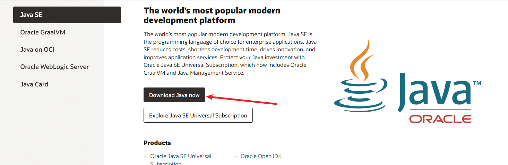
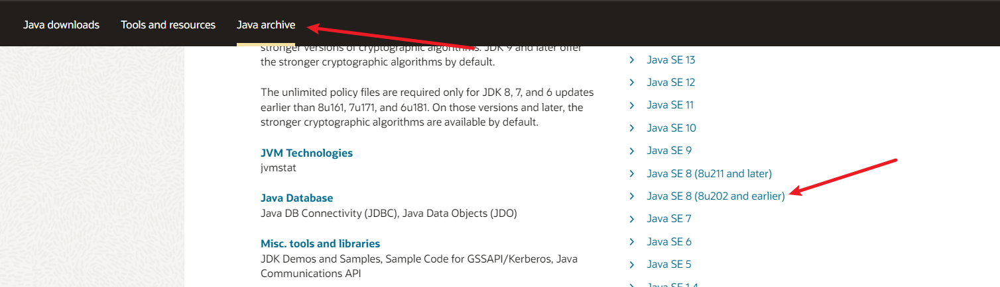
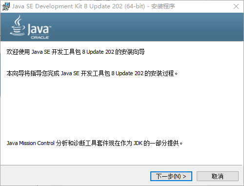
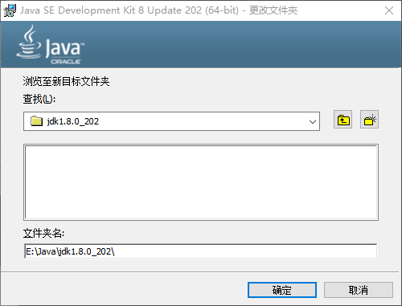
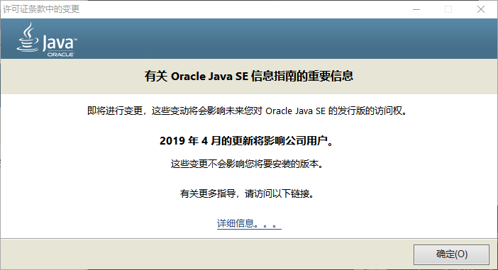
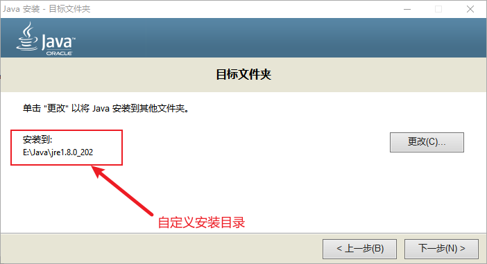
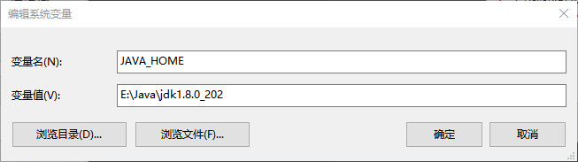
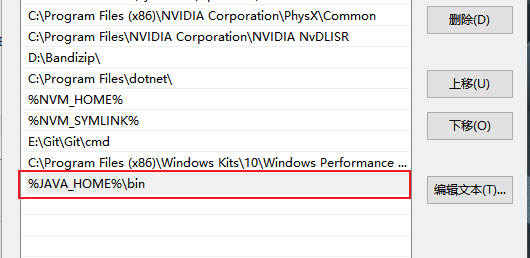
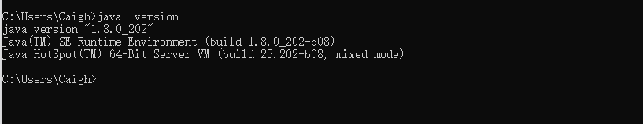

# Window10安装Java SE 8 (8u212) 版本

## 一、JDK 和 JRE 的概念

在安装 Java SE 8 之前，先了解一下我们要安装的 JDK / JRE 的概念。

`JDK` 的全称是 `Java Development Kit`，即 Java 开发工具包，是 Sun 公司提供的一套用于开发 Java 应用程序的开发包，它提供了编译、运行 Java 程序所需的各种工具和资源，包括 Java 编译器、Java 运行时环境（`JRE`），以及常用的 Java类库 等。

`JRE`，全称 `Java Runtime Environment` ，Java 运行时环境。它是运行 Java 程序的必须条件。如果只是运行Java 程序，可以只安装 `JRE`，无需安装 `JDK`。

一般都是直接安装 `JDK`，因为 `JDK` 内置了一个 `JRE`

### 1.1、JDK选择

了解完 `JDK` 概念之后，我们还要了解下目前 `JDK` 的现状。Sun 公司当初开发了 Java 语言，作为 Java 语言的开发工具包， `JDK` 在发展中被 Sun 公司分化为了两大分支。

- `Open JDK` ，开源（源代码公开）版本，以 GPL V2（General Public License）协议的形式开源
- `Sun JDK` ，使用 JRL（Java Research License，Java 研究授权协议）发布。

其实两个分支版本，在发展中有很大部分的相同代码，不过`Open JDK`不如 `Sun JDK` 完整是肯定的(缺少一些特性API)，且一部分代码由于产权等原因无法授权给 `Open JDK` 使用，便在 `Open JDK` 中替换为没有产权问题的代码。

很多大公司为了避免版权问题，都在使用基于 `Open JDK` 开发或自主开发的 JDK 版本，例如亚马逊的 Corretto、阿里巴巴的 Dragonwell、华为的毕昇等

另外，Sun （升阳公司）在2009年被 Oracle（甲骨文公司）收购了，Java 相关业务及版权也就归Oracle 所有。后续的 `JDK` 更新当然也就由 Oracle 负责了。在2009年到2019年期间，Oracle 没有做什么收费的大动作，但是这种情况在2019年1月1日出现了点变化。Oracle 宣布从2019年1月1日起，`Oracle JDK 8` 的后续更新将需要收费。`Oracle JDK 8` 的 `8u211` 和 `8u212`更新，开始把许可协议从 `BCL` 换成了 `OTN`，这就意味着，你不能在生产环境使用这类版本了。所以这里以 `Oracle JDK 8`的 `8u212`版本。

### 1.2、JDK下载

进入[Oralce官网](https://www.oracle.com/)，点击 `Products` 栏，在 `Hardware and Software` 标题栏找到 java


点击进入之后，找到 Download Java now 按钮



进入到下载页面，切换到 Java archive 下滚找到 Java SE 8 (8u212) 版本即可



找到对应操作系统的安装包点击下载即可

## 二、JDK安装流程

下载好了，开始安装 `JDK`

1、双击程序安装包，开始进行 `JDK` 安装，点击下一步。



2、点击更改，更改 `JDK` 的安装位置。



这个时候程序将要安装的位置已经更改，点击下一步即可开始安装。

安装完 `JDK` 后，会弹出一个提示框，提示我们安装的 `JDK` 版本不受到收费影响，点确定即可。



3、因为刚才我们没有放弃独立 `JRE` 的安装，所以现在开始安装它，自己更改好安装路径。



点击下一步，等待安装，安装成功点击关闭，即完成安装。

## 三、添加 jdk 的环境变量

在 window10 环境中打开编辑系统环境变量，在 用户变量 和 系统变量 中选择在 系统变量 添加一个JAVA_HOME变量



然后在系统变量的Path新建添加



输入以下命令，验证是否安装成功

```bash
java -version
```


