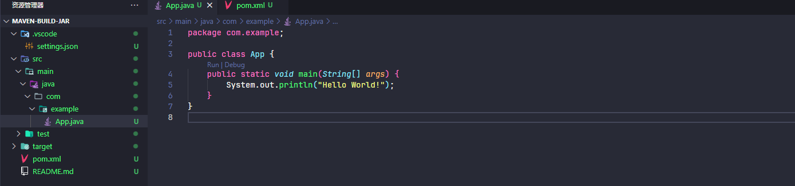
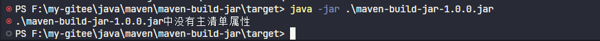

# Maven项目构建jar包

首先通过 vscode 创建 maven 项目，选择 maven-archetype-quickstart 项目模板



在项目的 pom.xml 中添加配置

```xml
<packaging>jar</packaging>
```

安装maven的相关依赖，如何在进行 mvn package 命令构建，在 target 目录中会生成对应的 jar 包文件。

然而在通过 java -jar 命令运行时发现无法执行，原因缺少主清单属性，如下图所示



需要添加 maven-jar-plugin 的构建插件处理该问题

在 pom.xml 的 plugins 标签下添加以下配置

```xml
<plugin>
    <groupId>org.apache.maven.plugins</groupId>
    <artifactId>maven-jar-plugin</artifactId>
    <version>3.4.2</version>
    <configuration>
        <archive>
            <manifest>
                <addClasspath>true</addClasspath> 
                <mainClass>com.example.App</mainClass>
            </manifest>
        </archive>
    </configuration>
</plugin>
```

然后进行依赖包重新安装，项目重新编译构建新的 jar 包，执行 java -jar 命令

```bash
java -jar .\maven-build-jar-1.0.0.jar
```

这样就成功构建了 jar 包

