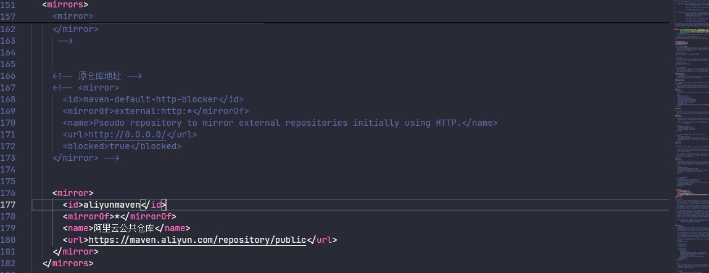

# Window10安装maven环境配置

## 一、安装下载maven

先到官方地址下载 maven：https://maven.apache.org/download.cgi，下载完成之后解压到指定位置即可


## 二、配置 maven 环境变量

添加 M2_HOME 系统变量，变量值对应自己 maven 目录下的bin目录


添加 MAVEN_HOME 系统变量，变量值对应自己的 maven 目录


在系统 Path 中配置 %MAVEN_HOME%\bin


使用以下命令检查 maven 是否安装成功

```bash
mvn -version
```

## 三、指定本地仓库

在解压后文件夹中的conf文件夹下有setting.xml配置文件


打开 settings.xml 文件，找到红框的部分，默认是注释的，在后面添加自定义的仓库地址即可


## 四、配置阿里云提供的镜像仓库

同样的打开 settings.xml 文件，找到以下红框内的部分


注释原来仓库配置代码，添加阿里云的镜像仓库代码

```xml
<mirror>
  <id>aliyunmaven</id>
  <mirrorOf>*</mirrorOf>
  <name>阿里云公共仓库</name>
  <url>https://maven.aliyun.com/repository/public</url>
</mirror>
```



保存即可
