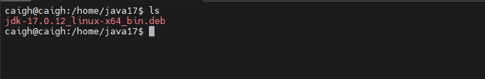
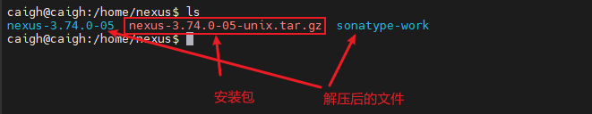
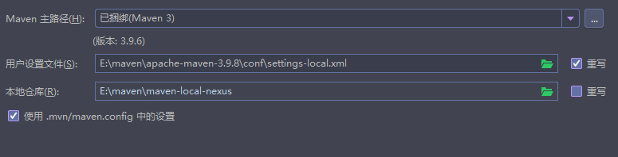

# Nexus搭建Maven私服

## 一、环境准备

1. ubantu操作系统，版本22.04
2. 需要先安装 java 环境，这里以安装 java17 为例
3. 在官网安装 nexus 安装包

java17下载地址：https://www.oracle.com/java/technologies/javase/jdk17-archive-downloads.html

java17安装包：https://download.oracle.com/java/17/archive/jdk-17.0.12_linux-x64_bin.deb

nexus下载地址：https://help.sonatype.com/en/orientdb-downloads.html

nexus安装包：https://sonatype-download.global.ssl.fastly.net/repository/downloads-prod-group/3/nexus-3.74.0-05-unix.tar.gz

## 二、Java17安装

将下载好的 java17 deb包通过 SSH 连接终端工具上传到 /home/java17 目录下，如下：



通过以下命令进行安装

```bash
sudo dpkg -i jdk-17.0.12_linux-x64_bin.deb
```

安装完成之后，可以通过 java -version 进行检查是否安装成功

## 三、安装Nexus

将下载好的 nexus 安装包通过终端工具上传到 /home/nexus 目录下，然后将安装包进行解压操作

```bash
sudo tar -zxvf nexus-3.74.0-05-unix.tar.gz
```

解压完成之后完成之后多出 nexus-3.74.0-05 和 sonatype-work 两个目录



```bash
cd nexus-3.74.0-05/bin
./nexus start # 运行nexus
./nexus stop # 停止nexus
```

默认开放的端口为 8081，默认账户为 **admin** ， 默认密码在 /home/nexus/sonatype-work/nexus3/admin.password  文件中。使用默认账户登录成功，会要求立即修改密码

```bash
cat  /home/nexus/sonatype-work/nexus3/admin.password # 查看默认密码
```

## 四、配置Nexus开机自启

```bash
cd /etc/systemd/system
sudo touch nexus.service # 创建nexus.service
sudo chmod 777 nexus.service # 添加执行权限
```

编辑 nexus.service

```sh
# nexus.service 配置
[Unit]
Description=nexus service
After=network.target

[Service]
Type=forking
ExecStart=/home/nexus/nexus-3.74.0-05/bin/nexus start
ExecStop=/home/nexus/nexus-3.74.0-05/bin/nexus stop
Restart=on-abort

[Install]
WantedBy=multi-user.target
```

重新加载 systemd 配置

```bash
sudo systemctl daemon-reload
```

设置 nexus 的开机启动

```bash
sudo systemctl enable nexus
```

## 五、Nexus配置私有仓库

### 5.1、Nexus 仓库概念

```text
nexus 默认已建好4个库，简单解析下各个库的作用
maven-central 默认配好的中央仓库，指向 https://repo1.maven.org/maven2/ 
maven-releases 一般用于自己存放自己开发项目的稳定版本，默认不能重复发布，即deploy,可以设置为允许重复 deploy
maven-snapshots 一般用于存放自己开发项目的快照版本，默认允许重复发布
maven-public 组合库，一般是组合以上三种库，通常在项目中配置这个仓库
```

```text
group：仓库聚合，默认是 releases > snapshots > central，可以在仓库管理界面引入其他配置的库，并设置顺序
hosted：私有仓库，存放自己开发的jar
snapshots：本地项目的快照仓库
releases： 本地项目发布的正式版本
proxy：代理类型，可以配置aliyun的仓库
central：中央仓库
```

### 5.2、修改 maven 服务下的setting.xml

建议将 setting.xml 复制一份命名为  setting-local.xml 

```xml
<?xml version="1.0" encoding="UTF-8"?>
<settings xmlns="http://maven.apache.org/SETTINGS/1.2.0"
          xmlns:xsi="http://www.w3.org/2001/XMLSchema-instance"
          xsi:schemaLocation="http://maven.apache.org/SETTINGS/1.2.0 https://maven.apache.org/xsd/settings-1.2.0.xsd">

<!-- localRepository 建议构建一个新的目录，本地存在的jar包不会通过nexus进行下载了 -->
  <localRepository>
    E:\maven\maven-local-nexus
  </localRepository>
  <pluginGroups></pluginGroups>
  <proxies></proxies>
  <servers></servers>
  <!-- 配置 nexus 作为 jar 包下载地址，本地没有就会去代理的远程仓库进行下载 -->
  <mirrors>
    <mirror>
      <id>maven-public</id>
      <mirrorOf>central</mirrorOf>
      <name>Nexus Repo</name>
      <url>http://192.168.1.215:8081/repository/maven-public/</url>
    </mirror>
  </mirrors>
  <profiles></profiles>
</settings>
```

使用 idea 编辑器创建 maven 项目，并配置 maven 设置



因为我在前面禁用了匿名访问，所以需要继续配置 setting-local.xml。如果允许了匿名访问，就无需以下配置

```xml
<server>
  <id>maven-public</id>
  <username>admin</username>
  <password>caigh123</password>
</server>
```

🔔注意：server 标签内的 id 标签值必须和 mirror 标签中的 id 值一样。

以上就可以通过本地 nexus 私服仓库下载 jar 包了

### 5.3、将 jar 包上传到 Nexus

在 maven 项目工程的 pom.xml 添加以下配置

```xml
<!-- deploy 上传jar包  -->
<distributionManagement>
  <repository>
    <id>maven-public</id>
    <name>Nexus Release</name>
    <url>http://192.168.1.215:8081/repository/maven-releases/</url>
  </repository>
  <snapshotRepository>
			<id>maven-public</id>
			<name>Nexus Snapshots</name>
			<url>http://192.168.1.215:8081/repository/maven-snapshots/</url>
		</snapshotRepository>
</distributionManagement>
```

🔔注意：repository 标签内的 id 标签值必须和 maven的 setting-local.xml 配置的 server 标签中的 id 值一样。

上传jar通常上传到 maven-releases，maven-snapshots 仓库中，主要与 maven-public 从远程下载下来的 jar 包进行区分开。

然后执行 mvn deploy 即可发布成功