# Java普通项目构建jar包

在学习使用 maven 构建工具之前，需要了解在没有 maven 构建工具是如何对项目进行编写构建。在这里推荐使用 vscode 作为编辑器，原因是 vscode 构建 java 普通项目更为简洁、高效。

### 1、vscode 安装相关 Java 插件

vscode 只需要安装 Extension Pack for Java 插件即可，会推荐安装一系列的扩展包

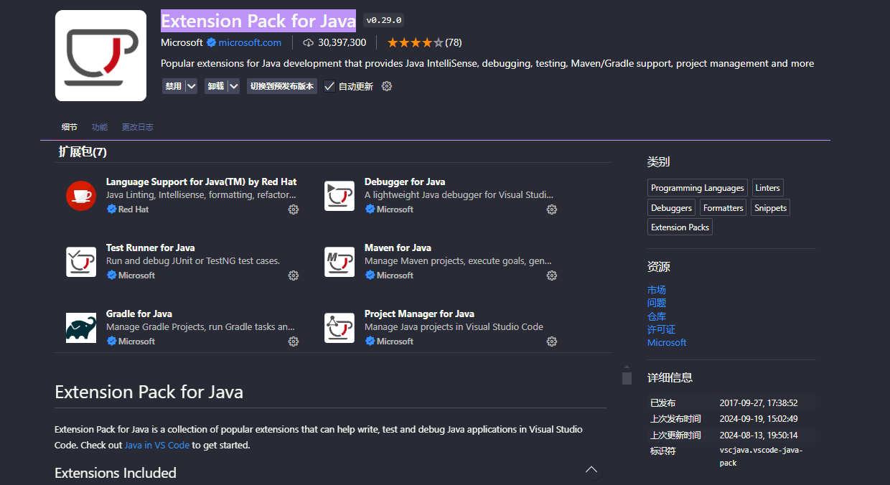

### 2、vscode 创建项目

ctrl + shift + p 输入 java 选择创建java项目，如下图所示

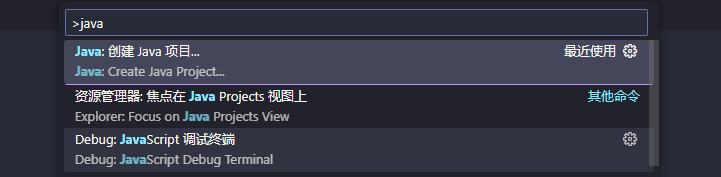

然后就是选择项目类型，选择 No build tools

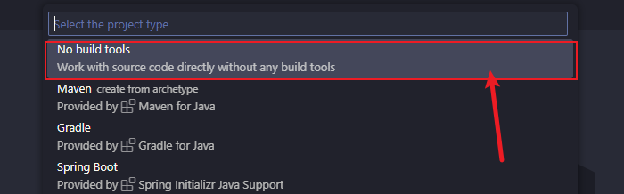

后续按照指定操作即可，这里不做详细描述。

### 3、项目结构

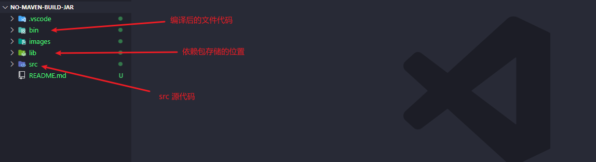

### 4、查看项目编译配置

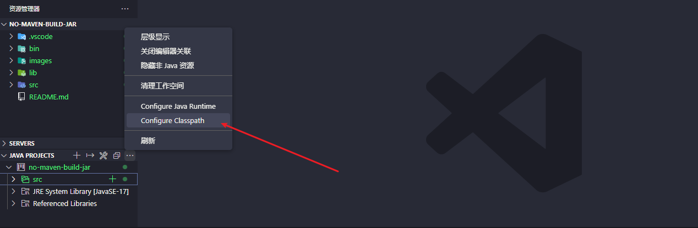

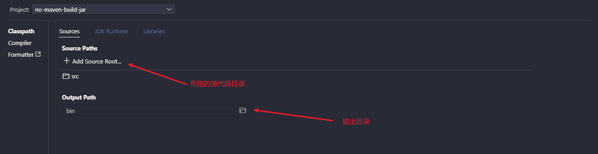

### 5、导入项目依赖jar包的二种方式

#### 5.1、在Configure ClassPath设置中添加

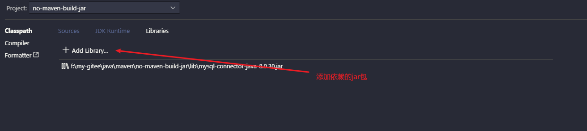

或

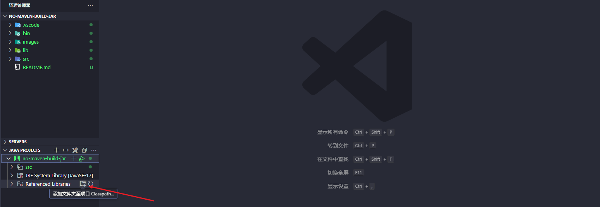

#### 5.2、将下载好的jar包放入lib文件夹

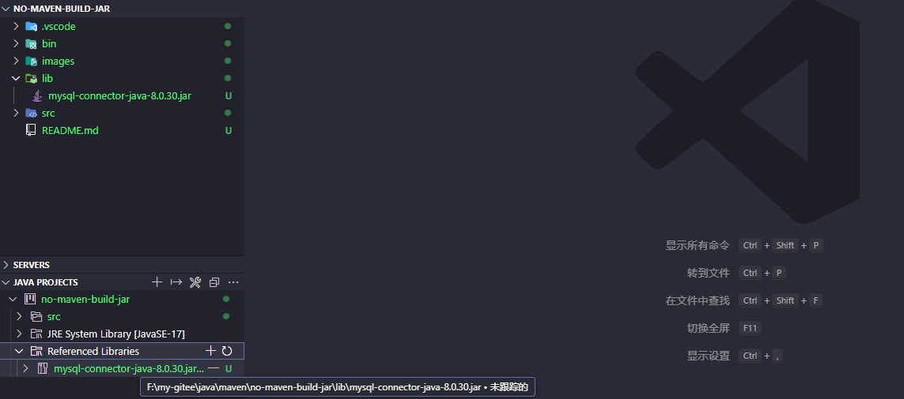

### 6、测试导入的依赖包使用

```java
import java.sql.Connection;
import java.sql.DriverManager;
import java.sql.PreparedStatement;
import java.sql.ResultSet;
import java.sql.SQLException;

public class App {
    public static void main(String[] args) throws Exception {
        Connection conn = null;
        try {
            String url = "jdbc:mysql://localhost:3306/company?useUnicode=true&characterEncoding=utf-8&useSSL=false";
            String username = "root";
            String password = "root123";

            // 2，加载驱动
            Class.forName("com.mysql.cj.jdbc.Driver");
            // 3.连接数据库
            conn = DriverManager.getConnection(url, username, password);
        } catch (ClassNotFoundException e) {
            e.printStackTrace();
            System.out.println("驱动类找不到");
        } catch (SQLException e) {
            e.printStackTrace();
            System.out.println("数据库连接失败");
        }

        String sql = "SELECT * FROM employees";
        PreparedStatement preparedStatement = conn.prepareStatement(sql);
        // 4.执行语句
        ResultSet rs = preparedStatement.executeQuery();

        while (rs.next()) {
            // 通过字段名获取对象值
            int id = rs.getInt("employee_id");
            // 通过字段列序号获取值
            String name = rs.getString(2);
            String email = rs.getString(3);
            System.out.println(String.format("id: %d, name: %s, email: %s", id, name, email));
        }

        rs.close();
        preparedStatement.close();
        conn.close();
    }
}
```

执行代码结果如下

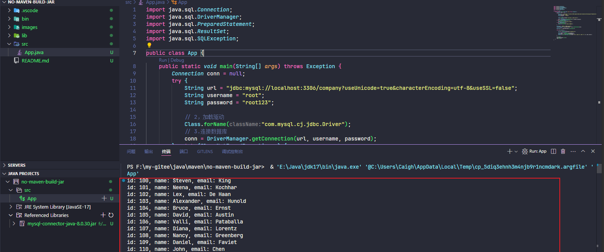

### 7、导出jar包并运行

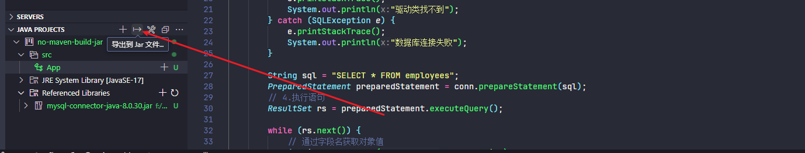

通过以下命令执行编译好的 jar 包

```bash
java -jar .\no-maven-build-jar.jar
```

执行结果和编译前单独运行 App.java 文件一样
