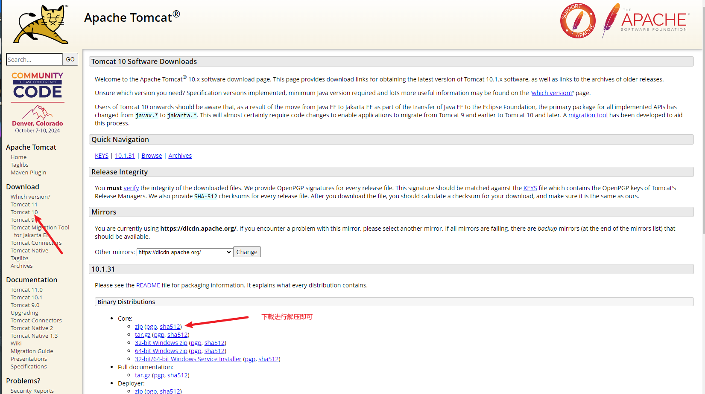

# Java普通项目构建war包

在学习使用 maven 构建工具之前，需要了解在没有 maven 构建工具是如何对项目进行编写构建。在这里推荐使用 vscode 作为编辑器，原因是 vscode 构建 java 普通项目更为简洁、高效。

### 1、安装 tomcat 

war 包的运行需要 tomcat，所以首先需要安装 tomcat ，官网地址：https://tomcat.apache.org/。 这里安装以 window 操作系统安装 tomcat 10 为例。



vscode 安装 Community Server Connectors 用来管理 tomcat


Community Server Connectors 插件创建新服务器


选择本地磁盘安装的服务


选择 tomcat 解压后的目录路径


点击 Finish


启动 tomcat


在浏览器输入 http://localhost:8080/ 访问成功

### 2、war包目录结构


在项目中创建 tartget 目录，target 目录下创建相关目录


修改项目编译设置，将 src 的 java 代码编译后 class 文件输出到 target\WEB-INF\classes，然后可以删除 bin 目录


然后还需要对 target\WEB-INF\web.xml 文件进行修改

```xml
<web-app>
  <display-name>Java Web Application</display-name>

  <servlet>
    <servlet-name>App</servlet-name>
    <!-- 指定 lib 对于类目入口 -->
    <servlet-class>App</servlet-class>
  </servlet>
  <servlet-mapping>
    <!-- 配置访问路径，当访问 /example 时，触发 servlet-name 对于的 App 与 servlet 标签的 servlet-name 对于并执行相关类 -->
    <servlet-name>App</servlet-name>
    <url-pattern>/example</url-pattern>
  </servlet-mapping>
</web-app>
```

### 3、构建部署 war 包

然后通过 jar 命令构建 war 包

```bash
cd target
jar cvf target.war *
```

部署 target.war 包


按照提示选择 tartget.war 文件即可


在浏览器输入 http://localhost:8080/target/ 即部署成功
