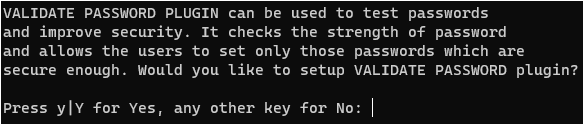

# Spring Cloud Alibaba微服务快速入门

## 一、Mysql安装

### 3.1、Mysql安装

nacos 的存储是支持数据库存储的，这里使用 Mysql 数据库进行安装，这里以 Ubantu22.04 TLS 安装 Mysql。

```bash
# 更新 apt 仓库信息
sudo apt update

# 查询库中Mysql版本
sudo apt search mysql-server

# 安装Mysql
sudo apt install -y mysql-server
```

启动 Mysql

```bash
/etc/init.d/mysql start			# 启动
/etc/init.d/mysql stop			# 停止
/etc/init.d/mysql status		# 查看状态
# 或者
sudo systemctl start mysql # 启动
sudo systemctl stop mysql # 停止
sudo systemctl status mysql # 查看状态
```

设置 Mysql 开机自动启动

```bash
sudo systemctl enable mysql # 开机自启
sudo systemctl disable mysql # 开机关闭自启
```

### 3.2、设置Mysql登录密码

```bash
# 第一步：执行 mysql
mysql
# 第二步：设置 root密码
ALTER USER 'root'@'localhost' IDENTIFIED WITH mysql_native_password BY 'password';
# 第三步：退出
exit # or ctrl
```

### 3.3、对 Mysql 进行初始化

```bash
# 执行如下命令，此命令是MySQL安装后自带的配置程序
mysql_secure_installation
```

输入密码：


是否开启密码验证插件，如果需要增强密码安全性，输入y并回车，不需要直接回车（本次选择直接回车）:



是否更改root密码，需要输入y回车，不需要直接回车（本次不更改）:


是否移除匿名用户，移除输入y回车，不移除直接回车（本次选择移除）：


是否进制root用户远程登录，禁止输入y回车，不禁止直接回车（本次选择不禁止）:


是否移除自带的测试数据库，移除输入y回车，不移除直接回车（本次选择不移除）:


是否刷新权限，刷新输入y回车，不刷新直接回车（本次选择刷新）：


### 3.4、登录Mysql

```bash
mysql -uroot -p
# 输入密码即可登陆成功
```

## 二、Mysql远程连接问题

### 4.1、防火墙通过ufw进行关闭防火墙

```bash
# 安装 ufw
sudo apt install ufw

sudo ufw enable # 开启防火墙
sudo ufw disable # 关闭防火墙
sudo ufw status # 查看防火墙状态
```

### 4.2、修改root表host

```bash
use mysql;
select user,host from user;
```


如果是这种情况，在命令行输入以下三条命令修改

```bash
use mysql; 
update user set host = '%' where user = 'root';
```

见 root 的 host 是%，%代表可以从任何IP登陆 MySQL，修改完成之后重启 Mysql 服务即可

```bash
sudo systemctl restart mysql
```

### 2.3、 修改MySQL配置文件

找到 MySQL 的配置文件 my.cnf 或 mysqld.cnf。这个文件通常位于 /etc/mysql/、或 /etc/mysql/mysql.conf.d/ 目录下

```bash
sudo vi mysqld.cnf
```

注释原来内容，添加以下内容

```tex
bind-address = 0.0.0.0
```

重启 MySQL 服务来使更改生效

## 三、Nacos安装

先从 [Nacos官网](https://nacos.io/download/nacos-server) 下载安装包，然后再上传到服务器，或者可以通过 curl 和 wget 命令下载到服务器本地。完成之后再进行解压

```bash
tar -xvf nacos-server-$version.tar.gz
```

然后修改配置文件，使用 Mysql 数据库作为持久化

```bash
cd nacos/conf
sudo vim application.properties
```

修改配置如下

```bash
spring.datasource.platform=mysql
db.num=1
db.url.0=jdbc:mysql://127.0.0.1:3306/nacos?characterEncoding=utf8&connectTimeout=1000&socketTimeout=3000&autoReconnect=true&useUnicode=true&useSSL=false&serverTimezone=UTC
db.user.0=root
db.password.0=caigh123
```

Nacos 提供了两种部署运行模式：`单机模式` 和 `集群模式`，这里以单机模式进行运行

```bash
cd /nacos/nacos/bin
sudo ./startup.sh -m standalone
```

## 四、微服务项目搭建

在一个父子工程的 maven 项目中，创建 gateway、order-service、stock-service 子项目。

### 4.1、服务注册

在 order-service、stock-service 的子项目修改 pom.xml 

```xml
<!--    服务注册    -->
<dependency>
    <groupId>com.alibaba.cloud</groupId>
    <artifactId>spring-cloud-starter-alibaba-nacos-discovery</artifactId>
</dependency>
```

然后还需要使用 @EnableDiscoveryClient 注解开启服务注册和发现

```java
// StockService
@SpringBootApplication
@EnableDiscoveryClient
public class StockApplication {

	public static void main(String[] args) {
		SpringApplication.run(StockApplication.class, args);
	}

}

// OrderService
@SpringBootApplication
@EnableDiscoveryClient
@EnableFeignClients
public class OrderApplication {

	public static void main(String[] args) {
		SpringApplication.run(OrderApplication.class, args);
	}
}
```

然后需要修改 application.yml 项目配置文件

```yaml
# order-service
server:
  port: 8080
spring:
  application:
    name: order-service
  cloud:
    nacos:
      discovery:
        server-addr: 192.168.1.204:8848
        
# stock-service        
server:
  port: 8081
spring:
  application:
    name: stock-service
  cloud:
    nacos:
      discovery:
        server-addr: 192.168.1.204:8848
```

项目运行之后，nacos 服务列表就会出现两个服务注册成功


### 4.2、服务发现

需要给 order-service、stock-service 项目添加相关依赖

```xml
<!--    服务发现    -->
<dependency>
    <groupId>org.springframework.cloud</groupId>
    <artifactId>spring-cloud-loadbalancer</artifactId>
</dependency>
```

如何调用其他服务，在 controller 进行调用其他服务

```java
import org.springframework.web.client.RestTemplate;

@RestController
public class OrderCtrl {
    @Autowired
    RestTemplate restTemplate;
  
    // 普通下单接口
    @GetMapping("/order")
    public String order() {
        return "下单成功";
    }

    // 通过 RestTemplate 调取其他微服务接口，例如：下单成功之后需要扣除库存
    @GetMapping("/stock/deduct")
    public String decuctStock() {
        return this.restTemplate.getForObject("http://stock-service/stock", String.class);
    }
}
```

### 4.3、将其他服务调用封装成Service

首先需要加入相关依赖

```xml
<dependency>
    <groupId>org.springframework.cloud</groupId>
    <artifactId>spring-cloud-starter-openfeign</artifactId>
</dependency>
```

将 `this.restTemplate.getForObject("http://stock-service/stock", String.class)` 调用改成方法调用

```java
/**
 * 查找 stock-service
 */
@FeignClient(name = "stock-service")
public interface StockService {
    // 需要和 stock-service 的url一致
    @GetMapping("/stock")
    String deductStock();
}
```

相关调用如下

```java
@RestController
public class OrderCtrl {
    @Autowired
    StockService stockService;

    // 通过 FeignClient 调取微服务
    @GetMapping("/stock/deduct")
    public String decuctStock() {
        return this.stockService.deductStock();
    }
}

```

### 4.4、nacos提供配置

主要是将项目的一些自定义配置放到 nacos 上

添加相关依赖

```xml
<dependency>
    <groupId>com.alibaba.cloud</groupId>
    <artifactId>spring-cloud-starter-alibaba-nacos-config</artifactId>
</dependency>
```

如何还需要修改 application.yml

```yml
server:
  port: 8080
spring:
  application:
    name: order-service
  cloud:
    nacos:
      discovery:
        server-addr: 192.168.1.204:8848
      # 配置文件地址
      config:
        server-addr: 192.168.1.204:8848
  config:
    # 需要导入的文件名
    import:
      - nacos:custom.yml
```

在 nacos 可以创建 custom.yml


调用配置参数，以及当配置修改时配置 @RefreshScope 注解实现热更新刷新

```java
@RestController
@RefreshScope // 当配置修改时，自动热更新刷新
public class StockCtrl {
    @Value("${author}")
    String author;
}
```

## 五、网关

当微服务过多时调用的接口和 ip 也就会过多，前端调用可能就会希望调用一个 ip 地址，而网关可以提供 ip 共前端调用，同时还能微服务之间的负载均衡。


添加相关依赖

```xml
<dependencies>
    <!--    网关    -->
    <dependency>
        <groupId>org.springframework.cloud</groupId>
        <artifactId>spring-cloud-starter-gateway</artifactId>
    </dependency>

    <!--    路由分发    -->
    <dependency>
        <groupId>org.springframework.cloud</groupId>
        <artifactId>spring-cloud-loadbalancer</artifactId>
    </dependency>

    <dependency>
        <groupId>com.alibaba.cloud</groupId>
        <artifactId>spring-cloud-starter-alibaba-nacos-config</artifactId>
    </dependency>
</dependencies>
```

配置 application.yml

```yml
server:
  port: 8888
spring:
  application:
    name: gateway
  cloud:
    nacos:
      discovery:
        server-addr: 192.168.1.204:8848
      config:
        server-addr: 192.168.1.204:8848
  # 使用 nacos 配置
  config:
    import:
      - nacos:gateway.yml
```

gateway.yml 配置如下

```yml
spring:
  cloud:
    gateway:
      # 路由规则
      routes:
        - id: order_route
          uri: lb://order-service
          # 断言规则用于路由规则的匹配
          predicates:
            - Path=/order/**
        - id: stock_route
          uri: lb://stock-service
          # 断言规则用于路由规则的匹配
          predicates:
            - Path=/stock/**
```

## 六、分布式事务

分布式事务是需要安装 [Seata服务](https://seata.apache.org/zh-cn/)，同时还需要相关配置，详细见 [Seata官网](https://seata.apache.org/zh-cn/)

添加相关依赖

```xml
<!--    分布式事务    -->
<dependency>
    <groupId>com.alibaba.cloud</groupId>
    <artifactId>spring-cloud-starter-alibaba-seata</artifactId>
</dependency>
```

调用可以通过 @GlobalTransactional 进行调用

```java
@RestController
public class OrderCtrl {
    @Autowired
    RestTemplate restTemplate;

    // 通过 RestTemplate 调取其他微服务接口，例如：下单成功之后需要扣除库存
    @GetMapping("/stock/deduct")
    @GlobalTransactional // 分布式事务
    public String decuctStock() {
        return this.restTemplate.getForObject("http://stock-service/stock", String.class);
    }
}
```


## 

