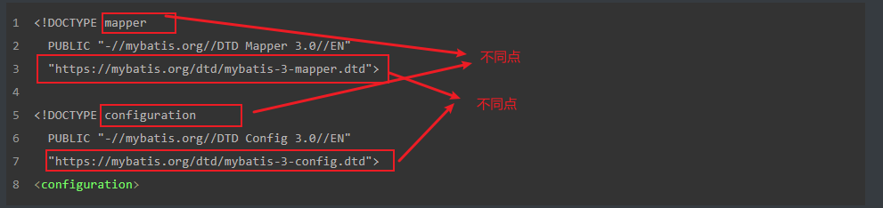
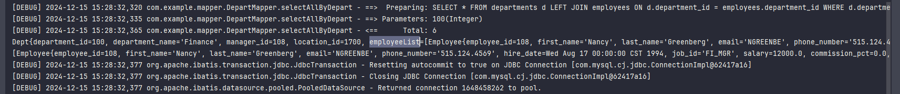
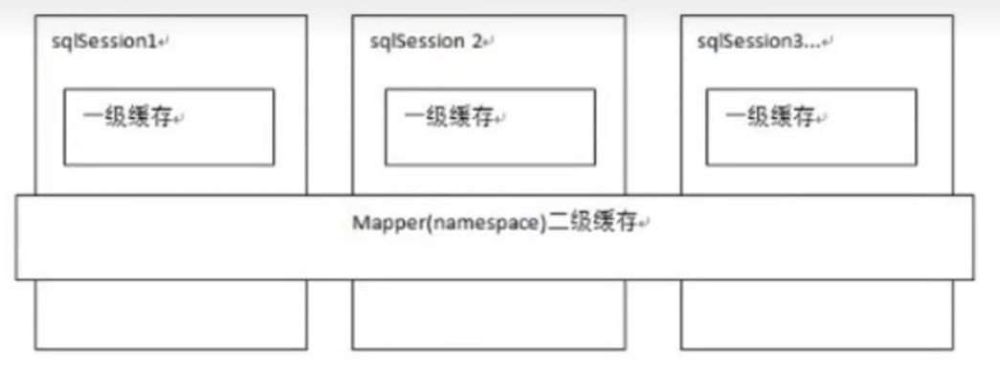
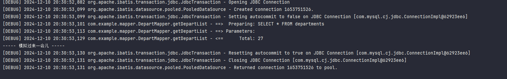
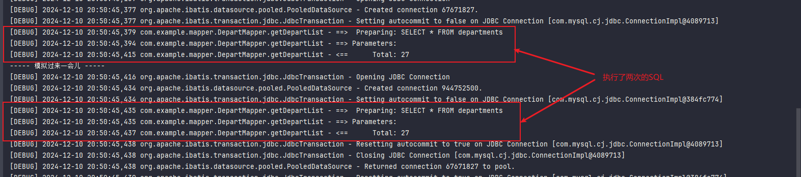
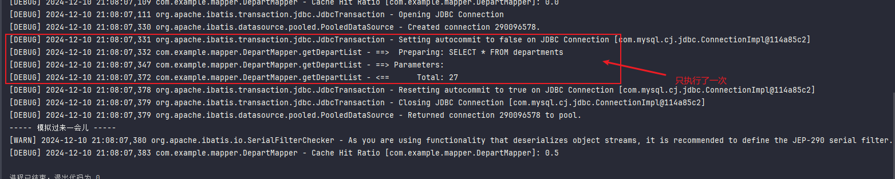

# Mybatis快速入门

## 一、Mybatis介绍

MyBatis 是一款优秀的持久层框架，它支持自定义 SQL、存储过程以及高级映射。MyBatis 免除了几乎所有的 JDBC 代码以及设置参数和获取结果集的工作。MyBatis 可以通过简单的 XML 或注解来配置和映射原始类型、接口和 Java POJO（Plain Old Java Objects，普通老式 Java 对象）为数据库中的记录。

## 二、创建Maven项目并添加Mybatis依赖

```xml
<!-- https://mvnrepository.com/artifact/org.mybatis/mybatis -->
<dependency>
  <groupId>org.mybatis</groupId>
  <artifactId>mybatis</artifactId>
  <version>3.5.16</version>
</dependency>
```

## 三、Mybatis配置文件

mybatis 配置文件是一个xml文件，在 src/main/resources 创建 mybatis-config.xml 文件。

```xml
<?xml version="1.0" encoding="UTF-8" ?>
<!DOCTYPE configuration
        PUBLIC "-//mybatis.org//DTD Config 3.0//EN"
        "https://mybatis.org/dtd/mybatis-3-config.dtd">
<configuration>
    <!--  Mybatis 配置如下  -->
</configuration>
```

各项配置可以参考 mybatis 中文网说明：https://mybatis.p2hp.com/configuration.html

当前 mybatis 配置如下：

```xml
<?xml version="1.0" encoding="UTF-8" ?>
<!DOCTYPE configuration
        PUBLIC "-//mybatis.org//DTD Config 3.0//EN"
        "https://mybatis.org/dtd/mybatis-3-config.dtd">
<configuration>
    <!--  Mybatis 配置如下  -->
    <!-- 加载properties相关配置文件，需要放在首位，需要在resource目录添加 db.properties -->
    <properties resource="db.properties"></properties>

    <!--  environments 配置  -->
    <environments default="dev">
        <!-- 模拟 dev 数据库 -->
        <environment id="dev">
            <!-- 当前的事务类型是 jdbc -->
            <transactionManager type="JDBC"/>
            <dataSource type="POOLED">
                <property name="driver" value="${jdbc.driver}"/>
                <property name="url" value="${jdbc.url}"/>
                <property name="username" value="${jdbc.username}"/>
                <property name="password" value="${jdbc.password}"/>
            </dataSource>
        </environment>
        <!-- 模拟 perf 数据库 -->
        <environment id="perf">
            <transactionManager type="JDBC"/>
            <dataSource type="POOLED">
                <property name="driver" value="${jdbc.driver}"/>
                <property name="url" value="${jdbc.url}"/>
                <property name="username" value="${jdbc.username}"/>
                <property name="password" value="${jdbc.password}"/>
            </dataSource>
        </environment>
    </environments>
</configuration>
```

db.properties 配置如下

```properties
jdbc.driver=com.mysql.cj.jdbc.Driver
jdbc.url=jdbc:mysql://localhost:3306/company
jdbc.username=root
jdbc.password=root123
```

在代码中加载 mybatis-config.xml 文件

```java
package com.example;

import org.apache.ibatis.io.Resources;
import org.apache.ibatis.session.SqlSession;
import org.apache.ibatis.session.SqlSessionFactory;
import org.apache.ibatis.session.SqlSessionFactoryBuilder;
import org.junit.jupiter.api.Test;

import java.io.IOException;
import java.io.InputStream;

public class App {
    /**
     * 测试获取 mybatis-config.xml 配置文件
     */
    @Test
    public void testGetMybatisConfig() throws IOException {
        // 获取SqlSessionFactoryBuilder对象
        SqlSessionFactoryBuilder sqlSessionFactoryBuilder = new SqlSessionFactoryBuilder();
        InputStream is = Resources.getResourceAsStream("mybatis-config.xml"); // Resources.getResourceAsStream 默认就是从类的根路径下查找资源

        // 获取SqlSessionFactory对象
        SqlSessionFactory sqlSessionFactory = sqlSessionFactoryBuilder.build(is); // 一般情况都是一个数据库对应一个 SqlSessionFactory 对象

        // 获取SqlSession对象
        SqlSession sqlSession = sqlSessionFactory.openSession();
        // SqlSession sqlSession1 = sqlSessionFactory.openSession(); // 可以定义多个 sqlSession
    }
}
```

## 四、XML配置Sql语句

步骤一：在项目中 domain 包定义一个 Employee 实体类

```java
package com.example.domain;

import java.util.Date;

/**
 * Employee 实体类
 */
public class Employee {
    private Integer employee_id;
    private String first_name;
    private String last_name;
    private String email;
    private String phone_number;
    private Date hire_date;
    private String job_id;
    private double salary;
    private double commission_pct;
    private int manager_id;
    private int department_id;

    @Override
    public String toString() {
        return "Employee{" +
                "employee_id=" + employee_id +
                ", first_name='" + first_name + '\'' +
                ", last_name='" + last_name + '\'' +
                ", email='" + email + '\'' +
                ", phone_number='" + phone_number + '\'' +
                ", hire_date=" + hire_date +
                ", job_id='" + job_id + '\'' +
                ", salary=" + salary +
                ", commission_pct=" + commission_pct +
                ", manager_id=" + manager_id +
                ", department_id=" + department_id +
                '}';
    }

    public Integer getEmployee_id() {
        return employee_id;
    }

    public void setEmployee_id(Integer employee_id) {
        this.employee_id = employee_id;
    }

    public String getFirst_name() {
        return first_name;
    }

    public void setFirst_name(String first_name) {
        this.first_name = first_name;
    }

    public String getLast_name() {
        return last_name;
    }

    public void setLast_name(String last_name) {
        this.last_name = last_name;
    }

    public String getEmail() {
        return email;
    }

    public void setEmail(String email) {
        this.email = email;
    }

    public String getPhone_number() {
        return phone_number;
    }

    public void setPhone_number(String phone_number) {
        this.phone_number = phone_number;
    }

    public Date getHire_date() {
        return hire_date;
    }

    public void setHire_date(Date hire_date) {
        this.hire_date = hire_date;
    }

    public String getJob_id() {
        return job_id;
    }

    public void setJob_id(String job_id) {
        this.job_id = job_id;
    }

    public double getSalary() {
        return salary;
    }

    public void setSalary(double salary) {
        this.salary = salary;
    }

    public int getManager_id() {
        return manager_id;
    }

    public void setManager_id(int manager_id) {
        this.manager_id = manager_id;
    }

    public double getCommission_pct() {
        return commission_pct;
    }

    public void setCommission_pct(double commission_pct) {
        this.commission_pct = commission_pct;
    }

    public int getDepartment_id() {
        return department_id;
    }

    public void setDepartment_id(int department_id) {
        this.department_id = department_id;
    }
}
```

步骤二：在 mybatis-config.xml 文件中需要加载实体类，配置如下：

```xml
<!--  设置加载实体类 Bean  -->
<typeAliases>
    <!-- 方式一： 加载单个实体类 -->
    <typeAlias type="com.example.domain.Employee"/>
    <!-- 给实体类设置别名 -->
    <typeAlias alias="employee" type="com.example.domain.Employee"/>
    <!-- 方式二：如果需要加载多个实体类，可以通过包的形式统一加载实体类 -->
    <package name="com.example.domain"/>
</typeAliases>
```

步骤三：还需要在配置项中配置映射文件，配置如下：

```xml
<!-- 引入映射配置文件 -->
<mappers>
    <mapper resource="mapper/EmployeeMapper.xml" />
</mappers>
```

步骤四：在 resources/mapper 目录下创建 EmployeeMapper.xml 文件，配置如下：

```xml
<?xml version="1.0" encoding="UTF-8" ?>
<!DOCTYPE mapper
        PUBLIC "-//mybatis.org//DTD Mapper 3.0//EN"
        "https://mybatis.org/dtd/mybatis-3-mapper.dtd">

<!--  EmployeeMapper 命名空间  -->
<mapper namespace="EmployeeMapper">
    <!--  查询所有员工  -->
    <!--  resultType 为返回结果类型，这里定义的类型是 Employee 实体类 -->
    <select id="selectAll" resultType="Employee">
        SELECT * FROM `employees`
    </select>
    <!--  查询单个员工  -->
    <!--  resultType 为返回结果类型，这里定义的类型是 Employee 实体类，parameterType 为参数类型，这里定义为 Integer -->
    <!-- #{} ：mybatis中占位符，等同于JDBC中的 ?  -->
    <select id="selectSingle" resultType="Employee" parameterType="java.lang.Integer">
        SELECT * FROM employees WHERE employee_id=#{employee_id}
    </select>
</mapper>
```

🔔注意：#{} ：mybatis中占位符，等同于JDBC中的 ? 

🔔注意：mapper 的 xml 映射文件和 mybatis-config.xml 配置有差异，差异如下：



步骤五：测试调用接口

```java
/**
 * 测试获取所有员工
 */
@Test
public void selectAll() throws IOException {
    SqlSessionFactoryBuilder sqlSessionFactoryBuilder = new SqlSessionFactoryBuilder();
    InputStream is = Resources.getResourceAsStream("mybatis-config.xml");

    // 获取SqlSessionFactory对象
    SqlSessionFactory sqlSessionFactory = sqlSessionFactoryBuilder.build(is); // 一般情况都是一个数据库对应一个 SqlSessionFactory 对象

    // 获取SqlSession对象
    SqlSession sqlSession = sqlSessionFactory.openSession();
    // 执行 SQL 语句
    // EmployeeMapper 对应 EmployeeMapper.xml 的 namespace="EmployeeMapper"
    List<Employee> employeeList = sqlSession.selectList("EmployeeMapper.selectAll");
    for (Employee employ : employeeList) {
        System.out.println(employ);
    }
    sqlSession.close();
}

/**
 * 查询单个员工
 */
@Test
public void selectSingle() throws IOException {
    SqlSessionFactoryBuilder sqlSessionFactoryBuilder = new SqlSessionFactoryBuilder();
    InputStream is = Resources.getResourceAsStream("mybatis-config.xml");

    // 获取SqlSessionFactory对象
    SqlSessionFactory sqlSessionFactory = sqlSessionFactoryBuilder.build(is); // 一般情况都是一个数据库对应一个 SqlSessionFactory 对象

    // 获取SqlSession对象
    SqlSession sqlSession = sqlSessionFactory.openSession();
    // 执行 SQL 语句
    // EmployeeMapper 对应 EmployeeMapper.xml 的 namespace="EmployeeMapper"
    List<Employee> employeeList = sqlSession.selectList("EmployeeMapper.selectSingle",100);
    for (Employee employ : employeeList) {
        System.out.println(employ);
    }
    sqlSession.close();
}
```

## 五、mapper 的代理模式

步骤一：创建部门实体类

```java
package com.example.domain;

/**
 * Department 实体类
 */
public class Department {
    private Integer department_id;
    private String department_name;
    private Integer manager_id;
    private Integer location_id;

    @Override
    public String toString() {
        return "Department{" +
                "department_id=" + department_id +
                ", department_name='" + department_name + '\'' +
                ", manager_id=" + manager_id +
                ", location_id=" + location_id +
                '}';
    }

    public Integer getDepartment_id() {
        return department_id;
    }

    public void setDepartment_id(Integer department_id) {
        this.department_id = department_id;
    }

    public String getDepartment_name() {
        return department_name;
    }

    public void setDepartment_name(String department_name) {
        this.department_name = department_name;
    }

    public Integer getManager_id() {
        return manager_id;
    }

    public void setManager_id(Integer manager_id) {
        this.manager_id = manager_id;
    }

    public Integer getLocation_id() {
        return location_id;
    }

    public void setLocation_id(Integer location_id) {
        this.location_id = location_id;
    }
}
```

步骤二：创建 mapper 软件包并创建 DepartMapper 接口

```java
package com.example.mapper;

import com.example.domain.Department;

import java.util.List;

public interface DepartMapper {
    List<Department> getDepartList();
}
```

步骤三：在 mybatis-config.xml 配置中加载 com.example.mapper.DepartMapper

```xml
<!-- 引入映射配置文件 -->
<mappers>
    <mapper resource="mapper/EmployeeMapper.xml" />
   <!--  mapper代理  -->
    <mapper class="com.example.mapper.DepartMapper"/>
</mappers>
```

步骤四：在 resources 目录下创建 com/example/mapper 目录，创建 DepartMapper.xml 文件

```xml
<?xml version="1.0" encoding="UTF-8" ?>
<!DOCTYPE mapper
        PUBLIC "-//mybatis.org//DTD Mapper 3.0//EN"
        "https://mybatis.org/dtd/mybatis-3-mapper.dtd">

<!--  namespace: 与之关联的接口全类名  -->
<mapper namespace="com.example.mapper.DepartMapper">
    <select id="getDepartList" resultType="Department">
        SELECT * FROM departments
    </select>
</mapper>
```

步骤五：创建测试接口

```java
/*
 * mapper 代理模式
 */
@Test
public void selectDepartAll() throws IOException {
    SqlSessionFactoryBuilder sqlSessionFactoryBuilder = new SqlSessionFactoryBuilder();
    InputStream is = Resources.getResourceAsStream("mybatis-config.xml");

    // 获取SqlSessionFactory对象
    SqlSessionFactory sqlSessionFactory = sqlSessionFactoryBuilder.build(is); // 一般情况都是一个数据库对应一个 SqlSessionFactory 对象

    // 获取SqlSession对象
    SqlSession sqlSession = sqlSessionFactory.openSession();
    // 执行 SQL 语句
    DepartMapper mapper = sqlSession.getMapper(DepartMapper.class);
    List<Department> departList = mapper.getDepartList();
    for (Department d : departList) {
        System.out.println(d);
    }
    sqlSession.close();
}
```

🔔需要注意的几个点：

+ resources 目录下创建 com/example/mapper 必须和 DepartMapper 接口的包路径结构必须相同
+ DepartMapper.xml 的 namespace 命名空间需要指定 DepartMapper 接口关联，并且 id 和 标签以及参数相对于，id 对应的 DepartMapper 接口的方法名

## 六、语句属性

```xml
<!-- parameterType 为入参 resultType 为返回结果类型，这里定义的类型是 Department 实体类 -->
<select id="getDepartSingle" parameterType="int" resultType="Department">
  SELECT * FROM departments WHERE department_id = #{id}
</select>
```

像 parameterType、resultType 表示出入参，像这样定义还有很多

### 6.1、select 语句的属性

| **属性**      | **描述**                                                     |
| ------------- | ------------------------------------------------------------ |
| id            | 在命名空间中唯一的标识符，可以被用来引用这条语句。           |
| parameterType | 将会传入这条语句的参数的类全限定名或别名。这个属性是可选的，因为 MyBatis 可以根据语句中实际传入的参数计算出应该使用的类型处理器（TypeHandler），默认值为未设置（unset）。 |
| resultType    | 期望从这条语句中返回结果的类全限定名或别名。 注意，如果返回的是集合，那应该设置为集合包含的类型，而不是集合本身的类型。 resultType 和 resultMap 之间只能同时使用一个。 |
| resultMap     | 对外部 resultMap 的命名引用。结果映射是 MyBatis 最强大的特性，如果你对其理解透彻，许多复杂的映射问题都能迎刃而解。 resultType 和 resultMap 之间只能同时使用一个。 |
| flushCache    | 将其设置为 true 后，只要语句被调用，都会导致本地缓存和二级缓存被清空，默认值：false。 |
| useCache      | 将其设置为 true 后，将会导致本条语句的结果被二级缓存缓存起来，默认值：对 select 元素为 true。 |
| timeout       | 这个设置是在抛出异常之前，驱动程序等待数据库返回请求结果的秒数。默认值为未设置（unset）（依赖数据库驱动）。 |
| fetchSize     | 这是一个给驱动的建议值，尝试让驱动程序每次批量返回的结果行数等于这个设置值。 默认值为未设置（unset）（依赖驱动）。 |
| statementType | 可选 STATEMENT，PREPARED 或 CALLABLE。这会让 MyBatis 分别使用 Statement，PreparedStatement 或 CallableStatement，默认值：PREPARED。 |
| resultSetType | FORWARD_ONLY，SCROLL_SENSITIVE, SCROLL_INSENSITIVE 或 DEFAULT（等价于 unset） 中的一个，默认值为 unset （依赖数据库驱动）。 |
| databaseId    | 如果配置了数据库厂商标识（databaseIdProvider），MyBatis 会加载所有不带 databaseId 或匹配当前 databaseId 的语句；如果带和不带的语句都有，则不带的会被忽略。 |
| resultOrdered | 这个设置仅针对嵌套结果 select 语句：如果为 true，则假设结果集以正确顺序（排序后）执行映射，当返回新的主结果行时，将不再发生对以前结果行的引用。 这样可以减少内存消耗。默认值：`false`。 |
| resultSets    | 这个设置仅适用于多结果集的情况。它将列出语句执行后返回的结果集并赋予每个结果集一个名称，多个名称之间以逗号分隔。 |

### 6.2、insert、update、delete语句的属性

| **属性**         | **描述**                                                     |
| ---------------- | ------------------------------------------------------------ |
| id               | 在命名空间中唯一的标识符，可以被用来引用这条语句。           |
| parameterType    | 将会传入这条语句的参数的类全限定名或别名。这个属性是可选的，因为 MyBatis 可以根据语句中实际传入的参数计算出应该使用的类型处理器（TypeHandler），默认值为未设置（unset）。 |
| flushCache       | 将其设置为 true 后，只要语句被调用，都会导致本地缓存和二级缓存被清空，默认值：（对 insert、update 和 delete 语句）true。 |
| timeout          | 这个设置是在抛出异常之前，驱动程序等待数据库返回请求结果的秒数。默认值为未设置（unset）（依赖数据库驱动）。 |
| statementType    | 可选 STATEMENT，PREPARED 或 CALLABLE。这会让 MyBatis 分别使用 Statement，PreparedStatement 或 CallableStatement，默认值：PREPARED。 |
| useGeneratedKeys | （仅适用于 insert 和 update）这会令 MyBatis 使用 JDBC 的 getGeneratedKeys 方法来取出由数据库内部生成的主键（比如：像 MySQL 和 SQL Server 这样的关系型数据库管理系统的自动递增字段），默认值：false。 |
| keyProperty      | （仅适用于 insert 和 update）指定能够唯一识别对象的属性，MyBatis 会使用 getGeneratedKeys 的返回值或 insert 语句的 selectKey 子元素设置它的值，默认值：未设置（`unset`）。如果生成列不止一个，可以用逗号分隔多个属性名称。 |
| keyColumn        | （仅适用于 insert 和 update）设置生成键值在表中的列名，在某些数据库（像 PostgreSQL）中，当主键列不是表中的第一列的时候，是必须设置的。如果生成列不止一个，可以用逗号分隔多个属性名称。 |
| databaseId       | 如果配置了数据库厂商标识（databaseIdProvider），MyBatis 会加载所有不带 databaseId 或匹配当前 databaseId 的语句；如果带和不带的语句都有，则不带的会被忽略。 |

## 七、注解

步骤一：domain 包创建 Job 实体类

```java
package com.example.domain;

/**
 * Job实体类
 */
public class Job {
    private String job_id;
    private String job_title;
    private Integer min_salary;
    private Integer max_salary;

    @Override
    public String toString() {
        return "Job{" +
                "job_id='" + job_id + '\'' +
                ", job_title='" + job_title + '\'' +
                ", min_salary=" + min_salary +
                ", max_salary=" + max_salary +
                '}';
    }

    public String getJob_id() {
        return job_id;
    }

    public void setJob_id(String job_id) {
        this.job_id = job_id;
    }

    public String getJob_title() {
        return job_title;
    }

    public void setJob_title(String job_title) {
        this.job_title = job_title;
    }

    public Integer getMin_salary() {
        return min_salary;
    }

    public void setMin_salary(Integer min_salary) {
        this.min_salary = min_salary;
    }

    public Integer getMax_salary() {
        return max_salary;
    }

    public void setMax_salary(Integer max_salary) {
        this.max_salary = max_salary;
    }
}
```

步骤二：在 com.example.mapper 包创建 JobMapper 接口

```java
package com.example.mapper;

import com.example.domain.Job;
import org.apache.ibatis.annotations.Select;

import java.util.List;

public interface JobMapper {
    @Select("SELECT * FROM jobs")
    List<Job> getJobList();

    // 注解参数获取
    @Select("SELECT * FROM jobs WHERE job_id=#{id}")
    List<Job> getJob(@Param("id") String id);
}
```

步骤三：在 mybatis-config.xml 配置加载 JobMapper 

```xml
<!-- 引入映射配置文件 -->
<mappers>
    <!--  xml 编写的sql语句  -->
    <mapper resource="mapper/EmployeeMapper.xml" />
    <!--  注解  -->
    <mapper class="com.example.mapper.JobMapper" />
</mappers>
```

步骤四：创建测试接口

```java
/*
 * 注解
 */
@Test
public void getJobList() throws IOException {
    SqlSessionFactoryBuilder sqlSessionFactoryBuilder = new SqlSessionFactoryBuilder();
    InputStream is = Resources.getResourceAsStream("mybatis-config.xml");

    // 获取SqlSessionFactory对象
    SqlSessionFactory sqlSessionFactory = sqlSessionFactoryBuilder.build(is); // 一般情况都是一个数据库对应一个 SqlSessionFactory 对象

    // 获取SqlSession对象
    SqlSession sqlSession = sqlSessionFactory.openSession();

    // 执行 SQL 语句
    JobMapper mapper = sqlSession.getMapper(JobMapper.class);
    List<Job> list = mapper.getJobList();

    for (Job job : list) {
        System.out.println(job);
    }
    sqlSession.close();
}


/*
 * 注解
 */
@Test
public void getJob() throws IOException {
    SqlSessionFactoryBuilder sqlSessionFactoryBuilder = new SqlSessionFactoryBuilder();
    InputStream is = Resources.getResourceAsStream("mybatis-config.xml");

    // 获取SqlSessionFactory对象
    SqlSessionFactory sqlSessionFactory = sqlSessionFactoryBuilder.build(is); // 一般情况都是一个数据库对应一个 		SqlSessionFactory 对象

    // 获取SqlSession对象
    SqlSession sqlSession = sqlSessionFactory.openSession();

    // 执行 SQL 语句
    JobMapper mapper = sqlSession.getMapper(JobMapper.class);
    List<Job> list = mapper.getJob("AD_VP");

    for (Job job : list) {
        System.out.println(job);
    }
    sqlSession.close();
}
```

## 八、动态SQL

步骤一：定义一个模糊查询部门的接口，定义 DepartMapper 接口

```java
public interface DepartMapper {
    // 模糊查询部门
    List<Department> searchDepart(@Param("department_name") String name);
    // 定义的函数重载，传入的参数是 name 是可选的
    List<Department> searchDepart();
}
```

步骤二：在 DepartMapper.xml 添加 sql 语句

```xml
<?xml version="1.0" encoding="UTF-8" ?>
<!DOCTYPE mapper
        PUBLIC "-//mybatis.org//DTD Mapper 3.0//EN"
        "https://mybatis.org/dtd/mybatis-3-mapper.dtd">

<!--  namespace: 与之关联的接口全类名  -->
<mapper namespace="com.example.mapper.DepartMapper">
    <!--  模糊查询部门名称  -->
    <select id="searchDepart" parameterType="String" resultType="Department">
        SELECT * FROM departments
        <!--    当 department_name 不为null时，会拼接后续语句    -->
        <where>
            <if test="department_name !=null">
                department_name LIKE concat('%',#{department_name},'%')
            </if>
        </where>
    </select>
</mapper>
```

步骤三：编写测试接口

```java
/*
 * 动态SQL
 */
@Test
public void getDySql() throws IOException {
    SqlSessionFactoryBuilder sqlSessionFactoryBuilder = new SqlSessionFactoryBuilder();
    InputStream is = Resources.getResourceAsStream("mybatis-config.xml");

    // 获取SqlSessionFactory对象
    SqlSessionFactory sqlSessionFactory = sqlSessionFactoryBuilder.build(is); // 一般情况都是一个数据库对应一个 SqlSessionFactory 对象

    // 获取SqlSession对象
    SqlSession sqlSession = sqlSessionFactory.openSession();

    // 执行 SQL 语句
    DepartMapper mapper = sqlSession.getMapper(DepartMapper.class);
    List<Department> list = mapper.searchDepart("H");
    List<Department> list2 = mapper.searchDepart();

    for (Department d : list2) {
        System.out.println(d);
    }

    for (Department d : list) {
        System.out.println(d);
    }
    sqlSession.close();
}
```

## 九、多表查询和延迟加载

### 9.1、多表查询

配置查询某个部门的所有员工

```java
package com.example.domain;

import java.io.Serializable;
import java.util.List;

/**
 * Dept 实体类 主要用于实现一对多
 */
public class Dept implements Serializable {
    private Integer department_id;
    private String department_name;
    private Integer manager_id;
    private Integer location_id;
    private List<Employee> employeeList;

    @Override
    public String toString() {
        return "Dept{" +
                "department_id=" + department_id +
                ", department_name='" + department_name + '\'' +
                ", manager_id=" + manager_id +
                ", location_id=" + location_id +
                ", employeeList=" + employeeList +
                '}';
    }

    public Integer getDepartment_id() {
        return department_id;
    }

    public void setDepartment_id(Integer department_id) {
        this.department_id = department_id;
    }

    public String getDepartment_name() {
        return department_name;
    }

    public void setDepartment_name(String department_name) {
        this.department_name = department_name;
    }

    public Integer getManager_id() {
        return manager_id;
    }

    public void setManager_id(Integer manager_id) {
        this.manager_id = manager_id;
    }

    public Integer getLocation_id() {
        return location_id;
    }

    public void setLocation_id(Integer location_id) {
        this.location_id = location_id;
    }

    public List<Employee> getEmployeeList() {
        return employeeList;
    }

    public void setEmployeeList(List<Employee> employeeList) {
        this.employeeList = employeeList;
    }
}
```

配置对应的 DepartMapper.xml 文件

```xml
<resultMap id="employeeByDept" type="Dept">
      <id property="department_id" column="department_id"></id>
      <collection property="employeeList" ofType="Employee">
      </collection>
  </resultMap>

  <!--  查询某个部门的员工 - 嵌套查询  -->
  <select id="selectAllByDepart" parameterType="int" resultMap="employeeByDept">
      SELECT * FROM departments d LEFT JOIN employees ON d.department_id = employees.department_id WHERE d.department_id=#{did}
  </select>
```

同时需要配置 mybatis-config.xml

```xml
<settings>
    <setting name="autoMappingBehavior" value="FULL"/>
</settings>
```

编写测试方法测试

```java
/**
 * 测试一对多嵌套查询
 */
@Test
public void testEmployeeByDept() throws IOException {
    SqlSessionFactoryBuilder sqlSessionFactoryBuilder = new SqlSessionFactoryBuilder();
    InputStream is = Resources.getResourceAsStream("mybatis-config.xml");

    // 获取SqlSessionFactory对象
    SqlSessionFactory sqlSessionFactory = sqlSessionFactoryBuilder.build(is); // 一般情况都是一个数据库对应一个 SqlSessionFactory 对象

    // 获取SqlSession对象
    SqlSession sqlSession = sqlSessionFactory.openSession();

    // 执行 SQL 语句
    DepartMapper mapper = sqlSession.getMapper(DepartMapper.class);

    Dept d = mapper.selectAllByDepart(100);
    System.out.println(d);
    System.out.println(d.getEmployeeList());
    sqlSession.close();
}
```



### 9.2、延迟加载

MyBatis 的延迟加载是一种优化机制，它可以帮助我们减少数据库的查询次数，从而提高查询效率。在MyBatis中，我们可以通过配置文件来开启和配置延迟加载。并且只能对多 sql 的会有效果

在 mybatis-config.xml 配置延迟加载，一般 全局开关 和 指定触发 只开启一个就行

```xml
<settings>
    <!-- 开启延迟加载的全局开关 -->
    <setting name="lazyLoadingEnabled" value="true"/>
    <!-- 当延迟加载启用时，指定当触发加载时是否执行目标对象的初始化 -->
    <setting name="aggressiveLazyLoading" value="false"/>
</settings>
```

定义一个 Depart 实体类

```java
package com.example.domain;

import java.io.Serializable;
import java.util.List;

/**
 * Depart 主要查询某个部门的所有员工 - 多Sql形式
 */
public class Depart implements Serializable {
    private Integer department_id;
    private String department_name;
    private Integer manager_id;
    private Integer location_id;
    private List<Employee> employeeList;

    @Override
    public String toString() {
        return "Depart{" +
                "department_id=" + department_id +
                ", department_name='" + department_name + '\'' +
                ", manager_id=" + manager_id +
                ", location_id=" + location_id +
                ", employeeList=" + employeeList +
                '}';
    }
    // Getter Setter
}
```

添加 DepartMapper 文件配置

```java
// 查询单个部门
Depart getDepart(Integer Did);

// 查询部门员工
List<Employee> getEmployeeByDid(Integer Did);
```

配置 DepartMapper.xml 

```xml
<!--  多 SQL 形式的懒加载  -->
<resultMap id="selectAllByDid" type="Depart">
    <id property="department_id" column="department_id"></id>
    <collection property="employeeList" ofType="Employee" fetchType="lazy" select="getEmployeeByDid" column="{Did = department_id}">
        <id property="employee_id" column="employee_id"></id>
    </collection>
</resultMap>

<select id="getDepart" parameterType="int" resultMap="selectAllByDid">
    SELECT * FROM departments WHERE department_id = #{Did}
</select>

<select id="getEmployeeByDid" resultType="Employee">
    SELECT * FROM employees WHERE department_id = #{Did}
</select>
```

定义测试方法测试

```java
/**
 * 测试用于 一对多 的多sql形式
 */
@Test
public void testEmployeeByDept2() throws IOException {
    SqlSessionFactoryBuilder sqlSessionFactoryBuilder = new SqlSessionFactoryBuilder();
    InputStream is = Resources.getResourceAsStream("mybatis-config.xml");

    // 获取SqlSessionFactory对象
    SqlSessionFactory sqlSessionFactory = sqlSessionFactoryBuilder.build(is); // 一般情况都是一个数据库对应一个 SqlSessionFactory 对象

    // 获取SqlSession对象
    SqlSession sqlSession = sqlSessionFactory.openSession();

    // 执行 SQL 语句
    DepartMapper mapper = sqlSession.getMapper(DepartMapper.class);

    Depart d = mapper.getDepart(100);
    System.out.println(d.getDepartment_id());
    System.out.println(d.getEmployeeList()); // 当不调用是不会发起 sql 执行
    sqlSession.close();
}
```

## 十、查询缓存

mybatis 提供了查询缓存，用于减轻数据库压力，提高数据库性能。但是在实际项目中，很少使用 mybatis 的缓存机制，现在主流的缓存机制是 redis

mybatis 缓存：

一级缓存（默认支持）：一级缓存是 Sqlsession 级别的缓存，在操作数据库是需要构造SqlSession对象，在对象中有一个数据结构（HashMap）用于存储缓存数据。不同的 SqlSession 之间的缓存数据区域（HashMap）是互相不影响的。

二级缓存（配置）：是 mapper 级别的缓存，多个 SqlSession 去操作同一个 mapper 的  sql 语句，多个 Sqlsession 可以共用二级缓存，二级缓存是跨 Sqlsession 的。



一级缓存是基于 PerpetualCache（mybatis自动）的 HashMap 本地缓存，作用范围为 session 域内。当 session flush（刷新）或者 close（关闭）之后，该session中所有的 cache（缓存）就会被清空。

当 参数和 SQL 完全一样的情况下，我们使用同一个 SqlSession 对象调用同一个 mapper 的方法，往往只执行一次SQL。因为使用 Sqlsession 第一次查询后，mybatis 会将其放在缓存中，再次查询时，如果没有刷新，并且缓存没有超时的情况下，Sqlsession 会取出当前缓存的数据，而不是再次发送 SQL 到数据库

### 10.1、mybatis一级缓存

```java
/*
 * mybatis 一级缓存
 */
@Test
public void testMybatisCache() throws IOException {
    SqlSessionFactoryBuilder sqlSessionFactoryBuilder = new SqlSessionFactoryBuilder();
    InputStream is = Resources.getResourceAsStream("mybatis-config.xml");

    // 获取SqlSessionFactory对象
    SqlSessionFactory sqlSessionFactory = sqlSessionFactoryBuilder.build(is); // 一般情况都是一个数据库对应一个 SqlSessionFactory 对象

    // 获取SqlSession对象
    SqlSession sqlSession = sqlSessionFactory.openSession();

    // 执行 SQL 语句
    DepartMapper mapper = sqlSession.getMapper(DepartMapper.class);
    List<Department> list = mapper.getDepartList(); // 会执行sql
    System.out.println("----- 模拟过来一会儿 -----");
    List<Department> cacheList = mapper.getDepartList(); // 取缓存
    sqlSession.close();
}
```

实际执行 Sql 的次数：



发现只会执行一次 Sql 语句

### 10.2、mybatis二级缓存

```java
/*
 * mybatis 二级缓存
 */
@Test
public void testMybatisCache2() throws IOException {
    SqlSessionFactoryBuilder sqlSessionFactoryBuilder = new SqlSessionFactoryBuilder();
    InputStream is = Resources.getResourceAsStream("mybatis-config.xml");

    // 获取SqlSessionFactory对象
    SqlSessionFactory sqlSessionFactory = sqlSessionFactoryBuilder.build(is); // 一般情况都是一个数据库对应一个 SqlSessionFactory 对象

    // 获取SqlSession对象
    SqlSession sqlSession1 = sqlSessionFactory.openSession();

    SqlSession sqlSession2 = sqlSessionFactory.openSession();

    // sqlSession1
    DepartMapper mapper1 = sqlSession1.getMapper(DepartMapper.class);
    List<Department> list1 = mapper1.getDepartList(); // 会执行sql
    sqlSession1.close();

    System.out.println("----- 模拟过来一会儿 -----");

    // sqlSession2
    DepartMapper mapper2 = sqlSession2.getMapper(DepartMapper.class);
    List<Department> list2 = mapper2.getDepartList(); // 会执行sql
    sqlSession2.close();
}
```

在没有任何配置情况下，会执行两次 SQL 语句



二级缓存需要配置，配置过程如下

步骤一：实体类需要实现  Serializable

```java
public class Department implements Serializable {}
```

步骤二：mybatis-config.xml 需要添加以下设置

```xml
<settings>
    <setting name="cacheEnabled" value="true"/>
</settings>
```

步骤三：在映射文件上配置，如下

```xml
<?xml version="1.0" encoding="UTF-8" ?>
<!DOCTYPE mapper
        PUBLIC "-//mybatis.org//DTD Mapper 3.0//EN"
        "https://mybatis.org/dtd/mybatis-3-mapper.dtd">

<!--  namespace: 与之关联的接口全类名  -->
<mapper namespace="com.example.mapper.DepartMapper">
  	<!--  配置的二级缓存 在那些 SQL 语句前面就会对那些 SQL 进行缓存，一般是配置到顶部，对该映射文件的 sql 语句全部缓存  -->
    <cache/> 
    <!--  查询所有部门  -->
    <select id="getDepartList" resultType="Department">
        SELECT * FROM departments
    </select>
</mapper>
```

再次执行调试二级缓存方法



## 十一、日志

日志作用主要用于可以协助更快的排查错误，以 Log4j 为例，添加 Log4j 依赖

```xml
<dependency>
  <groupId>log4j</groupId>
  <artifactId>log4j</artifactId>
  <version>1.2.17</version>
</dependency>
```

在 resource 目录下创建 log4j.properties，相关配置如下：

```properties
log4j.rootLogger=DEBUG,CONSOLE,file

log4j.logger.com.jean.mapper.dao=debug
log4j.logger.com.ibatis=debug
log4j.logger.com.ibatis.common.jdbc.SimpleDataSource=debug
log4j.logger.com.ibatis.common.jdbc.ScriptRunner=debug
log4j.logger.com.ibatis.sqlmap.engine.impl.SqlMapClientDelegate=debug

log4j.logger.java.sql.Connection=debug
log4j.logger.java.sql.Statement=debug
log4j.logger.java.sql.PreparedStatement=debug
log4j.logger.java.sql.ResultSet=debug
log4j.logger.org.tuckey.web.filters.urlrewrite.UrlRewriteFilter=debug

log4j.appender.CONSOLE=org.apache.log4j.ConsoleAppender
log4j.appender.Threshold=error
log4j.appender.CONSOLE.Target=System.out
log4j.appender.CONSOLE.layout=org.apache.log4j.PatternLayout
log4j.appender.CONSOLE.layout.ConversionPattern= \[%p] %d %c - %m%n

log4j.appender.file=org.apache.log4j.DailyRollingFileAppender
log4j.appender.file.DatePattern=yyyy-MM-dd
log4j.appender.file.File=log.log
log4j.appender.file.Append=true
log4j.appender.file.Threshold=debug 
log4j.appender.file.layout=org.apache.log4j.PatternLayout
log4j.appender.file.layout.ConversionPattern=%d{yyyy-M-d HH\:mm\:ss}%x[%5p](%F:%L) %m%n

log4j.logger.com.opensymphony.xwork2=error
```

当执行调用接口时，项目会生成 log.log 的日志文件，用于记录接口调用的时间和成功与否，日志文件过大注意定时清理


