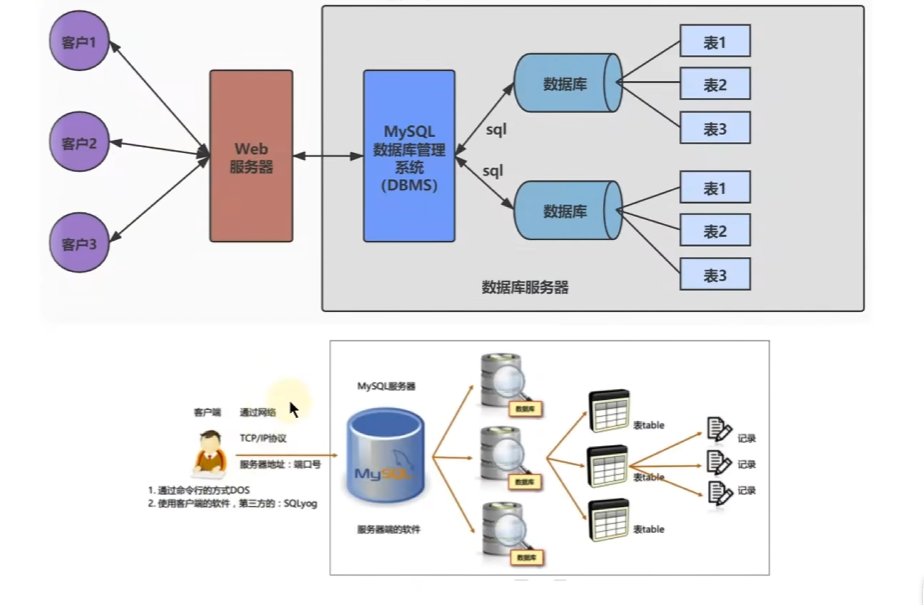
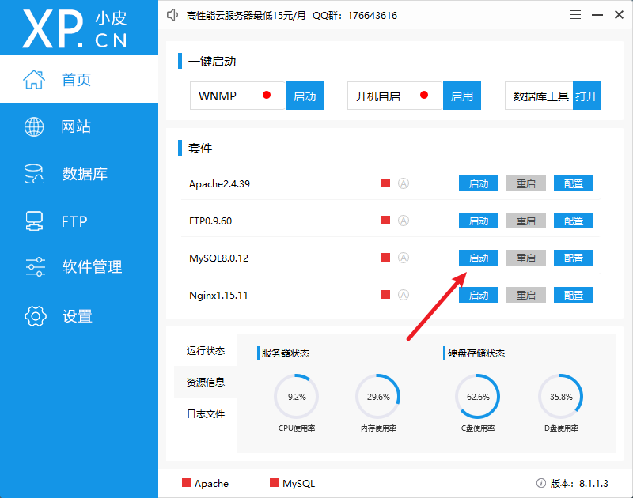

# MySQL快速入门

## 一、数据库概述

### 1.1、为什么要使用数据库

持久化：把数据保存到可掉电式存储设备中以供之后使用。大多数情况下，特别是企业级应用，数据持久化意味着将内存中数据保存到硬盘中加以 "固化"，而持久化的实现过程大多通过各种关系数据库来完成。

持久化的主要作用将内存中的数据存储在关系型数据库中，当然也可以存储在磁盘文件，XML 数据文件中

### 1.2、什么是数据库

#### 1.2.1、数据库（Database）简化为DB

即存储数据的 "仓库"，其本质是一个文件系统，它保存了一系列有组织的数据

#### 1.2.2、数据库分类

关系型数据库：SQL（Structured Query Language）

+ 代表性数据库：MySQL、Oracle、Sql Server、DB2、SQLlite
+ 通过表和表之间，行和列之间的关系进行数据的存储
+ 通过外键关联来建立表与表之间的关系

非关系型数据库：NoSQL（Not Only SQL）

+ 代表性数据库：Redis、MongoDB
+ 指数据以对象的形式存储在数据库中，而对象之间的关系通过每个对象自身的属性来决定

#### 1.2.3、数据库管理系统（Database Management System）简化为DBMS

是一种操纵和管理数据库的大型软件，用于建立，使用和维护数据库，对数据库进行统一管理和控制。用户通过数据库管理系统访问数据库中表内的数据

数据库管理系统（DBMS）可以管理多个数据库，一般开发人员会针对每一个应用创建一个数据库。为了保存应用中实体的数据，一般会在数据库创建多个表，以保存程序中实体用户的数据。

数据库管理系统，数据库和表的关系如下图所示



#### 1.2.4、常见的数据库管理系统排名

目前互联网常见的数据库管理软件有 Oracle、MySQL、MS SQL Server、DB2、PostgreSQL、Access 这几种。

## 二、MySQL安装和连接

### 2.1、MySQL安装

这里推荐使用 windows 环境下在 [phpStudy](https://www.xp.cn/) 进行安装 MySQL，主要是安装快捷、方便。如下图所示



安装成功之后就可进行启动

### 2.2、MySQL连接

这里推荐使用 [Navicat Premium Lite 17](https://www.navicat.com.cn/products#navicat-premium-lite)，安装简单和使用都非常简单，并且免费使用，具体详细使用请自行搜索。

## 三、数据库命令操作

### 3.1、查看所有数据库

```tex
show databases;
```

### 3.2、创建数据库

```tex
create database student character set GBK;
```

### 3.3、修改数据库

```tex
alter database student character set utf8;
```

### 3.4、删除数据库

```tex
drop database student;
```

### 3.5、切换数据库

```tex
use student;
```

### 3.6、查看当前使用的数据库

```tex
 select database();
```

🔔注意：命令行后面的分号不可删除

## 四、MySQL数据类型和约束条件

### 4.1、数据类型

|       类型       | 类型举例                                                     |
| :--------------: | ------------------------------------------------------------ |
|     整数类型     | tinyint、smallint、mediumint、int(interger)、bigint          |
|     浮点类型     | float、double                                                |
|    定点数类型    | decimal                                                      |
|      位类型      | bit                                                          |
|   日期时间类型   | year、time、date、datetime、timestamp                        |
|  文本字符串类型  | char、varchar、tinytext、text、mediumtext、longtext          |
|     枚举类型     | enum                                                         |
|     集合类型     | set                                                          |
| 二进制字符串类型 | binary、varbinary、tinyblob、blob、mediumblob、longblob      |
|     JSON类型     | json                                                         |
|   空间数据类型   | 单值类型：geometry、potint、linestring、polygon；集合类型：multipoint、multilinestring、multipolygon、geometrycollection |

### 4.2、约束条件

|    约束条件    | 说明         |              语法              |
| :------------: | ------------ | :----------------------------: |
|  primary key   | 主键约束     |  字段名 数据类型 primary key   |
|    not null    | 非空约束     |    字段名 数据类型 not null    |
|     unique     | 唯一约束     |     字段名 数据类型 unique     |
| auto_increment | 自动增长约束 | 字段名 数据类型 auto_increment |
|    default     | 默认约束     |    字段名 数据类型 default     |

| 约束条件     | 说明                                                         |
| ------------ | ------------------------------------------------------------ |
| 主键约束     | 作为主键的字段，其取值不能为空，也不可以重复，并且一个表中只能有一个主键，但是构成主键的字段可以是一个也可以是多个。也就是说，主键只能有一个，但是一个主键可以由多个字段构成，当多个字段的取值完全一样时会违反主键约束 |
| 唯一约束     | 唯一约束要求该列的值必须是唯一的，也就是不能出现重复值。允许为null，但只能出现一个空值，一个表中可以由多个字段声明为唯一的，以确保数据表的一列或几列不出现重复值 |
| 自动增长约束 | 自动增长约束要求指定字段的数据取值自动增长，默认从1开始，每增加一条，这个字段的记录就会加1，所以它只适用于正数的数值型字段。一个表只能有一个自动增长字段，且必须为主键一部分，因此自动增长的约束也是辨别表中主键的重要标志之一 |
| 非空约束     | 非空约束要求字段的值不能为空值                               |
| 默认约束     | 默认约束指定某个字段的默认值，当插入记录时，如果没有明确为字段赋值，那么系统就会自动为这个字段赋值为默认约束设定的值 |

## 五、数据库的表和字段规范设计

### 5.1、表设计规范

- **命名规则**：使用小写字母，单词间用下划线分隔（如 `user_info`）。
- **简洁性**：表名应简洁且能准确描述内容。
- **避免保留字**：避免使用MySQL保留字。
- **复数形式**：表名通常使用复数形式（如 `users`）。

### 5.2、字段名设计规范

- **命名规则**：使用小写字母，单词间用下划线分隔（如 `first_name`）。
- **简洁性**：字段名应简洁且能准确描述内容。
- **避免保留字**：避免使用MySQL保留字。
- **选择合适数据类型**：选择最合适的数据类型，如 `INT`、`VARCHAR`、`DATE` 等。
- **避免过大类型**：避免使用过大的数据类型，如 `VARCHAR(255)` 应合理设置长度。
- **精度**：对小数使用 `DECIMAL` 并指定精度。

## 六、数据表操作

### 6.1、现在当前数据库下所有表

```tex
show tables;
```

### 6.2、创建表

```tex
create table 表名(字段名 类型)

# 示例
create table students(name char(16),sex not null default '男'); # 如果输入性别为空，则默认为男
```

### 6.3、修改表

```tex
alter table 表名 modify 字段名 char(6); # 修改字段数据类型
alter table 表名 rename 新表名;  # 修改表名
alter table 表名 add 字段名 数据类型;  # 新增字段
alter table 表名 drop 字段名;  # 删除字段
alter table 表名 chaneg 旧字段名 新字段名 数据类型; #修改字段名
```

### 6.4、删除表

```tex
drop table 表名;
```

## 七、数据查询操作

### 7.1、查询表数据

```tex
SELECT * FROM `employees` # 查询表所有数据和所有列

SELECT first_name, last_name,email FROM `employees` # 查询特定列

SELECT first_name, last_name, email AS "邮箱" FROM `employees` # AS 定义列别名
```

### 7.2、插入数据

```tex
# 单个添加
INSERT INTO employees(first_name,last_name,email,phone_number,hire_date,job_id,salary) VALUES("Kyler","Tsai","545644454@qq.com","1548987787","1998-10-12","AD_VP","24000.00")

# 批量添加
INSERT INTO 表名(字段1,字段2,......) VALUES(值1,值2,...),(值1,值2,...),(值1,值2,...);
INSERT INTO 表名 VALUES(值1,值2,...),(值1,值2,...),(值1,值2,...);
```

### 7.3、更新数据

```tex
UPDATE employees SET email = "18787987987@163.com",phone_number = "18379958465" WHERE employee_id = 0
```

### 7.4、删除数据

```tex
DELETE FROM employees WHERE employee_id = 0 # 删除 employee_id = 0 的数据
DELETE FROM employee; #删除该表所有数据
```

## 八、条件查询

查询薪资大于 10000 的员工

```tex
SELECT * FROM employees WHERE salary > 10000
```

查询薪资在 5000 和 10000 之间的员工

```tex
SELECT * FROM employees WHERE salary > 5000 AND salary < 10000
# or
SELECT * FROM employees WHERE salary > 5000 && salary < 10000
# or
SELECT * FROM employees WHERE salary BETWEEN 5000 AND 10000
```

查询排除某个部门的员工

```tex
SELECT * FROM employees WHERE NOT department_id = 100
# or
SELECT * FROM employees WHERE department_id != 100
```

查询雇佣日期是 2000 年的员工

```tex
SELECT * FROM employees WHERE hire_date LIKE "2000-%"
```

查询某两个部分

```tex
SELECT * FROM employees WHERE department_id IN (50, 100)
```

按照薪资降序排列查询

```tex
SELECT * FROM employees ORDER BY salary DESC
```

查询出薪资最高前 5 名的员工信息

```tex
SELECT * FROM employees ORDER BY salary DESC LIMIT 5
```

查询出薪资第 5 名到第 10 名的员工信息

```tex
SELECT * FROM employees ORDER BY salary DESC LIMIT 5,10
```

## 九、分组查询

### 9.1、GROUP BY

查询各部门人数

```tex
SELECT department_id AS "所属部分编号",COUNT(*) AS "各部门认识" FROM employees GROUP BY department_id
```

### 9.2、HAVING

查询各部门人数并且排除没加入部门

```tex
SELECT department_id AS "所属部分编号",COUNT(*) AS "各部门认识" FROM employees GROUP BY department_id HAVING department_id IS NOT NULL
```

🔔注意：GROUP BY 和 HAVING 配合使用

## 十、聚合函数

### 10.1、COUNT

查询员工总人数

```tex
SELECT COUNT(*) AS "员工人数" FROM employees
```

### 10.2、SUM

查询所有员工所发工资总和

```tex
SELECT SUM(salary) AS "所有员工发的工资总和" FROM employees
```

### 10.3、AVG

查询所有员工的平均薪资

```tex
SELECT AVG(salary) AS "平均薪资" FROM employe
```

### 10.4、MAX

 查询员工中最高薪资

```tex
SELECT MAX(salary) AS "员工最高工资" FROM employees
```

### 10.5、MIN

查询员工中最低薪资

```tex
SELECT MIN(salary) AS "员工最高工资" FROM employees
```

## 十一、多表查询

### 11.1、JOIN连接

查询所有员工的所属部门

```tex
SELECT *, department_name AS "部门" FROM employees JOIN departments ON employees.department_id = departments.department_id
```

### 11.2、子查询

查询薪资超出平均薪资的员工

```tex
SELECT *  FROM employees WHERE salary > (SELECT AVG(salary) FROM employees )
```

### 11.3、连接查询

#### 11.3.1、交叉连接

```tex
SELECT * FROM employees CROSS JOIN departments
```

#### 11.3.2、内连接

```tex
SELECT * FROM employees INNER JOIN departments ON employees.department_id = departments.department_id
```

#### 11.3.3、外连接

>左外连接：以左边的表为基准
>
>右外连接：以右边的表为基准

左连接

```tex
# 以左边的表为基准，如果左边的表department_id为null，则会被过滤
SELECT * FROM employees e LEFT JOIN departments d ON e.department_id = d.department_id
```

右连接

```tex
# 以右边的表为基准，如果存在员工的department_id为null，则会被过滤
SELECT * FROM employees e RIGHT JOIN departments d ON e.department_id = d.department_id
```

## 十二、视图

> 视图可以理解为一个虚拟的表，实际上就是将一个复杂的查询语句当作一个变量来使用

### 12.1、创建视图

方式一：CREATE VIEW 视图名 AS 查询语句

方式二：CREATE OR REPLACE VIEW 视图名 AS 查询语句，此方式的特点是如果该视图已经存在，则替换，如果不存在，则创建。

查询每个部门大于平均薪资的人数，视图写法如下

```tex
# 创建视图
CREATE VIEW v1 
AS
SELECT department_id, AVG(salary) as v FROM employees GROUP BY department_id

# 将视图视为 内连接
SELECT e.department_id, COUNT(1) FROM employees e INNER JOIN v1 ON
e.department_id = v1.department_id WHERE e.salary > v GROUP BY e.department_id
```

### 12.2、修改视图

```tex
# 语法
ALTER VIEW 视图名 AS 查询语句

# 示例
ALTER VIEW v1 AS SELECT *  FROM employees WHERE salary > (SELECT AVG(salary) FROM employees )
```

### 12.3、删除视图

```tex
# 语法
DROP VIEW 视图名

# 示例
DROP view v1
```

## 十三、事务

### 13.1、什么是事务？

事务是数据库管理系统（DBMS）中的一个核心概念，它确保了一系列数据库操作，要么成功，要么全部失败，从而维护数据库的完整性和一致性

由于 Mysql 中的事务是存储引擎实现，而且只有 InnoDB 支持事务 ，其他常见的如 MyISAM 和 Memory 都是不支持事务的，因此我们讲解 InnoDB 的事务。

### 13.2、事务四大特性ACID

| 特性                  | 说明                                                         |
| --------------------- | ------------------------------------------------------------ |
| 原子性（Atomicity）   | 原子性是指事务是一个不可分割的工作单位，事务内的操作要么都发生，要么都不发生 |
| 一致性（Consistency） | 事务前后数据的完整性必须保持一致                             |
| 隔离性（Isolation）   | 多个用户并发访问数据库时，一个用户的事务不能被其他用户的事务所干扰，多个并发事务之间数据要相互隔离。隔离性由隔离级别保障！ |
| 持久性（Durability）  | 一个事务一旦提交，他对数据库中数据的改变就是永久性的，接下来即使数据库发生故障也不应该对其有任何影响。 |

### 13.3、事务的使用

开启事务

```tex
-- 开启事务
START TRANSACTION 或 BEGIN;
```

提交事务

```tex
-- 提交事务
COMMIT ;
```

回滚事务

```tex
-- 回滚事务
ROLLBACK;
```

保存点

```tex
-- 设置保存点
SAVEPOINT;
-- 设置保存点并命名为S1
SAVEPOINT S1;
```
