# Redis@7快速入门

## 一、环境准备

+ VMware 已安装 Ubantu 操作系统
+ MobaXterm SSH 连接工具

## 二、Redis安装教程

### 1.1、Redis安装

官方安装地址：https://redis.io/docs/latest/get-started/，选择 [Install Redis on Linux](https://redis.io/docs/latest/operate/oss_and_stack/install/install-redis/install-redis-on-linux/)

参照 Install on Ubuntu/Debian 命令进行安装

```bash
sudo apt-get install lsb-release curl gpg
curl -fsSL https://packages.redis.io/gpg | sudo gpg --dearmor -o /usr/share/keyrings/redis-archive-keyring.gpg
sudo chmod 644 /usr/share/keyrings/redis-archive-keyring.gpg
echo "deb [signed-by=/usr/share/keyrings/redis-archive-keyring.gpg] https://packages.redis.io/deb $(lsb_release -cs) main" | sudo tee /etc/apt/sources.list.d/redis.list
sudo apt-get update
sudo apt-get install redis
```

系统启动时自动运行 Redis

```bash
sudo systemctl enable redis-server
sudo systemctl start redis-server
sudo systemctl stop redis-server # 停止运行
```

Once Redis is running, you can test it by running `redis-cli`:

```bash
redis-cli
```

检查 Redis 是否运行：

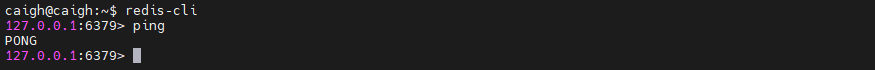

由此 Redis 安装成功，也可以通过 linux 命令查看 Redis 进程服务

```bash
ps aux | grep redis
```

### 1.2、Redis 常规命令的使用

如何退出 Redis 命令客户端

```bash
exit # 退出 redis  
redis-cli # 进入 redis 命令客户端
```

如何停止 Redis 运行

```bash
redis-cli shutdown # 一般使用
systemctl stop redis # Redis是通过系统服务管理器运行，例如 sudo systemctl start redis-server
```

再次通过 redis-cli ping 命令检查 Redis 是否再运行

## 三、Redis 客户端

### 3.1、命令行客户端

打开命令行客户端的命令

```bash
redis-cli -p 端口 # 进入命令行客户端
```

### 3.2、可视化客户端

Redis 可视化客户端目前有 RedisInsight、RedisPlus等，相关配置下载可以参考其他途径获取。一般来说，可视化客户端连接填入对应的 Redis 的 ip 即可成功连接

### 3.3、API 客户端

API客户端指在编程代码中调用 Redis 的 api、例如在 Java、Node.js、Python 中。

详情在 https://redis.io/docs/latest/integrate/ 查找相关信息

## 四、Redis 配置文件

按照 Redis 官网下载 Redis@7 版本，配置文件在 /etc/redis 目录下，具体配置详解如下：

```bash
#引用其他配置文件，多实例的情况可以把公用配置文件提取出来
include /path/to/other.conf

# 指定redis只能接受来自此IP绑定的网卡的请求，注意此默认值默认外网是不可访问的
# 生产环境肯定要写你应用服务器的地址；服务器是需要远程访问的，所以需要将其注释掉
bind 127.0.0.1  # 本地
bind 0.0.0.0    # 支出外网

# 默认端口，建议生产环境不要使用默认端口避免被恶意扫描到
port 6379

# 是否开启保护模式。如果没有指定bind和密码，redis只会本地进行访问，拒绝外部访问。
# 将本机访问保护模式设置 no
protected-mode yes

# tcp keepalive参数  
# 对访问客户端的一种心跳检测，每个 n 秒检测一次
# 单位为秒，如果设置为0，则不会进行keepalive检测，建议设置成60
tcp-keepalive 300

# 配置unix socket来让redis支持监听本地连接。
#unixsocket /tmp/redis.sock

# 配置unix socket使用文件的权限
#unixsocketperm 700

#客户端连接空闲超过timeout将会被断开，为0则关闭该功能（0表示不断，一直连着）
timeout 0


# 守护进程，后台启动 以守护进程的方式运行，默认是 no，我们需要自己开启为yes！
daemonize yes


# pidfile 存放 pid 文件的位置，每个实例会产生一个不同的 pid 文件
pidfile /var/run/redis_6379.pid

# 可以通过upstart和systemd管理Redis守护进程
# 选项：
# supervised no - 没有监督互动
# supervised upstart - 通过将Redis置于SIGSTOP模式来启动信号
# supervised systemd - signal systemd将READY = 1写入$ NOTIFY_SOCKET
# supervised auto - 检测upstart或systemd方法基于 UPSTART_JOB或NOTIFY_SOCKET环境变量
supervised no

# 日志
# 注意：日志级别开发期设置为verbose即可，生产环境中配置为notice，简化日志输出量，降低写日志IO的频度
#	debug
#	verbose
#	notice
#	warning
# 日志级别  生产环境
loglevel notice

# 日志的文件位置名  一般以端口号.log命名  6379.log
logfile ""

# 数据库的数量，默认是 16 个数据库  默认数据库为 0
databases 16

# 是否总是显示LOGO 
always-show-logo yes

# 设置密码 访问密码的查看、设置和取消
# 在命令中设置密码，只是临时的。重启 redis 服务器，密码就还原了
# 永久设置，需要再配置文件中进行设置。
requirepass 密码

# 设置 redis 同时可以与多少个客户端进行连接  默认情况下为 10000 个客户端
# 如果达到了此限制，redis 则会拒绝新的连接请求，并且向这些连接请求方发出“max number of clients reached”以作回应
maxclients 100

# 配置最大的内存容量
# 建议必须设置，否则，将内存占满，造成服务器宕机
# 设置 redis 可以使用的内存量。一旦到达内存使用上限，redis 将会试图移除内部数据，移除规则可以通过 maxmemory-policy 来指定
# 如果 redis 无法根据移除规则来移除内存中的数据，或者设置了“不允许移除”，那么 redis 则会针对那些需要申请内存的指令返回错误信息，比如 SET、LPUSH 等
# 但是对于无内存申请的指令，仍然会正常响应，比如 GET 等。如果你的 redis 是主redis（说明你的 redis 有从 redis），那么在设置内存使用上限时，需要在系统中留出一些内存空间给同步队列缓存，只有在你设置的是“不移除”的情况下，才不用考虑这个因素
maxmemory 128

# 内存到达上限之后的处理策略
# volatile-lru：使用 LRU 算法移除 key，只对设置了过期时间的键；（最近最少使用）
# 1、volatile-lru：只对设置了过期时间的key进行 LRU（默认值）
# 2、allkeys-lru ： 在所有集合 key 中，使用 LRU 算法移除 key
# 3、volatile-random：随机删除即将过期key  在过期集合中移除随机的 key，只对设置了过期时间的键
# 4、allkeys-random：在所有集合 key 中，移除随机的 key
# 5、volatile-ttl ： 删除即将过期的 移除那些 TTL 值最小的 key，即那些最近要过期的 key
# 6、noeviction ： 永不过期，返回错误  不进行移除。针对写操作，只是返回错误信息
maxmemory-policy noeviction 

# 设置样本数量，LRU 算法和最小 TTL 算法都并非是精确的算法，而是估算值，所以你可以设置样本的大小，redis 默认会检查这么多个 key 并选择其中 LRU 的那个
# 一般设置 3 到 7 的数字，数值越小样本越不准确，但性能消耗越小
maxmemory-samples 5

# 设置保存快照的规则: 300秒（5分钟）内至少10个key值改变（则进行数据库保存--持久化）
save 300 10

# 持久化如果出错，是否还需要继续工作！ yes：不能进行工作，no：可以继续进行工作
# 可以通过info中的rdb_last_bgsave_status了解RDB持久化是否有错误
stop-writes-on-bgsave-error yes

# 是否压缩 rdb 文件，rdb文件压缩使用LZF压缩算法
# yes：压缩，但是需要一些cpu的消耗。no：不压缩，需要更多的磁盘空间
rdbcompression yes

# 保存rdb文件的时候，进行错误的检查校验！
rdbchecksum yes 

# 命名持久化文件名称
dbfilename dump.rdb

# rdb 文件保存的目录！ 数据库的写入会在这个目录。rdb、aof文件也会写在这个目录
dir ./

# 主从复制指定主节点master设置 主机的ip及端口
replicaof <masterip> <masterport>
replicaof 192.168.1.20 6379
 
# master的密码设置 是否需要密码
masterauth <master-password>
 
# 当一个slave失去和master的连接，或者同步正在进行中，slave的行为有两种可能：
# 如果 replica-serve-stale-data 设置为 “yes” (默认值)，slave会继续响应客户端# 请求，可能是正常数据，也可能是还没获得值的空数据。
# 如果 replica-serve-stale-data 设置为 “no”，slave会回复"正在从master同步
# （SYNC with master in progress）"来处理各种请求，除了 INFO 和 SLAVEOF 命令。
replica-serve-stale-data yes
 
# 配置从是否为只读，开启后从则不能写入数据
replica-read-only yes
 
# 同步策略: 磁盘或socket，默认磁盘方式
repl-diskless-sync no
 
# 如果非磁盘同步方式开启，可以配置同步延迟时间，以等待master产生子进程通过socket传输RDB数据给slave。
# 默认值为5秒，设置为0秒则每次传输无延迟。
repl-diskless-sync-delay 5
 
# slave根据指定的时间间隔向master发送ping请求。默认10秒。
repl-ping-replica-period 10
 
# 同步的超时时间
# slave在与master SYNC期间有大量数据传输，造成超时
# 在slave角度，master超时，包括数据、ping等
# 在master角度，slave超时，当master发送REPLCONF ACK pings
# 确保这个值大于指定的repl-ping-slave-period，否则在主从间流量不高时每次都会检测到超时
repl-timeout 60
 
# 是否在slave套接字发送SYNC之后禁用 TCP_NODELAY
# 如果选择yes，Redis将使用更少的TCP包和带宽来向slaves发送数据。但是这将使数据传输到slave上有延迟，Linux内核的默认配置会达到40毫秒。
# 如果选择no，数据传输到salve的延迟将会减少但要使用更多的带宽。
# 默认我们会为低延迟做优化，但高流量情况或主从之间的跳数过多时，可以设置为“yes”。
repl-disable-tcp-nodelay no
 
# 设置数据备份的backlog大小
repl-backlog-size 1mb
 
# 从最后一个slave断开开始计时多少秒后，backlog缓冲将会释放。
repl-backlog-ttl 3600
 
# 优先级
replica-priority 100
 
# 如果master少于N个延时小于等于M秒的已连接slave，就可以停止接收写操作。
# N个slave需要是“oneline”状态。
# 延时是以秒为单位，并且必须小于等于指定值，是从最后一个从slave接收到的ping（通常每秒发送）开始计数。
# 该选项不保证N个slave正确同步写操作，但是限制数据丢失的窗口期。
# 例如至少需要3个延时小于等于10秒的slave用下面的指令：
min-replicas-to-write 3
min-replicas-max-lag 10

#内存满逐出
lazyfree-lazy-eviction no
 
#过期key删除
lazyfree-lazy-expire no
 
#内部删除，比如rename oldkey newkey时，如果newkey存在需要删除newkey
lazyfree-lazy-server-del no
 
#接收完RDB文件后清空数据选项
replica-lazy-flush no
 
# 记录超过多少微秒的查询命令
# 1000000等于1秒，设置为0则记录所有命令
slowlog-log-slower-than 10000
 
# 记录大小，可通过SLOWLOG RESET命令重置
slowlog-max-len 128

# 开启redis集群
cluster-enabled yes
 
# 配置redis自动生成的集群配置文件名。确保同一系统中运行的各redis实例该配置文件不要重名。
cluster-config-file nodes-6379.conf
 
# 集群节点超时毫秒数
cluster-node-timeout 15000
 
# 如果数据太旧，集群中的不可用master的slave节点会避免成为备用master。如果slave和master失联时间超过:(node-timeout * slave-validity-factor) + repl-ping-slave-period则不会被提升为master。
# 如node-timeout为30秒，slave-validity-factor为10, 默认default repl-ping-slave-period为10秒,失联时间超过310秒slave就不会成为master。
# 较大的slave-validity-factor值可能允许包含过旧数据的slave成为master，同时较小的值可能会阻止集群选举出新master。
# 为了达到最大限度的高可用性，可以设置为0，即slave不管和master失联多久都可以提升为master
cluster-replica-validity-factor 10
 
# 只有在之前master有其它指定数量的工作状态下的slave节点时，slave节点才能提升为master。默认为1（即该集群至少有3个节点，1 master＋2 slaves，master宕机，仍有另外1个slave的情况下其中1个slave可以提升）
# 测试环境可设置为0，生成环境中至少设置为1
cluster-migration-barrier 1
 
# 默认情况下如果redis集群如果检测到至少有1个hash slot不可用，集群将停止查询数据。
# 如果所有slot恢复则集群自动恢复。
# 如果需要集群部分可用情况下仍可提供查询服务，设置为no。
cluster-require-full-coverage yes
 
# 选项设置为yes时，会阻止replicas尝试对其master在主故障期间进行故障转移
# 然而，master仍然可以执行手动故障转移,如果强制这样做的话。
cluster-replica-no-failover no

# 默认是不开启aof模式的
# 默认是使用rdb方式持久化的，在大部分所有的情况下，rdb完全够用！
appendonly no 
 
# 持久化的文件的名字
appendfilename "appendonly.aof" 
 
# AOF 同步频率设置
# 每次修改都会 sync。消耗性能  每次写操作都立刻写入到aof文件。慢，但是最安全
appendfsync always 
 
# 每秒执行一次 sync，可能会丢失这1s的数据！ 每秒写一次。折中方案
appendfsync everysec 
 
# 不执行 sync，这个时候操作系统自己同步数据，速度最快！不要立刻刷，只有在操作系统需要刷的时候再刷。比较快
appendfsync no 
 
# 如果AOF的同步策略设置成 “always” 或者 “everysec”，并且后台的存储进程（后台存储或写入AOF 日志）会产生很多磁盘I/O开销。某些Linux的配置下会使Redis因为 fsync()系统调用而阻塞很久。
# 注意，目前对这个情况还没有完美修正，甚至不同线程的 fsync() 会阻塞我们同步的write(2)调用。
# 为了缓解这个问题，可以用下面这个选项。它可以在 BGSAVE 或 BGREWRITEAOF 处理时阻止fsync()。
# 这就意味着如果有子进程在进行保存操作，那么Redis就处于"不可同步"的状态。
# 这实际上是说，在最差的情况下可能会丢掉30秒钟的日志数据。（默认Linux设定）
# 如果把这个设置成"yes"带来了延迟问题，就保持"no"，这是保存持久数据的最安全的方式。
no-appendfsync-on-rewrite no
 
# 自动重写AOF文件。如果AOF日志文件增大到指定百分比，Redis能够通过 BGREWRITEAOF 自动重写AOF日志文件。
# 工作原理：Redis记住上次重写时AOF文件的大小（如果重启后还没有写操作，就直接用启动时的AOF大小）
# 这个基准大小和当前大小做比较。如果当前大小超过指定比例，就会触发重写操作。
# 你还需要指定被重写日志的最小尺寸，这样避免了达到指定百分比但尺寸仍然很小的情况还要重写。
# 指定百分比为0会禁用AOF自动重写特性。
auto-aof-rewrite-percentage 100

# 文件达到大小阈值的时候进行重写
auto-aof-rewrite-min-size 64mb
 
# 如果设置为yes，如果一个因异常被截断的AOF文件被redis启动时加载进内存，redis将会发送日志通知用户
# 如果设置为no，redis将会拒绝启动。此时需要用"redis-check-aof"工具修复文件。
aof-load-truncated yes
 
# 加载时Redis识别出AOF文件以“REDIS”开头字符串，
# 并加载带此前缀的RDB文件，然后继续加载AOF
aof-use-rdb-preamble yes
```

## 五、Redis 的数据类型

操作 Redis 的数据类型的命令参考官网：https://redis.io/docs/latest/commands/，每条命令解释非常详细，以下是部分常用命令。

### 5.1、字符串类型（String）

#### 5.1.1、set / get 

```bash
set key value # 设置 key 的 value 值
get key # 获取对应 key 的 value 值
```

#### 5.1.2、mset / mget 

```bash
mset s1 value1 s2 value2 # 同时设置多个键值对
mget s1 s2 # 同时获取多个键值对
```

#### 5.1.3、getrange / setrange 

```bash
getrange s1 0 2 # 获取 s1 的 value 值的 0-2 区间的值，也就是 “val”
setrange s1 2 119 # 将 s1 的 value 值从 2（offset）开始替换为 119
```

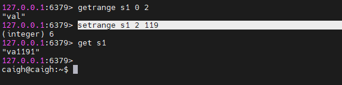

#### 5.1.4、incr / decr | incrby / decrby 


🔔注意：这是一个字符串操作，因为 Redis 没有专用的整数类型。存储在密钥中的字符串被解释为基数为 10 的 64 位带符号整数来执行操作。

Redis 以整数表示形式存储整数，因此对于实际保存整数的字符串值，存储整数的字符串表示没有开销。

#### 5.1.5、STRLEN 

```bash
STRLEN s1 # 获取字符串的长度
```

#### 5.1.6、APPEND

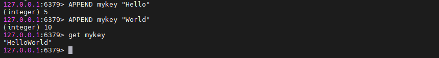

如果 key 已经存在并且是一个字符串，则该命令将值附加在字符串的末尾。如果 key 不存在，则创建它并将其设置为空字符串，因此APPEND 在这种特殊情况下类似于 set。

### 5.2、列表（List）

列表是一个双端链表组成的

#### 5.2.1、lpush / rpush / lrange

将所有指定的值插入到存储为 key 的列表的头部。如果 key 不存在，则在执行 push 操作之前将其创建为空列表。如果 key 保存的值不是列表，则返回错误。

```bash
RPUSH mylist "one" "two" # 右插入：从最右边的元素到最左边的元素，元素一个接一个地插入到列表的头部
LPUSH mylist a b c # 左插入：从最左边的元素到最右边的元素，元素一个接一个地插入到列表的头部
```


```bash
LRANGE key start stop # 查找
```

返回存储在 key 处的列表的指定元素。偏移量开始和停止是基于 0 的索引，其中 0 是列表的第一个元素（列表的头部），1 是下一个元素，依此类推。

这些偏移量也可以是负数，表示从列表末尾开始的偏移量。例如，-1 是列表的最后一个元素，-2 是倒数第二个元素，以此类推

#### 5.2.2、lindex

```bash
lindex mylist 1 # 按照索引下标获取元素
```

#### 5.2.3、llen

```bash
llen mylist # 获取列表元素个数
```

#### 5.2.4、lpop / rpop

```bash
lpop key # 左删除，删除第一个元素，返回被删除的元素
rpop key # 右删除，删除最后一个元素，返回被删除的元素
```

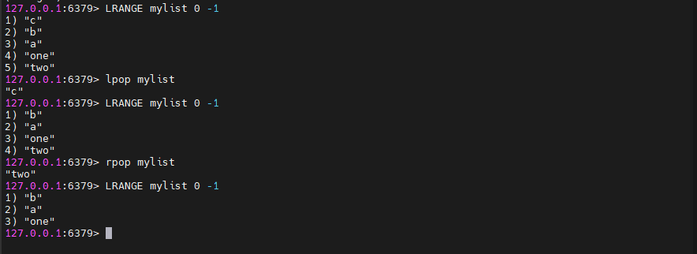

#### 5.2.5、lset

```bash
lset mylist 0 abc # 修改对应索引的元素
```

#### 5.2.6、linsert

```bash
LINSERT key <BEFORE | AFTER> pivot element # 在引用值pivot之前或之后的键处存储的列表中插入元素。
```

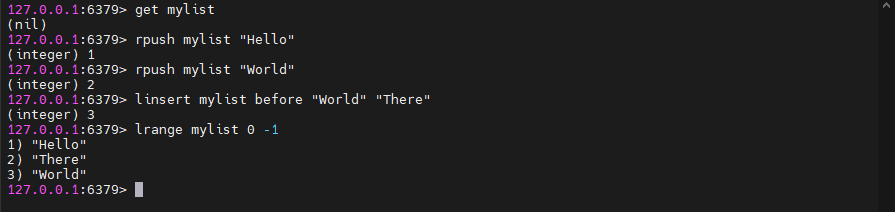

当 key 不存在时，它被视为空列表，不执行任何操作，当key存在但不包含列表值时返回错误。

#### 5.2.7、lrem

```bash
LREM key count element # 移除列表指定值的列表
```

`key` 是要操作的列表的键。

`count` 是要移除的元素个数。有三种情况：

+ 如果 `count` 大于 0，则从列表的头部开始向尾部移除值为 `value` 的元素，最多移除 `count` 个
+ 如果 `count` 小于 0，则从列表的尾部开始向头部移除值为 `value` 的元素，最多移除 `count` 的绝对值个
+ 如果 `count` 等于 0，则移除所有值为 `value` 的元素

`value` 是要移除的元素的值

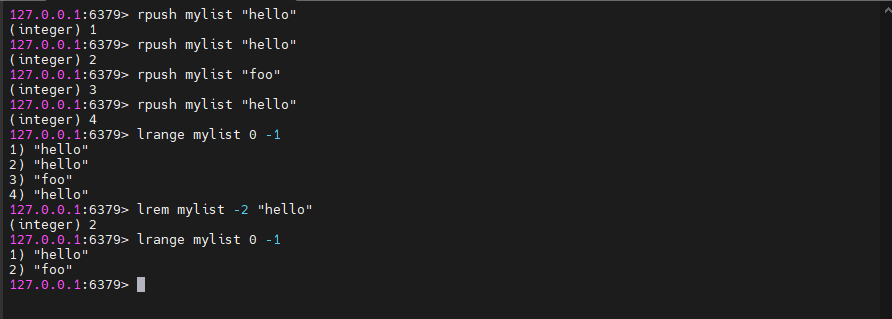

### 5.3、哈希（Hash）

#### 5.3.1、hset / hget / hmset / hmget

设置哈希值

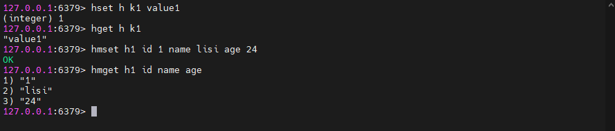

#### 5.3.2、hgetall / hdel

```bash
hgetall h1 # 查看对应 key 的所有hash
hdel h1 id # 删除hash
```

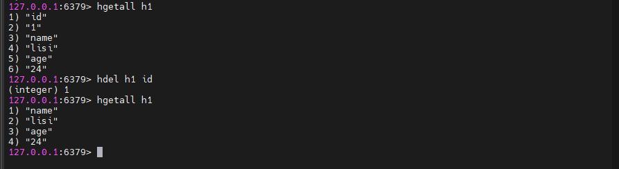

#### 5.3.3、hlen

```bash
hlen h1 # 获取某个 key 内的全部数量
```

#### 5.3.4、hkeys / hvals

```bash
hkeys h1 # 获取某个 key 内的key
hvals h1 # 获取某个 key 内的value
```


#### 5.3.5、hexists

```bash
hexists h1 age # 判断某个 key 内的 key 值是否存在
```

### 5.4、集合（Set）

```bash
# 往myset存入一个值hello
SADD myset hello
# 查看当前 set 所有元素
SMEMBER myset
# 查看当前set是否包含hello元素
SISMEMBER myset hello
# 获取set的size
SCARD myset
# 移除myset的hello元素
SREM myset hello
# 随机获取set中的一个元素
SRANDMEMBER myset 1
# 随机获取一个元素并删除它
SPOP nyset
# 将来一个指定的元素移动到另外的set中
SMOVE myset myset2 sdfa # 将myset中的sdfa移动到myset2中
# 获取 set1 与 set3 的差集
SDIFF set1 set3
# 获取 set1 与 set3 的交集
SINTER set1 set3
# 获取 set1 与 set3 的并集
SUNION set1 set3
```

### 5.5、过期键（Expiring Keys）
#### 5.5.1、EXPIRE和SET命令设置过期时间

```bash
EXPIRE key seconds # EXPIRE 命令用于为已存在的键设置过期时间、seconds 是键在多少秒后过期
SET myKey "Hello, World" EX 60 # SET 命令也可以用来在设置键值的同时设置过期时间。你可以使用 EX 或 PX 选项来指定过期时间，其中 EX 后面跟的是秒数，而 PX 后面跟的是毫秒数。
```

#### 5.5.2、TTL命令

```bash
TTL myKey # 如果键不存在或没有设置过期时间，将返回 -2。如果键已经过期并被自动删除，将返回 -1
```

#### 5.5.3、移除过期

```bash
PERSIST myKey
```

## 六、Redis 事务

Redis 事务的本质是一组命令的集合。事务支持一次执行多个命令，一个事务中所有命令都会被序列化。在事务执行过程，会按照顺序串行化执行队列中的命令，其他客户端提交的命令请求不会插入到事务执行命令序列中。

总结说：Redis 事务就是一次性、顺序性、排他性的执行一个队列中的一系列命令。

| 命令    | 事务                                                         |
| ------- | ------------------------------------------------------------ |
| multi   | 开启事务，redis 会将后续的命令逐个放入队列中，然后使用 exec 命令来原子化执行这个命令系列 |
| exec    | 执行事务中的所有操作命令                                     |
| discard | 取消事务，放弃执行事务块中的所有命令                         |
| watch   | 监视一个或多个 key，如果事务在执行前，这个 key (或多个 key) 被其他命令修改，则事务被中断，不会执行事务中的任何命令 |
| unwatch | 取消 watch 对所有 key 的监视                                 |

### 6.1、事务执行

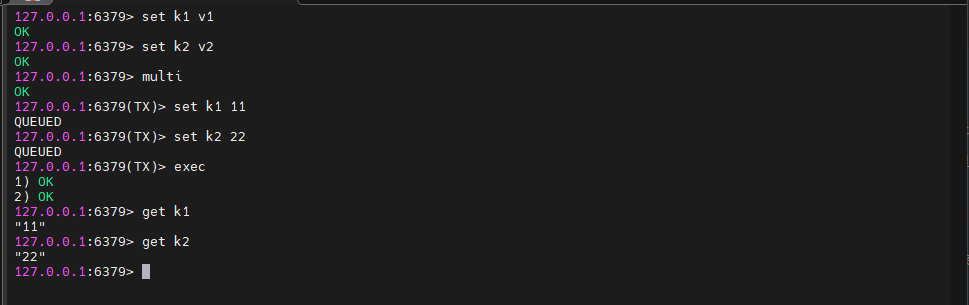

### 6.2、事务取消

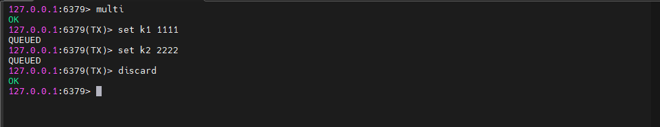

### 6.3、事务中错误处理

#### 6.3.1、语法错误

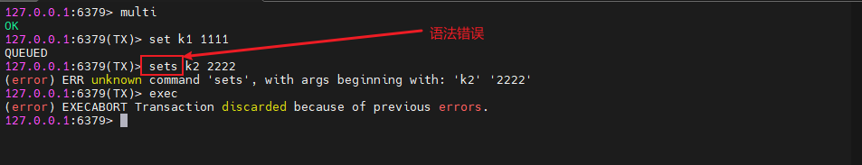

语法错误，最终导致事务提交失败，k1 和 k2 保留原值

#### 6.3.2、类型错误（运行时错误）

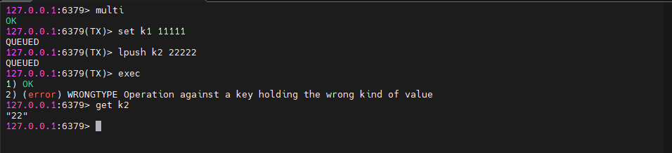

在运行时检测类型错误，最终导致事务提交失败，此时事务并没有回滚，而是跳过错误命令继续执行， 结果 k1 值改变、k2 保留原值

### 6.4、watch 命令

被 watch 的键会被监视，并会发觉这些键是否被改动过了。 如果有至少一个被监视的键在 exec 执行之前被修改了， 那么整个事务都会被取消， exec 返回 nil-reply 来表示事务已经失败。

redis 使用 watch 命令来决定事务是继续执行还是回滚，那就需要在 multi 之前使用 watch 来监控某些键值对，然后使用 multi 命令来开启事务，执行对数据结构操作的各种命令，此时这些命令入队列。

当使用 exec 执行事务时，首先会比对 watch 所监控的键值对，如果没发生改变，它会执行事务队列中的命令，提交事务；如果发生变化，将不会执行事务中的任何命令，同时事务回滚。当然无论是否回滚，redis 都会取消执行事务前的 watch 命令。

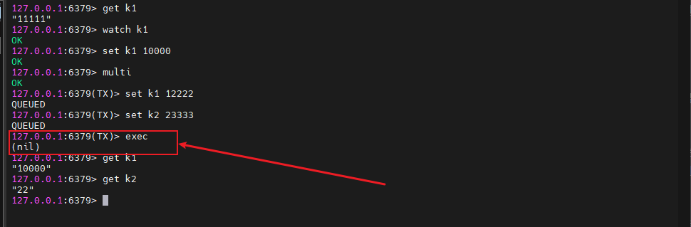

## 七、Redis 持久化原理

Redis 的读写都是在内存中，所以它的性能较高，但在内存中的数据会随着服务器的重启而丢失，为了保证数据不丢失，我们需要将内存中的数据存储到磁盘，以便 Redis 重启时能够从磁盘中恢复原有的数据，而整个过程就叫做 Redis 持久化。

Redis 的持久化主要有两种方式：RDB（Redis Database）和 AOF（Append Only File）。这两种机制各有优缺点，可以根据实际使用场景选择合适的持久化策略。

### 7.1、RDB 持久化

RDB 持久化是将 Redis 在内存中的数据库状态以快照（snapshot）的形式保存到硬盘上的过程。这个过程可以通过配置触发，例如手动执行 SAVE/Bgsave 命令，或者配置 Redis 在特定条件下自动触发，如配置文件中设置的"脏"（dirty）数据超过一定数量或者达到一定时间间隔。

优点：

- 恢复速度快，因为只需要读取一个文件即可恢复。
- 适合灾难恢复。

缺点：

- 可能会丢失最后一次快照之后的数据，因为它是间隔性保存。
- 无法实现秒级持久化。

配置示例：

```bash
# 900秒内如果至少有1个key改变，则进行dump
save 900 1
# 300秒内如果至少有10个key改变，则进行dump
save 300 10
# 60秒内如果至少有10000个key改变，则进行dump
save 60 10000
```

### 7.2、AOF 持久化

AOF 持久化记录了 Redis 服务器接收到的每个写操作（例如 SET 和 LPUSH），并且以文本格式追加到文件中。当 Redis 重启时，可以通过重新执行 AOF 文件中的命令来重建数据集。

优点：

- 可以提供更高的数据安全性，几乎可以避免数据丢失。
- 支持更高的持久化频率，例如每秒同步。

缺点：

- 文件体积较大，因为记录了所有的写操作。
- 恢复速度较慢，依赖于 AOF 文件的大小和复杂度。

配置示例：

```bash
appendonly yes  # 开启AOF持久化
appendfsync everysec  # 每秒同步一次
```

### 7.3、混合持久化

结合了 RDB 和 AOF 的优点。在写入时，先将当前的数据以 RDB 的形式写入文件的开头，再将后续的操作命令以 AOF 的格式存入文件。这样既能保证 Redis 重启时的速度，又能降低数据丢失的风险。

在同时开启 RDB 和 AOF 时，Redis重启的时候只会加载 AOF 文件，而不会加载 RDB 文件，AOF 文件的优先级比 RDB 文件的优先级高，只有 AOF 文件不存在的时候才会读取 RDB 文件。

优点：

+ 结合了 RDB 和 AOF 的优点：混合持久化结合了 RDB 持久化的数据紧凑性和 AOF 持久化的数据安全性，既保证了数据的可靠性，又提高了数据恢复的速度。
+ 降低了数据丢失的风险：由于混合持久化结合了 AOF 持久化，因此即使 Redis 进程在 RDB 快照生成之后宕机，也可以通过 AOF 文件来恢复数据，降低了数据丢失的风险。
+ 提高了重启速度：混合持久化在 AOF 文件的前半部分包含了 RDB 格式的全量数据，这使得 Redis 在重启时可以先加载 RDB 快照，快速恢复到宕机前的状态，然后再通过 AOF 文件中的增量命令来恢复后续的数据变更，从而提高了重启速度

缺点：

- AOF 文件可读性变差：由于混合持久化在 AOF 文件的前半部分添加了 RDB 格式的全量数据，这使得 AOF 文件的可读性变差，不易于阅读和解析。
- 版本兼容性问题：混合持久化是 Redis 4.0 之后引入的新特性，因此在使用混合持久化时，需要确保 Redis 的版本支持混合持久化。如果 Redis 版本过低，可能无法正确加载混合持久化生成的 AOF 文件。
- 可能增加持久化文件的复杂性：混合持久化生成的 AOF 文件既包含了 RDB 格式的全量数据，又包含了 AOF 格式的增量命令，这使得 AOF 文件的结构和内容变得更加复杂。在管理和维护时可能需要更多的注意和操作。

配置示例：

```bash
appendonly yes  # 开启AOF持久化
save 900 1      # 同时配置RDB持久化规则
```

## 八、Redis 的主从架构

```bash
dpkg -L redis-server # 查找 redis 相关文件，找到配置文件
```

相关配置文件在  `/etc/redis/redis.conf`

```bash
sudo chmod 777 /etc/redis # 给 redis 目录添加权限
```

然后参考 redis.conf 文件复制 redis6380.conf、redis6381.conf 、redis6382.conf 文件，如下图

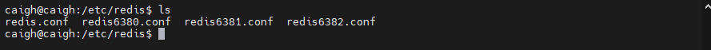

编写 redis6380.conf 文件，编写内容如下，redis6381.conf 、redis6382.conf 依次类推进行修改

```bash
include redis.conf

port 6380 # 设置端口号
pidfile /run/redis/redis-server-6380.pid # 配置 redis 的 pid
dbfilename dump6380.rdb # 配置 redis 的 rdb 文件
appendfilename appendonly6380.aof # 配置 redis 的 aof 文件
```

在修改文件之前建议是将文件赋予修改执行权限

```bash
sudo chmod 777 redis6381.conf
```

依次启动 Redis 服务，端口分别为 6380、6381、6382

```bash 
sudo redis-server redis6380.conf
sudo redis-server redis6381.conf
sudo redis-server redis6382.conf
```

查找相关 Redis 的进程服务

```bash
ps aux | grep redis
```

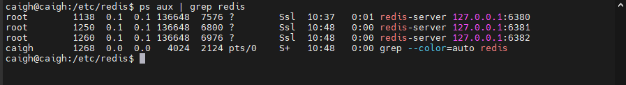

如果要进入某个端口的 Redis 的命令终端

```bash
redis-cli -p 6380 # 进入 6380 的 redis 服务
```

查看 Redis 主从信息

```bash
info replication
```

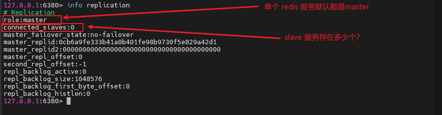

让 6380 端口的 redis 服务作为 master ，6381、6382 端口的 redis 服务作为 slave 

```bash
127.0.0.1:6381> slaveof 127.0.0.1 6380 # 在 6381 端口服务设置 6380 作为master
127.0.0.1:6382> slaveof 127.0.0.1 6380 # 在 6382 端口服务设置 6380 作为master
```

可以在 6380 的端口查看 slave 的服务信息

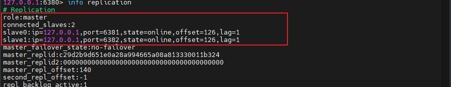

由此以上过程就实现了单个机器通过不同端口实现 Redis 的主从架构

当在 Redis 的 master 服务进行写操作时，对应 slave 就可以查到，通常 master 只能进行写操作，而 slave 只能进行读操作，如果在 slave 进行写操作会导致写入不成功

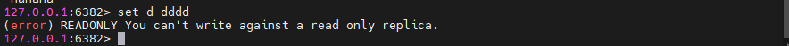

当其中的 master 和 slave 宕机时：

+ slave 节点宕机时，master 的 slaver 节点就会减少一个，slave 节点进行重启时就不再是slave而是master，需要重新配置 slaveof host
+ master 节点宕机时，slave 节点依旧是 slave ，但是节点会描述 master_link_status:down 状态。当 master 节点重启时，节点会描述 master_link_status:up 状态
+ slave 节点可以通过 slaveof no one 由 slave 晋升为 master

编写 Redis 启停脚本，辅助快速启动，因为当前时伪集群搭建，如果在实际环境中不需要改脚本配置

```bash
# redis-start.sh 启动脚本
#!bin/bash
redis-server redis6380.conf
redis-server redis6381.conf
redis-server redis6382.conf
echo complete start

chmod 777 redis-stop.sh # 增加执行权限
```

```bash
# redis-stop.sh 停止脚本
#!bin/bash
redis-cli -p 6380 shutdown
redis-cli -p 6381 shutdown
redis-cli -p 6382 shutdown
echo complete stop

chmod 777 redis-stop.sh # 增加执行权限
```

## 九、Redis 的哨兵集群模式

主从复制缺陷是主机挂了，处理方式有冷处理就是手动将某一个 slave 执行 slaveof no one 晋升为 master，热处理就是哨兵机制

先安装 redis-sentinel

```bash
sudo apt-get install redis-sentinel
```

sentinel 的默认配置在 /etc/redis/ 目录下，添加其他 sentinel 配置搭建哨兵伪集群

要先将 redis-sentinel.conf 配置文件进行注释

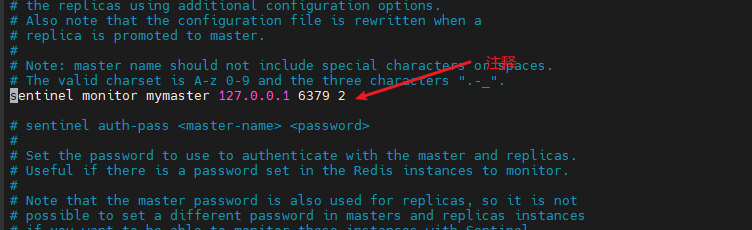

在 /etc/redis 目录下创建 sentinel26380.conf ，配置如下

```bash
include sentinel.conf
pidfile /run/sentinel/redis-sentinel26380.pid
port 26380
sentinel monitor mymaster 192.168.1.201 6380 2

# logfile access26380.log
```

然后参考此配置依次创建 sentinel26381.conf、sentinel26382.conf，可以在给配置添加执行权限

```bash
sudo chmod 777 sentinel26380.conf sentinel26381.conf sentinel26382.conf # 添加执行权限
```

配置 sentinel-start.sh  启动脚本

```bash
# sentinel-start.sh
#!bin/bash
redis-sentinel sentinel26380.conf
redis-sentinel sentinel26381.conf
redis-sentinel sentinel26382.conf
echo sentinel complete start

sudo chmod 777 sentinel-start.sh # 增加执行权限
```

配置 sentinel-stop.sh  停止脚本

```bash
# sentinel-stop.sh
#!bin/bash
redis-cli -p 26380 shutdown
redis-cli -p 26380 shutdown
redis-cli -p 26380 shutdown

sudo chmod 777 sentinel-stop.sh # 增加执行权限
```

在配置主从复制之后，执行启动 sentinel-start.sh 脚本

```bash
sh sentinel-start.sh
```

可以执行相关命令查看 sentinel 信息

```bash
redis-cli -p 26380 info sentinel
```

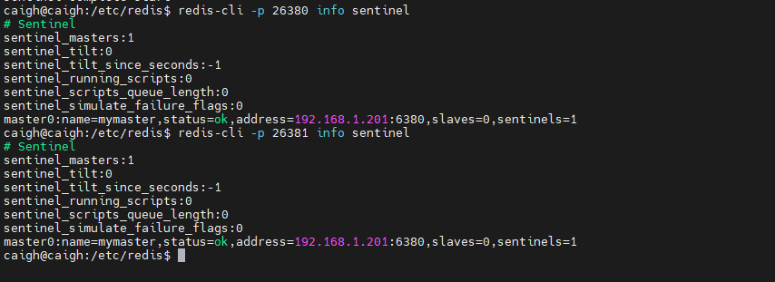

当端口为 6380 的 master 宕机时，会先安装 slave 节点的优先级进行选举，slave 接口会升级为 master ，但是使用 info replication 命令进行查看信息时，被升级为 master 的 slave 节点，但是信息上还是显示的 role:slave，也会多出一个分级slave 节点，详细如下：

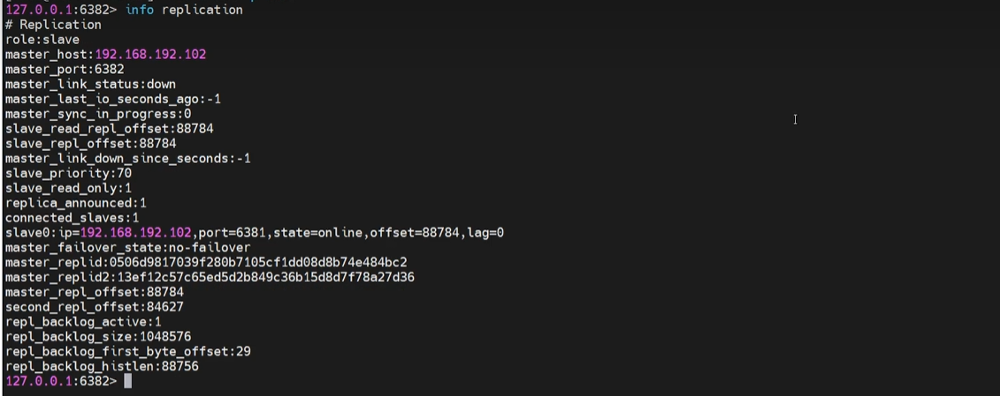


