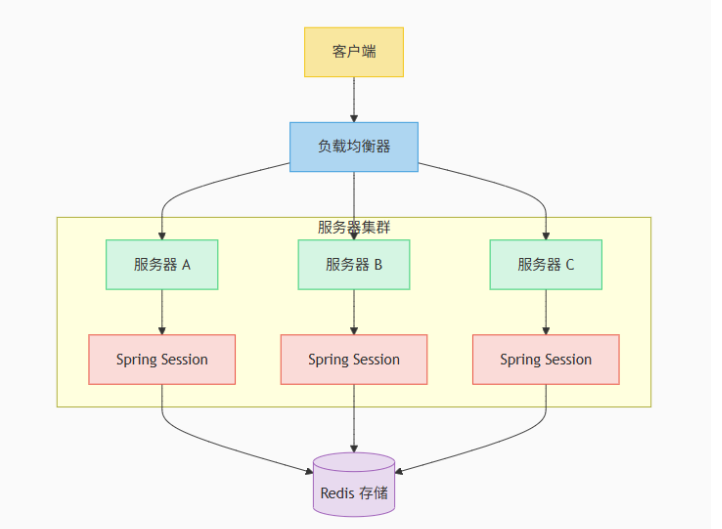

# Cookie和Session概述和理解

## 一、Tomcat的Session

对 Tomcat 而言，Session 是一块在服务器开辟的内存空间，其存储结构为 ConcurrentHashMap。

由于 Http 协议是一种无状态协议，即每次服务端收到客户端的请求时，都是一个全新的请求，服务器并不知道客户端的历史请求。Session的主要目的就是为了弥补 Http 的无状态特性，简单的说，就是服务器可以利用 Session 存储客户端在同一个会话期间的一些操作记录。

Session的实现机制

1. 服务在第一次接收的请求时，开辟了一块 Session 空间（创建了Session对象），同时生成一个SessionId，并通过响应头的 `Set-Cookie：JSESSIONID=XXXXXX`，向客户端发送要求设置cookie的响应
2. 客户端收到响应后，在本机客户端设置了一个 JSESSIONID=XXXXXXX 的 cookie 信息，后续客户端每次发送请求时，请求头都会带上该 cookie 信息（包含 SessionId）
3. 服务器通过读取请求头中的 Cookie 信息，获取名称为 JSESSIONID 的值，得到此次请求的 SessionId

模拟登录接口

```java
package com.example;

import jakarta.servlet.http.*;

import java.io.IOException;
import java.io.PrintWriter;

/**
 * 模拟登录 SESSION 和 cookie 的登录
 */
public class Login extends HttpServlet {
    protected void doGet(HttpServletRequest request, HttpServletResponse response)
            throws  IOException {
        /*
         * 获取 get 请求的 user 参数
         */
        String user = request.getParameter("user");
        String str = "";
        // 一般来处理登录成功之后创建会话
        if(user != null && user.equals("admin")) {
            System.out.println("登录成功");
            str = "登录成功";
            // 通过 request.getSession() 创建会话（Session）对象，返回一个 JSESSIONID 然后通过返回在响应头的 Set-Cookie 里面
            HttpSession session = request.getSession();
        } else {
            System.out.println("登录未成功");
            str = "登录未成功";
        }

        response.setContentType("text/html");
        PrintWriter out = response.getWriter();
        out.println("<html>");
        out.println("<head><title>Servlet HTML Output</title></head>");
        out.println("<body>");
        out.println("<h1>Hello, World! "+ str +"</h1>");
        out.println("</body>");
        out.println("</html>");
    }
}
```

模拟登录之后的获取 SessionId

```java
package com.example;

import jakarta.servlet.http.*;

import java.io.IOException;
import java.io.PrintWriter;

public class Info extends HttpServlet {

    protected void doGet(HttpServletRequest request, HttpServletResponse response)
            throws IOException {
        // 获取session，不创建新的session
        HttpSession session = request.getSession(false);
        String sessionId = session.getId();

        response.setContentType("text/html");
        PrintWriter out = response.getWriter();
        out.println("<html>");
        out.println("<head><title>Servlet HTML Output</title></head>");
        out.println("<body>");
        out.println("<h1>Hello, World! "+ "sessionId:" + sessionId +"</h1>");
        out.println("</body>");
        out.println("</html>");
    }
}
```

其中 Cookie中的 `Expires/Max-Age` 设置为 `Session` 表示该 Cookie 的生命周期与浏览器会话绑定，即 Cookie 仅在用户打开浏览器窗口或标签页期间有效，关闭后自动删除


这其中如果浏览器关闭 Cookie 也会被随之清空，但是后台 Session 也会依然存在，前端也无法或旧 Cookie 获取 Session。默认会指定一段时间（默认 30 分钟）前端没有再发送请求服务器就是自动销毁 Session

## 二、SpringSession解决的问题

在传统的单体应用中，使用 Http Session 来管理用户状态非常简单高效。但是随着微服务架构和集群部署的普及，多台服务器之间如何共享 Session 成为一个挑战。

Spring Session 是一个用于管理用户会话的框架，它提供了一个抽象层，将原本存储在服务器内存中的 Session 数据，统一存储到外部数据源中，如 Redis

架构图解



## 三、SpringSession 模拟登录

```java
package com.example.controller;

import com.example.domain.User;
import com.example.domain.UserInfo;
import jakarta.servlet.http.HttpSession;
import org.springframework.web.bind.annotation.GetMapping;
import org.springframework.web.bind.annotation.RestController;

@RestController
public class LoginCtrl {
    /**
     * 获取登录信息接口
     */
    @GetMapping("/loginInfo")
    public Object getLoginInfo(HttpSession session) {
       User user = (User) session.getAttribute("userinfo");
       System.out.println(user);
       if(user != null) {
           return user;
       }
       User user1 = new User();
       user1.setLogin(false);
       user1.setUserInfo(null);
       session.setAttribute("userinfo",user1);
       return user1;
    }


    /**
     * 模拟登录
     */
    @GetMapping("/login")
    public Object login(HttpSession session) {
        // 假设这里账户和密码都登录成功之后
        User user = new User();
        UserInfo userInfo = new UserInfo();
        userInfo.setUsername("张三");
        userInfo.setPassword("123456");
        user.setLogin(true);
        user.setUserInfo(userInfo);
        session.setAttribute("userinfo",user);
        return user;
    }
}
```

通过配置过滤器，判断 Session 是否过期

```java
package com.example.config;

import com.example.filter.SessionExpiredFilter;
import org.springframework.boot.web.servlet.FilterRegistrationBean;
import org.springframework.context.annotation.Bean;
import org.springframework.context.annotation.Configuration;

@Configuration
public class FilterConfig {
    @Bean
    public FilterRegistrationBean<SessionExpiredFilter> sessionExpiredFilter() {
        FilterRegistrationBean<SessionExpiredFilter> registrationBean = new FilterRegistrationBean<>();
        registrationBean.setFilter(new SessionExpiredFilter());
        registrationBean.addUrlPatterns("/loginInfo");  // 只有loginInfo接口需要验证 session 是否过期
        return registrationBean;
    }
}
```

```java
package com.example.filter;

import jakarta.servlet.FilterChain;
import jakarta.servlet.ServletException;
import jakarta.servlet.http.HttpServletRequest;
import jakarta.servlet.http.HttpServletResponse;
import jakarta.servlet.http.HttpSession;
import org.springframework.web.filter.OncePerRequestFilter;

public class SessionExpiredFilter extends OncePerRequestFilter {
    @Override
    protected void doFilterInternal(HttpServletRequest request, HttpServletResponse response, FilterChain filterChain)
            throws ServletException, IOException {

        HttpSession session = request.getSession(false);

        if (session == null) {
            // 会话已过期
            response.setStatus(HttpServletResponse.SC_UNAUTHORIZED);
            response.getWriter().write("{\"message\": \"Session expired. Please log in again.\"}");
            response.setContentType("application/json");
            return;
        }
        filterChain.doFilter(request, response);
    }
}
```


 