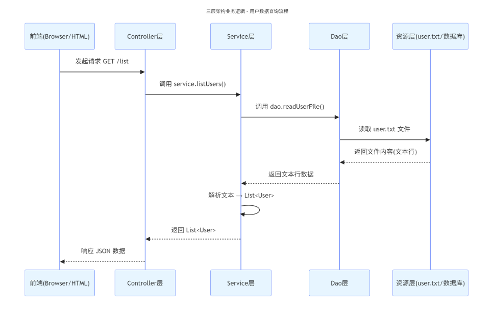

# 三层架构

## 一、三层架构概述

概念：当有大量的对数据的逻辑处理时，会发现代码会有大量的重复性，且非常的繁琐，这时可以使用三层架构去将代码进行拆分成三个架构（Controller（控制器）、Service（服务）、Dao（数据访问）

软件设计原则：高内聚底耦合，内聚就是软件中各个功能模块内部的功能联系，耦合就是衡量软件中各个 层 / 模块 之间的依赖、关联的程度。

SpringBoot的三层架构可以有效的避免耦合，而提高内聚

| 层级                                        | 职责说明                                                     | 关键技术/注解              |
| ------------------------------------------- | ------------------------------------------------------------ | -------------------------- |
| Controller（控制器）                        | 1. 接收前端请求（HTTP） 2. 封装参数、校验 3. 调用 Service 处理业务 4. 返回视图 / 数据给前端 | @Controller、@GetMapping等 |
| Service（业务层）                           | 1. 封装复杂业务逻辑 2. 协调 Mapper 完成数据库操作 3. 事务管理、权限校验等 | @Service、@Transactional   |
| Dao(Data Access Object)（数据访问(持久)层） | 直接操作数据库(增删改查)（SQL 执行） 2. 封装 CRUD 操作 3. 结果映射为 Java 对象 | @Mapper、XML 映射          |

## 二、在Java开发中POJO对象意义

### 2.1、dto

数据传输对象，DTO 用于不同层之间传输数据。它通常用于将业务逻辑层（Service层）的数据传输给表示层或持久层。DTO 对象通常包含业务领域的数据，但不包含业务逻辑。

### 2.2、dao

数据访问对象，DAO 用于封装数据访问逻辑，它负责与数据库进行交互，执行 CRUD（创建、读取、更新、删除）操作。DAO 对象通常封装了数据库访问的细节，使业务逻辑层能够更加简洁地操作数据。

### 2.3、vo

值对象，VO 也是用于数据传输的对象，类似于 DTO，但 VO 通常更加专注于视图层的数据展示。VO 对象通常包含了在前端页面展示所需的数据。屏蔽掉密码、创建时间、状态等敏感信息

### 2.4、bo

业务对象层，BO 用于封装业务逻辑，它通常包含了一系列的业务方法，用于实现业务规则和业务流程。BO 对象通常会调用 DAO 对象来实现数据的持久化和访问。

### 2.5、do

领域对象，通常用于表示业务领域中的实体或业务对象。DO 对象通常包含了业务逻辑和数据，是业务逻辑的实体表示。在某些情况下，DO 对象可能与 PO 对象相似，但它们的用途和含义不同。DO 对象通常用于表示业务领域中的复杂业务逻辑和业务实体。

### 2.6、po

持久对象，通常用于表示与数据库中的表（或文档）相映射的Java对象。PO 对象的属性对应数据库表的字段，每个 PO 对象通常表示数据库中的一条记录。PO对象通常用于 ORM（对象关系映射）框架中，如 Hibernate、MyBatis 等。

