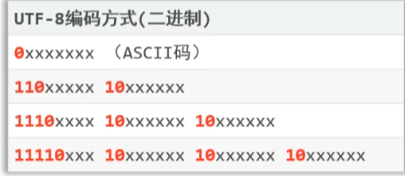

# 常见字符集

## 一、编码基本概念

### 1.1、字符

字符：在计算机和电信技术中，一个字符是一个单位的字形、类字形单位或符号的基本信息。说的简单点字符是各种文字和符号的总称。一个字符可以是一个中文汉字、一个英文字母、一个阿拉伯数字、一个标点符号、一个图形符号或者控制符号等。

### 1.2、字符集

字符集：是指多个字符的集合。不同的字符集包含的字符个数不一样、包含的字符不一样、对字符的编码方式也不一样。例如 GBK 字符集包含汉字等、ASCll字符集包含英文字母、数字等128个字符

### 1.3、字符编码

字符编码：字符编码是指一种映射规则，根据这个映射规则可以将某个字符映射成其他形式的数据以便在计算机中存储和传输。例如ASCII字符集中的小写字母 a 的编号是 65 ，每种字符集都有自己的字符编码规则。

### 1.4、码点

码点：是指在某个字符集中，根据某种编码规则将字符编码后得到的值。比如在ASCII字符集中，字母A经过ASCII编码得到的值是65，那么65就是字符A在ASCII字符集中的码点。

## 二、ASCll字符集

我们都知道计算机是美国科学家发明的，当发明计算机的时候会面临一个问题，如何将字符（例如：字母 a，字母 b 等）存入计算机？

由于计算机的内存只能存入 0 和 1。于是会将字符设置一个编号，例如数字 0 对应 48、数字 97 对应字母 a 等。这些数字编号被称为 `码点`，这些码点编码在一起被称之为 `标准ASCll字符集` 

计算机存储是最少一个字节（8bit），然而 ASCll字符集 只有 128 个字符，而 2\*8 等于256，一个字节可以存储 256 个字符。ASCll字符集的二进制都是以 0 开头，这样 2\*7 等于128，总共可以表示 128 个字符

## 三、GBK字符集

ASCll字符集对于美国人是够用的，但是像中国的汉字就无法在计算机表示和保存。所以中国就发明汉字编码字符集（GBK），GBK 包含了两万多个汉字等字符，一个中文字符编码成两个字节的形式存储。

🔔注意：GBK 兼容了ASCll字符集

例如像 "我a他" 的字符存储会被编译成 `xxxxxxxx xxxxxxxx | 0xxxxxxx | xxxxxxxx xxxxxxxx`，像这样计算机又如何知道是读取一个字节还是两个字节，那两个字节是组合成一个字符。

于是 GBK 规定汉字的第一个字节的第一位必须是1，于是上述的 "我a他" 字符被编译成 `1xxxxxxx xxxxxxxx | 0xxxxxxx | 1xxxxxxx xxxxxxxx`。遇到首位为 1 时，会结合后一个字节当作整体来读取，遇到首位 0 开头的只读取当前字节（被当成 ASCll 字符集）。所以汉字的表示位 2\*15 = 32768 个字符

## 四、Unicode

像美国有 ASCll字符集，中国汉字有 GBK，然后像韩文日文等其他国家字符又该如何表示？当计算机在世界开始传播和使用时，那岂不是每个国家都有一套属于自己的字符集，于是国际组织统一了这些字符集统称 `Unicode字符集（统一码，也叫万国码）`

Unicode是一个字符集，这个字符集世界上所有的字符定义了一个唯一编码，是由国际组织制定的。像 UTF-32、UTF-16、UTF-32、USC-2、UCS-4 等，它们都是Unicode字符集，它们之间只是编码规则不一样。

UTF-32 是 4 个字节表示一个字符，缺点就是占存储空间，通信效率变低

UTF-8 采取可变长编码方案，共分四个长度区：1个字节，2个字节，3个字节，4个字节，`英文和数字占 1 个字节，汉字占 3 个字节`

那 UTF-8 又是如何区分几个字节为一个字符， UTF-8 会遵循以下编码方式，如下图

像 "a我c"的字符是如何被存入的，其中 "a" 和 "c" 会使用一个字节进行保存。字符 "我" 在 Unicode 的字符码点为 0x6211（十六进制）或 25105（十进制），码点在转换成二进制为 110 001000 010001 该二进制和 UTF-8 编码方式组成 `11100110:10001000:10010001` 进行存储。

🔔注意：字符编码时的使用的字符集，和解码时使用的字符集必须一致，否则会出现乱码，英文和数字一般不会出现乱码，因为很多字符集都兼容了 ASCll 编码。