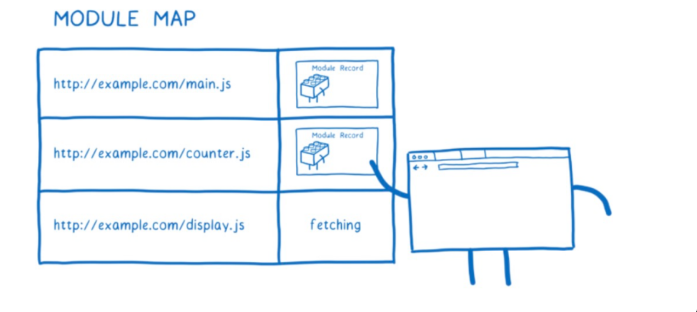
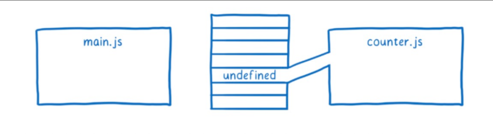

# ES模块的工作原理（浏览器环境）

ES Module工作原理详细说明可以参考原文：https://hacks.mozilla.org/2018/03/es-modules-a-cartoon-deep-dive/

## 一、模块依赖图构建阶段

首先，当 HTML 解析器遇到 `<script type="module" src="main.js">` 时，会立即将 main.js 下载，这与其他资源的下载方式没有区别。

获取到文件之后，会初步解析 AST，在解析过程中，引擎会 `迅速扫描并提取出所有的静态 import 语句`。它不需要完全解析所有语法细节，就能先找到这些 `import` 声明。这也是会 import 语句提前放入最顶部的一个原因，不放入最顶部经过 AST 解析都会放入最顶部。

例如

```javascript
const a = 10;

import { math } from './math.js'
```

经过 AST 解析会被解析成

```javascript
import { math } from './math.js'
const a = 10;
```

一旦解析到 import 语句时，浏览器会立即（在继续解析剩余代码之前），将这个子模块的 URL（如 `./moduleA.js`）解析为绝对路径，然后检查模块映射表。

+ 如果该模块不在映射表中： 立即并行地发起对这个新模块的下载请求。此时，`main.js` 的解析可能还在进行中。
+ 如果该模块已在映射表中：（例如，正在下载或已下载），则直接使用已有的记录。

这个过程是递归的，采用深度优先遍历。

当 main.js 或 其他模块文件解析完成之后会生成一个 `模块记录（module records）`，每一个文件都是一个模块记录。模块记录是存储在内存当中的数据结构。包含了了模块的所有元信息：

+ 模块的源代码（已解析）
+ 导入和导出列表（名称、来源模块等）
+ 模块的依赖关系（它需要哪些模块）
+ 状态信息（是否已链接、是否已执行等）
+ 其他内部属性和方法

模块记录是模块实例的蓝图或模板。 一个模块记录可以被多次实例化（虽然 ESM 通常是单例），但浏览器中一个模块只会有一个模块记录和一个实例。

浏览器内部维护了一个全局的 `模块映射表（Module Map）`。这个表记录了每个模块的绝对 URL 和它的状态（正在下载、已解析、已实例化等）。



模块映射表（Module Map）作用：

+ 关键作用是确保每个模块 URL 只被下载、解析、实例化一次（单例）。

- 在任何地方 `import` 同一个 URL，都会返回同一个模块实例。

### 1.1、深度优先遍历时下载优化

在遇到 import 语句时，是边解析边下载。并行地发起模块下载，而不是等解析完一个再下载一个。

### 1.2、动态import

使用 ES 模块，再代码执行之前是先建立整个模块依赖图。这意味着你不能在你的模块说明符中有变量，因为那些变量还没有值。看下图理解：


其中的 `${path}/counter.js` 指的是模块说明符，该说明符中包含 path 变量，这在 ESModule 中是不允许的。

也就是说，对于 ES modules 来说，是先解析依赖关系，这个阶段并不会执行代码，所以在这个阶段如果使用变量，是会报错的。但是 commonJS 是边解析变运行，所以可以拿到变量。

如果希望 ES modules 也可以实现 commonjs 这个特性，可以使用 `dynamic import `，比如：

```javascript
import(`${path}/foo.js`).
```

这个的原理是，使用 import() 加载的任何文件，都会作为一个单独图的入口，会启动一个新的图，单独处理。


## 二、实例化

前面提到过 `模块记录是模块实例的蓝图或模板`，但是模块实例化的前提是需要等到所有依赖模块的 Module Record 都已就绪，只有全部就绪之后才能实例化。

实例化步骤就是把所有东西连接到内存中。首先，JS引擎创建一个模块环境记录。这将管理模块记录的变量。接下来，找到对应的变量地址，运行后，修改实际变量值。


`导出和导入都指向内存中的相同位置`，连接出口首先可以确保所有进口都可以连接到匹配的出口。


`这与CommonJS模块不同。在CommonJS中，整个导出对象在导出时被复制。这意味着导出的任何值(比如数字)都是副本。`

这意味着在 commonjs 中，如果导出模块稍后更改了这个值，导入模块不会看到该改变。


相比之下，ES模块使用的是一种称为活动绑定的东西。两个模块都指向内存中的相同位置。这意味着当导出模块更改一个值时，该更改将显示在导入模块中。导出值的模块可以在任何时候更改这些值，但导入模块不能更改其导入的值。也就是说，如果一个模块导入了一个对象，它可以改变该对象上的属性值。


像这样使用动态绑定的原因是，您可以在不运行任何代码的情况下连接所有模块。当您有循环依赖项时，这有助于求值，我将在下面解释。

## 三、运行

最后一步是运行并在内存中给这些变量赋值。JS engine 通过执行 top-level code (函数之外的代码)来实现这一点。

除了在内存中对这些变量赋值时，执行代码还可能触发副作用。例如，模块可能会调用服务器。


因为这个副作用，你只需要对 module 执行一次，当执行多次的时候，求值的结构可能会不同。

这也是为什么要使用 modules map 来保证每个模块只加载一次的原因。

在 `循环依赖` 中，你会得到一个循环图。通常，这是一个很长的循环，但为了方便理解，用一个简单的循环来讲解：


让我们看看这在 CommonJS 模块如何工作。首先，main.js 将执行到 require 语句为止。然后它会去加载 counter.js 模块。因为这时候 main.js 还没赋值，所以此时 message 是 undefined



求值继续向下到 counter.js 模块的末尾。我们想看看最终是否会为 message 获得正确的值(在 main.js 求值之后)，所以我们设置了一个超时。然后在 main.js 上继续运行代码。

代码执行如下：


message 变量将被初始化并添加到内存中。但是因为两者之间没有联系，所以在 counter.js 的模块中它将保持undefined。

而如果使用 live bindings（链接）， 这个值将是正确的，只因为他们指向了同一个内存地址。支持这样的循环是设计 ES modules 的重要理由。
