# 浏览器缓存（强缓存与协商缓存）

浏览器缓存的作用就是：在一定时间内复用已下载的资源，避免重复请求，提升用户体验。

缓存策略主要分为两类：

+ 强缓存（Strong Cache）
+ 协商缓存（Revalidation Cache）

缓存主要针对静态资源（html、css、js）等资源

## 一、强缓存

强缓存是指浏览器在接收到服务器响应时，根据响应头中的过期策略，判断资源是否“未过期”。如果未过期，则 `直接从本地缓存读取资源`，不再向服务器发起请求。

### 1.1、强缓存规则解析

当第一次请求服务器时，服务器接收到浏览器的请求后，返回资源并返回同时设置响应头。控制强缓存的头部字段有两个：

| 字段          | 协议版本 | 说明                 |
| ------------- | -------- | -------------------- |
| Cache-Control | HTTP1.1  | 推荐使用，优先级更高 |
| Expires       | HTTP1.0  | 已过时，兼容用       |

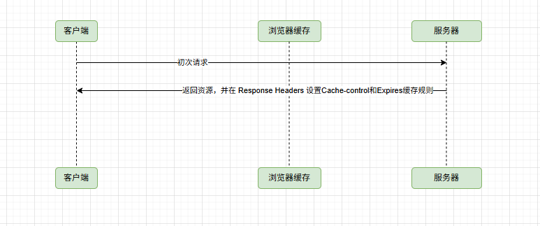

当浏览器再次发送请求时，它会先检查它的 Cache-Control 是否过期，如果没有过期则直接从本地缓存中拉取资源，返回到客户端，而无需再经过服务器。

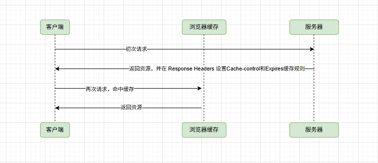

强制缓存有 `过期时间`，就意味着总有一天缓存会失效。客户的 Cache-Control 失效了，那么它就没办法从本地缓存中拉取资源。于是它就会重新向服务器发起请求，之后服务器再次返回资源和 Cache-Control。

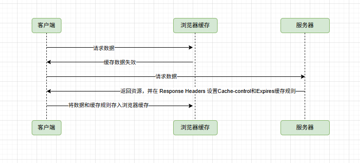

### 1.2、Expires与Cache-Control说明

#### 1.2.1、Expires 

Expires  是 HTTP/1.0 控制网页缓存的字段，其值为服务器返回该请求的结果缓存的到期时间，即再次发送请求时，如果客户端的时间小于 Expires 的值时，直接使用缓存结果。

到了 HTTP/1.1，Expires 已经被 Cache-Control 替代，原因在于 Expires  控制缓存的原理是使用 `客户端的时间与服务端返回的时间` 做对比，如果客户端与服务端的时间由于某些原因（时区不同；客户端和服务端有一方的时间不准确）发生误差，那么强制缓存直接失效，那么强制缓存存在的意义就毫无意义。

#### 1.2.2、Cache-Control

在 HTTP/1.1 中，Cache-Control 是最重要的规则，主要用于控制网页缓存，主要取值为：

| 取值                         | 说明                                                         |
| ---------------------------- | ------------------------------------------------------------ |
| public                       | 所有内容都将被缓存（客户端和代理服务器都可缓存）             |
| private                      | 所有内容只有客户端可以缓存，Cache-Control 的默认取值         |
| no-cache                     | 客户端缓存内容，但是是否使用缓存则需要经过协商缓存来验证决定 |
| no-store                     | 所有内容都不会被缓存，即不使用强制缓存，也不使用协商缓存     |
| max-age=xxx (xxx is numeric) | 缓存内容将在 xxx 秒后失效                                    |

http 响应报文中 Expires  的时间值是一个绝对值，Cache-Control 为 max-age = 600，是相对值。

由于 Cache-Control 的优先级比 Expires ，那么直接根据 Cache-Control 的值进行缓存，意思就是说在600秒内再次发起该请求，则会直接使用缓存结果，强制缓存生效。

🔔注意：在无法确定客户端的时间是否与服务端的时间同步的情况下， Cache-Control 相比于 Expires  是更好的选择，所以同时存在时，只有 Cache-Control 生效。

### 1.3、Nginx强缓存实战

配置 nginx 内容如下

```nginx
server {
    listen       80;
    charset      utf-8;
    server_name  localhost;

    #access_log  logs/host.access.log  main;

    location / {
       # 启用强缓存
       # 设置 Cache-Control 为 public, max-age=1天 (86400秒)
       # public 表示响应可以被任何缓存（浏览器、CDN等）缓存
       add_header Cache-Control "public, max-age=300";

       # 可选：为了兼容旧的 HTTP/1.0 客户端，设置 Expires 头
    	 # Expires  它也会自动添加 Cache-Control，所以这里不设置，Cache-Control 也会添加 Expires  头部
       # Expires  5m;

       root   dist;
       index  index.html index.htm;
    }

    #error_page  404              /404.html;
    # redirect server error pages to the static page /50x.html
    #
    error_page   500 502 503 504  /50x.html;
    location = /50x.html {
        root   html;
    }
}
```

或 

```nginx
server {
    listen       80;
    charset      utf-8;
    server_name  localhost;

    #access_log  logs/host.access.log  main;

    root   dist;
    index  index.html index.htm;

    # 1. 对于 html 文件默认不开启强缓存
    location ~* \.html$ {
       # nginx
       add_header Cache-Control "no-cache";             
    }

    # 2. 对于静态资源（CSS, JS, 图片），使用强缓存，并附带验证
    location ~* \.(jpg|jpeg|png|gif|ico|css|js)$ {
      # 启用强缓存
      # 设置 Cache-Control 为 public, max-age=1天 (86400秒)
      # public 表示响应可以被任何缓存（浏览器、CDN等）缓存
      add_header Cache-Control "public, max-age=300";

      # 可选：为了兼容旧的 HTTP/1.0 客户端，设置 Expires 头
    	# Expires  它也会自动添加 Cache-Control，所以这里不设置，Cache-Control 也会添加 Expires  头部
      # Expires  5m;
    }

    #error_page  404              /404.html;
    # redirect server error pages to the static page /50x.html
    #
    error_page   500 502 503 504  /50x.html;
    location = /50x.html {
        root   html;
    }
}
```

以上的两种配置实现的效果都是一样的，原因是 `nginx 默认对 html 文件不会设置强缓存`

当前设置了 5 分钟的缓存，可以查看浏览器是否有效果，值的注意的是需要取消勾选 Disable cache，否则会查看都是最新拉取数据。

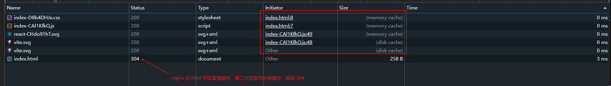

还需要注意是：nginx 是默认强缓存是关闭的，而 nginx 对于协商缓存是默认开启的，无论是否开启强缓存。

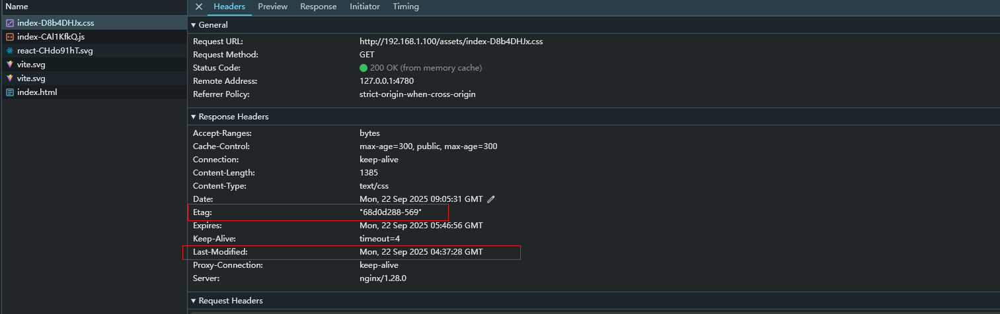

强缓存和协商缓存是互补的而不是互斥的，协商缓存会在下一章节进行讲解

## 二、协商缓存

### 2.1、协商缓存规则解析

协商缓存就是强制缓存失效后，浏览器携带缓存标识向服务器发起请求，由服务器根据缓存标识决定是否使用缓存的过程，这个过程称为 "协商缓存"。

同理，协商缓存的标识也是在响应报文的 HTTP 头中和请求结果一起返回给浏览器的，控制协商缓存的字段分别有：`Last-Modified / If-Modified-Since和Etag / If-None-Match`，其中 `Etag / If-None-Match` 的优先级比 `Last-Modified / If-Modified-Since` 高。

#### 2.1.1、协商缓存生效，返回304

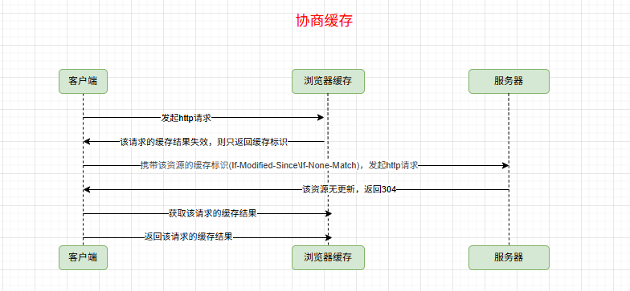

当返回的304中，还是会返回 Cache-Control 响应头，并且浏览器重新对该资源进行强缓存

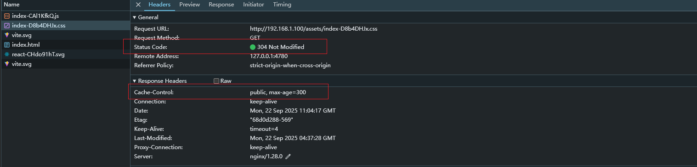

当前查看请求头时，携带该资源的缓存标识 If-Modified-Since 对应的是响应头的 Last-Modified，If-None-Match 对应的是响应头的 etag。

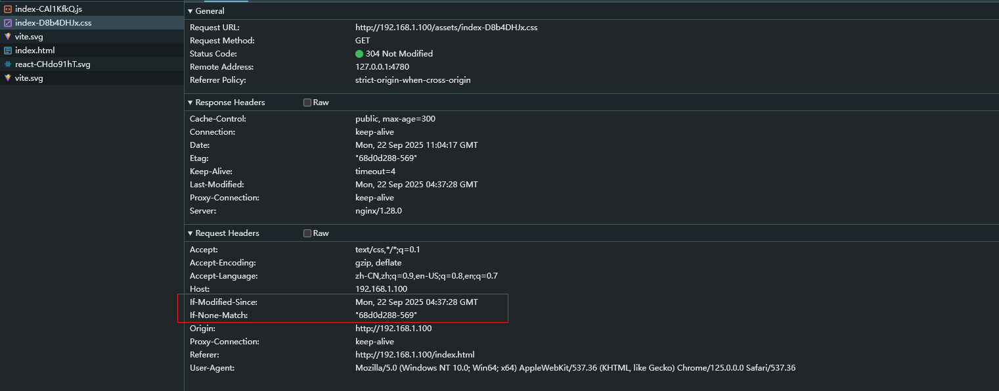

当后续在请求时就会从浏览器本地缓存中获取

#### 2.1.2、协商缓存失败，返回200

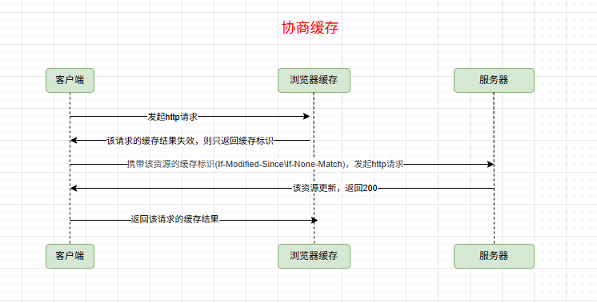

#### 2.1.3、协商缓存总结

Etag / If-None-Match 优先级高于 Last-Modified / If-Modified-Since，同时存在则只有 Etag / If-None-Match 生效。

Etag 是服务器响应请求时，返回当前资源文件的一个唯一标识（由服务器生成），生成规则通常是文件最后修改时间和文件大小的组合（十六进制格式）。示例如下

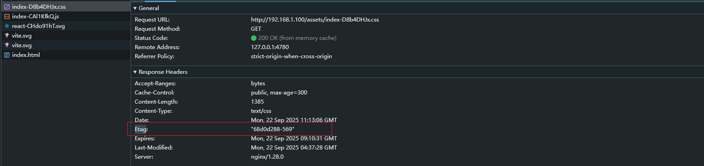

### 2.2、Nginx协商缓存实战

Nginx协商缓存时默认开启的

```nginx
location ~* \.(js|css)$ {
    add_header Cache-Control "public, max-age=31536000";
    expires 1y;
    
    # 显式启用 ETag（默认就是 on，通常不需要设置）
    etag on;
    
    # 控制 If-Modified-Since 行为
    if_modified_since exact; # 严格匹配时间
    # if_modified_since before; # 默认行为
}
```

## 三、强缓存和协商缓存总结

强制缓存 优先于 协商缓存 进行，若强制缓存（Expires  和 Cache-Control）生效则直接使用缓存，若不生效则进行协商缓存( Last-Modified / If-Modified-Since 和 Etag / If-None-Match)，协商缓存由服务器决定是否使用缓存，若协商缓存失效，那么代表该请求的缓存失效，重新获取请求结果，再存入浏览器缓存中；生效则返回304，继续使用缓存，主要过程如下：

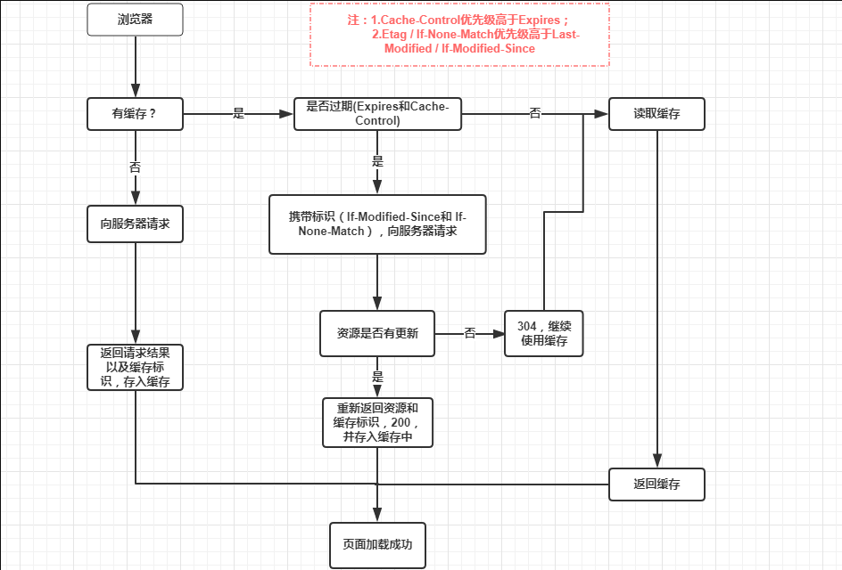