# 浏览器Cookie、LocalStorage和SessionStorage详解

## 一、Cookie、LocalStorage和SessionStorage是什么？

它们都是浏览器提供的、基于同源策略的客户端数据存储机制，允许网站在用户的本地浏览器中 `存储特定于其域名的数据`

在浏览器中按 F12，在控制台选中 Application 即可查看存储的数据

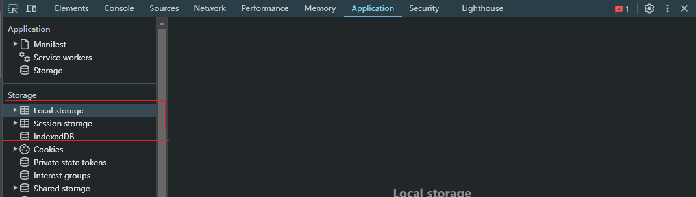

## 二、同源策略

### 2.1、同源策略定义

同源策略是浏览器实施的一种核心安全机制。它规定了从一个源加载的文档或脚本，如何与另一个源的资源进行交互。该策略用于隔离潜在的恶意文档，减少被攻击的媒介，是浏览器安全的基石。

简单来说，它意味着：浏览器允许来自同一源的页面之间自由交互和共享数据，但会限制甚至阻止来自不同源的页面之间的交互。

### 2.2、如果判断是否同源

一个 "源" 由三部分组成，三者必须完全相同才被视为同源

| 标题 | 说明                         |
| ---- | ---------------------------- |
| 协议 | http、https、ftp             |
| 域名 | www.example.com、example.com |
| 端口 | 80端口、443端口              |

注意：子域名被视为不同源，例如：www.example.com、api.example.com。默认端口 80 和 443 在 URL 中 通常被省略，但浏览器在比较时仍然会考虑它们

### 2.3、同源策略限制了什么

同源策略主要限制以下行为（在不同源之间）：

| 主要限制                             | 说明                                                         |
| ------------------------------------ | ------------------------------------------------------------ |
| AJAX（XMLHttpRequest / Fetch）请求   | 默认无法向不同源的服务器发送异步请求（但可以通过CORS机制解除限制） |
| DOM 访问                             | 无法通过JavaScript读取不同源页面的DOM、Cookie、LocalStorage等数据。例如：`iframe` 里加载了一个跨源页面，父页面无法用JS获取这个 `iframe` 里的内容。 |
| Cookie、LocalStorage、IndexedDB 访问 | 无法读取或修改不同源的这些存储数据。                         |

### 2.4、同源策略不限制什么

同源策略对于有些资源是可以跨域嵌入的，这是为了确保互联网的互联互通特性。同源策略限制的是 `读取` 这些嵌入的内容，而不是 `嵌入` 行为本身。

资源嵌入：通常允许跨域嵌入（但JS不能读取其内容）

- `img src="...">` (图片)
- `<link rel="stylesheet" href="...">` (CSS)
- `<script src="...">` (脚本) - **注意**：可以加载，但如果脚本内容出错，浏览器出于安全考虑，不会向父页面暴露详细的错误信息。
- `<iframe src="...">` (内联框架) - 可以加载，但内容无法被父页面JS访问。

重定向和表单提交：链接跳转和表单提交可以跨域，因为这本质上是用户发起了一个新的导航请求。

### 2.5、如何安全地绕过同源策略

有时合法的跨源交互是必要的（例如前端调用第三方API），浏览器提供了安全的机制来实现：

1. **CORS (跨源资源共享)**：这是现代浏览器推荐的标准方式。服务器通过在响应头中设置 `Access-Control-Allow-Origin` 等字段，明确告诉浏览器允许哪些源来访问资源。
2. **JSONP**：一种利用 `<script>` 标签可以跨源的特性来实现的老式方法（现已不推荐，仅用于旧浏览器支持）。
3. **PostMessage**：用于在不同窗口（或iframe）之间安全地传递消息，即使它们不同源。这是实现跨域通信的官方API。
4. **代理服务器**：让自己的服务器去请求第三方资源，然后再传给前端。因为服务器-to-服务器之间没有同源策略限制。

### 2.6、工作中的同源策略触发

在前后端不分离的编程中，例如在 PHP 编程的时代一般前端代码和后端代码是在一起进行编程，部署大部分都是同一个域名，所以很少会触发同源策略。

在前后端初步分离的编程中，前端部署的域名访问的资源路径加 `http://xxx/static/*`，后端部署请求的资源是 `http://xxx/api/*`。通过 `/static` 和 `/api` 这样的路径区分是请求的前端资源文件（html、css、js、img）还是后端接口

在前后端完全分离的情况下，前后端部署的域名各不相同时，因为后端服务本身就是一个服务器，前端请求后端数据就会触发同源策略，就会容易请求失败。

### 2.7、同源策略实战演示

先在本地创建一个服务器并且编写一个简单接口

```javascript
const path = require('path');
const express = require('express');
const app = express();
const port = 19527;

app.get('/api/list', function (req, res) {
  res.send({
    code: '0000',
    message: '请求成功',
    data: [
      {
        name: 'Alice',
        age: 24,
        gender: '1',
      },
      {
        name: 'Jack',
        age: 22,
        gender: '0',
      },
    ],
  });
});

app.listen(port, () => {
  console.log(`Server is running on http://localhost:${port}`);
});
```

#### 2.7.1、XMLHttpRequest请求触发同源策略

在前端创建一个请求，请求 http://localhost:19527 地址

```javascript
import axios from 'axios';

axios.get('http://localhost:19527/api/list').then((res) => {
  console.log(res);
});
```

由此就是触发同源策略，无法请求成功

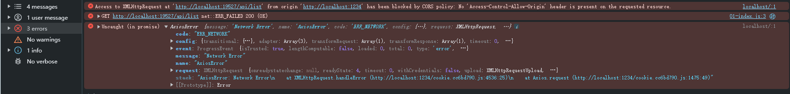

解决方案就如上述说一样，可以使用 cors 和 jsonp 或配置代理服务器安全处理同源策略。

#### 2.7.2、DOM访问

为  http://localhost:19527 配置静态资源（html、js）作为子页面

配置 html 内容如下

```html
<!-- http://localhost:19527 -->
<!doctype html>
<html lang="en">
  <head>
    <meta charset="UTF-8" />
    <meta
      name="viewport"
      content="width=device-width, initial-scale=1.0" />
    <title>http://localhost:19527</title>
  </head>
  <body>
    模拟另一个域名地址页面
    <div id="child">子页面元素Child</div>
  </body>
  <script src="./index.js"></script>
</html>
```

相关 index.js 内容如下

```javascript
// 获取父页面的 root
const root = document.getElementById('root');
console.log(root);
```

在 http://localhost:1234/ 通过 iframe 标签嵌入子页面，配置内容如下

```html
<!--  http://localhost:1234/ -->
<!doctype html>
<html lang="en">
  <head>
    <meta charset="UTF-8" />
    <meta
      name="viewport"
      content="width=device-width, initial-scale=1.0" />
    <title>Cookie</title>

    <script
      type="module"
      src="./src/01-index.js"></script>
  </head>
  <body>
    <div id="root">Root的div</div>
    <!-- 嵌入子页面 -->
    <iframe
      src="http://localhost:19527/index.html"
      frameborder="0"></iframe>
  </body>
</html>
```

在控制器终端就会打印 null 通过 iframe 嵌入另一个域名的页面时会触发同源策略，禁止访问另一个域名的 DOM

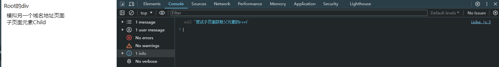

#### 2.7.3、Cookie、LocalStorage访问

先在父页面给 LocalStrorage 中存储一个数据

```javascript
localStorage.getItem('key1', '1111111');
```

然后在嵌入的子页面的 js 脚本尝试获取数据

```javascript
const key1 = localStorage.getItem('key1');
console.log(key1, '尝试获取父页面的localStorage的key1值');
```

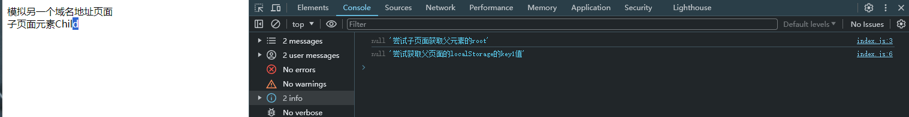

在浏览器的控制台中也可以看出，Cookie 和 LocalStorage 的存储都是根据同源进行划分的

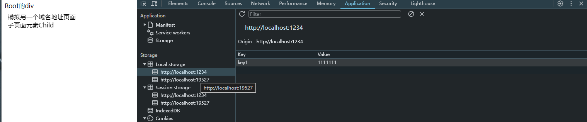

在父页面（http://localhost:1234）中嵌入了子页面（http://localhost:19527）所以就会显示两个域名，当时通过 LocalStorge 存储时只会存储对于的域名下，两者之间会进行隔开相互无法访问，这也是同源策略的安全机制。

像哔哩哔哩网址，查看 LocalStorge 也是多个域名，内部也是通过 iframe 嵌入

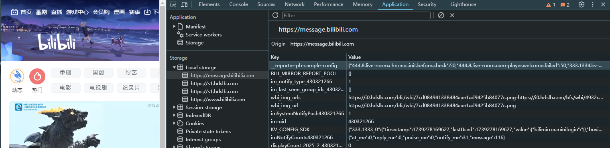

像没有使用 iframe 嵌入子页面时，一般就会显示

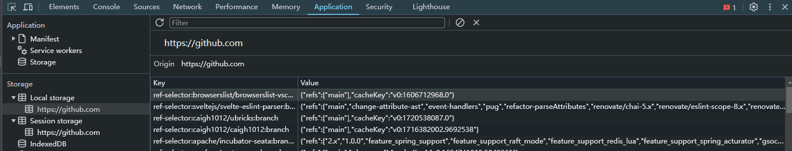

## 三、LocalStorage和SessionStorage

### 3.1、两者之间的差异

生命周期是它们最根本的区别：LocalStorage 是永久存储，除非手动删除；而 SessionStorage 是临时存储，仅在当前浏览器标签页会话期间有效。

| 特性     | LocalStorage                                                 | SessionStorage                                               |
| -------- | ------------------------------------------------------------ | ------------------------------------------------------------ |
| 生命周期 | `永久存储`。数据会一直存在，直到被明确清除（通过 JS、浏览器设置或清除浏览数据）。关闭浏览器、重启电脑都不会丢失。 | `临时会话存储`。数据仅在当前浏览器标签页打开期间有效。关闭标签页后，数据立即被销毁。刷新页面数据保留。 |
| 作用域   | 同源、跨标签页。在同一浏览器中，所有同源的标签页和窗口都可以共享和操作同一份 LocalStorage 数据。 | 同源、单标签页。数据仅对当前标签页可见。即使是同一个网站打开的两个标签页，它们的 SessionStorage 也是`完全隔离`的。 |
| 主要用途 | 存储需要长期保留的用户偏好设置（如主题、语言）、离线数据、购物车内容（希望用户下次访问还在）。 | 存储临时性、会话级的数据。如表单填写草稿（防止意外刷新丢失）、单次登录的token、当前页面的一些临时状态。 |
| 数据大小 | 通常为 `~5MB`（因浏览器而异）                                | 通常为 `~5MB`（因浏览器而异）                                |

### 3.2、API使用

LocalStorage 和 SessionStorage 共享完全相同的API，使用起来非常简单。它们都是 Window 对象的属性，可以通过 localStorage 或 window.localStorage

LocalStorage 使用示例如下

```javascript
/**
 * LocalStorge 和 SessionStorge 使用
 */

/**
 * 1. 存储数据
 * 注意: 存储的数据必须是字符串，如果要存储数字和对象需要先转换为字符串（通常用 JSON.stringify()）。
 */
localStorage.setItem('name', '张三');
localStorage.setItem('age', JSON.stringify(25));
localStorage.setItem('address', JSON.stringify(['打游戏', '吃饭', '睡觉']));

/**
 * 2. 获取数据
 */
const name = localStorage.getItem('name');
const age = window.localStorage.getItem('age');

console.log(name, age);

/**
 * 3. 删除数据
 */
localStorage.removeItem('name');
localStorage.removeItem('aww'); // 如果未找到当前 key，不会抛出错误

/**
 * 4. 清空所有数据
 */

// localStorage.clear();

/**
 * 5. 获取存储项数量
 */
let count = localStorage.length;
console.log(count);

/**
 * 6. 获取第 n 个键名
 */
// 获取第一个键名
let firstKey = localStorage.key(0);
console.log(firstKey); // 输出 age
```

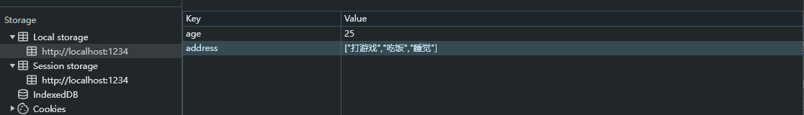

注意：

1. 存储大小限制：约5MB，超出限制会抛出错误。操作时最好用 `try...catch` 包裹。
2. 仅限字符串：存储对象等非字符串数据时，务必使用 `JSON.stringify()` 和 `JSON.parse()`。
3. 同步操作：所有API都是 `同步` 的，大量或频繁操作可能会阻塞主线程，影响页面性能。
4. 不存储敏感信息：由于数据明文存储在用户电脑上，绝对不要用于明文存储密码等敏感信息。

还有就是存储只有 key 和 value ，不会像 Cookie 还存在其他 domain、path 等其他设置，下一节会讲到。

## 四、Cookie

### 4.1、Cookie设置详解

Cookie 是一小段由服务器发送到用户浏览器并由浏览器自动存储的文本数据。浏览器会为每个请求（在符合条件时）自动携带上这些Cookie，将其发送回服务器。它是实现 `有状态` 通信（如会话管理、个性化）的关键技术。

一个完整的 Cookie 通常由以下几部分组成，通过分号和空格分隔：

| 字段                           | 说明                                                         |
| ------------------------------ | ------------------------------------------------------------ |
| Name（名称）                   | 设置的名称                                                   |
| Value（值）                    | 对于设置 Name 的 Value                                       |
| Expires 或 Max-Age（过期时间） | 定义 Cookie 的有效期。Expires 指定一个绝对的过期时间（GMT格式），Max-Age 指定一个以秒为单位的相对存活时间（优先级更高）。如果都未设置，则会 `会话期Cookie`，浏览器关闭失效 |
| Domain（域）                   | 指定哪些主机可以接收该 Cookie                                |
| Path（路径）                   | 指定 URL 路径前缀，只有路径匹配时才会发送 Cookie。           |
| Secure（安全标志）             | 如果设置，Cookie 只能通过 `HTTPS` 协议加密传输。             |
| HttpOnly                       | 如果设置，Cookie 无法通过 JavaScript 的 `document.cookie` API 访问。这是重要的安全措施，用于防止跨站脚本攻击（XSS）窃取 Cookie。 |
| SameSite                       | 控制 Cookie 在跨站请求时是否被发送。是现代浏览器重要的安全特性。 |

其中需要详细说明一下其中的字段：

Max-Age：若设置为正数时表示达到指定秒数就会过期，单位是秒；若设置为 0 时会立即删除现有 Cookie，常见于即使清除数据；若设置为负数时不推荐使用可以忽略其使用。其中还可以设置为 `SESSION` ，它表示这个 Cookie 是一个 `会话 Cookie`。

Domain：指定哪些主机可以接收该 Cookie，唯一需要记住的是一级域名和二级域名都可以发送 Cookie。例如：domain=example.com 设置后，子域（如 shop.example.com）也可以接收此 Cookie

Path：指定 URL 路径前缀，只有路径匹配时才会发送 Cookie。例如：path=/admin，只有 `/admin` 及其子路径（如 `/admin/settings`）的请求才会携带此 Cookie

SameSite：设置 Strict 完全禁止在跨站请求中发送；设置 Lax（默认）在安全的跨站请求（如导航链接）中发送；设置 None 允许在跨站请求中发送，但必须同时设置 `Secure`（即必须使用 HTTPS）

示例如下

```tex
name=value; expires=Sat, 05 Oct 2024 07:28:00 GMT; domain=.example.com; path=/; Secure; HttpOnly; SameSite=Lax
```

也可以从浏览器中进行查看

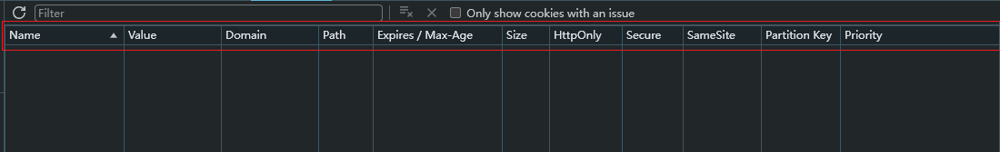

### 4.2、JS操作Cookie

#### 4.2.1、JS对Cookie的基本操作

JavaScript 主要通过 `document.cookie` 属性来操作 Cookie ，无论新增、修改、删除都是通过该 document.cookie 进行处理。

Cookie 操作示例如下

```javascript
/**
 * Cookie 使用
 */

/**
 * 1. 写入一个 Cookie
 */
document.cookie = 'username=zhangsan';

const expiryDate = new Date();
expiryDate.setDate(expiryDate.getDate() + 7);
document.cookie = `theme=dark; expires=${expiryDate.toUTCString()}`;

/**
 * 2. 删除Cookie
 */
// 删除名为 'username' 的Cookie
document.cookie = 'username=; expires=Thu, 01 Jan 1970 00:00:00 GMT; path=/';
// 注意：设置过期时间时，path和domain必须与原Cookie创建时一致，否则可能无法成功删除。

/**
 * 3. 获取当前域和子域的 Cookie
 */
console.log(document.cookie);
```

由于原生 API 比较简陋，一般会封装一些工具函数来方便操作，像 [js-cookie](https://www.npmjs.com/package/js-cookie) 库。

#### 4.2.2、JS对Cookie的字段设置的限制

第一点：Secure、HttpOnly、SameSite 

JavaScript 无法通过 `document.cookie` 对 Cookie 的 Secure、HttpOnly、SameSite 这些属性进行赋值、修改或删除操作，即使设置也是不生效的。这些安全属性的 `控制权完全在后端服务器手中`。它们只能通过服务器的 `Set-Cookie 响应头` 来进行设置和修改。

第二点：path 和 domain

可以通过 `document.cookie` 设置 domain，但有严格的范围限制：

1. 只能设置当前域及其父域（除非是公共后缀如 `.github.io`，公共后缀是指互联网用户可以直接注册子域的域名级别。）
2. 不能设置为任意域，例如：在 `a.example.com` 下无法设置 `domain=b.example.com` 的 Cookie，遵循同源策略原则
3. 不能设置比当前域更窄的子域，例如：在 `example.com` 下可以设置 `domain=example.com` 或 `domain=.example.com`，但不能设置 `Domain=shop.example.com`；而在 `shop.example.com` 下可以设置 `Domain=shop.example.com` 或 `Domain=.example.com`）

```javascript
// 假设当前域是 www.example.com
// 可以：设置为当前域或父域
document.cookie = "name=value; domain=www.example.com;";
document.cookie = "name=value; domain=.example.com;"; // 注意前面的点，但现代浏览器通常会自动处理这个点

// 不可以：设置为其他子域或无关域（浏览器会拒绝）
document.cookie = "name=value; domain=shop.example.com;"; // 错误！
document.cookie = "name=value; domain=google.com;";       // 错误！
```

可以通过 `document.cookie` 设置 Cookie 时指定一个 `Path`

```javascript
// 创建一个只在 /admin 路径下可见的 Cookie
document.cookie = "admin_token=abc123; path=/admin;";
```

需要只有的是如果是在 `/` 和 其他路径（例如：/user）都将看不到设置的 Cookie，在该页面下发送相关请求就不会携带 Cookie。只有在 /admin 和 /admin/setting 等子路径会显示 Cookie 然后在该路径下发送请求就会携带 Cookie。

✏️结论： 虽然前端能设置 `Path` 和 `Domain`，但权限受到极大限制。这些属性的主要控制方仍然是后端，通过 `Set-Cookie` 响应头来确保 Cookie 在正确的范围内被使用。前端操作通常只用于一些非关键的、前端自用的功能。

### 4.3、Cookie局限性

| 局限性   | 说明                                                         |
| -------- | ------------------------------------------------------------ |
| 大小限制 | 每个 Cookie 通常不能超过 4KB，每个域名下的 Cookie 总数也有限制（通常约 50个），所有 Cookie 总大小也有限制。 |
| 性能开销 | 每次 HTTP 请求都会自动携带符合条件的 Cookie，如果 Cookie 过多过大，会显著增加请求头大小，影响性能。 |
| 安全性   | 如果不使用 `Secure` 和 `HttpOnly`，容易被窃取或篡改。`SameSite` 的设置也至关重要。 |
| API 简陋 | 原生JS操作不便，需要自行封装。                               |

### 4.5、Cookie实战演示

#### 4.5.1、HttpOnly 演示

```javascript
const path = require('path');
const express = require('express');
const app = express();

app.get('/', (req, res) => {
  res.cookie('SESSIONID', 'abcdefg', {
    maxAge: 90000,
    httpOnly: true,
  });
  res.sendFile(path.join(__dirname, 'public', 'index.html'));
});

app.listen(8080, () => {
  console.log('Server is running on http://localhost:8080');
});
```

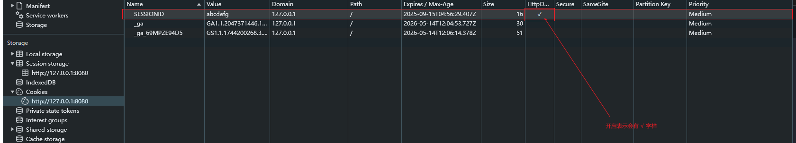

然后在控制台尝试获取 cookie ，然后就会发现打印会空

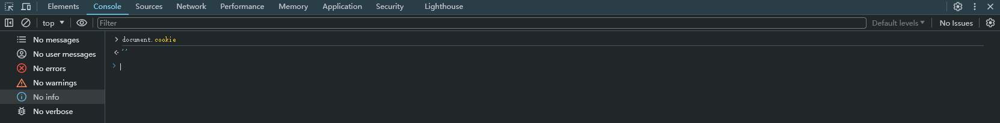

#### 4.5.2、Secure、SameSite

本地 `http://127.0.0.1` 服务检验出 Secure 的效果，建议在实战中进行自查。 Secure 字段只需要知道：Web应用如果是 Https 建议开启 Secure。

SameSite 需要在实际应用才能体现，这里主要牢记可以设置值和其所起到的作用。


