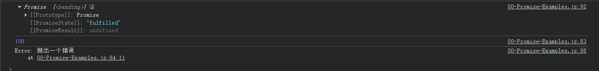
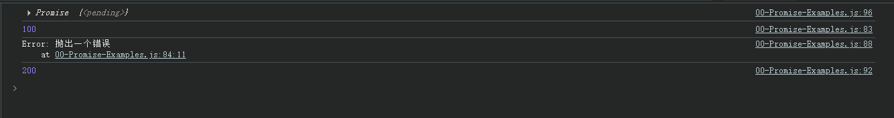

# Promise原理分析

## 一、Promise原理

### 1.1、Promise的then和catch方法

以下实现的原理是基于 JavaScript 实现的，实际的 Promise 非 JavaScript 实现

```javascript
/**
 * 实现 Promise 简单原理
 */

/**
 * 这里为了和 Promise 做区分，使用了西班牙语的 Promesa
 */
class Promesa {
  // 定义的 Promesa 的三种状态
  static PENDING = 'pending'; // 进行中
  static FULFILLED = 'fulfilled'; // 完成
  static REJECTED = 'rejected'; // 错误

  // executor 是传递的一个函数， 参数为 resole 和 reject
  // new Promesa((resolve, rejecct) = {})
  constructor(executor) {
    // 在进行 new Promesa 的时候执行
    this.PromiseState = Promesa.PENDING; // 初始化状态
    this.PromiseResult = null; // 初始化结果

    // .then 方法存储
    this.onFulfilledCallbacks = [];

    // .catch 方法存储
    this.onRejectedCallbacks = [];

    // 注意：这里的 try 对执行 executor 函数执行有错误时是会触发 reject
    try {
      // bind 会改变 this 指向并且返回一个新函数
      executor(this.resolve.bind(this), this.reject.bind(this));
    } catch (error) {
      // 当执行 executor 错误时触发 reject
      this.reject(error);
    }
  }

  /**
   * @param {resolve的结果} result
   */
  resolve(result) {
    if (this.PromiseState === Promesa.PENDING) {
      this.PromiseState = Promesa.FULFILLED;
      this.PromiseResult = result;

      // 执行 fulfilled 回调
      this.onFulfilledCallbacks.forEach((callback) => {
        callback(result);
      });
    }
  }

  /**
   * @param {错误原因} reason
   */
  reject(reason) {
    if (this.PromiseState === Promesa.PENDING) {
      this.PromiseState = Promesa.REJECTED;
      this.PromiseResult = reason;

      // 执行 rejected 错误回调
      this.onRejectedCallbacks.forEach((callback) => {
        callback(reason);
      });
    }
  }

  /**
   * .then((res)=> res, (err)=> {})
   * @param {function} onFulfilled fulfilled状态时 执行的函数
   * @param {function} onRejected rejected状态时 执行的函数
   * @returns {Promesa} 返回的是一个新的 Promesa
   */
  then(onFulfilled, onRejected) {
    let promesa = new Promesa((resolve, reject) => {
      if (this.PromiseState === Promesa.FULFILLED) {
        setTimeout(() => {
          try {
            if (typeof onFulfilled !== 'function') {
              resolve(this.PromiseResult);
            } else {
              let x = onFulfilled(this.PromiseResult);
              resolvePromise(promesa, x, resolve, reject);
            }
          } catch (e) {
            reject(e);
          }
        });
      } else if (this.PromiseState === Promesa.REJECTED) {
        setTimeout(() => {
          try {
            if (typeof onRejected !== 'function') {
              reject(this.PromiseResult);
            } else {
              let x = onRejected(this.PromiseResult);
              resolvePromise(promesa, x, resolve, reject);
            }
          } catch (e) {
            reject(e);
          }
        });
      } else if (this.PromiseState === Promesa.PENDING) {
        // 当还在进行中的时候，对 then 进行 fulfilled、ejected进行收集
        this.onFulfilledCallbacks.push(() => {
          setTimeout(() => {
            try {
              if (typeof onFulfilled !== 'function') {
                resolve(this.PromiseResult);
              } else {
                let x = onFulfilled(this.PromiseResult); // x 是then函数第一参数返回的
                resolvePromise(promesa, x, resolve, reject);
              }
            } catch (e) {
              reject(e);
            }
          });
        });

        this.onRejectedCallbacks.push(() => {
          setTimeout(() => {
            try {
              if (typeof onRejected !== 'function') {
                reject(this.PromiseResult);
              } else {
                let x = onRejected(this.PromiseResult);
                resolvePromise(promesa, x, resolve, reject);
              }
            } catch (e) {
              reject(e);
            }
          });
        });
      }
    });
    return promesa;
  }

  /**
   * .catch((res)=> res, (err)=> {})
   * @param {function} onRejected
   * @returns
   */
  catch(onRejected) {
    return this.then(null, onRejected);
  }
}

/**
 *
 * @param {*} promesa
 * @param {*} x
 * @param {*} resolve
 * @param {*} reject
 * @returns
 */
function resolvePromise(promesa, x, resolve, reject) {
  if (x === promesa) {
    throw new TypeError('Chaining cycle detected for promesa');
  }

  // 若返回的是一个 Promesa
  if (x instanceof Promesa) {
    x.then((y) => {
      resolvePromise(promesa, y, resolve, reject);
    }, reject);

    // 若返回的是否为一个函数
  } else if (x !== null && (typeof x === 'object' || typeof x === 'function')) {
    try {
      var then = x.then;
    } catch (e) {
      return reject(e);
    }

    if (typeof then === 'function') {
      let called = false;
      try {
        then.call(
          x,
          (y) => {
            if (called) return;
            called = true;
            resolvePromise(promesa, y, resolve, reject);
          },
          (r) => {
            if (called) return;
            called = true;
            reject(r);
          },
        );
      } catch (e) {
        if (called) return;
        called = true;

        reject(e);
      }
    } else {
      resolve(x);
    }
  } else {
    return resolve(x);
  }
}
```

🔔注意：原生 Promise 的 then 方法回调是作为微任务执行的，而使用 setTimeout 实现的是宏任务。这在实际使用中会有差异。

对于以上的简单原理对使用上的深入理解

示例1

```javascript
/**
 * 示例1
 * executor 在 new Promesa 中调用，有错误就会抛出 catch
 */
let p = new Promesa((resolve, reject) => {
  console.log('executor 会被执行');
  throw new Error('抛出一个错误'); // 在实际情况中不会抛出错误，这里是和实际 Promise 的使用有差异
  console.log('改行不会打印');
  resolve(100);
});

console.log(p);

let p = new Promise((resolve, reject) => {
  console.log('executor 会被执行');
  throw new Error('抛出一个错误'); // 实际情况会抛出
  // 后续代码不会执行
  console.log('改行不会打印');
  resolve(100);
});

console.log(p);
```

示例2：

```javascript
/**
 * 示例2
 * onFulfilledCallbacks，onRejectedCallbacks 都是数组，可以收集多个
 */
// let p = new Promesa((resolve, reject) => {
//   resolve(100);
// });

let p = new Promise((resolve, reject) => {
  resolve(100);
});

p.then((res) => {
  console.log(res);
});

p.then((res) => {
  console.log(res);
});

p.then((res) => {
  console.log(res);
});

// 以上会打印三次 100

// let p1 = new Promesa((resolve, reject) => {
//   reject('抛出错误');
// });

let p1 = new Promise((resolve, reject) => {
  reject('抛出错误');
});

p1.then((res) => {
  console.log(res);
});

p1.catch((error) => {
  console.log(error);
});

p1.catch((error) => {
  console.log(error);
});

p1.catch((error) => {
  console.log(error);
});

// 依次打印 抛出错误 三次
```

示例3

```javascript
/**
 * 示例3
 * 执行 .then 和 .catch 时都是会抛出一个新的 new Promise
 */
let p = new Promise((resolve, reject) => {
  resolve(100);
})
  // .then会抛出一个新的 new Promise
  .then((res) => {
    console.log(res);
    throw new Error('抛出一个错误');
    console.log('该行不会执行'); // 该行不会执行的原因就是对于 then 的传递的函数执行时内部是会进行 try catch 捕获执行的错误
  })
  // .catch会抛出一个新的 new Promise
  .catch((error) => {
    console.log(error);
    return 200;
  })
  // .then会抛出一个新的 new Promise
  .then((res) => {
    console.log(res); // 输出 200
  });

console.log(p); // 这里打印的 p 的状态会是那个？

/**
 * 答案：
 * 这里打印的 p 实际是 catch 函数返回的 new Promise
 * 状态为 fulfilled，PromiseResult 为 undefined，因为 catch 中没有返回值，若有返回值这个可以继续调用 then
 */
```



在上述的示例进行拓展

```javascript
let p = new Promise((resolve, reject) => {
  resolve(100);
})
  .then((res) => {
    console.log(res);
    throw new Error('抛出一个错误');
    console.log('该行不会执行'); // 该行不会执行的原因就是对于 then 的传递的函数执行时内部是会进行 try catch 捕获执行的错误
  })
  .catch((error) => {
    console.log(error);
    return 200;
  })
  .then((res) => {
    console.log(res); // 输出 200
  });
```



示例4
```javascript
/**
 * 示例4
 * .then 传入的非函数
 */
let p = new Promise((resolve, reject) => {
  resolve(5);
})
  .then(1) // 当传入的非函数时会被跳过
  .then((res) => {
    console.log(res, '🚀'); // 输出 5
  });
```

示例5

```javascript
/**
 * 示例5
 * .then 的函数内部返回的是一个函数
 */
let p = new Promise((resolve, reject) => {
  resolve(3);
})
  .then((res) => {
    console.log(res);
    return () => res * 2;
  })
  .then((res) => {
    console.log(res); // 依旧是 ()=> res * 2
  });
```

示例6：

```javascript
/**
 * 示例6
 * 返回的是一个对象 { then: () => {}}
 */
let p = new Promise((resolve, reject) => {
  resolve({
    then: (res, rej) => {
      res(42);
    },
  });
}).then((res) => {
  console.log(res); // 输出 42
});
```

同理会对 then 进行 try  catch 处理，抛出错误时后续不会执行

```javascript
let p = new Promise((resolve, reject) => {
  resolve({
    then: (res, rej) => {
      throw new Error('抛出一个错误');
      console.log('该行不会执行');
      res(42);
    },
  });
})
  .then((res) => { // 忽略
    console.log(res); 
  })
  .catch((error) => {
    console.log(error);
  });
```

示例7

```javascript
/**
 * 示例7
 * .then 函数内部返回的是一个 Promise
 */
let p = new Promise((resolve, reject) => {
  resolve(100);
})
  .then((res) => {
    console.log(res);
    return new Promise((resolve1, reject1) => {
      console.log('executor 会被执行');
      resolve1(200);
    });
  })
  .then((res) => {
    console.log(res);
  });

// 打印 100 executor 会被执行 200
```

示例8

```javascript
/**
 * 示例8
 * resolve函数传入 new Promise
 */
let p = new Promise((resolve, reject) => {
  resolve(
    new Promise((res, rej) => {
      res(100);
    }),
  );
}).then((res) => {
  console.log(res, '值'); // 输出 100
});

console.log(p);
```

示例9

```javascript
/**
 * 示例9
 * .then 和 .catch 链式编程的迷惑
 */

let p = new Promise((resolve, reject) => {
  resolve(100);
})
  .then((res) => {
    console.log(res);
    throw new Error('抛出错误1');
    return 200;
  })
  .then((res) => {
    console.log(res);
  })
  .catch((error) => {
    console.log(error);
    return 300;
  })
  .then((res) => {
    console.log(res);
  });

// 以上打印顺序：100 抛出错误1 300
```

### 1.2、Promise的全部方法

```javascript
/**
 * 实现 Promise 的全部方法
 * - Promise.resolve()
 * - Promise.reject()
 * - Promise.prototype.catch()
 * - Promise.prototype.finally()
 * - Promise.all()
 * - Promise.allSettled()
 * - Promise.any()
 * - Promise.race()
 */

/**
 * 这里为了和 Promise 做区分，使用了西班牙语的 Promesa
 */
class Promesa {
  // 定义的 Promesa 的三种状态
  static PENDING = 'pending'; // 进行中
  static FULFILLED = 'fulfilled'; // 完成
  static REJECTED = 'rejected'; // 错误

  // executor 是传递的一个函数， 参数为 resole 和 reject
  // new Promesa((resolve, rejecct) = {})
  constructor(executor) {
    // 在进行 new Promesa 的时候执行
    this.PromiseState = Promesa.PENDING; // 初始化状态
    this.PromiseResult = null; // 初始化结果

    // .then 方法存储
    this.onFulfilledCallbacks = [];

    // .catch 方法存储
    this.onRejectedCallbacks = [];

    // 注意：这里的 try 对执行 executor 函数执行有错误时是会触发 reject
    try {
      // bind 会改变 this 指向并且返回一个新函数
      executor(this.resolve.bind(this), this.reject.bind(this));
    } catch (error) {
      // 当执行 executor 错误时触发 reject
      this.reject(error);
    }
  }

  /**
   * @param {resolve的结果} result
   */
  resolve(result) {
    if (this.PromiseState === Promesa.PENDING) {
      this.PromiseState = Promesa.FULFILLED;
      this.PromiseResult = result;

      // 执行 fulfilled 回调
      this.onFulfilledCallbacks.forEach((callback) => {
        callback(result);
      });
    }
  }

  /**
   * @param {错误原因} reason
   */
  reject(reason) {
    if (this.PromiseState === Promesa.PENDING) {
      this.PromiseState = Promesa.REJECTED;
      this.PromiseResult = reason;

      // 执行 rejected 错误回调
      this.onRejectedCallbacks.forEach((callback) => {
        callback(reason);
      });
    }
  }

  /**
   * .then((res)=> res, (err)=> {})
   * @param {function} onFulfilled fulfilled状态时 执行的函数
   * @param {function} onRejected rejected状态时 执行的函数
   * @returns {Promesa} 返回的是一个新的 Promesa
   */
  then(onFulfilled, onRejected) {
    let promesa = new Promesa((resolve, reject) => {
      if (this.PromiseState === Promesa.FULFILLED) {
        setTimeout(() => {
          try {
            if (typeof onFulfilled !== 'function') {
              resolve(this.PromiseResult);
            } else {
              let x = onFulfilled(this.PromiseResult);
              resolvePromise(promesa, x, resolve, reject);
            }
          } catch (e) {
            reject(e);
          }
        });
      } else if (this.PromiseState === Promesa.REJECTED) {
        setTimeout(() => {
          try {
            if (typeof onRejected !== 'function') {
              reject(this.PromiseResult);
            } else {
              let x = onRejected(this.PromiseResult);
              resolvePromise(promesa, x, resolve, reject);
            }
          } catch (e) {
            reject(e);
          }
        });
      } else if (this.PromiseState === Promesa.PENDING) {
        // 当还在进行中的时候，对 then 进行 fulfilled、ejected进行收集
        this.onFulfilledCallbacks.push(() => {
          setTimeout(() => {
            try {
              if (typeof onFulfilled !== 'function') {
                resolve(this.PromiseResult);
              } else {
                let x = onFulfilled(this.PromiseResult); // x 是then函数第一参数返回的
                resolvePromise(promesa, x, resolve, reject);
              }
            } catch (e) {
              reject(e);
            }
          });
        });

        this.onRejectedCallbacks.push(() => {
          setTimeout(() => {
            try {
              if (typeof onRejected !== 'function') {
                reject(this.PromiseResult);
              } else {
                let x = onRejected(this.PromiseResult);
                resolvePromise(promesa, x, resolve, reject);
              }
            } catch (e) {
              reject(e);
            }
          });
        });
      }
    });
    return promesa;
  }

  /**
   * .catch((res)=> res, (err)=> {})
   * @param {function} onRejected
   * @returns
   */
  catch(onRejected) {
    return this.then(null, onRejected);
  }

  /**
   * Promise.resolve()
   * @param {[type]} value 要解析为 Promise 对象的值
   */
  static resolve(value) {
    // 如果这个值是一个 promise ，那么将返回这个 promise
    if (value instanceof Promesa) {
      return value;
    } else if (value instanceof Object && 'then' in value) {
      // 如果这个值是 thenable（即带有`"then" `方法），返回的 promise 会“跟随”这个thenable的对象，采用它的最终状态；
      return new Promesa((resolve, reject) => {
        value.then(resolve, reject);
      });
    }

    // 否则返回的promise将以此值完成，即以此值执行`resolve()`方法 (状态为fulfilled)
    return new Promesa((resolve) => {
      resolve(value);
    });
  }

  /**
   * Promise.reject()
   * @param {*} reason 表示Promise被拒绝的原因
   * @returns
   */
  static reject(reason) {
    return new Promesa((resolve, reject) => {
      reject(reason);
    });
  }

  /**
   * Promise.prototype.finally()
   * @param {*} callBack 无论结果是fulfilled或者是rejected，都会执行的回调函数
   * @returns
   */
  finally(callBack) {
    return this.then(callBack, callBack);
  }

  /**
   * Promise.all()
   * @param {iterable} promises 一个promise的iterable类型（注：Array，Map，Set都属于ES6的iterable类型）的输入
   * @returns
   */
  static all(promises) {
    return new Promesa((resolve, reject) => {
      // 参数校验
      if (Array.isArray(promises)) {
        let result = []; // 存储结果
        let count = 0; // 计数器

        // 如果传入的参数是一个空的可迭代对象，则返回一个已完成（already resolved）状态的 Promise
        if (promises.length === 0) {
          return resolve(promises);
        }

        promises.forEach((item, index) => {
          // Promesa.resolve方法中已经判断了参数是否为promise与thenable对象，所以无需在该方法中再次判断
          Promesa.resolve(item).then(
            (value) => {
              count++;
              // 每个promise执行的结果存储在result中
              result[index] = value;
              // Promise.all 等待所有都完成（或第一个失败）
              count === promises.length && resolve(result);
            },
            (reason) => {
              /**
               * 如果传入的 promise 中有一个失败（rejected），
               * Promise.all 异步地将失败的那个结果给失败状态的回调函数，而不管其它 promise 是否完成
               */
              reject(reason);
            },
          );
        });
      } else {
        return reject(new TypeError('Argument is not iterable'));
      }
    });
  }

  /**
   * Promise.any()
   * @param {iterable} promises 一个promise的iterable类型（注：Array，Map，Set都属于ES6的iterable类型）的输入
   * @returns
   */
  static any(promises) {
    return new Promesa((resolve, reject) => {
      // 参数校验
      if (Array.isArray(promises)) {
        let errors = []; //
        let count = 0; // 计数器

        // 如果传入的参数是一个空的可迭代对象，则返回一个 已失败（already rejected） 状态的 Promise。
        if (promises.length === 0) return reject(new AggregateError([], 'All promises were rejected'));

        promises.forEach((item) => {
          // 非Promise值，通过Promise.resolve转换为Promise
          Promesa.resolve(item).then(
            (value) => {
              // 只要其中的一个 promise 成功，就返回那个已经成功的 promise
              resolve(value);
            },
            (reason) => {
              count++;
              errors.push(reason);
              /**
               * 如果可迭代对象中没有一个 promise 成功，就返回一个失败的 promise 和AggregateError类型的实例，
               * AggregateError是 Error 的一个子类，用于把单一的错误集合在一起。
               */
              count === promises.length && reject(new AggregateError(errors, 'All promises were rejected'));
            },
          );
        });
      } else {
        return reject(new TypeError('Argument is not iterable'));
      }
    });
  }

  /**
   * Promise.allSettled()
   * @param {iterable} promises 一个promise的iterable类型（注：Array，Map，Set都属于ES6的iterable类型）的输入
   * @returns
   */
  static allSettled(promises) {
    return new Promesa((resolve, reject) => {
      // 参数校验
      if (Array.isArray(promises)) {
        let result = []; // 存储结果
        let count = 0; // 计数器

        // 如果传入的是一个空数组，那么就直接返回一个resolved的空数组promise对象
        if (promises.length === 0) return resolve(promises);

        promises.forEach((item, index) => {
          // 非promise值，通过Promise.resolve转换为promise进行统一处理
          Promesa.resolve(item).then(
            (value) => {
              count++;
              // 对于每个结果对象，都有一个 status 字符串。如果它的值为 fulfilled，则结果对象上存在一个 value 。
              result[index] = {
                status: 'fulfilled',
                value,
              };
              // 所有给定的promise都已经fulfilled或rejected后,返回这个promise
              count === promises.length && resolve(result);
            },
            (reason) => {
              count++;
              /**
               * 对于每个结果对象，都有一个 status 字符串。如果值为 rejected，则存在一个 reason 。
               * value（或 reason ）反映了每个 promise 决议（或拒绝）的值。
               */
              result[index] = {
                status: 'rejected',
                reason,
              };
              // 所有给定的promise都已经fulfilled或rejected后,返回这个promise
              count === promises.length && resolve(result);
            },
          );
        });
      } else {
        return reject(new TypeError('Argument is not iterable'));
      }
    });
  }

  /**
   * Promise.race()
   * @param {iterable} promises 可迭代对象，类似Array。详见 iterable。
   * @returns
   */
  static race(promises) {
    return new Promesa((resolve, reject) => {
      // 参数校验
      if (Array.isArray(promises)) {
        // 如果传入的迭代promises是空的，则返回的 promise 将永远等待。
        if (promises.length > 0) {
          promises.forEach((item) => {
            /**
             * 如果迭代包含一个或多个非承诺值和/或已解决/拒绝的承诺，
             * 则 Promise.race 将解析为迭代中找到的第一个值。
             */
            Promesa.resolve(item).then(resolve, reject);
          });
        }
      } else {
        return reject(new TypeError('Argument is not iterable'));
      }
    });
  }
}

/**
 *
 * @param {*} promesa
 * @param {*} x
 * @param {*} resolve
 * @param {*} reject
 * @returns
 */
function resolvePromise(promesa, x, resolve, reject) {
  if (x === promesa) {
    throw new TypeError('Chaining cycle detected for promesa');
  }

  // 若返回的是一个 Promesa
  if (x instanceof Promesa) {
    x.then((y) => {
      resolvePromise(promesa, y, resolve, reject);
    }, reject);

    // 若返回的是否为一个函数
  } else if (x !== null && (typeof x === 'object' || typeof x === 'function')) {
    try {
      var then = x.then;
    } catch (e) {
      return reject(e);
    }

    if (typeof then === 'function') {
      let called = false;
      try {
        then.call(
          x,
          (y) => {
            if (called) return;
            called = true;
            resolvePromise(promesa, y, resolve, reject);
          },
          (r) => {
            if (called) return;
            called = true;
            reject(r);
          },
        );
      } catch (e) {
        if (called) return;
        called = true;

        reject(e);
      }
    } else {
      resolve(x);
    }
  } else {
    return resolve(x);
  }
}
```

### 1.3、Promise面试题

题 1 如下

```javascript
console.log('start');

// 在 new Promise 过程中传递的函数是可以执行的，并且是同步任务
let p = new Promise((resolve) => {
  console.log(1);
  resolve(2);
});

// then 函数为微任务
p.then((res) => {
  console.log(res);
});

console.log('end');

// 输出：start、1 、end、2
```

题 2 如下

```javascript
/**
 * 题2
 */

console.log('start');

// 微任务
Promise.resolve(1).then((res) => {
  console.log(res);
});

// 微任务
Promise.resolve(2).then((res) => {
  console.log(res);
});

console.log('end');

// 输出：start、end、1、2

```

题 3 如下

```javascript
/**
 * 题3
 */
let p = new Promise((resolve, reject) => {
  // 该函数内主要不遇到 Error 都是可以执行的
  console.log(3);
  resolve(6);
  console.log(1);
  reject('error');
});

// 多个 .then 是多个依次的微任务

// 微任务
p.then((res) => {
  console.log(res);
  console.log(7);
}).catch((err) => {
  console.log(2);
  console.log(err);
});

// 微任务
p.then(() => {
  console.log(8);
}).then(() => {
  // 第二个 then 只有等第一个 then 执行时才会返回一个新的 Promise
  console.log(5);
});

console.log(4);

// 输出：3 1 4 6 7 8 5
```

## 二、async 和 await 

### 2.1、async

```javascript
/**
 * async 定义在函数前，返回一个 new Promise，返回值会变成 PromiseResult
 */
async function func() {
  console.log('执行');
  return 1;
}

// 当 func 不进行 func() 调用时是不会执行，同普通函数一样

console.dir(func()); // 当 func 执行时返回的 Promise
```

```javascript
/**
 * 也可以直接返回一个 Promise
 */
async function func2() {
  console.log(1);
  return new Promise((resolve, reject) => {
    resolve(2);
  });
}

func2().then((res) => {
  console.log(res); // 输出 2
});

/**
 * 当执行错误时
 */
async function func() {
  console.log(1);
  throw new Error('抛出错误');
  console.log('不会执行');
}

func().catch((err) => {
  console.log(err);
});
```

### 2.2、await

```javascript
/**
 * 接收一个普通值，返回普通值
 */
async function func(params) {
  let res = await 1;
  console.log(res); // 1
}

func();

/**
 * 接收一个Promise
 */
async function func(params) {
  let res = await new Promise((resolve, reject) => {
    resolve(100);
  });
  console.log(res); // 100
}

func();


/**
 * 接收 Thenable 对象
 */
async function func(params) {
  const thenable = {
    then: (resolve, reject) => {
      resolve(100);
    },
  };
  let res = await thenable;
  console.log(res); // 100
}

func();


/**
 * await 等待了一个错误
 */
async function f1() {
  throw new Error('抛出错误');
}

async function func() {
  let res = await f1(); // 当 f1 中遇到错误时，后续不会在执行，或者 let res = await Promise.reject('错误');
  console.log(res, 'RES'); // 后续不执行，所以这里不打印
}

func()
  .then((res) => {
    // 不执行
    console.log(res);
  })
  .catch((err) => {
    console.log(err, 'err'); // 打印错误
  });


async function f1() {
  throw new Error('抛出错误');
}

/**
 * await 等待了一个错误 （拓展）
 */
async function func() {
  // 当 f1() 进行 catch 之后 res 就是会是一个 undefined
  let res = await f1().catch((err) => {
    console.log(err);
  });
  console.log(res, 'RES'); // 打印 undefined
}

func()
  .then((res) => {
    console.log(res); // 输出 undefined
  })
  .catch((err) => {
    console.log(err, 'err'); // 不执行
  });


/**
 * await 等待了一个错误 （拓展2）
 */
async function f1() {
  throw new Error('抛出错误');
}

async function func() {
  try {
    let res = await f1();
    console.log(res, 'RES'); // 虽然使用 try catch 捕获错误但是这里还是不会打印
  } catch (err) {
    console.log(err); // 打印错误
  }
}

func()
  .then((res) => {
    console.log(res); //  输出 undefined
  })
  .catch((err) => {
    console.log(err, 'err'); // 不执行
  });
```

## 三、综合面试题

### 3.1、宏任务与微任务结合

题 1 如下

```javascript
/**
 * 题1
 */
console.log(1);

setTimeout(() => {
  console.log(2);
}, 0);

new Promise((resolve, reject) => {
  console.log(3);
  resolve();
}).then(() => {
  console.log(4);
});

console.log(5);

setTimeout(() => {
  new Promise((resolve) => {
    console.log(6);
    resolve();
  }).then(() => {
    console.log(7);
  });
}, 0);

// 输出：1 3 5 4 2 6 7
```

题 2 如下

```javascript

console.log(1);

setTimeout(() => {
  console.log(2);
}, 1000); // 加了 1 秒后执行，在宏任务中排队

new Promise(function (resolve) {
  console.log(3);
  resolve();
}).then(() => {
  console.log(4);
});

console.log(5);

setTimeout(() => {
  new Promise(() => {
    console.log(6);
    resolve();
  }).then(() => {
    console.log(7);
  });
}, 0);

// 输出：1 3 5 4 6 7 2
```

题 3 如下

```javascript
console.log('start');

// 微任务
Promise.resolve().then(() => {
  console.log(1);
  setTimeout(() => {
    console.log(2);
  }, 0);
});

// 宏任务
setTimeout(() => {
  console.log(3);
  Promise.resolve().then(() => {
    console.log(4);
  });
}, 0);

console.log('end');

// 输出：start、end、1、3、4、2
```

题 4 如下

```javascript

const first = () =>
  new Promise((resolve, reject) => {
    console.log(3);
    let p = new Promise((resolve, reject) => {
      console.log(7);
      setTimeout(() => {
        console.log(5);
        resolve(6); // promise 状态只能改一次，所以resolve(6)不会执行
      }, 0);
      resolve(1);
    });

    resolve(2);

    p.then((res) => {
      console.log(res);
    });
  });

first().then((res) => {
  console.log(res);
});

console.log(4);

// 输出：3、7、4、1、2、5
```

### 3.1、async、await和Promise结合

🔔牢记：async 返回的是一个 Promise 对象，并且 async 内部在不遇到 await 时都是同步操作。await 关键字只能在 async 函数内部使用。它可以暂停 async 函数的执行，等待 Promise 的解决（resolve），然后以 Promise 的值继续执行函数。

题 1 如下

```javascript
console.log('start');

// async 返回的是一个 Promise
async function foo() {
  // async 在遇到 await 之前都是同步操作
  console.log(1);
  return 2;
}

foo().then((res) => {
  console.log(res);
});

console.log('end');

// 输出 start、1、end、2
```

题 2 如下

```javascript
console.log('start');

function bar() {
  return new Promise((resolve) => {
    resolve(3);
  });
}

// 异步
async function foo() {
  console.log(1);

  let a = await bar();
  console.log(a);

  return 2;
}

foo().then((res) => {
  console.log(res);
});

console.log('end');

// 输出：start、1、end、3、2
```

题 3 如下

```javascript
console.log('start');

function bar() {
  return new Promise((resolve) => {
    setTimeout(() => {
      resolve(3);
    }, 2000);
  });
}

// 异步
async function foo() {
  console.log(1);

  let a = await bar(); // 需要等待 3 秒才能执行
  console.log(a);

  return 2;
}

// foo 函数执行
foo().then((res) => {
  console.log(res);
});

console.log('end');

// 输出：start 1 end 3 2
```

题 4 如下

```javascript
async function fn1() {
  console.log('fn1 start');
  await fn2();
  console.log('fn1 end');
  await fn3();
  console.log('fn3 end');
}

async function fn2() {
  console.log('fn2');
}

async function fn3() {
  console.log('fn3');
}

console.log('start');
fn1();
console.log('end');

// 输出：start、fn1 start、fn2、end、fn1 end、fn3、fn3 end
```

### 3.2、async、await和Promise和宏微任务结合

题 1 如下

```javascript
async function async1() {
  console.log('async1 start');
  await async2();
  // 后续为异步执行任务
  console.log('async1 end');
}

async function async2() {
  console.log('async2');
}

console.log('script start');

setTimeout(function () {
  console.log('setTimeout');
}, 0);

async1();

new Promise(function (resolve) {
  console.log('promise1');
  resolve();
}).then(function () {
  console.log('promise2');
});

console.log('script end');

/**
 * 输出：
 * script start
 * async1 start
 * async2
 * promise1
 * script end
 * async1 end
 * promise2
 * setTimeout
 */
```

题 2 如下

```javascript
async function asy1() {
  console.log(1);
  await asy2();
  console.log(2);
}

const asy2 = async () => {
  await setTimeout(() => {
    Promise.resolve().then(() => {
      console.log(3);
    });
    console.log(4);
  }, 0);
};

const asy3 = async () => {
  Promise.resolve().then(() => {
    console.log(6);
  });
};

asy1();
console.log(7);
asy3();

// 输出：1 7 6 2 4 3
```

题 3 如下

```javascript
async function asy1() {
  console.log(1);
  await asy2();
  console.log(2);
}

async function asy2() {
  console.log(3);
  let a = await Promise.resolve(1).then(() => {
    console.log(6);
  });
  console.log(a, 'a'); // undefined
  console.log(5);
}

asy1();
console.log(7);

// 输出：1 3 7 6 5 2
```

## 四、Promise相关面试题原则总结

原则1：在设置设置等待时间为 0 时，setTimeout 先执行的先进入宏队列中，如果设置了时间需要等待时间执行完才会触发

原则2：当宏任务队列和微任务队列时，始终优先执行微队列，即便微队列是后进入的

原则3：resolve 一旦执行之后，Promise 状态就不会在改变。

原则4：只有当 resolve 执行才会让 .then 进入微任务。

原则5：

+ await 后面接 Promise 时，只有等 Promise 后面微任务执行完成才会代表完成，执行 await 后续的操作。

+ 如果没有执行 resolve 后续将不会操作，await 后续不会执行操作。
+ 同时如果 await 的异步抛出一个错误，后续也不会操作。


