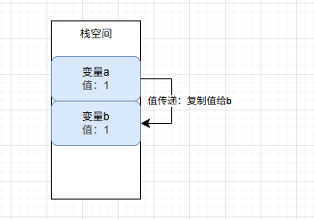
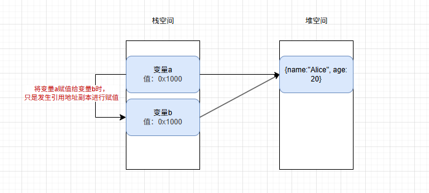
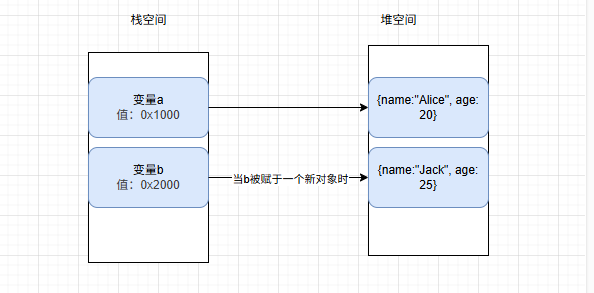

# JavaScript值传递和引用传递

在 JavaScript 中，参数传递的方式可以分为按值传递和按引用传递，但这个分类稍微有些误导。
更准确的说法是，所有参数都是按值传递的，但对于对象（包括数组和函数）来说，传递的是对象引用的副本。

值传递：值传递是将实参的值复制一份给形参，函数内修改形参不影响实参。

引用传递：是将实参的地址传递给形参，函数内修改形参会直接影响实参。

## 一、值传递

```javascript
var a = 1;

var b = a; // 发生值传递，本质上是复制了 a 的值到 b 中

b++; // 发生值传递，b 的值被修改为 2，但 a 的值仍然是 1

console.log(a); // 输出 1
console.log(b); // 输出 2
```

在上述代码实际发生过程如下图



包括在函数传参时传递基础类型时也是一样发生值传递

```javascript
var a = 1;

function func(c) {
  c += 1;
  console.log('c:', c); // 输出：2
}

func(a);

console.log('a:', a); // 输出：1
```

在上述过程，像C++，Java 等其他编程语言都是一样，大多数情况下发生在简单数据类型的栈空间中。

## 二、引用传递

严格意义上来说，JavaScript 只有 "值传递"，对于复杂数据的引用类型时所传递的值是一个 "引用地址的副本"。

例如：当变量定义成一个对象、数组、函数等复杂数据类型时，当该变量进行赋值给其他变量时，会发生以下过程。如下图



下列是代码详细展示过程

```javascript
/**
 * 引用传递
 */
var a = { name: 'a', age: 24 };

var b = a; // 将变量 a 赋值给 变量 b，实际就是将 变量a 的引用地址的一个副本，复制出来的一个地址给到 变量b，并且地址都同一个堆地址

// 使用 === 进行比较，比较两个复杂数据类型是比较的引用地址是否相同
console.log(a === b); // 这里输出: true，说明 变量a 和 变量b 指向同一个堆空间引用地址

b.name = 'b'; // b 的值被修改为 { name: 'b', age: 24 }，a 的值也会变成 { name: 'b', age: 24 }

console.log(a); // 输出: { name: 'b', age: 24 }

console.log(a === b); // 还是输出: true
```

当 变量b 被重新赋值一个新的对象，变量 a 又改如何变化，实际变化过程如下图



```javascript
// 将变量 b 赋值一个新对象
var b = { name: 'jack', age: 26 };

console.log(b); // 输出 { name: 'jack', age: 26 }

console.log(a === b); // 输出：false，因为引用地址不一样了
```

在函数进行复杂数据函数入参时，最容易发生 `引用地址的副本赋值`，开发时需要额外注意的。 示例如下

```javascript

var c = { name: 'Black', age: 32 };

function func(user) {
  user.age += 5;
  console.log('user: ', user); // 输出：{name: 'Black', age: 37}
}

func(c); // 将 c 引用地址作为一个复制的副本作为参数传递给函数

console.log('c: ', c); // 输出：{name: 'Black', age: 37}
```

