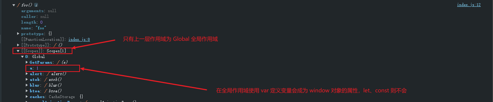
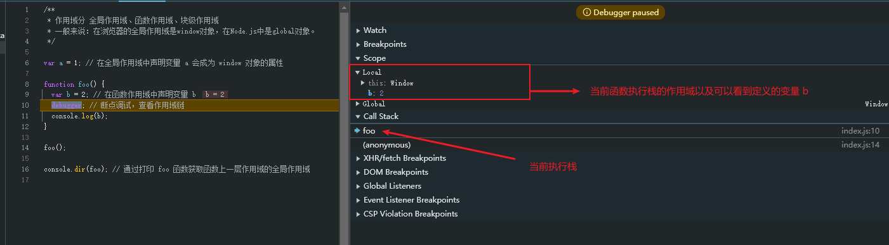
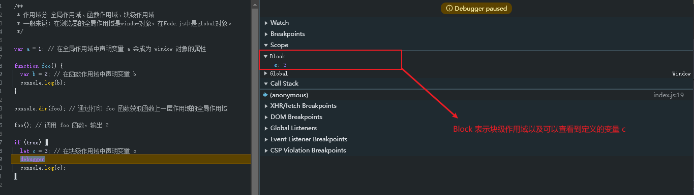

# 作用域和作用域链

在 JavaScript 中, 作用域（scope，或译有效范围）就是变量和函数的可访问范围，即作用域控制着变量和函数的可见性和生命周期

## 一、作用域分类

作用域分三类：全局作用域（Global Scope）、函数作用域（Function Scope）、块级作用域（Block Scope）

全局作用域：在任何地方都能访问、在浏览器的全局作用域是 window 对象，在 Node.js 中的是 global 对象。

函数作用域：在函数内部声明的变量，只在函数内部有效。

块级作用域：使用let和const声明的变量具有块级作用域，这意味着它们只能在最近的一层代码块（如if语句、for循环等）中被访问。块级作用域的出现是为了弥补JavaScript在ES6之前只有函数作用域的不足。

### 1.1、全局作用域

```javascript
var a = 1; // 在全局作用域中声明变量 a 会成为 window 对象的属性

function foo() {
  var b = 2; // 在函数作用域中声明变量 b
  console.log(b);
}

console.dir(foo); // 通过打印 foo 函数获取函数上一层作用域的全局作用域
```



在全局作用域下，使用 var 声明的变量会成为 window 对象的属性，let、const 则不会

### 1.2、函数作用域

在 1.1 节中的代码中添加 `debugger` 调试查看当前函数作用域

```javascript
var a = 1; // 在全局作用域中声明变量 a 会成为 window 对象的属性

function foo() {
  var b = 2; // 在函数作用域中声明变量 b
  debugger; // 断点调试，查看作用域链 // [!code ++]
  console.log(b);
}

console.dir(foo); // 通过打印 foo 函数获取函数上一层作用域的全局作用域

foo(); // 调用 foo 函数，输出 2
```



而对于箭头函数进行 `console.dir` 查看结果也是如上图类似，唯一的区别箭头函数没有 this 指向，箭头函数详细说明见   [JavaScript的this指向问题]()。

### 1.3、块级作用域

在全局作用域下执行下列代码查看块级作用域

```javascript
if (true) {
  let c = 3; // 在块级作用域中声明变量 c
  debugger;
  console.log(c);
}
```



## 二、静态作用域

JavaScript 采用的是静态作用域，也就是说 JavaScript 函数的作用域是在函数定义的情况下就已经确定，那么作用域链也是在函数定义的时候创建

### 2.1、静态作用域示例

```javascript
/**
 * 静态作用域
 */

var a = 1;

function foo() {
  console.log(a, '🚀');
}

function bar() {
  var a = 2; // 在 bar 函数中声明了一个局部变量 a
  foo(); // 调用 foo 函数，输出 1，因为 foo 函数的作用域是静态的，它总是访问定义时的作用域，输出 1
  console.log(a);
}

bar(); // 调用 bar 函数，输出 1 和 2
```

而对于定义一个对象，对象属性定义函数，依旧需要看当前定义时的作用域

```javascript
/**
 * 在当前作用域下定义对象，定义一个属性为一个方法
 */
var a = 1;

var obj = {
  name: '小明',
  foo: function () {
    console.log(a, '🚀');
  },
  bar: () => {
    console.log(a, '🚀');
  },
};

function baz() {
  var a = 3; // 在 baz 函数中声明了一个局部变量 a
  obj.foo(); // 调用 obj 的 foo 方法，输出 1，因为 foo 方法的作用域是静态的，它总是访问定义时的作用域，输出 1
  obj.bar(); // 调用 obj 的 bar 方法，输出 1，因为 bar 方法是箭头函数，它没有自己的 this 和 arguments，访问的是定义时的作用域，输出 1
  console.log(a);
}

baz();
```

由上述代码进行修改，在 baz 函数体内将 obj 赋值给 obj2，其实也就是 obj 和 obj2 变量指针都指向同一个地址。但依旧只看函数初始定义的位置绑定当前作用域。

```javascript
var a = 1;

var obj = {
  name: '小明',
  foo: function () {
    console.log(a, '🚀');
  },
  bar: () => {
    console.log(a, '🚀');
  },
};

function baz() {
  var a = 3; // 在 baz 函数中声明了一个局部变量 a
  
  var obj2 = obj; // 将 obj 赋值给 obj2
  obj2.foo(); // 调用 obj2 的 foo 方法，输出 1，因为 obj2 的 foo 方法仍然是静态作用域，访问的是定义时的作用域
  obj2.bar(); // 调用 obj2 的 bar 方法，输出 1，因为 obj2 的 bar 方法仍然是箭头函数，访问的是定义时的作用域
}

baz();
```

那如果将 obj 的变量定义在 baz 函数内进行定义，绑定的是函数内的作用域。

```javascript
function baz() {
  var a = 3; // 在 baz 函数中声明了一个局部变量 a
  
  var obj3 = {
    name: '小红',
    foo: function () {
      console.log(a, '🚀');
    },
    bar: () => {
      console.log(a, '🚀');
    },
  };

  obj3.foo(); // 调用 obj3 的 foo 方法，输出 3，因为 obj3 的 foo 方法是在 baz 函数的作用域中定义的，它访问的是 baz 函数的局部变量 a
  obj3.bar(); // 调用 obj3 的 bar 方法，输出 3，因为 obj3 的 bar 方法是箭头函数，它没有自己的 this 和 arguments，访问的是定义时的作用域，输出 3
}

baz();
```

根据上述代码进行修改，将 obj 作为函数参数传入，本质上函数参数的指针和 obj 指针指向同一个内存位置，绑定的以及是函数定义位置的作用域。

```javascript
var a = 1;

var obj = {
  name: '小明',
  foo: function () {
    console.log(a, '🚀');
  },
  bar: () => {
    console.log(a, '🚀');
  },
};

function baz(obj) {
  var a = 3; // 在 baz 函数中声明了一个局部变量 a
  obj.foo(); // 输出 1
  obj.bar(); // 输出 1
}

baz(obj);
```

再将代码进行修改，将定义的函数作为参数传入。

```javascript
var a = 1;

function foo() {
  console.log(a);
}

function bar(fn) {
  var a = 2;
  fn(); // 调用 fn 函数，输出 1，因为 foo 函数的作用域是静态的，它总是访问定义时的作用域，输出 1
  console.log(a);
}

bar(foo);
```

### 2.2、bind新生成函数作用域

```javascript
var a = 1;

function foo() {
  console.log(a);
}

function fn() {
  var a = 3;
  let f = foo.bind(this);
  f(); // 打印 1
}

fn();

/**
 * 解释说明
 * 关于作用域（或者说上下文环境），bind() 方法并不会改变函数的作用域链。这意味着，新函数的作用域是基于它被定义时的上下文，而不是基于 bind() 调用时的上下文。
 * 换句话说，bind() 不会改变函数内部访问的变量或对象是通过词法作用域来确定的，即它们是基于函数被定义的位置。
 */
```

总结：bind 方法并不会改变函数的作用域链

## 三、作用域链

当访问一个自由变量的时候，编译器会从当前作用域逐层向上查找直至找到或者到全局作用域，宣布放弃。而作用域链就相当于一个由当前作用域与上层所有作用域组成的一个链表，用于查找变量的值。

```javascript
/**
 * 作用域链
 */

var a = 1;

function foo() {
  var a = 2;
  console.log(a); // 输出 2，因为 foo 函数内部的 a 覆盖了外部的 a

  function bar() {
    var a = 3;
    console.log(a); // 输出 2，因为 bar 函数访问 foo 的作用域链，找到 foo 内部的 a
  }

  bar();
}

foo(); // 调用 foo 函数，输出 2
```

