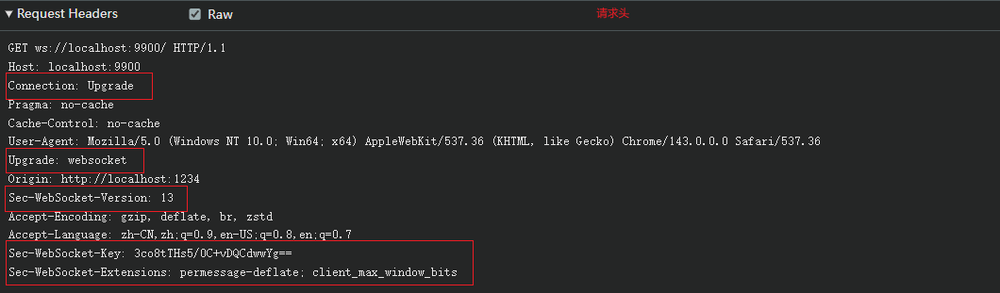
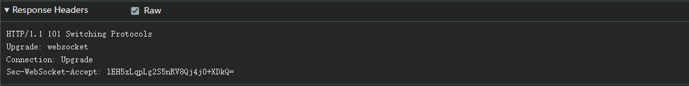

# WebSocket使用

## 一、WebSocket简介

WebSocket 是一种全双工通信协议，允许客户端和服务器之间建立持久化的双向通信连接。WebSocket 协议设计的初衷是解决 HTTP 协议在实时交互上的局限性，例如长轮询、Ajax等方法的高延迟问题。WebSocket 可以在单个 TCP 连接上实现客户端与服务器之间的实时、低延迟的数据传输。

WebSocket 和 Http 都是应用层协议

### 1.1、单工、半双工、双工

这三个术语用于描述通信的方向性，主要适应于数据传输和网络通信，定义如下：

单工：单工通信是单向的，数据只能从发送方传输到接收方，而无法反向传输，通信过程不支持回复或反馈。例如：电视广播和传统的广播电台

半双工：半双工通信是双向的，但在任意时刻只能有一个方向的数据传输，发送方和接收方可以交替发送和接收数据，但不能同时进行。例如：对讲机，一个人说话时，另一方需要等待，直到说话结束才能回复

双工：双工通信是完全双向的，数据可以同时在两个方向传输。发送方和接收方可以同时发送和接收数据。例如：电话通话、网络通信

补充：

最初的 http 版本就是 1.1 以下的是 单工

http1.1 是半双工，建立长连接，出现多路复用，可先后发送多个http请求，不用等待回复，但是回复按顺序一个一个回复。(当前主流)

http2.0 是全双工，一个消息发送后不用等待接受，第二个消息可以直接发送。

## 二、基于Web/Node的Api使用

### 2.1、基于Web API连接WebSocket

```javascript
/**
 * 浏览器原生 Websocket 的使用
 * 详细可以参考 MDN: https://developer.mozilla.org/zh-CN/docs/Web/API/WebSocket
 */
const socket = new WebSocket('ws://localhost:8080');

/**
 * 监听的 open 事件
 */
socket.on('open', function () {
  console.log('socket open');
});

/**
 * 监听 socket 的 message 事件
 */
socket.on('message', function message(data) {
  console.log('received:', data);
});

/**
 * 监听 socket 的 error 事件
 */
socket.on('error', function () {
  console.log('socket error');
});

/**
 * 监听 socket 的 close 事件
 */
socket.on('close', function clear() {
  console.log('socket close');
});

/**
 * websocket 的实例 readyState （只读）属性
 * CONNECTING（0）：websocket 已创建，但连接尚未打开
 * OPEN（1）：websocket连接已打开，准备进行通信
 * CLOSING（2）: websocket连接正在关闭中
 * CLOSED（3）: websocket连接已关闭或无法打开
 */
```

### 2.2、基于Node的ws库创建WebSocket服务器

```javascript
/**
 * 基于 node.js 的 ws 库创建 WebSocket 的服务器
 */
const { WebSocketServer } = require('ws');
const WebSocket = require('ws');

const socketServer1 = new WebSocketServer({ port: 8888 });
// 或者
const socketServer2 = new WebSocket.Server({ port: 8888 });

/**
 * 监听服务端 ws 的连接
 */
socketServer1.on('connection', function connection(ws) {
  /**
   * ws 为 连接的实例
   */

  /**
   * 监听 ws 发送的 message 事件
   */
  ws.on('message', function message(data) {
    console.log('received:', data);
  });

  /**
   * 监听 ws 发送的 error 事件
   */
  ws.on('error', function () {
    console.log('ws error');
  });

  /**
   * 监听 ws 发送的 close 事件
   */
  ws.on('close', function close() {
    console.log('ws close');
  });

  /**
   * 服务端发送消息给客户端
   */
  ws.send();
});
```

或者

```javascript
const { WebSocketServer } = require('ws');
const { createServer } = require('http');

const server = createServer();

/**
 * 传递一个 http 的 createServer 的 server 给 WebSocketServer
 */
const socketServer = new WebSocketServer({ server: server });

/**
 * 监听服务端 ws 的连接
 */
socketServer.on('connection', function connection(ws) {
  /**
   * ws 为 连接的实例
   */

  /**
   * 监听 ws 发送的 message 事件
   */
  ws.on('message', function message(data) {
    console.log('received:', data);
  });

  /**
   * 监听 ws 发送的 error 事件
   */
  ws.on('error', function () {
    console.log('ws error');
  });

  /**
   * 监听 ws 发送的 close 事件
   */
  ws.on('close', function close() {
    console.log('ws close');
  });

  /**
   * 服务端发送消息给客户端
   */
  ws.send();
});

server.listen(8888, () => {
  console.log('Server is running on http://localhost:8888');
});
```

## 三、WebSocket握手过程

### 3.1、客户端向服务端发起WebSocket请求

刚开始的时候，WebSocket 使用一个类似于 HTTP 的握手请求（实际不是 HTTP 请求），这个请求看起来像是普通的 HTTP  请求，但它里面包含了 `特殊的头部信息`，告诉服务器这不是普通的 HTTP 请求，而是希望升级到 WebSocket  协议。



```tex
Connection: Upgrade # 这个头用来指定当前连接应该被升级
Upgrade: websocket # 这个头告诉服务器，客户端想要升级当前的连接到 WebSocket 协议
Sec-WebSocket-Key: 随机生成的 Base64 编码的字符串 # 这是一个随机生成的 Base64 编码的字符串，用于握手验证。服务器需要使用这个键来计算一个特殊的响应值，以确认握手成功
Sec-WebSocket-Version: 13 # 这个头指定了 WebSocket 协议的版本。目前最常用的版本是 13
```

### 3.2、Websocket服务端收到客户端请求并响应



```tex
Upgrade: websocket 
Connection: Upgrade
Sec-WebSocket-Accept
```

握手成功后，连接就升级成了 WebSocket 连接，直到关闭。

## 四、WebSocket的close事件状态码详解

| 状态码 | 详解                                                         |
| ------ | ------------------------------------------------------------ |
| 1000   | 当 客户端/服务端 中任意一端调用 close 事件，另外一端也会触发 close 事件 |
| 1001   | 远程端点将关闭连接，因为它将要重启（浏览器刷新）             |
| 1005   | 无状态码被提供（这是不合法的关闭帧，通常意味着某些库或框架没有正确处理状态码） |
| ‌1006   | 连接被意外关闭，例如网络问题或客户端崩溃。                   |
| 1007   | 接收到不符合协议的数据类型                                   |
| 1008   | 根据策略，连接被认为已经存在传输错误                         |
| 1009   | 接收到的帧太大                                               |
| 1011   | 服务器遇到了一个意外的条件，导致它无法或不会处理请求         |
| 1015   | 由于违反了安全限制，连接被关闭                               |

## 五、WebSocket心跳机制

### 5.1、为什么需要心跳机制

常常发现关闭服务器或客户端时，对方都会非常灵敏地收到 close 事件，于是会提出疑问：断线不都会触发 close 事件吗，为什么还要心跳呢？

所以，我们需要引入[心跳机制](https://zhida.zhihu.com/search?content_id=258168382&content_type=Article&match_order=1&q=心跳机制&zhida_source=entity)（heartbeat）：客户端定期向服务器发送一条“我还活着吗？”的消息（如 ping），服务器在收到后会回应“你还活着”（如 pong）。如果客户端在一定时间内没有收到服务器的回应，就可以判定连接已失效，从而主动关闭连接并进行重连等处理。

**为什么服务器端和客户端都需要各自的心跳机制？**

### 5.2、WebSocket心跳封装

WebSocket 客户端封装

```javascript
/**
 * WebSocket 客户端封装
 */
class WebSocketClient {
  // WebSocket 的实例
  ws = null;

  // 选项配置
  options = {};

  // 连接次数
  reconnectAttempts = 0;

  // 心跳定时器
  heartbeatTimer = null;

  // 心跳超时的定时器
  heartbeatTimeoutTimer = null;

  // 重连定时器
  reconnectTimer = null;

  // 是否手动关闭
  isManualClose = false;

  constructor(options) {
    this.options = {
      maxReconnectAttempts: 5, // 重连次数
      reconnectInterval: 3000, // 重连间隔
      heartbeatInterval: 10000, // 设置心跳：10秒发送一次 ping
      heartbeatTimeout: 30000, // 30秒未接收到 Pong 说明心跳超时
      onOpen: () => {},
      onMessage: () => {},
      onClose: () => {},
      onError: () => {},
      onReconnect: () => {},
      onReconnectFailed: () => {},
      ...options,
    };

    this.connect();

    this.setupEventListeners();
  }

  /**
   * 建立连接
   */
  connect() {
    // 判断是否已经连接
    if (this.isConnected()) {
      return;
    }
    try {
      this.ws = new WebSocket(this.options.url);
      this.bindEvents();
    } catch (error) {
      // 一般服务器发生异常崩溃时，处于连接过程中的错误重连
      console.error('WebSocket连接失败:', error);
      this.handleReconnect();
    }
  }

  // 绑定事件
  bindEvents() {
    if (!this.ws) return;

    this.ws.onopen = this.handleOpen.bind(this);
    this.ws.onclose = this.handleClose.bind(this);
    this.ws.onerror = this.handleError.bind(this);
    this.ws.onmessage = this.handleMessage.bind(this);
  }

  // 监听 error 事件
  handleError(event) {
    this.options.onError(event);
  }

  // 监听 open 事件
  handleOpen(event) {
    console.log('WebSocket连接成功');

    // 每次连接成功需要将重试次数重置为0
    this.reconnectAttempts = 0;

    // 每次连接成功清除重连定时器
    this.clearReconnectTimer();

    // 开始心跳
    this.startHeartbeat();
    this.options.onOpen(event);
  }

  // 监听 close 事件
  handleClose(event) {
    console.log(`连接关闭，code: ${event.code}, reason: ${event.reason}`);

    // 取消心跳
    this.clearHeartbeat();
    this.options.onClose(event);

    // 非手动关闭时重连;
    if (!this.isManualClose) {
      this.handleReconnect();
    }
  }

  // 发送心跳
  startHeartbeat() {
    this.clearHeartbeat();

    const fn = () => {
      if (this.isConnected()) {
        this.send({
          type: 'ping',
          timestamp: Date.now(),
        });

        // 设置心跳超时
        this.heartbeatTimeoutTimer = setTimeout(() => {
          console.error('心跳超时，断开连接');
          // 心跳超时时主动调用 close 方法
          this.ws?.close();
        }, this.options.heartbeatTimeout);
      }
    };

    fn();

    this.heartbeatTimer = setInterval(fn, this.options.heartbeatInterval);
  }

  // 取消心跳
  clearHeartbeat() {
    // 清除心跳定时器 Timer
    if (this.heartbeatTimer) {
      clearInterval(this.heartbeatTimer);
      this.heartbeatTimer = null;
    }

    // 清除心跳超时的定时器 Timer
    if (this.heartbeatTimeoutTimer) {
      clearTimeout(this.heartbeatTimeoutTimer);
      this.heartbeatTimeoutTimer = null;
    }
  }

  // 监听 message 事件
  handleMessage(event) {
    try {
      const message = JSON.parse(event.data);
      switch (message.type) {
        // 心跳
        case 'pong':
          this.handlePong();
          break;
        // 服务器发送错误
        case 'error':
          console.error('服务端错误:', message.data);
          break;
        default:
          this.options.onMessage(message.data);
      }
    } catch (error) {
      console.error('消息解析失败:', error);
    }
  }

  // 收到 Pong 消息之后清除心跳超时定时器
  handlePong() {
    if (this.heartbeatTimeoutTimer) {
      clearTimeout(this.heartbeatTimeoutTimer);
      this.heartbeatTimeoutTimer = null;
    }
  }

  /**
   * 发送消息
   */
  send(data) {
    if (!this.ws || this.ws.readyState !== WebSocket.OPEN) {
      console.warn('ws 不存在或未连接');
      return;
    }

    this.ws.send(JSON.stringify(data));
  }

  /**
   * 处理重连机制
   */
  handleReconnect() {
    // 如果为手动关闭，且当前重新连接次数大于最大连接次数时，无法进行重新连接
    if (this.isManualClose || this.reconnectAttempts >= this.options.maxReconnectAttempts) {
      if (this.reconnectAttempts >= this.options.maxReconnectAttempts) {
        console.error('达到最大重连次数，连接失败');
        this.options.onReconnectFailed();
      }
      return;
    }

    this.clearReconnectTimer();

    // 连接次数 +1
    this.reconnectAttempts++;

    console.log(`第${this.reconnectAttempts}次重连，5s后尝试连接...`);

    this.options.onReconnect(this.reconnectAttempts);

    this.reconnectTimer = setTimeout(() => {
      this.connect();
    }, 5000);
  }

  // 清理重连定时器
  clearReconnectTimer() {
    if (this.reconnectTimer) {
      clearTimeout(this.reconnectTimer);
      this.reconnectTimer = null;
    }
  }

  // 设置全局事件监听
  setupEventListeners() {
    // 监听网络状态变化
    window.addEventListener('online', () => {
      console.log('网络恢复，尝试重连...');
      // 在短暂断网之后又恢复的情况下任会进行发送消息
      if (this.ws && this.isConnected()) {
        this.startHeartbeat();
        return;
      }
      // 这种情况存在于后台超时之后调用了 close 事件，ws 的 readyState 就不再为 OPEN 时触发
      if (!this.ws || this.ws.readyState !== WebSocket.OPEN) {
        this.clearReconnectTimer();
        this.reconnectAttempts = 0;
        this.handleReconnect();
      }
    });

    // 当断开网络的时候，发送的消息后台接收不到，后台长时间接收不到 ping 时触发 close 事件
    window.addEventListener('offline', () => {
      // 这里清除定时器主要是服务端接收不到 ping 消息时客户端也不会接收到 pong 消息导致心跳超时触发 close 事件
      this.clearHeartbeat();
    });
  }

  // 手动关闭连接（非异常的 close 事件）
  close(code, reason) {
    this.isManualClose = true;
    this.clearHeartbeat();
    this.clearReconnectTimer();

    if (this.ws) {
      this.ws.close(code || 1000, reason);
    }
  }

  // 手动重新连接（非异常的 close 事件导致的重连）
  reconnect() {
    this.isManualClose = false;
    this.reconnectAttempts = 0;
    this.close();
    this.connect();
  }

  // 是否已连接
  isConnected() {
    return this.ws?.readyState === WebSocket.OPEN;
  }
}

export default WebSocketClient;
```

WebSocket 服务端封装

```javascript
const WebSocket = require('ws');

/**
 * WebSocket 服务端封装
 */
class WebSocketServer {
  constructor(server) {
    this.wss = new WebSocket.Server({ server });

    // 存储 client 连接信息
    // 数据结构：clientId -> { ws, userId, lastPing }
    this.clients = new Map();

    // 10 秒发送一个心跳
    this.heartbeatInterval = 10000;

    // 处理连接
    this.wss.on('connection', this.handleConnection.bind(this));

    // 30 定时清理失效
    setInterval(this.cleanupClients.bind(this), 30000);
  }

  /**
   * 处理连接
   */
  handleConnection(ws) {
    const clientId = this.generateClientId();

    console.log(`创建新连接: ${clientId}`);

    const client = {
      ws,
      clientId,
      // 用户id
      userId: null,
      // 上一次 Pong 的时间
      lastPong: Date.now(),
      // 客户心跳的定时器 timer 存储
      heartbeatTimer: null,
    };

    // 存储用户
    this.clients.set(clientId, client);

    // 监听 message 事件
    ws.on('message', (data) => {
      this.handleMessage(clientId, data.toString());
    });

    // 监听 close 事件
    ws.on('close', (code, reason) => {
      this.handleClose(clientId, code, reason.toString());
    });

    // 监听 error 事件
    ws.on('error', (error) => {
      console.error(`客户端 ${clientId} 错误:`, error);
    });

    // 心跳检测
    this.startHeartbeat(clientId);
  }

  /**
   * 心跳检测方法
   */
  startHeartbeat(clientId) {
    const client = this.clients.get(clientId);
    if (!client) return;

    client.heartbeatTimer = setInterval(() => {
      // 30秒无响应，说明已经超时
      if (Date.now() - client.lastPong > 30000) {
        console.log(`客户端 ${clientId} 心跳超时`);
        client.ws.close();
      }
    }, this.heartbeatInterval);
  }

  /**
   * 更新上次 Pong 的时间
   */
  updateLastPong(clientId, now) {
    const client = this.clients.get(clientId);
    if (!client) return;
    client.lastPong = now;
  }

  /**
   * 处理 message 函数
   */
  handleMessage(clientId, message) {
    const client = this.clients.get(clientId);
    if (!client) return;

    try {
      const data = JSON.parse(message);

      switch (data.type) {
        // 心跳
        case 'ping':
          const now = Date.now();
          this.updateLastPong(clientId, now);
          this.send(client.ws, { type: 'pong', timestamp: now });
          break;
        // 处理业务
        case 'message':
          this.handleBusinessMessage(clientId, data);
          break;
        default:
          console.warn(`未知消息类型: ${data.type}`);
      }
    } catch (error) {
      console.error('消息解析失败:', error);
      this.send(client.ws, {
        type: 'error',
        data: { message: 'Invalid message format' },
      });
    }
  }

  /**
   * 处理 close 事件
   */
  handleClose(clientId, code, reason) {
    const client = this.clients.get(clientId);
    if (!client) return;

    console.log(`连接关闭: ${clientId}, Code: ${code} 原因: ${reason}`);

    // 清除定时器
    if (client.heartbeatTimer) {
      clearInterval(client.heartbeatTimer);
    }

    // 删除 client 连接信息
    this.clients.delete(clientId);
  }

  /**
   * 处理业务逻辑
   */
  handleBusinessMessage(clientId, data) {
    const client = this.clients.get(clientId);
    if (!client) return;

    console.log(`收到业务消息 from ${client.clientId}:`, data.data);

    // 处理业务逻辑...
    this.send(client.ws, { data: '接收到了你的笑声' });
  }

  /**
   * 发送消息
   */
  send(ws, data) {
    if (ws.readyState === WebSocket.OPEN) {
      ws.send(JSON.stringify(data));
    }
  }

  /**
   * 定时清理失效连接
   */
  cleanupClients() {
    const now = Date.now();
    this.clients.forEach((client, clientId) => {
      if (now - client.lastPong > 120000) {
        // 2分钟无响应
        console.log(`清理超时客户端: ${clientId}`);
        client.ws.close();
        this.clients.delete(clientId);
      }
    });
  }

  /**
   * 生成唯一 clientId
   */
  generateClientId() {
    return Math.random().toString(36).substring(2) + Date.now().toString(36);
  }
}

module.exports = WebSocketServer;
```

## 六、socket.io库使用详解

在 WebSocket 中发送消息都是通过 type 区分判断触发不同的业务函数处理，心跳机制以及断开重连机制都是需要自己维护。socket.io 实现了内部心跳机制和断开重连机制，还实现了服务器连接多路复用（主要通过 namespace 实现）。同时 socket.io 是通过事件的通信。

具体使用如下：

```javascript
/**
 * 客户端如下
 */
import { Manager } from 'socket.io-client';

/**
 * socket.io-client 核心概念
 * 1、一个 Manager 管理一个服务器
 * 2、可以通过 manager.socket() 指定对应命名空间
 */
const manager = new Manager('ws://localhost:9900', {
  autoConnect: false,
  path: '/',
});

// main namespace
const socket = manager.socket('/');

// admin namespace
const adminSocket = manager.socket('/admin');

// 调用 connect 进行连接
socket.connect();

adminSocket.connect();

socket.on('connect', () => {
  console.log(socket.id); // 获取连接之后 id，在未连接时获取是 undefined
  console.log(socket.connected); // 是否连接标志
  console.log(socket.disconnected); // 是否断连标志
});

// 监听 main namespace 的 news 事件
socket.on('news', (data) => {
  console.log(data);
});

// 监听 admin namespace 的 news 事件
adminSocket.on('news', (data) => {
  console.log(data);
});
```

```javascript
/**
 * 服务端如下
 */
const { createServer } = require('http');
const { Server } = require('socket.io');

const httpServer = createServer();

/**
 * 对应 socket.io 的 Server Options 配置参考：https://socket.io/zh-CN/docs/v4/server-options
 * socket.io 的核心概念：
 * 1、一个 Server 对应多个 Namespace
 * 2、一个 Namespace 对应多个 Socket
 */
const io = new Server(httpServer, {
  pingTimeout: 20000,
  pingInterval: 25000,
  cors: {
    origin: '*',
  },
  path: '/',
});

// 自定义 generateId
// io.engine.generateId = () => {
//   return uuid.v4();
// };

// 该事件会在写入会话第一个 HTTP 请求（握手）响应头部之前发出，方便你自定义
// io.engine.on('initial_headers', (headers, req) => {});

// 该事件会在写入会话每个 HTTP 请求（包括 WebSocket 升级）响应头部之前发出，方便你自定义
// io.engine.on('headers', (headers, req) => {});

// 全局监听错误
io.engine.on('connection_error', (err) => {
  console.log(err.code);
});

/**
 * 创建的 io 出来默认的命名空间为 /
 */
io.on('connection', (socket) => {
  socket.emit('news', 'main 哈哈哈哈哈哈');
});

/**
 * 当创建新命名空间时触发
 */
io.on('new_namespace', (namespace) => {
  // 主要是未命名空间动态设置 中间件
  // namespace.use(myMiddleware);
});

/**
 * 创建 admin 命名空间
 */
const adminNamespace = io.of('/admin');

adminNamespace.on('connection', (socket) => {
  setInterval(() => {
    socket.emit('news', 'admin 哈哈哈哈哈哈');
  }, 2000);
});

httpServer.listen(9900, () => {
  console.log('Server is running on http://localhost:9900');
});
```

