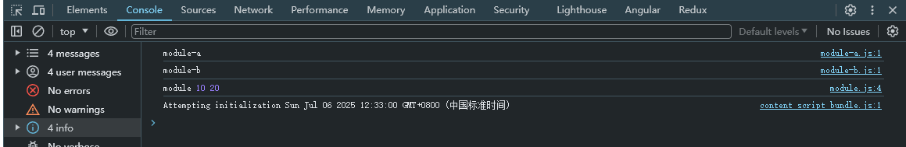
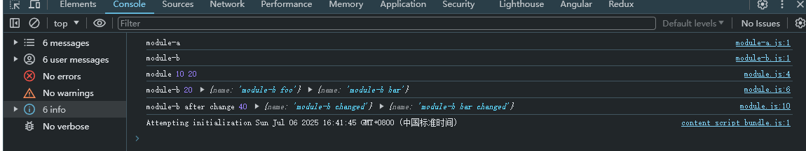

# 浏览器加载JavaScript方式

浏览器在解析 html 文件会 `自上而下` 解析加载，当遇到 `script` 标签时就会对 JS 加载执行。一般 script 标签有 内嵌式 和 外链式。

## 一、正常模式

### 1.1、内嵌式
```javascript
<script>
  // 这里可以添加一些 JavaScript 代码
  console.log("Hello, World!");
</script>
```

### 1.2、外链式

```javascript
<script src="index.js"></script>
```
外链式本质是浏览器会向 src 属性指定路径发送 GET 请求，获取并执行外部 JavaScript 文件。
内嵌式比外链式少一个文件获取过程，相同情况下（外部情况和相同代码下）内嵌式比外链式代码执行时间要短，主要外链式多一个文件获取时间消耗。

无论是内嵌式还是外链式，浏览器必须等待 js 代码加载和执行完才能进行执行 DOM 渲染，在这种情况下JS 是有可能阻塞 DOM 渲染。

## 二、异步模式

```javascript
<script async src="index.js"></script>
```

async 模式下，它的加载是异步的，JS 不会阻塞 DOM 的渲染，async 加载是无顺序的，当它加载结束，JS 会立即执行

## 三、defer模式

```javascript
<script defer src="index.js"></script>
```
defer 模式下，JS 的加载也是异步的，和 async 的区别是 defer 是有顺序的加载，如果有多个设置了 defer 的 script 标签存在，则会按照引入的前后顺序执行。

例如：element-ui.js 和 vue.js，因为 element-ui.js 依赖于 vue，所以必须先引入 vue.js，再引入 element-ui.js

```html
<script defer src="vue.js"></script>
<script defer src="element-ui.js"></script>
```

## 四、module模式

在主流的现代浏览器中，script 标签的属性可以加上 type="module"，浏览器会对其内部的 import 引用发起 HTTP 请求，获取模块内容。这时 script 的行为会类似 defer 一样。

```javascript
<script type="module" src="src/module.js"></script>
```

```javascript
// src/module.js
import { a } from './module-a.js';
import { b } from './module-b.js';

console.log('module', a, b);
```

### 4.1、模块缓存

在上述代码中，对于 module-a 和 module-b 模块进行模块加载，并且无论在 import 多少次，模块只会加载一次就会进行缓存下来

```javascript
// src/module.js
import { a } from './module-a.js';
import { a } from './module-a.js'; // [!code ++]
import { b } from './module-b.js';

console.log('module', a, b);
```



### 4.2、模块作用域

在模块内 this 指向为 undefined，并每个模块文件自动以 `use strict` 模式执行，不需要显式声明。模块作用域内为局部作用域，不会污染全局变量

```javascript
// src/module-a.js
console.log('module-a');

console.log(this); // 在模块中，this 指向 undefined，而不是全局对象

let foo = 'foo';

const a = 10;

export { a, foo };
```

### 4.3、模块导出值的引用

```javascript
// module-b.js
console.log('module-b');

// let foo = 'foo';

let b = 20;

let foo = {
  name: 'module-b foo',
};

let bar = {
  name: 'module-b bar',
};

function changeModuleB() {
  foo.name = 'module-b changed';
  bar = {
    name: 'module-b bar changed',
  };
  b = 40;
}

export { b, foo, bar, changeModuleB };
```

在 module.js 导入并且调用 changeModuleB 方法，无论是像 `foo.属性` 改变值还是像 bar 重新被赋予一个新对象或者还是一个值，导出的都是相同的值的引用空间或者说同一个地址空间。

```javascript
import { a } from './module-a.js';
import { b, changeModuleB, foo, bar } from './module-b.js';

console.log('module', a, b);

console.log('module-b', b, foo, bar);

changeModuleB();

console.log('module-b after change', b, foo, bar);
```

在调用方法改变之后，都会正确进行改变，并且模块执行一次被缓存，缓存的也是导出的引用空间地址。



### 4.4、模块默认使用 CORS 加载

当在本地创建静态服务并创建 module-c.js 文件

```javascript
let c = 50;

export { c };
```

```html
<!DOCTYPE html>
<html lang="en">
<head>
  <meta charset="UTF-8">
  <meta name="viewport" content="width=device-width, initial-scale=1.0">
  <title>浏览器加载JavaScript方式</title>
</head>
<body>
  
</body>
<script type="module" src="src/module.js"></script>
<!-- 当前请求可能会触发同源策略 -->
<script type="module" src="http://localhost:19527/module-c.js"></script>
</html>
```

