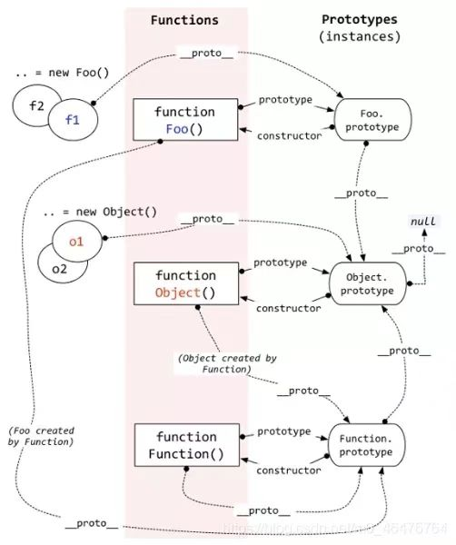

# 原型和原型链

## 一、原型

在 JavaScript 中，每定义一个对象（函数也是对象），对象中都会包含一些预设的属性。所有的函数对象都有一个prototype 属性，这个属性指向一个对象，该对象称为函数的原型对象。 

原型对象的定义很简单，就是在函数对象中添加一个属性，这个属性的值是另一个对象。这似乎没什么值得讨论的，普通对象也可以这样做。之所以原型对象值得单独讨论，是因为原型对象的特别之处在于原型对象中的方法和属性都可以被这个函数的实例对象所访问。原型对象就像一个公共区域，一个函数的原型对象可以被该函数创建的所有实例对象访问。

```javascript
/**
 * 原型
 */
function Foo() {}

Foo.prototype.print = function () {
  console.log('print');
};

let f = new Foo();

f.print(); // 实例对象可以访问 print 方法
```

在上述代码中，利用函数 Foo 创建一个实例对象 f，接着给函数的原型对象 Foo.prototype 添加了一个方法 print。正常的思维来讲，print 是定义给 Foo.prototype 这个对象的方法，f 这个对象并不能访问到 print 方法。但是最后运行代码时，浏览器并未报错，反而访问到了 print 方法，这就是因为 f 是函数 Foo 的实例对象，所以对于 f 来说，Foo 的原型对象Fun.prototype 中所有的属性和方法都是可以访问的。

上面提到了函数的原型对象，一般我们将函数的 `prototype ` 属性指向的对象称为函数的显示原型，这是函数对象所独有的，其他类型的对象不具有这个属性。有了显示原型，自然也就存在隐式原型，它的名称是 `__proto__`，这个属性是所有的对象都有的，它指向也是一个对象。一个对象的隐式原型指向的是它的构造函数的显示原型代码简单验证一下。

```javascript
/**
 * 原型
 */
function Foo() {}

Foo.prototype.print = function () {
  console.log('print');
};

let f = new Foo();

f.print(); // 实例对象可以访问 print 方法

console.log(f.__proto__); // [!code ++]

console.log(Foo.prototype === f.__proto__); // 输出 true // [!code ++]
```

## 二、原型链

原型链的定义就是由原型对象组成的链式结构。前文中提到函数的显示原型和它的实例对象的隐式原型指向的是同一个对象，而所有的对象都是具有隐式原型的，则原型对象也不例外，他也有自己的构造函数和原型对象。这样就构成了一个由原型对象组成的链式结构，称为原型链。

为了防止原型链陷入死循环，设置了一个原型链的终点 Object.prototype 对象。因为所有的对象都可以视为是由 Object 创建的，同时该对象的隐式原型为 null。 

```javascript
console.log(Object.prototype.__proto__) // null
```

粗略来看，原型和原型链就是一个可供某类对象访问的公共区域，似乎不如我们直接把属性和方法定义在特定对象中方便。但是当数据量相当庞大的时候，原型链的作用就越发凸显了，只要在原型中定义一个方法，所有的对象都能通过原型链来访问这个方法，而不用为每一个对象定义一个方法，这样的作法既可以节约代码量，又能提高性能节约内存资源。
关于原型链有几个常用的概念：

+ 访问一个对象的属性时，首先在对象中自身寻找，未找到则沿着原型链网上寻找，原型链中不存在对应方法则返回 undefined。
+ 定义对象属性的时候不会访问原型链，而是直接定义在对象中。
+ 方法一般定义在原型对象中，属性一般通过构造函数定义在对象中。

```javascript
/**
 * 原型链
 */
console.log(Object.prototype.__proto__); // null

function Foo() {}

Foo.prototype.a = 'xxx'; // 所有实例对象都可以访问

let f1 = new Foo();

let f2 = new Foo();

console.log(f1.a); // 输出：xxx

f2.a = 'yyy'; // 这里修改的是 f2 实现对象的属性 a ，不是 prototype 的属性a

console.log(f2.a); // 输出：yyy
console.log(f1.a); // 输出：xxx

f2.__proto__.a = 'yyy';

console.log(f1.a); // 输出：yyy
```

实例对象共用方法

```javascript
function User(name, age) {
  this.name = name;
  this.age = age;
}

User.prototype.setName = function (name) {
  this.name = name;
};

let u1 = new User('Tom', 12);
u1.setName('Bob');
console.log(u1);

let u2 = new User('Kite', 18);
u2.setName('Rose');
console.log(u2);
```

原型链结构图



