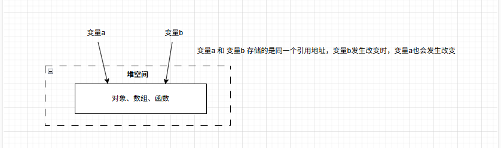

# JavaScript值传递和引用传递

在 JavaScript 中，参数传递的方式可以分为按值传递和按引用传递，但这个分类稍微有些误导。
更准确的说法是，所有参数都是按值传递的，但对于对象（包括数组和函数）来说，传递的是对象引用的副本。

值传递：值传递是将实参的值复制一份给形参，函数内修改形参不影响实参。

引用传递：是将实参的地址传递给形参，函数内修改形参会直接影响实参。

## 一、值传递

```javascript
var a = 1;

var b = a; // 发生值传递，本质上是复制了 a 的值到 b 中

b++; // 发生值传递，b 的值被修改为 2，但 a 的值仍然是 1

console.log(a); // 输出 1
console.log(b); // 输出 2
```

在上述代码实际发生过程如下图


在上述过程，像C++，Java 等其他编程语言都是一样，大多数情况下发生在简单数据类型的栈空间中。

## 二、引用传递

当变量定义成对象、数组、函数时，变量进行赋值给其他变量时，变量存储的引用类型的同一个地址。如下图



然而在 JavaScript 引用数据进行赋值时，本质上是 `变量a` 和 `变量b` 存储的是不同引用地址，但是都是指向了同一个值。

下列代码详细展示过程

```javascript
var a = { name: 'a' };

var b = a; // 将变量 a 的值赋值给变量 b，此时 a 和 b 都指向同一个对象，变量 a 和 b 存储的是不同的存储空间位置

b.name = 'b'; // 发生引用传递，b 的值被修改为 { name: 'b' }，a 的值也会变成 { name: 'b' }

console.log(a); // 输出 { name: 'b' }
```

上述代码的过程如下图


当变量b 被重新赋值一个新的对象，变量 a 如何变化

```javascript
var a = { name: 'a' };

var b = a;

// 将变量 b 赋值一个新对象

var b = { name: 'bbb' };

console.log(a); // 输出 { name: 'a' }
```

当变量 b 被重新赋值一个新的对象，变量 a 没有发生变化，发生过程如下图


变量 b 的引用地址指向的新对象，变量 a 的引用地址不变。

由上述过程得出：

1. 如果变量 a 和变量 b 发生引用传递时，变量 b 被赋值一个新对象时，变量 a 就会跟着发生变化指向新的对象，这个过程通常发生在像 C++ 等编程语言中
2. 在 JavaScript 中 变量 a 和变量 b 不发生引用传递，而是 变量a 和 变量b 存储的不同引用地址。变量 b 指向一个新对象地址不会影响原始对象的引用。

