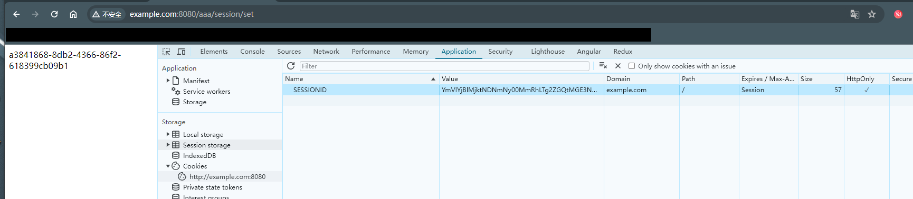
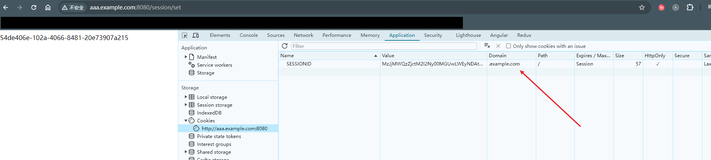

# Cookie和Session共享登录案例

### 一、 同域名下不同项目的Session共享（cookie-session-login-01）

```bash
# 示例：项目A和项目B 共享session
example.com/aaa # 项目A
example.com/bbb # 项目B
```

首先修改电脑的 hosts 文件，将本地ip映射一个域名，如下：

```tex
127.0.0.1 example.com
```

在项目A和项目B中均设置 LoginCtrl 控制器，内容如下

```java
package com.example.controller;

import jakarta.servlet.http.HttpSession;
import org.springframework.web.bind.annotation.GetMapping;
import org.springframework.web.bind.annotation.RequestMapping;
import org.springframework.web.bind.annotation.RestController;

import java.util.UUID;

@RestController
@RequestMapping("/session")
public class LoginCtrl {
    /**
     * 模拟已经登录并且设置session
     * @param session
     * @return
     */
    @GetMapping("set")
    public String setLogin(HttpSession session) {
        UUID uuid = UUID.randomUUID();
        session.setAttribute("uuid", uuid.toString());
        System.out.println("设置login的session");
        return uuid.toString();
    }

    /**
     * 获取登录后的session
     * @param session
     * @return
     */
    @GetMapping("get")
    public String getLoginSession(HttpSession session) {
        String uuid = (String) session.getAttribute("uuid");
        System.out.println("获取了login的session");
        return uuid;
    }
}
```

项目A和项目B的 application.yml 的设置

```yml
# 项目A
server:
  port: 8080
  servlet:
    context-path: /aaa
    session:
      cookie:
      	path: /
        name: SESSIONID
        
# 项目B
server:
  port: 9000
  servlet:
    context-path: /bbb
    session:
      cookie:
       	path: /
        name: SESSIONID
```

项目A 和 项目B 最终能实现 session 共享最重要的是 cookie 的 Domain 为同一个域名，path 设置成 /，如下图：



运行流程：

1. 假设在项目A中登录，在项目B中是否可以获取session，并且和项目A设置的session一致
2. 假设在项目B中登录，在项目A中是否可以获取session，并且和项目B设置的session一致

🔔注意：由于是在同一台电脑上所以项目A的端口和项目B的端口不一样

### 三、同根域名下不同二级子域名的Session共享（cookie-session-login-02）
```bash
# 示例：项目A和项目B 共享session
aaa.example.com # 项目A
bbb.example.com # 项目B
```

首先修改电脑的 hosts 文件，将本地ip映射一个域名，如下：

```tex
127.0.0.1 aaa.example.com
127.0.0.1 bbb.example.com
```

在项目A和项目B中均设置 LoginCtrl 控制器保持不变，项目A和项目B的 application.yml 的设置如下

```yml
# 项目A
server:
  port: 8080
  servlet:
    session:
      cookie:
        domain: example.com
        name: SESSIONID
        
# 项目B
server:
  port: 8081
  servlet:
    session:
      cookie:
        domain: example.com
        name: SESSIONID
```

项目A 和 项目B 最终能实现 session 共享最重要的是 cookie 的 Domain 设置为根域名，如下图：



