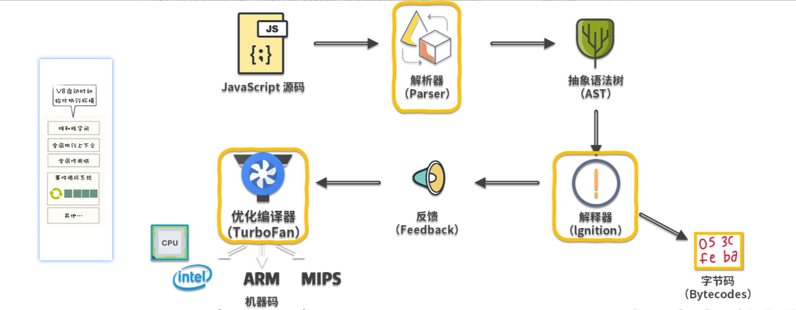
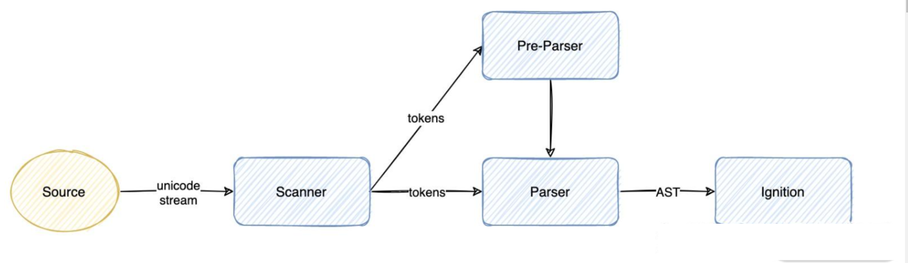
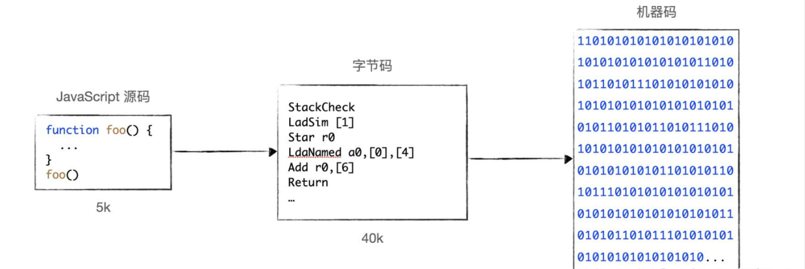

# V8是如何执行JavaScript代码

## 一、V8是什么

V8 是一个由 Google 开发的开源 JavaScript 引擎，目前用在 Chrome 浏览器和 Node.js 中，其核心功能是执行 JavaScript 代码。其主要核心流程分为编译和执行两步。首先需要将 JavaScript 代码转换为低级中间代码或者机器能够理解的机器代码，然后再执行转换后的代码。

## 二、V8执行JavaScript代码过程

### 2.1、先初始化基础环境

V8 与宿主（如浏览器和node.js）的关系紧密，类似于病毒与细胞之间的共生关系。浏览器为 V8 提供了必要的基础设施，如消息循环系统、全局变量和 Web API，而 V8 则专注于实现 ECMAScript 标准。它提供了 ECMAScript 定义的一些核心对象和函数，例如 Object、Function 和 String。此外，V8 还集成了垃圾回收器和协程等关键功能，但这些功能的完整执行仍需依赖宿主环境的支持。在启动并执行 JavaScript 之前，必须首先初始化其所需的基础环境，这涵盖了堆空间与栈空间的分配、全局执行上下文的建立，以及宿主环境提供的扩展 API 和对象、消息循环系统等。



### 2.2、执行JavaScript过程

当 V8 执行 JavaScript 源码时，首先解析器会把源码解析为抽象语法树（Abstract Syntax Tree），解释器（Ignotion）再将 AST 翻译为字节码，一边解释一边执行。

在此过程中，解释器会记特定代码片段的运行次数，如果代码运行次数超过某个阈值，那么该段代码就被标记为热代码（hot code），并将运行信息反馈给优化编译器（TurboFan）。

优化编译器根据反馈信息，优化并编译字节码，最终生成优化后的机器码，这样当该段代码再次执行时，解释器就直接使用优化机器码执行，不用再次解释，大大提高了代码运行效率。

这种在运行时编译代码的技术也被称为 `JIT（即时编译）` 通过JIT可以极大提升 JavaScript 代码的执行性能。

#### 2.2.1、解析器（Parser）如何把源码转换成 AST

要让 V8 执行我们编写的源码，就要将源码转换成 V8 能理解的格式。V8 会先把源码解析为一个抽象语法树（AST），这是用来表示源码的树形结构的对象，这个过程称为解析（Parsing），主要由 V8 的 Parser 模块实现。然后， V8 的解释器会把 AST 编译为字节码，一边解释一边执行。

解析和编译过程的性能非常重要，因为 V8 只有等编译完成后才能运行代码（现在我们先关注 V8 中解析过程的实现）。



整个解析过程可分为两部分：

+ 词法分析：将字符流转换为 tokens，字符流就是我们编写的一行行代码，token 是指语法上不能再分割的最小单位，可能是单个字符，也可能是字符串，图中的 Scanner 就是 V8 的词法分析器。
+ 语法分析：根据语法规则，将 tokens 组成一个有嵌套层级的抽象语法结构树，这个树就是 AST，在此过程中，如果源码不符合语法规范，解析过程就会终止，并抛出语法错误。图中的 Parser 和 Pre-Parser 都是 V8 的语法分析器

词法分析

在 V8 中，Scanner 负责接收 Unicode 字符流，并将其解析为 tokens，提供给解析器使用。比如 var a = 1; 这行代码，经过词法分析后的 tokens 就是下面这样

```json
[
    {
        "type": "Keyword",
        "value": "var"
    },
    {
        "type": "Identifier",
        "value": "a"
    },
    {
        "type": "Punctuator",
        "value": "="
    },
    {
        "type": "Numeric",
        "value": "1"
    },
    {
        "type": "Punctuator",
        "value": ";"
    }
]
```

可以看到， var a = 1; 这样一行代码包括 5 个tokens：

+ 关键字 var
+ 标识符 name
+ 赋值运算符 = 
+ 分割符 ;

语法分析

接下来， V8 的解析器会通过语法分析，根据 tokens 生成 AST，` var a = 1;`  这行代码生成的 AST 的 JSON 结构如下所示：

```javascript
{
  "type": "Program",
  "start": 0,
  "end": 10,
  "body": [
    {
      "type": "VariableDeclaration",
      "start": 0,
      "end": 10,
      "declarations": [
        {
          "type": "VariableDeclarator",
          "start": 4,
          "end": 9,
          "id": {
            "type": "Identifier",
            "start": 4,
            "end": 5,
            "name": "a"
          },
          "init": {
            "type": "Literal",
            "start": 8,
            "end": 9,
            "value": 1,
            "raw": "1"
          }
        }
      ],
      "kind": "var"
    }
  ],
  "sourceType": "module"
}
```

但是对于一份 JavaScript 源码，如果所有源码在执行前都要完全经过解析才能执行，那必然会面临以下问题。

+ 代码执行时间变长：一次性解析所有代码，必然会增加代码的运行时间。
+ 消耗更多内存：解析完的 AST，以及根据 AST 编译后的字节码都会存放在内存中，必然会占用更多内存空间。
+ 占用磁盘空间：编译后的代码会缓存在磁盘上，占用磁盘空间。

所以，现在主流 JavaScript 引擎都实现了延迟解析（Lazy Parsing）。

延迟解析

延迟解析的思想很简单：在解析过程中，对于不是立即执行的函数，只进行预解析（Pre-Parser），只有当函数调用时，才对函数全量解析。

进行预解析时，只验证函数语法是否有效、解析函数声明、确定函数作用域，不生成 AST ，而实现预解析的，就是 Pre-Parser 解析器。

以一段代码为例：

```javascript
function foo(a, b) {
    var res = a + b;
    return res;
}
var a = 1;
var c = 2;
foo(1, 2);
```

由于 Scanner 是按字节流从上往下一行行读取代码的，所以 V8 解析器也是从上往下解析代码。当 V8 解析器遇到函数声明 foo 时，发现它不是立即执行，所以会用 Pre-Parser 解析器对其预解析，过程中只会解析函数声明，不会解析函数内部代码，不会为函数内部代码生成 AST。

然后 Ignition 解释器会把 AST 编译为字节码并执行，解释器会按照自上而下的顺序执行代码，先执行 var a = 1; 和 var a = 2; 两个赋值表达式，然后执行函数调用 foo(1, 2) ，这时 Parser 解析器才会继续解析函数内的代码、生成 AST，再交给 Ignition 解释器编译执行。

#### 2.2.2、解释器（Ignition）如何将 AST翻译为字节码并执行

V8 为了解决内存占用问题引入了字节码。如图所示，通常一个几 KB 的文件，转换为机器码可能就是几十兆，这会消耗巨大的内存空间。



V8 的字节码是对机器码的抽象，语法与汇编有些类似，你可以把 V8 字节码看作一个个指令，这些指令组合到一起实现我们编写的功能，V8 定义了几百个字节码，你可以在 V8 解释器的头文件中查看所有字节码 [bytecodes.h](https://link.zhihu.com/?target=https%3A//github.com/v8/v8/blob/master/src/interpreter/bytecodes.h)

Ignition 解释器在执行字节码时，主要使用通用寄存器和累加寄存器（accumulator register），函数参数和局部变量都保存在通用寄存器中，累加寄存器用于保存中间结果。

值得注意的是：Ignition 解释器在执行字节码时，依旧需要将字节码转换为机器码，因为 CPU 只能识别机器码。

虽然多了一层字节码的转换，看起来效率低了，但相比于机器码，基于字节码可以更方便进行性能优化。V8也的确做了很多性能优化工作，其中最主要的就是使用 Turbofan 编译器编译热点代码，这些性能优化，使得如今基于字节码架构的性能远超当年直接编译机器码架构的性能。

