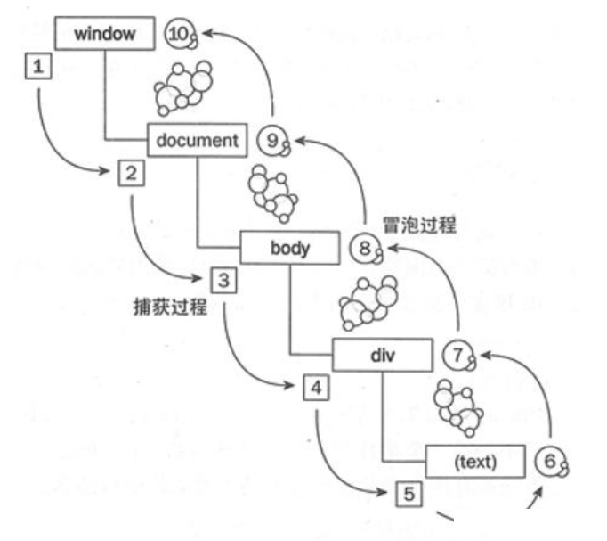
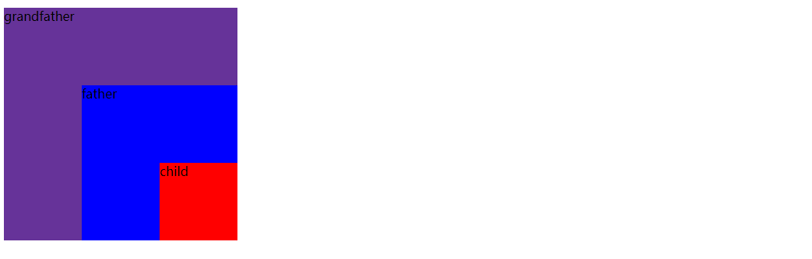

# 事件捕获、冒泡和委托

## 一、捕获和冒泡过程



事件捕获：它是 DOM 事件流的第一个阶段，当鼠标点击目标事件后，事件将会从最外层的 `window` 或 `document` 开始，`自外而内` 地传播到目标元素，其触发时机要早于目标元素的事件处理。

事件冒泡：它是事件流的最后一个阶段，它和事件捕获相似，但是事件传播方向相反，它的事件是从目标元素开始，`自内而外` 地传播到根节点（如 `document` 或 `window`）。

## 二、捕获和冒泡分析

定义 html 基础代码如下

```html
<!doctype html>
<html lang="en">
  <head>
    <meta charset="UTF-8" />
    <meta
      name="viewport"
      content="width=device-width, initial-scale=1.0" />
    <title>冒泡和捕获</title>
    <style>
      #grandfather {
        width: 300px;
        height: 300px;
        background-color: rebeccapurple;
        position: relative;
      }

      #father {
        width: 200px;
        height: 200px;
        background-color: blue;
        position: absolute;
        right: 0;
        bottom: 0;
      }

      #child {
        width: 100px;
        height: 100px;
        background-color: red;
        position: absolute;
        right: 0;
        bottom: 0;
      }
    </style>
  </head>
  <body>
    <h1>冒泡和捕获</h1>

    <div id="grandfather">
      grandfather
      <div id="father">
        father
        <div id="child">child</div>
      </div>
    </div>
  </body>
  <script src="./src/index.js"></script>
</html>

```

显示效果如下



### 2.1、冒泡阶段

```javascript
let grandfather = document.getElementById('grandfather');
let father = document.getElementById('father');
let child = document.getElementById('child');

console.log(grandfather, father, child);

/**
 * addEventListener传递的参数有三个：
 * 事件类型（type）：指定监听的事件名称，如 click
 * 事件处理函数（listener）：必需的回调函数，在事件触发时执行，接收事件对象（Event）作为参数。‌‌
 * 选项（options）：可为布尔值或对象
 *    布尔值：默认为 false，表示在冒泡阶段触发，为 true 表示在捕获阶段触发
 *    对象：
 *         capture：同布尔值用法一致
 *         once：只触发一次
 *         passive：监听器不会调用 preventDefault()
 */
child.addEventListener('click', function () {
  console.log('Child element is clicked');
});

father.addEventListener('click', function () {
  console.log('Father element is clicked');
});

grandfather.addEventListener('click', function () {
  console.log('Grandfather element is clicked');
});
```

打印的顺序为

```tex
Child element is clicked
Father element is clicked
Grandfather element is clicked
```

### 2.2、捕获阶段

当 addEventListener 的第三个参数为 true 表示监听的是捕获阶段

```javascript
let grandfather = document.getElementById('grandfather');
let father = document.getElementById('father');
let child = document.getElementById('child');

child.addEventListener('click', function () {
  console.log('Child element is clicked');
});

father.addEventListener('click', function () {
  console.log('Father element is clicked');
});

grandfather.addEventListener('click', function () {
  console.log('Grandfather element is clicked');
});

/**
 * 再添加一个捕获阶段的事件监听
 */
father.addEventListener(
  'click',
  function () {
    console.log('Father element is clicked', '捕获阶段');
  },
  true,
);
```

打印的顺序为

```tex
Father element is clicked 捕获阶段
Child element is clicked
Father element is clicked
Grandfather element is clicked
```

### 2.3、阻止冒泡

如果需要阻止冒泡则需要调用事件对象的 `stopPropagation ` 方法即可，不仅可以阻止冒泡阶段也可以阻止捕获阶段。

当添加到以下的冒泡中的一个 addEventListener 中

```javascript
father.addEventListener('click', function (e) {
  console.log('Father element is clicked');
  e.stopPropagation();
});
```

打印的顺序为

```tex
Father element is clicked 捕获阶段
Child element is clicked
Father element is clicked
```

当添加到到捕获中的 addEventListener 中

```javascript
father.addEventListener(
  'click',
  function (e) {
    console.log('Father element is clicked', '捕获阶段');
    e.stopPropagation();
  },
  true,
);
```

打印的顺序为

```tex
Father element is clicked 捕获阶段
```

## 三、事件委托

事件委托：事件委托就是 `利用冒泡机制将子元素的事件处理委托给父元素进行处理`，因为依赖 `冒泡机制`，所以，如果阻断了事件冒泡，事件委托也无法实现。

具体实现如下

```html
<ul id="list">
  <li>1111</li>
  <li>2222</li>
  <li>3333</li>
</ul>
```

具体 js 的代码实现

```javascript
let list = document.getElementById('list');

list.addEventListener('click', function (e) {
  console.log(e.target); // 通过 target 属性精确识别触发元素
});
```


