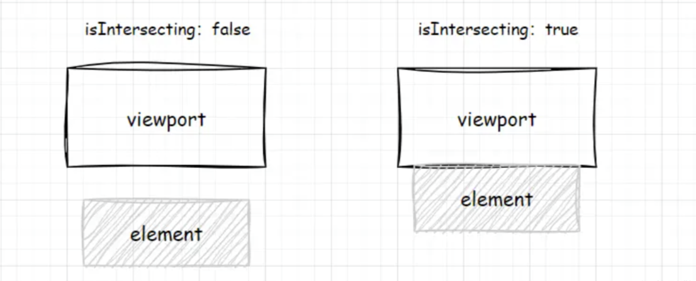

# 原生观察器

Web API提供5种观察器：IntersectionObserver、MutationObserver、ResizeObserver、PerformanceObserver、ReportingObserver

## 一、IntersectionObserver 交叉观察器

IntersectionObserver 是一个 Web API，它可以异步地监测一个元素与其祖先或顶级文档视口之间的交叉状态。它会告诉我们目标元素是否进入或离开了视口，或者与其他元素重叠。

更多的详细使用参考：[MDN对IntersectionObserver说明](https://developer.mozilla.org/zh-CN/docs/Web/API/IntersectionObserver)



配置的 html 代码如下

```html
<!doctype html>
<html lang="en">
  <head>
    <meta charset="UTF-8" />
    <meta
      name="viewport"
      content="width=device-width, initial-scale=1.0" />
    <title>观察器</title>
    <style>
      #root {
        height: 1500px;
      }

      #box {
        height: 100px;
        width: 100px;
        background-color: red;
      }
    </style>
  </head>
  <body>
    <div id="root"></div>
    <div id="box"></div>
  </body>
  <!-- 浏览器提供五种观察器，用于监听不同类型的变化 -->
  <script src="./src/01-index.js"></script>
</html>

```

在上述代码中，root 元素的高度为 1500px 正常情况下的 box 元素不可见，如果对于高度不够可以自行加高度。

```javascript
/**
 * IntersectionObserver 是浏览器原生提供的构造函数，接受两个参数：
 * callback：可见性发现变化的回调函数，一般会触发两次，一次是目标元素进入视口，另一个是完全离开视口
 * option：配置对象（可选）
 *    参数：threshold、root、rootMargin
 */

// 需要监听的元素可见性
let box = document.getElementById('box');

// 实例化交叉观察器
let io = new IntersectionObserver(
  (e) => {
    console.log(e);
  },
  {
    root: null, // 视口的根元素，默认为整个文档视口
    rootMargin: '0px',
    threshold: 0.5, // 目标元素可见度的阈值，默认为 0（完全不可见）到 1（完全可见）
  },
);

// 开始观察:该方法需要接收一个 target 参数，值是 Element 类型，用来指定被监听的目标元素
io.observe(box);

// 停止观察:该方法需要接收一个 target 参数，值是 Element 类型，用来指定停止监听的目标元素
io.unobserve(box);

// 关闭观察器:该方法不需要接收参数，用来关闭观察器
io.disconnect();

```

当 box 元素在可见时会触发 callback 回调函数

IntersectionObserver 的使用场景：滚动动画、懒加载、虚拟列表、加载更多、元素吸顶、吸底

## 二、MutationObserver 变动观察器

MutationObserver 是一个 Web API，用于异步监听 DOM 对象的变更（包括子节点），当节点属性发生变化，或执行增删改操作时执行对应的callback。MutationObserver 为我们提供了一种十分方便的监听DOM变化的方式。

更多的详细使用参考：[MDN对MutationObserver说明](https://developer.mozilla.org/zh-CN/docs/Web/API/MutationObserver)

```javascript
/**
 * MutationObserver 变动观察器
 */

/**
 * MutationObserver 是浏览器原生提供的构造函数，接受两个参数：
 * target: 目标元素
 * option：配置对象
 */

let target = document.getElementById('box');

let mo = new MutationObserver((mutations) => {
  mutations.forEach((mutation) => {
    if (mutation.type === 'childList') {
      mutation.addedNodes.forEach((addedNode) => {
        console.log(`添加了子元素：${addedNode.nodeName}`);
        // 执行相应的处理逻辑
      });

      mutation.removedNodes.forEach((removedNode) => {
        console.log(`移除了子元素：${removedNode.nodeName}`);
        // 执行相应的处理逻辑
      });
    }
  });
});

mo.observe(target, {
  childList: true, // 观察直接子节点
  subtree: true, // 及其更低的后代节点
});

setTimeout(() => {
  target.innerText = '添加的文本节点';
}, 2000);
```

使用场景：监测元素的添加或移除、动态内容加载、表单验证、响应式布局、自定义组件开发

## 三、ResizeObserver 尺寸变化观察器

ResizeObserver 用于监听元素的尺寸变化。

更多的详细使用参考：[MDN对ResizeObserver说明](https://developer.mozilla.org/zh-CN/docs/Web/API/ResizeObserver)

```javascript
/**
 * ResizeObserver 尺寸变化观察器
 */

/**
 * ResizeObserver是浏览器原生提供的构造函数，接受一个参数：
 */
let doc = document.documentElement;
let ro = new ResizeObserver((e) => {
  console.log(e, '尺寸变化了');
});

ro.observe(doc);

// 开始监听
// ro.observe(doc);
// 结束监听
// ro.unobserve(doc);
// 取消监听所有目标元素
// ro.disconnect();
```

使用场景：响应式布局、动态容器、Canvas 渲染、SVG 调整

## 四、PerformanceObserver 性能观察器

PerformanceObserver 是一个 Web API，它可以异步地监听浏览器的 performance 事件，方便在 performance 事件触发时作统一处理。用于记录一些时间点、某个时间段、资源加载的耗时等，以便收集和分析页面性能数据。

更多的详细使用参考：[MDN对PerformanceObserver说明](https://developer.mozilla.org/zh-CN/docs/Web/API/PerformanceObserver/PerformanceObserver)

```javascript
/** 
 * PerformanceObserver 性能观察器
 */
const performanceObserver = new PerformanceObserver((list) => {
  list.getEntries().forEach((entry) => {
    console.log(entry); // 上报操作
  });
});

performanceObserver.observe({ entryTypes: ['resource', 'mark', 'measure'] }); // 指定要观察的性能条目类型
```

使用场景：记录某个时间点、某个时间段、资源加载的耗时并上报数据，做性能分析。

## 五、ReportingObserver

ReportingObserver 用于监听浏览器报告的事件，例如废弃API，过时特性，网络错误。做监控 SDK 的同学应该经常能用到，日常业务代码用的比较少。

```javascript
/**
 * ReportingObserver 观察器
 */
const reportingObserver = new ReportingObserver(
  (reports, observer) => {
    for (const report of reports) {
      console.log(report.body); //上报
    }
  },
  { types: ['intervention', 'deprecation'] },
);

reportingObserver.observe();
```

使用场景：ReportingObserver 可以监听过时的 api、浏览器干预等报告等的打印，在回调里上报，这些是错误监听无法监听到但对了解网页运行情况很有用的数据。