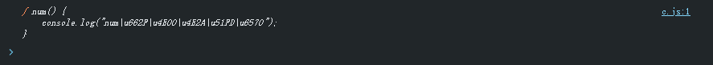
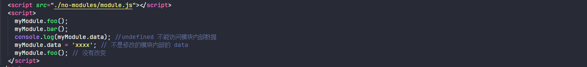
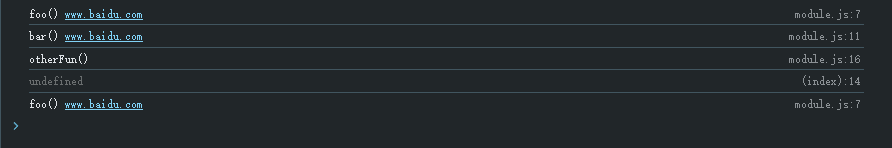
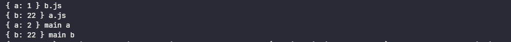
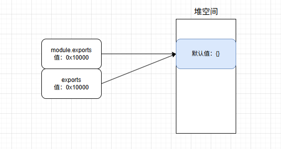
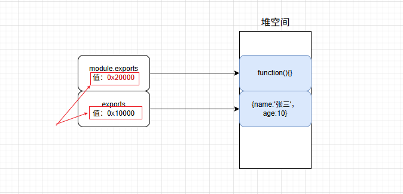
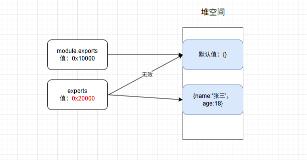

# ESM和CJS模块区别

## 一、模块化概念

模块是指将一个复杂的程序依据一定的规则 (规范) 封装成几个块 (文件)，并进行组合在一起，块的内部数据与实现是私有的， 只是向外部暴露一些接口 (方法) 与外部其它模块通信。 

## 二、模块化的由来

### 2.1、没有模块化之前

早期 JavaScript 开发很容易存在 `全局污染` 和 `依赖管理` 混乱问题。这些问题在多人开发前端应用的情况下变得更加棘手。我这里例举一个很常见的场景： 

```html
<!doctype html>
<html lang="en">
  <head>
    <meta charset="UTF-8" />
    <meta
      name="viewport"
      content="width=device-width, initial-scale=1.0" />
    <title>ESM和CJS</title>
  </head>
  <body>
    ESModule和Commonjs模块区别
  </body>
  <script src="no-modules/a.js"></script>
  <script src="no-modules/b.js"></script>
  <script src="no-modules/c.js"></script>
</html>
```

定义相关的 JavaScript

```javascript
// a.js
var num = 200

// b.js
function num() {
  console.log('num是一个函数')
}

// c.js
console.log(num) // 打印一个函数，而不是200
```



如果在没有模块化的前提下，会暴露一系列问题：

+ 全局污染：没有模块化，那么 `script` 内部变量是可以相互污染的。比如上述，a.js 定义了一个 num 是数字类型，b.js 定义 num 为一个函数类型，在 c.js 引入获取 num 时，发现打印的 num 为一个函数，获取不到想要的数字类型
+ 依赖管理

### 2.2、namespace模式(简单对象封装)

作用： 减少了全局变量，解决命名冲突 

问题： 数据不安全 (外部可以直接修改模块内部的数据) 

```javascript
let myModule = {
 data: 'www.baidu.com',
 foo() {
   console.log(`foo() ${this.data}`)
 },
 bar() {
   console.log(`bar() ${this.data}`)
 }
}
myModule.data = 'other data' // 能直接修改模块内部的数据
myModule.foo() // foo() other data
```

### 2.3、IIFE 模式：匿名函数自调用 (闭包)

作用： 数据是私有的， 外部只能通过暴露的方法操作； 

编码： 将数据和行为封装到一个函数内部, 通过给 window 添加属性来向外暴露接口； 

问题：  如果当前这个模块依赖另一个模块怎么办? 

```javascript
// module.js 文件
(function(window) {
  let data = 'www.baidu.com'
  // 操作数据的函数
  function foo() {
    // 用于暴露有函数
    console.log(`foo() ${data}`)
  }
  function bar() {
    // 用于暴露有函数
    console.log(`bar() ${data}`)
    otherFun() // 内部调用
  }
  function otherFun() {
    // 内部私有的函数
    console.log('otherFun()')
  }
  // 暴露行为
  window.myModule = { foo, bar } //ES6 写法
})(window)
```



实际效果如下



### 2.4、模块化的优点

+ 避免命名冲突
+ 更好的分离，按需加载
+ 更高复用性
+ 高可维护性

## 三、CommonJS模块

### 3.1、CommonJS的导入导出

#### 3.1.1、导入

CommonJS 模块通过 require 进行导入

```javascript
const path = require('path');
const serve = require('./serve');
const utils = require('./utils');
```

#### 3.1.2、导出

通过 module.exports 或 exports 导出

```javascript
// serve.js
module.exports = {
  a: 10
}

// utils.js
module.exports = function (x, y) {
  return x * y
}
```

### 3.2、CommonJS模块加载原理

详解见：[require模块加载机制](../require)

### 3.3、CommonJS模块循环加载和缓存

由于 `缓存机制的存在，同时 CommonJS 是属于同步加载`，CommonJS 的模块之间可以进行循环加载，而不用担心引起死循环。

示例如下

```javascript
// a.js
exports.a = 1;
var b = require('./b')
console.log(b, "a.js")
exports.a = 2;

// b.js
exports.b = 11;
var a = require("./a");
console.log(a, "b.js");
exports.b = 22;

// main.js
const a = require("./a");
const b = require("./b");

console.log(a, "main a");
console.log(b, "main b");
```

实际效果如下



执行过程分析：

1. 加载 main.js，发现加载了 a 模块；读取并存入缓存
2. 执行 a 模块，导出 `{ a：1 }`；发现又加载了 b 模块，读取并存入缓存
3. 执行 b 模块，导出了 `{ b：11 }`；又加载了 a 模块，读取缓存，此时 a 模块只导出了 `{ a：1 }`
4. b 模块执行完毕，导出了 `{ b：22 }`
5. 回到了 a 模块，执行完毕，导出 `{ a：2 }`
6. 回到 main.js，又加载了 b 模块，读取缓存

### 3.4、CommonJS加载机制

CommonJS 的加载机制是，模块输出的是一个 `值的复制` 拷贝。

对于基本数据类型的输出，属于复制；对于复杂数据类型，属于浅拷贝

案例1示例如下

```javascript
// number.js
let num = 1;

function add() {
  num++;
}

module.exports.num = num;
module.exports.add = add;

// main.js
let number = require('./number');

console.log(number.num); // 输出：1

number.add();
console.log(number.num); // 还是输出：1

number.num = 3;
console.log(number.num); // 输出：3
```


过程分析：

由于 CommonJS 是 `值的复制`，一旦模块输出了值，模块内部的变化就影响不到这个值；因此 main.js 中的 number 变量本身和 number.js没有任何指向关系了，虽然我们调用模块内部的 add 函数来改变值，但也影响不到这个值了；反而我们在输出后可以对这个值进行任意的编辑。

案例2示例如下

```javascript
// obj.js
module.exports = {
  color: {
    list: ['red', 'yellow', 'blue'],
  },
};

// a.js
var obj = require('./obj');

obj.color.list.push('green');

console.log(obj); // 输出：{ color: { list: [ 'red', 'yellow', 'blue', 'green' ] } }

// b.js
var obj = require('./obj');

console.log(obj); // 输出：{ color: { list: [ 'red', 'yellow', 'blue', 'green' ] } }

//main.js
require('./a')
require('./b')
```

实际效果如下


过程分析：

上面代码中我们通过 a.js、b.js 两个脚本同时引用一个模块进行修改和读取；a.js 对模块进行修改，然后在 b.js 再次进行打印验证。发现打印相同。

需要注意的是由于缓存，因此 b.js 加载时其实已经是从缓存中读取的模块。 

### 3.5、exports与module.exports

exports 和 module.exports 都指向同一个堆空间地址，而进行 require 加载模块时获取的是 module.exports 导出的对象。实际上也是 exports.xxx 等导出的内容



当使用 exports 进行导出时，使用示例说明

```javascript
// a.js
exports.name = '张三';
exports.age = 18;
exports.say = function () {
  console.log("Hi, I'm 张三");
};

// main.js
const a = require('./a');
console.log(a);
```


当 exports 和 module.exports 一起使用时，需要注意以下两种情况的使用：

+ 当 module.exports 导出内容时，require 只导入  module.exports 导出内容，exports 会失效。

+ 当单独使用 exports 时，不能 `exports={}` 导入，只能 `exports.xxx` 导出

#### 3.5.1、同时使用exports和module.exports

```javascript
// a.js
exports.name = '张三';
exports.age = 18;
exports.say = function () {
  console.log("Hi, I'm 张三");
};

// 使用了 module.exports，前面的 exports 会失效
module.exports = function () {
  console.log('Hello, World');
};

// main.js
const a = require('./a');
console.log(a);
```

实际效果如下


原因分析：require 导入时只会导入 module.exports 导出的数据，当执行 `module.exports = xxx` 时，module.exports 指向了另外一个堆空间地址



#### 3.5.1、单独使用exports

```javascript
// a.js
exports = {
  name: '张三',
  age: 18,
};

// main.js
const a = require('./a');
console.log(a);
```

这里执行打印的为 `{}`

原因分析：当执行 `exports={}` 已经指向了另外一个地址，与 module.exports 不在指向同一个地址



## 四、ES Module

### 4.1、ES Module导入

#### 4.1.1、导出

通过 export 进行导出变量、函数或者类

```javascript
export let num = 1;
export function add(x) {
  return num + x
}

export class Person {}
```

或者

```javascript
let num = 1
function add(x) {
  return num + x
}

class Person {}
export { num, add, Person }
```

在导出对象时，还可以使用 `as关键词` 重命名导出的变量

```javascript
let num = 1

export {
  num as number
}
```

需要注意的是，export 规定，导出的是对外的接口，必须与模块内部的变量建立一一对应的关系。

下面两种是错误的写法：

```javascript
// 报错，是个值，没有提供接口
export 1;

// 报错，需要放在大括号中
var m = 1;
export m;
```

#### 4.1.2、导入

 其他模块文件可以通过 `import` 命令加载这个接口

```javascript
import { number } from './export';
```

和 export 命令一样，我们可以使用 as 关键字，将导入的变量名进行重命名

```javascript
import { number as num } from './export';
```

 除了加载模块中指定变量接口，我们还可以使用整体加载，通过（*）指定一个对象，所有的输出值都加载在这个对象上

```javascript
import * as number from "./number.js";
```

 import 命令具有提升效果，会提升到整个模块的头部，首先执行

```javascript
console.log(num);
import {
    number as num,
} from "./number.js";
```

以上代码不会报错，因为 import 会优先执行；和 CommonJS 规范的 require 不同的是，import 是静态执行，因此 import 不能位于块级作用域内，也不能使用表达式和变量，这些都是只有在运行时才能得到结果的语法结构： 

```javascript
// 报错
let moduleName = './num'
import { num, add } from moduleName;

// 报错
// SyntaxError: 'import' and 'export' may only appear at the top level 
let num = 10;
if (num > 2) {
    import a from "./a";
} else {
    import b from "./b";
}
```

#### 4.1.3、export default导出

```javascript
// add.js
export default function (x, y) {
    return x + y;
};

// main.js
import add from './add'
console.log(add(2, 4));
```

由于 export default 是默认导出，因此，这个命令在一个模块中只能使用一次，而export导出接口是可以多次导出的

```javascript
// 报错
// SyntaxError: Only one default export allowed per module.
// add.js
export default function (x, y) {
    return x + y;
};
export default function (x, y) {
    return x + y + 1;
};
```

export default其实是语法糖，本质上是将后面的值赋值给default变量，所以可以将一个值写在export default之后；但是正是由于它是输出了一个default变量，因此它后面不能再跟变量声明语句

```javascript
// 正确
export default 10;

// 正确
let num = 10;
export default num;

// 报错
export default let num = 10;
```

 既然 export default 本质上是导出了一个 default 变量的语法糖，因此我们也可以通过 export 来进行改写

```javascript
// num.js
let num = 10;
export { num as default };
```

上面两个代码是等效的；而我们在import导入时，也是把 default 变量重命名为我们想要的名字，因此下面两个导入代码也是等效的

```javascript
import num from './num';
// 等效
import { default as num } from './num';
```

在一个模块中，export 可以有多个，export default 只能有一个，但是他们两者可以同时存在

```javascript
// num.js
export let num1 = 1;
export let num2 = 2;
let defaultNum = 3;
export default defaultNum;

// main.js
import defaultNum, {
  num1,
  num2
} from './num';
```

在export default导出和（*）一起使用时

```javascript
// export.js
let num = 1;
function add(x) {
  return num + x
};

class Person {};
export { num, add };

export default Person;

// main.js
import * as mod from './export.mjs';
console.log(mod);
```

### 4.2、ESModule加载机制

详细见：[ES模块的工作原理]()

### 4.3、ESModule的循环加载

循环加载示例1如下

```javascript
// a.mjs

import { bar } from './b.mjs';
console.log('a.mjs');

console.log(bar);

export let foo = 'foo';

// b.mjs
import { foo } from './a';
console.log('b.mjs');

console.log(foo);

export let bar = 'bar';
```

执行 a.mjs 时，抛出错误


加载过程分析：

1. 首先，执行 a.mjs 以后，发现它加载了 b.mjs，因此会优先执行 b.mjs，然后执行 a.mjs。
2. 接着，执行 b.mjs 的时候，已知它从 a.mjs 输入了 foo 接口，这时不会去执行a.mjs，而是认为这个接口已经存在了，继续往下执行。
3. 执行到 ` console.log(foo); ` 的时候，才发现这个接口根本没有定义，因此报错。

解决这个问题的方法， 就是让 b.mjs 运行的时候，foo 已经有定义了。这可以通过将 foo 写成函数来解决。 

```javascript
// a.mjs
import { bar } from './b.mjs';
console.log('a.mjs');

console.log(bar());

function foo() {
  return 'foo';
}

export { foo };

// b.mjs
import { foo } from './a.mjs';
console.log('b.mjs');

console.log(foo());

function bar() {
  return 'bar';
}

export { bar };
```


这是因为函数具有提升作用(类似函数的变量提升)，在执行 `import {bar} from './b.mjs'`时，函数 foo 就已经有定义了，所以 b.mjs 加载的时候不会报错。这也意味着，如果把函数 foo 改写成函数表达式，也会报错。 

```javascript
// a.mjs
import { bar } from './b.mjs';
console.log('a.mjs');

console.log(bar());

const foo = () => 'foo';

export { foo };

// b.mjs
import { foo } from './a.mjs';
console.log('b.mjs');

console.log(foo());

const bar = () => 'bar';

export { bar };
```

执行 a.mjs ，查看运行结果


## 五、ESM和CJS的差异

| 特性       | CommonJS                                     | ES Module                                  |
| ---------- | -------------------------------------------- | ------------------------------------------ |
| 语法       | require 导入，module.exports 或 exports 导出 | import 导入，export 或 export default 导出 |
| 加载方式   | 运行时动态加载（同步）                       | 编译时静态分析（异步，可静态优化）         |
| 模块值类型 | 导出的是值的拷贝                             | 导出的是值的引用（动态绑定）               |
| 顶层 this  | 指向当前模块（module.exports）               | undefined                                  |
