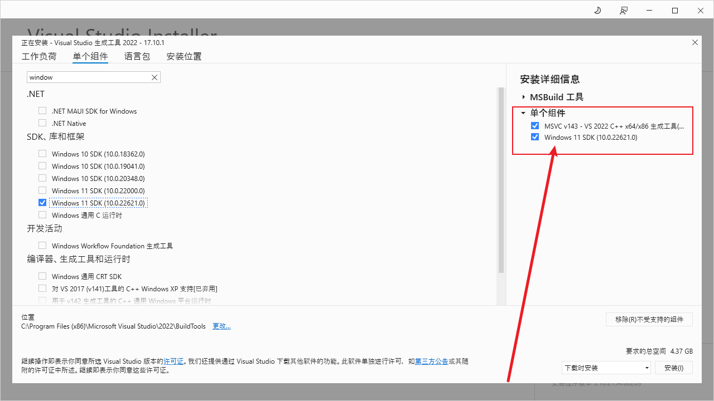
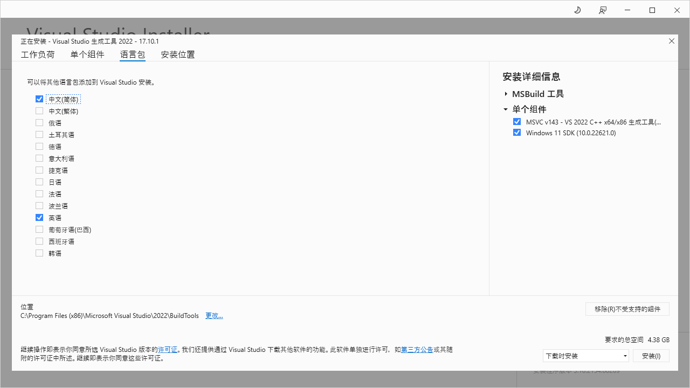
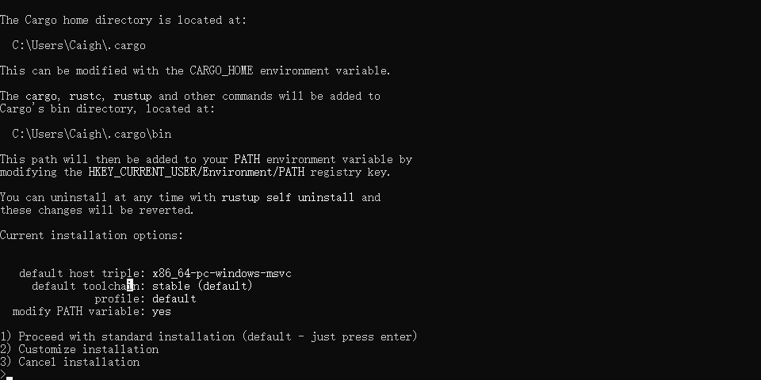
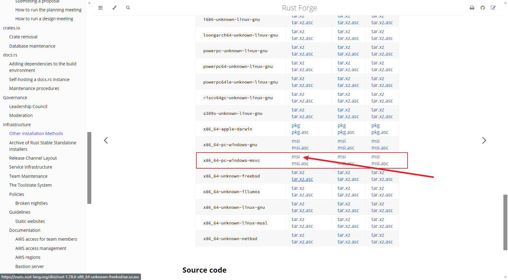

# Rust在Win10环境下的安装

## 一、Microsoft C++生成工具和rustup-init.exe方式下载

通过 rustup-init.exe 安装之前需要先安装 Microsoft C++ 生成工具，安装成功后会有一个 vs_BuildTools.exe 执行文件，然后直接运行。

在安装提示中，单个组件安装两个组件，具体如下图



语言包选择中文和英语



在这里不做安装位置改变，默认安装路径，可以自行设置

点击安装，安装完成之后，运行 rustup-init.exe 文件



选择 1 默认安装，安装完成之后执行以下命令查看是否安装成功

```bash
rustup --version
```

or

```bash
rustc --version
```

## 二、使用x86_64-pc-window-msvc.msi文件进行安装

地址如下：https://forge.rust-lang.org/infra/other-installation-methods.html



下载文件之后，点击执行一直下一步安装即可。

但是该种安装方式是不会带 rustup 工具，只会安装 rustc 和 cargo。

## 三、rust命令工具

rustup 是一个用于管理 rust 版本和相关工具的命令行工具。rustup 可以对 rust 进行版本更新就很容易。

更新命令

```bash
rustup update
```

要卸载 rust 和 rustup

```bash
rustup self uninstall
```

rustc 是 rust 编程语言的编译器，由项目本身提供。编译器获取您的源代码并生成二进制代码，可以是库还是可执行文件。

大多数 rust 程序员不直接调用 `rustc`，而是通过 [cargo](https://doc.rust-lang.org/cargo/index.html) 来调用。不过，这一切都是为了 `rustc` 服务的。

基础用法如下，假设您有文件 hello.rs 一个程序

```rust
fn main() {
    println!("Hello, world!");
}
```

要将此源代码转换为可执行文件，您可以使用  rustc

```bash
rustc hello.rs
```

详细用法参考 [rustc文档](https://doc.rust-lang.org/rustc/what-is-rustc.html)

cargo 是 [rust](https://www.rust-lang.org/)[*包管理器*](https://doc.rust-lang.org/cargo/appendix/glossary.html#package-manager)。cargo 下载 [rust包](https://doc.rust-lang.org/cargo/appendix/glossary.html#package) 的依赖项，编译包，制作可分发的包，并将它们上传到 [crates.io](https://crates.io/)。

