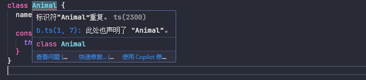
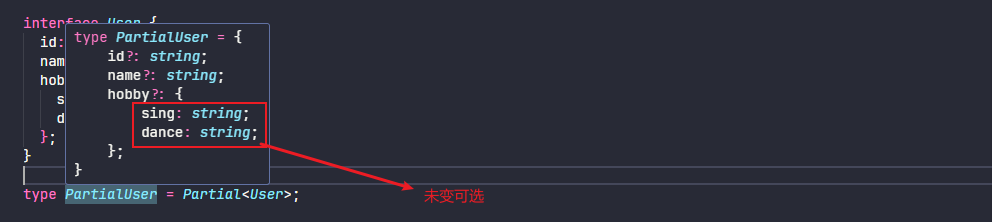
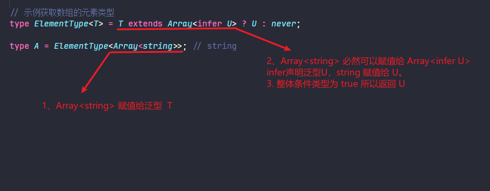

# Typescript高级进阶

## 一、函数重载

函数重载是指在同一个作用域内，允许存在多个同名但参数列表不同的函数。

```typescript
function add(a: number, b: number): number;
function add(a: string, b: string): string;
function add(a: number | string, b: number | string): number | string {
  if (typeof a === 'number' && typeof b === 'number') {
    return a + b; // 数字相加
  } else if (typeof a === 'string' && typeof b === 'string') {
    return a + b; // 字符串拼接
  }
  throw new Error('Invalid arguments'); // 参数类型不匹配时抛出错误
}
```

函数重载的定义方式是先声明多个函数签名，然后提供一个实现函数。

注意：实现函数的参数必须与重载签名兼容。

## 二、泛型

泛型是指在定义函数、接口或类的时候，不预先指定具体的类型，而是在使用的时候再指定类型的一种特性。可以让我们在编写代码时更加灵活和通用，避免了重复编写相似的代码，可以提高代码的可重用性和可维护性。

### 2.1、函数泛型

```typescript
/**
 * 泛型函数
 * 泛型函数是指在函数定义时使用泛型参数，这样可以让函数在调用时接受不同类型的参数。
 */
// 多泛型函数
function identity<T, U>(value1: T, value2: U): [T, U] {
  return [value1, value2];
}

// 使用泛型函数
const result = identity<string, number>('Hello', 42);

// 使用泛型函数的类型推断
const inferredResult = identity('Hello', 42); // TypeScript 会推断 T 为 string, U 为 number
```

### 2.2、类的泛型

```typescript
/**
 * 泛型类
 * 泛型类是指在类定义时使用泛型参数，这样可以让类在实例化时接受不同类型的属性。
 */
class GenericBox<T> {
  private value: T;

  constructor(value: T) {
    this.value = value;
  }

  getValue(): T {
    return this.value;
  }

  setValue(value: T): void {
    this.value = value;
  }
}

// 使用泛型类
const stringBox = new GenericBox<string>('Hello');
const numberBox = new GenericBox<number>(42);

// 使用泛型类的类型推断
const inferredBox = new GenericBox('Hello'); // TypeScript 会推断 T 为 string
```

### 2.3、接口泛型

```typescript
/**
 * 泛型接口
 * 泛型接口是指在接口定义时使用泛型参数，这样可以让接口在实现时接受不同类型的属性。
 */
interface Pair<T, U> {
  first: T;
  second: U;
}

// 使用泛型接口
const pair: Pair<string, number> = {
  first: 'Hello',
  second: 42,
};
```

## 三、模块

### 3.1、全局模块

默认情况下，当在一个 .ts 文件编写代码时，它处于全局命名空间中。

当我项目中存在两个文件：a.ts、b.ts

```typescript
// 当 a.ts 和 b.ts 定义了同一个类时，ts就会提示 标识符“Animal”重复
class Animal {
  name: string;

  constructor(name: string) {
    this.name = name;
  }
}
```



由此提出接口的 `接口自动合并` 以及 `类型别名冲突` 两个问题

```typescript
// a.ts 
interface Animal {
  name: string;
  speak(): void;
}

// b.ts
interface Animal {
  eat(): void;
  sleep(): void;
}

// a.ts 和 b.ts 中的 Animal 接口会进行合并（对属性和方法）
// b.ts 中的 Animal 接口包含了 eat 和 sleep 方法，而 a.ts 中的 Animal 接口包含了 speak 方法
class Dog implements Animal {
  name: string;

  constructor(name: string) {
    this.name = name;
  }

  eat(): void {
    console.log(`${this.name} is eating.`);
  }

  sleep(): void {
    console.log(`${this.name} is sleeping.`);
  }

  speak(): void {
    console.log(`${this.name} says Woof!`);
  }
}
```

```typescript
/**
 * a.ts 和 b.ts 中都定义了 Test 类型别名
 * 类型别名
 */
type Test = {
  // Error：标识符“Test”重复。ts(2300)
  name: string;
  age: number;
};
```

毋庸置疑，使用全局变量空间是危险的，因为它会与文件内的代码命名冲突。我们强烈推荐使用文件模块。

### 3.2、文件模块

文件模块也被称为外部模块，在 TypeScript 中，任何包含顶级 `import` 或 `export` 声明的文件都被视为一个模块。模块的特点是它有自己的作用域，这意味着模块内的变量、函数、类等都是局部于该模块的，不会影响到全局作用域。

```typescript
// c.ts 和 d.ts 都导出一个 interface 不会报错
// c.ts
interface C {}

export type { C };

// d.ts
interface C {}

export type { C };
```

## 四、命名空间

命名空间是 TypeScript 中的一个组织代码的方式，主要用于解决全局作用域下的命名冲突问题。通过命名空间，我们可以将相关的代码组织在一起，并且避免了全局污染。

1. 在TS1.5之前被叫做内部模块，主要用于组织代码，避免命名冲突
2. 在本质上就是定义一个对象，把变量、方法、类、接口等都放里面
3. 通过 namespace 定义，export 导出

```typescript
/**
 * 定义 TypeScript 的命名空间
 */
namespace A {
  export const a = 1;
  export class C {
    constructor() {
      console.log('A.C');
    }
  }

  // 嵌套 namespace，需要通过 export 导出
  export namespace B {
    export const b = 2;
    export class D {
      constructor() {
        console.log('A.B.D');
      }
    }
  }
}
```

namespace 如何使用

```typescript
// 导入命名空间中的内容
/// <reference path="./namespace.ts" />

console.log(A.a); // 1
const c = new A.C(); // A.C
```

## 五、类型推导

```typescript
/**
 * 类型推导
 */
let str = 'jack'; // str变量未指定类型，类型被推断string类型，这种推断发生在初始化变量和成员，设置默认参数值和决定函数返回值时。

str = 1; // TS2322: Type 'number' is not assignable to type 'string'.

let arr = [1, 'a']; // 被推断为 number | string 联合类型
arr = [1, 'b', 3, false]; // TS2322: Type 'boolean' is not assignable to type 'string | number'.
```

## 六、高级类型

### 6.1、类型别名

```typescript
/**
 * 类型别名
 * 类型别名不可以定义多个相同类型别名
 */

// 类型别名就是给一个类型重新取一个命名
interface Todo {
  eventName: string;
  event: string;
}

type MyTodo = Todo;
```

> [!WARNING]
> 类型别名不可以定义多个相同类型别名

### 6.2、联合类型

```typescript
/**
 * 联合类型
 */
type StrAndNum = string | number;

/**
 * 特殊字面量的联合类型
 */
type Num = 1 | 2;

type Str = '1' | '2';
```

### 6.3、交叉类型

```typescript
/**
 * 交叉类型
 * 交叉类型是 TypeScript 中的一种类型组合方式，通过 & 操作符将多个类型合并为一个新类型。
 */
interface A {
  name: string;
  readonly address: string;
}

interface B {
  age: number;
  hobby?: string;
}

type C = A & B;

let c: C = {
  name: '张三',
  age: 18,
  address: '广东省深圳市',
};

c.address = '广东省广州市';
```

> [!WARNING]
> 交叉类型的注意事项
>
> 属性冲突：如果多个类型中包含同名但不同类型的属性，例如，interface A { x: number; } 和 interface B { x: string; } 不能使用交叉类型组合
>
> 只读属性：如果组合的类型中包含只读属性，新类型中的这些属性也将是只读的。
>
> 可选属性：交叉类型会保留所有类型的可选属性，新类型中的这些属性仍然是可选的。


## 七、泛型工具

### 7.1、typeof

typeof 的主要用途是在类型上下文中获取变量或者属性的类型，typeof 主要作用在 对象 和 函数上。

```typescript
// 作用在 对象 上
let p = { name: '张三', age: 19, address: { province: '四川', city: '成都' } };

type Same = typeof p;

// typeof 还可以作用在函数上，获取函数类型
function toArray(x: number): Array<number> {
  return [x];
}

type Func = typeof toArray; // -> (x: number) => number[]
```

### 7.2、keyof

```typescript
/**
 * keyof
 * keyof 操作符是在 TypeScript 2.1 版本引入的，该操作符可以用于获取某种类型的所有键，其返回类型是联合类型。但是只返回表面一层属性
 * keyof 作用在 typescript 的类型上
 */
type K1 = keyof Same; // type K1 = "name" | "age" | "address"

// 对于包含索引接口返回 string | number
type K2 = keyof { [x: string]: Same }; // type K2 = string | number
```

### 7.3、in

```typescript
/**
 * in
 * in 可以作用在 联合类型 和 枚举
 */

// 作用在联合类型上
type Keys = 'a' | 'b' | 'c';

type Obj = {
  [p in Keys]: string;
};

let o: Obj = {
  a: 'a',
  b: 'b',
  c: 'c',
};

// 作用在枚举上
enum Direct {
  UP = 'up',
  Down = 'down',
}

type DirectObj = {
  [p in Direct]: string;
};
```

### 7.4、Partial

Partial 将类型的属性变成可选，作用在 类型 上，但是 Partial 有个局限性，就是只支持处理第一层的属性。

```typescript
// 源码
type Partial<T> = {
  [P in keyof T]?: T[P];
};
```

```typescript
interface User {
  id: string;
  name: string;
  hobby: {
    sing: string;
    dance: string;
  };
}

type PartialUser = Partial<User>;
```



### 7.5、Required

Required将类型的属性变成必选，但是 Required 有个局限性，就是只支持处理第一层的属性。

```typescript
// 源码
type Required<T> = {
  [P in keyof T]-?: T[P];
};
```

```typescript
interface Props {
  name?: string;
  address?: {
    province?: string;
    city?: string;
  };
}

type RequiredProps = Required<Props>;
```

### 7.6、Readonly

Readonly 的作用是将某个类型所有属性变为只读属性，也就意味着这些属性不能被重新赋值。

```typescript
// 源码
type Readonly<T> = {
  readonly [P in keyof T]: T[P];
};
```

```typescript
interface Todo {
  title: string;
}

const todo: Readonly<Todo> = {
  title: 'Delete inactive users',
};
```

### 7.7、extends和条件类型

```typescript
/**
 * extends与条件类型
 * 格式：T extends U ? X : Y
 * extends 作用判断 前一个类型 能不能赋值给 后一个类型
 */

interface Animal {
  name: string;
  age: number;
  address: string;
}

// Dog 类实现 Animal 接口
class Dog implements Animal {
  name: string;
  age: number;
  address: string;

  constructor(name: string, age: number, address: string) {
    this.name = name;
    this.age = age;
    this.address = address;
  }

  speak(): void {
    console.log(`${this.name} makes a noise.`);
  }
}

let d: Animal = new Dog('jack', 14, '55555');

class Cat {
  name: string;
  species: string;

  constructor(name: string, species: string) {
    this.name = name;
    this.species = species;
  }
}

// Dog 不能赋值 给Animal
type N = Dog extends Animal ? number : string; // number

// Cat 不能赋值 给Animal
type S = Cat extends Animal ? number : string; // 返回 string
```

### 7.8、Pick

Pick 从某个类型中挑出一些属性出来

```typescript
// 源码
type Pick<T, K extends keyof T> = {
  [P in K]: T[P];
};
```

```typescript
interface Todo {
  title: string;
  description: string;
  completed: boolean;
}

type PickTodo = Pick<Todo, 'title' | 'completed'>;
```

### 7.9、Record

Record 的作用是将 K 中所有的属性的值转化为 T 类型。

```typescript
/**
 * Record
 * Record 的作用是将 K 中所有的属性的值转化为 T 类型。
 */
interface Page {
  title: string;
}

type KeyAny = keyof any; //  string | number | symbol

let page: Record<KeyAny, Page> = {
  home: { title: '主页' },
};
```

### 7.10、Exclude

Exclude 的作用是将某个类型中属于另一个的类型移除掉。

```typescript
// 源码
type Exclude<T, U> = T extends U ? never : T;
```

```typescript
type E1 = Exclude<'a' | 'b' | 'c', 'a'>; //  "b" | "c"
```

### 7.11、Extract

Extract 的作用是从 T 中提取出 U。

```typescript
// 源码
type Extract<T, U> = T extends U ? T : never;
```

```typescript
type E2 = Extract<'a' | 'b' | 'c', 'a' | 'f'>; // "a"
```

### 7.12、Omit

Omit 的作用是使用 T 类型中除了 K 类型的所有属性，来构造一个新的类型。

```typescript
// 源码
type Omit<T, K extends keyof any> = Pick<T, Exclude<keyof T, K>>;
```

```typescript
interface User {
  name: string;
  age: number;
  address: string;
}

type OmitUser = Omit<User, 'age'>;
```

### 7.13、NonNullable

NonNullable 的作用是用来过滤类型中的 null 及 undefined 类型。

```typescript
// 源码
type NonNullable<T> = T extends null | undefined ? never : T;
```

```typescript
type N1 = NonNullable<string | number | undefined>; // string | number
type N2 = NonNullable<string[] | null | undefined>; // string[]
```

### 7.14、infer和条件类型

infer 关键字用于在条件类型中声明一个新的类型变量，并尝试从现有类型中推断出它的值，它通常与条件类型结合使用，用于提取嵌套的类型信息。

```typescript
// 示例获取数组的元素类型
type ElementType<T> = T extends Array<infer U> ? U : never;

type A = ElementType<Array<string>>; // string
```



### 7.15、Parameters

主要适用于函数，能够提取函数所返回的类型

```typescript
// 源码
type Parameters<T extends Function> = T extends (...args: infer R) => any ? R : never;
```

```typescript
type P1 = Parameters<() => string>; // 无参时返回 []
type P2 = Parameters<(name: string, age: number) => string>; // 返回 [string, number]
```

### 7.16、ReturnType

主要适用于函数，能够提取函数所返回的类型。

```typescript
// 源码
type ReturnType<T extends Function> = T extends (...args: any[]) => infer R ? R : never;
```

```typescript
type F1 = ReturnType<() => string>; // string
type F2 = ReturnType<() => [number, string]>; // [number, string]
```