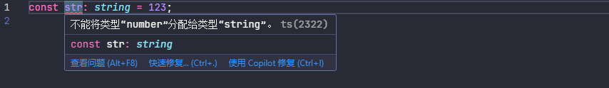
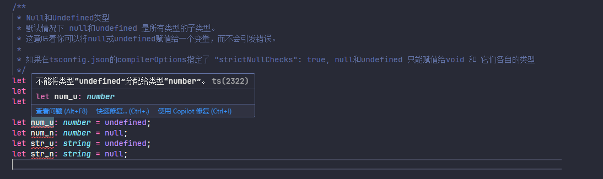

# TypeScript快速入门

## 一、TypeScript介绍

### 1.1、TypeScript概述

### 1.2 、TypeScript与JavaScript区别与差异

|      类型系统特性      | JavaScript | Typescript |
| :--------------------: | :--------: | :--------: |
|    类型是如何绑定？    |    动态    |    静态    |
| 是否存在类型隐式转换？ |     是     |     否     |
|     何时检查类型？     |   运行时   |   编译时   |
|      何时报告错误      |   运行时   |   编译时   |

### 1.3、静态类型检查

在typescript中，在编译时就会检查类型，如果和预期的类型不符合直接会在编辑器里报错



当对某一个变量进行类型定义之后，该变量可以使用该类型的属性和方法等，可能无法是其他类型定义的方法和属性

```typescript
let message: string = 'Hello, TypeScript!';

// 错误1：message 变量被声明为 string 类型，但尝试将一个 number 类型的值赋给它。
// message = 42; // 不能将类型“number”分配给类型“string”。ts(2322)

// 错误2：message 变量被声明为 string 类型，但尝试调用一个不存在于 string 类型上的方法。
message.toFixed(2); // 属性“toFixed”在类型“string”上不存在。你是否指的是“fixed”?ts(2551)
```

### 1.4、非异常故障

```typescript
/**
 * 非异常故障
 * 在 TypeScript 中，非异常故障通常指的是代码在运行时不会抛出错误，但可能会导致逻辑错误或不符合预期的行为。
 * 这类问题通常是由于类型不匹配、未定义的属性或方法等引起的。
 * 例如，访问一个对象上不存在的属性或方法，TypeScript 编译器不会报错，但在运行时会导致 undefined 或 null 的值。
 * 这种情况可能会导致程序逻辑错误，或者在后续的代码中引发其他问题。
 * 为了避免这类问题，建议在编写 TypeScript 代码时，尽量使用严格的类型检查，并确保对象的属性和方法在使用前已正确定义。
 * 下面的代码演示了一个非异常故障的例子：
 * 在这个例子中，我们尝试访问一个对象上不存在的属性，这不会导致编译错误，但在运行时会导致逻辑错误。
 * 为了避免这种情况，我们可以使用 TypeScript 的类型系统来确保对象的属性在使用前已正确定义。
 * 例如，我们可以使用接口或类型别名来定义对象的结构，并确保在使用时遵循这些结构。
 * 这样可以在编译时捕获潜在的错误，避免在运行时出现非异常故障。
 */

const user = {
  name: '小明',
  age: 18,
};

user.location;
```

## 二、TypeScript安装

2.1、安装TypeScript

```bash
npm install typescript -g
```

2.2、tsc编译工具

typescript 会自带 tsc 命令的编译工具，最终 ts 文件还是会以 js 方式进行执行，在终端执行 tsc 命令即可执行编译

```bash
tsc --project tsconfig.json
```

在 tsc 执行编译时通常会指定一个 tsconfig.json 编译配置的文件，具体的详情配置参考 ------，当前简单配置如下：

```json
{
  "include": ["index.ts"],
  "compilerOptions": {
    "lib": ["esnext"],
    "target": "esnext",
    "module": "esnext"
  }
}
```

## 三、TypeScript的常见类型

### 3.1、Number类型

```typescript
let num: number = 123; // 定义一个数字类型的变量

// TypeScript里的所有数字都是浮点数和Javascript一样
// 除了支持十进制和十六进制字面量，TypeScript还支持ECMAScript 2015中引入的二进制和八进制字面量
let decLiteral: number = 6;
let hexLiteral: number = 0xf00d; // 十六进制
let binaryLiteral: number = 0b1010; // 二进制
let octalLiteral: number = 0o744; // 八进制

/**
 * bigint 与 number 互不兼容
 * BigInt 的 n 后缀语法（如 100n）仅在 TypeScript 的 target 设置为 ES2020 或更高版本时可用。如果目标版本低于 ES2020，则会报错。
 */
let bigNum: bigint = 100n; // 使用n后缀来表示bigint类型
console.log(bigNum);

// bigNum = num; // 不能将类型“number”分配给类型“bigint”。ts(2322)
// num = bigNum; // 不能将类型“bigint”分配给类型“number”。ts(2322)
```

### 3.2、String类型

```typescript
/**
 * String类型
 */
let str: string = 'Hello, TypeScript'; // 定义一个字符串类型的变量
console.log(str);
```

### 3.3、Boolean类型

```typescript
/**
 * Boolean类型
 */
let isActive: boolean = true; // 定义一个布尔类型的变量
console.log(isActive);
```

### 3.4、Null和Undefined类型

默认情况下 null和undefined 是所有类型的子类型，如果在tsconfig.json的compilerOptions指定了 "strictNullChecks": true, null和undefined 只能赋值给void 和 它们各自的类型

```typescript
/**
 * Null和Undefined类型
 * 默认情况下 null和undefined 是所有类型的子类型。
 * 这意味着你可以将null或undefined赋值给一个变量，而不会引发错误。
 *
 * 如果在tsconfig.json的compilerOptions指定了 "strictNullChecks": true, null和undefined 只能赋值给void 和 它们各自的类型
 */
let u: undefined = undefined;
let n: null = null;
let v: void = null;

let num_u: number = undefined;
let num_n: number = null;
let str_u: string = undefined;
let str_n: string = null;
```

如果在 tsconfig.json 的 compilerOptions 指定了 "strictNullChecks": true

```json
{
  "include": ["index.ts"],
  "compilerOptions": {
    "lib": ["ESNext", "DOM"],
    "target": "esnext",
    "module": "esnext",
    "strictNullChecks": true // [!code ++]
  }
}
```



### 3.5、never类型

never类型表示的是那些永不存在的值的类型，例如: never类型是那些总是会抛出异常或根本不会有返回值的函数表达式或箭头函数表达式的返回值类型。

```typescript
/**
 * never类型
 * never类型表示的是那些永不存在的值的类型。
 * 例如: never类型是那些总是会抛出异常或根本不会有返回值的函数表达式或箭头函数表达式的返回值类型。
 */

// 返回never的函数必须存在无法达到的终点
function error(message: string): never {
  throw new Error(message);
}

// 推断的返回值类型为never
function fail() {
  return error('Something failed');
}

// 无限循环
function infiniteLoop(): never {
  while (true) {}
}
```

### 3.6、unknown类型

unknown类型代表任何值。这与 any 类型类似，但更安全，因为对未知 unknown 值做任何事情都是不合法的。

```typescript
/**
 * unknown 类型
 * unknown类型代表任何值。这与 any 类型类似，但更安全，因为对未知 unknown 值做任何事情都是不合法的。
 */
function f1(params: any) {
  params.b();
}

function f2(params: unknown) {
  params.b(); // 类型“unknown”上不存在属性“b”，对未知 unknown 值做任何事情都是不合法的
}
```

### 3.7、any 类型

any 类型是十分有用的，它允许你在编译时可以选择地包含或移除类型检查。

```typescript
/**
 * any 类型
 * any 类型是十分有用的，它允许你在编译时可以选择地包含或移除类型检查。
 */
let notSure: any = 4;
notSure.ifItExists(); // okay, ifItExists might exist at runtime
notSure.toFixed(); // okay, toFixed exists (but the compiler doesn't check)
let prettySure: Object = 4;
prettySure.toFixed(); // Error: 类型“Object”上不存在属性“toFixed”。ts(2339)
```

### 3.8、类型断言

类型断言有两种形式：`尖括号语法` 和 `as 语法`， 两种形式是等价的

> [!WARNING]
> 当你在TypeScript里使用JSX时，只有 as语法断言是被允许的

```typescript
/**
 * 类型断言有两种形式
 */
// 1. 尖括号语法
let someValue: any = 'this is a string';
let strLength: number = (<string>someValue).length;

// 2. as语法
let someValue2: any = 'this is another string';
let strLength2: number = (someValue2 as string).length;
```

### 3.9、object、Obeject 和 {} 区别和差异

在 JavaScript 中，原始类型（也称为基本类型或标量类型）是不可变的，直接包含数据的类型。这些类型在内存中直接存储其值，而不是存储指向对象的引用，原始类型包括：string、number、bigInt、boolean、null、undefined 和 symbol 等。

```typescript
/**
 * object、Obeject 和 {} 区别和差异
 * 在JavaScript中，原始类型（也称为基本类型或标量类型）是不可变的，直接包含数据的类型。这些类型在内存中直接存储其值，而不是存储指向对象的引用。
 * 原始类型包括：string、number、bigInt、boolean、null、undefined 和 symbol。
 * object 类型是指非原始类型的值。它可以是一个函数、数组、对象字面量等。
 * Object 类型是 JavaScript 中所有对象的基类。它可以是一个函数、数组、对象字面量等。
 */
let lowerCaseObject: object;
lowerCaseObject = 1; // Error: ts(2322)
lowerCaseObject = 'a'; // Error: ts(2322)
lowerCaseObject = true; // Error: ts(2322)
lowerCaseObject = null; // 如果在严格模式下（"strict": true）会报错，因为 null 不是 object 类型的子类型
lowerCaseObject = undefined; // 如果在严格模式下（"strict": true）会报错，因为 null 不是 object 类型的子类型
lowerCaseObject = { name: 'Hello World!' }; // ok
lowerCaseObject = []; // ok
lowerCaseObject = function () {}; // ok
lowerCaseObject = new Date(); // ok
lowerCaseObject = new RegExp(''); // ok
lowerCaseObject = new Map(); // ok

let upperCaseObject: Object;
upperCaseObject = 1; // ok
upperCaseObject = 'a'; // ok
upperCaseObject = true; // ok
upperCaseObject = null; // 如果在严格模式下（"strict": true）会报错，因为 null 不是 Object 类型的子类型
upperCaseObject = undefined; // 如果在严格模式下（"strict": true）会报错，因为 null 不是 Object 类型的子类型
upperCaseObject = { name: 'Hello World!' }; // ok
upperCaseObject = []; // ok
upperCaseObject = function () {}; // ok
upperCaseObject = new Date(); // ok
upperCaseObject = new RegExp(''); // ok
upperCaseObject = new Map(); // ok

let ObjectLiteral: {};
ObjectLiteral = 1; // ok
ObjectLiteral = 'a'; // ok
ObjectLiteral = true; // ok
ObjectLiteral = null; // 如果在严格模式下（"strict": true）会报错，因为 null 不是 {} 类型的子类型
ObjectLiteral = undefined; // 如果在严格模式下（"strict": true）会报错，因为 null 不是 {} 类型的子类型
ObjectLiteral = { name: 'Hello World!' }; // ok
ObjectLiteral = []; // ok
ObjectLiteral = function () {}; // ok
ObjectLiteral = new Date(); // ok
ObjectLiteral = new RegExp(''); // ok
ObjectLiteral = new Map(); // ok
```

{}、大 Object 是比小 object 更宽泛的类型，{} 和大 Object 可以互相代替，用来表示原始类型（null、undefined 除外）和非原始类型；而小 object 则表示非原始类型

## 四、数组和元组

### 4.1、数组

```typescript
/**
 * 数组类型
 */
// 第一种
let list: number[] = [1, 2, 3];

// 第二种
let list2: Array<number> = [1, 2, 3];
```

### 4.2、元组

```typescript
/**
 * 元组
 * 元组类型允许表示一个已知元素数量和类型的数组，各元素的类型不必相同
 */
let x: [string, number];
x = ['hello', 10]; // OK
x = [10, 'hello']; // Error
```

当访问一个已知索引的元素，会得到正确的类型

```typescript
console.log(x[0].substring(1)); // OK
console.log(x[1].substring(1)); // Error: 类型“number”上不存在属性“substring”
```

当访问一个越界的元素，会得到一个错误

```typescript
// 当访问一个越界的元素，会得到一个错误
console.log(x[2]); // Error: 长度为 "2" 的元组类型 "[string, number]" 在索引 "2" 处没有元素。
```

在解构赋值时，如果解构数组元素的个数是不能超过元组中元素的个数，否则也会出现错误

```typescript
// 在解构赋值时，如果解构数组元素的个数是不能超过元组中元素的个数，否则也会出现错误
let [first, second] = x; // OK
let [first, second, third] = x; // Error: 元组类型“[string, number]”的元素不足，无法解构赋值
```

元组可以包含可选元素

```typescript
// 元组可以包含可选元素
let y: [string, number?];
y = ['hello']; // OK
y = ['hello', 10]; // OK
```

## 五、枚举

```typescript
/**
 * 枚举类型
 */
enum Direction {
  Up,
  Down,
  Left,
  Right,
}
console.log(Direction.Up); // 输出: 0
```

当定义枚举不进行赋值初始化时，默认值为 0，并且是 0 自增长

```typescript
/**
 * 初始化枚举值为 1 的自增长
 */
enum Color {
  Red = 1,
  Green,
  Blue,
}
```

当定义字符串枚举时，每个成员都必须用字符串字面量

```typescript
/**
 * 字符串枚举
 */
enum Message {
  Success = '成功',
  Fail = '失败',
  // Pending, // 枚举成员必须具有初始化表达式。
}
console.log(Message.Success); // 输出: 成功
```

## 六、接口

在TypeScript中，接口（Interfaces）是一种强大的方式来定义对象的形状，即对象应该具有哪些属性以及这些属性的类型。接口是类型的一部分，它描述了对象的结构，但不实现这些结构。这使得接口非常适合作为类型检查的工具，尤其是在定义组件的props、状态（state）或与服务交互的数据结构时。

### 6.1、接口定义和使用

```typescript
/**
 *  接口一般首字母大写
 */
interface IUser {
  id: number;
  name: string;
  email: string;
  log: () => void; // 方法
}

/**
 * 缺少 id 属性的 IUser 接口
 * TypeScript 会报错：类型 "{ name: string; email: string; log: () => void; }" 中缺少属性 "id"，但类型 "IUser" 中需要该属性。ts(2741)
 */
let user1: IUser = {
  name: '张三',
  email: '121854@qq.com',
  log: () => {
    console.log('用户信息:', user1);
  },
};

/**
 * 完整的 IUser 接口
 * 对象字面量只能指定已知属性，并且“age”不在类型“IUser”中。ts(2353)
 */
let user2: IUser = {
  id: 1,
  name: '李四',
  email: '1884848@qq.com',
  log: () => {
    console.log('用户信息:', user2);
  },
  age: 18,
};
```

当定义了一个接口，无论多一个属性还是少一个属性都是会提示错误的

### 6.2、任意属性（索引签名）

在 IUser 接口上加上 `[propName: string]: any` ，表示该属性是任意属性，可以添加任意属性

```typescript
interface IUser {
  id: number;
  name: string;
  email: string;
  log: () => void; // 方法
  [propName: string]: any; // [!code ++]
}

let user3: IUser = {
  id: 1,
  name: '王五',
  email: '6545645@qq.com',
  log: () => {
    console.log('用户信息:', user3);
  },
  // 额外的属性可以添加，因为我们使用了 [propName: string]: any
  age: 20,
  address: '北京市海淀区',
  phone: '1234567890',
  isActive: true,
};
```

### 6.3、可选和只读属性

```typescript
/**
 * 可选和只读属性
 */
interface IPerson {
  readonly id: number; // 只读属性
  readonly name: string; // 只读属性
  email?: string; // 可选属性
}

let person1: IPerson = {
  id: 1,
  name: '赵六',
  // email 属性是可选的，可以省略
};

person1.name = '张六'; // 错误：只读属性不能被修改
```

### 6.4、接口函数定义

```typescript

/**
 * 接口定义函数
 */
interface ICalculator {
  (a: number, b: number): number; // 函数类型
}

let add: ICalculator = (a, b) => {
  return a + b;
};

// 或者
interface logName {
  name: 'Jack';
  print: (firstName: string) => string;
}
```

## 七、类

### 7.1、类的基本使用

```typescript
/**
 * 简单的类定义示例
 */
class Person {
  // 属性
  name: string;
  age: number;

  // 构造函数
  constructor(name: string, age: number) {
    this.name = name;
    this.age = age;
  }

  // 方法
  greet() {
    console.log(`Hello, my name is ${this.name} and I am ${this.age} years old.`);
  }
}

let p1 = new Person('Alice', 30);
p1.greet(); // 输出: Hello, my name is Alice and I am 30 years old.
```

### 7.2、类的继承

```typescript
/**
 * 类的继承
 */
class Animal {
  name: string;
  constructor(name: string) {
    this.name = name;
  }

  speak(): void {
    console.log(`${this.name} makes a noise.`);
  }
}

/**
 * typescript 中的类只能单继承
 */
class Dog extends Animal {
  constructor(name: string) {
    super(name); // 调用父类的构造函数
  }
}

let dog = new Dog('Rex');
dog.speak(); // 输出: Rex barks.
```

必须调用 super()，它会执行基类的构造函数。 而且在构造函数里访问 this 的属性之前，我们 一定要调用 super()。 这个是 TypeScript 强制执行的一条重要规则。

### 7.3、public、private、protected、readonly

在TypeScript里，成员都默认为 public

```typescript
class Animal {
  public name: string;
  constructor(name: string) {
    this.name = name;
  }

  speak(): void {
    console.log(`${this.name} makes a noise.`);
  }
}
```

当成员被标记成 private 时，它就不能在声明它的类的外部访问

```typescript
class Animal {
  public name: string;
  constructor(name: string) {
    this.name = name;
  }

  speak(): void {
    console.log(`${this.name} makes a noise.`);
  }
}

class Dog extends Animal {
  // 使用 private 属性, 只能在类内部访问
  private _age: number;

  constructor(name: string, age: number) {
    super(name); // 调用父类的构造函数
    this._age = age;
  }

  /**
   * 当前父类中存在同名方法 speak，
   * 子类中可以重写父类方法
   */
  public speak(): void {
    console.log(`${this.name} barks.`);
  }

  public getAge(): number {
    return this._age;
  }
}

let d = new Dog('Buddy', 5);
d.speak(); // 输出: Buddy barks.
d._age; // 错误: _age 是 private 属性，不能在类外部访问
d.getAge(); // 正确: 通过公共方法访问私有属性
```

protected 修饰符与 private 修饰符的行为很相似，但有一点不同， protected 成员在派生类中仍然可以访问

```typescript
class Animal {
  public name: string;
  constructor(name: string) {
    this.name = name;
  }

  speak(): void {
    console.log(`${this.name} makes a noise.`);
  }
}

class Cat extends Animal {
  // 使用 protected 属性, 可以在子类中访问
  protected _color: string;

  constructor(name: string, color: string) {
    super(name); // 调用父类的构造函数
    this._color = color;
  }

  public speak(): void {
    console.log(`${this.name} meows.`);
  }

  public getColor(): string {
    return this._color;
  }
}
```

使用 readonly 修饰符的属性，只能在类的构造函数中赋值，之后不能修改

```typescript
/**
 * 使用 readonly 修饰符的属性
 * 只能在类的构造函数中赋值，之后不能修改
 */
class Bird extends Animal {
  public readonly wingspan: number;

  constructor(name: string, wingspan: number) {
    super(name); // 调用父类的构造函数
    this.wingspan = wingspan;
  }

  public speak(): void {
    console.log(`${this.name} chirps.`);
  }
}

let b = new Bird('Tweety', 30);
b.speak(); // 输出: Tweety chirps.
b.wingspan = 35; // 错误: wingspan 是 readonly 属性，不能修改
```

类的规范定义：一般私有属性命名 `private _属性` 进行命名，对应私有属性访问和修改时可以定义方法进行抛出或者使用 getter 和 setter 方法来访问和修改私有属性

### 7.4、属性存取器

```typescript
class Animal {
  private _name: string;
  constructor(name: string) {
    this._name = name;
  }

  /**
   * 使用 getter 和 setter 方法来访问和修改私有属性
   * 这样可以在访问或修改属性时添加额外的逻辑
   * 但是在 getter 和 setter 方法前面不需要加 public 修饰符，因为它们默认是 public 的，并且并不建议前面加 private 或 protected 修饰符。
   */
  get name(): string {
    return this._name;
  }
  
  /**
   * 不太建议如此操作
   * Get 访问器必须至少具有与 Setter 相同的可访问性ts(2808)
   */
  private get name(): string { // [!code error]
    return this._name; // [!code warning]
  } // [!code warning]

  set name(value: string) {
    this._name = value;
  }

  speak(): void {
    console.log(`${this._name} makes a noise.`);
  }
}

let animal = new Animal('Generic Animal');
animal.name;
```
> [!WARNING]
>
> 1. 如果存在 getter，但没有 setter，则该属性自动是只读的
> 2. 如果没有指定 setter 参数的类型，它将从 getter 的返回类型中推断出来
> 3. getter 和 setter 必须有相同的成员可见性

### 7.5、静态属性

类有实例成员和静态成员，实例成员就是当类被实例化才会初始化的属性，静态成员存在类本身而不是类的实例上，使用  static 进行定义。

```typescript
/**
 * 静态属性
 */
class Animal {
  static species: string = 'Animal'; // 静态属性

  private static speciesDescription: string = 'This is a static property of the Animal class.';

  constructor(public name: string) {}

  /**
   * 只有静态方法可以访问静态属性
   * 静态方法可以通过类名直接调用
   * 静态方法不是类的实例，因此它没有this上下文，无法直接访问实例属性和实例方法
   */
  static describe(): string {
    // 静态方法可以访问静态属性
    console.log(this.name); // 错误访问，因为静态方法没有this上下文
    return `This is a ${this.species}. `;
  }

  /**
   * 实例方法可以访问静态属性，但是必须通过 类名.属性名 的方式访问
   */
  introduce() {
    return `This is ${this.name}, a member of the ${Animal.species} species.`;
  }

  speak(): void {
    console.log(`${this.name} makes a noise.`);
  }
}

let animal = new Animal('Generic Animal');
console.log(Animal.speciesDescription); // Error: 属性“speciesDescription”为私有属性，只能在类“Animal”中访问。
console.log(Animal.species); // 输出: Animal
console.log(Animal.describe()); // 输出: This is a Animal.
console.log(animal.introduce()); // 输出: This is Generic Animal, a member of the Animal species.
```

> [!WARNING]
>
> 1. 只有静态方法可以访问静态属性并且静态方法不是类的实例，因此它没有this上下文，无法直接访问实例属性和实例方法
> 2. 实例方法可以访问静态属性，但是必须通过 类名.属性名 的方式访问
> 3. 在 static 前加 private 表示只能内部访问，当 类名.属性名 的方式访问会报错

但对于私有的静态属性可以通过设置 setter 和 getter 进行访问

```typescript
/**
 * 静态属性
 */
class Animal {
  static species: string = 'Animal'; // 静态属性

  private static speciesDescription: string = 'This is a static property of the Animal class.';

  set speciesDescription(desc: string) { // [!code ++]
    Animal.speciesDescription = desc; // 静态属性可以通过 setter 方法访问 // [!code ++]
  } // [!code ++]

  get speciesDescription(): string { // [!code ++]
    return Animal.speciesDescription; // 静态属性可以通过 getter 方法访问 // [!code ++]
  } // [!code ++]

  constructor(public name: string) {}

  /**
   * 只有静态方法可以访问静态属性
   * 静态方法可以通过类名直接调用
   * 静态方法不是类的实例，因此它没有this上下文，无法直接访问实例属性和实例方法
   */
  static describe(): string {
    // 静态方法可以访问静态属性
    console.log(this.name); // 错误访问，因为静态方法没有this上下文
    return `This is a ${this.species}. `;
  }

  /**
   * 实例方法可以访问静态属性，但是必须通过 类名.属性名 的方式访问
   */
  introduce() {
    return `This is ${this.name}, a member of the ${Animal.species} species.`;
  }

  speak(): void {
    console.log(`${this.name} makes a noise.`);
  }
}

let animal = new Animal('Generic Animal');
// console.log(Animal.speciesDescription); // Error: 属性“speciesDescription”为私有属性，只能在类“Animal”中访问。
console.log(animal.speciesDescription); // 输出: This is a static property of the Animal class. // [!code ++]
console.log(Animal.species); // 输出: Animal
console.log(Animal.describe()); // 输出: This is a Animal.
console.log(animal.introduce()); // 输出: This is Generic Animal, a member of the Animal species.
```

### 7.6、抽象类

```typescript
/**
 * 抽象类
 * 1. 抽象类本身不能被直接创建实例
 * 2. 抽象类可以包含抽象属性和抽象方法
 * 3. 抽象方法必须在子类中实现，并且抽象方法不能含有函数体
 * 4. 抽象类可以有构造函数和普通属性和普通方法以及静态属性
 * 5  private 和 abstract 修饰符不能同时使用在同一个属性或方法上，原因是 private 属性或方法只能在类内部访问，而抽象属性或方法必须在子类中实现，因此它们不能同时存在。
 */
abstract class Animal {
  // 静态属性
  static species: string = 'Animal';

  // 普通属性
  protected type: string;

  abstract name: string; // 抽象属性，必须在子类中实现

  constructor(type: string) {
    this.type = type;
  }

  // 静态方法
  static describeSpecies(): string {
    return `This is a ${this.species}.`;
  }

  // 普通方法可以有实现
  describe(): string {
    return `${this.name} is an animal.`;
  }

  // 抽象方法没有实现，必须在子类中实现，不具备 {} 函数体
  protected abstract speak(): void;
}

class Dog extends Animal {
  name: string; // 实现抽象属性

  constructor(name: string, type: string) {
    super(type); // 调用父类构造函数
    this.name = name;
  }

  // 实现抽象方法
  speak(): void {
    console.log(`${this.name} barks.`);
  }
}

let dog = new Dog('Buddy', 'Mammal');
dog.speak(); // 输出: Buddy barks.
console.log(Animal.describeSpecies()); // 输出: This is a Animal.
console.log(dog.describe()); // 输出: Buddy is an animal.
```
> [!WARNING]
>
> 1. 抽象类本身不能被直接创建实例
> 2. 抽象类可以包含抽象属性和抽象方法
> 3. 抽象方法必须在子类中实现，并且抽象方法不能含有函数体
> 4. 抽象类可以有构造函数和普通属性和普通方法以及静态属性
> 5. private 和 abstract 修饰符不能同时使用在同一个属性或方法上，原因是 private 属性或方法只能在类内部访问，而抽象属性或方法必须在子类中实现，因此它们不能同时存在。

### 7.7、类的接口实现和继承

一个类通过关键字 implements 声明自己使用一个或者多个接口，多个接口用逗号分隔

```typescript
/**
 * 类的接口实现和继承
 * 类通过implements关键字实现接口，
 */
interface Animal {
  name: string;
  eat(): void;
  sleep(): void;
  introduce?(name: string): void;
}

class Dog implements Animal {
  name: string;

  constructor(name: string) {
    this.name = name;
  }

  eat(): void {
    console.log(`${this.name} is eating.`);
  }

  sleep(): void {
    console.log(`${this.name} is sleeping.`);
  }
}
```

类与接口之间关系

```typescript
/**
 * 类的接口实现和继承
 * 类通过 implements 关键字实现接口
 */
interface Animal {
  name: string;
  eat(): void;
  sleep(): void;
  introduce?(name: string): void;
}

class Dog implements Animal {
  name: string;

  constructor(name: string) {
    this.name = name;
  }

  eat(): void {
    console.log(`${this.name} is eating.`);
  }

  sleep(): void {
    console.log(`${this.name} is sleeping.`);
  }
}

/**
 * 类与接口之间的继承
 * 类可以通过extends关键字继承接口，
 * 继承后类需要实现接口中的所有属性和方法。
 */

// 1. 接口继承接口，实际用途扩展接口属性和方法
interface Pet extends Animal {
  play(): void;
}

// 2. 接口继承类，实际用途是将类的属性和方法作为接口的一部分
interface PetLike extends Dog {
  play(): void;
}

let myDog: PetLike = {
  name: 'Buddy',
  eat: () => console.log('Buddy is eating.'),
  sleep: () => console.log('Buddy is sleeping.'),
  play: () => console.log('Buddy is playing.'),
};

// 3. 接口不能用 implements 关键字实现类
interface PetLike2 implements Dog { } // Error：接口声明不能有 "implements" 子句。ts(1176)

// 4. 类不能继承接口
class Cat extends Animal {} // Error：无法扩展接口“Animal”。您是否想使用 "implements"?ts(2689)
```
> [!WARNING]
>
> 牢记口诀：
>
> 1. 类只能 extends 一个类，可以 implements 多个接口或类
> 2. 接口可以 extends 多个接口和类
> 3. 类不可以 extends 接口

```typescript
/**
 * 类与接口之间的关系总结：
 * 1. 类只能 extends 一个类，可以 implements 多个接口或类
 * 2. 接口可以 extends 多个接口和类
 * 3. 类不可以 extends 接口
 */

interface IA {
  a: string;
  logA(): void;
}

interface IB {
  b: string;
  logB(): void;
}

class C {
  c: string;
  constructor(c: string) {
    this.c = c;
  }
  logC(): void {
    console.log(`C: ${this.c}`);
  }
}

class D {
  d: string;
  constructor(d: string) {
    this.d = d;
  }
  logD(): void {
    console.log(`D: ${this.d}`);
  }
}

// 实现1：类只能继承一个类，不能同时继承多个类
// class A extends C, D {} // Error: 类只能继承一个类，不能同时继承多个类

// 实现2：类可以实现多个接口和类，并且 implements 将类的属性和方法添加到接口中
class A implements IA, IB, C, D {
  a: string;
  b: string;
  c: string;
  d: string;

  constructor(a: string, b: string) {
    this.a = a;
    this.b = b;
    this.c = 'C value';
    this.d = 'D value';
  }

  logA(): void {
    console.log(`A: ${this.a}`);
  }

  logB(): void {
    console.log(`B: ${this.b}`);
  }

  logC(): void {
    console.log(`C: ${this.c}`);
  }

  logD(): void {
    console.log(`D: ${this.d}`);
  }
}

// 实现3：接口可以 extends 多个接口和类
interface ABCD extends IA, IB, C, D {}

// 实现4：类不可以 extends 接口
// class E extends ABCD {} // Error: 无法扩展接口“ABCD”。您是否想使用 "implements"?ts(2689)
```

### 7.8、类的索引签名

```typescript
/**
 * 类的索引签名
 */
class ClassWithIndexSignature {
  [key: string]: boolean | number | string | (() => void); // 索引签名，允许使用字符串索引访问属性，值可以是 boolean、number 或 string 类型 或方法

  constructor() {
    this.name = 'ClassWithIndexSignature';
    this.age = 30;
  }
}

let instance = new ClassWithIndexSignature();
instance.isActive = true; // 添加一个 boolean 类型的属性
instance.age = 25; // 修改一个 number 类型的属性
instance.greet = () => console.log('Hello!'); // 添加一个方法
instance.introduce = function () {
  console.log(`My name is ${this.name} and I am ${this.age} years old.`);
};
instance.introduce(); // 调用方法，输出: My name is ClassWithIndexSignature and I am 25 years old.
instance.greet(); // 输出: Hello!
console.log(instance.isActive); // 输出: true
console.log(instance.age); // 输出: 25
console.log(instance.name); // 输出: ClassWithIndexSignature
```

## 八、函数

### 8.1、函数声明

```typescript
/**
 * 函数
 */
// 1. 函数声明
function add(a: number, b: number): number {
  return a + b;
}

// 2. 函数表达式
const subtract = function (a: number, b: number): number {
  return a - b;
};

// 3. 箭头函数
const multiply = (a: number, b: number): number => {
  return a * b;
};
```

### 8.2、可选、默认、剩余参数

```typescript
// 4. 可选参数
function greet(name: string, greeting?: string): string {
  return `${greeting || 'Hello'}, ${name}!`;
}

// 5. 默认参数
function greetWithDefault(name: string, greeting: string = 'Hello'): string {
  return `${greeting}, ${name}!`;
}

// 6. 剩余参数
function sum(...numbers: number[]): number {
  return numbers.reduce((acc, num) => acc + num, 0);
}
```


