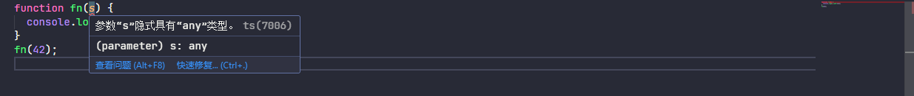

# tsconfig.json配置讲解

关于 tsconfig.json 的相关详细配置参考官方文档说明：https://www.typescriptlang.org/tsconfig/#Type_Checking_6248

## 一、tsconfig.json配置

如果一个目录下存在一个 `tsconfig.json` 文件，那么它意味着这个目录是 TypeScript 项目的根目录。 `tsconfig.json` 文件中指定了用来编译这个项目的根文件和编译选项。 一个项目可以通过以下方式之一来编译：

+ 不带任何输入文件的情况下调用 `tsc` 命令，编译器会从当前目录开始去查找 tsconfig.json 文件，逐级向上搜索父目录。

+ 不带任何输入文件的情况下调用 `tsc`，且使用命令行参数 `--project`（或 `-p`）指定一个包含 tsconfig.json 文件的目录。

  当命令行上指定了输入文件时，tsconfig.json 文件会被忽略。

### 1.1、files 字段

`"files"`指定一个包含相对或绝对文件路径的列表

🔔注意：只能文件，不能是文件夹

### 1.2、include

include 字段用于指明需要被 tsc 编译的文件或文件夹列表，例如

```json
{
  "include": ["src", "global.d.ts"]
}
```

### 1.3、exclude

exclude 字段用于排除不需要 tsc 编译的文件或文件夹列表，例如：

```json
{
  "exclude": ["test.ts", "src/test.ts"],
}
```

### 1.4、include和exclude的细节

`"include"` 和 `"exclude"` 属性指定一个文件 glob 匹配模式列表。 支持的 glob 通配符有

+ `*` 匹配0或多个字符（不包括目录分隔符）
+ `?` 匹配一个任意字符（不包括目录分隔符）
+ `**/` 递归匹配任意子目录

1. 如果一个 glob 模式里的某部分只包含 `*` 或 `.*`，那么仅有支持的文件扩展名类型被包含在内（比如默认 .ts，.tsx，和 .d.ts， 如果 allowJs 设置能 true 还包含 .js 和 .jsx ）

2. 如果 `"files"` 和 `"include"` 都没有被指定，编译器默认包含当前目录和子目录下所有的 TypeScript 文件（ `.ts`, `.d.ts` 和 `.tsx` ），排除在 `"exclude"` 里指定的文件。JS文件（  `.js` 和 `.jsx` ）也被包含进来如果 `allowJs` 被设置成  `true`。 如果指定了 `"files"` 或 `"include"`，编译器会将它们结合一并包含进来。 使用 `"outDir"`  指定的目录下的文件永远会被编译器排除，除非你明确地使用 `"files"` 将其包含进来（这时就算用 `exclude` 指定也没用）

3. 使用 `"include"` 引入的文件可以使用 `"exclude"` 属性过滤。 然而，通过 `"files"` 属性明确指定的文件却总是会被包含在内，不管 `"exclude"` 如何设置。 如果没有特殊指定， `"exclude"` 默认情况下会排除 `node_modules`，`bower_components`，`jspm_packages`和 `<outDir>` 目录
4. 任何被 `"files"` 或 `"include"` 指定的文件所引用的文件也会被包含进来。 `A.ts` 引用了 `B.ts`，因此 `B.ts` 不能被排除，除非引用它的 `A.ts` 在 `"exclude"` 列表中。
5. `tsconfig.json` 文件可以是个空文件，那么所有默认的文件（如上面所述）都会以默认配置选项编译。

### 1.5、extends

tsconfig.json 文件可以利用 extends 属性从另一个配置文件里继承配置。

extends 是 tsconfig.json 文件里的顶级属性（与 compilerOptions，files，include，和 exclude 一样）。 extends 的值是一个字符串，包含指向另一个要继承文件的路径。

### 1.6、compileOnSave

compileOnSave 是声明是否需要在保存时候自动触发 tsc 编译的字段，一般来说，我们的代码编译过程会通过 Rollup、Webpack 等打包构建工具，并且使用热更新，因此无需配置该项，保持缺省即可。

```json
{
  "compileOnSave": false,
}
```

### 1.7、compilerOptions

compilerOptions 为编译选项，详细可以参考下一章

## 二、compilerOptions选项详解

### 2.1、类型检查相关配置

#### 2.1.1、strict

当 strict 为 true 时，会默认开启一系列相关类型检查行为。相互关联的配置项有

- [`alwaysStrict`](https://www.typescriptlang.org/tsconfig/#alwaysStrict)
- [`strictNullChecks`](https://www.typescriptlang.org/tsconfig/#strictNullChecks)
- [`strictBindCallApply`](https://www.typescriptlang.org/tsconfig/#strictBindCallApply)
- [`strictBuiltinIteratorReturn`](https://www.typescriptlang.org/tsconfig/#strictBuiltinIteratorReturn)
- [`strictFunctionTypes`](https://www.typescriptlang.org/tsconfig/#strictFunctionTypes)
- [`strictPropertyInitialization`](https://www.typescriptlang.org/tsconfig/#strictPropertyInitialization)
- [`noImplicitAny`](https://www.typescriptlang.org/tsconfig/#noImplicitAny)
- [`noImplicitThis`](https://www.typescriptlang.org/tsconfig/#noImplicitThis)
- [`useUnknownInCatchVariables`](https://www.typescriptlang.org/tsconfig/#useUnknownInCatchVariables)

如果需要关闭单个配置，就单独设置该项为 false 即可，例如

```json
  "compilerOptions": {
    // 类型检查相关配置
    "strict": true
    "alwaysStrict": false
  },
```

#### 2.1.2、alwaysStrict

`alwaysStrict` 选项告诉 TypeScript 编译器以严格模式解析所有源代码，并为每个生成的 JavaScript 文件在顶部添加 `"use strict";` 指令

示例代码

```typescript
function example() {
  // 在严格模式下，这会导致编译错误
  undeclaredVar = "hello"; // 错误：找不到名称 'undeclaredVar'
  
  // 在严格模式下，这会导致编译错误
  const obj = { x: 1 };
  with (obj) { // 错误：严格模式禁止使用 'with' 语句
    console.log(x);
  }
}

example();
```

会被编译成

```javascript
"use strict";
function example() {
    // 在严格模式下，这会导致运行时错误
    undeclaredVar = "hello"; // ReferenceError: undeclaredVar is not defined
}
example();
```

#### 2.1.3、strictNullChecks

当 `strictNullChecks` 为 `false` 时，语言实际上忽略了 `null` 和 `undefined`。这可能会导致运行时出现意外错误。

当 `strictNullChecks` 为 `true` 时，`null` 和 `undefined` 有自己的不同类型，如果您尝试在需要具体值的地方使用它们，您将收到类型错误。

例如：以下代码中的 `users.find` 不能保证它真的会找到一个用户，但你可以编写代码

```typescript
declare const loggedInUsername: string;

const users = [
  { name: 'Oby', age: 12 },
  { name: 'Heera', age: 32 },
];

const loggedInUser = users.find((u) => u.name === loggedInUsername);
console.log(loggedInUser.age);
```

将 `strictNullChecks` 设置为 `true` 将引发一个错误，表明您在尝试使用它之前尚未保证 `loggedInUser` 存在。


将 `strictNullChecks` 设置为 `false` 时则不会提示，可能会导致运行时出现意外错误。

#### 2.1.4、strictBindCallApply

设置后，TypeScript 将检查函数 `call`、`bind` 和 `apply` 的内置方法是否使用底层函数的正确参数调用，示例如下

```typescript
function fn(x: string) {
  return parseInt(x);
}
 
const n1 = fn.call(undefined, "10");
 
const n2 = fn.call(undefined, false);
```


#### 2.1.5、strictBuiltinIteratorReturn

```typescript
const array = [1, 2, 3];
const iterator = array[Symbol.iterator]();

// 正常迭代
console.log(iterator.next()); // { value: 1, done: false }

// 调用 return 方法用于提前终止迭代 - 这里类型检查不够严格
const result = iterator.return(); // error

console.log(result); // { value: undefined, done: true }
```

#### 2.1.6、strictFunctionTypes

```typescript
function fn(x: string) {
  console.log('Hello, ' + x.toLowerCase());
}

type StringOrNumberFunc = (ns: string | number) => void;

/**
 * 不能将类型“{ (x: string): number; (x: string): void; (x: string): void; }”分配给类型“StringOrNumberFunc”。
  参数“x”和“ns” 的类型不兼容。
    不能将类型“string | number”分配给类型“string”。
      不能将类型“number”分配给类型“string”。
 */
let func: StringOrNumberFunc = fn; // error

func(10);

/**
 * 当 strictFunctionTypes 启用时
 * 上述写法可以改成以下写法
 */
type Methodish = {
  func(x: string | number): void;
};

function fn(x: string) {
  console.log('Hello, ' + x.toLowerCase());
}

// Ultimately an unsafe assignment, but not detected
const m: Methodish = {
  func: fn,
};
m.func(10);
```

#### 2.1.7、strictPropertyInitialization

当设置为 true 时，当类属性已声明但未在构造函数中设置时，TypeScript 将引发错误。

```typescript
class UserAccount {
  name: string;
  accountType = 'user';

  email: string;
  address: string | undefined;

  constructor(name: string) {
    this.name = name;
    // Note that this.email is not set
  }
}
```


上述的情况 name 和 email 是必填的，所以需要在 constructor 中进行设置

#### 2.1.8、noImplicitAny

在某些情况下，如果不存在类型注释，当它无法推断该类型时，TypeScript 将回退到变量的 `any` 类型。

```typescript
function fn(s) {
  console.log(s.subtr(3));
}
fn(42);
```

上述代码并没有什么错误，当 noImplicitAny 设置为 true 时就会提示 s 参数类型为隐式 any

 

#### 2.1.9、noImplicitThis

在隐含 “any” 类型的 “this” 表达式上引发错误，示例如下

```typescript
class Rectangle {
  width: number;
  height: number;

  constructor(width: number, height: number) {
    this.width = width;
    this.height = height;
  }

  getAreaFunction() {
    return function () {
      return this.width * this.height;
    };
  }
}
```

下面的类返回一个尝试访问 `this.width` 和 `this.height` 的函数，但 `getAreaFunction` 内部 `函数中的上下文` 不是 Rectangle 的实例


#### 2.1.10、useUnknownInCatchVariables

在 TypeScript 4.0 中，添加了支持以允许将 catch 子句中变量的类型从 `any` 更改为 `unknown`。允许以下代码：

```typescript
try {
  // ...
} catch (err: unknown) {
  // We have to verify err is an
  // error before using it as one.
  if (err instanceof Error) {
    console.log(err.message);
  }
}
```

#### 2.1.11、allowUnreachableCode

allowUnreachableCode 表示是否允许无法访问的代码，为 true 时表示忽略，false 时引发有关无法访问代码的编译器错误，默认为 undefined 向编辑者提供建议作为警告

示例如下

```typescript
function fn(n: number) {
  if (n > 5) {
    return true;
  } else {
    return false;
  }
  return true;
}
```

其中函数内的最后一行执行代码 `return true；` 代码始终无法执行到该行代码


#### 2.1.12、allowUnusedLabels

allowUnusedLabels 表示是否允许未使用的标签，为 true 时表示忽略，false 时引发有关无法访问代码的编译器错误，默认为 undefined 向编辑者提供建议作为警告

首先需要先介绍以下 label 语法，JavaScript 是存在 label 语法的，像以下示例一样

```javascript
function exampleWithUnusedLabel() {
  unusedLabel: for (let i = 0; i < 5; i++) {
    console.log(i);
  }
}

function anotherExample() {
  myLabel: {
    console.log("This is a block");
  }
}
```

像上述中的 exampleWithUnusedLabel 和 myLabel 表示其中的代码块含义，更加详细的了解可自行参考其他文档深入了解，这里不做详细描述。

像这里设置 allowUnusedLabels 为 false 时就会提示，exampleWithUnusedLabel 并未被其他地方引用


#### 2.1.13、exactOptionalPropertyTypes

exactOptionalPropertyTypes 选项让 TypeScript 对可选属性进行更严格的检查。启用后，可选属性只能被省略或赋值为明确类型，不能显式赋值为 `undefined`。

```typescript
interface User {
  name: string;
  age?: number;
}

const user1: User = { name: 'Alice' }; // 省略 optional
const user2: User = { name: 'Jack', age: 42 }; // 赋值为 number

// 当 exactOptionalPropertyTypes 为 false 时是允许的，为 true 则会提示错误
const user3: User = { name: 'black', age: undefined }; // 赋值为 undefined
```


#### 2.1.14、noFallthroughCasesInSwitch

noFallthroughCasesInSwitch 选项用于防止在 switch 语句中出现意外的 case 穿透（fallthrough）行为。当启用时（推荐），TypeScript 会检查每个 case 块是否以 break、return 或 throw 等语句结束，如果没有，就会报错。设置为 true 表示开启，false 为关闭。示例如下

```typescript
function getFruitPrice(fruit: string): number {
  let price = 0;

  switch (fruit) {
    case 'apple':
      price = 2; // 错误：这里没有 break、return 或 throw
    case 'banana':
      price = 1;
      break;
    default:
      price = 0;
  }

  return price;
}
```


#### 2.1.15、noImplicitOverride

当使用继承类时，子类可能会覆盖基类中的方法，覆盖方法前需要加 override 修饰符，示例如下

```typescript
class Album {
  download() {
    // Default behavior
  }
}

class SharedAlbum extends Album {
  download() {
    // Override to get info from many sources
  }
}
```

当 noImplicitOverride 设置为 true 时（默认为 false），会提示以下错误


#### 2.1.16、noImplicitReturns

启用后，TypeScript 将检查函数中的所有代码路径，以确保它们返回值

```typescript
function lookupHeadphonesManufacturer(color: 'blue' | 'black'): string {
  if (color === 'blue') {
    return 'beats';
  } else {
    ('bose');
  }
}
```


#### 2.1.17、noUncheckedIndexedAccess

noUncheckedIndexedAccess 选项让 TypeScript 对数组和索引签名属性的访问更加严格。启用后，通过索引访问数组元素或对象动态属性时，返回的类型会包含 `undefined`，强制你处理可能不存在的值。示例如下

```typescript
const numbers = [1, 2, 3, 4, 5];

const first = numbers[0];
const tenth = numbers[9];
```

当 noUncheckedIndexedAccess 为 false 不启用时


当 noUncheckedIndexedAccess 为 true 启用时


#### 2.1.18、noPropertyAccessFromIndexSignature 

noPropertyAccessFromIndexSignature 选项当访问已知属性使用 `.` 符号，访问索引属性使用方括号 `[]` 进行访问。这样可以更清楚地区分已知属性和动态属性。示例如下

```typescript
interface Config {
  // 已知属性
  timeout: number;
  retries: number;

  // 索引签名（动态属性）
  [key: string]: number;
}

const config: Config = {
  timeout: 1000,
  retries: 3,
  customDelay: 500, // 动态属性
};

console.log(config.timeout); // ✅ 1000 - 点符号访问已知属性
console.log(config['timeout']); // ✅ 1000 - 方括号访问已知属性
console.log(config.customDelay); // ✅ 500 - 点符号访问动态属性（但有问题！）
console.log(config['customDelay']); // ✅ 500 - 方括号访问动态属性
```


#### 2.1.19、noUnusedLocals

报告未使用的局部变量的错误，为 true 时启用，false 为关闭

```typescript
const createKeyboard = (modelID: number) => {
  const defaultModelID = 23;
  return { type: 'keyboard', modelID };
};
```


#### 2.1.20、noUnusedParameters

报告函数中未使用参数的错误，为 true 时启用，false 为关闭

```typescript
const createDefaultKeyboard = (modelID: number) => {
  const defaultModelID = 23;
  return { type: 'keyboard', modelID: defaultModelID };
};
```


#### 2.1.21、类型检查总结

strictPropertyInitialization 和 exactOptionalPropertyTypes 配置项需要先指定 strictNullChecks 的配置，否则配置不生效


### 2.2、代码内核心配置

#### 2.2.1、lib

TypeScript 包括一组内置 JS API（如 `Math`）的默认类型定义，以及浏览器环境中的事物（如 `document `）的类型定义。TypeScript 还包括与您指定的 [`target`](https://www.typescriptlang.org/tsconfig/#target) 匹配的较新 JS 功能的 API，更新详细配置可以参考 https://www.typescriptlang.org/tsconfig/#lib

当 lib 只设置以下时，当代码中使用到 `document` API 和 `ES6` 以上的新特性API 就会提示错误

```json
{
  "compilerOptions": {
    "lib": ["ES2015"]
  },
}
```


#### 2.2.2、target

target 选项指定编译后的 JavaScript 版本，可以设置的值有 es3、es5、es6/es2015、es2016、es2017、es2018、es2019、es2020、es2021、es2022、es2023、es2024、esnext

#### 2.2.3、module

module 指定编译后的所运行环境的模块系统，设置的值可以为 none、commonjs、amd、umd、system、es6/es2015、es2020、es2022、esnext、node16、node18、node20、nodenext、preserve

其中 commonjs、amd、umd、system、分别表示各自的模块系统。es6/es2015 表示 ESM 模块系统，es2020 除了 es6/es2015 的基本功能外，es2020 还增加了对  [dynamic import](https://developer.mozilla.org/en-US/docs/Web/JavaScript/Reference/Operators/import) and [import.meta](https://developer.mozilla.org/en-US/docs/Web/JavaScript/Reference/Operators/import.meta) 而 es2022 进一步增加了对 [top level await](https://developer.mozilla.org/en-US/docs/Web/JavaScript/Reference/Operators/await#top_level_await) 的支持

node16 支持 ES Modules (ESM) 和 CommonJS (CJS) 两种模块系统。在 Node.js 16 中，你可以通过在 `package.json` 中设置 `"type": "module"` 来启用 ESM，或者在文件扩展名上使用 `.mjs` 来明确表示文件为 ESM。默认情况下，如果未设置 `"type"` 或文件扩展名为 `.cjs`，则 Node.js 使用 CommonJS

而 node18 和 node20 同样支持 ESM 和 CJS ，并且在模块方面进行了进一步的优化和改进而已。

exnext 和 nodenext 表示默认启用下个稳定版本

#### 2.2.4、moduleResolution

指定模块解析策略，可以允许的值为 classic、node10/node、node16、nodenext、bundler

1. 如果 module 选项设置为 commonjs，则 moduleResolution 应该设置为 node10 和 node 作用是一样的，仅支持用于 v10 之前的 Node.js 版本，只支持 CommonJS 模块

2. 如果 module 选项设置为 node16、node18 和 node20，则 moduleResolution 应该设置为 Node16 
3. 如果 module 选项设置为 nodenext，则 moduleResolution 应该设置为 nodenext
4.  如果 module 选项设置为 preserve 或 es2015 或更高版本，则 moduleResolution 应该设置为 bundler 否则则为 classic

#### 2.2.5、baseUrl和path

```json
{
  "baseUrl": ".", // 设置一个基本目录
  "paths": {
    // 配置别名路径
    "@/*": ["src/*"]
  }
}
```

```typescript
import { add } from '@/utils/math';
```

#### 2.2.6、importHelpers

importHelpers 选项主要和 tslib 配合起来使用，当 target 选项设置为 es5 时，但是在代码中会用到 async 和 await 相关语法。tsc 进行编译时会处理兼容性   "importHelpers": true,

```json
{
  "compilerOptions": {
    "target": "es5", // 指定编译后的 JavaScript 版本
    "lib": ["DOM", "ES2024"],
  },
  "include": ["src/**/*.ts", "globals.d.ts"],
  "exclude": ["node_modules"]
}
```

实际的使用代码

```typescript
const getAPI = async (url: string) => {
  // Get API
  return {};
};
```

当 importHelpers 不使用时，进行编译时查看结果


当 importHelpers 启用时，会提示需要按照 tslib


然后需要安装 tslib，并且 tslib 是运行时使用，使用 --save 进行安装

```bash
npm i tslib --save
```

然后再次编译，其中 \_\_awaiter 和 \_\_generator 会从 tslib 辅助函数中进行导入


与该选项相关的配置为 noEmitHelpers ，主要就是取消对 tslib 帮助程序的使用，详细见：https://www.typescriptlang.org/tsconfig/#noEmitHelpers。

#### 2.2.7、esModuleInterop 和 allowSyntheticDefaultImports

默认情况下（`esModuleInterop` 为 false 或未设置）TypeScript 将 CommonJS/AMD/UMD 模块视为 ES6 模块。

当 module 选项设置为 node16、nodenext、preserve 时，esModuleInterop 默认开启 true，否则则为 false

当 esModuleInterop 选项启动时默认也会启用 allowSyntheticDefaultImports 选项

allowSyntheticDefaultImports 选项则是允许合成默认导入

这里先配置以下设置

```json
{
  "compilerOptions": {
    "target": "es5", // 指定编译后的 JavaScript 版本
    "lib": ["DOM", "ES2024"],
    "outDir": "dist",
    "module": "commonjs", // 指定编译后的所运行环境的模块系统，不会开启 esModuleInterop
    "moduleResolution": "node10"
  },
  "include": ["src/**/*.ts"],
  "exclude": ["node_modules"]
}
```

在实际代码上，会提示模块 "node:fs" 没有默认导出。

```typescript
import fs from 'node:fs';

fs.copyFile('', '', () => {});
```


原因是 fs 模块是 CommonJS 方案实现，没有默认导出，此时有两个方案

第一种是通过以下方式进行解决

```typescript
import * as fs from 'node:fs';

fs.copyFile('', '', () => {});

console.log('执行');
```

编译后的代码依然可以执行

```js
"use strict";
Object.defineProperty(exports, "__esModule", { value: true });
var fs = require("node:fs");
fs.copyFile('', '', function () { });
console.log('执行');
```

第二种是通过 esModuleInterop，但是这一边我先不开启 esModuleInterop，先设置启用 allowSyntheticDefaultImports

```json
{
  "allowSyntheticDefaultImports": true
}
```

Typescript 并不会报告错误


allowSyntheticDefaultImports 会在编译后的模块添加 default 属性，tsc 虽然可以编译成功但是编译后的代码无法执行


当在设置 esModuleInterop 时，编译之后会多出 `__importDefault` 辅助函数，并且编译后的代码可以执行


当设置 esModuleInterop 并且还使用以下方式还会多出其他辅助函数

```javascript
import * as fs from 'node:fs';

fs.copyFile('', '', () => {});

console.log('执行');
```


当 module 选项设置为以下设置时

```json
{
  "module": "es2022", // 指定编译后的所运行环境的模块系统
	"moduleResolution": "bundler",
}
// 或
{
  "module": "node16", // 指定编译后的所运行环境的模块系统，会默认开启 esModuleInterop allowSyntheticDefaultImports
	"moduleResolution": "node16",
}
```

当前代码中 无论使用以下那种方式都正常编译

```typescript
import * as fs from 'node:fs';
// or
import fs from 'node:fs';
```

### 2.3、jsx 相关设置

控制 JSX 构造在 JavaScript 文件中的发布方式。这仅影响以 `.tsx` 文件开始的 JS 文件的输出。

示例如下

```tsx
export const HelloWorld = () => <h1>Hello world</h1>;
```

当 jsx 设置 react-jsx 时，编译之后

```jsx
import { jsx as _jsx } from "react/jsx-runtime";
export const HelloWorld = () => _jsx("h1", { children: "Hello world" });
```

当 jsx 设置 react-jsxdev 时，编译之后

```jsx
import { jsxDEV as _jsxDEV } from "react/jsx-dev-runtime";
const _jsxFileName = "/home/runner/work/TypeScript-Website/TypeScript-Website/packages/typescriptlang-org/index.tsx";
export const HelloWorld = () => _jsxDEV("h1", { children: "Hello world" }, void 0, false, { fileName: _jsxFileName, lineNumber: 9, columnNumber: 32 }, this);
```

当 jsx 设置 preserve 时，编译之后

```jsx
import React from 'react';
export const HelloWorld = () => <h1>Hello world</h1>;
```

当 jsx 设置 react-native 时，编译之后

```jsx
import React from 'react';
export const HelloWorld = () => <h1>Hello world</h1>;
```

当 jsx 设置 react 时，编译之后

```jsx
import React from 'react';
export const HelloWorld = () => React.createElement("h1", null, "Hello world");
```

### 2.4、其他相关配置

#### 2.4.1、outFile

如果 `module` 是 `system` 或 `amd`，则所有模块文件也将在所有全局内容之后连接到此文件中。

🔔注意：除非 `module` 为 `None`、`System` 或 `AMD`，否则`不能使用 outFile`。此选项不能用于 CommonJS 或 ES6 模块。

#### 2.4.2、是否启用装饰器

```json
{
  "compilerOptions": {
    "emitDecoratorMetadata": true, 
    "experimentalDecorators": true,
  },
}
```

#### 2.4.3、其他相关常用配置

```json
{
  "compilerOptions": {
    "target": "es5", // 指定编译后的 JavaScript 版本
    "lib": ["DOM", "ES2024"],
    "outDir": "dist", // 文件输出目录
    "preserveConstEnums": true, // 是否禁止删除枚举常量生成代码中的声明，默认为 false
    "skipLibCheck": true, // 跳过类型声明文件的检查
    "declaration": true, // 是否为每个 Typescript 文件生成 .d.ts 文件
    "declarationDir": "./types", // 将生成的 .d.ts 指定目录
    "noEmit": false, // 不输入编译后的文件
    "noEmitOnError": false, // 若 Typescript 报告了任何错误就不会输出编译后的文件
    "sourceMap": true, // 开启 sourceMap
    "removeComments": false, // 是否移除注释
    "allowJs": true, // 是否对js文件进行编译，默认：false
    "checkJs": false // 是否检查js代码是否符合语法规范，当使用checkJs，必须使用allowJs，默认：false
  },
  "include": ["src/**/*.ts", "globals.d.ts"],
  "exclude": ["node_modules"]
}
```


