# Nginx实战

## 一、反向代理和正向代理

代理是在服务器和客户端之间假设的一层服务器，代理将接收客户端的请求并将它转发给服务器，然后将服务端的响应转发给客户端。

### 1.1、正向代理原理

正向代理是为我们服务的，即为客户端服务的，客户端可以根据正向代理访问到它本身无法访问到的服务器资源。

正向代理对我们是透明的，对服务端是非透明的，即服务端并不知道自己收到的是来自代理的访问还是来自真实客户端的访问。

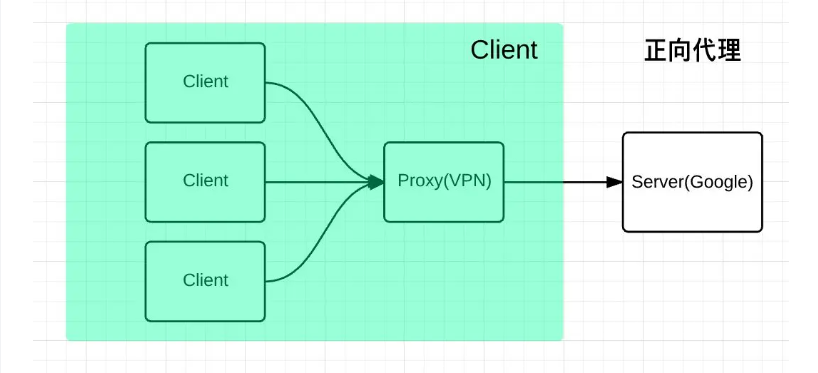

### 1.2、反向代理原理图解

反向代理是为服务端服务的，反向代理可以帮助服务器接收来自客户端的请求，帮助服务器做请求转发，负载均衡等。

反向代理对服务端是透明的，对我们是非透明的，即我们并不知道自己访问的是代理服务器，而服务器知道反向代理在为他服务。

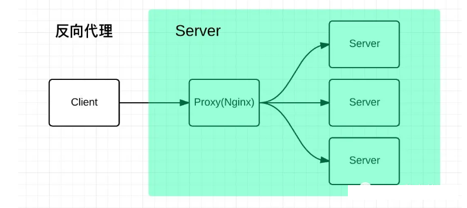

### 1.3、反向代理实战

> nginx 服务器的 IP 为 192.168.1.100

首先我使用 express 启动一个服务，服务器 IP 为 192.168.1.3，通过 nginx 反向代理映射到该 IP 上。

```javascript
const path = require('path');
const express = require('express');

const app = express();

app.use(express.static(path.resolve(__dirname, 'public')));

app.listen(8080, () => {
  console.log('Server is running on http://localhost:8080');
});
```

然后对 nginx 进行添加配置

```nginx
server {
    listen       80;
    charset      utf-8;
    server_name  localhost;

    #access_log  logs/host.access.log  main;

    location / {
        root   html;
        index  index.html index.htm;
    }

    location /proxy {
        proxy_pass  http://192.168.1.3:8080/;
    }

    #error_page  404              /404.html;

    # redirect server error pages to the static page /50x.html
    #
    error_page   500 502 503 504  /50x.html;
    location = /50x.html {
        root   html;
    }
}
```

然后再浏览器输入 http://192.168.1.100/proxy 即可完成反向代理过程，实现示例如下

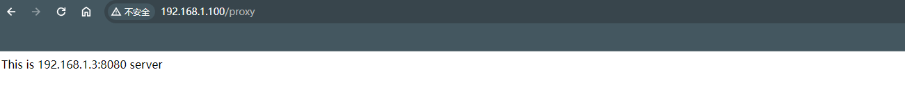

需要注意的是：`proxy_pass http://192.168.1.3:8080` 配置的地址后面加 `/` 和不加 `/` 有很大的区别

+ 加的话：不会拼接 /proxy
+ 不加的话：会拼接 /proxy

## 二、负载均衡

### 2.1、为什么需要负载均衡

一般情况下，客户端发送多个请求到服务器，服务器处理请求，其中一部分可能要操作一些资源比如数据库、静态资源等，服务器处理完毕后，再将结果返回给客户端。

这种模式对于早期的系统来说，功能要求不复杂，且并发请求相对较少的情况下还能胜任，成本也低。随着信息数量不断增长，访问量和数据量飞速增长，以及系统业务复杂度持续增加，这种做法已无法满足要求，并发量特别大时，服务器容易崩。

很明显这是由于服务器性能的瓶颈造成的问题，除了堆机器之外，最重要的做法就是负载均衡。

请求爆发式增长的情况下，单个机器性能再强劲也无法满足要求了，这个时候集群的概念产生了，单个服务器解决不了的问题，可以使用多个服务器，然后将请求分发到各个服务器上，将负载分发到不同的服务器，这就是负载均衡，核心是 `分摊压力`。nginx 实现负载均衡，一般来说指的是将请求转发给服务器集群。

### 2.2、负载均衡原理图

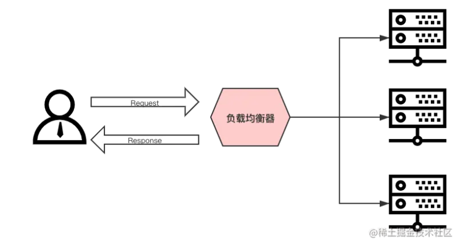

Nginx 实现负载均衡的策略：

+ 轮询策略：默认情况下采用的策略，将所有客户端请求轮询分配给服务端。这种策略是可以正常工作的，但是如果其中某一台服务器压力太大，出现延迟，会影响所有分配在这台服务器下的用户。
+ 最小连接数策略：将请求优先分配给压力较小的服务器，它可以平衡每个队列的长度，并避免向压力大的服务器添加更多的请求。
+ 最快响应时间策略：优先分配给响应时间最短的服务器。
+ 客户端 IP 绑定策略：来自同一个 IP 的请求永远只分配一台服务器，有效解决了动态网页存在的 `session` 共享问题。

### 2.3、负载均衡实现

首先我使用 express 创建项目，分别对这个项目启动三个端口进行服务部署

```javascript
const path = require('path');
const express = require('express');

// 取出端口参数
const args = process.argv.slice(2);
console.log(args);
const [port] = args;

const app = express();

app.use(express.static(path.resolve(__dirname, 'public')));

app.get('/api/userinfo', function (req, res) {
  res.send({
    code: '0000',
    message: '请求成功',
    data: {
      name: 'Marcy',
      age: 24,
    },
  });
});

app.listen(port, () => {
  console.log(`Server is running on http://localhost:${port}`);
});
```

配置的 scripts 的脚本

```json
"scripts": {
  "server:8080": "node ./server/index.js 8080",
  "server:8081": "node ./server/index.js 8081",
  "server:8082": "node ./server/index.js 8082"
},
```

然后为 nginx 配置负载均衡配置

```nginx
http {
    include       mime.types;
    default_type  application/octet-stream;
    sendfile        on;
    keepalive_timeout  65;
    
    # 负载均衡配置
    upstream locatest {
      server 192.168.1.3:8080;
      server 192.168.1.3:8081;
      server 192.168.1.3:8082;
    }

    server {
        listen       80;
        charset      utf-8;
        server_name  localhost;

        #access_log  logs/host.access.log  main;

        location / {
            root   html;
            index  index.html index.htm;
        }
        
    		# 配置负载均衡的静态资源
        location /balance {
            proxy_pass  http://locatest/;
        }
        
    	  # 配置负载均衡的 api 接口
        location /api {
            proxy_pass  http://locatest;
        }
        
        #error_page  404              /404.html;
        # redirect server error pages to the static page /50x.html
        #
        error_page   500 502 503 504  /50x.html;
        location = /50x.html {
            root   html;
        }
    }
}
```

### 2.4、nginx常用的负载策略

| 负载策略   | 描述                 | 特点                                                         |
| ---------- | -------------------- | :----------------------------------------------------------- |
| 轮询       | 默认方式             | 1.每个请求会按时间顺序逐一分配到不同的后端服务器 <br/>2.在轮询中，如果服务器 down 掉了，会自动剔除该服务器 <br/>3.缺省配置就是轮询策略 <br/>4.此策略适合服务器配置相当，无状态且短平快的服务使用 |
| weight     | 权重方式             | 1.在轮询策略的基础上指定轮询的几率<br/>2.权重越高分配到的请求越多<br/>3.此策略可以与 least_conn 和 ip_hash 结合使用<br/>4.此策略比较适合服务器的硬件配置差别比较大的情况 |
| ip_hash    | 依据ip的hash值来分配 | 1.在nginx版本1.3.1之前，不能在ip_hash中使用权重（weight）<br/>2.ip_hash 不能与 backup 同时使用<br/>3.此策略适合有状态服务，比如session<br/>4.当有服务器需要剔除，必须手动down掉 |
| least_conn | 最少连接方式         | 此负载均衡策略适合请求处理时间长短不一造成服务器过载的情况   |

#### 2.4.1、轮询

轮询策略是默认的，所以只需要如下这样修改配置文件就可以了

```nginx
# 负载均衡配置
upstream locatest {
  server 192.168.1.3:8080;
  server 192.168.1.3:8081;
  server 192.168.1.3:8082;
}
```

#### 2.4.2、weight

weight 指令用于指定轮询机率，weight 的默认值为1，weight 的数值与访问比率成正比。

项目我将 8081 接口的 weight 改为2

```nginx
upstream locatest {
  server 192.168.1.3:8080;
  server 192.168.1.3:8081 weight=2;
  server 192.168.1.3:8082;
}
```

再进行一次轮询请求之后，命中 8081 的服务几率是 8080 和 8082 两倍

#### 2.4.3、ip_hash

设定 ip 哈希很简单，就是在你的 upstream 中 指定 `ip_hash;` 即可，如下：

```nginx
upstream locatest {
  ip_hash;
  server 192.168.1.3:8080;
  server 192.168.1.3:8081;
  server 192.168.1.3:8082;
}
```

根据客户端的请求 ip 进行判断，只要 ip 地址不变就永远分配到同一台主机。它可以有效解决后台服务器 `session` 保持的问题。

#### 2.4.4、least_conn

同 ip_hash 一样，设定最小连接数策略也很简单，就是在你的 upstream 中 指定 `least_conn;` 即可，如下：

```nginx
upstream locatest {
  least_conn;
  server 192.168.1.3:8080;
  server 192.168.1.3:8081;
  server 192.168.1.3:8082;
}
```

由于我这里最小连接数看不到实际效果，这里不做演示。

## 三、动静分离

### 3.1、动静分离原理

动静分离是指在 `web` 服务器架构中，将静态页面与动态页面或者静态内容接口和动态内容接口分开不同系统访问的架构设计方法，进而提示整个服务的访问性和可维护性。

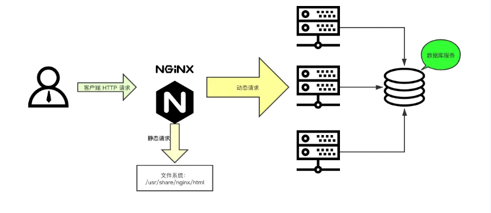

一般来说，都需要将动态资源和静态资源分开，由于 nginx 的高并发和静态资源缓存等特性，经常将静态资源部署在 nginx 上。如果请求的是静态资源，直接到静态资源目录获取资源，如果是动态资源的请求，则利用反向代理的原理，把请求转发给对应后台应用去处理，从而实现动静分离。

使用前后端分离后，可以很大程度提升静态资源的访问速度，即使动态服务不可用，静态资源的访问也不会受到影响。

### 3.2、动静分离实现

前端一般会经过项目构建之后生成 dist 和 build 目录，将生成目录作为静态文件部署再 nginx。后端接口通过 /api 区分为动态服务接口

前端 html 配置如下

```html
<!doctype html>
<html lang="en">
  <head>
    <meta charset="UTF-8" />
    <meta
      name="viewport"
      content="width=device-width, initial-scale=1.0" />
    <title>动静分离</title>
    <link
      rel="stylesheet"
      href="./index.css" />
    <style>
      h1 {
        color: blueviolet;
      }
    </style>
    <script src="https://cdnjs.cloudflare.com/ajax/libs/jquery/3.7.1/jquery.min.js"></script>
    <script src="./main.js"></script>
  </head>
  <body>
    <h1>模拟动静分离</h1>
  </body>
  <script>
    // 请求接口
    $.get('/api/userinfo', function (data) {
      console.log(data.data);
    });
  </script>
</html>
```

然后需要配置 http://192.168.1.3:8888 服务，通过上述 html 请求接口时反向代理到该服务

```javascript
const express = require('express');
const app = express();

app.get('/api/userinfo', function (req, res) {
  res.send({
    code: '0000',
    message: '请求成功',
    data: {
      name: 'Marcy',
      age: 24,
    },
  });
});

app.listen(8888, () => {
  console.log(`Server is running on http://localhost:8888`);
});
```

nginx 配置如下

```nginx
server {
    listen       80;
    charset      utf-8;
    server_name  localhost;

    #access_log  logs/host.access.log  main;

    location / {
        root   dist;
        index  index.html index.htm;
    }

    # 根据 /api 后缀为区分后端接口
    location /api {
        proxy_pass  http://192.168.1.3:8888;
    }

    #error_page  404              /404.html;
    # redirect server error pages to the static page /50x.html
    #
    error_page   500 502 503 504  /50x.html;
    location = /50x.html {
        root   html;
    }
}
```

由此动静分离配置成功，实际效果如下

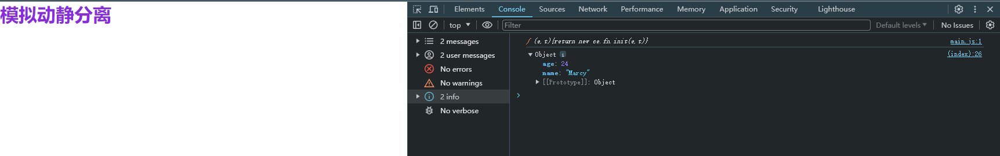

还需要注意的地方：

请求的接口只写了 `/api/userinfo` 会自动补上域名，当静态资源路径为 http://192.168.1.100/static/ 也还是只补充域名，后续的 /static 的路径不会补充成为 `http://192.168.1.100/static/api/userinfo` 。但是这里用的是 `$.get`，如果用到其他库（例如：axios、fetch）等额外需要注意。

## 四、防盗链

### 4.1、防盗链原理

nginx 的防盗链是一种用于保护资源免受盗链的安全机制。盗链指的是其他网站在未经授权的情况下直接使用你网站上的资源，例如图片、视频或其他文件，消耗你的带宽和资源。nginx 可以检查 HTTP 请求中的 Referer 字段，该字段指示了请求的来源网页。你可以配置nginx 只允许特定的 Referer 来源访问资源，拒绝其他非授权的请求。

nginx 防盗链作用：

+ 节省带宽和资源消耗：防止其他网站直接使用你的资源，可以减少非授权访问的流量消耗，提高服务器的响应速度和性能。
+ 保护数据安全：防止未经授权的访问可以减少数据泄漏的风险。只有经过授权的用户或来源才能访问敏感数据。
+ 维护内容版权：如果你有版权保护的内容，防盗链可以阻止其他网站盗用你的内容，维护你的知识产权。

### 4.2、为资源访问开启防盗链

在 `/usr/local/nginx` 目录下创建 images，并上传图片等资源。并添加修改 nginx 配置如下

```nginx
server {
    listen       80;
    charset      utf-8;
    server_name  localhost;

    #access_log  logs/host.access.log  main;

    location / {
        root  dist;
        index  index.html index.htm;
    }
		
  	# 配置图片资源路径
    location /images {
        root  /usr/local/nginx;
        autoindex on;
    }

    # 根据 /api 后缀为区分后端接口
    location /api {
        proxy_pass  http://192.168.1.3:8888;
    }

    #error_page  404              /404.html;
    # redirect server error pages to the static page /50x.html
    #
    error_page   500 502 503 504  /50x.html;
    location = /50x.html {
        root   html;
    }
}
```

当访问 http://192.168.1.100/images/icon.png 地址时可以正常访问，因为此时没有开启防盗链。开启防盗链之后限制那些来源可以访问。

以下是为添加防盗链的 nginx 配置

```nginx
server {
    listen       80;
    charset      utf-8;
    server_name  localhost;

    #access_log  logs/host.access.log  main;

    location / {
        root  dist;
        index  index.html index.htm;
    }

    # 添加防盗链
    location /images {
        valid_referers none blocked baidu.com; # 可以访问的白名单，blocked 加上之后可以不用指定 http 或 https 协议，只需要指定域名或ip
        if ($invalid_referer) {
          return 403;
        }
        root  /usr/local/nginx;
        autoindex on;
    }

    # 根据 /api 后缀为区分后端接口
    location /api {
        proxy_pass  http://192.168.1.3:8888;
    }

    #error_page  404              /404.html;
    # redirect server error pages to the static page /50x.html
    #
    error_page   500 502 503 504  /50x.html;
    location = /50x.html {
        root   html;
    }
}
```

实际测试效果如下

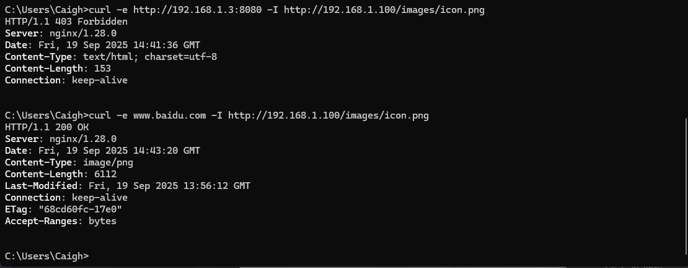

```bash
curl -e http://192.168.1.3:8080 -I http://192.168.1.100/images/icon.png     # ❌ 403
curl -e www.baidu.com -I http://192.168.1.100/images/icon.png    					 # ✅ 200
```

### 4.3、反向代理"破解"防盗链

标准的防盗链机制依赖于检查HTTP请求头中的 `Referer` 字段。这个字段告诉服务器，当前请求是从哪个网页链接过来的。

nginx "破解" 防盗链的本质，就是 `扮演一个 "正常用户" 的角色，在反向代理请求时，替客户端发送一个合法的 Referer`。

虽然技术上可行，但你必须清楚以下几点：

1. 侵犯版权和违反服务条款：绝大多数拥有防盗链设置的网站，其目的就是为了保护自己的带宽和内容版权。通过代理绕过此限制，直接违反了目标站点的意图和通常其服务条款（ToS）。实际上是在盗用他人的带宽和服务器资源来为你自己的用户服务。
2. 性能与带宽成本：所有流量都会先经过你的服务器，这会消耗你自己的带宽和服务器资源。如果代理的是大文件（如视频）或流量很大，你的服务器成本会急剧上升，甚至可能因带宽超标而停机。
3. 法律风险：如果对方网站追究起来，你可能会收到警告信、律师函，甚至被起诉。这是一种明确的侵权行为。
4. 技术对抗：对方网站可能会升级他们的防盗链策略，例如：使用动态令牌或签名、使用Cookie或用户认证来验证请求、直接封禁你的代理服务器IP地址等
5. 道德问题：尊重其他站长的劳动成果和规则是互联网的基本礼仪。

示例 nginx 配置

```nginx
server {
    listen 80;
    server_name your-proxy.com; # 你的代理服务器域名

    location /proxy/ {
        # 目标资源URL（被防盗链的图片）
        proxy_pass https://target-website.com/resources/;

        # 关键步骤：设置一个合法的Referer，欺骗目标服务器
        proxy_set_header Referer "https://allowed-website.com/";

        # 可选：隐藏原始服务器可能返回的一些敏感头信息
        proxy_hide_header X-Powered-By;
        proxy_hide_header Server;

        # 设置一些必要的头信息，让目标服务器认为这是一个普通浏览器请求
        proxy_set_header User-Agent "Mozilla/5.0 (Windows NT 10.0; Win64; x64) AppleWebKit/537.36";
        proxy_set_header X-Real-IP $remote_addr;
        proxy_set_header X-Forwarded-For $proxy_add_x_forwarded_for;
        proxy_set_header X-Forwarded-Proto $scheme;
    }
}
```

访问方式：假设目标图片地址是 `https://target-website.com/resources/cat.jpg`，那么用户可以通过访问 `https://your-proxy.com/proxy/cat.jpg` 来看到这张图片。

## 五、跨域

在第三节中的 [动静分离](#three) 配置中，对其部分进行修改

修改后的 html 如下

```html
<!doctype html>
<html lang="en">
  <head>
    <meta charset="UTF-8" />
    <meta
      name="viewport"
      content="width=device-width, initial-scale=1.0" />
    <title>动静分离</title>
    <link
      rel="stylesheet"
      href="./index.css" />
    <style>
      h1 {
        color: blueviolet;
      }
    </style>
    <script src="https://cdnjs.cloudflare.com/ajax/libs/jquery/3.7.1/jquery.min.js"></script>
    <script src="./main.js"></script>
  </head>
  <body>
    <h1>模拟动静分离</h1>
  </body>
  <script>
    // 请求接口
    $.get('http://192.168.1.100:9000/api/userinfo', function (data) {
      console.log(data.data);
    });
  </script>
</html>
```

nginx 配置如下

```nginx
http {
    include       mime.types;
    default_type  application/octet-stream;

    sendfile        on;
    keepalive_timeout  65;
	
  	# 前端服务
    server {
        listen       80;
        charset      utf-8;
        server_name  localhost;

        #access_log  logs/host.access.log  main;

        location / {
            root   dist;
            index  index.html index.htm;
        }
        
        #error_page  404              /404.html;
        # redirect server error pages to the static page /50x.html
        #
        error_page   500 502 503 504  /50x.html;
        location = /50x.html {
            root   html;
        }
    }
    
  	# 后端接口服务
    server {
       listen       9000;
       charset      utf-8;
       server_name  localhost;
       
       location /api {
           proxy_pass  http://192.168.1.3:8888;
       }
    }
}
```

当前端服务（http://192.168.1.100:80）访问后端服务（http://192.168.1.100:9000） 时就会触发跨域

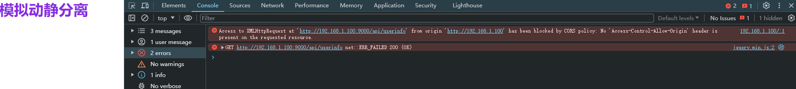

配置 nginx 跨域以及设置请求头如下

```nginx
server {
   listen       9000;
   charset      utf-8;
   server_name  localhost;

   location /api {
       # 设置允许的请求源
       add_header Access-Control-Allow-Origin *;

       # 允许的方法（对于实际请求 GET, POST, 等）
       add_header 'Access-Control-Allow-Methods' 'GET,POST,OPTIONS';

       # 允许的凭证（如果需要Cookie等）
       add_header 'Access-Control-Allow-Credentials' 'true';

       # 允许的头部
       add_header 'Access-Control-Allow-Headers' 'Authorization, Content-Type, X-Requested-With, X-Custom-Header';

       # 专门处理OPTIONS预检请求，浏览器触发 OPTIONS 请求取决于是否为“简单请求”，详细可百度
       if ($request_method = 'OPTIONS') {
        add_header 'Content-Type' 'text/plain; charset=utf-8';
        add_header 'Content-Length' 0;
        return 204;
       }

       proxy_pass  http://192.168.1.3:8888;
   }
}
```

以上就是配置跨域设置以及过程

## 六、压缩

### 6.1、Gzip 压缩

Gzip 是一种古老且广泛支持的压缩算法，用于在服务器端压缩文本类资源（如 HTML, CSS, JS, JSON, XML 等），然后在客户端（浏览器）解压。它能显著减少传输的数据量，提高页面加载速度，节省服务器带宽。

Gzip 是 Nginx 的内置模块（ngx_http_gzip_module），通常默认已编译安装。

一个常见且优化的 Gzip 配置如下（通常放在 nginx.conf 的 http 块中）

```nginx
http {
  # 开启 gzip 压缩
  gzip on; # on | off
  
  # 设置压缩级别，范围 1-9。级别越高压缩比越好，但CPU消耗也越大。推荐折中的 4-6
  gzip_comp_level 6;
  
  # 设置最小压缩阈值，低于此大小的文件不压缩（单位字节）。建议1K，因为小文件压缩后可能更大
  gzip_min_length 1024;
  
  # 设置用于压缩响应的缓冲区数量和大小。一般保持默认即可，如果你的页面很大可以适当增加
  # gzip_buffers 16 8k;
  
  # 设置哪些 MIME 类型的文件需要压缩，`text/html` 类型总是会被压缩。
  gzip_types text/plain text/css application/json application/javascript;
}
```

更多详细的配置可以参考官方详解：https://nginx.org/en/docs/http/ngx_http_gzip_module.html

压缩前可以查看资源大小

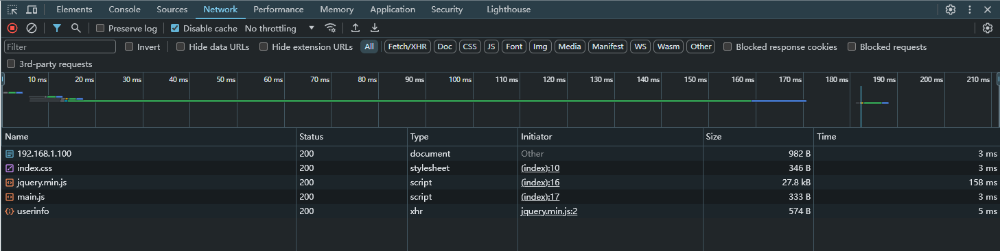

当配置 nginx 的 gzip 压缩之后

```nginx
http {
  # 开启 gzip 压缩
  gzip on; # on | off
  
  gzip_comp_level 5;
}
```

这里只设置 gzip 的两个属性

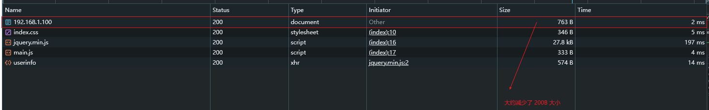

还可以在响应头（Response Headers）中查看到 Content-Encoding: gzip 表示已经成功开启 gzip

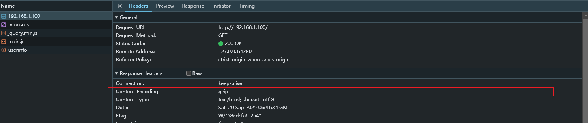

### 6.2、Brotli压缩

nginx 官方版本默认不包含 Brotli 模块，你需要手动编译安装或使用预装了 Brotli 的第三方发行版（如 Google 的 `nginx-brotli` 包）。

如何确保 nginx 是否包含了 `ngx_brotli` 模块，可以通过运行以下命令检查

```bash
nginx -V 2>&1 | grep -o brotli
```

无任何输出时说明未安装 brotli


对于安装 brotli 模块浏览可以参考：https://github.com/google/ngx_brotli，这里使用的 Statically compiled 安装

```bash
git clone --recurse-submodules -j8 https://github.com/google/ngx_brotli
cd ngx_brotli/deps/brotli
mkdir out && cd out
cmake -DCMAKE_BUILD_TYPE=Release -DBUILD_SHARED_LIBS=OFF -DCMAKE_C_FLAGS="-Ofast -m64 -march=native -mtune=native -flto -funroll-loops -ffunction-sections -fdata-sections -Wl,--gc-sections" -DCMAKE_CXX_FLAGS="-Ofast -m64 -march=native -mtune=native -flto -funroll-loops -ffunction-sections -fdata-sections -Wl,--gc-sections" -DCMAKE_INSTALL_PREFIX=./installed ..
cmake --build . --config Release --target brotlienc
cd ../../../..
```

```bash
$ cd nginx-1.x.x # 为 nginx 解压之后的目录
$ export CFLAGS="-m64 -march=native -mtune=native -Ofast -flto -funroll-loops -ffunction-sections -fdata-sections -Wl,--gc-sections"
$ export LDFLAGS="-m64 -Wl,-s -Wl,-Bsymbolic -Wl,--gc-sections"
$ ./configure --add-module=/path/to/ngx_brotli
$ make && make install
```

其中 `--add-module=/path/to/ngx_brotli` 的 `/path/to/ngx_brotli` 为 clone 下来的路径

安装完成之后可以通过命令查看是否成功

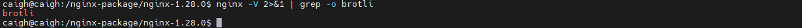

接下来就可以开启 Brotli 压缩，以下是 nginx 配置

```nginx
http {
  # 开启Brotli压缩
  brotli on;

  brotli_comp_level 5;
}
```

但是需要生效还有一个因素就是请求头（Request Headers）设置 `Accept-Encoding：br` 告诉服务器客户端支持 Brotli

所以这里我通过 curl 手动设置请求头进行请求

```bash
curl -H "Accept-Encoding: br" -I http://192.168.1.100/
```

实际示例效果如下

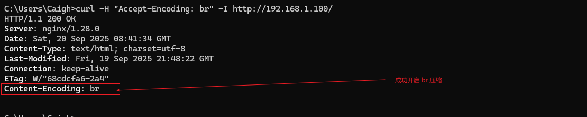

## 七、黑白名单

nginx 黑白名单比较简单，allow 后配置你的白名单，deny 后配置你的黑名单，在实际使用中，我们一般都是建个黑名单和白名单的文件然后再 nginx.copnf 中 incluld 一下，这样保持主配置文件整洁，也好管理。

更新详细配置参考官方说明：https://nginx.org/en/docs/http/ngx_http_access_module.html

官方示例如下

```nginx
location / {
    deny  192.168.1.1;
    allow 192.168.1.0/24;
    allow 10.1.1.0/16;
    allow 2001:0db8::/32;
    deny  all;
}
```

实战效果如下

```nginx
server {
   listen       9000;
   charset      utf-8;
   server_name  localhost;

   location /api {
       # 配置的ip黑名单
       deny 192.168.1.3;

       # 设置允许的请求源
       add_header Access-Control-Allow-Origin *;

       # 允许的方法（对于实际请求 GET, POST, 等）
       add_header 'Access-Control-Allow-Methods' 'GET,POST,OPTIONS';

       # 允许的凭证（如果需要Cookie等）
       add_header 'Access-Control-Allow-Credentials' 'true';

       # 允许的头部
       add_header 'Access-Control-Allow-Headers' 'Authorization, Content-Type, X-Requested-With, X-Custom-Header';

       # 专门处理OPTIONS预检请求，浏览器触发OPTIONS请求取决于是否为 简单请求，详细可百度
       if ($request_method = 'OPTIONS') {
        add_header 'Content-Type' 'text/plain; charset=utf-8';
        add_header 'Content-Length' 0;
        return 204;
       }

       proxy_pass  http://192.168.1.3:8888;
   }
}
```

由于配置了  deny 192.168.1.3; 所以前端访问接口时出现 403 

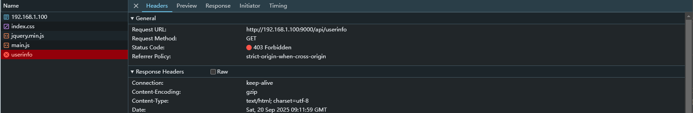

## 八、https配置

### 8.1、nginx添加ngx_http_ssl_module模块

在下载后的压缩包中执行以下命令

```bash
./configure --prefix=/usr/local/nginx --with-http_ssl_module
```

如果发现失败，报 `./configure: error: SSL modules require the OpenSSL library.` 错误时，原因是缺少 OpenSSL ，可以执行以下命令进行安装。

```bash
sudo apt-get update
sudo apt-get install openssl libssl-dev
```

安装完成之后再次执行上述的 `./configure` 命令，执行完成之后需要再次执行 make 命令

```bash
make 

# 后续无需执行 make install，将执行以下命令即可
cp ./objs/nginx /usr/local/nginx/sbin/
```

然后执行 nginx -V 可以看到添加后的 ngx_http_ssl_module 模块

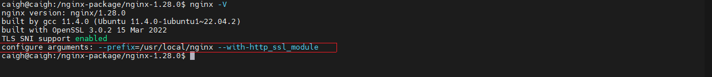

### 8.2、https配置

在配置 https 之前是需要购买一个域名，无论是在 [阿里云](https://www.aliyun.com/) 还是 [腾讯云](https://cloud.tencent.com/) 购买，购买完成之后为域名申请 SSL 证书，申请完成之后就可以下载对应的服务器需要的 SSL 证书文件

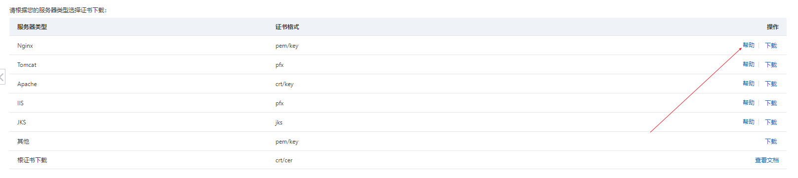

下载完成之后进行解压，解压完成之后会得到以下两个文件


然后可以将以上文件上传到 `/usr/local/nginx/certificate/`，没有 certificate 可以创建，也可以自由创建目录存储

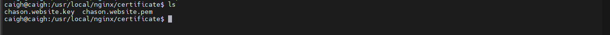

然后可以在 nginx 配置中配置 https 服务

```nginx
  # HTTPS server
server {
   	#SSL 默认访问端口号为 443
    listen       443 ssl;
  	#填写绑定证书的域名 
    server_name  www.chason.website;
		
  	#请填写证书文件的相对路径或绝对路径
    ssl_certificate      /usr/local/nginx/certificate/chason.website.pem;
  	#请填写私钥文件的相对路径或绝对路径
    ssl_certificate_key  /usr/local/nginx/certificate/chason.website.key;

    ssl_session_cache    shared:SSL:1m;
  	#停止通信时，加密会话的有效期，在该时间段内不需要重新交换密钥
    ssl_session_timeout  5m;
		
   	#请按照以下套件配置，配置加密套件，写法遵循 openssl 标准。
    ssl_ciphers  HIGH:!aNULL:!MD5;
  	#开启由服务器决定采用的密码套件
    ssl_prefer_server_ciphers  on;

    location / {
        root   html;
        index  index.html index.htm;
    }
}
```

然后需要在更改本地电脑 hosts 文件作为一个 DNS 简易解析

```tex
192.168.1.100 www.chason.website
```

其中 192.168.1.100 为 nginx 的服务 ip，chason.website 为我购买的域名，然后就可以访问浏览器查看是不是起效

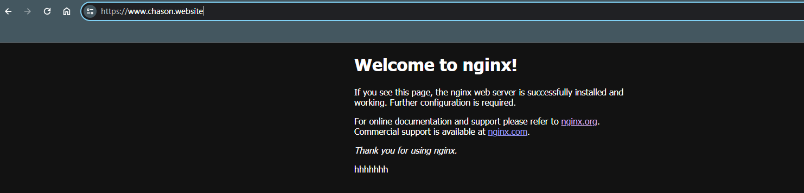

### 8.3、http跳转https

先修改一个 hosts 目录，添加以下内容

```tex
192.168.1.100 example.com
```

然后修改 nginx 配置，配置如下

```nginx
http {
    include       mime.types;
    default_type  application/octet-stream;
    sendfile        on;
    keepalive_timeout  65;

    server {
        listen       80;
        charset      utf-8;
        server_name  example.com;

        #access_log  logs/host.access.log  main;

        location / {
            return 301 https://www.baidu.com;
        }

        #error_page  404              /404.html;
        # redirect server error pages to the static page /50x.html
        #
        error_page   500 502 503 504  /50x.html;
        location = /50x.html {
            root   html;
        }
    }
}
```

这样就实现当访问 http://example.com 跳转到 https://www.baidu.com 中。

## 九、高可用

为了提高系统的可用性和容错能力，可以增加 nginx 服务器的数量，当主服务器发生故障或宕机，备份服务器可以立即充当主服务器进行不间断工作。

高可用原理图解

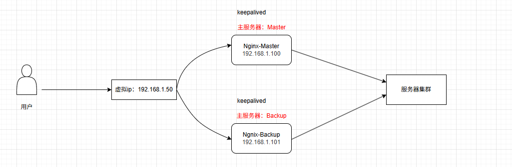

首先需要准备两台 nginx 服务器，ip 分别为 192.168.1.100（Master）、192.168.1.101（Backup），并且 Master 和 Backup 都需要安装 keepalived 

```bash
sudo apt install keepalived -y
```

配置 Master 的配置文件，在 `/etc/keepalived/keepalived.conf` 设置以下配置

```tex
! Configuration File for keepalived

global_defs {
   router_id LVS_DEVEL_NGINX_MASTER  # 唯一标识，每个节点不同
}

vrrp_instance VI_1 {
    state MASTER    # 初始状态，MASTER节点这里设为MASTER
    interface ens33  # 绑定的网卡名称，使用 `ip a` 命令查看
    virtual_router_id 51 # 虚拟路由ID，同一组Keepalived必须相同 (0-255)
    priority 100    # 初始优先级，MASTER要高于BACKUP

    advert_int 1    # Master和Backup之间同步检查的时间间隔（秒）

    authentication {
        auth_type PASS
        auth_pass 1111  # 密码，同一组Keepalived必须相同
    }

    virtual_ipaddress {
        192.168.1.50  # 指定的虚拟VIP
    }
}
```

配置 Backup 的配置文件，在 `/etc/keepalived/keepalived.conf` 设置以下配置

```tex
! Configuration File for keepalived

global_defs {
   router_id LVS_DEVEL_NGINX_BACKUP  # 唯一标识，每个节点不同
}

vrrp_instance VI_1 {
    state BACKUP    # 初始状态，BACKUP节点这里设为BACKUP
    interface ens33  # 绑定的网卡名称，使用 `ip a` 命令查看
    virtual_router_id 51 # 虚拟路由ID，同一组Keepalived必须相同 (0-255)
    priority 90    # 初始优先级，BACKUP要低于MASTER

    advert_int 1    # Master和Backup之间同步检查的时间间隔（秒）

    authentication {
        auth_type PASS
        auth_pass 1111  # 密码，同一组Keepalived必须相同
    }

    virtual_ipaddress {
        192.168.1.50  # 指定的虚拟VIP
    }
}
```

配置过程中可以通过以下命令检查 keepalived.conf 配置是否正确

```bash
sudo keepalived -t -f /etc/keepalived/keepalived.conf
```

🔔若提示 `Configuration file '/etc/keepalived/keepalived.conf' is not a regular non-executable file - skipping` 则是 keepalived.conf 文件权限必须为 644，可用通过以下命令进行配置

```bash
sudo chmod 644 /etc/keepalived/keepalived.conf
```

🔔若提示 `interface eth33 for vrrp_instance VI_1 doesn't exist
Non-existent interface specified in configuration` 则网卡名称对不上

配置完成并且正确之后，对两台 nginx 服务器通过以下命令进行执行

```bash
# 启动 keepalived
sudo systemctl start keepalived

# 启动 nginx
sudo nginx
```

若在执行过程中出现问题，可以通过以下命令查看原因

```bash
sudo journalctl -xeu keepalived.service
```

由此完成 nginx 高可用配置

验证过程如下，执行以下命令

```bash
ping 192.168.1.50 -t
```

在通信过程中，在关掉 Master 主机，然后 keepalived 就会请求超时一次，然后就再次 ping 成功。

